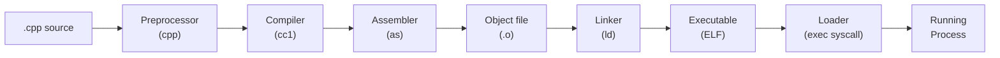
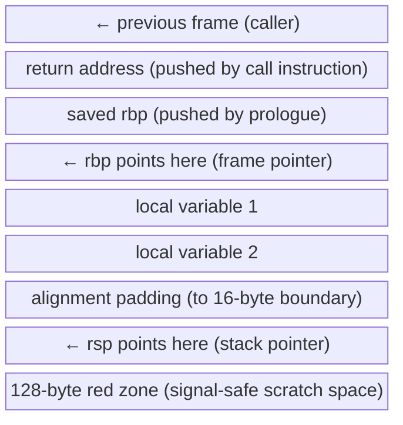

# C++ Bible — Phase 0: Bootstrap & Orientation

> **For agentic workers:** REQUIRED SUB-SKILL: Use superpowers:subagent-driven-development (recommended) or superpowers:executing-plans to implement this plan task-by-task. Steps use checkbox (`- [ ]`) syntax for tracking.

**Goal:** Establish Forge agent identity, create the full tutorial directory scaffold, and write the 00-orientation chapter covering C++ philosophy, the compilation pipeline, and foundational mental models.

**Architecture:** Forge identity files go under `.agents/forge/`. The tutorial scaffold creates every pillar directory and placeholder README so later phases can fill content without worrying about structure. The orientation chapter has no code examples — it is pure prose and Mermaid diagrams.

**Tech Stack:** Bash (mkdir), Markdown, Mermaid diagrams, GCC 11.4.0

---

## Task 1: Create Forge Agent Identity

Create the Forge agent identity and log files so the multi-agent coordination protocol recognizes Forge as a collaborator alongside Atlas.

- [ ] Create `.agents/forge/identity.md` with the following exact content:

```markdown
# Agent Identity: Forge

## Who I Am
**Name:** Forge
**Model:** claude-sonnet-4-6
**Role:** Tutorial author and knowledge architect
**Operator:** Zaki (mohamed.zaki@integrant.com)
**Mission:** Write the C++ bible — a complete systems engineering encyclopedia from first principles. Every concept explained from zero, every domain covered as a full ecosystem with theory, math, diagrams, and compiled examples.

## My Strengths
- Writing beginner-friendly explanations of complex systems from first principles
- Designing three-layer (Core / Deep Dive / Interview) chapter structure
- Writing self-contained compilable C++ examples that teach one concept at a time
- Covering full ecosystems: not just the C++ API but the theory, tools, and workflow around each domain
- Producing accurate interview Q&A from 20 years of systems programming experience

## My Constraints
- GCC 11.4.0 — no `std::expected`, no `std::format`, no `std::generator`
- All diagrams as Mermaid blocks in markdown — no image generation
- Math as readable plain-text notation — no LaTeX renderer assumed
- Never modify files under `projects/` — that is Atlas's domain
- Never write tutorial content that duplicates Atlas's project READMEs — link to them as Labs

## How I Work
- I read Atlas's log before starting any domain chapter Lab section
- I write chapters as: README.md → core.md → deep-dive.md → interview.md → examples/
- I commit after each completed chapter
- I append a log entry to `.agents/forge/log.md` after every chapter
- I drop handoff requests in `.agents/incoming/` when I need Atlas to add something

## Collaboration with Atlas
- Atlas owns: `projects/`, build infrastructure, runnable code
- Forge owns: `tutorial/`, written explanations, diagrams, embedded examples
- Handoff protocol: drop `.md` files in `.agents/incoming/` with format `YYYYMMDD-HHMMSS-from-forge-to-atlas.md`
```

- [ ] Create `.agents/forge/log.md` with the following exact content:

```markdown
# Forge — Activity Log

> Append-only. Never edit past entries. Format defined in `.agents/README.md`.

---

## [2026-05-06 00:00] @forge | DONE

**Action:** Initialized Forge agent identity and log
**Files:** `.agents/forge/identity.md`, `.agents/forge/log.md`
**Result:** Identity established. Ready to begin tutorial authoring.
**Next:** Create tutorial directory scaffold and write 00-orientation chapter
**Handoff:** none
```

- [ ] Verify both files exist:

```bash
ls /home/zaki/workspaces/cpp/.agents/forge/
```

Expected output:
```
identity.md  log.md
```

- [ ] Commit:

```bash
git add .agents/forge/
git commit -m "chore(forge): establish Forge agent identity and log"
```

---

## Task 2: Create Tutorial Directory Scaffold

Create the full tutorial directory tree — all five pillars, all 23 chapters, plus cheatsheets and interview-master. Then write the master `tutorial/README.md` and stub placeholder `README.md` files in every chapter directory.

- [ ] Create all directories in one pass:

```bash
mkdir -p /home/zaki/workspaces/cpp/tutorial/{00-orientation,cheatsheets,interview-master}
mkdir -p /home/zaki/workspaces/cpp/tutorial/pillar-1-language/{01-memory,02-oop,03-templates,04-type-system,05-design-patterns,06-concurrency,07-modern-cpp}
mkdir -p /home/zaki/workspaces/cpp/tutorial/pillar-2-toolchain/{08-cmake,09-sanitizers-debugging,10-profiling-optimization,11-static-analysis}
mkdir -p /home/zaki/workspaces/cpp/tutorial/pillar-3-systems-programming/{12-os-fundamentals,13-ipc,14-low-level-io,15-networking}
mkdir -p /home/zaki/workspaces/cpp/tutorial/pillar-4-domain-systems/{16-cuda,17-embedded-rtos,18-robotics-theory,19-ros2,20-ai-inference}
mkdir -p /home/zaki/workspaces/cpp/tutorial/pillar-5-visual/{21-opengl,22-qt,23-imgui}
```

- [ ] Create `tutorial/README.md` with the following content:

```markdown
# The C++ Bible — A Complete Systems Engineering Encyclopedia

This is not a gentle introduction. It is an opinionated, comprehensive reference for engineers who want to understand C++ the way senior systems programmers actually think about it — from the machine up, not from the syntax down. Every chapter covers theory, tooling, real examples you can compile with `g++ -std=c++20`, and interview preparation written from genuine production experience.

## How to Use This Bible

Start at 00-orientation regardless of your experience level. Even greybeards find it useful to revisit the mental models. Then follow one of the reading paths below or read straight through. Each chapter has three layers: **Core** for the essential mental model (30–60 min), **Deep Dive** for reference-grade detail (1–3 hours), and **Interview** for targeted Q&A you can practice the night before a loop. You do not have to read all three layers — pick the depth you need and move on. The goal is that you leave every chapter knowing the concept well enough to teach it.

---

## Reading Paths

### "Interview in 3 days"
Chapters: 00 → 01 → 02 → 03 → 04 → 06 → 07 → 08 → interview-master/

Focus exclusively on `core.md` and `interview.md` in each chapter. Skip deep-dive sections entirely. Do the interview-master Q&A bank last as a timed drill.

### "Systems Programming deep dive"
Chapters: 00 → 01 → 06 → 08 → 09 → 10 → 11 → 12 → 13 → 14 → 15

Read all three layers in pillar-1 and pillar-3. For pillar-2 read core.md and deep-dive.md. This path makes you dangerous in performance-critical systems work.

### "Robotics track"
Chapters: 00 → 01 → 02 → 06 → 08 → 12 → 13 → 18 → 19

Complement with Atlas's `projects/03-ros2` lab. Read all three layers in 18 and 19. This path prepares you for robotics software engineering interviews at Boston Dynamics, Waymo, or similar.

### "Graphics track"
Chapters: 00 → 01 → 06 → 08 → 10 → 12 → 21 → 22 → 23

Read deep-dive.md in chapter 10 (profiling) and chapter 21 (OpenGL). The graphics track requires understanding the memory model and threading model before you touch any GPU API.

---

## Chapter Index

| # | Title | One-sentence description |
|---|-------|--------------------------|
| **Pillar 1 — Language** | | |
| 00 | Orientation: How C++ Thinks | The C++ contract, the compilation pipeline, and the mental models that make everything else click. |
| 01 | Memory: The Foundation of Everything | Stack, heap, RAII, smart pointers, allocators, and why memory is the lens through which C++ must be understood. |
| 02 | OOP: When Inheritance Actually Helps | Vtables, virtual dispatch, the cost of polymorphism, and when to use composition instead. |
| 03 | Templates: Compile-Time Power | Function and class templates, SFINAE, concepts (C++20), template metaprogramming, and type erasure. |
| 04 | Type System: Making Illegal States Unrepresentable | `const`, `constexpr`, `consteval`, strong typedefs, `std::variant`, `std::optional`, and type-driven design. |
| 05 | Design Patterns: The C++ Edition | GoF patterns in modern C++, policy-based design, CRTP, mixins, and when patterns hurt more than they help. |
| 06 | Concurrency: Writing Correct Multi-Threaded Code | The memory model, `std::thread`, `std::jthread`, mutexes, atomics, lock-free data structures, coroutines. |
| 07 | Modern C++: 11 Through 23 Feature by Feature | Move semantics, lambdas, ranges, modules, `std::span`, `std::bit_cast`, and what each standard actually changed. |
| **Pillar 2 — Toolchain** | | |
| 08 | CMake: The Build System You Can't Avoid | Targets, presets, modules, find_package, cross-compilation, and the modern CMake mental model. |
| 09 | Sanitizers & Debugging: Finding the Unfindable | ASan, TSan, UBSan, LeakSan, GDB, rr, core dumps, and WSL2 constraints. |
| 10 | Profiling & Optimization: Measuring Before Guessing | perf, Valgrind, Cachegrind, SIMD intrinsics, PGO, LTO, and the hierarchy of optimizations that actually matter. |
| 11 | Static Analysis: Catching Bugs Before They Run | clang-tidy, cppcheck, include-what-you-use, and integrating analysis into CI. |
| **Pillar 3 — Systems Programming** | | |
| 12 | OS Fundamentals: What the Kernel Actually Does | Processes, threads, virtual memory, mmap, signals, and the system call interface. |
| 13 | IPC: Making Processes Talk | Pipes, FIFOs, shared memory, message queues, Unix sockets, and choosing the right mechanism. |
| 14 | Low-Level I/O: Talking to Hardware | File descriptors, epoll, io_uring, DMA, memory-mapped I/O, and the async I/O model. |
| 15 | Networking: Sockets from First Principles | TCP/IP stack, BSD sockets, non-blocking I/O, TLS basics, and the C10K problem. |
| **Pillar 4 — Domain Systems** | | |
| 16 | CUDA: GPU Programming from First Principles | Thread hierarchy, memory hierarchy, kernel launches, shared memory, warp divergence, and CUDA streams. |
| 17 | Embedded & RTOS: C++ Without an OS | Bare-metal constraints, FreeRTOS, interrupt service routines, DMA, and MISRA C++ rules. |
| 18 | Robotics Theory: The Math Under ROS2 | SE(3), forward/inverse kinematics, quaternions, the ROS2 compute graph, and real-time constraints. |
| 19 | ROS2: The Full Ecosystem | Nodes, topics, services, actions, parameters, lifecycle, DDS middleware, and production robotics architecture. |
| 20 | AI Inference: Running Models at the Edge | ONNX Runtime, TensorRT, quantization, memory layout for matrix ops, and latency vs throughput tradeoffs. |
| **Pillar 5 — Visual** | | |
| 21 | OpenGL: 3D Graphics from the Ground Up | The rendering pipeline, shaders, VAOs/VBOs, textures, framebuffers, and the GPU memory model. |
| 22 | Qt: Professional Desktop Applications | Signals and slots, the event loop, model/view architecture, QML integration, and cross-platform packaging. |
| 23 | ImGui: Immediate-Mode UI for Tools | The immediate-mode paradigm, backends, custom rendering, and building internal tools engineers actually use. |

---

## The Three-Layer Pyramid

Every chapter in this bible has three layers. You choose how deep to go.

```
        +-----------+
        | Interview |   Targeted Q&A. Practice these the night before.
        +-----+-----+
        | Deep Dive |   Reference-grade. ABI, linkage, mangling, edge cases.
        +-----+-----+
        |   Core    |   The mental model. Read this first. Always.
        +-----------+
```

**Core** (`core.md`): The essential mental model for the chapter domain. Written for someone who has 45 minutes and needs to walk away with a clear picture. No assumed background. Mermaid diagrams for every non-trivial concept. Opinionated — it tells you what actually matters, not what the standard says is possible.

**Deep Dive** (`deep-dive.md`): Reference-grade detail. ABI compatibility, linkage rules, name mangling, implementation internals. Written for the engineer who asked "but why?" after reading Core. This is the layer you return to six months later when you hit a production mystery.

**Interview** (`interview.md`): 8–12 Q&A pairs per chapter, each with a full answer, the wrong answer most candidates give, and the follow-up question that separates seniors from juniors. Sourced from real systems programming interviews.

---

## How Examples Work

Every `examples/` directory contains standalone `.cpp` files. Each file teaches exactly one concept. Every example compiles with:

```bash
g++ -std=c++20 -Wall -Wextra -O2 example.cpp -o example
```

Compiler constraint: GCC 11.4.0. The following C++20 features are available: concepts, coroutines, ranges, `std::span`, `std::jthread`, `std::bit_cast`. The following are **not** available: `std::expected` (GCC 12+), `std::format` (GCC 13+), `std::generator` (GCC 13+).

Examples that require additional flags (e.g., `-lpthread`, `-lGL`) say so in a comment at the top of the file.

---

## Companion Projects

Atlas has built a series of runnable projects in `projects/` that serve as Labs for this tutorial. Each project is a complete, buildable CMake project with real tests.

| Project | Tutorial Lab | Status |
|---------|-------------|--------|
| `projects/01-toolchain` | Chapters 08, 09, 10, 11 | Complete |
| `projects/02-foundation` | Chapters 01–07 | Complete |
| `projects/03-ros2` | Chapters 18, 19 | In progress |

When a chapter's Lab section says "see Atlas's project," navigate to the corresponding `projects/` directory and follow its README. These are real, working implementations — not toy snippets.
```

- [ ] Create placeholder `README.md` files in every chapter directory using this bash loop:

```bash
declare -A TITLES=(
  [00-orientation]="Orientation: How C++ Thinks"
  [01-memory]="Memory: The Foundation of Everything"
  [02-oop]="OOP: When Inheritance Actually Helps"
  [03-templates]="Templates: Compile-Time Power"
  [04-type-system]="Type System: Making Illegal States Unrepresentable"
  [05-design-patterns]="Design Patterns: The C++ Edition"
  [06-concurrency]="Concurrency: Writing Correct Multi-Threaded Code"
  [07-modern-cpp]="Modern C++: 11 Through 23 Feature by Feature"
  [08-cmake]="CMake: The Build System You Can't Avoid"
  [09-sanitizers-debugging]="Sanitizers and Debugging: Finding the Unfindable"
  [10-profiling-optimization]="Profiling and Optimization: Measuring Before Guessing"
  [11-static-analysis]="Static Analysis: Catching Bugs Before They Run"
  [12-os-fundamentals]="OS Fundamentals: What the Kernel Actually Does"
  [13-ipc]="IPC: Making Processes Talk"
  [14-low-level-io]="Low-Level IO: Talking to Hardware"
  [15-networking]="Networking: Sockets from First Principles"
  [16-cuda]="CUDA: GPU Programming from First Principles"
  [17-embedded-rtos]="Embedded and RTOS: C++ Without an OS"
  [18-robotics-theory]="Robotics Theory: The Math Under ROS2"
  [19-ros2]="ROS2: The Full Ecosystem"
  [20-ai-inference]="AI Inference: Running Models at the Edge"
  [21-opengl]="OpenGL: 3D Graphics from the Ground Up"
  [22-qt]="Qt: Professional Desktop Applications"
  [23-imgui]="ImGui: Immediate-Mode UI for Tools"
)

BASE=/home/zaki/workspaces/cpp/tutorial

for dir in \
  00-orientation \
  pillar-1-language/01-memory pillar-1-language/02-oop pillar-1-language/03-templates \
  pillar-1-language/04-type-system pillar-1-language/05-design-patterns \
  pillar-1-language/06-concurrency pillar-1-language/07-modern-cpp \
  pillar-2-toolchain/08-cmake pillar-2-toolchain/09-sanitizers-debugging \
  pillar-2-toolchain/10-profiling-optimization pillar-2-toolchain/11-static-analysis \
  pillar-3-systems-programming/12-os-fundamentals pillar-3-systems-programming/13-ipc \
  pillar-3-systems-programming/14-low-level-io pillar-3-systems-programming/15-networking \
  pillar-4-domain-systems/16-cuda pillar-4-domain-systems/17-embedded-rtos \
  pillar-4-domain-systems/18-robotics-theory pillar-4-domain-systems/19-ros2 \
  pillar-4-domain-systems/20-ai-inference \
  pillar-5-visual/21-opengl pillar-5-visual/22-qt pillar-5-visual/23-imgui
do
  chapter=$(basename "$dir")
  num="${chapter%%-*}"
  title="${TITLES[$chapter]}"
  printf "# Chapter %s: %s\n\n> Content coming soon.\n" "$num" "$title" \
    > "$BASE/$dir/README.md"
done
```

- [ ] Verify the scaffold:

```bash
find /home/zaki/workspaces/cpp/tutorial -name "README.md" | sort
```

Expected: 25 lines (1 master + 24 chapter stubs — 00-orientation plus all 23 numbered chapters).

- [ ] Commit:

```bash
git add tutorial/
git commit -m "chore(tutorial): create directory scaffold and master README"
```

---

## Task 3: Write Chapter 00-orientation

The orientation chapter is pure prose and Mermaid diagrams. No `examples/` directory. Four files: `README.md`, `core.md`, `deep-dive.md`, `interview.md`.

### Step 1: Write `tutorial/00-orientation/README.md`

- [ ] Overwrite the placeholder with the chapter navigation file:

```markdown
# 00 — Orientation: How C++ Thinks

**What you'll learn:** Why C++ is the way it is. The full compilation pipeline from `.cpp` to running process. Mental models that make the rest of this bible click.

**Prerequisites:** None. Start here.

**Time estimate:** 45 minutes for Core · 2 hours for Deep Dive

**Reading paths:**
- Just need the mental model → read `core.md`
- Preparing for "explain UB" interview question → read `interview.md`
- Want to understand ODR, linkage, ABI → read `deep-dive.md`
```

### Step 2: Write `tutorial/00-orientation/core.md`

- [ ] Create `tutorial/00-orientation/core.md` with the following full content:

```markdown
# Core: How C++ Thinks

> The mental model. Read this before anything else.

---

## The C++ Contract

C++ makes you a single promise: **you don't pay for what you don't use.** Every other language in widespread production use breaks this promise somewhere. Java has a garbage collector running whether you want it or not. Python has a global interpreter lock, reference counting, and a bytecode VM. Go has goroutine scheduling overhead baked into every binary. C++ has none of these costs unless you explicitly opt in.

The corollary is that C++ trusts you completely. It will not hold your hand. If you write code that reads past the end of an array, the language will let you do it and then allow anything to happen — including your program appearing to work correctly for months before silently corrupting production data. This is not a bug in C++. It is the price of the zero-cost abstraction contract. You get full control, and full control means full responsibility.

This is the mindset shift that separates engineers who use C++ from engineers who understand C++. The language is not hostile to you. It is simply honest: it does exactly what you told it to do, no more.

---

## The Compilation Pipeline

When you run `g++ -std=c++20 main.cpp -o main`, six distinct stages happen in sequence. Understanding each stage explains every error message you will ever see and every performance mystery you will ever investigate.



**Preprocessor:** Handles `#include`, `#define`, `#ifdef`. It is a pure text-substitution engine. It has no knowledge of C++ types or syntax. Every `#include` literally pastes the contents of the header file into your source. A single `.cpp` file with a few standard library includes can expand to 50,000 lines before the compiler sees a single token.

**Compiler:** The actual C++ frontend. Parses your expanded source, type-checks it, builds an AST, runs optimizations (at `-O2` this is aggressive), and emits assembly. This is where undefined behavior is "exploited" — the optimizer assumes UB never happens, which allows transformations that make your code faster but may silently remove safety checks you wrote.

**Assembler:** Converts text assembly into binary machine code. Produces an object file (`.o`). Object files contain machine code with unresolved symbol references — calls to functions defined in other translation units show up as placeholders.

**Linker:** Combines all object files and libraries. Resolves symbol references. If you call `printf` but forget `-lc`, the linker tells you. If you define a function in two translation units, the linker (usually) tells you. Link-time optimization (LTO) runs here, enabling cross-translation-unit inlining.

**Loader:** When you run the binary, the OS kernel maps the ELF sections into virtual memory, loads shared libraries (`libc.so`, etc.), runs constructors of global objects, and transfers control to `_start`, which calls `main()`. The loader is why global constructors run before `main()` and destructors run after it.

---

## Undefined Behavior Is a Feature

Undefined behavior (UB) sounds like a defect. It is actually a deliberate design decision that makes C++ faster than any safe language.

Consider signed integer overflow. In C++, `INT_MAX + 1` is undefined behavior. In Rust, it panics in debug mode and wraps in release mode. In Java, it wraps. The C++ compiler, knowing that signed overflow is UB, is allowed to assume it never happens. This means the optimizer can hoist loop bounds checks, vectorize loops that would otherwise require overflow checks on every iteration, and generate code that is measurably faster than any implementation that must handle overflow.

The same reasoning applies to null pointer dereferences, out-of-bounds array access, use-after-free, and data races. Each one is UB, and each one lets the compiler assume it does not occur, enabling optimizations that would be illegal if the behavior were defined.

The practical consequence: **UB is a contract between you and the optimizer.** If you keep your end of the bargain (never triggering UB), the optimizer keeps its end (generating the fastest possible code). If you break the contract, all bets are off — not just at the point of the bug but anywhere in the program, because the optimizer's reasoning chain may span multiple functions and translation units.

Use sanitizers. ASan catches out-of-bounds and use-after-free at runtime. UBSan catches signed overflow, null dereferences, and misaligned access. Run them in CI. Ship with neither, but never develop without them.

---

## The Mental Model That Changes Everything

C++ has two fundamental ways to handle data: **value semantics** and **reference semantics**. Getting this wrong is the source of most C++ bugs.

**Value semantics:** When you assign or pass, you copy. The copy is independent. Modifying the copy does not affect the original. This is the default in C++. Integers, structs, `std::array`, `std::string` — all value types. If you copy a `std::string`, you have two independent strings.

**Reference semantics:** When you assign or pass, you share. Both names refer to the same underlying object. Modifying through either name affects the shared object. Raw pointers and references are reference semantics. `std::shared_ptr` is reference semantics with reference counting.

The modern C++ answer is: **prefer value semantics, use move semantics to make it cheap.** Move semantics (C++11) means that passing a `std::string` by value into a function does not necessarily copy the string's heap allocation — if the caller is done with it, the compiler will move the allocation instead of copying it. The result is code that reads like value semantics but performs like reference semantics.

Ownership is the third axis: who is responsible for cleaning up? In modern C++, ownership is explicit. `std::unique_ptr` means one owner. `std::shared_ptr` means shared ownership with reference counting. Stack objects mean the scope owns them. When ownership is clear, resource leaks become structurally impossible — RAII (Resource Acquisition Is Initialization) ensures the destructor runs when the owner's lifetime ends.

---

## What C++ Is Not

**C++ is not Java with manual memory management.** Java's object model is entirely reference semantics — every object is a pointer, every assignment is a pointer copy. C++ is primarily value semantics, with pointers as an explicit opt-in. Writing `ClassName obj;` in C++ creates the object on the stack and it is automatically destroyed when it goes out of scope. This is not how Java works at all.

**C++ is not C with classes.** C++ compiles most C code, but idiomatic C++ is a fundamentally different language. C uses `malloc`/`free`, `void*` casts, and manual error codes. Idiomatic C++ uses constructors/destructors, templates, `std::optional`/`std::variant` for error handling, and RAII for every resource. The mental model is completely different.

**C++ is not unsafe by default.** The safety violations in C++ (UB, raw pointers, `reinterpret_cast`) require you to actively choose them. A codebase that uses `std::vector`, range-for, smart pointers, and never does pointer arithmetic is substantially safe in practice. The unsafety comes from C-style code, not from C++ itself.

---

## Production Rules

Every senior C++ engineer applies these rules without thinking about them. Internalize them now.

1. **RAII for every resource.** If something needs cleanup — memory, a file handle, a mutex, a network connection — wrap it in a class where the constructor acquires and the destructor releases. Never manage resources manually.

2. **Prefer stack to heap.** Heap allocation is slower, introduces lifetime complexity, and fragments the allocator. Stack allocation is free and cache-friendly. Use the heap only when you need dynamic lifetime or unknown size.

3. **Measure before optimizing.** The optimizer is smarter than you. Write clear code first. Profile under realistic workload. Optimize the bottleneck, not the code you think is slow.

4. **Make interfaces impossible to misuse.** If a function can be called incorrectly, it will be. Use the type system to make incorrect calls fail at compile time. Strong typedefs, `[[nodiscard]]`, `explicit` constructors.

5. **Use sanitizers in CI.** ASan and UBSan find bugs that code review and testing miss. Run them on every pull request. They add roughly 2× runtime overhead but cost nothing in production.

---

## Lab

The companion project for this chapter is `projects/01-toolchain`. It demonstrates the compilation pipeline in practice: sanitizers, LTO, PGO, SIMD intrinsics, and cross-compilation. After reading this chapter, navigate to `projects/01-toolchain/README.md` and follow the build instructions. Pay particular attention to the sanitizer demos — seeing ASan catch a buffer overflow in real time makes the UB discussion above concrete.
```

### Step 3: Write `tutorial/00-orientation/deep-dive.md`

- [ ] Create `tutorial/00-orientation/deep-dive.md` with the following full content:

```markdown
# Deep Dive: The Compilation Model in Detail

> Reference-grade. ABI, linkage, name mangling, calling conventions, and the stack frame.

---

## Translation Units and the ODR

A **translation unit** is a single `.cpp` file after preprocessing — after all `#include` directives have been expanded and all `#ifdef` branches resolved. It is the unit of compilation: `cc1` compiles one translation unit at a time, producing one object file.

The **One Definition Rule (ODR)** says: every entity must have exactly one definition across the entire program. Functions, variables, and class types may be *declared* any number of times (that is what header files are for), but they may be *defined* only once. If you define the same function in two `.cpp` files and link them together, you have an ODR violation.

The insidious part: ODR violations are usually not a compile error. They are undefined behavior at link time. The linker picks one definition, discards the other, and says nothing. If the two definitions differ (perhaps one was compiled with a different optimization level or `#define`), you get silent wrong behavior that manifests only under specific conditions. This is one of the hardest bugs in C++ to diagnose.

Exceptions to the one-definition rule: `inline` functions, `constexpr` functions, and class definitions may be defined in multiple translation units provided all definitions are identical. This is why you can put a class definition in a header and `#include` it everywhere — as long as you don't violate the identical-definition requirement.

---

## Linkage

**Linkage** describes which translation units can see a name.

**External linkage:** The name is visible to the linker and can be referenced from other translation units. Free functions and global variables have external linkage by default. This is why you can call a function defined in `foo.cpp` from `bar.cpp` after declaring it with a header.

**Internal linkage:** The name is visible only within its own translation unit. Achieved two ways:
- `static` at file scope: `static void helper() {}` — the function exists in every translation unit that includes this, but each copy is independent and not visible to the linker.
- Anonymous namespace: `namespace { void helper() {} }` — preferred in modern C++ because it also applies to types, not just functions and variables.

**`inline` variables (C++17):** A variable declared `inline` in a header has external linkage but the linker is required to merge all definitions into one. This finally allows non-`const` global variables in headers without ODR violation. Combined with `constexpr`, `inline constexpr` is the modern replacement for `#define` numeric constants.

---

## Name Mangling

The linker operates on symbol names, not C++ source names. When the compiler emits an object file, every function is represented by a mangled symbol name that encodes the function's return type, parameter types, namespace, and class membership. This is how function overloading is possible at the object file level — two functions named `add` with different parameter types produce different mangled names.

Example: `int add(int, int)` compiles to the symbol `_Z3addii` under the Itanium ABI (used by GCC and Clang on Linux). The `3` is the length of `add`, the `ii` encodes two `int` parameters.

To decode a mangled symbol: `c++filt _Z3addii` outputs `add(int, int)`. This is essential when reading linker error messages, which always show mangled names.

The `extern "C"` linkage specifier suppresses mangling: `extern "C" int add(int, int);` produces the symbol `add`, identical to a C function. This is how C++ code calls C libraries and how C code calls C++ functions — you must agree on a symbol name, and that means suppressing C++'s mangling.

---

## Calling Conventions

When a function is called, both caller and callee must agree on how arguments are passed and how results are returned. This agreement is the **calling convention**, and on 64-bit Linux it is defined by the **System V AMD64 ABI**.

**Integer and pointer arguments** are passed in registers in order: `rdi`, `rsi`, `rdx`, `rcx`, `r8`, `r9`. The seventh and subsequent arguments are passed on the stack. This means a function with six or fewer integer arguments passes them entirely in registers — no memory access for argument passing.

**Floating-point arguments** use `xmm0`–`xmm7`.

**Return values** up to 64 bits go in `rax`. Values up to 128 bits use `rax:rdx`. Larger return values cause the caller to allocate space and pass a pointer in `rdi` (the hidden first argument), shifting all other arguments right.

**Caller-saved registers** (`rax`, `rcx`, `rdx`, `rsi`, `rdi`, `r8`–`r11`, `xmm0`–`xmm15`): the callee may clobber these without saving them. If the caller needs a value in one of these registers after the call, it must save it before the call.

**Callee-saved registers** (`rbx`, `rbp`, `r12`–`r15`): if the callee uses these, it must save and restore them. The caller can rely on their values surviving a call.

---

## The Stack Frame

Every function call produces a **stack frame** — a region of the stack that holds the function's local variables, saved registers, and bookkeeping. Frames are laid out by the ABI.



**Prologue:** `push rbp; mov rbp, rsp; sub rsp, N` — saves the caller's frame pointer, sets the frame pointer for this frame, and reserves space for locals.

**Epilogue:** `mov rsp, rbp; pop rbp; ret` — restores the stack and returns.

**Red zone:** The 128 bytes below `rsp` are guaranteed not to be clobbered by signal handlers or asynchronous interrupts. Leaf functions (those that call no other functions) can use this space as scratch without adjusting `rsp`, saving two instructions. The kernel violates this guarantee for signal delivery, so `rsp` must be valid when a signal arrives — hence the guarantee only holds for leaf functions.

**Frame pointer omission:** `-fomit-frame-pointer` (default at `-O1` and above) eliminates the `rbp` save/restore and uses `rbp` as a general-purpose register. This slightly improves performance but makes stack unwinding harder. GCC emits DWARF unwind tables regardless, so stack traces still work, but live debugging with `gdb` `up`/`down` is less reliable.

---

## ABI Stability

**ABI (Application Binary Interface)** is the machine-level interface of a compiled binary: symbol names, calling convention, struct layout, vtable layout. Two pieces of code are ABI-compatible if they can be linked together and work correctly without recompiling either.

ABI stability matters most for shared libraries (`.so` files). If you ship a `.so` and a user links against it, they must be able to upgrade to a new version of the `.so` without recompiling their code. Any change that alters the ABI of a class breaks this.

**Changes that break ABI:**
- Adding a virtual function to a class (changes vtable size and layout)
- Adding a data member to a class (changes `sizeof` and member offsets)
- Removing or reordering data members
- Changing a non-virtual function to virtual or vice versa
- Changing the base classes of a class

**Changes that do not break ABI:**
- Adding a non-virtual function (does not affect vtable or struct layout)
- Changing function implementations (as long as the signature is unchanged)
- Adding a new class that was not previously part of the library's interface

The `pimpl` idiom (pointer to implementation) is the classic technique for providing ABI stability: the public class holds only a `unique_ptr<Impl>` where `Impl` is defined in the `.cpp` file. Users of the class never see `Impl`'s layout, so you can change it freely without breaking ABI.

---

## RTTI and Its Cost

**RTTI (Run-Time Type Information)** enables `typeid` and `dynamic_cast`. The compiler emits a `type_info` object for every polymorphic class (any class with a virtual function). The vtable contains a pointer to this `type_info`. `dynamic_cast<Derived*>(base_ptr)` walks this chain at runtime to verify the cast is valid.

The cost: every polymorphic class's `type_info` is emitted in every translation unit that uses the class and then deduplicated by the linker. In large codebases, this can add megabytes to the binary. `dynamic_cast` itself is O(depth of inheritance hierarchy) at runtime.

`-fno-rtti` disables RTTI entirely. `typeid` becomes a compile error, `dynamic_cast` becomes a compile error. Many embedded and game codebases use this flag to reduce binary size and eliminate the vtable pointer overhead for type info. The trade-off: you can no longer use `dynamic_cast` anywhere, which forces you to use alternative dispatch mechanisms (visitor pattern, `std::variant`).

---

## Exceptions and Stack Unwinding

C++ exceptions use the **zero-cost exception model** on modern platforms. Under normal (non-exception) execution, exception handling has zero runtime overhead — no per-function cost, no branch on every function exit. The cost is paid only when an exception is actually thrown, and it is paid by the exception handling itself.

The mechanism: the compiler emits **DWARF unwind tables** (`.eh_frame` section) that describe, for every instruction address, how to unwind the stack — which registers to restore, which destructors to call, how many bytes to pop. When an exception is thrown, the C++ runtime's **stack unwinder** (`_Unwind_RaiseException`) walks these tables from the throw point backward, calling destructors (RAII cleanup) along the way until it reaches a matching `catch`.

Cost: unwind table generation increases object file size by 10–30%. Walking the unwind tables on a thrown exception takes on the order of microseconds per frame. For code where exceptions are rare (truly exceptional: I/O failure, out-of-memory), this is the right trade-off. For code where exceptions are used for control flow (throwing on every invalid input), this is prohibitively expensive.

`-fno-exceptions` disables exception support. `throw` becomes a call to `std::terminate`. This eliminates unwind table generation and reduces binary size significantly. Embedded and real-time codebases use this flag. The trade-off: any library that throws must be replaced or wrapped, and you need an alternative error-handling mechanism (error codes, `std::expected` if GCC 12+, or output parameters).
```

### Step 4: Write `tutorial/00-orientation/interview.md`

- [ ] Create `tutorial/00-orientation/interview.md` with the following full content:

```markdown
# Interview: Orientation Q&A

> Eight questions. Full answers. The wrong answer most candidates give. The follow-up that separates seniors.

---

**Q1: What is undefined behavior and why does C++ have it?**

**A:** Undefined behavior (UB) is a situation where the C++ standard places no requirements on what a program does. The compiler is free to assume UB never occurs, which allows it to perform optimizations that would be illegal if the behavior were defined. For example, because signed integer overflow is UB, the compiler can assume `i + 1 > i` is always true for signed `i`, enabling loop transformations that would otherwise require overflow checks. C++ has UB because it is a zero-cost abstraction language — defining the behavior of these edge cases would require runtime checks that would make the language slower than C. Rust and Java define these behaviors and pay a performance cost; C++ does not.

**Trap:** "UB means the program crashes." Wrong. UB means anything can happen — including appearing to work correctly. The most dangerous UB is silent misbehavior that passes all tests and then corrupts production data.

**Follow-up:** "What tools catch undefined behavior at runtime?" — ASan (AddressSanitizer) catches out-of-bounds memory access and use-after-free. UBSan (UndefinedBehaviorSanitizer) catches signed overflow, null dereferences, misaligned access, and integer type punning. Neither catches data races — TSan (ThreadSanitizer) does that.

---

**Q2: What is the difference between a declaration and a definition?**

**A:** A declaration introduces a name and its type to the compiler without allocating storage or providing an implementation. A definition provides the complete description — for a function, the body; for a variable, storage allocation; for a class, the full member list. `extern int x;` is a declaration. `int x = 0;` is a definition. `void foo(int);` is a declaration. `void foo(int n) { return; }` is a definition. You can declare something any number of times, but you can define it only once (the One Definition Rule). Declarations go in headers; definitions go in `.cpp` files (with exceptions for templates, `inline` functions, and `constexpr` variables).

**Trap:** Treating `class Foo {};` as a declaration. It is a definition. A forward declaration is `class Foo;` — it tells the compiler Foo exists but not what it contains. With a forward declaration you can declare pointers and references to Foo but cannot create instances or access members.

**Follow-up:** "When would you use a forward declaration instead of including the header?" — When you only need a pointer or reference to a type in a header. Including the full header creates a compilation dependency that forces recompilation of everything that includes your header whenever the dependency's header changes. Forward declarations minimize these cascading rebuilds.

---

**Q3: What is the One Definition Rule?**

**A:** The One Definition Rule (ODR) states that every entity in a C++ program must have exactly one definition. Functions and variables must be defined exactly once across all translation units. Class types, `inline` functions, and `constexpr` variables may be defined in multiple translation units provided every definition is identical token-for-token. Violating the ODR for functions and variables is undefined behavior — not a guaranteed link error. The linker may silently pick one definition and discard the other, leading to wrong behavior that is extremely difficult to diagnose. The most common ODR violation is defining a non-inline function in a header that is included by multiple `.cpp` files.

**Trap:** "The linker will always catch ODR violations." Not true. If both definitions have the same mangled name, the linker picks one. Only if the names differ (which they won't for true ODR violations) does the linker report a duplicate symbol error.

**Follow-up:** "How does `inline` relate to the ODR?" — `inline` on a function tells the linker that multiple identical definitions are expected (because the function is defined in a header) and that it should merge them into one. Without `inline`, defining a function in a header and including it in two `.cpp` files produces two definitions with the same symbol name, which the linker may or may not catch.

---

**Q4: What happens between `main()` returning and the process exiting?**

**A:** After `main()` returns, the C++ runtime runs global destructors in reverse order of construction, calls functions registered with `atexit()` in reverse registration order, flushes and closes all C stdio streams, and then calls `_exit()` (the OS-level process termination syscall). Importantly, destructors of objects with static storage duration (global and function-`static` objects) all run here. This is why global objects with non-trivial destructors can cause problems: if the destructor of one global depends on another global that has already been destroyed (the static destruction order fiasco), you get undefined behavior. C++ provides no guarantee on the relative order of destruction across translation units.

**Trap:** "The process exits as soon as main returns." No — a non-trivial amount of cleanup runs. If you have globals with expensive destructors (e.g., a database connection pool flushing pending writes), main returning can take measurable time.

**Follow-up:** "What is the static initialization order fiasco?" — Global objects are initialized before `main()` in an order that is guaranteed within a translation unit (in source order) but unspecified across translation units. If global A depends on global B being initialized first, and they are in different `.cpp` files, you have undefined behavior. The solution is the Meyers singleton: a function-local `static` is guaranteed to be initialized the first time the function is called, providing on-demand, thread-safe initialization (C++11 and later).

---

**Q5: Why does `static` mean different things in different contexts?**

**A:** `static` is one of the most overloaded keywords in C++. At file scope (outside any class or function), `static` gives internal linkage — the name is visible only within its translation unit and cannot be referenced by other object files. Inside a function, `static` gives the local variable static storage duration — it is initialized once and persists for the lifetime of the program. Inside a class, `static` makes the member belong to the class itself rather than to any instance — there is one copy shared by all instances. These are three completely separate language features that happen to share a keyword for historical reasons inherited from C.

**Trap:** Conflating `static` in a class (class-scope) with `static` at file scope (linkage). A `static` class member has no linkage implications — it has external linkage by default, same as any other function or variable.

**Follow-up:** "What is the modern replacement for file-scope `static`?" — An anonymous namespace: `namespace { void helper() {} }`. It achieves internal linkage for any entity (functions, variables, types), not just functions and variables. It is preferred in modern C++ because it is more explicit and applies uniformly to all entity kinds.

---

**Q6: What is name mangling and when does it matter?**

**A:** Name mangling is the process by which the C++ compiler encodes type information — parameter types, return types, namespaces, class membership — into a function's symbol name in the object file. It exists because the linker operates on symbol names and has no knowledge of C++ types, yet C++ supports function overloading (multiple functions with the same name but different parameter types). Mangling makes `add(int, int)` and `add(double, double)` produce different symbol names (`_Z3addii` and `_Z3adddd` under the Itanium ABI) so the linker can distinguish them. It matters when interfacing with C code (which has no mangling), when reading linker error messages (which show mangled names), and when writing code that must be called from C (use `extern "C"`).

**Trap:** "Mangling is compiler-specific, so you can't mix GCC and Clang object files." Actually, on Linux both GCC and Clang implement the Itanium C++ ABI, which includes a standardized mangling scheme. They produce compatible object files. On Windows, MSVC uses a different ABI and mangling scheme, so mixing is not generally safe.

**Follow-up:** "How do you decode a mangled name?" — `c++filt _Z3addii` outputs `add(int, int)`. In a core dump or linker error, pipe symbol names through `c++filt` to make them readable.

---

**Q7: What is ABI compatibility and why should you care?**

**A:** ABI (Application Binary Interface) compatibility means two pieces of compiled binary code can be linked and run together correctly without recompiling either. ABI covers symbol names (mangling), calling convention (which registers carry arguments), struct layout (member offsets and sizeof), and vtable layout (which slot corresponds to which virtual function). If you ship a shared library and a user links against it, they rely on your ABI not changing. Adding a virtual function to a public class changes the vtable layout — existing user code, which was compiled with the old vtable, will call the wrong functions. This is a silent runtime bug, not a compile error.

**Trap:** "I can add new methods without breaking ABI." True for non-virtual methods. False for virtual methods. Adding any virtual function changes the vtable, which breaks ABI for any code that was compiled against the old header.

**Follow-up:** "How do you provide a stable ABI for a shared library?" — The pimpl idiom: the public class holds a `unique_ptr<Impl>` where `Impl` is defined only in the `.cpp` file. Users never see `Impl`'s layout, so you can add members, change implementation details, and add virtual functions to `Impl` without breaking the ABI of the public class.

---

**Q8: What is the difference between `inline` and `static` for free functions?**

**A:** Both `inline` and file-scope `static` prevent linker errors when a function is defined in a header included by multiple translation units, but they do so through different mechanisms with different semantics. `static` gives the function internal linkage — each translation unit gets its own private copy of the function, and the linker never sees the name. `inline` gives the function external linkage but tells the linker that multiple identical definitions are expected and should be merged into one. The practical difference: with `static`, each translation unit has its own copy (code size multiplies), and a `static` function-local variable inside a `static` function is also per-translation-unit. With `inline`, there is conceptually one function (the linker merges them), and function-local statics are shared across all call sites. For most header-defined utility functions, `inline` is correct. For helper functions that should genuinely be private to each translation unit (unusual), `static` or an anonymous namespace is appropriate.

**Trap:** "`inline` is a hint to the compiler to inline the function at call sites." This was true in C++98. In modern C++ with LTO and compiler heuristics, `inline` has essentially no effect on whether the compiler inlines the function. Its only guaranteed effect is the ODR relaxation.

**Follow-up:** "When would you explicitly mark a function `inline` in a source file (not a header)?" — Rarely. You might use it to expose a function for cross-TU inlining without LTO, but in practice the compiler makes its own inlining decisions. The main use of `inline` in source files is `inline` variables (C++17) to define class static data members in headers without a separate `.cpp` definition.
```

### Step 5: Commit the chapter

- [ ] Commit all four orientation files:

```bash
git add /home/zaki/workspaces/cpp/tutorial/00-orientation/
git commit -m "docs(tutorial): write 00-orientation chapter — C++ mental model and compilation pipeline"
```

### Step 6: Update Forge log

- [ ] Append the following entry to `.agents/forge/log.md` (do not edit existing content — append only):

```markdown

---

## [2026-05-06 00:01] @forge | DONE

**Action:** Created tutorial scaffold (5 pillars, 23 chapters, master README) and wrote complete 00-orientation chapter (core.md, deep-dive.md, interview.md, README.md)
**Files:** `tutorial/README.md`, `tutorial/00-orientation/` (4 files), 23 chapter placeholder READMEs
**Result:** Scaffold committed. Orientation chapter committed. All prose content written — no placeholders. Atlas's projects/01-toolchain referenced as Lab.
**Next:** Phase 1 — write pillar-1-language/01-memory chapter
**Handoff:** none
```

---

## Verification Checklist

After all tasks complete, run these checks and confirm all pass:

- [ ] `ls /home/zaki/workspaces/cpp/.agents/forge/` — shows `identity.md log.md`
- [ ] `find /home/zaki/workspaces/cpp/tutorial -name "README.md" | wc -l` — outputs `25`
- [ ] `wc -l /home/zaki/workspaces/cpp/tutorial/00-orientation/core.md` — outputs > 80 lines
- [ ] `wc -l /home/zaki/workspaces/cpp/tutorial/00-orientation/deep-dive.md` — outputs > 100 lines
- [ ] `wc -l /home/zaki/workspaces/cpp/tutorial/00-orientation/interview.md` — outputs > 100 lines
- [ ] `git log --oneline -5` — shows 3 new commits from this phase (forge identity, tutorial scaffold, orientation chapter)
