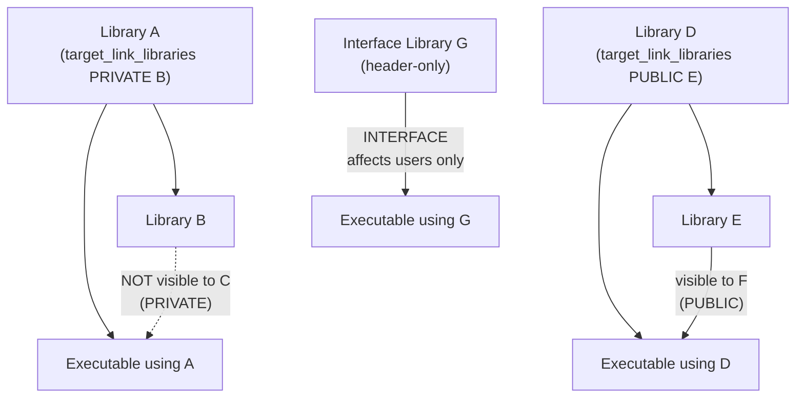
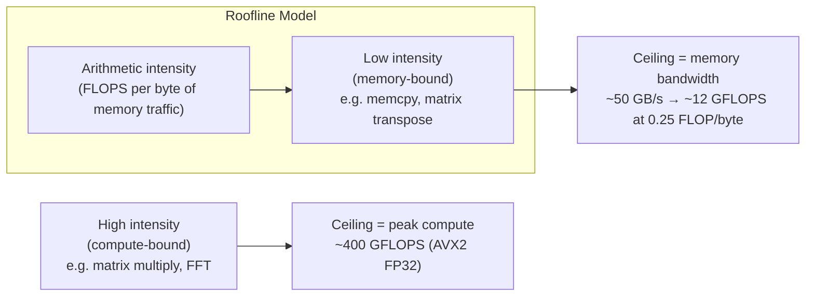

# C++ Bible — Phase 2: Toolchain Pillar

> **For agentic workers:** REQUIRED SUB-SKILL: Use superpowers:subagent-driven-development (recommended) or superpowers:executing-plans to implement this plan task-by-task. Steps use checkbox (`- [ ]`) syntax for tracking.

**Goal:** Write the 4 toolchain chapters (08-cmake through 11-static-analysis) covering build systems, debugging, profiling, and automated code quality.

**Architecture:** Each chapter follows the three-layer pyramid (core.md / deep-dive.md / interview.md). Toolchain chapters have examples that are bash scripts, CMakeLists.txt snippets, and C++ files designed to demonstrate sanitizer/profiler behavior. Labs link to projects/01-toolchain.

**Tech Stack:** GCC 11.4.0, CMake 4.3.2 (via pip3), clang-tidy, ASan/UBSan/TSan, perf, Mermaid diagrams.

**CMake PATH note:** CMake is installed via pip3. Prefix all cmake commands with:
`export PATH="$(python3 -c 'import cmake; print(cmake.CMAKE_BIN_DIR)'):$PATH"`

---

## Task 1: Chapter 08-cmake

Tutorial path: `tutorial/pillar-2-toolchain/08-cmake/`

### Step 1.1 — Create directory structure

- [ ] Create directory structure

```bash
mkdir -p /home/zaki/workspaces/cpp/tutorial/pillar-2-toolchain/08-cmake/examples/modern_cmake_demo/{include/demo,src,tests}
```

### Step 1.2 — Write README.md

- [ ] Create `/home/zaki/workspaces/cpp/tutorial/pillar-2-toolchain/08-cmake/README.md`

```markdown
# Chapter 08: CMake — Build System Mastery

**What you'll learn:** How modern CMake works, why target-based design replaced directory-based design, how CMakePresets.json eliminates environment inconsistency, and how to integrate package managers.

**Prerequisites:** Basic C++ compilation familiarity. Understanding of what a linker does.

**Time estimate:** Core = 30 min. Deep Dive = 2 hours. Interview = 30 min.

**Reading paths:**
- Interview prep only: `interview.md`
- First-time CMake user: `core.md` → `examples/cmake_patterns.md` → Lab
- Deep reference: `core.md` → `deep-dive.md` → examples

**Lab:** `projects/01-toolchain/` — full CMakePresets.json with debug/asan/tsan/ubsan/coverage/pgo presets and shared modules in `cmake/modules/`.
```

### Step 1.3 — Write core.md

- [ ] Create `/home/zaki/workspaces/cpp/tutorial/pillar-2-toolchain/08-cmake/core.md`

```markdown
# CMake Core — The 20% That Covers 80%

## Targets Are Everything

Modern CMake has one organizing principle: the **target**. A target is a named build artifact — an executable, a static library, a shared library, or an interface (header-only) library. Every property (include directories, compile flags, linked libraries, compile definitions) belongs to a target, not to a directory.

This matters because targets compose. When target B links to target A, B automatically inherits everything A said it provides via `PUBLIC` or `INTERFACE`. There is no global state to pollute. There are no order-of-directory-traversal surprises. You add a target, you describe what it needs and what it provides, and CMake figures out the rest.

Before target-based CMake (circa 2.8 era), the idiom was directory-level commands:

```cmake
# OLD — DO NOT DO THIS
include_directories(${PROJECT_SOURCE_DIR}/include)
link_libraries(pthread)
add_definitions(-DUSE_FEATURE_X)
```

These commands affect every target defined after them in that directory and all subdirectories. The build mutates global state. Linking one library accidentally drags in its compile flags for your entire project. The modern equivalent:

```cmake
# NEW — do this
add_library(mylib STATIC src/mylib.cpp)
target_include_directories(mylib PUBLIC include/)
target_link_libraries(mylib PUBLIC pthread)
target_compile_definitions(mylib PRIVATE USE_FEATURE_X)
```

Now `include/` and `pthread` propagate to dependents automatically. `USE_FEATURE_X` stays private.

## The Three Visibility Levels

Every `target_*` command takes a visibility keyword. Getting this right is the difference between a modular CMake project and a spaghetti build.



**PRIVATE:** The dependency is an implementation detail. Consumers of this target do not inherit it.
- Use when: a library uses Boost internally but does not expose Boost types in its headers.

**PUBLIC:** The dependency is part of the interface. Consumers automatically inherit it.
- Use when: a library's headers `#include` another library's headers. That other library must be PUBLIC.

**INTERFACE:** Applies only to consumers, not to this target's own compilation. Used for header-only libraries.
- Use when: creating an alias or header-only library that just passes requirements to users.

## Presets Eliminate "Works on My Machine"

`CMakePresets.json` (introduced in CMake 3.19, v3 schema works with CMake 3.22+) is a declarative configuration file committed to the repository. It replaces `cmake -DCMAKE_BUILD_TYPE=Debug -DENABLE_SANITIZER_ADDRESS=ON -B build/asan` with:

```bash
cmake --preset asan
cmake --build --preset asan
ctest --preset asan
```

Every developer, CI server, and container runs identical configure commands. The preset file encodes inheritance (`"inherits": "base"`), so a `debug` preset and an `asan` preset share a common `base` without repeating the generator, binary directory, or export settings.

Key schema fields:
- `"binaryDir"` — where the build tree goes (e.g., `"${sourceDir}/build/${presetName}"`)
- `"generator"` — `"Unix Makefiles"` or `"Ninja"` (prefer Ninja when available)
- `"cacheVariables"` — equivalent to `-D` flags on the command line

## Package Management in 2026

C++ has no single canonical package manager. The landscape in 2026:

| Tool | Model | Best for |
|---|---|---|
| **CPM.cmake** | CMake script, FetchContent-based | Small projects, reproducible builds via SHA pinning |
| **vcpkg** | Microsoft-maintained, port tree | Windows-first teams, Visual Studio integration |
| **Conan 2.0** | Python-based, generator files | Large enterprises, complex dependency graphs |
| **FetchContent** (built-in) | Downloads at configure time | Simple deps, zero external tooling |

For interview purposes: know that the community has not converged, know the tradeoffs, and know how `FetchContent_Declare` + `FetchContent_MakeAvailable` works since it is the CMake-native approach.

## Production Rules

1. Never use directory-level commands (`include_directories`, `link_libraries`, `add_definitions`).
2. Always specify visibility (`PRIVATE`/`PUBLIC`/`INTERFACE`) — no exceptions.
3. Commit `CMakePresets.json`. Never commit `CMakeCache.txt` or the `build/` directory.
4. Use `cmake_minimum_required(VERSION 3.22)` as your floor for preset v3 support.
5. Use `gtest_discover_tests(target DISCOVERY_MODE PRE_TEST)` — sanitized binaries cannot run at configure time.
6. Enable `CMAKE_EXPORT_COMPILE_COMMANDS` in the base preset — tools like clang-tidy need it.
7. Never use `GLOB` for source files — it silently misses new files added after configure.
8. Prefer `target_compile_features(mytarget PRIVATE cxx_std_20)` over hardcoding `-std=c++20`.

## Lab

Open `projects/01-toolchain/` in this workspace. Relevant files:
- `CMakePresets.json` — 14 presets including debug, asan, tsan, ubsan, coverage, pgo-generate, pgo-use, clang-tidy, cross-arm-linux
- `cmake/modules/Sanitizers.cmake` — `target_apply_sanitizers()` function
- `cmake/modules/StandardVersion.cmake` — `require_cpp20()` with INTERFACE detection
- `cmake/modules/StaticAnalyzers.cmake` — clang-tidy integration

Run the full test suite under ASan:
```bash
export PATH="$(python3 -c 'import cmake; print(cmake.CMAKE_BIN_DIR)'):$PATH"
cd projects/01-toolchain
cmake --preset asan
cmake --build --preset asan
ctest --preset asan --output-on-failure
```
```

### Step 1.4 — Write deep-dive.md

- [ ] Create `/home/zaki/workspaces/cpp/tutorial/pillar-2-toolchain/08-cmake/deep-dive.md`

```markdown
# CMake Deep Dive — Full Reference

## Modern Target-Based CMake

The three target types and when to use each:

```cmake
# STATIC: archived .o files. No runtime dependency.
add_library(mylib STATIC src/impl.cpp)

# SHARED: .so/.dll. Loaded at runtime. Consumers need it present.
add_library(mylib SHARED src/impl.cpp)

# INTERFACE: no compiled output. Used for header-only libraries.
add_library(mylib INTERFACE)
target_include_directories(mylib INTERFACE include/)
target_compile_features(mylib INTERFACE cxx_std_20)
```

Alias targets allow you to create namespaced references that mirror what `find_package` produces:
```cmake
add_library(MyProject::mylib ALIAS mylib)
# Now consumers can write: target_link_libraries(foo PRIVATE MyProject::mylib)
```

## CMakePresets.json v3 Schema

Version 3 supports CMake 3.22+. Key sections:

```json
{
  "version": 3,
  "configurePresets": [
    {
      "name": "base",
      "hidden": true,
      "generator": "Unix Makefiles",
      "binaryDir": "${sourceDir}/build/${presetName}",
      "cacheVariables": {
        "CMAKE_EXPORT_COMPILE_COMMANDS": "ON"
      }
    },
    {
      "name": "debug",
      "inherits": "base",
      "displayName": "Debug",
      "cacheVariables": {
        "CMAKE_BUILD_TYPE": "Debug"
      }
    }
  ],
  "buildPresets": [
    { "name": "debug", "configurePreset": "debug" }
  ],
  "testPresets": [
    {
      "name": "debug",
      "configurePreset": "debug",
      "output": { "outputOnFailure": true }
    }
  ]
}
```

`${sourceDir}` — the directory containing `CMakePresets.json`.
`${presetName}` — the preset name, useful for naming the binary dir.
`hidden: true` — preset cannot be selected directly; used as a base for inheritance only.

## Generator Expressions

Generator expressions are evaluated at build time, not configure time. Written as `$<...>`. Used in target properties, compile options, and install paths.

```cmake
# Apply flag only in Debug builds
target_compile_options(mylib PRIVATE $<$<CONFIG:Debug>:-fsanitize=address>)

# Different behavior per target type
target_compile_definitions(mylib
  INTERFACE $<INSTALL_INTERFACE:MYLIB_INSTALLED>
  PRIVATE   $<BUILD_INTERFACE:MYLIB_BUILDING>
)

# Conditional on feature support
target_compile_options(mylib PRIVATE
  $<$<CXX_COMPILER_ID:GNU>:-Wall -Wextra>
  $<$<CXX_COMPILER_ID:Clang>:-Weverything>
)
```

Common generator expression categories:
- `$<CONFIG:Debug>` — true when build type is Debug
- `$<TARGET_FILE:tgt>` — path to built binary for target tgt
- `$<CXX_COMPILER_ID:GNU>` — true when compiler is GCC
- `$<BOOL:var>` — 0 or 1 based on variable truth value

## find_package: Config Mode vs Module Mode

CMake's `find_package(Foo)` searches in two modes:

**Config mode (preferred):** Looks for `FooConfig.cmake` or `foo-config.cmake` in known install prefixes. Modern libraries install these files. When found, you get namespaced targets: `Foo::Foo`, `Foo::bar`, etc. This is the right way.

```cmake
find_package(GTest REQUIRED)
target_link_libraries(mytests PRIVATE GTest::gtest_main)
```

**Module mode (legacy):** CMake ships with `FindFoo.cmake` files for common libraries (OpenSSL, Threads, Boost). These set variables like `FOO_INCLUDE_DIRS` and `FOO_LIBRARIES`. Used when the upstream library does not install a config file.

```cmake
find_package(Threads REQUIRED)
target_link_libraries(mylib PRIVATE Threads::Threads)
# Note: modern FindThreads.cmake does provide a target
```

Force one mode explicitly:
```cmake
find_package(Foo CONFIG REQUIRED)   # only config mode
find_package(Foo MODULE REQUIRED)   # only module mode
```

## FetchContent vs ExternalProject

**FetchContent** (CMake 3.11+): Downloads and integrates a dependency at configure time. The dependency's `CMakeLists.txt` is processed in the same CMake invocation. You get full target access.

```cmake
include(FetchContent)
FetchContent_Declare(
  googletest
  GIT_REPOSITORY https://github.com/google/googletest.git
  GIT_TAG        v1.14.0
)
set(gtest_force_shared_crt ON CACHE BOOL "" FORCE)
FetchContent_MakeAvailable(googletest)
# GTest::gtest_main is now a real target
```

**ExternalProject** (CMake 2.8+): Downloads and builds a dependency as a separate CMake invocation at build time. Used when the dependency has its own incompatible build system, or when you need to cross-compile it separately.

```cmake
include(ExternalProject)
ExternalProject_Add(libsodium
  URL      https://example.com/libsodium-1.0.18.tar.gz
  URL_HASH SHA256=...
  CONFIGURE_COMMAND ./configure --prefix=<INSTALL_DIR>
  BUILD_COMMAND     make -j$(nproc)
  INSTALL_COMMAND   make install
)
```

Key difference: FetchContent gives you targets immediately; ExternalProject gives you a build step, and you must manually create imported targets pointing at the installed artifacts.

## Toolchain Files for Cross-Compilation

A toolchain file overrides compiler detection. Pass it via `CMakePresets.json` or `-DCMAKE_TOOLCHAIN_FILE=`:

```cmake
# arm-linux-gnueabihf.cmake
set(CMAKE_SYSTEM_NAME  Linux)
set(CMAKE_SYSTEM_PROCESSOR arm)

find_program(CMAKE_C_COMPILER   arm-linux-gnueabihf-gcc REQUIRED)
find_program(CMAKE_CXX_COMPILER arm-linux-gnueabihf-g++ REQUIRED)

set(CMAKE_FIND_ROOT_PATH_MODE_PROGRAM NEVER)
set(CMAKE_FIND_ROOT_PATH_MODE_LIBRARY ONLY)
set(CMAKE_FIND_ROOT_PATH_MODE_INCLUDE ONLY)
```

CMake then calls the cross compiler for all targets. `find_program` still uses the host; `find_library` uses the sysroot.

## Unity Builds and Precompiled Headers

**Unity builds** combine multiple `.cpp` files into one compilation unit, reducing compilation time by parsing common headers once.

```cmake
set_target_properties(mylib PROPERTIES UNITY_BUILD ON)
# Or per target:
target_sources(mylib PRIVATE UNITY_GROUP "group1" src/a.cpp src/b.cpp)
```

**Precompiled headers** (PCH) compile a header once and reuse the binary across translation units:

```cmake
target_precompile_headers(mylib PRIVATE
  <vector>
  <string>
  <memory>
  "include/mylib/common.hpp"
)
```

Both are compile-time optimizations. Unity builds can break code with anonymous namespaces or static variables with the same name across files. PCH is safer but provides less speedup.

## cmake --install and CPack Packaging

The install interface separates build-tree paths from install-tree paths:

```cmake
install(TARGETS mylib
  EXPORT  MyLibTargets
  ARCHIVE DESTINATION lib
  LIBRARY DESTINATION lib
  RUNTIME DESTINATION bin
  INCLUDES DESTINATION include
)
install(DIRECTORY include/ DESTINATION include)
install(EXPORT MyLibTargets
  FILE      MyLibTargets.cmake
  NAMESPACE MyLib::
  DESTINATION lib/cmake/MyLib
)
```

Run: `cmake --install build/release --prefix /usr/local`

CPack generates installers (`.deb`, `.rpm`, `.tar.gz`, NSIS on Windows):

```cmake
include(CPack)
set(CPACK_PACKAGE_NAME "MyLib")
set(CPACK_PACKAGE_VERSION "1.0.0")
set(CPACK_GENERATOR "TGZ;DEB")
```

Run: `cd build/release && cpack`
```

### Step 1.5 — Write interview.md

- [ ] Create `/home/zaki/workspaces/cpp/tutorial/pillar-2-toolchain/08-cmake/interview.md`

```markdown
# CMake Interview Questions

---

**Q: What is the difference between PRIVATE, PUBLIC, and INTERFACE in target_link_libraries?**

**A:** These visibility keywords control transitive dependency propagation. PRIVATE means the dependency is an implementation detail — consumers of this target do not inherit it. PUBLIC means the dependency is part of this target's public interface — consumers automatically inherit it. INTERFACE applies only to consumers, not to this target's own build — used for header-only libraries that pass requirements through without compiling anything themselves. Getting this right prevents accidental transitive dependencies from polluting downstream targets.

**Trap:** Many candidates say "PRIVATE is for private headers and PUBLIC is for public headers." This is backwards thinking — the keyword controls what *consumers inherit*, not where headers live.

**Follow-up:** If library A links B with PUBLIC, and executable C links A, does C get B? Yes — PUBLIC propagates transitively.

---

**Q: What is the difference between find_package config mode and module mode?**

**A:** Config mode looks for a `FooConfig.cmake` file installed by the library itself — modern libraries provide this, and it gives you properly namespaced imported targets like `Foo::Foo`. Module mode runs a `FindFoo.cmake` file bundled with CMake, which sets legacy variables like `FOO_INCLUDE_DIRS` and `FOO_LIBRARIES`. Config mode is always preferred when available because it gives you real targets with correct transitive dependencies. Module mode exists for older libraries that predate the config-file convention.

**Trap:** Candidates often forget that `find_package` tries config mode first by default and falls back to module mode. You can force one with `CONFIG` or `MODULE` keywords.

**Follow-up:** How do you write your own config file for a library? You use `install(EXPORT ...)` and `configure_package_config_file()`.

---

**Q: What do generator expressions solve, and give an example?**

**A:** Generator expressions are evaluated at build time rather than configure time. They solve the problem of needing different values depending on the build configuration, compiler, or target type — information not fully known at configure time. A common example: `$<$<CONFIG:Debug>:-fsanitize=address>` applies the sanitizer flag only in Debug builds without needing separate if/else logic. Another: `$<TARGET_FILE:mytarget>` gives the full path to the built binary, used in custom commands that depend on the output.

**Trap:** Candidates try to use generator expressions in `if()` conditions, which does not work — they evaluate to the literal string `$<...>` at configure time.

**Follow-up:** Can you use generator expressions in `add_custom_command`? Yes — `COMMAND` and `DEPENDS` accept them.

---

**Q: What is the difference between FetchContent and ExternalProject?**

**A:** FetchContent downloads and integrates a dependency at configure time, processing its CMakeLists.txt as part of the current build. You get real CMake targets immediately and can use them with `target_link_libraries`. ExternalProject builds a dependency as a separate CMake invocation at build time, which is necessary when the dependency has an incompatible build system (Autotools, plain make) or needs cross-compilation with different flags. ExternalProject does not give you real targets — you must manually create imported targets pointing at the installed artifacts.

**Trap:** Using ExternalProject when FetchContent would work, then being confused why the targets are not available at configure time.

**Follow-up:** What happens if two FetchContent dependencies require different versions of the same library? The first one wins (first-to-populate wins). This is a real problem that package managers solve better.

---

**Q: What problem does CMakePresets.json solve?**

**A:** It standardizes configure, build, and test invocations across all machines. Before presets, developers would use custom shell scripts, README instructions, or just type long cmake commands with many -D flags — each person's environment was slightly different. CMakePresets.json is committed to the repository and encodes all presets with their generator, binary directory, and cache variables. CI, Docker containers, and every developer use identical commands: `cmake --preset asan && cmake --build --preset asan && ctest --preset asan`. It also supports inheritance so a dozen presets can share a common base without repetition.

**Trap:** Candidates confuse CMakePresets.json (committed, shared) with CMakeUserPresets.json (gitignored, personal overrides).

**Follow-up:** What CMake version does preset schema version 3 require? CMake 3.22.

---

**Q: What is a unity build and what are its tradeoffs?**

**A:** A unity build combines multiple `.cpp` files into a single compilation unit. This reduces compilation time because the compiler parses common headers (like `<string>`, `<vector>`, system headers) only once instead of once per file. The speedup can be dramatic — 2–5x — for large projects with many headers. The tradeoffs: anonymous namespaces and static variables with the same name in different files will conflict. Some macro definitions in one file can accidentally affect another. Unity builds can also hide missing includes (a file that should include X works because another file in the unit included it). Enable with `set_target_properties(target PROPERTIES UNITY_BUILD ON)`.

**Trap:** Candidates say unity builds are always better. They are build-time optimizations that can break code.

**Follow-up:** Is unity build the same as precompiled headers? No — PCH compiles a header once and reuses the binary; unity build merges source files together.

---

**Q: Why is GLOB dangerous for listing source files in CMake?**

**A:** `file(GLOB SOURCES src/*.cpp)` captures all matching files at configure time. If you add a new `.cpp` file to the directory, CMake does not know to re-run — it only re-runs when `CMakeLists.txt` changes. Your new file silently never gets compiled. The fix is to list source files explicitly in `CMakeLists.txt`. This is a real source of confusion where "I added the file but my changes are not running." CMake 3.12 added `CONFIGURE_DEPENDS` to work around this, but it forces a slow glob check on every build.

**Trap:** Candidates defend GLOB for convenience. The correct answer is: explicit file lists, or `CONFIGURE_DEPENDS` as a compromise.

**Follow-up:** Is there a tool to help manage explicit source lists? Some teams use scripts or IDE integrations. The real answer is that the pain of explicit lists drives adoption of modular libraries where each library is small.

---

**Q: What is the difference between add_custom_command and add_custom_target?**

**A:** `add_custom_command` generates a file as a build step and participates in dependency tracking — if its output file is out of date relative to its inputs, it re-runs. It must be associated with a target (via `DEPENDS`) to be built. `add_custom_target` is always out of date and always runs when built — it has no output file tracking. Use `add_custom_command` for code generation (protobuf, GLSL compilation) where you want incremental builds. Use `add_custom_target` for utility commands like running tests, formatting, or generating documentation where you always want the action to run.

**Trap:** Using `add_custom_target` for code generation and being confused why it re-runs even when inputs have not changed, or using `add_custom_command` for a utility target and being confused why it never runs.

**Follow-up:** How do you make a custom command run before a specific target builds? Use the `PRE_BUILD` or `PRE_LINK` step in `add_custom_command(TARGET ...)`.
```

### Step 1.6 — Write examples

- [ ] Create `/home/zaki/workspaces/cpp/tutorial/pillar-2-toolchain/08-cmake/examples/modern_cmake_demo/CMakeLists.txt`

```cmake
cmake_minimum_required(VERSION 3.22)
project(modern_cmake_demo VERSION 1.0.0 LANGUAGES CXX)

# -----------------------------------------------------------------------
# Header-only math library: INTERFACE target (no compiled source)
# -----------------------------------------------------------------------
add_library(demo_math INTERFACE)
target_include_directories(demo_math INTERFACE
    $<BUILD_INTERFACE:${CMAKE_CURRENT_SOURCE_DIR}/include>
    $<INSTALL_INTERFACE:include>
)
target_compile_features(demo_math INTERFACE cxx_std_20)

# -----------------------------------------------------------------------
# Executable that uses the library
# -----------------------------------------------------------------------
add_executable(demo_main src/main.cpp)
target_link_libraries(demo_main PRIVATE demo_math)

# -----------------------------------------------------------------------
# GoogleTest via FetchContent
# -----------------------------------------------------------------------
include(FetchContent)
FetchContent_Declare(
    googletest
    GIT_REPOSITORY https://github.com/google/googletest.git
    GIT_TAG        v1.14.0
)
set(gtest_force_shared_crt ON CACHE BOOL "" FORCE)
FetchContent_MakeAvailable(googletest)

# -----------------------------------------------------------------------
# Tests
# -----------------------------------------------------------------------
enable_testing()
include(GoogleTest)

add_executable(demo_tests tests/test_math.cpp)
target_link_libraries(demo_tests PRIVATE demo_math GTest::gtest_main)
# DISCOVERY_MODE PRE_TEST: sanitized binaries cannot run at configure time
gtest_discover_tests(demo_tests DISCOVERY_MODE PRE_TEST)
```

- [ ] Create `/home/zaki/workspaces/cpp/tutorial/pillar-2-toolchain/08-cmake/examples/modern_cmake_demo/CMakePresets.json`

```json
{
  "version": 3,
  "configurePresets": [
    {
      "name": "base",
      "hidden": true,
      "generator": "Unix Makefiles",
      "binaryDir": "${sourceDir}/build/${presetName}",
      "cacheVariables": {
        "CMAKE_EXPORT_COMPILE_COMMANDS": "ON"
      }
    },
    {
      "name": "debug",
      "inherits": "base",
      "displayName": "Debug",
      "cacheVariables": {
        "CMAKE_BUILD_TYPE": "Debug"
      }
    },
    {
      "name": "asan",
      "inherits": "base",
      "displayName": "AddressSanitizer",
      "cacheVariables": {
        "CMAKE_BUILD_TYPE": "Debug",
        "CMAKE_CXX_FLAGS": "-fsanitize=address,leak -fno-omit-frame-pointer -g",
        "CMAKE_EXE_LINKER_FLAGS": "-fsanitize=address,leak"
      }
    }
  ],
  "buildPresets": [
    { "name": "debug", "configurePreset": "debug" },
    { "name": "asan",  "configurePreset": "asan"  }
  ],
  "testPresets": [
    {
      "name": "debug",
      "configurePreset": "debug",
      "output": { "outputOnFailure": true }
    },
    {
      "name": "asan",
      "configurePreset": "asan",
      "output": { "outputOnFailure": true }
    }
  ]
}
```

- [ ] Create `/home/zaki/workspaces/cpp/tutorial/pillar-2-toolchain/08-cmake/examples/modern_cmake_demo/include/demo/math.hpp`

```cpp
#pragma once
#include <concepts>
#include <numeric>
#include <span>
#include <stdexcept>

namespace demo {

// Greatest common divisor — Euclidean algorithm
template <std::integral T>
constexpr T gcd(T a, T b) noexcept {
    while (b != T{0}) {
        a = std::exchange(b, a % b);
    }
    return a;
}

// Least common multiple — derived from GCD
template <std::integral T>
constexpr T lcm(T a, T b) {
    if (a == T{0} || b == T{0}) return T{0};
    return (a / gcd(a, b)) * b;
}

// Dot product of two equal-length spans
template <std::floating_point T>
constexpr T dot(std::span<const T> a, std::span<const T> b) {
    if (a.size() != b.size())
        throw std::invalid_argument("dot: spans must have equal size");
    T result{};
    for (std::size_t i = 0; i < a.size(); ++i)
        result += a[i] * b[i];
    return result;
}

// Clamp value to [lo, hi]
template <typename T>
constexpr T clamp(T value, T lo, T hi) noexcept {
    return value < lo ? lo : (value > hi ? hi : value);
}

} // namespace demo
```

- [ ] Create `/home/zaki/workspaces/cpp/tutorial/pillar-2-toolchain/08-cmake/examples/modern_cmake_demo/src/main.cpp`

```cpp
#include "demo/math.hpp"
#include <array>
#include <iostream>

int main() {
    // GCD and LCM
    std::cout << "gcd(48, 18) = " << demo::gcd(48, 18) << "\n";  // 6
    std::cout << "lcm(4, 6)   = " << demo::lcm(4, 6)   << "\n";  // 12

    // Dot product
    std::array<double, 3> a{1.0, 2.0, 3.0};
    std::array<double, 3> b{4.0, 5.0, 6.0};
    std::cout << "dot([1,2,3],[4,5,6]) = "
              << demo::dot<double>(a, b) << "\n";  // 32

    // Clamp
    std::cout << "clamp(150, 0, 100) = "
              << demo::clamp(150, 0, 100) << "\n";  // 100

    return 0;
}
```

- [ ] Create `/home/zaki/workspaces/cpp/tutorial/pillar-2-toolchain/08-cmake/examples/modern_cmake_demo/tests/test_math.cpp`

```cpp
#include "demo/math.hpp"
#include <gtest/gtest.h>
#include <array>

TEST(GCD, KnownValues) {
    EXPECT_EQ(demo::gcd(48, 18), 6);
    EXPECT_EQ(demo::gcd(0, 5),   5);
    EXPECT_EQ(demo::gcd(7, 7),   7);
    EXPECT_EQ(demo::gcd(13, 4),  1);
}

TEST(LCM, KnownValues) {
    EXPECT_EQ(demo::lcm(4, 6),  12);
    EXPECT_EQ(demo::lcm(0, 5),   0);
    EXPECT_EQ(demo::lcm(7, 7),   7);
}

TEST(Dot, ThreeDimensional) {
    std::array<double, 3> a{1.0, 2.0, 3.0};
    std::array<double, 3> b{4.0, 5.0, 6.0};
    EXPECT_DOUBLE_EQ(demo::dot<double>(a, b), 32.0);
}

TEST(Dot, MismatchThrows) {
    std::array<double, 2> a{1.0, 2.0};
    std::array<double, 3> b{1.0, 2.0, 3.0};
    EXPECT_THROW(demo::dot<double>(a, b), std::invalid_argument);
}

TEST(Clamp, BelowLo) { EXPECT_EQ(demo::clamp(-5, 0, 10), 0);  }
TEST(Clamp, InRange) { EXPECT_EQ(demo::clamp(5,  0, 10), 5);  }
TEST(Clamp, AboveHi) { EXPECT_EQ(demo::clamp(15, 0, 10), 10); }
```

- [ ] Create `/home/zaki/workspaces/cpp/tutorial/pillar-2-toolchain/08-cmake/examples/cmake_patterns.md`

```markdown
# CMake Patterns Cheat-Sheet

The 10 patterns every senior C++ developer uses daily.

## 1. Header-only INTERFACE library

```cmake
add_library(myheaders INTERFACE)
target_include_directories(myheaders INTERFACE include/)
target_compile_features(myheaders INTERFACE cxx_std_20)
```

## 2. Static library with correct visibility

```cmake
add_library(mylib STATIC src/impl.cpp)
target_include_directories(mylib
    PUBLIC  include/          # propagates to consumers
    PRIVATE src/              # internal only
)
target_link_libraries(mylib PUBLIC  some_public_dep
                             PRIVATE some_internal_dep)
```

## 3. Executable with feature requirement

```cmake
add_executable(myapp src/main.cpp)
target_link_libraries(myapp PRIVATE mylib)
target_compile_features(myapp PRIVATE cxx_std_20)
```

## 4. GoogleTest with FetchContent and PRE_TEST discovery

```cmake
include(FetchContent)
FetchContent_Declare(googletest
    GIT_REPOSITORY https://github.com/google/googletest.git
    GIT_TAG        v1.14.0)
FetchContent_MakeAvailable(googletest)

add_executable(mytests tests/test_foo.cpp)
target_link_libraries(mytests PRIVATE GTest::gtest_main mylib)
enable_testing()
include(GoogleTest)
gtest_discover_tests(mytests DISCOVERY_MODE PRE_TEST)
```

## 5. Sanitizer flags via generator expression

```cmake
option(ENABLE_ASAN "Enable AddressSanitizer" OFF)
if(ENABLE_ASAN)
    target_compile_options(mylib PRIVATE
        -fsanitize=address,leak -fno-omit-frame-pointer -g)
    target_link_options(mylib PRIVATE -fsanitize=address,leak)
endif()
```

## 6. Platform-specific compile options

```cmake
target_compile_options(mylib PRIVATE
    $<$<CXX_COMPILER_ID:GNU>:   -Wall -Wextra -Wpedantic>
    $<$<CXX_COMPILER_ID:Clang>: -Weverything -Wno-c++98-compat>
    $<$<PLATFORM_ID:Windows>:   /W4 /WX>
)
```

## 7. install() with config-file package support

```cmake
install(TARGETS mylib EXPORT MyLibTargets
    ARCHIVE DESTINATION lib
    INCLUDES DESTINATION include)
install(DIRECTORY include/ DESTINATION include)
install(EXPORT MyLibTargets
    FILE      MyLibTargets.cmake
    NAMESPACE MyLib::
    DESTINATION lib/cmake/MyLib)
```

## 8. Custom code-generation command (protobuf style)

```cmake
add_custom_command(
    OUTPUT  ${CMAKE_BINARY_DIR}/generated/foo.pb.cc
            ${CMAKE_BINARY_DIR}/generated/foo.pb.h
    COMMAND protoc --cpp_out=${CMAKE_BINARY_DIR}/generated
                   ${CMAKE_SOURCE_DIR}/proto/foo.proto
    DEPENDS ${CMAKE_SOURCE_DIR}/proto/foo.proto
    COMMENT "Compiling protobuf schema"
)
add_library(foo_proto STATIC ${CMAKE_BINARY_DIR}/generated/foo.pb.cc)
```

## 9. clang-tidy integration

```cmake
find_program(CLANG_TIDY_EXE clang-tidy)
if(CLANG_TIDY_EXE)
    set(CMAKE_CXX_CLANG_TIDY "${CLANG_TIDY_EXE};--warnings-as-errors=*")
endif()
```

Or per-target only:
```cmake
set_target_properties(mylib PROPERTIES CXX_CLANG_TIDY "${CLANG_TIDY_EXE}")
```

## 10. Precompiled headers for faster builds

```cmake
target_precompile_headers(mylib PRIVATE
    <vector>
    <string>
    <memory>
    <unordered_map>
    "include/mylib/common.hpp"
)
# Share PCH between targets (avoids recompiling the PCH):
target_precompile_headers(myapp REUSE_FROM mylib)
```

---

Build commands for the modern_cmake_demo:
```bash
export PATH="$(python3 -c 'import cmake; print(cmake.CMAKE_BIN_DIR)'):$PATH"
cmake --preset debug
cmake --build --preset debug
ctest --preset debug --output-on-failure

# Run under AddressSanitizer:
cmake --preset asan
cmake --build --preset asan
ctest --preset asan --output-on-failure
```
```

### Step 1.7 — Commit

- [ ] Commit chapter 08-cmake

```bash
cd /home/zaki/workspaces/cpp
git add tutorial/pillar-2-toolchain/08-cmake/
git commit -m "docs(tutorial): write 08-cmake chapter — modern target-based CMake, presets, packages"
```

---

## Task 2: Chapter 09-sanitizers-debugging

Tutorial path: `tutorial/pillar-2-toolchain/09-sanitizers-debugging/`

### Step 2.1 — Create directory structure

- [ ] Create directory structure

```bash
mkdir -p /home/zaki/workspaces/cpp/tutorial/pillar-2-toolchain/09-sanitizers-debugging/examples
```

### Step 2.2 — Write README.md

- [ ] Create `/home/zaki/workspaces/cpp/tutorial/pillar-2-toolchain/09-sanitizers-debugging/README.md`

```markdown
# Chapter 09: Sanitizers and Debugging

**What you'll learn:** How AddressSanitizer, ThreadSanitizer, and UBSan work under the hood, when to use each, and the GDB/rr toolkit for post-mortem and time-travel debugging.

**Prerequisites:** Chapter 08-cmake (you need to know how to pass compiler flags via CMake presets).

**Time estimate:** Core = 20 min. Deep Dive = 2 hours. Interview = 30 min.

**Reading paths:**
- Quick reference: `core.md`
- Shadow memory internals: `deep-dive.md` → "How ASan Works"
- Interview prep: `interview.md`

**Lab:** `projects/01-toolchain/` — presets `asan`, `ubsan`, `tsan` with injected-bug demo programs. Run `cmake --preset asan && cmake --build --preset asan && ./build/asan/asan_demo uaf` to see ASan in action.

**WSL2 note:** TSan builds correctly on WSL2 but cannot execute — the kernel VM mapping is incompatible. Use Docker or native Linux to run TSan. ASan, LeakSan, and UBSan work correctly on WSL2.
```

### Step 2.3 — Write core.md

- [ ] Create `/home/zaki/workspaces/cpp/tutorial/pillar-2-toolchain/09-sanitizers-debugging/core.md`

```markdown
# Sanitizers and Debugging — Core

## If Your Tests Don't Run Under Sanitizers, They're Not Really Tests

A test suite that only runs without instrumentation is validating behavior in the best-case scenario. Memory bugs, data races, and undefined behavior are invisible without sanitizers — they produce wrong answers, crashes in unrelated code, or subtle corruption that surfaces days later in production.

The workflow is simple: add sanitizer presets to `CMakePresets.json`, run `ctest` with those presets in CI, treat sanitizer failures as build failures. Every bug ASan finds in a test was a latent production bug.

The cost: 2–5x runtime overhead for ASan, 5–15x for TSan. Accept this cost. Your tests should be fast enough that 5x still finishes in seconds.

## ASan: Memory Error Detector

ASan (`-fsanitize=address`) detects:
- Heap use-after-free
- Heap buffer overflow (out-of-bounds read/write)
- Stack buffer overflow
- Use-after-scope (accessing a local after it goes out of scope)
- Memory leaks (via LeakSanitizer, bundled with ASan on Linux)

Compile and link with the same flag:
```bash
g++ -std=c++20 -fsanitize=address,leak -fno-omit-frame-pointer -g -o prog prog.cpp
```

The `-fno-omit-frame-pointer` flag preserves the frame pointer for better stack traces. The `-g` flag includes DWARF debug info so ASan prints file/line numbers.

When ASan catches a bug it prints a detailed report with the error type, the call stack of the error, and the call stack of the original allocation. The process then exits with a non-zero status.

CMake preset approach (from projects/01-toolchain):
```bash
cmake --preset asan && cmake --build --preset asan && ctest --preset asan
```

## TSan: Data Race Detector

TSan (`-fsanitize=thread`) detects unsynchronized access to shared data from multiple threads — the source of the most insidious production bugs in concurrent C++ code.

```bash
g++ -std=c++20 -fsanitize=thread -g -o prog prog.cpp
```

TSan cannot be combined with ASan or MSan. Run it in its own preset.

**WSL2 limitation:** TSan builds correctly but cannot execute on WSL2 due to a kernel virtual memory mapping incompatibility (`FATAL: ThreadSanitizer: unexpected memory mapping`). This is a known WSL2 kernel restriction. Run TSan tests in Docker on a full Linux kernel, or on a native Linux machine. The TSan preset in `projects/01-toolchain` is a build-only verification on this platform.

TSan overhead: approximately 5–15x memory and 5–20x runtime. This is acceptable for a test suite.

## UBSan: Undefined Behavior Detector

UBSan (`-fsanitize=undefined`) catches C++ constructs that the standard says have undefined behavior but that compilers typically "handle" silently in ways that break other code or optimizations:

- Signed integer overflow (`INT_MAX + 1`)
- Null pointer dereference via member access
- Misaligned pointer access
- Shift past bit width (`1u << 33` on a 32-bit type)
- Division by zero
- Invalid pointer casts
- Array index out of bounds (for fixed-size arrays the compiler knows about)

```bash
g++ -std=c++20 -fsanitize=undefined -g -o prog prog.cpp
```

Can be combined with ASan: `-fsanitize=address,undefined`. This is a common CI configuration.

## The Debugging Toolkit

**GDB** — the GNU Debugger. Core workflow:
```
gdb ./program
(gdb) break main         # set breakpoint
(gdb) run arg1 arg2      # start with arguments
(gdb) backtrace          # print call stack
(gdb) frame 2            # switch to frame 2
(gdb) info locals        # show local variables
(gdb) print variable     # print a value
(gdb) watch ptr->field   # break when field is written
(gdb) next               # step over
(gdb) step               # step into
(gdb) finish             # run until current function returns
(gdb) continue           # resume
```

**rr** — Mozilla's time-travel debugger. Records a complete trace of a program's execution (deterministically), then lets you replay it and step backwards.
```bash
rr record ./program      # record execution
rr replay               # replay and enter GDB
(rr) reverse-continue   # run backwards to previous event
(rr) reverse-next       # step backwards over one line
```

**Core dumps** — snapshots of process memory on crash. Enable with `ulimit -c unlimited`. Analyze with `gdb ./program core`. Gives you the exact crash state including all variables and stack frames — without rerunning the program.

## Production Rules

1. Run ASan and UBSan in CI on every PR. No exceptions.
2. Run TSan on native Linux (not WSL2) for concurrent code.
3. Always build with `-g` when using sanitizers — the symbols make reports useful.
4. Always build with `-fno-omit-frame-pointer` with ASan for accurate stack traces.
5. Never suppress sanitizer errors without understanding the root cause.
6. Keep sanitizer presets fast: avoid I/O-heavy initialization that inflates 5x overhead.
7. Use `ASAN_OPTIONS=detect_leaks=1` to enable LeakSanitizer alongside ASan.

## Lab

`projects/01-toolchain/` contains three intentional-bug programs:
- `src/asan_demo.cpp` — heap-use-after-free, memory leak, out-of-bounds
- `src/tsan_demo.cpp` — data race on a shared counter
- `src/ubsan_demo.cpp` — signed overflow, null deref, shift UB

Run ASan demo:
```bash
export PATH="$(python3 -c 'import cmake; print(cmake.CMAKE_BIN_DIR)'):$PATH"
cd projects/01-toolchain
cmake --preset asan && cmake --build --preset asan
./build/asan/asan_demo uaf      # heap-use-after-free
./build/asan/asan_demo oob      # out-of-bounds
./build/asan/asan_demo leak     # memory leak (LSan)
```

Run UBSan demo:
```bash
cmake --preset ubsan && cmake --build --preset ubsan
./build/ubsan/ubsan_demo overflow  # signed integer overflow
./build/ubsan/ubsan_demo shift     # shift past bit width
```
```

### Step 2.4 — Write deep-dive.md

- [ ] Create `/home/zaki/workspaces/cpp/tutorial/pillar-2-toolchain/09-sanitizers-debugging/deep-dive.md`

```markdown
# Sanitizers and Debugging — Deep Dive

## How ASan Works: Shadow Memory and Red Zones

ASan maintains a **shadow memory** region that maps every 8 bytes of application memory to 1 byte of shadow memory. The shadow byte encodes how many of those 8 bytes are valid: 0 means all 8 are accessible, k (1–7) means only the first k bytes are accessible, negative values encode special states (heap freed, stack freed, poisoned red zone).

At every memory access the compiler inserts an inline check:
```c
// Compiler-generated before: *ptr = value;
if (shadow_byte(ptr) != 0) {
    __asan_report_store(ptr, size);
}
```

This check costs approximately 2x overhead. The shadow memory itself occupies 1/8 of the virtual address space.

**Red zones** are poisoned regions placed around every heap allocation and stack variable. An off-by-one past the end of a buffer hits the red zone — ASan reports immediately rather than silently corrupting adjacent memory.

**Quarantine:** Freed memory is kept in a quarantine region rather than immediately recycled. This is why ASan catches use-after-free: the freed region stays poisoned until quarantine overflows.

## TSan's Happens-Before Graph

TSan instruments every memory access, mutex operation, and thread creation. It maintains a **shadow for every 8 bytes of memory** (similar to ASan but storing vector clocks), and a **happens-before graph** tracking synchronization relationships.

A race is detected when:
- Two threads access the same memory location
- At least one access is a write
- There is no happens-before relationship between the two accesses

A happens-before edge is established by: `mutex_unlock` → `mutex_lock` on the same mutex, `thread_create` → first instruction of child, `thread_join` → instruction after join, `atomic_store(release)` → `atomic_load(acquire)`.

TSan's overhead (5–15x time, 5–8x memory) comes from maintaining these vector clocks and the shadow memory. Every synchronization event is O(threads) to update.

## UBSan Individual Checks

UBSan compiles as a library of runtime checks. You can enable individual checks instead of the full suite:

```bash
-fsanitize=signed-integer-overflow    # catches INT_MAX + 1
-fsanitize=null                       # catches null pointer dereference
-fsanitize=alignment                  # catches misaligned pointer casts
-fsanitize=shift                      # catches shift-past-width
-fsanitize=integer-divide-by-zero     # catches x / 0
-fsanitize=vla-bound                  # catches negative VLA sizes
-fsanitize=bounds                     # catches array OOB for known-size arrays
-fsanitize=float-cast-overflow        # catches float-to-int where result doesn't fit
```

Make UBSan abort on error (required for CI failure detection):
```bash
-fsanitize=undefined -fno-sanitize-recover=all
```

Without `-fno-sanitize-recover=all`, UBSan prints the error but continues executing — not useful for automated testing.

## MSan: Uninitialized Memory Reads

MSan (`-fsanitize=memory`) detects reads of uninitialized memory. This is complementary to ASan — ASan does not track initialization, only bounds and lifetime.

MSan requires that **all** libraries used by the program are also instrumented — a significant practical barrier. Typically used with Clang, not GCC. Best applied to pure application code, not system libraries. On WSL2 and many CI environments, MSan requires a specially compiled libc++.

```bash
clang++ -std=c++20 -fsanitize=memory -g -o prog prog.cpp
```

## Sanitizer Suppressions

Sometimes sanitizers flag third-party code or benign patterns. Suppress specific issues:

For ASan/LSan — create a file `lsan_suppress.txt`:
```
# Suppress leak in OpenSSL initialization
leak:CRYPTO_malloc
```
Run with: `LSAN_OPTIONS=suppressions=lsan_suppress.txt ./program`

For TSan — create `tsan_suppress.txt`:
```
# Suppress known benign race in jemalloc
race:je_malloc_init
```
Run with: `TSAN_OPTIONS=suppressions=tsan_suppress.txt ./program`

Source-level suppression (use sparingly — it silences real bugs too):
```cpp
__attribute__((no_sanitize("address"))) void trusted_function() { ... }
```

## GDB: The Essential Commands

```
# Starting
gdb ./program                    # load binary
gdb ./program core               # analyze crash dump
gdb --args ./program arg1 arg2   # pass arguments

# Breakpoints
break main                       # break at function
break file.cpp:42                # break at line
break MyClass::method            # break at member function
condition 3 x > 100              # conditional: break 3 only when x > 100
delete 3                         # delete breakpoint 3
info breakpoints                 # list all

# Execution
run                              # start
continue                         # resume after break
next                             # step over (one line, no descent)
step                             # step into
finish                           # run until function returns
until 55                         # run until line 55

# Inspection
backtrace                        # call stack
frame 2                          # switch to frame 2
info locals                      # all local variables
info args                        # function arguments
print x                          # print variable x
print *ptr                       # dereference pointer
print arr[0]@10                  # print 10 elements of array
x/10xw 0xdeadbeef                # examine memory: 10 words in hex
ptype MyClass                    # print type layout

# Watchpoints
watch x                          # break when x is written
rwatch x                         # break when x is read
awatch x                         # break when x is read or written

# Threads
info threads                     # list all threads
thread 3                         # switch to thread 3
thread apply all bt              # backtrace for all threads
```

## rr: Time-Travel Debugging

rr (github.com/rr-debugger/rr) records a complete deterministic replay of program execution. Every system call, signal, and non-deterministic event is captured. The replay is bit-for-bit identical.

```bash
# Record
rr record ./program arg1

# Replay (enters GDB)
rr replay

# In rr's GDB:
(rr) continue            # forward
(rr) reverse-continue    # backward to previous event
(rr) reverse-next        # step backward one line
(rr) reverse-step        # step backward into function
(rr) reverse-finish      # go back to function call site
```

rr's killer use case: a crash in production-like test that is hard to reproduce. Record once, replay infinitely, step backward from the crash to find the root cause.

rr requires hardware performance counters. Works on native Linux. Not supported on WSL2 (no PMU access) or VMs without hardware passthrough.

## Core Dump Analysis

Enable core dumps:
```bash
ulimit -c unlimited
# Or permanently in /etc/security/limits.conf:
# * soft core unlimited
```

Configure core dump path (as root):
```bash
echo '/tmp/cores/core.%e.%p' > /proc/sys/kernel/core_pattern
```

Analyze:
```bash
gdb ./program /tmp/cores/core.myprogram.1234
(gdb) backtrace           # crash call stack
(gdb) info registers      # CPU registers at crash
(gdb) frame 0             # innermost frame
(gdb) info locals         # local variables at crash
```

For containerized applications: run with `--ulimit core=-1` in Docker. Mount a host directory for the core files.

## DWARF Debug Info

DWARF (Debugging With Attributed Record Formats) is the debug information format embedded in ELF binaries when you compile with `-g`. It encodes:
- Source file and line number for every instruction
- Variable names, types, and their locations (register or stack offset)
- Call frame information for unwinding the stack

Debug info levels:
- `-g0` — no debug info
- `-g1` — minimal (function names, line numbers, no locals)
- `-g2` — full (default for `-g`) — includes local variables and types
- `-g3` — maximal — includes preprocessor macros

Split DWARF (`.dwo` files) separates debug info from the binary for faster linking:
```bash
g++ -gsplit-dwarf -g prog.cpp -o prog
# prog is smaller; prog-xxx.dwo contains debug info
```

## addr2line, objdump, readelf

**addr2line** converts a raw instruction address to source file and line number:
```bash
addr2line -e ./program -f 0x401234
# Output: myfunction
#         /home/user/src/myfile.cpp:42
```

Use with ASan or crash addresses directly from a stack trace.

**objdump** disassembles and inspects binary sections:
```bash
objdump -d program                   # disassemble all code
objdump -d -M intel program          # Intel syntax
objdump -t program                   # symbol table
objdump -S program                   # interleave source and asm (requires -g)
```

**readelf** reads ELF metadata:
```bash
readelf -h program                   # ELF header
readelf -S program                   # section headers
readelf -s program                   # symbol table
readelf --debug-dump=info program    # DWARF debug info
nm program                           # symbol names and sizes (simpler than readelf -s)
```

**c++filt** demangles C++ symbol names:
```bash
echo "_ZN3foo3barEi" | c++filt
# Output: foo::bar(int)
```
```

### Step 2.5 — Write interview.md

- [ ] Create `/home/zaki/workspaces/cpp/tutorial/pillar-2-toolchain/09-sanitizers-debugging/interview.md`

```markdown
# Sanitizers and Debugging — Interview Questions

---

**Q: How does AddressSanitizer detect use-after-free?**

**A:** ASan maintains a shadow memory region where every byte encodes the validity state of 8 bytes of application memory. When memory is freed, ASan marks those shadow bytes as "freed" and places the freed region in a quarantine rather than immediately returning it to the allocator. The compiler inserts a shadow check before every memory access. When code accesses a freed region, the shadow check sees the "freed" marker and calls the ASan report handler, which prints the current call stack, the call stack of the freed allocation, and the call stack where the memory was freed. The process then exits with a non-zero status.

**Trap:** "ASan hooks malloc and free." That is correct but incomplete — the key mechanism is shadow memory and inline compiler-inserted checks at every memory access, not just malloc/free interception.

**Follow-up:** How does ASan detect buffer overflow? It places "red zones" — poisoned shadow memory — around every allocation. An access one byte past the end hits the red zone.

---

**Q: What is TSan's happens-before graph and how does it detect a data race?**

**A:** TSan instruments every memory access, mutex lock/unlock, and thread operation. It maintains a vector clock for each thread and each memory location. A happens-before edge is established by synchronization operations: a mutex unlock in thread A happens-before the subsequent lock of that same mutex in thread B. A race is detected when two threads access the same memory location, at least one access is a write, and there is no happens-before chain connecting those accesses — meaning neither thread can observe the other's action before proceeding. TSan reports both accesses with their thread IDs and stack traces.

**Trap:** Candidates say "TSan detects when two threads write at the same time." The actual detection is based on the happens-before partial order, not wall-clock simultaneity. A race can occur even if the two accesses never literally overlap in time if the ordering is not guaranteed.

**Follow-up:** Can TSan miss a race? Yes — TSan reports races it observes during a specific execution. If the racing threads never interleave in the tested execution, the race is not reported. This is why TSan should be run with stress tests.

---

**Q: What UBSan catches for signed integer overflow, and why is signed overflow undefined behavior?**

**A:** Signed integer overflow is undefined behavior in C++ because the standard intentionally does not specify what happens — this lets compilers assume it never occurs and optimize accordingly. The optimizer can conclude that `x + 1 > x` is always true if x is signed, even for INT_MAX. This produces silent wrong results in release builds. UBSan inserts a runtime check: it detects when a signed operation would exceed INT_MAX or INT_MIN and aborts with a diagnostic. The fix is to either use unsigned types (where overflow is defined by modular arithmetic), or check before the operation: `if (x == INT_MAX) handle_error();`.

**Trap:** "Just use unsigned everywhere." Unsigned overflow is defined but can also be a logic bug. The right tool is UBSan to find the real bugs, not blanket unsigned conversion.

**Follow-up:** How do you make UBSan abort the process so CI fails? Use `-fno-sanitize-recover=all`. Without it, UBSan prints the error and continues.

---

**Q: What is a core dump and how do you analyze it?**

**A:** A core dump is a snapshot of a process's address space, registers, and open file descriptors written to disk when the process crashes (receives SIGSEGV, SIGABRT, etc.). It captures the exact program state at the moment of death. To analyze: `gdb ./program corefile`. GDB loads the binary and the dump, giving you the full call stack at the crash, local variables, and register state — exactly as if you had a live debugging session. The critical prerequisite is that the binary was compiled with `-g` (debug symbols) — without them you get raw addresses, not function names.

**Trap:** Candidates say you need to reproduce the crash to debug it. Core dumps are specifically for debugging crashes you cannot reliably reproduce.

**Follow-up:** How do you enable core dumps? `ulimit -c unlimited` in the shell before running the program, or persistently via `/etc/security/limits.conf`.

---

**Q: What is the difference between a breakpoint and a watchpoint in GDB?**

**A:** A breakpoint stops execution when the program reaches a specific instruction — typically identified by a source line or function name. A watchpoint stops execution when a specific memory location is read or written — identified by a variable name or address. Breakpoints are cheap: the debugger patches the instruction with a trap opcode. Watchpoints are more expensive: on hardware without watchpoint registers, GDB must single-step and check after every instruction. Most modern CPUs (x86) have 4 hardware watchpoint registers, so a small number of watchpoints are fast. Use a watchpoint when you know a variable is being corrupted but do not know where — GDB stops the moment the corruption happens.

**Trap:** Candidates confuse watchpoints with conditional breakpoints. A conditional breakpoint is a breakpoint with an `if` expression; a watchpoint monitors a memory location.

**Follow-up:** How do you set a watchpoint? `(gdb) watch variable` for write, `rwatch variable` for read, `awatch variable` for either.

---

**Q: What does Valgrind detect that ASan does not?**

**A:** Valgrind's Memcheck detects uninitialized memory reads — the classic bug where you read a variable before writing to it. ASan does not track initialization, only allocation bounds and lifetimes. Valgrind also detects all memory leaks including those in static initializers that ASan's LeakSanitizer might miss. Additionally, Valgrind works on any binary without recompilation — it instruments at the binary level — whereas ASan requires recompilation. The tradeoff is significant: Valgrind incurs 20–50x overhead vs ASan's 2–5x, and Valgrind does not catch stack buffer overflows that ASan catches via red zones. MSan is the compiler-based equivalent of Valgrind's uninitialized-read detection, with much lower overhead.

**Trap:** "Valgrind is better than ASan." They are complementary tools for different bug classes. ASan is faster and catches overflows better; Valgrind catches uninitialized reads and works without recompilation.

**Follow-up:** What is Valgrind Helgrind and how does it compare to TSan? Helgrind detects data races using happens-before analysis, like TSan, but at 10–30x higher overhead since it instruments binary code.

---

**Q: How does rr's record/replay work and when would you use it?**

**A:** rr records every non-deterministic event during a program's execution: system calls, signals, shared memory operations, hardware performance counter values. The replay is deterministic — given the same recording, the program re-executes identically byte-for-byte on every replay. This lets you debug intermittent bugs: record many runs until the bug triggers, then replay and analyze that specific execution. The killer feature is reverse execution: you can step backwards from the crash to find the root cause. rr requires hardware performance counters for deterministic instruction counting, which means it does not work on WSL2 or most VMs.

**Trap:** "rr is like a debugger." rr is a recorder; GDB is the debugger used during replay. The rr record step captures the execution; rr replay launches GDB connected to the deterministic replay engine.

**Follow-up:** What is the cost of rr recording? Approximately 1.5–2x overhead during recording. Replay with GDB is slower due to single-stepping for reverse execution.

---

**Q: What is DWARF and why do you need debug symbols?**

**A:** DWARF (Debugging With Attributed Record Formats) is the standard format for embedding debugging information in ELF binaries, produced by the `-g` compiler flag. It maps machine code addresses to source file names, line numbers, function names, and variable locations (which register or stack offset holds each variable at each point). Without debug symbols, the debugger can only show raw addresses. With `-g`, `gdb backtrace` shows `myfile.cpp:42` instead of `0x401234`. ASan and TSan also use DWARF to produce useful stack traces. The tradeoff: debug info significantly increases binary size. Production binaries are typically stripped (`strip ./program` or `-s` at link time) and separate `.debug` files kept for post-mortem analysis.

**Trap:** "Debug symbols slow down the program." DWARF is metadata appended to the binary; it does not affect runtime performance. What slows programs is `-O0` (no optimization) which often accompanies `-g`, but the two flags are independent.

**Follow-up:** What does `addr2line` do? It translates a raw instruction address to a source file and line number using DWARF — used to decode raw addresses from crash logs without a live debugger.
```

### Step 2.6 — Write examples

- [ ] Create `/home/zaki/workspaces/cpp/tutorial/pillar-2-toolchain/09-sanitizers-debugging/examples/01_asan_demo.cpp`

```cpp
// 01_asan_demo.cpp — Three intentional memory bugs for ASan education.
//
// THESE ARE INTENTIONAL BUGS. This file exists to demonstrate what ASan
// reports, not to show correct C++.
//
// Build:
//   g++ -std=c++20 -fsanitize=address,leak -fno-omit-frame-pointer -g \
//       -o asan_demo 01_asan_demo.cpp
//
// Run one of:
//   ./asan_demo uaf    — heap use-after-free
//   ./asan_demo oob    — heap buffer overflow (out-of-bounds write)
//   ./asan_demo stack  — stack buffer overflow
//   ./asan_demo leak   — memory leak (caught by LeakSanitizer)
//   ./asan_demo        — clean run (no bug)

#include <cstring>
#include <iostream>
#include <string>

// Bug 1: Heap use-after-free
// ASan report: "heap-use-after-free on address 0x..."
void bug_use_after_free() {
    int* p = new int(42);
    delete p;
    // p is now freed. Reading it is undefined behavior.
    // ASan detects this because freed memory stays poisoned in quarantine.
    std::cout << "Value: " << *p << "\n";  // BUG: use after free
}

// Bug 2: Heap buffer overflow
// ASan report: "heap-buffer-overflow on address 0x..."
void bug_heap_overflow() {
    int* arr = new int[4]{0, 1, 2, 3};
    // arr has 4 elements: indices 0, 1, 2, 3.
    // Writing to index 4 is one past the end — into the ASan red zone.
    arr[4] = 99;  // BUG: one past the end
    std::cout << "arr[4] = " << arr[4] << "\n";
    delete[] arr;
}

// Bug 3: Stack buffer overflow
// ASan report: "stack-buffer-overflow on address 0x..."
void bug_stack_overflow() {
    char buf[8];
    // Copying 16 bytes into an 8-byte buffer overwrites stack data.
    // ASan places red zones above and below stack buffers.
    std::memcpy(buf, "AAAAAAAABBBBBBBB", 16);  // BUG: writes 16 into 8
    std::cout << "buf: " << buf << "\n";
}

// Bug 4: Memory leak
// LeakSanitizer (bundled with ASan) report: "detected memory leaks"
void bug_memory_leak() {
    int* p = new int[1024];
    p[0] = 42;
    // Intentionally not deleting p.
    // LSan reports this at process exit.
    std::cout << "Leaked " << 1024 * sizeof(int) << " bytes\n";
}

int main(int argc, char* argv[]) {
    std::string mode = (argc > 1) ? argv[1] : "";

    if (mode == "uaf") {
        std::cout << "Triggering heap use-after-free...\n";
        bug_use_after_free();
    } else if (mode == "oob") {
        std::cout << "Triggering heap buffer overflow...\n";
        bug_heap_overflow();
    } else if (mode == "stack") {
        std::cout << "Triggering stack buffer overflow...\n";
        bug_stack_overflow();
    } else if (mode == "leak") {
        std::cout << "Triggering memory leak...\n";
        bug_memory_leak();
    } else {
        std::cout << "ASan demo: no bug triggered.\n";
        std::cout << "Run with: uaf | oob | stack | leak\n";
    }

    return 0;
}
```

- [ ] Create `/home/zaki/workspaces/cpp/tutorial/pillar-2-toolchain/09-sanitizers-debugging/examples/02_ubsan_demo.cpp`

```cpp
// 02_ubsan_demo.cpp — Three intentional UBSan-catchable bugs.
//
// THESE ARE INTENTIONAL BUGS for education purposes.
//
// Build:
//   g++ -std=c++20 -fsanitize=undefined -fno-sanitize-recover=all -g \
//       -o ubsan_demo 02_ubsan_demo.cpp
//
// Run one of:
//   ./ubsan_demo overflow  — signed integer overflow
//   ./ubsan_demo nullptr   — null pointer dereference via member access
//   ./ubsan_demo shift     — shift past bit width
//   ./ubsan_demo           — clean run

#include <climits>
#include <cstdint>
#include <iostream>
#include <string>

// Bug 1: Signed integer overflow
// UBSan report: "signed integer overflow: 2147483647 + 1 cannot be ..."
// The C++ standard says signed overflow is undefined behavior.
// Compilers exploit this: they assume it never happens in optimizations.
// For example, the optimizer may remove "x > x + 1" checks entirely.
void bug_signed_overflow() {
    int x = INT_MAX;  // 2147483647
    std::cout << "INT_MAX     = " << x << "\n";
    // The next line is undefined behavior. UBSan catches it.
    int y = x + 1;    // BUG: overflows — UB
    std::cout << "INT_MAX + 1 = " << y << "\n";
}

// Bug 2: Null pointer dereference via member access
// UBSan report: "member access within null pointer of type 'MyStruct'"
struct MyStruct {
    int value;
    int double_value() const { return value * 2; }
};

void bug_null_deref() {
    MyStruct* p = nullptr;
    // Calling a method through a null pointer is UB even if the method
    // does not access *this directly. The standard requires a valid object.
    std::cout << "result: " << p->double_value() << "\n";  // BUG: null deref
}

// Bug 3: Shift past bit width
// UBSan report: "shift exponent 33 is too large for 32-bit type 'uint32_t'"
// Shifting a 32-bit value by 32 or more bits is undefined behavior.
void bug_shift_overflow() {
    uint32_t x = 1u;
    int shift = 33;
    // Legal shifts are 0..31 for uint32_t.
    std::cout << "1 << 33 = " << (x << shift) << "\n";  // BUG: shift >= width
}

int main(int argc, char* argv[]) {
    std::string mode = (argc > 1) ? argv[1] : "";

    if (mode == "overflow") {
        std::cout << "Triggering signed integer overflow...\n";
        bug_signed_overflow();
    } else if (mode == "nullptr") {
        std::cout << "Triggering null pointer member access...\n";
        bug_null_deref();
    } else if (mode == "shift") {
        std::cout << "Triggering shift-past-width...\n";
        bug_shift_overflow();
    } else {
        std::cout << "UBSan demo: no bug triggered.\n";
        std::cout << "Run with: overflow | nullptr | shift\n";
    }

    return 0;
}
```

- [ ] Create `/home/zaki/workspaces/cpp/tutorial/pillar-2-toolchain/09-sanitizers-debugging/examples/03_gdb_demo.cpp`

```cpp
// 03_gdb_demo.cpp — Linked list with intentional use-after-free bug.
// Use this program with the GDB session in 03_gdb_session.md to practice
// finding the bug interactively.
//
// Build:
//   g++ -std=c++20 -g -O0 -o gdb_demo 03_gdb_demo.cpp
//
// The bug: pop_front() deletes the head node, then main() reads from it.
// Under GDB, you can find this by running, seeing the corruption, then
// using watchpoints and backtracing to the bad read.

#include <iostream>
#include <memory>

struct Node {
    int value;
    Node* next;
    Node(int v, Node* n = nullptr) : value(v), next(n) {}
};

class LinkedList {
public:
    LinkedList() : head_(nullptr), size_(0) {}

    ~LinkedList() {
        Node* cur = head_;
        while (cur) {
            Node* next = cur->next;
            delete cur;
            cur = next;
        }
    }

    void push_front(int val) {
        head_ = new Node(val, head_);
        ++size_;
    }

    // BUG: this deletes head_ but returns a dangling pointer to its value.
    // Callers that read from the returned value exhibit use-after-free.
    Node* pop_front() {
        if (!head_) return nullptr;
        Node* old = head_;
        head_ = head_->next;
        --size_;
        delete old;       // BUG: old is deleted here
        return old;       // BUG: but we return it anyway — dangling pointer
    }

    int size() const { return size_; }
    Node* peek() const { return head_; }

private:
    Node* head_;
    int   size_;
};

int main() {
    LinkedList list;
    list.push_front(30);
    list.push_front(20);
    list.push_front(10);

    std::cout << "List size: " << list.size() << "\n";

    // This calls pop_front() which deletes the node, then reads from it.
    // This is undefined behavior — memory was freed.
    Node* popped = list.pop_front();  // BUG: popped is dangling after this
    std::cout << "Popped value: " << popped->value << "\n";  // BUG: use-after-free

    // Remaining elements
    Node* cur = list.peek();
    while (cur) {
        std::cout << "Node: " << cur->value << "\n";
        cur = cur->next;
    }

    return 0;
}
```

- [ ] Create `/home/zaki/workspaces/cpp/tutorial/pillar-2-toolchain/09-sanitizers-debugging/examples/03_gdb_session.md`

```markdown
# GDB Session: Finding the Use-After-Free in gdb_demo

This walkthrough finds the bug in `03_gdb_demo.cpp` interactively using GDB.

## Setup

```bash
g++ -std=c++20 -g -O0 -o gdb_demo 03_gdb_demo.cpp
gdb ./gdb_demo
```

## Session Transcript

```
(gdb) break main
Breakpoint 1 at 0x...: file 03_gdb_demo.cpp, line 59.

(gdb) run
Starting program: ./gdb_demo
Breakpoint 1, main () at 03_gdb_demo.cpp:59

(gdb) next                   # advance line by line
(gdb) next
(gdb) next

# We're about to call pop_front. Set a breakpoint inside it.
(gdb) break LinkedList::pop_front
Breakpoint 2 at 0x...: file 03_gdb_demo.cpp, line 38.

(gdb) continue
Breakpoint 2, LinkedList::pop_front (this=0x...) at 03_gdb_demo.cpp:38

(gdb) info locals
old  = 0x0
head_ = 0x... (before assignment)

(gdb) next                   # Node* old = head_
(gdb) next                   # head_ = head_->next
(gdb) next                   # --size_

(gdb) print old
$1 = (Node *) 0x55555556aeb0

(gdb) print *old             # dereference — still valid before delete
$2 = {value = 10, next = 0x55555556aec0}

(gdb) next                   # delete old — node is now freed
(gdb) print *old             # AFTER delete — undefined behavior
# Value may appear unchanged or corrupted depending on allocator

# Set a watchpoint to catch when old->value is read after delete
(gdb) watch old->value
Hardware watchpoint 3: old->value

(gdb) finish                 # run to end of pop_front — returns old (dangling)
(gdb) next                   # back in main: Node* popped = list.pop_front()

(gdb) print popped           # same address as old
$3 = (Node *) 0x55555556aeb0

# Now step into the cout line that reads popped->value
(gdb) step

# Watchpoint fires: "Old value = 10, New value = ..."
# This is the read of freed memory — the use-after-free

(gdb) backtrace
#0  main () at 03_gdb_demo.cpp:67

(gdb) info locals
popped = 0x55555556aeb0      # this pointer is dangling
```

## What the Bug Is

`pop_front()` deletes the node (`delete old`) and then returns the same pointer. The caller reads `popped->value` from freed memory. The fix: store the value before deleting, return the value (not a pointer), or restructure to not return a pointer to deleted memory.

```cpp
// Fix: return the value, not the pointer
int pop_front_fixed() {
    if (!head_) throw std::runtime_error("empty list");
    Node* old = head_;
    int value = old->value;   // save before delete
    head_ = head_->next;
    --size_;
    delete old;
    return value;             // return the value, not the pointer
}
```

## Key GDB Commands Used

| Command | What it did |
|---|---|
| `break LinkedList::pop_front` | Set breakpoint at function entry |
| `info locals` | Showed all local variables |
| `print *old` | Dereferenced the pointer to see the node |
| `watch old->value` | Watchpoint: triggers on read or write |
| `finish` | Ran until function returned |
| `backtrace` | Showed call stack at the bad read |
```

### Step 2.7 — Commit

- [ ] Commit chapter 09-sanitizers-debugging

```bash
cd /home/zaki/workspaces/cpp
git add tutorial/pillar-2-toolchain/09-sanitizers-debugging/
git commit -m "docs(tutorial): write 09-sanitizers-debugging chapter — ASan, UBSan, GDB, rr"
```

---

## Task 3: Chapter 10-profiling-optimization

Tutorial path: `tutorial/pillar-2-toolchain/10-profiling-optimization/`

### Step 3.1 — Create directory structure

- [ ] Create directory structure

```bash
mkdir -p /home/zaki/workspaces/cpp/tutorial/pillar-2-toolchain/10-profiling-optimization/examples
```

### Step 3.2 — Write README.md

- [ ] Create `/home/zaki/workspaces/cpp/tutorial/pillar-2-toolchain/10-profiling-optimization/README.md`

```markdown
# Chapter 10: Profiling and Optimization

**What you'll learn:** How to find and fix performance bottlenecks — not by guessing, but by measuring. Cache behavior, branch prediction, LTO, PGO, SIMD, and the roofline model.

**Prerequisites:** Chapter 08-cmake (you need to understand the build system to run profiling workflows).

**Time estimate:** Core = 25 min. Deep Dive = 2.5 hours. Interview = 30 min.

**Reading paths:**
- First principles: `core.md` → `deep-dive.md` "Compiler Optimization Levels"
- LTO/PGO workflow: `core.md` → `deep-dive.md` "PGO Workflow"
- Interview prep: `interview.md`

**Lab:** `projects/01-toolchain/` — PGO workload in `src/pgo_workload.cpp`, AVX2 dot product in `src/intrinsics_demo.cpp`, workflow script in `scripts/pgo_workflow.sh`.
```

### Step 3.3 — Write core.md

- [ ] Create `/home/zaki/workspaces/cpp/tutorial/pillar-2-toolchain/10-profiling-optimization/core.md`

```markdown
# Profiling and Optimization — Core

## Measure First. Always.

The profiling workflow before writing a single optimization:

1. **Profile the actual workload.** Not a synthetic benchmark. Not a guess. Run `perf record ./program` on the real input data and look at `perf report`. Find the top 5 functions by CPU time.
2. **Form a hypothesis.** "This function is memory-bound because it accesses a large array non-sequentially." Or "This branch is predicted incorrectly 40% of the time."
3. **Optimize the hot path only.** The 90/10 rule applies: 10% of the code runs 90% of the time. Optimizing cold paths wastes effort.
4. **Measure again.** Benchmarking before and after is not optional. If you did not measure the speedup, you do not know if your optimization worked or if it regressed something else.
5. **Review the assembly.** Use `objdump -d -S` or Compiler Explorer (godbolt.org) to verify the compiler did what you expected. Optimization assumptions are frequently wrong.

## The Three Laws of Performance

**Law 1: Data locality beats algorithms for cache-bound code.**
A cache miss costs ~200 CPU cycles — the same time as hundreds of arithmetic operations. An O(n²) algorithm that accesses memory sequentially can outperform an O(n log n) algorithm with poor locality on large inputs. Prefer sequential access patterns, contiguous data structures (vector over list), and Structure of Arrays (SoA) over Array of Structures (AoS) for data processed in bulk.

**Law 2: Mispredicted branches cost ~15 cycles.**
The CPU's branch predictor learns patterns. A branch that alternates 50/50 is predicted wrong half the time. Branchless code (using `std::min`/`std::max`, conditional moves, SIMD compares) eliminates this cost entirely on predictable-pattern code. `[[likely]]`/`[[unlikely]]` annotations tell the compiler which side to optimize for.

**Law 3: Memory bandwidth is a hard ceiling.**
Beyond some compute intensity threshold, adding more arithmetic is free because the memory subsystem is the bottleneck. The roofline model quantifies this ceiling for your hardware. Know your bandwidth: typical DDR4 = ~50 GB/s, L3 cache = ~300 GB/s, L1 cache = ~2000 GB/s.

## The Roofline Model

The roofline model plots performance (GFLOPS) versus arithmetic intensity (FLOPS/byte). Every algorithm lives somewhere on this chart:



**Arithmetic intensity** = total floating-point operations / total bytes loaded from memory.

- Matrix multiply (large): O(n³) FLOPs, O(n²) memory = very high intensity, compute-bound.
- Dot product (large): n FLOPs, 2n×4 bytes = 0.125 FLOP/byte, memory-bound.
- Stencil computation: moderate intensity, often memory-bound.

Use `perf stat -e cache-misses,cache-references` to measure cache pressure. High cache-miss rates point to memory-bound code.

## LTO + PGO: The Free Speedup

**Link-Time Optimization (LTO):** The compiler normally sees one translation unit at a time. LTO passes full program IR to the linker, enabling cross-TU inlining, devirtualization, and dead code elimination. Enable in CMake:

```cmake
set(CMAKE_INTERPROCEDURAL_OPTIMIZATION TRUE)  # or per target:
set_target_properties(myapp PROPERTIES INTERPROCEDURAL_OPTIMIZATION TRUE)
```

Typical speedup: 5–15% on real workloads. Zero code changes required.

**Profile-Guided Optimization (PGO):** The compiler makes guesses about hot paths, branch probabilities, and inlining heuristics. PGO replaces guesses with measurements. Three-step workflow:

```bash
# Step 1: Instrument build — binary emits profile data when run
cmake --preset pgo-generate && cmake --build --preset pgo-generate
./build/pgo-generate/myapp  # run representative workload → generates *.profdata

# Step 2: Compile with profile data — compiler optimizes the actual hot paths
cmake --preset pgo-use && cmake --build --preset pgo-use

# Step 3: Benchmark — measure the speedup
```

Typical speedup on branch-heavy code: 10–30%.

## SIMD: When the Compiler Isn't Enough

Modern CPUs process multiple data elements per instruction: SSE2 (16 bytes), AVX2 (32 bytes = 8 floats), AVX-512 (64 bytes = 16 floats). The compiler auto-vectorizes loops when it can prove safety. When auto-vectorization fails (indirect addressing, aliasing, complex control flow), you write intrinsics manually:

```cpp
// Process 8 floats per iteration with AVX2
__m256 acc = _mm256_setzero_ps();
for (int i = 0; i + 8 <= n; i += 8) {
    __m256 va = _mm256_loadu_ps(a + i);
    __m256 vb = _mm256_loadu_ps(b + i);
    acc = _mm256_fmadd_ps(va, vb, acc);  // acc += va * vb
}
```

Check auto-vectorization: `g++ -O3 -fopt-info-vec` reports which loops were vectorized and why others were not.

## Production Rules

1. Always profile before optimizing. Premature optimization is the root of all evil (Knuth).
2. Enable LTO for all release builds. It is free performance.
3. Run PGO on representative workloads before any major release.
4. Use `std::chrono` for microbenchmarks. Use Google Benchmark for serious work.
5. Prevent dead-code elimination in benchmarks: use `volatile` or `__asm__ volatile("" : : "r,m"(result) : "memory")`.
6. Warm up before timing: the first iteration has cold caches and branch predictor misses.
7. Report median and p95, not just average — outliers contaminate averages.
8. Verify auto-vectorization with `-fopt-info-vec` before writing manual intrinsics.

## Lab

`projects/01-toolchain/src/pgo_workload.cpp` — a compute-heavy benchmark for the PGO workflow.
`projects/01-toolchain/src/intrinsics_demo.cpp` — scalar vs AVX2 dot product with CPUID dispatch.
`projects/01-toolchain/scripts/pgo_workflow.sh` — full PGO end-to-end script.

Run the AVX2 demo:
```bash
export PATH="$(python3 -c 'import cmake; print(cmake.CMAKE_BIN_DIR)'):$PATH"
cd projects/01-toolchain
cmake --preset release && cmake --build --preset release
./build/release/intrinsics_demo
```
```

### Step 3.4 — Write deep-dive.md

- [ ] Create `/home/zaki/workspaces/cpp/tutorial/pillar-2-toolchain/10-profiling-optimization/deep-dive.md`

```markdown
# Profiling and Optimization — Deep Dive

## Compiler Optimization Levels

| Flag | What the compiler does |
|---|---|
| `-O0` | No optimization. One instruction per C++ operation. Debuggable. |
| `-O1` | Basic: constant folding, dead code removal, simple inlining. |
| `-O2` | Standard release: full inlining, loop optimizations, CSE, LICM. |
| `-O3` | Aggressive: auto-vectorization, loop unrolling, function cloning. |
| `-Os` | Optimize for size (subset of O2 that does not increase code size). |
| `-Oz` | Maximize size reduction (Clang only). |
| `-Og` | Optimize for debug experience: some optimizations without losing debuggability. |

Always benchmark with `-O2` or `-O3`. `-O0` numbers are meaningless for production decisions.

## Link-Time Optimization: Full vs Thin

**Full LTO:** Every translation unit emits LLVM IR instead of machine code. The linker performs whole-program optimization. Maximum optimization potential, but the link step is slow and memory-hungry for large programs.

**Thin LTO** (Clang only, GCC experimental): Each TU emits a summary in addition to machine code. The linker uses summaries to perform cross-TU inlining of small functions without reading all IR. Link time comparable to non-LTO; optimization quality close to full LTO.

```cmake
# GCC full LTO:
target_compile_options(myapp PRIVATE -flto)
target_link_options(myapp PRIVATE -flto)

# Or via CMake (handles both compile and link flags):
set_target_properties(myapp PROPERTIES INTERPROCEDURAL_OPTIMIZATION TRUE)
```

Verify LTO is active: `nm ./myapp | grep -c " T "` should be fewer than without LTO (functions inlined away disappear from the symbol table).

## PGO Workflow: Instrument → Run → Use

GCC PGO:
```bash
# Instrument
g++ -std=c++20 -O2 -fprofile-generate -o prog prog.cpp

# Run with representative input — generates prog.gcda
./prog representative_input

# Optimize using the profile
g++ -std=c++20 -O2 -fprofile-use -fprofile-correction -o prog_pgo prog.cpp
```

`-fprofile-correction` handles slight profile mismatch between instrument and use builds (e.g., if source changed slightly). Without it, GCC aborts on mismatch.

CMake preset approach (see `projects/01-toolchain/CMakePresets.json`):
```json
{
  "name": "pgo-generate",
  "cacheVariables": {
    "CMAKE_CXX_FLAGS": "-fprofile-generate",
    "CMAKE_EXE_LINKER_FLAGS": "-fprofile-generate"
  }
}
```

## Inlining Heuristics

The compiler inlines a function call when it estimates the benefit (removing call overhead, enabling further optimizations) outweighs the cost (increased code size, instruction cache pressure). Heuristics include:

- Function size (instruction count)
- Call frequency (hot path vs cold path)
- Argument types (compile-time constants allow constant folding after inlining)

Override with attributes:
```cpp
[[gnu::always_inline]] inline void always_inlined() { ... }
[[gnu::noinline]] void never_inlined() { ... }
```

Check inlining decisions with: `g++ -O2 -Winline` (warns when a function marked `inline` is not inlined). View what got inlined in the generated assembly: functions that disappear from `nm` output were inlined.

## Loop Vectorization

Auto-vectorization transforms scalar loops into SIMD loops. Requirements:
- No aliasing: the compiler must prove `a` and `b` don't overlap
- No data dependencies between iterations
- Simple loop structure (no breaks with side effects)

Help the vectorizer:
```cpp
// Tell the compiler there is no aliasing:
void add(float* __restrict__ a, const float* __restrict__ b, int n) {
    for (int i = 0; i < n; ++i) a[i] += b[i];
}

// Hint that n is a multiple of 8 (AVX2 natural width for float):
if (n % 8 == 0)
    // compiler knows it can generate a clean vectorized loop
```

Check with: `g++ -O3 -fopt-info-vec-optimized` prints each vectorized loop.
Check failures: `g++ -O3 -fopt-info-vec-missed` prints why each loop was not vectorized.

## [[likely]] and [[unlikely]]

C++20 attributes hint to the compiler about branch probabilities for code layout:

```cpp
bool validate(int x) {
    if (x < 0) [[unlikely]] {
        return false;        // cold path: placed out-of-line
    }
    return process(x);       // hot path: stays in-line for better ICache
}
```

The compiler uses this to:
1. Place the cold branch's code away from the hot path (better instruction cache usage)
2. Avoid generating cmov (conditional move) and instead use actual branches when the probability is extreme

Equivalent to GCC's `__builtin_expect`:
```cpp
if (__builtin_expect(x < 0, 0)) { ... }  // x < 0 is unlikely (hint: 0)
```

Use sparingly and only when you have measured evidence of the probability distribution. Wrong hints can hurt performance.

## SIMD Intrinsics: SSE4.2 and AVX2

Header: `<immintrin.h>` (GCC/Clang, x86)
Compile with: `-mavx2 -mfma` (or `-march=native` to enable all available on host CPU)

Key data types:
- `__m128` — 4 × float (SSE)
- `__m128d` — 2 × double (SSE)
- `__m256` — 8 × float (AVX2)
- `__m256d` — 4 × double (AVX2)
- `__m256i` — 256-bit integer (AVX2, interpretation depends on operation)

Essential intrinsics for float:
```cpp
_mm256_loadu_ps(ptr)           // load 8 floats (unaligned)
_mm256_storeu_ps(ptr, v)       // store 8 floats (unaligned)
_mm256_add_ps(a, b)            // a + b (elementwise)
_mm256_mul_ps(a, b)            // a * b
_mm256_fmadd_ps(a, b, c)       // a*b + c (FMA — requires -mfma)
_mm256_setzero_ps()            // {0,0,0,0,0,0,0,0}
_mm256_set1_ps(x)              // {x,x,x,x,x,x,x,x}
_mm256_cmp_ps(a, b, _CMP_LT_OQ)  // elementwise less-than → mask
_mm256_blendv_ps(a, b, mask)   // select elements from a or b by mask
```

Horizontal sum (reducing 8 floats to one scalar):
```cpp
static float horizontal_sum(__m256 v) {
    __m128 hi  = _mm256_extractf128_ps(v, 1);  // upper 4 floats
    __m128 lo  = _mm256_castps256_ps128(v);    // lower 4 floats
    __m128 sum = _mm_add_ps(hi, lo);           // pairwise sum
    sum = _mm_hadd_ps(sum, sum);               // horizontal add
    sum = _mm_hadd_ps(sum, sum);               // horizontal add again
    return _mm_cvtss_f32(sum);                 // extract scalar
}
```

Always check CPU support at runtime with CPUID before calling AVX2 instructions — not all x86 CPUs have AVX2 (requires Haswell 2013+).

## AoS vs SoA Memory Layout

**Array of Structures (AoS)** — natural OOP layout:
```cpp
struct Particle { float x, y, z, w; };
Particle particles[N];  // memory: [x0,y0,z0,w0, x1,y1,z1,w1, ...]
```

When you update only `x` for all particles, you load 16 bytes but use only 4 — 75% wasted bandwidth.

**Structure of Arrays (SoA)** — data-parallel layout:
```cpp
struct ParticleSystem {
    float x[N], y[N], z[N], w[N];  // memory: [x0,x1,...,xN, y0,y1,...,yN, ...]
};
```

Updating all `x` values loads contiguous memory, fills entire cache lines, and auto-vectorizes perfectly.

Rule: SoA for bulk-processed numeric data (physics, graphics, ML inference). AoS for entity-based logic where you access all fields of one object at a time.

Cache line math: a 64-byte cache line holds 16 floats. Updating one float from an AoS struct wastes the other 12 bytes loaded in the same cache line if they are not used.

## Branch Tables vs If-Chains

For multi-way dispatch on integer values, the compiler may generate:

**If-chain:** Linear scan, O(n) comparisons. Cache-friendly if most cases are the first few.

**Branch table (jump table):** Array of function pointers or jump addresses. O(1) dispatch, but array access + indirect branch has its own cost (~5 cycles on a modern CPU).

```cpp
// Compiler generates a jump table for dense integer ranges:
switch (opcode) {
    case 0: op_add(); break;
    case 1: op_sub(); break;
    // ... dense 0..N range → jump table
}

// Sparse ranges → if-chain instead:
switch (opcode) {
    case 0:   op_nop(); break;
    case 100: op_add(); break;  // sparse — compiler may use if-chain
    case 200: op_sub(); break;
}
```

Check the generated assembly to see which the compiler chose.

## perf, Flamegraphs, and VTune

**perf** (Linux performance counters):
```bash
perf stat ./program              # hardware counter summary: IPC, cache misses
perf record -g ./program         # sample with call graphs
perf report                      # interactive TUI — % time per function
perf annotate function_name      # inline assembly with % per instruction

# Count specific events:
perf stat -e cache-misses,cache-references,branch-misses,branches ./prog
```

**Flamegraphs** (Brendan Gregg):
```bash
perf record -g ./program
perf script | stackcollapse-perf.pl | flamegraph.pl > flame.svg
```

Each box is a function. Width = time spent in that function + its callees. Read from the top: the widest boxes near the top are your hot paths.

**Google Benchmark** for microbenchmarks:
```cpp
#include <benchmark/benchmark.h>

static void BM_MyFunction(benchmark::State& state) {
    for (auto _ : state) {
        int result = my_function(state.range(0));
        benchmark::DoNotOptimize(result);  // prevents dead-code elimination
    }
}
BENCHMARK(BM_MyFunction)->Range(8, 8 << 10);
BENCHMARK_MAIN();
```

`benchmark::DoNotOptimize(x)` and `benchmark::ClobberMemory()` prevent the compiler from optimizing away your benchmarked computation.

## Google Benchmark

Key patterns:
```cpp
// Benchmark with different input sizes:
BENCHMARK(BM_Sort)->Range(64, 65536);

// Benchmark with explicit sizes:
BENCHMARK(BM_Sort)->Args({100})->Args({1000})->Args({10000});

// Report throughput:
static void BM_Memcpy(benchmark::State& state) {
    std::vector<char> src(state.range(0)), dst(state.range(0));
    for (auto _ : state) {
        std::memcpy(dst.data(), src.data(), state.range(0));
    }
    state.SetBytesProcessed(state.iterations() * state.range(0));
}
BENCHMARK(BM_Memcpy)->Range(256, 256 << 10);
// Output includes: 2.50GB/s
```
```

### Step 3.5 — Write interview.md

- [ ] Create `/home/zaki/workspaces/cpp/tutorial/pillar-2-toolchain/10-profiling-optimization/interview.md`

```markdown
# Profiling and Optimization — Interview Questions

---

**Q: How does Profile-Guided Optimization work and what does it improve?**

**A:** PGO is a three-phase process. First, you compile with `-fprofile-generate` to produce an instrumented binary that records branch taken/not-taken frequencies, function call counts, and indirect call targets at runtime. Second, you run this binary on a representative workload, which writes profile data files. Third, you recompile with `-fprofile-use`, and the compiler uses the measured profile data to optimize the actual hot paths: it inlines functions that are called frequently, places the likely branch path in the fall-through (better instruction cache), and unrolls loops that are provably hot. Typical gains are 10–30% on branch-heavy code like parsers, compilers, and business logic.

**Trap:** "PGO is better than LTO." They are complementary. LTO enables cross-TU inlining; PGO guides what to inline. Use both.

**Follow-up:** What happens if your representative workload does not cover all code paths? PGO optimizes what it sees. Cold paths get conservative treatment. Code not executed at all gets default heuristics.

---

**Q: What does LTO do at link time and why does it improve performance?**

**A:** Normally each translation unit is compiled to machine code independently — the compiler cannot inline `foo()` from `a.cpp` into a call site in `b.cpp`. LTO changes this: each TU emits LLVM IR or GCC's GIMPLE instead of machine code, and the linker performs a full program optimization pass on all IR together. This enables cross-TU inlining (small functions called frequently across module boundaries), devirtualization (replacing virtual calls with direct calls when the type is known), interprocedural dead code elimination, and constant propagation across call sites. Typical speedup is 5–15% with zero source changes.

**Trap:** "LTO makes linking slow." Full LTO does increase link time and memory usage. Thin LTO (Clang) achieves most of the benefit with comparable link time to non-LTO.

**Follow-up:** How do you enable LTO in CMake? `set(CMAKE_INTERPROCEDURAL_OPTIMIZATION TRUE)` or `set_target_properties(target PROPERTIES INTERPROCEDURAL_OPTIMIZATION TRUE)`.

---

**Q: What does the roofline model tell you?**

**A:** The roofline model plots achievable performance (in GFLOPS) against arithmetic intensity (FLOPS per byte of memory traffic) for a given piece of hardware. Every algorithm has an arithmetic intensity — the ratio of arithmetic operations to memory bytes loaded. If that intensity is below the "ridge point" (where the memory bandwidth line meets the compute peak line), the algorithm is memory-bound: adding more compute cores or SIMD does not help because the bottleneck is memory bandwidth. If above the ridge point, it is compute-bound: you want more FLOPS per second, not more bandwidth. The model tells you which resource is the actual bottleneck and what the theoretical performance ceiling is, which prevents optimizing the wrong thing.

**Trap:** "If I vectorize this loop it will get 8x faster." If the loop is memory-bound, AVX2's 8-wide SIMD will not help — you are still limited by how fast you can pull bytes from RAM.

**Follow-up:** How do you measure arithmetic intensity? Count FLOPs analytically (for a matrix multiply, 2×m×n×k FLOPs) and measure bytes loaded via perf: `perf stat -e LLC-load-misses`.

---

**Q: What is the difference between AoS and SoA layouts and how do they affect cache performance?**

**A:** Array of Structures (AoS) stores all fields of each object contiguously: `[x0,y0,z0, x1,y1,z1, ...]`. Structure of Arrays (SoA) stores each field separately: `[x0,x1,...,xN], [y0,y1,...,yN]`. When you process only x-coordinates for all particles (common in physics simulation), AoS loads 12 bytes per cache line that are immediately wasted (y and z). SoA loads 16 x-values per cache line — 100% utilization. SoA also auto-vectorizes perfectly: all x values are contiguous, the loop is a single AVX2 vector load/compute/store. The speedup can be 3–8x for bulk numerical processing. The downside: accessing all fields of one object in AoS is one memory access; in SoA it is multiple scattered accesses.

**Trap:** "SoA is always better." AoS is better when you need all fields of one entity together (game entities with position + velocity + AI state). SoA wins when you process one field across many entities.

**Follow-up:** What is the cache line size on x86? 64 bytes, holding 16 floats or 8 doubles.

---

**Q: What does [[likely]] do in the compiler and when should you use it?**

**A:** The `[[likely]]` and `[[unlikely]]` attributes (C++20) tell the compiler the branch is expected to be taken or not taken, giving it the same information that `__builtin_expect` provided. The compiler uses this for code layout: the "likely" path stays on the hot instruction cache line (fall-through or nearby), while the "unlikely" path's code is placed farther away. This reduces instruction cache pressure on the hot path. The compiler may also avoid conditional-move instructions (which have no prediction benefit) in favor of predicted branches when it has strong probability information. Use these attributes only when you have measured evidence — profiling data, not gut feeling.

**Trap:** "[[likely]] makes the branch faster." The branch itself is the same speed. The benefit comes from better code layout and ICache utilization. Mispredicted [[likely]] can be worse than no annotation.

**Follow-up:** How do you measure how often a branch is mispredicted? `perf stat -e branch-misses,branches ./program`. Branch miss rate = branch-misses / branches.

---

**Q: How do you measure instruction throughput vs latency and why does the distinction matter?**

**A:** **Latency** is how many cycles an instruction takes before its result is available for the next dependent instruction. **Throughput** is how many independent instructions of that type can execute per cycle (inverse of the throughput reciprocal). A 64-bit multiply has ~3 cycle latency but 1-cycle throughput — the CPU can start a new multiply every cycle, hiding the latency with out-of-order execution. Latency matters when instructions are chained (A's result feeds B). Throughput matters for independent operations. For optimization: serial dependency chains are latency-limited; independent SIMD lanes are throughput-limited. Tools: Intel IACA (retired), LLVM-MCA (`llvm-mca -march=x86-64 -mcpu=znver3 code.s`), Agner Fog's instruction tables.

**Trap:** Candidates think latency and throughput are the same. "The multiply takes 3 cycles" is incomplete — throughput can be 1 per cycle with pipelining.

**Follow-up:** What is a dependency chain? A sequence of instructions where each instruction's inputs depend on the previous instruction's output. These cannot be parallelized by the CPU.

---

**Q: What does a flamegraph show?**

**A:** A flamegraph is a visualization of profiling data (typically from `perf record -g`). The x-axis represents total time — the width of each box is proportional to the percentage of samples in that function or its callees. The y-axis represents call depth — the bottom is the root (main or equivalent), and the top is where the CPU is actually spending time. The widest boxes near the top of the graph are the hottest functions — where you should focus optimization. The color is arbitrary (randomized for visual distinction). The key insight: you can see both where time is spent and why — you can see the full call chain that led to a hot function, not just isolated function names.

**Trap:** "The tallest column is the hottest." Width, not height, indicates time. A deep call chain with little total time has a tall but narrow box.

**Follow-up:** How do you generate a flamegraph on Linux? `perf record -g ./program && perf script | stackcollapse-perf.pl | flamegraph.pl > flame.svg`.

---

**Q: How do you benchmark microbenchmarks correctly — specifically, how do you prevent dead-code elimination?**

**A:** The compiler is allowed to eliminate any computation whose result is never observable. A naive benchmark: `for (int i = 0; i < N; i++) result = expensive(i);` — if result is not used, the compiler removes the loop entirely. Solutions: declare `result` as `volatile` (forces every write to be observable), use `benchmark::DoNotOptimize(result)` in Google Benchmark (an asm volatile that tricks the compiler into treating result as observable), or write the result to a global/output parameter that cannot be optimized away. Additionally: warm up the benchmark (run once before timing to fill caches and train the branch predictor), run enough iterations that the measurement granularity is well below 1% of total time, and report median or p99 — not mean (outliers from OS scheduling inflate the mean).

**Trap:** "I ran it 1000 times and averaged the time." One cache-cold run inflates the average. Warm up first, then measure, then report the median of the warm runs.

**Follow-up:** What is `benchmark::ClobberMemory()` for in Google Benchmark? It inserts an `asm volatile` that forces the compiler to assume all memory has been modified — used to prevent the compiler from hoisting reads out of the benchmark loop.
```

### Step 3.6 — Write examples

- [ ] Create `/home/zaki/workspaces/cpp/tutorial/pillar-2-toolchain/10-profiling-optimization/examples/01_aos_vs_soa.cpp`

```cpp
// 01_aos_vs_soa.cpp — AoS vs SoA particle system benchmark.
//
// Demonstrates why SoA (Structure of Arrays) is faster than AoS
// (Array of Structures) for bulk numerical processing, due to cache
// line utilization.
//
// Build:
//   g++ -std=c++20 -O3 -march=native -o aos_vs_soa 01_aos_vs_soa.cpp
//
// Expected result: SoA is faster (often 2-4x) when only updating x.

#include <chrono>
#include <cmath>
#include <iostream>
#include <vector>

// -------------------------------------------------------------------------
// AoS: Array of Structures
// Memory layout: [x0,y0,z0,w0, x1,y1,z1,w1, ...]
// When processing only x, we load all of x,y,z,w (16 bytes per particle)
// but use only x (4 bytes) — 75% wasted cache bandwidth.
// -------------------------------------------------------------------------
struct ParticleAoS {
    float x, y, z, w;  // 16 bytes per particle
};

void update_x_aos(std::vector<ParticleAoS>& particles, float dt) {
    for (auto& p : particles) {
        p.x += p.w * dt;  // w is "velocity" in x
    }
}

// -------------------------------------------------------------------------
// SoA: Structure of Arrays
// Memory layout: [x0,x1,...,xN], [y0,...,yN], [z0,...,zN], [w0,...,wN]
// When processing only x, we load contiguous x values — 100% cache utilization.
// The loop auto-vectorizes: compiler loads 8 floats (AVX2) per iteration.
// -------------------------------------------------------------------------
struct ParticleSoA {
    std::vector<float> x, y, z, w;

    explicit ParticleSoA(std::size_t n, float init_val = 1.0f)
        : x(n, init_val), y(n, init_val), z(n, init_val), w(n, 0.1f) {}
};

void update_x_soa(ParticleSoA& sys, float dt) {
    const std::size_t n = sys.x.size();
    for (std::size_t i = 0; i < n; ++i) {
        sys.x[i] += sys.w[i] * dt;  // contiguous x and w arrays
    }
}

// -------------------------------------------------------------------------
// Benchmark helper
// -------------------------------------------------------------------------
using Clock = std::chrono::high_resolution_clock;
using Ms    = std::chrono::duration<double, std::milli>;

template <typename Fn>
double time_ms(Fn&& fn, int warmup = 3, int trials = 10) {
    // Warmup
    for (int i = 0; i < warmup; ++i) fn();

    // Trials
    double total = 0.0;
    for (int i = 0; i < trials; ++i) {
        auto t0 = Clock::now();
        fn();
        auto t1 = Clock::now();
        total += std::chrono::duration_cast<Ms>(t1 - t0).count();
    }
    return total / trials;
}

int main() {
    constexpr int N          = 4'000'000;  // 4M particles
    constexpr int ITERATIONS = 100;
    constexpr float DT       = 0.01f;

    // ----- AoS -----
    std::vector<ParticleAoS> aos_particles(N, {1.0f, 1.0f, 1.0f, 0.1f});

    double aos_ms = time_ms([&]() {
        for (int i = 0; i < ITERATIONS; ++i)
            update_x_aos(aos_particles, DT);
    });

    // ----- SoA -----
    ParticleSoA soa_particles(N);

    double soa_ms = time_ms([&]() {
        for (int i = 0; i < ITERATIONS; ++i)
            update_x_soa(soa_particles, DT);
    });

    // Cache line math:
    // Cache line = 64 bytes = 16 floats
    // AoS: each particle = 16 bytes. Cache line holds 4 particles.
    //      We read x AND y AND z AND w for each, but only need x and w.
    //      Wasted bandwidth: 50% (y and z loaded but never used in update_x).
    // SoA: x[] and w[] are contiguous. Cache line holds 16 floats.
    //      Every byte loaded is used. 0% waste.

    std::cout << "N = " << N << " particles, " << ITERATIONS << " iterations each\n";
    std::cout << "AoS update_x: " << aos_ms << " ms\n";
    std::cout << "SoA update_x: " << soa_ms << " ms\n";
    std::cout << "Speedup: " << (aos_ms / soa_ms) << "x\n\n";

    std::cout << "Cache line analysis:\n";
    std::cout << "  64-byte cache line holds " << (64 / sizeof(ParticleAoS))
              << " AoS particles (" << sizeof(ParticleAoS) << " bytes each)\n";
    std::cout << "  64-byte cache line holds " << (64 / sizeof(float))
              << " floats in SoA x[] or w[] array\n";
    std::cout << "  AoS wastes y,z fields when only x+w are used\n";

    // Suppress dead-code elimination on final values
    volatile float sink = aos_particles[N-1].x + soa_particles.x[N-1];
    (void)sink;

    return 0;
}
```

- [ ] Create `/home/zaki/workspaces/cpp/tutorial/pillar-2-toolchain/10-profiling-optimization/examples/02_branch_prediction.cpp`

```cpp
// 02_branch_prediction.cpp — Predictable vs unpredictable branch timing.
//
// Shows how branch misprediction costs ~15 cycles per miss, and how
// [[likely]]/[[unlikely]] and branchless code help.
//
// Build:
//   g++ -std=c++20 -O2 -o branch_prediction 02_branch_prediction.cpp
//
// Expected: predictable branch is significantly faster than random branch.

#include <algorithm>
#include <chrono>
#include <cstdlib>
#include <iostream>
#include <numeric>
#include <random>
#include <vector>

using Clock = std::chrono::high_resolution_clock;
using Ns    = std::chrono::duration<double, std::nano>;

template <typename Fn>
double time_ns_per_iter(Fn&& fn, int n, int warmup = 3, int trials = 10) {
    for (int i = 0; i < warmup; ++i) fn();

    double total = 0.0;
    for (int i = 0; i < trials; ++i) {
        auto t0 = Clock::now();
        fn();
        auto t1 = Clock::now();
        total += std::chrono::duration_cast<Ns>(t1 - t0).count();
    }
    return (total / trials) / n;
}

// Sum of elements > threshold.
// Branch is predictable when data is sorted: all values below threshold
// come first, all above come after. CPU learns this pattern quickly.
long sum_predictable(const std::vector<int>& sorted, int threshold) {
    long sum = 0;
    for (int v : sorted) {
        if (v > threshold) {
            sum += v;
        }
    }
    return sum;
}

// Same computation on shuffled data: branch is 50/50 random.
// CPU cannot predict and pays ~15 cycles per miss.
long sum_unpredictable(const std::vector<int>& shuffled, int threshold) {
    long sum = 0;
    for (int v : shuffled) {
        if (v > threshold) {
            sum += v;
        }
    }
    return sum;
}

// Branchless version using arithmetic trick.
// No branch = no misprediction cost.
// Works for any data order.
long sum_branchless(const std::vector<int>& data, int threshold) {
    long sum = 0;
    for (int v : data) {
        // (v > threshold) evaluates to 1 or 0.
        // Multiply avoids the branch entirely.
        sum += v * (v > threshold);
    }
    return sum;
}

// [[likely]] annotation: branch predictor hint in source code
long sum_with_hint(const std::vector<int>& data, int threshold) {
    long sum = 0;
    for (int v : data) {
        if (v > threshold) [[unlikely]] {
            // Marked unlikely: compiler places this path out-of-line
            // and optimizes the fall-through (not adding) as the hot path.
            sum += v;
        }
    }
    return sum;
}

int main() {
    constexpr int N         = 10'000'000;
    constexpr int THRESHOLD = 500;

    std::mt19937 rng{42};
    std::uniform_int_distribution<int> dist{0, 999};

    // Generate random data
    std::vector<int> random_data(N);
    std::generate(random_data.begin(), random_data.end(), [&] { return dist(rng); });

    // Sorted copy (predictable branch)
    std::vector<int> sorted_data = random_data;
    std::sort(sorted_data.begin(), sorted_data.end());

    // Shuffle copy (unpredictable branch)
    std::vector<int> shuffled_data = sorted_data;
    std::shuffle(shuffled_data.begin(), shuffled_data.end(), rng);

    // Verify all produce the same result
    long r1 = sum_predictable(sorted_data, THRESHOLD);
    long r2 = sum_unpredictable(shuffled_data, THRESHOLD);
    long r3 = sum_branchless(random_data, THRESHOLD);

    std::cout << "N = " << N << " elements, threshold = " << THRESHOLD << "\n";
    std::cout << "(Results should be equal: " << r1 << ", " << r2 << ", " << r3 << ")\n\n";

    double ns_pred   = time_ns_per_iter([&]{ sum_predictable(sorted_data, THRESHOLD); }, N);
    double ns_unpred = time_ns_per_iter([&]{ sum_unpredictable(shuffled_data, THRESHOLD); }, N);
    double ns_branch = time_ns_per_iter([&]{ sum_branchless(random_data, THRESHOLD); }, N);
    double ns_hint   = time_ns_per_iter([&]{ sum_with_hint(shuffled_data, THRESHOLD); }, N);

    std::cout << "Predictable branch:   " << ns_pred   << " ns/element\n";
    std::cout << "Unpredictable branch: " << ns_unpred << " ns/element\n";
    std::cout << "Branchless:           " << ns_branch << " ns/element\n";
    std::cout << "[[unlikely]] hint:    " << ns_hint   << " ns/element\n\n";

    std::cout << "Misprediction cost: "
              << (ns_unpred - ns_pred)
              << " ns/element extra (branch mispredict penalty)\n";
    std::cout << "Note: ~15 cycle penalty at 3GHz = ~5 ns per miss\n";

    return 0;
}
```

- [ ] Create `/home/zaki/workspaces/cpp/tutorial/pillar-2-toolchain/10-profiling-optimization/examples/03_benchmark_harness.cpp`

```cpp
// 03_benchmark_harness.cpp — Proper benchmarking harness with:
//   - Warmup runs to fill caches and train branch predictor
//   - Multiple trials with median/p95 reporting
//   - Dead-code elimination prevention
//   - Comparison of memcpy vs manual loop vs std::copy
//
// Build:
//   g++ -std=c++20 -O3 -march=native -o benchmark_harness 03_benchmark_harness.cpp
//
// Note: Without Google Benchmark, this harness demonstrates the correct
// manual approach. For production benchmarking, prefer Google Benchmark.

#include <algorithm>
#include <chrono>
#include <cstring>
#include <iomanip>
#include <iostream>
#include <numeric>
#include <string>
#include <vector>

// -------------------------------------------------------------------------
// Timing infrastructure
// -------------------------------------------------------------------------
using Clock = std::chrono::high_resolution_clock;
using Ns    = std::chrono::nanoseconds;

struct BenchResult {
    std::string name;
    std::size_t size_bytes;
    double median_ns;
    double p95_ns;
    double throughput_gbs;  // GB/s
};

template <typename Fn>
BenchResult run_benchmark(const std::string& name, std::size_t n_bytes,
                          Fn&& fn,
                          int warmup_iters = 5,
                          int measure_iters = 20) {
    // Warmup: fill caches, train predictor
    for (int i = 0; i < warmup_iters; ++i) fn();

    // Measure
    std::vector<double> times_ns;
    times_ns.reserve(measure_iters);
    for (int i = 0; i < measure_iters; ++i) {
        auto t0 = Clock::now();
        fn();
        auto t1 = Clock::now();
        times_ns.push_back(
            static_cast<double>(std::chrono::duration_cast<Ns>(t1 - t0).count()));
    }

    // Statistics
    std::sort(times_ns.begin(), times_ns.end());
    double median_ns = times_ns[times_ns.size() / 2];
    double p95_ns    = times_ns[static_cast<std::size_t>(times_ns.size() * 0.95)];
    // Throughput: two copies (read + write) of n_bytes
    double throughput_gbs = (2.0 * n_bytes) / (median_ns * 1e-9) / 1e9;

    return {name, n_bytes, median_ns, p95_ns, throughput_gbs};
}

// -------------------------------------------------------------------------
// Dead-code elimination prevention
// Without this, the compiler may eliminate the copy loop entirely
// since the destination is never read in a way the compiler can see.
// -------------------------------------------------------------------------
// Volatile sink: forces at least one observable write
volatile char global_sink = 0;

void prevent_dce(const char* dst, std::size_t n) {
    // Read one byte from dst so the compiler sees a use of the buffer
    global_sink = dst[n / 2];
}

// -------------------------------------------------------------------------
// Copy implementations
// -------------------------------------------------------------------------
void copy_memcpy(char* dst, const char* src, std::size_t n) {
    std::memcpy(dst, src, n);
}

void copy_manual(char* dst, const char* src, std::size_t n) {
    for (std::size_t i = 0; i < n; ++i) dst[i] = src[i];
}

void copy_std(char* dst, const char* src, std::size_t n) {
    std::copy(src, src + n, dst);
}

// -------------------------------------------------------------------------
// Print results
// -------------------------------------------------------------------------
void print_result(const BenchResult& r) {
    double size_mb = static_cast<double>(r.size_bytes) / (1024.0 * 1024.0);
    std::cout << std::left << std::setw(20) << r.name
              << std::right
              << std::setw(8) << std::fixed << std::setprecision(1) << size_mb << " MB"
              << std::setw(10) << std::setprecision(1) << r.median_ns / 1000.0 << " µs (median)"
              << std::setw(10) << std::setprecision(1) << r.p95_ns   / 1000.0 << " µs (p95)"
              << std::setw(10) << std::setprecision(1) << r.throughput_gbs     << " GB/s"
              << "\n";
}

int main() {
    // Test multiple sizes to see cache hierarchy effects:
    // L1: ~32KB, L2: ~256KB, L3: ~8MB, RAM: above L3
    const std::vector<std::size_t> sizes = {
        4 * 1024,          //   4 KB — fits in L1 cache
        256 * 1024,        // 256 KB — fits in L2 cache
        8 * 1024 * 1024,   //   8 MB — fits in L3 cache
        64 * 1024 * 1024,  //  64 MB — RAM access
    };

    std::cout << std::left << std::setw(20) << "Method"
              << std::right
              << std::setw(9) << "Size"
              << std::setw(18) << "Median"
              << std::setw(12) << "p95"
              << std::setw(10) << "Throughput"
              << "\n";
    std::cout << std::string(70, '-') << "\n";

    for (std::size_t n : sizes) {
        std::vector<char> src(n, 0x55);
        std::vector<char> dst(n, 0);

        auto r1 = run_benchmark("memcpy", n,
            [&] { copy_memcpy(dst.data(), src.data(), n); prevent_dce(dst.data(), n); });

        auto r2 = run_benchmark("manual loop", n,
            [&] { copy_manual(dst.data(), src.data(), n); prevent_dce(dst.data(), n); });

        auto r3 = run_benchmark("std::copy", n,
            [&] { copy_std(dst.data(), src.data(), n); prevent_dce(dst.data(), n); });

        print_result(r1);
        print_result(r2);
        print_result(r3);
        std::cout << "\n";
    }

    std::cout << "\nNotes:\n";
    std::cout << "  - Results vary by CPU, cache sizes, and compiler version\n";
    std::cout << "  - std::copy and memcpy should be similar at O3 (both vectorize)\n";
    std::cout << "  - Manual loop at O3 auto-vectorizes to same speed as memcpy\n";
    std::cout << "  - Throughput drops sharply when data exceeds cache size\n";

    return 0;
}
```

### Step 3.7 — Commit

- [ ] Commit chapter 10-profiling-optimization

```bash
cd /home/zaki/workspaces/cpp
git add tutorial/pillar-2-toolchain/10-profiling-optimization/
git commit -m "docs(tutorial): write 10-profiling-optimization chapter — LTO/PGO, SIMD, cache, perf"
```

---

## Task 4: Chapter 11-static-analysis

Tutorial path: `tutorial/pillar-2-toolchain/11-static-analysis/`

### Step 4.1 — Create directory structure

- [ ] Create directory structure

```bash
mkdir -p /home/zaki/workspaces/cpp/tutorial/pillar-2-toolchain/11-static-analysis/examples
```

### Step 4.2 — Write README.md

- [ ] Create `/home/zaki/workspaces/cpp/tutorial/pillar-2-toolchain/11-static-analysis/README.md`

```markdown
# Chapter 11: Static Analysis — Automated Code Quality

**What you'll learn:** How static analysis tools find bugs without running code, how to configure clang-tidy for a real project, how to integrate into CI, and when to use cppcheck vs clang-tidy vs SonarQube.

**Prerequisites:** Chapter 08-cmake (clang-tidy integrates as a CMake target property).

**Time estimate:** Core = 15 min. Deep Dive = 1 hour. Interview = 20 min.

**Reading paths:**
- Quick setup: `core.md` → `examples/example.clang-tidy`
- CI integration: `deep-dive.md` "GitHub Actions Integration"
- Interview prep: `interview.md`

**Lab:** `projects/01-toolchain/.clang-tidy` — the project clang-tidy config. Run `cmake --preset clang-tidy && cmake --build --preset clang-tidy` to see warnings on `linting_demo.cpp`.
```

### Step 4.3 — Write core.md

- [ ] Create `/home/zaki/workspaces/cpp/tutorial/pillar-2-toolchain/11-static-analysis/core.md`

```markdown
# Static Analysis — Core

## Static Analysis Finds Bugs Without Running Code

A sanitizer catches a use-after-free when you run a test that exercises that code path. Static analysis finds it by reading the source code — before you write the test, before you compile, before you run anything.

The class of bugs static analysis catches that runtime tools miss: code paths that are never exercised by tests (untested error handling paths, edge cases on specific inputs), issues that are not deterministically reproducible (race conditions that happen only under load), and incorrect API usage patterns (passing a C-string where an owning pointer is expected, ignoring nodiscard return values).

The tradeoff: static analysis has false positives. The tool flags code that is technically legal but suspicious. Your job is to configure the tool well, suppress genuine false positives with comments, and trust that the true positives are real bugs.

## clang-tidy Is Your First Line of Defense

`clang-tidy` is LLVM's linter. It runs on your source code with the same clang frontend that compiles it — so it understands templates, concepts, and all modern C++. It produces warnings in the same format as compiler warnings, integrates with `compile_commands.json`, and runs as a CMake target property.

Categories of checks:
- `modernize-*` — upgrade old patterns to modern C++ (nullptr, auto, range-for, unique_ptr)
- `readability-*` — code clarity (identifier naming, redundant `void` parameters, misleading indentation)
- `performance-*` — unnecessary copies, inefficient containers, use `emplace_back` over `push_back`
- `bugprone-*` — patterns that indicate bugs (signed/unsigned mismatch, swapped parameters, unchecked returns)
- `cppcoreguidelines-*` — violations of the C++ Core Guidelines
- `misc-*` — catch-all for uncategorized checks

Integration in CMake (per-target):
```cmake
find_program(CLANG_TIDY_EXE clang-tidy)
set_target_properties(mylib PROPERTIES
    CXX_CLANG_TIDY "${CLANG_TIDY_EXE};--warnings-as-errors=*")
```

Or globally via preset (from `projects/01-toolchain`):
```bash
cmake --preset clang-tidy && cmake --build --preset clang-tidy
```

## Run It in CI. Make It a Hard Gate.

Static analysis only matters if failures block the pull request. An informational warning that developers skip is noise. A CI check that returns non-zero on any warning is a guard.

Minimal GitHub Actions step:
```yaml
- name: Run clang-tidy
  run: |
    cmake --preset clang-tidy
    cmake --build --preset clang-tidy 2>&1 | tee tidy.log
    grep -c "error:" tidy.log && exit 1 || true
```

Better: use `run-clang-tidy` (parallel wrapper) and fail on any warning:
```bash
run-clang-tidy -p build/debug -warnings-as-errors='*' src/
```

## clang-format: Eliminate Style Debates

Style debates waste engineering time. `clang-format` enforces a consistent style automatically and non-negotiably. Check it in CI:

```bash
clang-format --dry-run --Werror src/**/*.cpp include/**/*.hpp
```

A `.clang-format` file in the repo root configures the style. Canonical starting points: `BasedOnStyle: Google`, `BasedOnStyle: LLVM`, or `BasedOnStyle: Mozilla`.

## Production Rules

1. Add clang-tidy to your CMake preset from day one. Retrofitting is painful.
2. Start with a small set of checks and expand — a thousand warnings on first run causes developers to disable the tool.
3. Use `--warnings-as-errors=bugprone-*,modernize-use-nullptr` to make the most impactful checks hard gates.
4. Never suppress a warning with `// NOLINT` without a comment explaining why.
5. Run `clang-format --dry-run` in CI — auto-apply on commit hooks locally.
6. Keep your `.clang-tidy` file version-controlled alongside your code.

## Lab

`projects/01-toolchain/.clang-tidy` — the project config with modernize, readability, performance, bugprone checks. `src/linting_demo.cpp` contains intentional violations for demonstration.

```bash
export PATH="$(python3 -c 'import cmake; print(cmake.CMAKE_BIN_DIR)'):$PATH"
cd projects/01-toolchain
cmake --preset clang-tidy
cmake --build --preset clang-tidy 2>&1 | head -40
```
```

### Step 4.4 — Write deep-dive.md

- [ ] Create `/home/zaki/workspaces/cpp/tutorial/pillar-2-toolchain/11-static-analysis/deep-dive.md`

```markdown
# Static Analysis — Deep Dive

## clang-tidy Check Categories

Full reference of check categories and representative checks from each:

| Category | Representative checks |
|---|---|
| `bugprone-*` | `use-after-move`, `signed-char-misuse`, `branch-clone`, `infinite-loop`, `swapped-arguments` |
| `cert-*` | CERT C++ Coding Standard violations |
| `clang-analyzer-*` | Clang static analyzer paths (use-after-free, null deref paths) |
| `cppcoreguidelines-*` | C++ Core Guidelines (no C-style casts, no raw owning pointers, no `void*`) |
| `fuchsia-*` | Fuchsia project coding standards |
| `google-*` | Google style guide (explicit constructors, `explicit` single-arg) |
| `hicpp-*` | High Integrity C++ standard |
| `linuxkernel-*` | Linux kernel coding style |
| `misc-*` | Uncategorized: `throw-by-value-catch-by-reference`, `unused-alias-decls` |
| `modernize-*` | `use-auto`, `use-nullptr`, `use-override`, `use-unique-ptr`, `loop-convert` |
| `objc-*` | Objective-C (macOS/iOS code) |
| `openmp-*` | OpenMP directives |
| `performance-*` | `unnecessary-copy-initialization`, `for-range-copy`, `avoid-endl` |
| `portability-*` | `simd-intrinsics`, `restrict-system-includes` |
| `readability-*` | `function-cognitive-complexity`, `identifier-naming`, `qualified-auto` |

## .clang-tidy Configuration

The `.clang-tidy` file in the project root (or nearest parent directory) controls which checks run:

```yaml
# Enable specific categories, disable specific checks within them
Checks: >
  -*,
  bugprone-*,
  cppcoreguidelines-*,
  modernize-*,
  performance-*,
  readability-*,
  -modernize-use-trailing-return-type,
  -cppcoreguidelines-avoid-magic-numbers,
  -readability-magic-numbers,
  -cppcoreguidelines-pro-bounds-pointer-arithmetic

# These specific checks cause build failure (non-zero exit):
WarningsAsErrors: "bugprone-*,modernize-use-nullptr,performance-*"

# Only lint headers matching this regex (avoids linting system headers):
HeaderFilterRegex: ".*/(include|src)/.*"

# Check-specific options:
CheckOptions:
  - key: readability-identifier-naming.ClassCase
    value: CamelCase
  - key: readability-identifier-naming.VariableCase
    value: camelCase
  - key: readability-function-cognitive-complexity.Threshold
    value: "25"
```

## Suppression Comments

Suppress a single line:
```cpp
int x = (int)y;  // NOLINT(cppcoreguidelines-pro-type-cstyle-cast)
```

Suppress a block:
```cpp
// NOLINTBEGIN(cppcoreguidelines-pro-type-reinterpret-cast)
auto ptr = reinterpret_cast<MyStruct*>(raw_bytes);
// NOLINTEND(cppcoreguidelines-pro-type-reinterpret-cast)
```

Suppress all checks on a line (use very sparingly):
```cpp
complex_legacy_code();  // NOLINT
```

Best practice: always name the specific check in the NOLINT comment. Generic `// NOLINT` suppresses future checks that might be valid.

## include-what-you-use

`include-what-you-use` (IWYU) analyzes which headers are actually needed:

```bash
# Run on a single file using compile commands:
include-what-you-use -p build/debug src/myfile.cpp
```

Common findings:
- You include `<string>` but use only `std::size_t` — only need `<cstddef>`
- You include a large header transitively but should include directly
- You have unused includes that slow compilation

CMake integration:
```cmake
find_program(IWYU_EXE include-what-you-use)
if(IWYU_EXE)
    set_target_properties(mylib PROPERTIES
        CXX_INCLUDE_WHAT_YOU_USE "${IWYU_EXE}")
endif()
```

## cppcheck vs clang-tidy

These tools are complementary, not competing:

| Aspect | clang-tidy | cppcheck |
|---|---|---|
| Analysis type | AST-based (real compiler frontend) | Flow-based heuristic |
| Template understanding | Full (it is clang) | Partial |
| Requires compilation | Yes (`compile_commands.json`) | No (runs on source directly) |
| False positive rate | Low (understands C++ correctly) | Higher (heuristic misses context) |
| Speed | Slower (full parse) | Faster (simpler analysis) |
| Unique value | Modernization, performance, Core Guidelines | Null pointer paths, uninitialized vars, logic errors |
| Best for | Enforcing style + catching common bugs | Finding subtle logic bugs in legacy code |

Run both in CI. clang-tidy for the hard gate; cppcheck as an additional signal.

cppcheck command:
```bash
cppcheck --enable=all --std=c++20 --suppress=missingInclude \
         --error-exitcode=1 src/
```

## SonarQube and PVS-Studio

**SonarQube:** Server-based continuous code quality platform. Tracks technical debt over time, shows trends per file, integrates with GitHub/GitLab PRs via quality gates. Community edition free; enterprise editions have more C++ rules.

**PVS-Studio:** Commercial static analyzer. Catches patterns that clang-tidy misses, particularly around data flow and taint analysis. Popular in safety-critical domains (automotive, aerospace). Generates HTML/SARIF reports. Free for open-source projects.

**Coverity** (Synopsys): Industry-standard for safety-critical C++. MISRA compliance checking, DO-178C, ISO 26262 support. Very low false positive rate achieved by extensive path analysis. Cloud-hosted analysis via synopsys.io.

For most teams: clang-tidy in CI is sufficient. PVS-Studio or Coverity when the codebase ships in safety-critical products.

## Pre-Commit Hooks

`pre-commit` (pre-commit.com) runs checks before every commit locally:

```yaml
# .pre-commit-config.yaml
repos:
  - repo: https://github.com/pocc/pre-commit-hooks
    rev: v1.3.5
    hooks:
      - id: clang-format
        args: [--style=file]
      - id: clang-tidy
        args: [-p, build/debug]

  - repo: https://github.com/pre-commit/pre-commit-hooks
    rev: v4.5.0
    hooks:
      - id: trailing-whitespace
      - id: end-of-file-fixer
      - id: check-merge-conflict
```

Install and run:
```bash
pip install pre-commit
pre-commit install   # installs hooks into .git/hooks/
pre-commit run --all-files  # run on all files now
```

## GitHub Actions Integration

Full CI workflow for clang-tidy and clang-format:

```yaml
name: Static Analysis

on: [push, pull_request]

jobs:
  clang-tidy:
    runs-on: ubuntu-22.04
    steps:
      - uses: actions/checkout@v4

      - name: Install dependencies
        run: sudo apt-get install -y clang-tidy cmake

      - name: Configure (generate compile_commands.json)
        run: |
          export PATH="$(python3 -c 'import cmake; print(cmake.CMAKE_BIN_DIR)'):$PATH"
          cmake --preset debug

      - name: Run clang-tidy
        run: |
          run-clang-tidy -p build/debug \
            -warnings-as-errors='bugprone-*,modernize-*,performance-*' \
            src/ include/

  clang-format:
    runs-on: ubuntu-22.04
    steps:
      - uses: actions/checkout@v4
      - name: Check formatting
        run: |
          find src include -name '*.cpp' -o -name '*.hpp' | \
            xargs clang-format --dry-run --Werror
```
```

### Step 4.5 — Write interview.md

- [ ] Create `/home/zaki/workspaces/cpp/tutorial/pillar-2-toolchain/11-static-analysis/interview.md`

```markdown
# Static Analysis — Interview Questions

---

**Q: What does clang-tidy check for, and how does it differ from compiler warnings?**

**A:** clang-tidy runs the full Clang frontend and performs AST analysis — it understands templates, concepts, and all C++ correctly. Compiler warnings (`-Wall -Wextra`) are part of the compilation pass and focus on issues detected during code generation. clang-tidy adds a layer of semantic analysis on top: it checks for unsafe patterns (raw owning pointers, C-style casts), code that should be modernized (NULL to nullptr, pre-increment to post-increment for iterators, push_back to emplace_back), readability issues (complex function cognitive complexity), and C++ Core Guidelines violations. The key difference: clang-tidy is post-parse AST analysis, with full type and semantic information, allowing checks that are impossible in a compiler warning pass.

**Trap:** "clang-tidy replaces compiler warnings." They complement each other. Compiler warnings are faster (run during compilation) and essential. clang-tidy runs as a separate pass and catches different things.

**Follow-up:** How do you run clang-tidy on a project? It requires a `compile_commands.json` file (generated by `CMAKE_EXPORT_COMPILE_COMMANDS=ON`). Run `clang-tidy -p build/debug src/myfile.cpp` or use `run-clang-tidy` for parallel execution.

---

**Q: What is the difference between clang-tidy and cppcheck?**

**A:** clang-tidy uses the Clang compiler frontend for AST-based analysis — it fully understands C++ including templates and concepts, requires a `compile_commands.json` to know include paths, and has a low false positive rate because it operates on the correct parse tree. cppcheck uses its own parser and performs flow-based heuristic analysis — it does not require a full build setup, works well on legacy code without a CMake project, and catches some patterns that clang-tidy misses (certain null pointer dereference paths, integer overflow in specific control flows). The tools have different strengths and different false positive profiles, so running both in CI provides better coverage than either alone.

**Trap:** Choosing one and discarding the other. They catch different bug classes.

**Follow-up:** Can cppcheck analyze code without include paths? Yes — it has `--suppress=missingInclude` to silence missing-header warnings. The analysis is less precise without headers but still catches many issues.

---

**Q: What does include-what-you-use catch?**

**A:** include-what-you-use analyzes which symbols are actually used from each included header and reports when you can remove an include (the symbol comes transitively from another included header), when you should add an include (you depend on a symbol from a header that only appears transitively — this breaks when the intermediate header changes), and when a forward declaration would suffice instead of a full include. This matters for build time: unnecessary includes add compilation overhead, and transitive includes create hidden dependencies that cause mysterious compilation failures when unrelated headers change. For large codebases, cleaning up includes can meaningfully reduce build times.

**Trap:** "I can always rely on transitive includes." A header you did not explicitly include can disappear from the transitive chain when a third-party library version changes, breaking your code silently.

**Follow-up:** What is a forward declaration? A declaration that names a type without defining it (`class Foo;`). Sufficient when you only use a pointer or reference to Foo, eliminating the include entirely.

---

**Q: How do you suppress a clang-tidy false positive?**

**A:** Use a `// NOLINT(check-name)` comment at the end of the line, naming the specific check: `int x = reinterpret_cast<int>(ptr);  // NOLINT(cppcoreguidelines-pro-type-reinterpret-cast)`. For multi-line suppressions, use `// NOLINTBEGIN(check-name)` and `// NOLINTEND(check-name)` around the block. Always name the specific check — generic `// NOLINT` suppresses all future checks that may be added and makes auditing impossible. The suppression comment itself serves as documentation explaining why the pattern is acceptable in this context. Code review should challenge any NOLINT that lacks an explanation.

**Trap:** Using `// NOLINT` without naming the check. This is sloppy and suppresses checks you did not intend to suppress.

**Follow-up:** Should you suppress or fix? Always prefer fixing. If the pattern is intentionally unsafe (accessing raw memory in a syscall wrapper), suppress and document why.

---

**Q: How do you integrate clang-tidy into CI to make it a hard gate?**

**A:** Two approaches. First, integrate via CMake: add `CXX_CLANG_TIDY` as a target property pointing to clang-tidy with `--warnings-as-errors=*`. When CMake builds the target, clang-tidy runs on each source file; any warning produces a non-zero exit code and fails the build. Second, use `run-clang-tidy` (a parallel wrapper) separately: configure the project to generate `compile_commands.json`, then run `run-clang-tidy -p build/debug -warnings-as-errors='bugprone-*'` in a separate CI step. The CMake approach is simpler; the separate step approach is faster (parallel) and gives cleaner CI separation.

**Trap:** Running clang-tidy as an informational step without `--warnings-as-errors`. Developers ignore warnings; they do not ignore build failures.

**Follow-up:** What is the difference between `WarningsAsErrors` in `.clang-tidy` and `--warnings-as-errors` on the command line? Both make warnings return non-zero. The `.clang-tidy` config applies it per check category to all runs; the command-line flag is per invocation. The command-line flag takes precedence.

---

**Q: What does a MISRA checker do differently from clang-tidy?**

**A:** MISRA (Motor Industry Software Reliability Association) is a coding standard for safety-critical embedded C/C++ that prohibits language features whose behavior is implementation-defined, hard to analyze, or prone to misuse: no dynamic memory allocation after initialization, no recursion, all loops must have a fixed bound, all returns from functions must be used, no implicit type conversions. MISRA checkers (Polyspace, PC-lint Plus, Parasoft C/C++test) enforce these rules with formal certification — their output can be submitted to safety auditors for ISO 26262 or DO-178C compliance. clang-tidy has a few MISRA-adjacent checks (cppcoreguidelines) but is not a certified MISRA tool and does not produce audit-grade reports. The key difference is regulatory: MISRA compliance is a legal and contractual requirement in automotive and aerospace; clang-tidy is a code quality tool.

**Trap:** Saying "clang-tidy covers MISRA." It covers some similar patterns but is not a MISRA compliance tool.

**Follow-up:** What are the most commonly violated MISRA rules in practice? No dynamic allocation (teams use placement new or fixed pools as workarounds), no recursion (hard to enforce with standard library algorithms), and all variable-length array prohibition (C99 VLAs — C++ already forbids these in the standard).
```

### Step 4.6 — Write examples

- [ ] Create `/home/zaki/workspaces/cpp/tutorial/pillar-2-toolchain/11-static-analysis/examples/01_fixable_code.cpp`

```cpp
// 01_fixable_code.cpp — Code with ~10 intentional clang-tidy violations.
//
// Run clang-tidy on this file to see the warnings:
//   clang-tidy -p <build_dir> 01_fixable_code.cpp \
//     --checks='modernize-*,readability-*,performance-*,bugprone-*,cppcoreguidelines-*'
//
// Each violation has the expected clang-tidy warning in a comment.

#include <algorithm>
#include <cstdlib>
#include <iostream>
#include <string>
#include <vector>

// --------------------------------------------------------------------------
// Issue 1: Raw owning pointer — should be unique_ptr
// clang-tidy: cppcoreguidelines-owning-memory
// clang-tidy: modernize-use-unique-ptr (if applicable via fixit)
// --------------------------------------------------------------------------
class ResourceHolder {
public:
    ResourceHolder() : data_(new int[100]) {}  // cppcoreguidelines-owning-memory
    ~ResourceHolder() { delete[] data_; }      // manual management — should be unique_ptr

private:
    int* data_;  // cppcoreguidelines-avoid-non-const-global-variables if global
};

// --------------------------------------------------------------------------
// Issue 2: C-style cast — should be static_cast
// clang-tidy: cppcoreguidelines-pro-type-cstyle-cast
// --------------------------------------------------------------------------
void type_casting_demo() {
    double d = 3.14;
    int i = (int)d;  // cppcoreguidelines-pro-type-cstyle-cast
                     // Fix: int i = static_cast<int>(d);
    std::cout << i << "\n";
}

// --------------------------------------------------------------------------
// Issue 3: Empty catch block — swallows exceptions silently
// clang-tidy: bugprone-empty-catch
// --------------------------------------------------------------------------
void exception_swallower() {
    try {
        throw std::runtime_error("something failed");
    } catch (...) {
        // empty — swallows all exceptions silently
        // bugprone-empty-catch
        // Fix: at minimum, log or rethrow
    }
}

// --------------------------------------------------------------------------
// Issue 4: Magic number — no explanation of what 42 means
// clang-tidy: readability-magic-numbers, cppcoreguidelines-avoid-magic-numbers
// --------------------------------------------------------------------------
int magic_number_demo(int x) {
    return x * 42;  // readability-magic-numbers
                    // Fix: constexpr int kMagicMultiplier = 42;
}

// --------------------------------------------------------------------------
// Issue 5: Non-const reference parameter that is never modified
// clang-tidy: readability-non-const-parameter
// --------------------------------------------------------------------------
void process_string(std::string& s) {  // readability-non-const-parameter
    std::cout << s.size() << "\n";     // s is never modified — should be const&
}

// --------------------------------------------------------------------------
// Issue 6: Unnecessary copy of a string (should be const reference)
// clang-tidy: performance-unnecessary-copy-initialization
// --------------------------------------------------------------------------
void unnecessary_copy(const std::vector<std::string>& names) {
    for (std::string name : names) {  // performance-unnecessary-copy-initialization
        std::cout << name << "\n";    // Fix: for (const auto& name : names)
    }
}

// --------------------------------------------------------------------------
// Issue 7: Use of rand() — non-deterministic, poor quality
// clang-tidy: cert-msc50-cpp (use of rand())
// --------------------------------------------------------------------------
int bad_random() {
    return rand() % 100;  // cert-msc50-cpp: use std::mt19937 + std::uniform_int_distribution
}

// --------------------------------------------------------------------------
// Issue 8: Comparison of int to unsigned — signed/unsigned mismatch
// clang-tidy: bugprone-narrowing-conversions (sometimes)
// Compiler warning: -Wsign-compare
// --------------------------------------------------------------------------
void signedness_mismatch() {
    std::vector<int> v = {1, 2, 3};
    for (int i = 0; i < v.size(); ++i) {  // signed vs unsigned comparison
        std::cout << v[i] << "\n";         // Fix: use std::size_t i or range-for
    }
}

// --------------------------------------------------------------------------
// Issue 9: Use NULL instead of nullptr
// clang-tidy: modernize-use-nullptr
// --------------------------------------------------------------------------
void null_pointer_demo() {
    int* p = NULL;   // modernize-use-nullptr
                     // Fix: int* p = nullptr;
    if (p == NULL) { // modernize-use-nullptr
        std::cout << "null\n";
    }
}

// --------------------------------------------------------------------------
// Issue 10: Missing [[nodiscard]] awareness — ignoring an error return
// Note: clang-tidy cannot infer this without [[nodiscard]] on the callee,
// but this demonstrates the pattern.
// --------------------------------------------------------------------------
int might_fail() { return -1; }  // Should be [[nodiscard]]

void ignoring_return_value() {
    might_fail();  // return value silently ignored
                   // If might_fail() had [[nodiscard]], clang-tidy warns here
}

int main() {
    ResourceHolder holder;
    type_casting_demo();
    exception_swallower();
    std::cout << magic_number_demo(3) << "\n";

    std::string s = "hello";
    process_string(s);

    std::vector<std::string> names = {"Alice", "Bob"};
    unnecessary_copy(names);

    std::cout << bad_random() << "\n";
    signedness_mismatch();
    null_pointer_demo();
    ignoring_return_value();

    return 0;
}
```

- [ ] Create `/home/zaki/workspaces/cpp/tutorial/pillar-2-toolchain/11-static-analysis/examples/example.clang-tidy`

```yaml
# example.clang-tidy
# Production-grade clang-tidy configuration.
# Start with these checks; add more categories as the team resolves violations.

Checks: >
  -*,
  bugprone-*,
  cppcoreguidelines-*,
  modernize-*,
  performance-*,
  readability-*,
  -modernize-use-trailing-return-type,
  -cppcoreguidelines-avoid-magic-numbers,
  -readability-magic-numbers,
  -cppcoreguidelines-pro-bounds-pointer-arithmetic,
  -cppcoreguidelines-pro-bounds-constant-array-index,
  -cppcoreguidelines-pro-type-vararg

# Make these checks hard failures (non-zero exit):
WarningsAsErrors: >
  bugprone-use-after-move,
  bugprone-dangling-handle,
  bugprone-infinite-loop,
  modernize-use-nullptr,
  modernize-use-override,
  performance-move-const-arg,
  cppcoreguidelines-pro-type-cstyle-cast

# Only apply checks to project headers, not system/third-party headers:
HeaderFilterRegex: ".*(include|src)/.*"

CheckOptions:
  # Naming conventions (adjust to match your project):
  - key: readability-identifier-naming.ClassCase
    value: CamelCase
  - key: readability-identifier-naming.VariableCase
    value: camelCase
  - key: readability-identifier-naming.FunctionCase
    value: camelCase
  - key: readability-identifier-naming.MemberCase
    value: camelCase
  - key: readability-identifier-naming.MemberSuffix
    value: "_"
  - key: readability-identifier-naming.ConstantCase
    value: UPPER_CASE

  # Complexity threshold (default is 25):
  - key: readability-function-cognitive-complexity.Threshold
    value: "20"

  # Minimum confidence for loop conversion:
  - key: modernize-loop-convert.MinConfidence
    value: reasonable
```

- [ ] Create `/home/zaki/workspaces/cpp/tutorial/pillar-2-toolchain/11-static-analysis/examples/02_cmake_tidy_integration.md`

```markdown
# CMake clang-tidy Integration

Two patterns for integrating clang-tidy into your CMake build.

## Pattern 1: Per-target (recommended for new projects)

```cmake
# In CMakeLists.txt:
find_program(CLANG_TIDY_EXE clang-tidy REQUIRED)

# Apply to a specific target:
set_target_properties(mylib PROPERTIES
    CXX_CLANG_TIDY "${CLANG_TIDY_EXE};--warnings-as-errors=*"
)

# Apply with specific checks (overrides .clang-tidy file):
set_target_properties(myapp PROPERTIES
    CXX_CLANG_TIDY
    "${CLANG_TIDY_EXE};\
     --checks=bugprone-*,modernize-*,performance-*;\
     --warnings-as-errors=bugprone-*"
)
```

The `CXX_CLANG_TIDY` property is semicolon-separated: first element is the executable, rest are arguments. CMake calls clang-tidy on each source file as part of compilation.

## Pattern 2: Opt-in via CMake option (recommended for retrofitting)

```cmake
option(ENABLE_CLANG_TIDY "Run clang-tidy on build" OFF)

if(ENABLE_CLANG_TIDY)
    find_program(CLANG_TIDY_EXE clang-tidy REQUIRED)
    set(CMAKE_CXX_CLANG_TIDY "${CLANG_TIDY_EXE};--warnings-as-errors=*")
    # CMAKE_CXX_CLANG_TIDY applies to ALL targets — use with caution on large codebases
endif()
```

Enable via preset:
```json
{
  "name": "clang-tidy",
  "inherits": "debug",
  "cacheVariables": {
    "ENABLE_CLANG_TIDY": "ON"
  }
}
```

Run: `cmake --preset clang-tidy && cmake --build --preset clang-tidy`

## Pattern 3: Separate tidy target (fastest CI iteration)

```cmake
find_program(CLANG_TIDY_EXE clang-tidy)
find_program(RUN_CLANG_TIDY_EXE run-clang-tidy)  # parallel wrapper

if(RUN_CLANG_TIDY_EXE AND CLANG_TIDY_EXE)
    add_custom_target(tidy
        COMMAND ${RUN_CLANG_TIDY_EXE}
                -p ${CMAKE_BINARY_DIR}
                -clang-tidy-binary ${CLANG_TIDY_EXE}
                -warnings-as-errors "*"
                ${CMAKE_SOURCE_DIR}/src
        COMMENT "Running clang-tidy in parallel"
    )
endif()
```

Run: `cmake --build --preset debug --target tidy`

`run-clang-tidy` runs clang-tidy in parallel across all files, significantly faster than per-file via the compiler integration.

## Verify the integration works

```bash
export PATH="$(python3 -c 'import cmake; print(cmake.CMAKE_BIN_DIR)'):$PATH"

# Using per-target approach:
cmake --preset clang-tidy
cmake --build --preset clang-tidy 2>&1 | grep -E "warning:|error:"

# Expected: warnings for each intentional violation in 01_fixable_code.cpp
# Build fails if WarningsAsErrors matches any finding
```

## Output format

clang-tidy output matches compiler diagnostic format:
```
src/myfile.cpp:42:15: warning: use nullptr instead of NULL [modernize-use-nullptr]
    if (p == NULL) {
              ^~~~
              nullptr
```

File, line, column, message, check name in brackets, and optionally a fix suggestion.
Use `clang-tidy --fix` to automatically apply fixes (use with git — review the diff).
```

### Step 4.7 — Commit

- [ ] Commit chapter 11-static-analysis

```bash
cd /home/zaki/workspaces/cpp
git add tutorial/pillar-2-toolchain/11-static-analysis/
git commit -m "docs(tutorial): write 11-static-analysis chapter — clang-tidy, cppcheck, CI integration"
```

---

## Final Checklist

- [ ] All four chapter directories exist under `tutorial/pillar-2-toolchain/`
- [ ] Each chapter has: `README.md`, `core.md`, `deep-dive.md`, `interview.md`, `examples/`
- [ ] Chapter 08: `examples/modern_cmake_demo/` is a complete self-contained mini CMake project
- [ ] Chapter 08: `examples/cmake_patterns.md` cheat-sheet exists
- [ ] Chapter 09: Three example files with intentional bugs + GDB session walkthrough
- [ ] Chapter 10: AoS vs SoA benchmark, branch prediction demo, benchmarking harness
- [ ] Chapter 11: Fixable code file, example .clang-tidy config, CMake integration guide
- [ ] All examples compile on GCC 11.4.0 with `-std=c++20` (no std::expected, no std::format)
- [ ] All CMakePresets.json use `"version": 3`
- [ ] All gtest_discover_tests use `DISCOVERY_MODE PRE_TEST`
- [ ] All diagrams are Mermaid blocks inside markdown
- [ ] Math is readable plain-text notation (no LaTeX)
- [ ] Interview questions follow the `Q/A/Trap/Follow-up` format
- [ ] Four commits made, one per chapter
```
