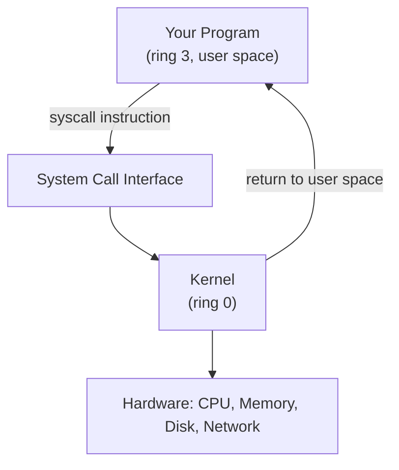
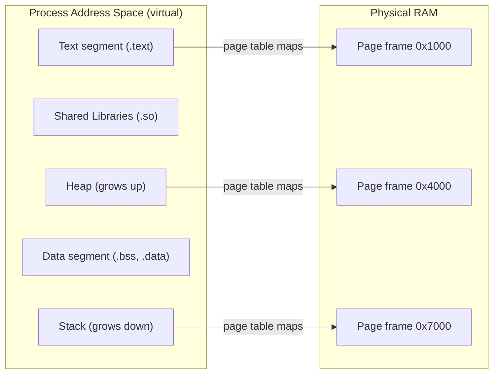
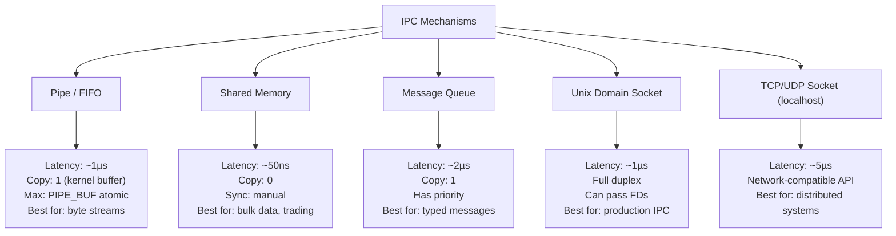
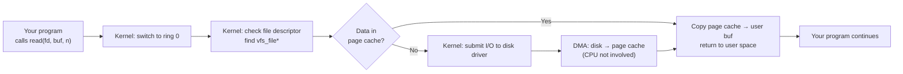
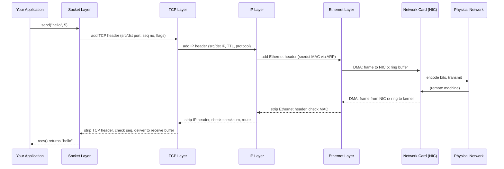

# C++ Bible — Phase 3: Systems Programming Pillar

> **For agentic workers:** REQUIRED SUB-SKILL: Use superpowers:subagent-driven-development (recommended) or superpowers:executing-plans to implement this plan task-by-task. Steps use checkbox (`- [ ]`) syntax for tracking.

**Goal:** Write the 4 systems programming chapters (12-os-fundamentals through 15-networking) covering OS internals, IPC, low-level I/O, and network programming — all from kernel theory up to high-performance production techniques.

**Architecture:** Each chapter starts from first principles (what the kernel does, what the syscall is, what the data structure looks like in memory) before showing C++ code. Mermaid diagrams for every architecture concept. Examples are standalone C++ programs using POSIX APIs — they run on Linux/WSL2.

**Tech Stack:** GCC 11.4.0, POSIX APIs (fork, mmap, epoll, sockets), Linux-specific syscalls. No external dependencies beyond glibc and the C++ standard library.

**No Atlas dependency:** These four chapters are Forge-only. No `projects/` directory is involved — all code is in `tutorial/pillar-3-systems-programming/*/examples/`.

---

## Task 1: Chapter 12-os-fundamentals

Tutorial path: `tutorial/pillar-3-systems-programming/12-os-fundamentals/`

### Step 1.1 — Create directory structure

- [ ] Create directory structure

```bash
mkdir -p /home/zaki/workspaces/cpp/tutorial/pillar-3-systems-programming/12-os-fundamentals/examples
```

### Step 1.2 — Write README.md

- [ ] Create `/home/zaki/workspaces/cpp/tutorial/pillar-3-systems-programming/12-os-fundamentals/README.md`

```markdown
# Chapter 12: OS Fundamentals — From First Principles

**What you'll learn:** What a process is at the kernel level, how virtual memory works, how system calls cross the ring boundary, and how signals deliver asynchronous events to your process.

**Prerequisites:** Basic Linux familiarity (can navigate a shell, know what a process is in everyday terms).

**Time estimate:** Core = 30 min. Deep Dive = 3 hours. Interview = 40 min.

**Reading paths:**
- First-time OS exposure: `core.md` → `deep-dive.md` "The Process Lifecycle"
- Virtual memory focus: `deep-dive.md` "Virtual Memory: Page Tables" → `examples/02_mmap_anonymous.cpp`
- Signals focus: `deep-dive.md` "Signal Delivery Model" → `examples/03_signal_handling.cpp`
- Interview prep: `interview.md`

**Platform:** All examples run on Linux and WSL2. Examples use POSIX APIs only.
```

### Step 1.3 — Write core.md

- [ ] Create `/home/zaki/workspaces/cpp/tutorial/pillar-3-systems-programming/12-os-fundamentals/core.md`

```markdown
# OS Fundamentals — Core

## What the Kernel Actually Does

The kernel is a resource manager. It sits between your program and the hardware, providing three things:

1. **Isolation.** Your process gets its own virtual address space. It cannot read or write another process's memory directly. The kernel enforces this via the hardware MMU (Memory Management Unit).
2. **Abstraction.** Your program reads from a file descriptor — it does not care whether that file is on an SSD, a network share, or a pipe. The kernel provides a uniform interface.
3. **Multiplexing.** Your CPU has 16 cores but you may have 10,000 threads. The kernel's scheduler decides which threads run on which cores at any given microsecond.

The CPU enforces a **privilege boundary** in hardware: ring 0 (kernel mode) can execute any instruction, including privileged ones that control memory protection and I/O. Ring 3 (user mode — where your program runs) cannot. Your program asks the kernel to do privileged things via **system calls**: a controlled gate through the ring boundary.



## The Process: More Than Just Your Code

A process is not just your executable's machine code in memory. The kernel tracks a process as a collection of state:

- **Address space:** virtual memory mappings — where code, stack, heap, and shared libraries live
- **File descriptor table:** an array of open files, sockets, pipes, and devices
- **Signal disposition table:** per-signal: ignore, default action, or custom handler
- **PID (Process ID):** unique identifier; also PPID (parent PID), UID, GID (permissions)
- **Current working directory:** the reference point for relative paths
- **CPU registers:** saved/restored on context switches between processes
- **Open file offset:** where in each file the next read/write goes

When you call `fork()`, the kernel clones all of this state for the child process. When you call `exec()`, it replaces the address space with a new program image while keeping the PID and file descriptors.

## Virtual Memory: The Great Illusion

Every process on a 64-bit Linux system sees 128TB of virtual address space — as if it has exclusive use of 128 terabytes of memory. The hardware makes this real via **page tables**: a data structure that maps virtual addresses to physical addresses.



Key properties:
- Physical pages are allocated only on demand (first write triggers a page fault)
- Multiple processes can share the same physical pages for read-only data (executable text, shared library code)
- A process can never access another process's physical pages because the page table mapping is private

The MMU (Memory Management Unit) is hardware that performs virtual-to-physical translation on every memory access. If a virtual address has no mapping, the MMU generates a **page fault** — the kernel's page fault handler runs and either creates a mapping (minor fault) or terminates the process with SIGSEGV.

## System Calls: The Only Way In

To do anything that requires kernel privileges — read a file, allocate memory, create a socket, fork a child — your program must ask the kernel via a system call.

The mechanism on x86-64:
1. Put arguments in registers (rdi, rsi, rdx, r10, r8, r9).
2. Put the syscall number in rax (e.g., `read = 0`, `write = 1`, `open = 2`, `fork = 57`).
3. Execute the `syscall` instruction — CPU switches to ring 0 and jumps to the kernel's syscall entry point.
4. Kernel validates arguments, performs the operation, puts the result in rax.
5. CPU switches back to ring 3 and execution returns after the `syscall` instruction.

Cost: approximately 100–500ns per syscall (mode switch, TLB flush, potential pipeline flush). This is why batching system calls matters — read 4096 bytes at a time, not 1 byte at a time.

The VDSO (Virtual Dynamic Shared Object) is a kernel-provided shared library that implements some syscalls (`clock_gettime`, `gettimeofday`) entirely in user space, reading kernel-maintained data structures mapped read-only into every process. These appear to be syscalls but never enter ring 0 — sub-10ns latency.

## Signals: Async Interrupts to Your Process

Signals are asynchronous notifications delivered by the kernel to a process. Sending SIGTERM to PID 1234 is `kill(1234, SIGTERM)` — the kernel sets a pending signal flag for that process, and the next time that process is scheduled, the kernel delivers the signal before resuming user code.

Delivery options per signal:
- **Ignore:** the signal is discarded (not possible for SIGKILL and SIGSTOP)
- **Default action:** crash (SIGSEGV, SIGBUS), terminate (SIGTERM), stop (SIGTSTP), or nothing (SIGCHLD)
- **Custom handler:** a function in your code runs when the signal arrives

```cpp
// CORRECT: use sigaction, not signal()
struct sigaction sa{};
sa.sa_handler = [](int) { shutdown_requested = true; };
sigemptyset(&sa.sa_mask);
sa.sa_flags = SA_RESTART;  // restart interrupted syscalls
sigaction(SIGTERM, &sa, nullptr);
```

The critical constraint: signal handlers run asynchronously — they can interrupt any point in your code. Only **async-signal-safe functions** are safe to call from a handler. The list is very short: write(), _exit(), sig_atomic_t operations. Do not call malloc, printf, or anything that takes a lock.

## Production Rules

1. Check every syscall return value. `read()` returning -1 is not rare — it happens on EINTR.
2. Handle EINTR: many syscalls return EINTR when a signal arrives mid-call. Retry or use `SA_RESTART`.
3. Signal handlers: set a `volatile sig_atomic_t` flag, do nothing else. Check the flag in your main loop.
4. Use `signalfd` in event-driven programs — delivers signals as file descriptor events safe to use in epoll.
5. Every `fork()` must be followed by `waitpid()` or `SIGCHLD` handling to reap children and avoid zombies.
6. Virtual memory is free: `mmap(MAP_ANONYMOUS)` is your arena allocator substrate.
7. Syscall overhead is real: batch I/O, use read/write sizes aligned to `PIPE_BUF` or `O_DIRECT` block size.
```

### Step 1.4 — Write deep-dive.md

- [ ] Create `/home/zaki/workspaces/cpp/tutorial/pillar-3-systems-programming/12-os-fundamentals/deep-dive.md`

```markdown
# OS Fundamentals — Deep Dive

## The Process Lifecycle: fork/exec/wait/exit

The UNIX process model has four fundamental operations:

**fork():** Creates a child process that is an exact copy of the parent. Both parent and child return from fork() — parent gets child's PID, child gets 0. After fork, parent and child execute independently.

```cpp
pid_t pid = fork();
if (pid < 0)  { /* error */ }
if (pid == 0) { /* child — pid is 0 */ }
else          { /* parent — pid is child's PID */ }
```

**exec() family:** Replaces the current process image with a new program. After exec, the calling program is gone. PID remains the same; file descriptors (unless O_CLOEXEC) remain open; signal dispositions reset to default.

```cpp
// execvp: search PATH, pass argv array
const char* args[] = {"ls", "-la", "/tmp", nullptr};
execvp("ls", const_cast<char**>(args));
// If we get here, exec failed
perror("execvp");
_exit(1);
```

**waitpid():** Parent waits for a child to terminate and reaps its exit status. Without this, terminated children become **zombies** — they hold their PID and exit status in the process table until the parent calls wait.

```cpp
int status;
pid_t dead = waitpid(child_pid, &status, 0);
if (WIFEXITED(status)) {
    int code = WEXITSTATUS(status);  // 0–255
}
if (WIFSIGNALED(status)) {
    int sig = WTERMSIG(status);      // signal that killed it
}
```

**exit()/_exit():** `exit()` flushes stdio buffers and calls atexit handlers then terminates. `_exit()` terminates immediately. Always use `_exit()` in the child after fork (the child should not flush the parent's stdio buffers).

## Copy-on-Write After fork()

When `fork()` clones the parent's address space, it does not physically copy all memory. Instead, both parent and child initially share the same physical pages, marked read-only. When either process writes to a page, the MMU triggers a page fault, and the kernel copies that specific page — giving each process its own writable copy. This is Copy-on-Write (CoW).

Result: `fork()` itself is fast (O(number of page table entries), not O(memory size)). A child that immediately calls `exec()` (the "fork-exec" pattern) never copies any application data pages — it only copies page tables, then discards them when exec replaces the address space.

The overhead of fork on a 1GB process: copying ~2000 page table entries (2MB of page tables for 1GB at 4KB pages) — microseconds, not milliseconds.

## Virtual Memory: Page Tables (4-level on x86-64)

On x86-64, every virtual address is 48 bits wide (128TB range). The MMU walks a 4-level tree:

```
Virtual address: [PML4 index (9)] [PDPT index (9)] [PD index (9)] [PT index (9)] [Page offset (12)]
                                                                                  = 4KB page size
```

Each level is a 4KB page of 512 8-byte entries. The CR3 register points to the PML4 (root) for the current process. On a context switch, CR3 is updated, flushing the TLB (Translation Lookaside Buffer — cache of recent virtual-to-physical translations).

A full walk costs 4 memory accesses (4 page table levels) before reaching the data. The TLB caches recent translations to avoid this cost. TLB miss rate is a critical metric for performance — huge pages (2MB pages on x86) reduce TLB pressure by covering 512x more virtual memory per TLB entry.

## Page Faults: Minor vs Major

A **page fault** occurs when the CPU tries to access a virtual address with no valid page table entry. The kernel's page fault handler determines the cause:

**Minor fault (soft fault):** The page is valid but not yet mapped into the page table. Common causes:
- First access to a freshly mmap'd region (anonymous mapping — kernel zero-fills a physical page and maps it)
- Copy-on-write break (kernel creates a private copy of a shared page)
- Lazy stack growth (kernel extends the stack mapping down)

Cost: ~1 microsecond. No disk access.

**Major fault (hard fault):** The page must be read from disk (swapped out or demand-loaded from a file). Cost: ~1–10 milliseconds. Your program stalls for the disk I/O.

Avoid major faults in latency-sensitive code: `mlock()` pins pages in physical RAM, preventing swap. `madvise(MADV_WILLNEED)` tells the kernel to prefetch pages in the background.

## mmap: Anonymous and File-Backed

`mmap()` is the universal memory-mapping interface. Two main uses:

**Anonymous mapping (heap-like allocation):**
```cpp
// Allocate 16MB of private anonymous memory
void* p = mmap(nullptr, 16 * 1024 * 1024,
               PROT_READ | PROT_WRITE,
               MAP_PRIVATE | MAP_ANONYMOUS,
               -1, 0);
// p is zeroed on first access (lazy allocation)
munmap(p, 16 * 1024 * 1024);
```

Advantages over malloc: no fragmentation, arbitrary alignment, can be mprotect'd, can use huge pages. Used by `malloc` internally for large allocations (typically >128KB).

**File-backed mapping:**
```cpp
int fd = open("data.bin", O_RDONLY);
struct stat st; fstat(fd, &st);
void* data = mmap(nullptr, st.st_size, PROT_READ, MAP_SHARED, fd, 0);
close(fd);  // fd can be closed; mapping remains
// Access data directly — no read() syscalls. Page faults load from disk.
munmap(data, st.st_size);
```

`MAP_SHARED` — writes go to the file. `MAP_PRIVATE` — writes create a private copy (CoW from file). The file's pages are shared among all processes that map it read-only — same physical page, multiple virtual address spaces.

## Memory Protection: mprotect, W^X Policy

`mprotect()` changes page permissions after mapping:
```cpp
// Mark a page read-only after writing to it
mprotect(addr, page_size, PROT_READ);

// Make a page executable (JIT compilers do this):
mprotect(code_buf, code_size, PROT_READ | PROT_EXEC);
```

**W^X (Write XOR Execute):** A security policy requiring that memory is either writable OR executable, never both simultaneously. A JIT compiler: writes generated code to a PROT_WRITE mapping, then mprotect to PROT_READ|PROT_EXEC before jumping to it. Enforced by Linux (NX bit in page tables) and many runtime environments.

Attempting to execute a non-executable page → SIGSEGV. Attempting to write to a read-only page → SIGSEGV. The kernel reports the exact fault type in the signal info struct.

## Signal Delivery Model

Signal delivery is asynchronous. The kernel delivers a signal to a process at the next safe point — typically the next time the process is scheduled after the signal is sent, or when the process exits a syscall.

A signal that arrives while a blocking syscall is in progress (e.g., `read()` waiting for data) causes the syscall to return with `errno = EINTR`. Use `SA_RESTART` to make the kernel restart the syscall automatically, or loop on EINTR manually.

**Pending signals:** If the same signal is sent multiple times before delivery, only one instance is delivered for standard (non-realtime) signals. Realtime signals (SIGRTMIN through SIGRTMAX) are queued.

**Signal mask (`sigprocmask`):** A per-thread set of blocked signals. Blocked signals are not delivered until unblocked. Use to protect critical sections:
```cpp
sigset_t mask, old_mask;
sigemptyset(&mask);
sigaddset(&mask, SIGTERM);
sigprocmask(SIG_BLOCK, &mask, &old_mask);
// critical section — SIGTERM will not be delivered here
sigprocmask(SIG_SETMASK, &old_mask, nullptr);
```

## Async-Signal-Safe Functions

A function is async-signal-safe if it can be called from a signal handler without risk of deadlock or corruption. The POSIX standard defines a list of ~100 such functions. Key safe ones: `write()`, `_exit()`, `kill()`, `signal()`, `sigaction()`, `read()`, `open()`, `close()`, `getpid()`.

Key unsafe ones: `malloc()`, `free()`, `printf()`, `fprintf()`, `syslog()`, `pthread_mutex_lock()`, C++ `new`/`delete`.

The danger: if a signal arrives while your code holds the malloc lock, and your signal handler calls malloc, deadlock.

Pattern for signal handlers: set a `volatile sig_atomic_t` flag:
```cpp
volatile sig_atomic_t g_shutdown = 0;

void sigterm_handler(int) { g_shutdown = 1; }

// In main loop:
while (!g_shutdown) {
    // do work
}
// clean shutdown
```

## The /proc Filesystem

`/proc` is a pseudo-filesystem that exposes kernel data structures as files:

- `/proc/self/maps` — current process memory mappings (address range, permissions, offset, device, inode, path)
- `/proc/self/status` — process status: VmRSS (physical memory), VmSize (virtual), Threads, State
- `/proc/self/fd/` — symbolic links to all open file descriptors
- `/proc/self/exe` — symlink to the executable
- `/proc/self/cmdline` — null-separated command line arguments
- `/proc/<pid>/maps` — another process's memory map (requires permissions)
- `/proc/meminfo` — system-wide memory statistics

Reading `/proc` requires only standard file I/O — no special libraries. The kernel generates content dynamically when you read. Zero cost to add these reads to diagnostics code.

## VDSO: Syscalls That Don't Enter the Kernel

Some system calls are called so frequently that the round-trip mode switch (ring 3 → ring 0 → ring 3) is unacceptably expensive. The VDSO (Virtual Dynamic Shared Object) is a small shared library the kernel maps into every process's address space.

VDSO-accelerated calls on x86-64:
- `clock_gettime(CLOCK_MONOTONIC, ...)` — reads a kernel counter directly from shared memory
- `gettimeofday()` — reads time of day without kernel entry
- `getcpu()` — returns current CPU number

These appear to call the kernel (same function signature) but execute entirely in user space by reading a kernel-maintained `vdso_data` page mapped read-only. Latency: ~10ns vs ~200ns for a real syscall.

Check if VDSO is mapped: `cat /proc/self/maps | grep vdso`.

## seccomp: Syscall Filtering

`seccomp` (secure computing mode) restricts which system calls a process can make. A BPF (Berkeley Packet Filter) program is loaded that inspects each syscall number and argument before execution and can allow, deny, or kill the process.

Used by: Chrome (sandboxed renderer), Docker (default seccomp profile), systemd services.

Strict mode (allow only read/write/exit/sigreturn):
```c
prctl(PR_SET_SECCOMP, SECCOMP_MODE_STRICT);
```

Filter mode with BPF (via `libseccomp`):
```cpp
scmp_filter_ctx ctx = seccomp_init(SCMP_ACT_KILL);
seccomp_rule_add(ctx, SCMP_ACT_ALLOW, SCMP_SYS(read),   0);
seccomp_rule_add(ctx, SCMP_ACT_ALLOW, SCMP_SYS(write),  0);
seccomp_rule_add(ctx, SCMP_ACT_ALLOW, SCMP_SYS(exit),   0);
seccomp_load(ctx);
seccomp_release(ctx);
```

Any syscall not explicitly allowed → SIGKILL (or SIGSYS depending on action). Powerful for sandboxing untrusted code.
```

### Step 1.5 — Write interview.md

- [ ] Create `/home/zaki/workspaces/cpp/tutorial/pillar-3-systems-programming/12-os-fundamentals/interview.md`

```markdown
# OS Fundamentals — Interview Questions

---

**Q: What is the difference between a process and a thread?**

**A:** A process has its own virtual address space, file descriptor table, and signal disposition — it is fully isolated from other processes. Threads within the same process share the address space, file descriptors, and most kernel resources, but each has its own stack and CPU registers (including the program counter and stack pointer). Creating a process with `fork()` copies the address space (via CoW); creating a thread is much cheaper — just a new stack and kernel task struct, sharing the existing address space. Communication between processes requires IPC (pipes, shared memory, sockets); threads communicate directly via shared memory. Isolation is the key tradeoff: a thread bug can corrupt shared state and crash all threads; a process bug only crashes that process.

**Trap:** "Threads are lighter than processes." True in theory. On Linux, `clone()` creates both — the difference is which resources are shared. A "process" is just a thread group with fully private address space.

**Follow-up:** What is a thread group leader? The first thread in a process — its TID equals the PID. All threads in the group have the same PID (`getpid()`) but different TIDs (`gettid()`).

---

**Q: What happens in the kernel when you call fork()?**

**A:** The kernel calls `do_fork()` which: creates a new `task_struct` for the child by copying the parent's; increments reference counts on shared resources (open files, signal handlers, namespaces); creates a new page table for the child that initially points to the same physical pages as the parent (all marked read-only for CoW); copies the CPU register state (so both parent and child return from `fork()` at the same instruction); assigns a new PID; adds the child to the scheduler's run queue. The kernel then sets the return value register (rax) differently for parent (child's PID) and child (0) before returning to user space.

**Trap:** "fork() copies all memory." It copies the page tables (which map virtual to physical), not the physical pages themselves. Physical pages are shared CoW until written.

**Follow-up:** Why does `fork()` fail on some systems when memory is low? The kernel must be able to allocate page tables and kernel data structures for the child. The actual memory pages are CoW-shared, but the page table structure itself is not shared.

---

**Q: What is copy-on-write and how does it make fork() fast?**

**A:** After fork(), both parent and child share the same physical memory pages, but the page table entries are marked read-only for both. When either process writes to a shared page, the MMU generates a page fault (the write-protect fault). The kernel's fault handler allocates a new physical page, copies the content of the original page into it, updates the faulting process's page table to point to the new private copy, and marks both entries writable again. The writing process then retries the write instruction, now succeeding on its private copy. The key insight: the cost of fork is proportional to the number of pages actually written after the fork, not the total address space size. A child that immediately calls exec() pays almost nothing — exec replaces the address space before any CoW copies occur.

**Trap:** "CoW means fork is O(1)." It is O(number of page table entries to copy), which is proportional to virtual address space size, not memory usage. For a process with 128TB of virtual mappings, this could still be non-trivial.

**Follow-up:** What is the vfork() optimization? vfork() skips even the page table copy — the child borrows the parent's page tables entirely. The parent is suspended until the child calls exec() or _exit(). Very fragile, mostly obsoleted by posix_spawn().

---

**Q: What is a page fault and what are the two types?**

**A:** A page fault occurs when the CPU accesses a virtual address that has no valid page table entry, or has an entry that violates the access permission (write to read-only page). The MMU raises a fault, the CPU switches to kernel mode, and the page fault handler runs. A **minor fault** (soft fault) means the page is logically valid — it just needs a physical frame allocated (anonymous mmap first access, CoW break, lazy stack extension). No disk I/O, cost is approximately 1 microsecond. A **major fault** (hard fault) means the page content must be fetched from disk — either swapped out or demand-loaded from a file-backed mapping. Cost is 1–10 milliseconds. Avoiding major faults in latency-sensitive code is critical: use `mlock()` to pin pages, or `madvise(MADV_WILLNEED)` to prefetch.

**Trap:** "Page faults always mean a crash." Only if the kernel cannot resolve the fault (access to unmapped region, write to read-only page with no CoW break) does the kernel send SIGSEGV. Most page faults are normal and transparent.

**Follow-up:** How do you see how many page faults your process takes? `getrusage(RUSAGE_SELF, &usage)` gives `ru_minflt` and `ru_majflt`. Or: `perf stat -e page-faults ./program`.

---

**Q: What is mmap and when would you use it instead of malloc?**

**A:** `mmap()` is a system call that creates a mapping in the process's virtual address space, backed either by anonymous memory or by a file. Compared to malloc: mmap operates at page granularity (minimum 4KB), whereas malloc manages smaller allocations efficiently via a heap. Use mmap instead of malloc when: (1) you need large allocations (>1MB) — malloc internally calls mmap for these anyway, but you get the ability to mprotect, mlock, or madvise them; (2) you need memory-mapped file I/O — reading a file via mmap avoids the user-space buffer of read() and lets the page cache serve as the buffer directly, enabling zero-copy reads; (3) you need shared memory between processes — MAP_SHARED creates a region visible to all processes that map the same file or shm object; (4) you need an arena/pool allocator substrate — mmap a large region, then sub-allocate manually.

**Trap:** "mmap is always faster than malloc." For small, frequent allocations, malloc's free-list is faster. mmap incurs syscall overhead, TLB pressure from new mappings, and page fault cost on first access.

**Follow-up:** What happens when you call munmap? The kernel removes the virtual address mapping and may release the associated physical pages back to the free pool (if not shared). The TLB entries for those addresses are invalidated.

---

**Q: What are file descriptors and what happens when you fork()?**

**A:** A file descriptor is an integer that indexes into the process's file descriptor table — a kernel-maintained array of pointers to open file descriptions. Each open file description holds the file offset, flags, and a reference to the underlying file or socket. When you fork(), the child's file descriptor table is a copy of the parent's — both tables initially point to the same underlying open file descriptions. This means parent and child share file offsets: if the parent reads 100 bytes from fd 3, the child reading from fd 3 will start at byte 101. This is intentional for shell pipelines but often unexpected otherwise. Use `close()` in the child to close file descriptors it does not need, and set `O_CLOEXEC` on file descriptors that should not survive an `exec()`.

**Trap:** "fork() creates separate file positions for parent and child." No — they share the same open file description (offset is shared) until one of them closes and reopens.

**Follow-up:** What is the file descriptor limit? `ulimit -n` (soft limit, typically 1024 or 65536). Changeable with `setrlimit(RLIMIT_NOFILE, ...)`. The hard limit requires root to increase.

---

**Q: What is a signal and why can't you call malloc in a signal handler?**

**A:** A signal is an asynchronous notification sent to a process by the kernel or another process. When a signal arrives, the kernel interrupts the process at an arbitrary point in its execution and runs the registered signal handler function. The problem with malloc in a signal handler: malloc is not async-signal-safe because it uses internal locks (mutexes or spinlocks) to protect its heap data structures from concurrent modification. If the signal arrives while the main thread is inside malloc (holding the lock), and the signal handler calls malloc (attempting to acquire the same lock), the result is deadlock. The POSIX standard defines a list of async-signal-safe functions — the only ones safe to call from signal handlers — and malloc is not on it. The correct pattern: signal handlers set a `volatile sig_atomic_t` flag, and the main loop checks and handles the condition.

**Trap:** "Use printf in a signal handler." printf is also not async-signal-safe (it uses stdio locking). The only safe output function is `write()` with a pre-formatted buffer.

**Follow-up:** What is the async-signal-safe alternative to logging in a signal handler? Write to a pipe using `write()` (async-signal-safe), and have your main event loop read from the pipe.

---

**Q: What is the cost of a system call and why does it matter?**

**A:** A system call costs approximately 100–500 nanoseconds on modern hardware. The cost components: saving user-space registers, switching from ring 3 to ring 0 (the privilege level change), looking up the syscall in the dispatch table, executing the kernel function, potentially flushing the TLB (on kernels with KPTI — Meltdown mitigation — every syscall switches page tables), restoring registers, and returning to ring 3. At 200ns per syscall, making 5 million syscalls per second consumes a full CPU core. This matters for: fine-grained I/O (read one byte at a time instead of a buffer), time measurement (calling `clock_gettime()` in a tight loop — use the VDSO version which costs ~10ns), and network programs (one syscall per packet instead of batching). io_uring solves this by batching many I/O operations into one kernel entry.

**Trap:** "System calls are free." They are cheap compared to disk I/O but expensive compared to function calls (1ns). At high frequency they dominate performance.

**Follow-up:** What is `strace` and how do you use it to count syscalls? `strace -c ./program` runs the program and prints a summary of syscalls by name, count, time, and error count. Essential for diagnosing unexpected syscall overhead.
```

### Step 1.6 — Write examples

- [ ] Create `/home/zaki/workspaces/cpp/tutorial/pillar-3-systems-programming/12-os-fundamentals/examples/01_fork_exec_wait.cpp`

```cpp
// 01_fork_exec_wait.cpp — Fork a child, exec a command, wait for it.
//
// Demonstrates: fork/exec/waitpid pattern, proper fd cleanup,
// zombie process concept, and EINTR handling.
//
// Build:
//   g++ -std=c++20 -g -o fork_exec_wait 01_fork_exec_wait.cpp
//
// Run:
//   ./fork_exec_wait

#include <cerrno>
#include <cstring>
#include <iostream>
#include <sys/types.h>
#include <sys/wait.h>
#include <unistd.h>

// Run a command and return its exit code.
// Returns -1 on fork/exec failure.
int run_command(const char* prog, char* const argv[]) {
    pid_t pid = fork();
    if (pid < 0) {
        perror("fork");
        return -1;
    }

    if (pid == 0) {
        // ---- CHILD ----
        // Replace the child's process image with the target program.
        execvp(prog, argv);
        // If execvp returns, it failed.
        perror("execvp");
        _exit(127);  // Use _exit, not exit — do not flush parent's stdio buffers
    }

    // ---- PARENT ----
    // Wait for the child, handling EINTR (signal arriving during wait).
    int status = 0;
    pid_t reaped;
    do {
        reaped = waitpid(pid, &status, 0);
    } while (reaped == -1 && errno == EINTR);

    if (reaped == -1) {
        perror("waitpid");
        return -1;
    }

    if (WIFEXITED(status)) {
        return WEXITSTATUS(status);  // normal exit code (0–255)
    }
    if (WIFSIGNALED(status)) {
        std::cerr << "Child killed by signal " << WTERMSIG(status) << "\n";
        return -WTERMSIG(status);   // negative = killed by signal
    }
    return -1;
}

// Demonstrate zombie process: fork a child but don't wait for it.
// The child terminates; its entry stays in the process table until reaped.
void demonstrate_zombie() {
    std::cout << "\n--- Zombie demo: forking without immediate wait ---\n";
    pid_t pid = fork();
    if (pid == 0) {
        // Child exits immediately
        std::cout << "Child (PID " << getpid() << ") exiting...\n";
        _exit(0);
    }

    // Parent sleeps, child is now a zombie
    std::cout << "Parent sleeping 2s; child (PID " << pid
              << ") is a zombie during this time.\n";
    std::cout << "Run: ps aux | grep Z  to see it.\n";
    sleep(2);

    // Now reap it
    int status;
    waitpid(pid, &status, 0);
    std::cout << "Reaped child. Zombie gone.\n";
}

int main() {
    // Run "ls -la /tmp"
    std::cout << "=== Running: ls -la /tmp ===\n";
    const char* ls_argv[] = {"ls", "-la", "/tmp", nullptr};
    int code = run_command("ls", const_cast<char**>(ls_argv));
    std::cout << "\nExit code: " << code << "\n";

    // Run a command that does not exist — shows exec failure
    std::cout << "\n=== Running: nonexistent_program ===\n";
    const char* bad_argv[] = {"nonexistent_program", nullptr};
    code = run_command("nonexistent_program", const_cast<char**>(bad_argv));
    std::cout << "Exit code: " << code << " (127 = command not found)\n";

    // Zombie demonstration
    demonstrate_zombie();

    return 0;
}
```

- [ ] Create `/home/zaki/workspaces/cpp/tutorial/pillar-3-systems-programming/12-os-fundamentals/examples/02_mmap_anonymous.cpp`

```cpp
// 02_mmap_anonymous.cpp — Anonymous mmap allocation, mprotect, munmap.
//
// Demonstrates: mmap as an alternative to malloc for large allocations,
// mprotect to change permissions, SIGSEGV handler for write-to-readonly,
// and timing comparison with malloc.
//
// Build:
//   g++ -std=c++20 -g -o mmap_anonymous 02_mmap_anonymous.cpp
//
// Run:
//   ./mmap_anonymous

#include <chrono>
#include <cstring>
#include <iostream>
#include <setjmp.h>
#include <signal.h>
#include <sys/mman.h>
#include <unistd.h>

// ---- SIGSEGV handler for the mprotect demonstration ----
static sigjmp_buf g_jmp_env;
static volatile sig_atomic_t g_segv_caught = 0;

static void segv_handler(int, siginfo_t* info, void*) {
    g_segv_caught = 1;
    siglongjmp(g_jmp_env, 1);  // jump back to the sigsetjmp site
}

int main() {
    const long page_size = sysconf(_SC_PAGE_SIZE);
    std::cout << "Page size: " << page_size << " bytes\n\n";

    // ----------------------------------------------------------------
    // 1. Allocate 4MB via mmap
    // ----------------------------------------------------------------
    constexpr std::size_t SIZE = 4 * 1024 * 1024;  // 4MB

    void* ptr = mmap(nullptr, SIZE,
                     PROT_READ | PROT_WRITE,
                     MAP_PRIVATE | MAP_ANONYMOUS,
                     -1, 0);
    if (ptr == MAP_FAILED) { perror("mmap"); return 1; }

    std::cout << "mmap'd " << SIZE / (1024*1024) << "MB at " << ptr << "\n";

    // Write a pattern — first access triggers page faults (minor faults)
    auto* bytes = static_cast<unsigned char*>(ptr);
    for (std::size_t i = 0; i < SIZE; ++i)
        bytes[i] = static_cast<unsigned char>(i & 0xFF);

    // Read back to verify
    unsigned char expected = 0xAB & 0xFF;  // bytes[0xAB] should be 0xAB
    if (bytes[0xAB] == 0xAB)
        std::cout << "Pattern verified OK\n\n";

    // ----------------------------------------------------------------
    // 2. mprotect: make the first page read-only, then try to write
    // ----------------------------------------------------------------
    std::cout << "--- mprotect demonstration ---\n";

    // Install SIGSEGV handler
    struct sigaction sa{};
    sa.sa_sigaction = segv_handler;
    sigemptyset(&sa.sa_mask);
    sa.sa_flags = SA_SIGINFO;
    sigaction(SIGSEGV, &sa, nullptr);

    // Mark the first page read-only
    int ret = mprotect(ptr, page_size, PROT_READ);
    if (ret != 0) { perror("mprotect"); }

    g_segv_caught = 0;
    if (sigsetjmp(g_jmp_env, 1) == 0) {
        // Attempt to write to the now-read-only page
        bytes[0] = 0x42;  // This should trigger SIGSEGV
        std::cout << "  Write succeeded (unexpected!)\n";
    } else {
        std::cout << "  Write to read-only page caught SIGSEGV — correct!\n";
    }

    // Restore write permission
    mprotect(ptr, page_size, PROT_READ | PROT_WRITE);
    bytes[0] = 0x42;  // Now succeeds
    std::cout << "  Write after mprotect restore: OK\n\n";

    // ----------------------------------------------------------------
    // 3. Timing comparison: mmap vs new[] for large allocation
    // ----------------------------------------------------------------
    std::cout << "--- Timing: mmap vs new[] for 4MB allocation ---\n";
    constexpr int TRIALS = 100;
    using Clock = std::chrono::high_resolution_clock;
    using Us    = std::chrono::duration<double, std::micro>;

    // mmap timing
    double mmap_total = 0.0;
    for (int i = 0; i < TRIALS; ++i) {
        auto t0 = Clock::now();
        void* m = mmap(nullptr, SIZE, PROT_READ | PROT_WRITE,
                       MAP_PRIVATE | MAP_ANONYMOUS, -1, 0);
        auto t1 = Clock::now();
        munmap(m, SIZE);
        mmap_total += std::chrono::duration_cast<Us>(t1 - t0).count();
    }

    // new[] timing
    double new_total = 0.0;
    for (int i = 0; i < TRIALS; ++i) {
        auto t0 = Clock::now();
        auto* m = new unsigned char[SIZE];
        auto t1 = Clock::now();
        delete[] m;
        new_total += std::chrono::duration_cast<Us>(t1 - t0).count();
    }

    std::cout << "mmap   avg: " << (mmap_total / TRIALS) << " µs\n";
    std::cout << "new[]  avg: " << (new_total  / TRIALS) << " µs\n";
    std::cout << "(mmap is typically faster for large allocations — malloc\n";
    std::cout << " calls mmap internally for large sizes but adds overhead)\n\n";

    // ----------------------------------------------------------------
    // 4. munmap
    // ----------------------------------------------------------------
    munmap(ptr, SIZE);
    std::cout << "munmap'd — virtual mapping removed\n";

    return 0;
}
```

- [ ] Create `/home/zaki/workspaces/cpp/tutorial/pillar-3-systems-programming/12-os-fundamentals/examples/03_signal_handling.cpp`

```cpp
// 03_signal_handling.cpp — SIGTERM graceful shutdown, SIGCHLD reaping,
// signalfd for event-loop-friendly signal handling.
//
// Build:
//   g++ -std=c++20 -g -o signal_handling 03_signal_handling.cpp
//
// Run:
//   ./signal_handling
//   Then from another terminal: kill -TERM <pid>

#include <csignal>
#include <cstring>
#include <iostream>
#include <sys/signalfd.h>
#include <sys/types.h>
#include <sys/wait.h>
#include <unistd.h>

// ---- Part 1: Classic sigaction-based handler ----

// sig_atomic_t: the only type safe to read/write from signal handlers.
// volatile: prevents the compiler from caching the value in a register.
volatile sig_atomic_t g_shutdown = 0;
volatile sig_atomic_t g_child_died = 0;

static void sigterm_handler(int) {
    g_shutdown = 1;
    // ONLY async-signal-safe operations here.
    // This is correct: just setting a flag.
}

static void sigchld_handler(int) {
    g_child_died = 1;
    // Do NOT call waitpid here in the signal handler.
    // Set a flag; call waitpid in the main loop.
}

void demo_sigaction() {
    std::cout << "=== Part 1: sigaction-based handlers ===\n";
    std::cout << "PID: " << getpid() << "\n";

    // Install SIGTERM handler
    struct sigaction sa{};
    sa.sa_handler = sigterm_handler;
    sigemptyset(&sa.sa_mask);
    sa.sa_flags = SA_RESTART;  // restart interrupted syscalls
    if (sigaction(SIGTERM, &sa, nullptr) != 0) { perror("sigaction SIGTERM"); }

    // Install SIGCHLD handler
    struct sigaction sa_chld{};
    sa_chld.sa_handler = sigchld_handler;
    sigemptyset(&sa_chld.sa_mask);
    sa_chld.sa_flags = SA_RESTART | SA_NOCLDSTOP;  // only notify on exit, not stop
    if (sigaction(SIGCHLD, &sa_chld, nullptr) != 0) { perror("sigaction SIGCHLD"); }

    // Fork a child that will exit after 1 second
    pid_t child = fork();
    if (child == 0) {
        sleep(1);
        std::cout << "  Child exiting\n";
        _exit(42);
    }

    std::cout << "  Forked child PID " << child << ". Waiting for events...\n";

    // Main loop: check flags and handle events
    for (int i = 0; i < 30 && !g_shutdown; ++i) {
        usleep(100000);  // 100ms

        if (g_child_died) {
            g_child_died = 0;
            // Reap all children that have exited
            int status;
            pid_t reaped;
            while ((reaped = waitpid(-1, &status, WNOHANG)) > 0) {
                std::cout << "  Reaped child PID " << reaped
                          << " exit code " << WEXITSTATUS(status) << "\n";
            }
            break;  // exit loop after reaping
        }
    }

    if (g_shutdown) std::cout << "  SIGTERM received — shutting down\n";
    std::cout << "  Part 1 done.\n\n";
}

// ---- Part 2: signalfd — signals as file descriptors ----

void demo_signalfd() {
    std::cout << "=== Part 2: signalfd (signals as fd events) ===\n";

    // Block SIGUSR1 from normal delivery — we will read it via signalfd
    sigset_t mask;
    sigemptyset(&mask);
    sigaddset(&mask, SIGUSR1);
    if (sigprocmask(SIG_BLOCK, &mask, nullptr) != 0) { perror("sigprocmask"); return; }

    // Create a signalfd that delivers SIGUSR1 as readable events
    int sfd = signalfd(-1, &mask, SFD_CLOEXEC | SFD_NONBLOCK);
    if (sfd < 0) { perror("signalfd"); return; }

    std::cout << "  Sending SIGUSR1 to self...\n";
    kill(getpid(), SIGUSR1);

    // Read the signal event from the fd
    struct signalfd_siginfo info{};
    ssize_t n = read(sfd, &info, sizeof(info));
    if (n == sizeof(info)) {
        std::cout << "  signalfd read: signal " << info.ssi_signo
                  << " (SIGUSR1=" << SIGUSR1 << ") from PID " << info.ssi_pid << "\n";
    } else {
        perror("read signalfd");
    }

    close(sfd);

    // Unblock SIGUSR1
    sigprocmask(SIG_UNBLOCK, &mask, nullptr);
    std::cout << "  Part 2 done.\n\n";
}

// ---- Part 3: sigprocmask for critical section protection ----

void demo_sigprocmask() {
    std::cout << "=== Part 3: sigprocmask critical section ===\n";

    sigset_t block_set, old_set;
    sigemptyset(&block_set);
    sigaddset(&block_set, SIGTERM);
    sigaddset(&block_set, SIGINT);

    // Block SIGTERM and SIGINT during a critical section
    sigprocmask(SIG_BLOCK, &block_set, &old_set);
    std::cout << "  Critical section: SIGTERM and SIGINT blocked\n";
    std::cout << "  (send either signal now — it will be deferred)\n";
    sleep(1);
    std::cout << "  Leaving critical section — restoring signal mask\n";
    // Restore previous mask; any pending signals are now delivered
    sigprocmask(SIG_SETMASK, &old_set, nullptr);
    std::cout << "  Part 3 done.\n";
}

int main() {
    demo_sigaction();
    demo_signalfd();
    demo_sigprocmask();
    return 0;
}
```

- [ ] Create `/home/zaki/workspaces/cpp/tutorial/pillar-3-systems-programming/12-os-fundamentals/examples/04_proc_reader.cpp`

```cpp
// 04_proc_reader.cpp — Read /proc/self/maps, /proc/self/status, fd count.
//
// Demonstrates: the /proc filesystem as a window into kernel state,
// parsed with standard file I/O (no special libraries).
//
// Build:
//   g++ -std=c++20 -g -o proc_reader 04_proc_reader.cpp
//
// Run:
//   ./proc_reader

#include <algorithm>
#include <dirent.h>
#include <fstream>
#include <iostream>
#include <sstream>
#include <string>
#include <vector>
#include <sys/mman.h>

// Parse and print /proc/self/maps — the memory map of this process
void print_memory_map() {
    std::cout << "=== /proc/self/maps (first 15 regions) ===\n";
    std::ifstream maps("/proc/self/maps");
    if (!maps) { std::cerr << "Cannot open /proc/self/maps\n"; return; }

    struct Region {
        std::string start, end, perms, offset, path;
    };

    int count = 0;
    std::string line;
    std::cout << std::left;
    std::cout << "  " << "Start            " << "End              "
              << "Perms  " << "Path\n";
    std::cout << "  " << std::string(70, '-') << "\n";

    while (std::getline(maps, line) && count < 15) {
        // Format: start-end perms offset dev inode path
        // e.g.: 7f1234000000-7f1235000000 r-xp 00000000 08:01 123456 /usr/lib/libc.so
        std::istringstream ss(line);
        std::string range, perms, offset, dev, inode, path;
        ss >> range >> perms >> offset >> dev >> inode;
        std::getline(ss >> std::ws, path);  // rest of line is path (optional)

        auto dash = range.find('-');
        std::string start = range.substr(0, dash);
        std::string end   = range.substr(dash + 1);

        std::cout << "  " << start << "  " << end << "  "
                  << perms << "  " << (path.empty() ? "[anon]" : path) << "\n";
        ++count;
    }
    std::cout << "  ...\n\n";
}

// Parse /proc/self/status for memory and thread info
void print_status() {
    std::cout << "=== /proc/self/status (selected fields) ===\n";
    std::ifstream status("/proc/self/status");
    if (!status) { std::cerr << "Cannot open /proc/self/status\n"; return; }

    std::string line;
    while (std::getline(status, line)) {
        // Print only the fields we care about
        if (line.find("VmRSS:")  == 0 ||  // Resident Set Size (physical memory)
            line.find("VmSize:") == 0 ||  // Virtual memory size
            line.find("VmPeak:") == 0 ||  // Peak virtual memory
            line.find("Threads:") == 0 || // Number of threads
            line.find("Pid:")    == 0 ||
            line.find("PPid:")   == 0) {
            std::cout << "  " << line << "\n";
        }
    }
    std::cout << "\n";
}

// Count open file descriptors via /proc/self/fd
void count_open_fds() {
    std::cout << "=== /proc/self/fd (open file descriptors) ===\n";
    DIR* dir = opendir("/proc/self/fd");
    if (!dir) { perror("opendir /proc/self/fd"); return; }

    std::vector<std::string> fds;
    struct dirent* entry;
    while ((entry = readdir(dir)) != nullptr) {
        if (entry->d_name[0] != '.') {
            fds.emplace_back(entry->d_name);
        }
    }
    closedir(dir);

    std::sort(fds.begin(), fds.end(), [](const std::string& a, const std::string& b) {
        return std::stoi(a) < std::stoi(b);
    });

    for (const auto& fd : fds) {
        // Resolve the symlink to see what each fd points to
        std::string link_path = "/proc/self/fd/" + fd;
        char target[256] = {};
        ssize_t len = readlink(link_path.c_str(), target, sizeof(target) - 1);
        if (len > 0) target[len] = '\0';
        std::cout << "  fd " << fd << " -> " << (len > 0 ? target : "?") << "\n";
    }
    std::cout << "  Total: " << fds.size() << " open fds\n\n";
}

int main() {
    // Open an extra file and make an mmap to make the output more interesting
    std::ifstream extra("/etc/hostname");
    void* mapped = mmap(nullptr, 4096, PROT_READ | PROT_WRITE,
                        MAP_PRIVATE | MAP_ANONYMOUS, -1, 0);

    print_memory_map();
    print_status();
    count_open_fds();

    munmap(mapped, 4096);
    return 0;
}
```

### Step 1.7 — Commit

- [ ] Commit chapter 12-os-fundamentals

```bash
cd /home/zaki/workspaces/cpp
git add tutorial/pillar-3-systems-programming/12-os-fundamentals/
git commit -m "docs(tutorial): write 12-os-fundamentals chapter — processes, virtual memory, signals, syscalls"
```

---

## Task 2: Chapter 13-ipc

Tutorial path: `tutorial/pillar-3-systems-programming/13-ipc/`

### Step 2.1 — Create directory structure

- [ ] Create directory structure

```bash
mkdir -p /home/zaki/workspaces/cpp/tutorial/pillar-3-systems-programming/13-ipc/examples
```

### Step 2.2 — Write README.md

- [ ] Create `/home/zaki/workspaces/cpp/tutorial/pillar-3-systems-programming/13-ipc/README.md`

```markdown
# Chapter 13: IPC — Inter-Process Communication

**What you'll learn:** Why processes are isolated by default, the menu of IPC mechanisms the OS provides, when to use each, and how to implement shared memory ring buffers and file descriptor passing.

**Prerequisites:** Chapter 12-os-fundamentals (processes, virtual memory, fork).

**Time estimate:** Core = 20 min. Deep Dive = 2.5 hours. Interview = 30 min.

**Reading paths:**
- Overview: `core.md` → IPC menu diagram
- Shared memory deep dive: `deep-dive.md` "POSIX Shared Memory" → `examples/02_posix_shm_ringbuffer.cpp`
- File descriptor passing: `deep-dive.md` "File Descriptor Passing" → `examples/03_unix_socket_pair.cpp`
- Interview prep: `interview.md`
```

### Step 2.3 — Write core.md

- [ ] Create `/home/zaki/workspaces/cpp/tutorial/pillar-3-systems-programming/13-ipc/core.md`

```markdown
# IPC — Core

## Why Processes Can't Share Memory by Default

Process isolation is a feature, not a limitation. The kernel gives each process its own virtual address space so that a bug in one process (use-after-free, buffer overflow) cannot corrupt another process's state or the kernel's state. This is the foundation of OS-level security and stability.

The consequence: two processes cannot share a variable the way two threads can. A global `int counter = 0` in process A is at a different physical memory location than the `int counter = 0` in process B — they have the same virtual address by coincidence, but separate physical pages.

To communicate, processes must ask the kernel to establish a shared channel. This is IPC.

## The IPC Menu



Decision guide:
- High-throughput, same-host, latency-sensitive → **shared memory** (ring buffer + POSIX semaphore)
- Full-duplex reliable messages, same-host → **Unix domain socket**
- Simple byte stream, parent-child → **anonymous pipe**
- Persistent across process restarts, typed messages → **POSIX message queue**
- Cross-host or cross-network → **TCP socket**

## Shared Memory: Fastest IPC, Hardest to Get Right

Shared memory is IPC at memory speed — no data copy, no kernel involvement per access. Two processes map the same physical pages into their address spaces. But there is no automatic synchronization: without careful locking, concurrent writes from two processes produce a data race.

```cpp
// Process A and Process B both open the same name:
int fd = shm_open("/myshm", O_CREAT | O_RDWR, 0600);
ftruncate(fd, SIZE);
void* mem = mmap(nullptr, SIZE, PROT_READ | PROT_WRITE, MAP_SHARED, fd, 0);
close(fd);

// Now both processes can read and write through their 'mem' pointer.
// They must synchronize access — e.g., with a POSIX semaphore also in the shared memory.
```

The canonical production pattern: **shared memory ring buffer** with two indices (head and tail) written atomically (or protected by a POSIX process-shared mutex). One writer, one reader, no locking needed if the ring buffer is SPSC (Single-Producer Single-Consumer) with atomic operations.

## Unix Domain Sockets: The Production Choice

Unix domain sockets use the socket API (same as TCP) but communicate over a file-system path instead of an IP address. No network stack overhead. Full duplex. Reliable ordered delivery (SOCK_STREAM) or message-boundary-preserving (SOCK_SEQPACKET).

The feature that makes Unix sockets unique: **file descriptor passing**. A process can send an open file descriptor to another process via `sendmsg` with an `SCM_RIGHTS` control message. The receiving process gets a new fd pointing to the same underlying open file description — including the current file offset, access mode, and all state. This is how `systemd` socket activation works: systemd creates listening sockets and passes them to service processes at startup, allowing zero-downtime restarts.

**Credential passing** (`SCM_CREDENTIALS`) lets a process send its UID/GID/PID in a message, and the kernel verifies these are authentic — the receiver can trust the identity without any application-level handshake.

## Production Rules

1. Use Unix domain sockets for general IPC in production services — simple API, robust, supports fd passing.
2. Use shared memory only when latency is the top priority and you are willing to write careful lock-free code.
3. Always clean up shared memory: `shm_unlink("/myshm")` on exit. It persists until explicitly unlinked.
4. Set `O_CLOEXEC` on IPC file descriptors — they should not survive `exec()` by accident.
5. Prefer `SOCK_SEQPACKET` over `SOCK_STREAM` for message-based protocols — it preserves message boundaries without a length header.
6. Message queues survive process exit — always `mq_unlink()` on cleanup.
7. Pipe `PIPE_BUF` (typically 4096 or 65536 bytes) is the maximum atomic write — larger writes may be interleaved.
```

### Step 2.4 — Write deep-dive.md

- [ ] Create `/home/zaki/workspaces/cpp/tutorial/pillar-3-systems-programming/13-ipc/deep-dive.md`

```markdown
# IPC — Deep Dive

## Anonymous Pipes: pipe() and Capacity

`pipe()` creates two file descriptors: `pipefd[0]` for reading, `pipefd[1]` for writing. Data written to the write end appears in FIFO order at the read end. The pipe has a kernel buffer (typically 65536 bytes on Linux). If the buffer is full, `write()` blocks. If the buffer is empty, `read()` blocks.

```cpp
int pipefd[2];
if (pipe2(pipefd, O_CLOEXEC) != 0) { perror("pipe2"); return; }
// pipefd[0]: read end, pipefd[1]: write end

// After fork: close the unused end in each process.
// Parent writes, child reads:
pid_t pid = fork();
if (pid == 0) {
    close(pipefd[1]);  // child does not write
    char buf[4096];
    ssize_t n;
    while ((n = read(pipefd[0], buf, sizeof(buf))) > 0)
        write(STDOUT_FILENO, buf, n);
    _exit(0);
} else {
    close(pipefd[0]);  // parent does not read
    const char* msg = "hello from parent\n";
    write(pipefd[1], msg, strlen(msg));
    close(pipefd[1]);  // closing write end signals EOF to reader
    waitpid(pid, nullptr, 0);
}
```

`pipe2(fd, O_CLOEXEC)` sets O_CLOEXEC atomically — always prefer this to `pipe()` + two `fcntl()` calls to avoid fd leaks through fork-exec.

## Named Pipes (FIFOs) and PIPE_BUF Atomicity

A FIFO persists in the filesystem: `mkfifo("/tmp/myfifo", 0600)`. Any process can open it by path. Unlike anonymous pipes, FIFOs survive across unrelated processes.

`PIPE_BUF` is the maximum number of bytes that can be written atomically to a pipe or FIFO. On Linux: 4096 (kernel constant, not configurable without recompiling). Writes up to PIPE_BUF bytes from a single `write()` are guaranteed atomic — not interleaved with other writers. Writes larger than PIPE_BUF may be split and interleaved.

Check the value: `fpathconf(pipefd[1], _PC_PIPE_BUF)` or `sysconf(_SC_PIPE_BUF)`.

## POSIX Shared Memory: shm_open + mmap

POSIX shared memory creates a named region in the system (typically backed by tmpfs in `/dev/shm`) that multiple processes can map:

```cpp
// Creator (typically the server):
int fd = shm_open("/myshm", O_CREAT | O_EXCL | O_RDWR, 0600);
ftruncate(fd, SIZE);
void* mem = mmap(nullptr, SIZE, PROT_READ | PROT_WRITE, MAP_SHARED, fd, 0);
close(fd);  // fd no longer needed after mmap
// ... use mem ...
munmap(mem, SIZE);
shm_unlink("/myshm");  // remove the name (frees storage when last mapping closed)

// Consumer (another process):
int fd = shm_open("/myshm", O_RDWR, 0600);  // no O_CREAT
void* mem = mmap(nullptr, SIZE, PROT_READ | PROT_WRITE, MAP_SHARED, fd, 0);
close(fd);
// ... use mem ...
munmap(mem, SIZE);
```

Compile with `-lrt` (realtime library) on Linux for shm_open.

## System V Shared Memory: The Legacy Interface

The older SysV interface uses integer keys and `shmget`:

```cpp
key_t key = ftok("/some/path", 42);  // derive key from path+id
int shmid = shmget(key, SIZE, IPC_CREAT | 0600);
void* mem = shmat(shmid, nullptr, 0);  // attach
// ... use mem ...
shmdt(mem);                             // detach
shmctl(shmid, IPC_RMID, nullptr);       // destroy
```

Still found in production (PostgreSQL shared buffers use SysV shm). Prefer POSIX shm_open for new code — cleaner API, filesystem namespace.

## Shared Memory Ring Buffer Pattern

SPSC (Single Producer, Single Consumer) ring buffer in shared memory — the lock-free pattern used in high-frequency trading and audio/video pipelines:

```cpp
// In shared memory (accessible by both processes):
struct alignas(64) RingBuffer {
    static constexpr int CAPACITY = 1024;  // must be power of 2

    // Cache-line separated head and tail to prevent false sharing
    alignas(64) std::atomic<uint32_t> head{0};  // writer advances
    alignas(64) std::atomic<uint32_t> tail{0};  // reader advances

    uint8_t data[CAPACITY];
};

// Producer (one thread/process only):
bool try_write(RingBuffer& rb, uint8_t byte) {
    uint32_t h = rb.head.load(std::memory_order_relaxed);
    uint32_t next_h = (h + 1) & (RingBuffer::CAPACITY - 1);
    if (next_h == rb.tail.load(std::memory_order_acquire)) return false;  // full
    rb.data[h] = byte;
    rb.head.store(next_h, std::memory_order_release);
    return true;
}

// Consumer (one thread/process only):
bool try_read(RingBuffer& rb, uint8_t& out) {
    uint32_t t = rb.tail.load(std::memory_order_relaxed);
    if (t == rb.head.load(std::memory_order_acquire)) return false;  // empty
    out = rb.data[t];
    rb.tail.store((t + 1) & (RingBuffer::CAPACITY - 1), std::memory_order_release);
    return true;
}
```

The acquire/release memory orders ensure the write to `data[h]` is visible before the head update, and the head update is visible before the consumer reads the data.

## POSIX Message Queues

Message queues deliver typed messages with priorities:

```cpp
// Open (or create) a message queue
struct mq_attr attr{.mq_flags = 0, .mq_maxmsg = 10,
                    .mq_msgsize = 256, .mq_curmsgs = 0};
mqd_t mq = mq_open("/myqueue", O_CREAT | O_RDWR, 0600, &attr);

// Send with priority (higher = delivered first)
const char* msg = "hello";
mq_send(mq, msg, strlen(msg), 5 /*priority*/);

// Receive (blocks until a message arrives)
char buf[256];
unsigned int prio;
ssize_t n = mq_receive(mq, buf, sizeof(buf), &prio);

mq_close(mq);
mq_unlink("/myqueue");  // remove when done
```

Compile with `-lrt`. List queues: `ls /dev/mqueue/`. POSIX MQs persist across process exit — always unlink.

Advantage over pipes: messages have boundaries (like UDP), have priorities, and the receiver can be notified asynchronously via `mq_notify()`.

## Unix Domain Sockets: SOCK_STREAM vs SOCK_SEQPACKET

`SOCK_STREAM` — like TCP: byte stream, no message boundaries, reliable ordered. Use when you have your own framing protocol.

`SOCK_SEQPACKET` — like TCP but with message boundaries preserved, like UDP but reliable. Each `send()` corresponds to exactly one `recv()` — you never need to implement a length header. Best for IPC where messages are distinct records.

`SOCK_DGRAM` — unreliable (but on localhost, effectively never drops), connectionless, message boundaries preserved. Use for low-latency telemetry where occasional loss is acceptable.

Creating a `socketpair()` (pre-connected pair, no path needed):
```cpp
int sv[2];
socketpair(AF_UNIX, SOCK_SEQPACKET | SOCK_CLOEXEC, 0, sv);
// sv[0] and sv[1] are connected to each other
// fork: parent uses sv[0], child uses sv[1] — each closes the other
```

## Credential Passing (SCM_CREDENTIALS)

Authenticate who is on the other end of a Unix socket:

```cpp
// Sender:
struct ucred cred{.pid = getpid(), .uid = getuid(), .gid = getgid()};
struct cmsghdr* cmsg = /* ... build cmsg ... */;
cmsg->cmsg_level = SOL_SOCKET;
cmsg->cmsg_type  = SCM_CREDENTIALS;
cmsg->cmsg_len   = CMSG_LEN(sizeof(cred));
memcpy(CMSG_DATA(cmsg), &cred, sizeof(cred));
sendmsg(fd, &msg, 0);

// Receiver verifies: the kernel fills in the real UID/GID/PID of the sender.
// This cannot be spoofed — the kernel enforces it.
```

Enable credential passing: `setsockopt(fd, SOL_SOCKET, SO_PASSCRED, &one, sizeof(one))`.

## File Descriptor Passing (SCM_RIGHTS)

Send an open file descriptor from one process to another:

```cpp
// Sender: send fd to receiver over a Unix socket
void send_fd(int sock, int fd) {
    char cmsg_buf[CMSG_SPACE(sizeof(int))];
    struct msghdr msg{};
    struct iovec iov;
    char dummy = 'x';
    iov.iov_base = &dummy; iov.iov_len = 1;
    msg.msg_iov = &iov; msg.msg_iovlen = 1;
    msg.msg_control = cmsg_buf; msg.msg_controllen = sizeof(cmsg_buf);
    struct cmsghdr* cmsg = CMSG_FIRSTHDR(&msg);
    cmsg->cmsg_level = SOL_SOCKET;
    cmsg->cmsg_type  = SCM_RIGHTS;
    cmsg->cmsg_len   = CMSG_LEN(sizeof(int));
    memcpy(CMSG_DATA(cmsg), &fd, sizeof(int));
    sendmsg(sock, &msg, 0);
}

// Receiver: receive the fd
int recv_fd(int sock) {
    char cmsg_buf[CMSG_SPACE(sizeof(int))];
    struct msghdr msg{};
    struct iovec iov;
    char dummy;
    iov.iov_base = &dummy; iov.iov_len = 1;
    msg.msg_iov = &iov; msg.msg_iovlen = 1;
    msg.msg_control = cmsg_buf; msg.msg_controllen = sizeof(cmsg_buf);
    recvmsg(sock, &msg, 0);
    struct cmsghdr* cmsg = CMSG_FIRSTHDR(&msg);
    int fd;
    memcpy(&fd, CMSG_DATA(cmsg), sizeof(int));
    return fd;
}
```

The received fd is a new file descriptor in the receiving process's table, but points to the same open file description as the sender's fd. The two processes now share the file offset.

## POSIX Semaphores and Process-Shared Mutexes

**Named semaphore** (works across unrelated processes):
```cpp
sem_t* sem = sem_open("/mysem", O_CREAT, 0600, 1 /*initial value*/);
sem_wait(sem);    // decrement (block if 0)
// critical section
sem_post(sem);    // increment (wake a waiter)
sem_close(sem);
sem_unlink("/mysem");
```

**Unnamed process-shared semaphore** (must be in shared memory):
```cpp
// In shared memory between processes:
sem_t* sem = static_cast<sem_t*>(mmap(nullptr, sizeof(sem_t),
    PROT_READ|PROT_WRITE, MAP_SHARED|MAP_ANONYMOUS, -1, 0));
sem_init(sem, 1 /*pshared*/, 1 /*initial value*/);
// ... use sem_wait / sem_post ...
sem_destroy(sem);
munmap(sem, sizeof(sem_t));
```

**Process-shared pthread mutex** (in shared memory):
```cpp
pthread_mutex_t* mtx = static_cast<pthread_mutex_t*>(shared_mem);
pthread_mutexattr_t attr;
pthread_mutexattr_init(&attr);
pthread_mutexattr_setpshared(&attr, PTHREAD_PROCESS_SHARED);
pthread_mutex_init(mtx, &attr);
pthread_mutexattr_destroy(&attr);
```

## Futex Internals

A futex (Fast Userspace muTEX) is the kernel primitive underlying most userspace synchronization. The key insight: in the common case (uncontended lock), the lock/unlock is purely a userspace operation on a shared integer — no kernel entry. Only when contention occurs (a thread must sleep waiting for the lock) does a syscall happen.

```cpp
// Simplified futex-based spinlock:
// Lock: CAS the futex word from 0 to 1. If already 1, call futex(FUTEX_WAIT).
// Unlock: store 0 into the futex word. If there were waiters, call futex(FUTEX_WAKE).
```

`pthread_mutex_t` on Linux is implemented using futexes. An uncontended `pthread_mutex_lock` + `pthread_mutex_unlock` costs ~5ns — two CAS operations, no syscalls. Only when another thread is waiting does it cost ~1µs (kernel wakeup).
```

### Step 2.5 — Write interview.md

- [ ] Create `/home/zaki/workspaces/cpp/tutorial/pillar-3-systems-programming/13-ipc/interview.md`

```markdown
# IPC — Interview Questions

---

**Q: What IPC mechanism would you use for high-throughput inter-process data transfer and why?**

**A:** Shared memory with a lock-free SPSC ring buffer. Shared memory is the only IPC mechanism with zero copies — both processes access the same physical pages. A SPSC ring buffer needs no locking: the producer atomically advances the head index after writing, and the consumer atomically advances the tail after reading. The acquire/release memory ordering on the index updates is sufficient — no mutex, no syscall per message. Latency is approximately 50–200ns (a few cache misses), compared to 1–2µs for a pipe or Unix socket (which require kernel buffer copies). This is the standard design for high-frequency trading tick data, audio/video pipelines, and any latency-critical inter-process data path.

**Trap:** "Use Unix sockets — they are simpler." True for moderate throughput. For millions of messages per second at sub-microsecond latency, shared memory is required. The IPC choice depends on the actual throughput and latency requirements.

**Follow-up:** What synchronization does the SPSC ring buffer require? Only that the writes to the data are visible before the head index update (a store-release on the head), and the head index is read before reading the data (a load-acquire on the head). No mutex required when there is exactly one producer and one consumer.

---

**Q: What is the difference between a pipe and a Unix domain socket?**

**A:** A pipe is unidirectional — one end writes, the other reads. It has no connection concept; it is created with `pipe()` and shared between related processes (parent/child via fork). A Unix domain socket is bidirectional (full-duplex), connection-oriented (server bind/listen/accept, client connect), and addressed by a filesystem path rather than a kernel-internal fd pair. Both have similar latency (~1µs) and involve a kernel buffer copy. Unix domain sockets additionally support credential passing (SCM_CREDENTIALS) and file descriptor passing (SCM_RIGHTS), and are usable between unrelated processes that share knowledge of the socket path. For parent-child communication of a byte stream, pipes are simpler. For any production IPC service, Unix domain sockets are the standard choice.

**Trap:** "Use TCP loopback instead of Unix sockets." TCP loopback has the same network stack overhead as real TCP. Unix domain sockets bypass the network stack entirely.

**Follow-up:** When would you use SOCK_SEQPACKET instead of SOCK_STREAM? When you need message boundaries preserved. SOCK_SEQPACKET is like TCP but each send corresponds to exactly one recv — no need for a length-prefix framing protocol.

---

**Q: How does shared memory work and what synchronization do you need?**

**A:** Shared memory works by mapping the same physical pages into two (or more) processes's virtual address spaces. In POSIX: `shm_open()` creates a named shared memory object (backed by `/dev/shm`), `ftruncate()` sets its size, and `mmap()` with MAP_SHARED maps it into the process's address space. Both processes call these steps independently, and after both have mapped the same name, they can read and write through their respective pointers. The same physical RAM is accessed. Synchronization required: without it, concurrent access is a data race — undefined behavior. Use a POSIX semaphore, a process-shared mutex (PTHREAD_PROCESS_SHARED), or an atomic-based lock-free algorithm (like a ring buffer with atomic indices) placed within the shared memory region itself.

**Trap:** "Shared memory handles synchronization automatically." It does not. Shared memory is raw memory — concurrent writes without synchronization are data races.

**Follow-up:** How do you clean up shared memory? `shm_unlink("/name")` removes the name. The underlying storage is freed when the last process unmaps it. Without unlink, the shared memory persists in `/dev/shm` across process restarts.

---

**Q: What is SCM_RIGHTS and how do you pass file descriptors between processes?**

**A:** SCM_RIGHTS is an ancillary data type in the POSIX socket API that allows sending open file descriptors from one process to another over a Unix domain socket. The sender passes a `cmsghdr` control message with `cmsg_type = SCM_RIGHTS` containing the integer fd, via `sendmsg()`. The kernel duplicates the file descriptor into the receiver's file descriptor table when `recvmsg()` is called — the receiver gets a new integer fd number pointing to the same underlying open file description as the sender's fd. The file offset, flags, and access mode are shared. This mechanism is how `systemd` socket activation works: systemd creates listening sockets before starting services, then passes the fds to service processes, allowing services to inherit pre-bound sockets without requiring root in the service itself.

**Trap:** "You can only pass fds between parent and child." SCM_RIGHTS works between any two processes that have a Unix socket connection — they do not need to be related via fork.

**Follow-up:** Can you pass multiple fds in one SCM_RIGHTS message? Yes — the `CMSG_DATA` for SCM_RIGHTS can contain an array of fd integers. `CMSG_SPACE(n * sizeof(int))` allocates space for n fds.

---

**Q: What is a futex and why is pthread_mutex_t fast?**

**A:** A futex (Fast Userspace muTEX) is a Linux kernel primitive that enables fast synchronization with minimal kernel involvement. A futex is a 32-bit integer in user space (optionally in shared memory). The fast path — when the lock is uncontended — is a CAS (compare-and-swap) atomic operation in user space with no syscall, costing approximately 5ns. Only when a thread must wait (lock already held) does it make a `futex(FUTEX_WAIT)` syscall to sleep efficiently without busy-waiting. When releasing, if there are waiters, a `futex(FUTEX_WAKE)` syscall wakes one of them. `pthread_mutex_t` on Linux is implemented using a futex. The common case — lock, do work, unlock with no contention — is two CAS operations in user space. Contended cases invoke the kernel for sleeping and waking.

**Trap:** "pthread_mutex_t always makes a syscall." No — only when there is contention. The uncontended case is purely userspace.

**Follow-up:** What is the difference between a futex and a spinlock? A spinlock busy-waits (consumes CPU while waiting). A futex sleeps in the kernel when contended (releases CPU to other threads). Spinlocks are preferred only for very short critical sections on multi-core systems where the expected wait time is less than a context switch cost (~1µs).

---

**Q: What is PIPE_BUF and what does it guarantee?**

**A:** `PIPE_BUF` is the maximum number of bytes that can be written atomically to a pipe or FIFO. On Linux, the value is 4096 bytes (constant `PIPE_BUF` in `<limits.h>`). A write of `N <= PIPE_BUF` bytes is guaranteed by POSIX to be atomic: either the entire write succeeds without being interleaved with another writer, or it blocks until there is space. Writes larger than `PIPE_BUF` may be split and interleaved with other writers' data — you lose atomicity. This matters when multiple processes write to the same pipe (like multiple workers writing log lines to a shared pipe): keep individual writes under PIPE_BUF to prevent interleaving. Note that Linux's actual pipe buffer capacity (how much can be buffered before `write` blocks) is separate — typically 65536 bytes, configurable via `fcntl(fd, F_SETPIPE_SZ, size)`.

**Trap:** Confusing PIPE_BUF (atomic write guarantee) with the pipe buffer capacity (how much can be queued). They are different values for different concepts.

**Follow-up:** How do you check PIPE_BUF programmatically? `fpathconf(pipefd[1], _PC_PIPE_BUF)` returns the value for a specific pipe. The value may vary by filesystem for FIFOs.

---

**Q: What is a POSIX message queue and when is it better than a pipe?**

**A:** A POSIX message queue (`mq_open`, `mq_send`, `mq_receive`) provides typed messages with priorities and message boundary preservation, unlike pipes which are raw byte streams. Key advantages: each `mq_send` corresponds to exactly one `mq_receive` — you never need a framing protocol. Messages can have priorities (1–32 levels on Linux) — urgent messages are received before older lower-priority ones. The queue persists in `/dev/mqueue` — a crash of one process does not destroy buffered messages; the other process can restart and continue. `mq_notify` provides async notification without polling. When to prefer a pipe: when you have a simple byte stream, no need for priorities, and no persistence requirements. When to prefer a message queue: typed messages with priorities, persistence across restarts, or when `mq_notify` is more convenient than epoll for async receive.

**Trap:** "Message queues are just named pipes." They preserve message boundaries and have priorities. Pipes are byte streams. Different contracts.

**Follow-up:** What happens to messages in a POSIX MQ if both processes exit? They persist in the kernel (visible in `/dev/mqueue/`) until explicitly unlinked with `mq_unlink()` or the system reboots (they are backed by tmpfs).

---

**Q: What is a semaphore and what is the difference between named and unnamed?**

**A:** A POSIX semaphore is a non-negative integer counter with two atomic operations: `sem_wait` (decrement, block if zero) and `sem_post` (increment, wake a waiter). It is used for signaling and mutual exclusion. A **named semaphore** (`sem_open("/name", ...)`) is identified by a path name and can be accessed by unrelated processes — it persists in the kernel until `sem_unlink`. An **unnamed semaphore** (`sem_init(sem, pshared, value)`) is a `sem_t` struct that must live in memory reachable by all users. With `pshared=0`: thread-shared (on the stack or heap of one process). With `pshared=1`: process-shared (must be in shared memory or a file mapping). Unnamed semaphores are slightly faster (no name lookup), but they require the processes to already share memory — which means you typically use shm_open anyway, at which point named semaphores are simpler.

**Trap:** Using an unnamed semaphore on the stack with `pshared=1` and then fork — after fork, the stack is CoW-private to each process. The semaphore must be in explicitly shared memory.

**Follow-up:** What is the maximum value of a POSIX semaphore? `SEM_VALUE_MAX`, typically `INT_MAX` on Linux. Practically, semaphores are used as binary (0 or 1) or as small counting semaphores.
```

### Step 2.6 — Write examples

- [ ] Create `/home/zaki/workspaces/cpp/tutorial/pillar-3-systems-programming/13-ipc/examples/01_pipe_producer_consumer.cpp`

```cpp
// 01_pipe_producer_consumer.cpp — Two-pipe parent/child integer transfer.
//
// Parent (producer): writes 1000 integers as binary to pipe_to_child[1].
// Child (consumer): reads them, sums them, sends result back via pipe_to_parent[1].
// Parent receives result and prints it.
//
// Build:
//   g++ -std=c++20 -g -o pipe_producer 01_pipe_producer_consumer.cpp
//
// Run:
//   ./pipe_producer

#include <cstdint>
#include <cstring>
#include <iostream>
#include <numeric>
#include <sys/wait.h>
#include <unistd.h>
#include <vector>

// Write exactly n bytes to fd, handling partial writes and EINTR.
static bool write_all(int fd, const void* buf, std::size_t n) {
    const auto* p = static_cast<const char*>(buf);
    while (n > 0) {
        ssize_t written = write(fd, p, n);
        if (written < 0) {
            if (errno == EINTR) continue;
            perror("write");
            return false;
        }
        p += written;
        n -= written;
    }
    return true;
}

// Read exactly n bytes from fd, handling partial reads and EINTR.
static bool read_all(int fd, void* buf, std::size_t n) {
    auto* p = static_cast<char*>(buf);
    while (n > 0) {
        ssize_t got = read(fd, p, n);
        if (got < 0) {
            if (errno == EINTR) continue;
            perror("read");
            return false;
        }
        if (got == 0) return false;  // EOF
        p += got;
        n -= got;
    }
    return true;
}

int main() {
    constexpr int N = 1000;

    // pipe_to_child[0]: child reads, pipe_to_child[1]: parent writes
    // pipe_to_parent[0]: parent reads, pipe_to_parent[1]: child writes
    int pipe_to_child[2], pipe_to_parent[2];
    if (pipe2(pipe_to_child,  O_CLOEXEC) != 0 ||
        pipe2(pipe_to_parent, O_CLOEXEC) != 0) {
        perror("pipe2");
        return 1;
    }

    pid_t pid = fork();
    if (pid < 0) { perror("fork"); return 1; }

    if (pid == 0) {
        // ---- CHILD (consumer) ----
        close(pipe_to_child[1]);   // child does not write to this
        close(pipe_to_parent[0]);  // child does not read from this

        int64_t sum = 0;
        for (int i = 0; i < N; ++i) {
            int32_t val;
            if (!read_all(pipe_to_child[0], &val, sizeof(val))) {
                std::cerr << "Child: read failed\n";
                _exit(1);
            }
            sum += val;
        }

        std::cerr << "Child: received " << N << " integers, sum = " << sum << "\n";

        // Send result back
        if (!write_all(pipe_to_parent[1], &sum, sizeof(sum))) {
            std::cerr << "Child: write result failed\n";
            _exit(1);
        }

        close(pipe_to_child[0]);
        close(pipe_to_parent[1]);
        _exit(0);
    }

    // ---- PARENT (producer) ----
    close(pipe_to_child[0]);   // parent does not read from this
    close(pipe_to_parent[1]);  // parent does not write to this

    // Send 1..1000 as 32-bit integers
    int64_t expected_sum = 0;
    for (int i = 1; i <= N; ++i) {
        int32_t val = i;
        expected_sum += val;
        if (!write_all(pipe_to_child[1], &val, sizeof(val))) {
            std::cerr << "Parent: write failed at i=" << i << "\n";
            break;
        }
    }
    close(pipe_to_child[1]);  // signal EOF to child

    // Receive result
    int64_t child_sum = -1;
    read_all(pipe_to_parent[0], &child_sum, sizeof(child_sum));
    close(pipe_to_parent[0]);

    // Wait for child
    int status;
    waitpid(pid, &status, 0);

    std::cout << "Expected sum: " << expected_sum << "\n";
    std::cout << "Child sum:    " << child_sum    << "\n";
    std::cout << (child_sum == expected_sum ? "MATCH OK\n" : "MISMATCH!\n");

    return (child_sum == expected_sum) ? 0 : 1;
}
```

- [ ] Create `/home/zaki/workspaces/cpp/tutorial/pillar-3-systems-programming/13-ipc/examples/02_posix_shm_ringbuffer.cpp`

```cpp
// 02_posix_shm_ringbuffer.cpp — POSIX shared memory SPSC ring buffer.
//
// Two processes (fork) share a ring buffer in shm_open memory.
// Producer fills it; consumer drains it. A POSIX semaphore signals availability.
//
// Build:
//   g++ -std=c++20 -g -o shm_ringbuffer 02_posix_shm_ringbuffer.cpp -lrt -lpthread
//
// Run:
//   ./shm_ringbuffer

#include <atomic>
#include <cassert>
#include <cstring>
#include <fcntl.h>
#include <iostream>
#include <semaphore.h>
#include <sys/mman.h>
#include <sys/wait.h>
#include <unistd.h>

static const char* SHM_NAME = "/cpp_tutorial_ringbuf";

// ---- Layout in shared memory ----
struct alignas(64) SharedData {
    // SPSC ring buffer: producer writes, consumer reads.
    static constexpr uint32_t CAPACITY = 1024;  // must be power of 2

    // Padding to prevent false sharing between producer and consumer
    alignas(64) std::atomic<uint32_t> head{0};  // producer index (written by producer)
    alignas(64) std::atomic<uint32_t> tail{0};  // consumer index (written by consumer)

    int32_t data[CAPACITY];

    // Semaphore to notify consumer there is data (avoids busy-wait)
    sem_t sem_data_available;
    // Semaphore to notify producer there is space (avoids busy-wait)
    sem_t sem_space_available;
};

static_assert(sizeof(SharedData) < 64 * 1024, "SharedData too large");

bool ring_push(SharedData& rb, int32_t value) {
    uint32_t h = rb.head.load(std::memory_order_relaxed);
    uint32_t next_h = (h + 1) & (SharedData::CAPACITY - 1);
    if (next_h == rb.tail.load(std::memory_order_acquire)) return false; // full
    rb.data[h] = value;
    rb.head.store(next_h, std::memory_order_release);
    return true;
}

bool ring_pop(SharedData& rb, int32_t& out) {
    uint32_t t = rb.tail.load(std::memory_order_relaxed);
    if (t == rb.head.load(std::memory_order_acquire)) return false;  // empty
    out = rb.data[t];
    rb.tail.store((t + 1) & (SharedData::CAPACITY - 1), std::memory_order_release);
    return true;
}

int main() {
    constexpr int MESSAGES = 100000;

    // Create shared memory
    shm_unlink(SHM_NAME);  // clean up any leftover
    int fd = shm_open(SHM_NAME, O_CREAT | O_EXCL | O_RDWR, 0600);
    if (fd < 0) { perror("shm_open"); return 1; }
    if (ftruncate(fd, sizeof(SharedData)) != 0) { perror("ftruncate"); return 1; }

    auto* shared = static_cast<SharedData*>(
        mmap(nullptr, sizeof(SharedData), PROT_READ | PROT_WRITE, MAP_SHARED, fd, 0));
    close(fd);
    if (shared == MAP_FAILED) { perror("mmap"); return 1; }

    // Initialize the shared data
    new (shared) SharedData{};  // placement new to initialize atomics
    sem_init(&shared->sem_data_available,  1 /*pshared*/, 0);
    sem_init(&shared->sem_space_available, 1 /*pshared*/, SharedData::CAPACITY - 1);

    pid_t pid = fork();
    if (pid < 0) { perror("fork"); return 1; }

    if (pid == 0) {
        // ---- CONSUMER ----
        int64_t sum = 0;
        int received = 0;
        while (received < MESSAGES) {
            sem_wait(&shared->sem_data_available);
            int32_t val;
            while (ring_pop(*shared, val)) {
                sum += val;
                ++received;
                sem_post(&shared->sem_space_available);
            }
        }
        std::cout << "Consumer: received " << received << " messages, sum = " << sum << "\n";
        _exit(0);
    }

    // ---- PRODUCER ----
    int64_t expected_sum = 0;
    for (int i = 0; i < MESSAGES; ++i) {
        sem_wait(&shared->sem_space_available);
        while (!ring_push(*shared, i)) { /* spin if ring is still full */ }
        expected_sum += i;
        sem_post(&shared->sem_data_available);
    }
    std::cout << "Producer: sent " << MESSAGES << " messages, expected sum = " << expected_sum << "\n";

    int status;
    waitpid(pid, &status, 0);

    // Cleanup
    sem_destroy(&shared->sem_data_available);
    sem_destroy(&shared->sem_space_available);
    munmap(shared, sizeof(SharedData));
    shm_unlink(SHM_NAME);

    return WIFEXITED(status) ? WEXITSTATUS(status) : 1;
}
```

- [ ] Create `/home/zaki/workspaces/cpp/tutorial/pillar-3-systems-programming/13-ipc/examples/03_unix_socket_pair.cpp`

```cpp
// 03_unix_socket_pair.cpp — socketpair, echo, and SCM_RIGHTS fd passing.
//
// Demonstrates:
//   Part 1: socketpair + fork — parent sends messages, child echoes.
//   Part 2: SCM_RIGHTS — parent opens /etc/hostname, passes fd to child.
//           Child reads the file via the received fd.
//
// Build:
//   g++ -std=c++20 -g -o unix_socket_pair 03_unix_socket_pair.cpp
//
// Run:
//   ./unix_socket_pair

#include <cerrno>
#include <cstring>
#include <fcntl.h>
#include <iostream>
#include <sys/socket.h>
#include <sys/types.h>
#include <sys/wait.h>
#include <unistd.h>

// ---- SCM_RIGHTS helpers ----

static bool send_fd(int sock, int fd_to_send) {
    char cmsg_buf[CMSG_SPACE(sizeof(int))];
    char dummy = 'F';
    struct iovec iov{&dummy, 1};
    struct msghdr msg{};
    msg.msg_iov        = &iov;
    msg.msg_iovlen     = 1;
    msg.msg_control    = cmsg_buf;
    msg.msg_controllen = sizeof(cmsg_buf);

    struct cmsghdr* cmsg = CMSG_FIRSTHDR(&msg);
    cmsg->cmsg_level = SOL_SOCKET;
    cmsg->cmsg_type  = SCM_RIGHTS;
    cmsg->cmsg_len   = CMSG_LEN(sizeof(int));
    memcpy(CMSG_DATA(cmsg), &fd_to_send, sizeof(int));

    return sendmsg(sock, &msg, 0) >= 0;
}

static int recv_fd(int sock) {
    char cmsg_buf[CMSG_SPACE(sizeof(int))];
    char dummy;
    struct iovec iov{&dummy, 1};
    struct msghdr msg{};
    msg.msg_iov        = &iov;
    msg.msg_iovlen     = 1;
    msg.msg_control    = cmsg_buf;
    msg.msg_controllen = sizeof(cmsg_buf);

    if (recvmsg(sock, &msg, 0) < 0) { perror("recvmsg"); return -1; }

    struct cmsghdr* cmsg = CMSG_FIRSTHDR(&msg);
    if (!cmsg || cmsg->cmsg_level != SOL_SOCKET || cmsg->cmsg_type != SCM_RIGHTS) {
        std::cerr << "recv_fd: no SCM_RIGHTS control message\n";
        return -1;
    }
    int received_fd;
    memcpy(&received_fd, CMSG_DATA(cmsg), sizeof(int));
    return received_fd;
}

int main() {
    // ================================================================
    // Part 1: Echo server over socketpair
    // ================================================================
    std::cout << "=== Part 1: socketpair echo ===\n";

    int sv[2];
    if (socketpair(AF_UNIX, SOCK_SEQPACKET | SOCK_CLOEXEC, 0, sv) != 0) {
        perror("socketpair"); return 1;
    }

    pid_t pid = fork();
    if (pid < 0) { perror("fork"); return 1; }

    if (pid == 0) {
        // ---- CHILD: echo server ----
        close(sv[0]);
        char buf[256];
        ssize_t n;
        while ((n = recv(sv[1], buf, sizeof(buf), 0)) > 0) {
            send(sv[1], buf, n, 0);
        }
        close(sv[1]);
        _exit(0);
    }

    // ---- PARENT: send 5 messages, verify echo ----
    close(sv[1]);
    const char* messages[] = {"hello", "world", "foo", "bar", "baz"};
    for (const char* msg : messages) {
        send(sv[0], msg, strlen(msg), 0);
        char buf[256] = {};
        ssize_t n = recv(sv[0], buf, sizeof(buf), 0);
        buf[n] = '\0';
        std::cout << "  sent: " << msg << "  echoed: " << buf
                  << (strcmp(msg, buf) == 0 ? " OK" : " MISMATCH") << "\n";
    }

    // ================================================================
    // Part 2: SCM_RIGHTS — pass an open fd from parent to child
    // ================================================================
    std::cout << "\n=== Part 2: SCM_RIGHTS fd passing ===\n";

    int sv2[2];
    socketpair(AF_UNIX, SOCK_SEQPACKET | SOCK_CLOEXEC, 0, sv2);

    pid_t pid2 = fork();
    if (pid2 < 0) { perror("fork"); return 1; }

    if (pid2 == 0) {
        // ---- CHILD: receive fd, read from it ----
        close(sv2[0]);
        int received = recv_fd(sv2[1]);
        if (received < 0) { _exit(1); }

        std::cout << "  Child received fd=" << received << "\n";
        char buf[128] = {};
        ssize_t n = read(received, buf, sizeof(buf) - 1);
        buf[n > 0 ? n : 0] = '\0';
        // Remove trailing newline for display
        if (n > 0 && buf[n-1] == '\n') buf[n-1] = '\0';
        std::cout << "  Child read via received fd: '" << buf << "'\n";
        close(received);
        close(sv2[1]);
        _exit(0);
    }

    // ---- PARENT: open a file and pass the fd to child ----
    close(sv2[1]);
    int file_fd = open("/etc/hostname", O_RDONLY | O_CLOEXEC);
    if (file_fd < 0) { perror("open /etc/hostname"); }
    else {
        std::cout << "  Parent opened /etc/hostname as fd=" << file_fd << "\n";
        if (!send_fd(sv2[0], file_fd)) { perror("send_fd"); }
        close(file_fd);  // parent closes its copy; child still has a reference
    }
    close(sv2[0]);

    // Wait for both children
    int status;
    waitpid(pid,  &status, 0);
    waitpid(pid2, &status, 0);

    close(sv[0]);
    return 0;
}
```

### Step 2.7 — Commit

- [ ] Commit chapter 13-ipc

```bash
cd /home/zaki/workspaces/cpp
git add tutorial/pillar-3-systems-programming/13-ipc/
git commit -m "docs(tutorial): write 13-ipc chapter — pipes, shared memory, Unix sockets, message queues"
```

---

## Task 3: Chapter 14-low-level-io

Tutorial path: `tutorial/pillar-3-systems-programming/14-low-level-io/`

### Step 3.1 — Create directory structure

- [ ] Create directory structure

```bash
mkdir -p /home/zaki/workspaces/cpp/tutorial/pillar-3-systems-programming/14-low-level-io/examples
```

### Step 3.2 — Write README.md

- [ ] Create `/home/zaki/workspaces/cpp/tutorial/pillar-3-systems-programming/14-low-level-io/README.md`

```markdown
# Chapter 14: Low-Level I/O — From First Principles

**What you'll learn:** What happens inside the kernel when you call read(), the five I/O models, why epoll scales while select does not, how mmap and sendfile achieve zero-copy, and what io_uring changes.

**Prerequisites:** Chapter 12-os-fundamentals (processes, virtual memory, file descriptors), Chapter 13-ipc (Unix sockets for the epoll echo server).

**Time estimate:** Core = 30 min. Deep Dive = 3 hours. Interview = 40 min.

**Reading paths:**
- I/O model overview: `core.md` → `deep-dive.md` "select/poll/epoll" progression
- Production server: `examples/01_epoll_echo_server.cpp` (complete working server)
- Zero-copy: `deep-dive.md` "sendfile" → `examples/03_sendfile_demo.cpp`
- Interview prep: `interview.md`
```

### Step 3.3 — Write core.md

- [ ] Create `/home/zaki/workspaces/cpp/tutorial/pillar-3-systems-programming/14-low-level-io/core.md`

```markdown
# Low-Level I/O — Core

## What Happens When You Call read()



The key insight: **there are typically two copies** of your data — one in the kernel's page cache, one in your user-space buffer. For read-heavy workloads, you can eliminate the user-space copy by using `mmap()` to map the page cache directly into your address space.

## The Five I/O Models

```mermaid
graph TD
    subgraph "1. Blocking I/O"
        B1["read(fd, buf, n)"] --> B2["Thread blocks until data arrives"]
        B2 --> B3["Data copied to user buf"]
    end

    subgraph "2. Non-Blocking I/O"
        N1["read(fd, buf, n) with O_NONBLOCK"] --> N2{"Data ready?"}
        N2 -->|"No"| N3["Returns EAGAIN immediately"]
        N2 -->|"Yes"| N4["Returns data"]
    end

    subgraph "3. I/O Multiplexing"
        M1["select/poll/epoll(fds)"] --> M2["Block until ANY fd is ready"]
        M2 --> M3["Read only ready fds (no EAGAIN)"]
    end

    subgraph "4. Signal-Driven"
        S1["fcntl(fd, F_SETSIG)"] --> S2["SIGIO when data arrives"]
    end

    subgraph "5. Async I/O (io_uring)"
        A1["Submit read SQE"] --> A2["Kernel does I/O asynchronously"]
        A2 --> A3["Completion event in CQ"]
    end
```



In practice:
- Model 1 (blocking): simple programs, one connection per thread
- Model 3 (multiplexing with epoll): standard for production servers — thousands of connections, few threads
- Model 5 (io_uring): highest performance, eliminates syscall overhead for I/O-intensive workloads

## epoll Is the Right Answer for Most Servers

`select()` and `poll()` scan all file descriptors on every call — O(n) for n watched fds. With 10,000 connections, 9,999 fds are typically not ready. This is the C10K problem: the overhead of checking all fds on each event loop iteration becomes the bottleneck.

`epoll` maintains a kernel-side interest list. You register interest in a fd once (`epoll_ctl`), then call `epoll_wait()` which returns only the ready events — O(1) regardless of the total number of watched fds. Internally, epoll uses a red-black tree for the interest list and a linked list for ready events.

```cpp
int efd = epoll_create1(EPOLL_CLOEXEC);

// Register interest in fd becoming readable
struct epoll_event ev{.events = EPOLLIN | EPOLLET, .data = {.fd = clientfd}};
epoll_ctl(efd, EPOLL_CTL_ADD, clientfd, &ev);

// Wait for events (up to 64 at a time, 100ms timeout)
struct epoll_event events[64];
int n = epoll_wait(efd, events, 64, 100);
for (int i = 0; i < n; ++i) {
    handle_event(events[i].data.fd, events[i].events);
}
```

## mmap for File I/O: When It Wins

Standard `read()` path:
1. `read()` syscall: user → kernel
2. Kernel reads from page cache into kernel buffer (or fetches from disk)
3. Kernel copies kernel buffer → user buffer
4. Return to user space: kernel → user

mmap path:
1. `mmap()` syscall: maps file pages directly into user address space
2. First access triggers a page fault → kernel maps the physical page
3. All subsequent accesses are direct memory accesses — no syscall, no copy

mmap wins for: large files accessed multiple times or by multiple processes (shared page cache), random access patterns where the kernel's read-ahead is wasteful, and tools like `grep` that do one sequential scan (the kernel's MADV_SEQUENTIAL read-ahead is equivalent).

mmap loses for: small files (overhead of mapping setup > cost of a few reads), write-mostly workloads (dirty page tracking overhead), when you need exact control over read timing (page faults happen unpredictably).

## io_uring: The Future

io_uring (Linux 5.1+, 2019) is the next generation async I/O subsystem. The core insight: the bottleneck in high-throughput I/O is not the I/O itself but the syscall overhead to submit and collect I/O operations.

io_uring creates two ring buffers in shared memory between user space and kernel:
- **Submission Queue (SQ):** user writes I/O requests here, no syscall needed
- **Completion Queue (CQ):** kernel writes completed I/O results here, user reads

The user submits many operations by writing to the SQ, then makes one `io_uring_enter()` syscall to hand them all to the kernel. The kernel processes them asynchronously and writes completions to the CQ. For sufficiently busy servers, io_uring can even run in kernel polling mode (`IORING_SETUP_SQPOLL`) where no syscalls are needed at all — the kernel thread polls the SQ.

Typical io_uring speedup over epoll+read: 2–4x for high-throughput file and network I/O.

## Production Rules

1. Use `epoll` with edge-triggered mode (`EPOLLET`) for scalable servers.
2. In edge-triggered mode: loop on `read()`/`recv()` until `EAGAIN` on every event — do not call read once and return.
3. Always set sockets to non-blocking with `fcntl(fd, F_SETFL, O_NONBLOCK)` before adding to epoll.
4. Prefer `mmap` for large read-mostly files accessed by multiple processes or accessed repeatedly.
5. Use `sendfile()` for file-to-socket transfer — zero-copy in the kernel.
6. Use `madvise(MADV_SEQUENTIAL)` before sequential mmap access — hints the kernel for read-ahead.
7. Use `madvise(MADV_DONTNEED)` after processing a region — returns physical pages to the kernel pool.
8. Consider io_uring for new code on Linux 5.1+ where maximum I/O throughput matters.
```

### Step 3.4 — Write deep-dive.md

- [ ] Create `/home/zaki/workspaces/cpp/tutorial/pillar-3-systems-programming/14-low-level-io/deep-dive.md`

```markdown
# Low-Level I/O — Deep Dive

## select() — The Original

```c
int select(int nfds, fd_set* readfds, fd_set* writefds, fd_set* exceptfds,
           struct timeval* timeout);
```

`select()` monitors up to `FD_SETSIZE` (typically 1024) file descriptors. The caller builds bit arrays of fds to watch, calls `select()`, and it returns with bit arrays showing which fds are ready. Problems:

1. **O(n) scan:** select internally scans all fds from 0 to nfds-1
2. **1024 fd limit:** `FD_SETSIZE` is hardcoded at 1024 in many libc implementations
3. **Set rebuilding:** the input fd_sets are modified on return — you must rebuild them each call
4. **Linear copy:** the fd_sets (up to 128 bytes for 1024 bits) are copied to/from the kernel each call

Still used for portability (Windows has `select`). For Linux production: always use epoll.

## poll() — No fd Limit, Still O(n)

```c
int poll(struct pollfd* fds, nfds_t nfds, int timeout);
// pollfd: {int fd; short events; short revents;}
```

poll() removes the 1024-fd limit by using a user-allocated array of `pollfd` structs. But it still performs an O(n) scan of all fds each call, and still copies the entire array (n×8 bytes) to/from the kernel. At 10,000 connections, that is 80KB copied per poll() call. Unusable for C10K.

## epoll — O(1) Event Notification

Three syscalls:

```c
int epoll_create1(int flags);             // create epoll instance, returns epfd
int epoll_ctl(int epfd, int op, int fd,   // add/modify/remove fd
              struct epoll_event* event);
int epoll_wait(int epfd,                  // wait for events
               struct epoll_event* events,
               int maxevents, int timeout);
```

The kernel maintains an interest list (red-black tree, O(log n) for add/remove) and a ready list (doubly-linked list, O(1) to add readyevents). `epoll_wait` only returns ready events — the copy to user space is O(ready_events), not O(total_watched_fds).

Full example setup:
```cpp
int epfd = epoll_create1(EPOLL_CLOEXEC);

// Make fd non-blocking (required for EPOLLET):
int flags = fcntl(fd, F_GETFL);
fcntl(fd, F_SETFL, flags | O_NONBLOCK);

// Register fd for reading with edge-triggered mode:
struct epoll_event ev{};
ev.events  = EPOLLIN | EPOLLET;
ev.data.fd = fd;
epoll_ctl(epfd, EPOLL_CTL_ADD, fd, &ev);
```

Modifying (EPOLL_CTL_MOD) or removing (EPOLL_CTL_DEL) are O(log n) operations on the red-black tree.

## Edge-Triggered vs Level-Triggered

**Level-triggered (default):** `epoll_wait` returns a fd as long as there is unread data. If you read only half the available data, the next `epoll_wait` immediately returns the fd again. Safer but can cause starvation (one busy fd keeps appearing).

**Edge-triggered (`EPOLLET`):** `epoll_wait` returns a fd only when its state transitions (new data arrives on a previously empty fd). If you read only half the data, the next `epoll_wait` will not return this fd again until new data arrives. Requires reading in a loop until `EAGAIN`:

```cpp
// CORRECT edge-triggered read loop:
void handle_readable(int fd) {
    char buf[4096];
    while (true) {
        ssize_t n = read(fd, buf, sizeof(buf));
        if (n > 0) {
            process(buf, n);
        } else if (n == 0) {
            close_connection(fd);
            break;
        } else {  // n < 0
            if (errno == EAGAIN || errno == EWOULDBLOCK) break;  // all data consumed
            if (errno == EINTR) continue;
            handle_error(fd);
            break;
        }
    }
}
```

## EPOLLONESHOT for Thread-Safe Multi-Threaded Loops

In a multi-threaded epoll setup (multiple threads calling `epoll_wait`), a fd can fire on multiple threads simultaneously when new data arrives while a thread is still processing. `EPOLLONESHOT` disables the fd in the epoll interest list after it fires — the thread must re-arm it with `epoll_ctl(EPOLL_CTL_MOD)` after processing:

```cpp
ev.events = EPOLLIN | EPOLLET | EPOLLONESHOT;
epoll_ctl(epfd, EPOLL_CTL_ADD, fd, &ev);

// In handler (after processing):
ev.events = EPOLLIN | EPOLLET | EPOLLONESHOT;
epoll_ctl(epfd, EPOLL_CTL_MOD, fd, &ev);  // re-arm
```

## The Thundering Herd and EPOLLEXCLUSIVE

**Thundering herd:** When a listening socket has a new connection and multiple threads are all blocked in `epoll_wait` on the same epfd, all threads wake up, but only one can `accept()` — the others return EAGAIN and go back to sleep. This wastes CPU and causes lock contention on the accept queue.

**Solution 1:** `EPOLLEXCLUSIVE` (Linux 4.5+). When multiple epoll instances are all watching the same fd, `EPOLLEXCLUSIVE` guarantees only one epoll instance is woken per event:

```cpp
ev.events = EPOLLIN | EPOLLEXCLUSIVE;
// Add to different epoll fds in different threads
epoll_ctl(epfd_thread_n, EPOLL_CTL_ADD, listen_fd, &ev);
```

**Solution 2:** `SO_REUSEPORT`. Each thread has its own listening socket on the same port. The kernel load-balances incoming connections across them — no shared socket, no thundering herd.

## mmap for File I/O

```cpp
int fd = open("data.bin", O_RDONLY);
struct stat st; fstat(fd, &st);

// Map the entire file read-only:
void* data = mmap(nullptr, st.st_size, PROT_READ, MAP_SHARED, fd, 0);
close(fd);  // fd not needed after mmap

// Access data directly — page faults load pages on demand:
const auto* ptr = static_cast<const char*>(data);
for (off_t i = 0; i < st.st_size; ++i) process(ptr[i]);

// Cleanup:
munmap(data, st.st_size);
```

For write-back (`MAP_SHARED`): writes go to the page cache and are written back to the file by the kernel. `msync(data, st.st_size, MS_SYNC)` forces immediate write-back.

## sendfile() — Zero-Copy in the Kernel

`sendfile()` copies data from one fd to another entirely within the kernel — no user-space buffer:

```cpp
#include <sys/sendfile.h>

// Copy from file_fd to socket_fd:
off_t offset = 0;
ssize_t sent = sendfile(socket_fd, file_fd, &offset, file_size);
// offset is updated to the position after the last transferred byte
```

Traditional alternative (involves two copies: disk→kernel, kernel→user, user→kernel, kernel→NIC):
```cpp
char buf[65536];
ssize_t n = read(file_fd, buf, sizeof(buf));
write(socket_fd, buf, n);  // two copies + two context switches
```

sendfile: disk→page cache (DMA), page cache→NIC (DMA). Zero CPU copies. The kernel calls the network adapter's DMA engine directly. Supported on Linux; the macOS equivalent is `sendfile` with a different signature.

## splice() and tee()

`splice()` moves data between fds without user-space involvement — at least one must be a pipe:

```cpp
// Move data from socket to pipe:
splice(socket_fd, nullptr, pipe_fd[1], nullptr, 65536, SPLICE_F_MOVE);
// Move from pipe to another fd:
splice(pipe_fd[0], nullptr, output_fd, nullptr, 65536, SPLICE_F_MOVE);
```

`tee()` duplicates data in a pipe — one writer, two readers — without copying:

```cpp
tee(pipe_in[0], pipe_out1[1], SIZE, 0);  // tee input to out1
read(pipe_in[0], buf, SIZE);             // also read from input
```

## io_uring Architecture: SQ + CQ in Shared Memory

io_uring setup creates two ring buffers shared between user space and kernel:

```c
struct io_uring_params params{};
int fd = io_uring_setup(QUEUE_DEPTH, &params);
// mmap the submission queue:
void* sq_ptr = mmap(nullptr, params.sq_off.array + params.sq_entries * sizeof(unsigned),
                    PROT_READ|PROT_WRITE, MAP_SHARED|MAP_POPULATE, fd, IORING_OFF_SQ_RING);
// mmap the completion queue:
void* cq_ptr = mmap(nullptr, params.cq_off.cqes + params.cq_entries * sizeof(struct io_uring_cqe),
                    PROT_READ|PROT_WRITE, MAP_SHARED|MAP_POPULATE, fd, IORING_OFF_CQ_RING);
// mmap the SQ entries:
void* sqe_ptr = mmap(nullptr, params.sq_entries * sizeof(struct io_uring_sqe),
                     PROT_READ|PROT_WRITE, MAP_SHARED|MAP_POPULATE, fd, IORING_OFF_SQES);
```

Submitting a read operation:
```c
// Get the next SQE slot:
struct io_uring_sqe* sqe = &sqes[sq_tail & (QUEUE_DEPTH - 1)];
sqe->opcode   = IORING_OP_READ;
sqe->fd       = file_fd;
sqe->addr     = (unsigned long)buf;
sqe->len      = BUF_SIZE;
sqe->off      = offset;
sqe->user_data = (unsigned long)buf;  // tag to identify this request
// Advance tail:
*sq_tail = (*sq_tail + 1) & (QUEUE_DEPTH - 1);

// Submit (one syscall for many operations):
io_uring_enter(ring_fd, to_submit, to_wait, IORING_ENTER_GETEVENTS, nullptr);

// Read completions:
struct io_uring_cqe* cqe = &cqes[*cq_head & (QUEUE_DEPTH - 1)];
// cqe->res is the result (bytes read, or negative error)
// cqe->user_data identifies which operation completed
```

In practice: use `liburing` which wraps these low-level operations. But understanding the ring buffer protocol explains why io_uring is faster than epoll+read — submissions and completions are pure memory operations, no syscalls unless the kernel queue is empty.

## madvise() and posix_fadvise() Hints

```c
// Tell the kernel your access pattern for an mmap'd region:
madvise(ptr, size, MADV_SEQUENTIAL);   // read-ahead aggressively, drop after use
madvise(ptr, size, MADV_RANDOM);       // disable read-ahead (random access pattern)
madvise(ptr, size, MADV_WILLNEED);     // prefetch pages in the background
madvise(ptr, size, MADV_DONTNEED);     // kernel can reclaim these physical pages

// For file fds (non-mmap):
posix_fadvise(fd, offset, length, POSIX_FADV_SEQUENTIAL);
posix_fadvise(fd, offset, length, POSIX_FADV_RANDOM);
posix_fadvise(fd, offset, length, POSIX_FADV_WILLNEED);
posix_fadvise(fd, offset, length, POSIX_FADV_DONTNEED);
```

`MADV_SEQUENTIAL` increases the kernel's read-ahead from the default 128KB to several MB — critical for streaming large files.

## O_DIRECT: Bypassing the Page Cache

`O_DIRECT` opens a file for direct I/O — reads and writes go straight between user-space buffers and the storage device, bypassing the page cache. Requirements: buffer alignment to `LOGICAL_BLOCK_SIZE` (typically 512 or 4096 bytes), read/write size a multiple of block size.

```cpp
int fd = open("data.bin", O_RDONLY | O_DIRECT);
// buffer must be aligned to logical block size:
void* buf;
posix_memalign(&buf, 4096, size);  // aligned allocation
read(fd, buf, size);               // direct I/O — no page cache
free(buf);
```

When to use: databases that manage their own cache (PostgreSQL, MySQL use O_DIRECT for data files), write-intensive workloads where page cache thrashing is a concern, benchmarking storage devices.
```

### Step 3.5 — Write interview.md

- [ ] Create `/home/zaki/workspaces/cpp/tutorial/pillar-3-systems-programming/14-low-level-io/interview.md`

```markdown
# Low-Level I/O — Interview Questions

---

**Q: What is the difference between blocking and non-blocking I/O?**

**A:** Blocking I/O (the default) makes the calling thread sleep until the operation can complete: `read()` on a socket blocks until data arrives; `write()` blocks until there is buffer space. The thread does nothing while waiting — the kernel puts it in an uninterruptible sleep state and runs other threads. Non-blocking I/O (set with `fcntl(fd, F_SETFL, O_NONBLOCK)`) makes the operation return immediately with `errno = EAGAIN` (or `EWOULDBLOCK`) if it cannot complete without waiting. The caller must retry or use `epoll` to be notified when the fd is ready. Non-blocking I/O is essential for event-driven servers where one thread handles thousands of connections — blocking would serialize all operations.

**Trap:** "Non-blocking I/O is always better." It is more complex to use correctly and provides no benefit for a simple single-connection program. The choice depends on the concurrency model.

**Follow-up:** Can you make `open()` non-blocking? `O_NONBLOCK` on `open()` affects subsequent operations on that fd. For regular files, `O_NONBLOCK` is generally ignored (regular file reads are blocking by nature — the kernel always has the data or fetches it). Non-blocking semantics are mainly meaningful for sockets, pipes, and FIFOs.

---

**Q: Why doesn't select() scale to 10,000 connections and how does epoll fix it?**

**A:** `select()` scans every file descriptor from 0 to `nfds-1` on every call — O(n) work regardless of how many fds are actually ready. It also copies the fd_set bit arrays (up to 128 bytes for 1024 bits) to and from the kernel on every call. With 10,000 connections, nearly all of which are idle at any given moment, 9,999 fds are checked and found not ready on every `select()` call — most of the work is wasted. epoll maintains a kernel-side interest list in a red-black tree. `epoll_ctl()` adds/removes fds once, not per-call. `epoll_wait()` returns only the events that are actually ready — O(ready_events), not O(total_watched_fds). A server with 10,000 idle connections and 10 active ones does 10 units of work per `epoll_wait()` call, not 10,000.

**Trap:** "poll() fixes select() because it has no fd limit." poll() removes the 1024-fd limit but keeps the O(n) scan — it copies the entire pollfd array on every call. Still does not scale.

**Follow-up:** What is the data structure epoll uses internally? A red-black tree for the interest list (O(log n) add/remove) and a doubly-linked list for ready events (O(1) insert when a fd becomes ready, O(ready) to return from epoll_wait).

---

**Q: What is the difference between edge-triggered and level-triggered epoll?**

**A:** Level-triggered (default) means `epoll_wait` reports a fd as ready as long as there is data available to read. If you read only part of the available data, the fd is reported again on the next `epoll_wait`. Edge-triggered (`EPOLLET`) means `epoll_wait` reports a fd only on state transitions — when new data arrives on a previously-empty fd. If you only read part of the data, the fd is not reported again until more data arrives. Edge-triggered requires you to read in a loop until `EAGAIN` on every notification — otherwise data is silently left unprocessed. Edge-triggered is more efficient (fewer false wakeups) but more complex and easier to get wrong. Level-triggered is safer — you can handle part of the data and not lose the rest.

**Trap:** "Edge-triggered is always better." It is more efficient but prone to silent data loss bugs if you forget to loop until EAGAIN.

**Follow-up:** What bug do you get if you use EPOLLET without looping until EAGAIN? Data starvation: some data is never processed because the kernel only notified you once and you did not consume all available data before returning from the handler.

---

**Q: What is zero-copy I/O and how does sendfile() achieve it?**

**A:** Conventional file-to-socket transfer involves four copies: disk → kernel page cache (DMA), page cache → kernel socket buffer (CPU copy), socket buffer → user buffer (CPU copy), user buffer → NIC (DMA). sendfile() eliminates the two CPU copies: the kernel transfers data from the page cache directly to the NIC via DMA, without the data ever touching user space. The system call signature: `sendfile(socket_fd, file_fd, &offset, count)`. The data path is: disk → page cache (DMA), page cache → NIC (DMA). On modern hardware with scatter-gather DMA, the page cache and NIC DMA are integrated — even the intermediate buffer is eliminated. sendfile() reduces CPU usage, reduces memory copies, and typically doubles throughput for file-serving workloads.

**Trap:** "sendfile is the only zero-copy mechanism." splice() also provides zero-copy for pipe-to-fd transfers. mmap avoids the kernel→user copy for read operations.

**Follow-up:** Does sendfile work for arbitrary fds? The destination must be a socket; the source must be a regular file or something with a page cache representation. Pipes require splice() instead.

---

**Q: What is mmap file I/O and when is it faster than read()?**

**A:** mmap maps a file's pages directly into the process's virtual address space. Accesses trigger page faults that load pages from the file into the page cache — no explicit read() syscall per access, no user-space buffer separate from the page cache. It is faster than read() when: the file is accessed multiple times (second access hits the warm page cache with no page fault); multiple processes read the same file (they share the same physical pages — no duplicate copies); or you need random access to a large file (you can seek by pointer arithmetic, not by lseek + read). read() is better when: the file is read sequentially once (kernel read-ahead in read() is well-tuned for this); the file is small (mmap overhead — syscall + page table entry setup — outweighs cost of a few reads); or you need explicit error handling per-read.

**Trap:** "mmap is always faster." For a single sequential read of a file, read() with a large buffer is often as fast or faster due to read-ahead.

**Follow-up:** What is `madvise(MADV_SEQUENTIAL)` for? It tells the kernel that the mmap'd region will be accessed sequentially, causing it to read ahead aggressively — similar to what read() does internally, but applied to mmap.

---

**Q: What is io_uring and how is it different from epoll?**

**A:** epoll notifies you that a fd is ready; you then call read()/write() which is another syscall. io_uring submits actual I/O operations to the kernel and notifies you when they complete. The submission mechanism uses ring buffers shared between user space and kernel — you write I/O requests (SQEs) to the submission ring and read completions (CQEs) from the completion ring without syscalls in the common case. A single `io_uring_enter()` syscall can submit many operations and wait for completions in one trip. In kernel polling mode (`IORING_SETUP_SQPOLL`), no syscalls are needed at all for submission or completion — the kernel polls the SQ. epoll requires at minimum 2 syscalls per I/O operation (epoll_wait + read). io_uring can reduce this to near zero syscalls per operation at high throughput.

**Trap:** "io_uring replaces epoll." For existing codebases using epoll, migration is significant. For new high-performance I/O code on Linux 5.1+, io_uring is the preferred model.

**Follow-up:** What is liburing? A wrapper library that provides a convenient API over the raw io_uring syscalls, hiding the ring buffer management behind functions like `io_uring_prep_read()`, `io_uring_submit()`, `io_uring_wait_cqe()`.

---

**Q: What does O_DIRECT do and when would you use it?**

**A:** `O_DIRECT` opens a file for direct I/O — reads and writes bypass the kernel's page cache and go directly between a user-space buffer and the storage device via DMA. The constraints: the buffer must be aligned to the logical block size (typically 512 or 4096 bytes), and transfer sizes must be multiples of the block size. Use cases: databases that maintain their own buffer cache (PostgreSQL, MySQL use O_DIRECT to prevent double-buffering — the database manages its own pages, and the kernel page cache would just be wasted RAM); benchmarking storage device throughput (page cache warming distorts measurements); write-intensive workloads where you do not benefit from page cache and want to avoid evicting other processes' hot pages.

**Trap:** "O_DIRECT is always faster." For most workloads, the page cache is beneficial — files read multiple times are served from cache. O_DIRECT removes this benefit. Only use it when your application manages its own caching.

**Follow-up:** How do you allocate an aligned buffer for O_DIRECT? `posix_memalign(&buf, block_size, size)` or `aligned_alloc(block_size, size)`. The buffer address and size must both be multiples of the logical block size.

---

**Q: What is the thundering herd problem and how do you solve it with epoll?**

**A:** The thundering herd occurs when a single event (a new connection arriving on a listening socket) wakes up multiple threads or processes simultaneously, but only one can handle it — the rest do redundant work and go back to sleep. In a classic multi-threaded accept() loop where all threads call `accept()` on the same socket, a new connection wakes all waiting threads. One accepts; the others get EAGAIN and loop. This wastes context switches and cache line bouncing on the accept queue mutex. Solutions: (1) `SO_REUSEPORT` — each thread has its own listening socket on the same port; the kernel load-balances connections across them; no shared socket, no thundering herd. (2) `EPOLLEXCLUSIVE` (Linux 4.5+) — when multiple epoll instances watch the same fd with this flag, the kernel wakes only one instance per event. (3) Single thread for accept, worker threads for processing — eliminates the problem by design.

**Trap:** "epoll automatically avoids the thundering herd." Standard epoll without EPOLLEXCLUSIVE wakes all threads watching the same fd.

**Follow-up:** Does SO_REUSEPORT guarantee even load distribution? It distributes connections based on a hash of the client IP:port. For many different clients, the distribution is approximately even. For one client making many connections (benchmarking tools), all connections may hash to the same socket.
```

### Step 3.6 — Write examples

- [ ] Create `/home/zaki/workspaces/cpp/tutorial/pillar-3-systems-programming/14-low-level-io/examples/01_epoll_echo_server.cpp`

```cpp
// 01_epoll_echo_server.cpp — Complete epoll-based TCP echo server.
//
// Features:
//   - Non-blocking accept loop
//   - EPOLLET edge-triggered with loop-until-EAGAIN
//   - Handles multiple clients concurrently in one thread
//   - Clean shutdown on SIGTERM/SIGINT
//
// Build:
//   g++ -std=c++20 -g -O2 -o epoll_echo 01_epoll_echo_server.cpp
//
// Run:
//   ./epoll_echo 8080
//
// Test with:
//   echo "hello" | nc localhost 8080
//   # or:
//   nc localhost 8080  (then type messages)

#include <arpa/inet.h>
#include <cerrno>
#include <cstring>
#include <fcntl.h>
#include <iostream>
#include <netinet/in.h>
#include <sys/epoll.h>
#include <sys/socket.h>
#include <unistd.h>
#include <csignal>
#include <unordered_map>
#include <vector>

static volatile sig_atomic_t g_running = 1;
static void signal_handler(int) { g_running = 0; }

static int make_non_blocking(int fd) {
    int flags = fcntl(fd, F_GETFL, 0);
    if (flags == -1) { perror("fcntl F_GETFL"); return -1; }
    if (fcntl(fd, F_SETFL, flags | O_NONBLOCK) == -1) {
        perror("fcntl F_SETFL O_NONBLOCK");
        return -1;
    }
    return 0;
}

static int create_listen_socket(int port) {
    int fd = socket(AF_INET, SOCK_STREAM | SOCK_CLOEXEC, 0);
    if (fd < 0) { perror("socket"); return -1; }

    // SO_REUSEADDR: allows rebinding the port immediately after restart
    int one = 1;
    setsockopt(fd, SOL_SOCKET, SO_REUSEADDR, &one, sizeof(one));

    struct sockaddr_in addr{};
    addr.sin_family      = AF_INET;
    addr.sin_port        = htons(port);
    addr.sin_addr.s_addr = INADDR_ANY;

    if (bind(fd, reinterpret_cast<sockaddr*>(&addr), sizeof(addr)) < 0) {
        perror("bind"); close(fd); return -1;
    }
    if (listen(fd, SOMAXCONN) < 0) {
        perror("listen"); close(fd); return -1;
    }
    make_non_blocking(fd);
    return fd;
}

// Echo all available data from fd back to fd.
// Returns false if the connection should be closed.
static bool handle_client_readable(int fd, std::vector<char>& buf) {
    while (true) {
        ssize_t n = recv(fd, buf.data(), buf.size(), 0);
        if (n > 0) {
            // Echo back: send all received bytes
            ssize_t sent = 0;
            while (sent < n) {
                ssize_t s = send(fd, buf.data() + sent, n - sent, MSG_NOSIGNAL);
                if (s < 0) {
                    if (errno == EAGAIN || errno == EWOULDBLOCK) continue;
                    return false;  // connection broken
                }
                sent += s;
            }
        } else if (n == 0) {
            return false;  // client disconnected (EOF)
        } else {
            if (errno == EAGAIN || errno == EWOULDBLOCK) break;  // all data consumed
            if (errno == EINTR) continue;
            return false;  // error
        }
    }
    return true;
}

int main(int argc, char* argv[]) {
    int port = (argc > 1) ? std::stoi(argv[1]) : 8080;

    // Signal handling for clean shutdown
    struct sigaction sa{};
    sa.sa_handler = signal_handler;
    sigemptyset(&sa.sa_mask);
    sa.sa_flags = SA_RESTART;
    sigaction(SIGTERM, &sa, nullptr);
    sigaction(SIGINT,  &sa, nullptr);

    int listen_fd = create_listen_socket(port);
    if (listen_fd < 0) return 1;
    std::cout << "Listening on port " << port << "\n";

    int epfd = epoll_create1(EPOLL_CLOEXEC);
    if (epfd < 0) { perror("epoll_create1"); return 1; }

    // Add listening socket to epoll (level-triggered — safe for accept loop)
    struct epoll_event ev{};
    ev.events  = EPOLLIN;
    ev.data.fd = listen_fd;
    epoll_ctl(epfd, EPOLL_CTL_ADD, listen_fd, &ev);

    std::unordered_map<int, bool> clients;  // fd → connected
    std::vector<char> read_buf(65536);
    struct epoll_event events[64];

    while (g_running) {
        int n = epoll_wait(epfd, events, 64, 100 /*ms timeout*/);
        if (n < 0) {
            if (errno == EINTR) continue;
            perror("epoll_wait");
            break;
        }

        for (int i = 0; i < n; ++i) {
            int fd = events[i].data.fd;

            if (fd == listen_fd) {
                // Accept all pending connections (loop for safety)
                while (true) {
                    struct sockaddr_in client_addr{};
                    socklen_t len = sizeof(client_addr);
                    int cfd = accept4(listen_fd,
                                      reinterpret_cast<sockaddr*>(&client_addr),
                                      &len,
                                      SOCK_NONBLOCK | SOCK_CLOEXEC);
                    if (cfd < 0) {
                        if (errno == EAGAIN || errno == EWOULDBLOCK) break;
                        if (errno == EINTR) continue;
                        perror("accept4");
                        break;
                    }

                    char ip[INET_ADDRSTRLEN];
                    inet_ntop(AF_INET, &client_addr.sin_addr, ip, sizeof(ip));
                    std::cout << "  Connected: " << ip << ":" << ntohs(client_addr.sin_port)
                              << " fd=" << cfd << "\n";

                    // Add client with edge-triggered mode
                    struct epoll_event cev{};
                    cev.events  = EPOLLIN | EPOLLET;
                    cev.data.fd = cfd;
                    epoll_ctl(epfd, EPOLL_CTL_ADD, cfd, &cev);
                    clients[cfd] = true;
                }
            } else {
                // Client fd is readable
                if ((events[i].events & (EPOLLIN | EPOLLERR | EPOLLHUP)) != 0) {
                    bool ok = handle_client_readable(fd, read_buf);
                    if (!ok) {
                        std::cout << "  Disconnected: fd=" << fd << "\n";
                        epoll_ctl(epfd, EPOLL_CTL_DEL, fd, nullptr);
                        close(fd);
                        clients.erase(fd);
                    }
                }
            }
        }
    }

    // Cleanup
    std::cout << "Shutting down...\n";
    for (auto& [fd, _] : clients) {
        close(fd);
    }
    close(listen_fd);
    close(epfd);
    return 0;
}
```

- [ ] Create `/home/zaki/workspaces/cpp/tutorial/pillar-3-systems-programming/14-low-level-io/examples/02_mmap_file_io.cpp`

```cpp
// 02_mmap_file_io.cpp — Compare three file read methods:
//   1. read() loop
//   2. mmap + memcpy
//   3. mmap with madvise(MADV_SEQUENTIAL)
//
// Creates a 100MB temp file, reads it three ways, prints MB/s for each.
//
// Build:
//   g++ -std=c++20 -O2 -o mmap_file_io 02_mmap_file_io.cpp
//
// Run:
//   ./mmap_file_io

#include <chrono>
#include <cstring>
#include <fcntl.h>
#include <iostream>
#include <sys/mman.h>
#include <sys/stat.h>
#include <unistd.h>
#include <vector>

using Clock = std::chrono::high_resolution_clock;
using Ms    = std::chrono::duration<double, std::milli>;

static const char* TMP_FILE = "/tmp/mmap_test_100mb.bin";
static constexpr std::size_t FILE_SIZE = 100UL * 1024 * 1024;  // 100MB

void create_test_file() {
    int fd = open(TMP_FILE, O_WRONLY | O_CREAT | O_TRUNC, 0600);
    if (fd < 0) { perror("open for create"); return; }

    std::vector<char> buf(1024 * 1024, 0x55);  // 1MB buffer of 0x55
    std::size_t written = 0;
    while (written < FILE_SIZE) {
        std::size_t to_write = std::min(buf.size(), FILE_SIZE - written);
        ssize_t n = write(fd, buf.data(), to_write);
        if (n <= 0) break;
        written += n;
    }
    close(fd);
    std::cout << "Created test file: " << TMP_FILE << " (" << FILE_SIZE / (1024*1024) << " MB)\n\n";
}

// Method 1: read() in a loop into a user buffer
double benchmark_read_loop() {
    int fd = open(TMP_FILE, O_RDONLY);
    if (fd < 0) { perror("open read"); return 0.0; }

    std::vector<char> buf(65536);  // 64KB read buffer
    volatile long checksum = 0;   // prevent dead-code elimination

    auto t0 = Clock::now();
    ssize_t n;
    while ((n = read(fd, buf.data(), buf.size())) > 0) {
        checksum += buf[0];  // touch data to prevent optimization
    }
    auto t1 = Clock::now();
    close(fd);

    return std::chrono::duration_cast<Ms>(t1 - t0).count();
}

// Method 2: mmap + memcpy into a user buffer
double benchmark_mmap_memcpy() {
    int fd = open(TMP_FILE, O_RDONLY);
    if (fd < 0) { perror("open mmap"); return 0.0; }

    void* mapped = mmap(nullptr, FILE_SIZE, PROT_READ, MAP_SHARED, fd, 0);
    close(fd);
    if (mapped == MAP_FAILED) { perror("mmap"); return 0.0; }

    std::vector<char> buf(FILE_SIZE);

    auto t0 = Clock::now();
    memcpy(buf.data(), mapped, FILE_SIZE);
    auto t1 = Clock::now();

    volatile char sink = buf[FILE_SIZE / 2];  // prevent elision
    (void)sink;

    munmap(mapped, FILE_SIZE);
    return std::chrono::duration_cast<Ms>(t1 - t0).count();
}

// Method 3: mmap with MADV_SEQUENTIAL hint (no memcpy — pointer access)
double benchmark_mmap_sequential() {
    int fd = open(TMP_FILE, O_RDONLY);
    if (fd < 0) { perror("open mmap seq"); return 0.0; }

    void* mapped = mmap(nullptr, FILE_SIZE, PROT_READ, MAP_SHARED, fd, 0);
    close(fd);
    if (mapped == MAP_FAILED) { perror("mmap"); return 0.0; }

    // Hint: sequential access — kernel will read-ahead aggressively
    madvise(mapped, FILE_SIZE, MADV_SEQUENTIAL);

    auto t0 = Clock::now();
    // Sum all bytes — forces page faults to load all pages
    volatile long sum = 0;
    const auto* p = static_cast<const unsigned char*>(mapped);
    for (std::size_t i = 0; i < FILE_SIZE; i += 4096) {
        sum += p[i];  // touch one byte per page
    }
    auto t1 = Clock::now();

    // Release physical pages back to the kernel
    madvise(mapped, FILE_SIZE, MADV_DONTNEED);
    munmap(mapped, FILE_SIZE);

    return std::chrono::duration_cast<Ms>(t1 - t0).count();
}

int main() {
    create_test_file();

    // Drop page cache for fair comparison (requires root):
    // echo 3 > /proc/sys/vm/drop_caches
    // Without this, later methods benefit from cached pages.

    std::cout << "File size: " << FILE_SIZE / (1024*1024) << " MB\n";
    std::cout << "Note: run as root and 'echo 3 > /proc/sys/vm/drop_caches'\n";
    std::cout << "between tests for fair comparison. Without cache drop,\n";
    std::cout << "later methods benefit from already-cached pages.\n\n";

    double t1 = benchmark_read_loop();
    std::cout << "read() loop:         " << t1 << " ms  ("
              << (FILE_SIZE / (1024*1024.0)) / (t1/1000.0) << " MB/s)\n";

    double t2 = benchmark_mmap_memcpy();
    std::cout << "mmap + memcpy:       " << t2 << " ms  ("
              << (FILE_SIZE / (1024*1024.0)) / (t2/1000.0) << " MB/s)\n";

    double t3 = benchmark_mmap_sequential();
    std::cout << "mmap + MADV_SEQ:     " << t3 << " ms  ("
              << (FILE_SIZE / (1024*1024.0)) / (t3/1000.0) << " MB/s)\n";

    // Cleanup
    unlink(TMP_FILE);
    std::cout << "\nRemoved " << TMP_FILE << "\n";

    return 0;
}
```

- [ ] Create `/home/zaki/workspaces/cpp/tutorial/pillar-3-systems-programming/14-low-level-io/examples/03_sendfile_demo.cpp`

```cpp
// 03_sendfile_demo.cpp — sendfile() zero-copy vs read()+write() comparison.
//
// Creates a 10MB temp file, copies it two ways, measures timing.
//
// Build:
//   g++ -std=c++20 -O2 -o sendfile_demo 03_sendfile_demo.cpp
//
// Run:
//   ./sendfile_demo

#include <chrono>
#include <cstring>
#include <fcntl.h>
#include <iostream>
#include <sys/sendfile.h>
#include <sys/stat.h>
#include <unistd.h>
#include <vector>

using Clock = std::chrono::high_resolution_clock;
using Ms    = std::chrono::duration<double, std::milli>;

static const char* SRC_FILE  = "/tmp/sendfile_src.bin";
static const char* DST_READ  = "/tmp/sendfile_dst_read.bin";
static const char* DST_SF    = "/tmp/sendfile_dst_sf.bin";
static constexpr std::size_t FILE_SIZE = 10UL * 1024 * 1024;  // 10MB

void create_source_file() {
    int fd = open(SRC_FILE, O_WRONLY | O_CREAT | O_TRUNC, 0600);
    if (fd < 0) { perror("open src"); return; }
    std::vector<char> buf(65536, 0xAB);
    std::size_t written = 0;
    while (written < FILE_SIZE) {
        std::size_t n = std::min(buf.size(), FILE_SIZE - written);
        ssize_t w = write(fd, buf.data(), n);
        if (w <= 0) break;
        written += w;
    }
    close(fd);
}

// Method 1: read() + write() loop — data passes through user space
double copy_read_write() {
    int src = open(SRC_FILE, O_RDONLY);
    int dst = open(DST_READ, O_WRONLY | O_CREAT | O_TRUNC, 0600);
    if (src < 0 || dst < 0) { perror("open"); return 0.0; }

    std::vector<char> buf(65536);
    auto t0 = Clock::now();
    ssize_t n;
    while ((n = read(src, buf.data(), buf.size())) > 0) {
        const char* p = buf.data();
        ssize_t remaining = n;
        while (remaining > 0) {
            ssize_t w = write(dst, p, remaining);
            if (w <= 0) break;
            p += w;
            remaining -= w;
        }
    }
    auto t1 = Clock::now();

    close(src);
    close(dst);
    return std::chrono::duration_cast<Ms>(t1 - t0).count();
}

// Method 2: sendfile() — kernel copies directly, no user-space involvement
// Data path: page cache → NIC/destination fd (no CPU copy)
double copy_sendfile() {
    int src = open(SRC_FILE, O_RDONLY);
    int dst = open(DST_SF, O_WRONLY | O_CREAT | O_TRUNC, 0600);
    if (src < 0 || dst < 0) { perror("open"); return 0.0; }

    auto t0 = Clock::now();
    off_t offset = 0;
    std::size_t remaining = FILE_SIZE;
    while (remaining > 0) {
        // sendfile: dst_fd, src_fd, offset, count
        ssize_t sent = sendfile(dst, src, &offset, remaining);
        if (sent < 0) {
            if (errno == EINTR) continue;
            perror("sendfile");
            break;
        }
        remaining -= sent;
    }
    auto t1 = Clock::now();

    close(src);
    close(dst);
    return std::chrono::duration_cast<Ms>(t1 - t0).count();
}

// Verify the two copies are identical
bool verify(const char* a, const char* b) {
    int fa = open(a, O_RDONLY), fb = open(b, O_RDONLY);
    if (fa < 0 || fb < 0) return false;
    std::vector<char> ba(65536), bb(65536);
    bool ok = true;
    while (true) {
        ssize_t na = read(fa, ba.data(), ba.size());
        ssize_t nb = read(fb, bb.data(), bb.size());
        if (na != nb || (na <= 0)) { ok = (na == nb); break; }
        if (memcmp(ba.data(), bb.data(), na) != 0) { ok = false; break; }
    }
    close(fa); close(fb);
    return ok;
}

int main() {
    create_source_file();

    std::cout << "File size: " << FILE_SIZE / (1024*1024) << " MB\n\n";

    // Warmup pass (loads pages into page cache)
    copy_read_write();
    copy_sendfile();

    // Measured passes
    double t_rw = copy_read_write();
    double t_sf = copy_sendfile();

    std::cout << "read()+write():  " << t_rw << " ms  ("
              << (FILE_SIZE/(1024*1024.0))/(t_rw/1000.0) << " MB/s)\n";
    std::cout << "sendfile():      " << t_sf << " ms  ("
              << (FILE_SIZE/(1024*1024.0))/(t_sf/1000.0) << " MB/s)\n";
    std::cout << "Speedup:         " << t_rw/t_sf << "x\n\n";

    std::cout << "Data matches: " << (verify(DST_READ, DST_SF) ? "YES" : "NO") << "\n\n";

    std::cout << "How sendfile achieves zero-copy:\n";
    std::cout << "  read()+write():  disk→pagecache(DMA), pagecache→userbuf(CPU),\n";
    std::cout << "                   userbuf→kernelbuf(CPU), kernelbuf→dst(DMA)\n";
    std::cout << "                   = 2 DMA + 2 CPU copies\n";
    std::cout << "  sendfile():      disk→pagecache(DMA), pagecache→dst(DMA)\n";
    std::cout << "                   = 2 DMA + 0 CPU copies\n";

    unlink(SRC_FILE);
    unlink(DST_READ);
    unlink(DST_SF);
    return 0;
}
```

### Step 3.7 — Commit

- [ ] Commit chapter 14-low-level-io

```bash
cd /home/zaki/workspaces/cpp
git add tutorial/pillar-3-systems-programming/14-low-level-io/
git commit -m "docs(tutorial): write 14-low-level-io chapter — epoll, mmap, io_uring, zero-copy"
```

---

## Task 4: Chapter 15-networking

Tutorial path: `tutorial/pillar-3-systems-programming/15-networking/`

### Step 4.1 — Create directory structure

- [ ] Create directory structure

```bash
mkdir -p /home/zaki/workspaces/cpp/tutorial/pillar-3-systems-programming/15-networking/examples
```

### Step 4.2 — Write README.md

- [ ] Create `/home/zaki/workspaces/cpp/tutorial/pillar-3-systems-programming/15-networking/README.md`

```markdown
# Chapter 15: Networking — From First Principles

**What you'll learn:** What happens when you send a packet at the hardware level, the TCP/IP stack in detail, the BSD socket API, production socket options, and async networking with epoll and Boost.Asio.

**Prerequisites:** Chapter 14-low-level-io (epoll, non-blocking I/O, file descriptors).

**Time estimate:** Core = 30 min. Deep Dive = 3.5 hours. Interview = 45 min.

**Reading paths:**
- TCP/IP fundamentals: `core.md` → `deep-dive.md` "TCP Three-Way Handshake"
- Socket API from scratch: `examples/01_tcp_echo_server.cpp` + `examples/02_tcp_echo_client.cpp`
- High-performance: `examples/03_epoll_concurrent_server.cpp`
- UDP/multicast: `examples/04_udp_multicast.cpp`
- Interview prep: `interview.md`
```

### Step 4.3 — Write core.md

- [ ] Create `/home/zaki/workspaces/cpp/tutorial/pillar-3-systems-programming/15-networking/core.md`

```markdown
# Networking — Core

## What Happens When You Send a Packet



The key insight: each layer adds a header going down the stack, and strips it going up. Your application never sees these headers — the kernel manages them.

## TCP in One Page

TCP provides: reliable, ordered, connection-oriented byte stream delivery.

**Three-way handshake (establishing a connection):**
```
Client → Server:  SYN (seq=x)
Server → Client:  SYN-ACK (seq=y, ack=x+1)
Client → Server:  ACK (ack=y+1)
Connection established. Both sides know each other's initial sequence numbers.
```

**Reliability:** Every byte sent has a sequence number. The receiver sends ACKs. If no ACK arrives within the retransmit timeout (RTO, typically exponentially backed off), the sender retransmits.

**Flow control:** The receiver's advertised window size tells the sender how many bytes can be in-flight. If the receiver's buffer is full, the window is zero — sender must stop.

**Congestion control:** The sender maintains a congestion window (cwnd). Starts small (slow start), grows exponentially until packet loss, then reduces. Modern algorithms: CUBIC (default Linux), BBR (Google's throughput-focused algorithm).

**Four-way close:**
```
Client: FIN (I am done sending)
Server: ACK
Server: FIN (I am done sending)
Client: ACK
Both sides enter TIME_WAIT / closed state.
```

**TIME_WAIT:** After sending the final ACK, the client waits 2×MSL (Maximum Segment Lifetime, typically 60s) before fully closing. This ensures the ACK was received and no delayed packets from the old connection confuse a new connection on the same port.

## The BSD Socket API

Six core syscalls:

```cpp
// Create a socket: domain(AF_INET/AF_INET6/AF_UNIX), type(SOCK_STREAM/SOCK_DGRAM), protocol(0=auto)
int sockfd = socket(AF_INET, SOCK_STREAM, 0);

// Server: bind to address
struct sockaddr_in addr{};
addr.sin_family = AF_INET;
addr.sin_port   = htons(8080);
addr.sin_addr.s_addr = INADDR_ANY;
bind(sockfd, (sockaddr*)&addr, sizeof(addr));

// Server: mark as listening
listen(sockfd, SOMAXCONN);  // SOMAXCONN = kernel's max backlog

// Server: accept an incoming connection
struct sockaddr_in client_addr{};
socklen_t len = sizeof(client_addr);
int clientfd = accept(sockfd, (sockaddr*)&client_addr, &len);

// Client: connect to server
connect(sockfd, (sockaddr*)&server_addr, sizeof(server_addr));

// Both: send and receive data
ssize_t n = send(clientfd, buf, len, 0);
ssize_t n = recv(clientfd, buf, sizeof(buf), 0);

// Both: close
close(sockfd);
```

Use `getaddrinfo()` instead of manually constructing `sockaddr_in` — it handles IPv4, IPv6, and hostname resolution in one call.

## The Options That Matter in Production

**TCP_NODELAY:** Disables Nagle's algorithm. Nagle buffers small sends and coalesces them to reduce packet count. For latency-sensitive applications (game servers, trading, RPC), this adds up to 40ms of delay. Disable it:
```cpp
int one = 1;
setsockopt(fd, IPPROTO_TCP, TCP_NODELAY, &one, sizeof(one));
```

**SO_REUSEADDR:** Allows binding to a port that is in TIME_WAIT from a recent connection. Without this, a server restart fails to bind for up to 2 minutes after the previous server process exited.
```cpp
setsockopt(listen_fd, SOL_SOCKET, SO_REUSEADDR, &one, sizeof(one));
```

**SO_REUSEPORT:** Multiple sockets (in different threads or processes) can bind to the same port. The kernel load-balances incoming connections across them. Eliminates the thundering herd for multi-threaded servers.

**SO_KEEPALIVE:** Sends keep-alive probes when a connection is idle to detect dead peers. Without this, a client that crashes without sending FIN leaves the server holding a half-open connection indefinitely.

## Async Networking: epoll + Non-Blocking Sockets

The production pattern for a server handling thousands of concurrent connections:

```cpp
// 1. Create listening socket
int listen_fd = socket(AF_INET, SOCK_STREAM | SOCK_NONBLOCK | SOCK_CLOEXEC, 0);
// ... setsockopt, bind, listen ...

// 2. Create epoll instance
int epfd = epoll_create1(EPOLL_CLOEXEC);

// 3. Add listening socket (level-triggered)
struct epoll_event ev{.events = EPOLLIN, .data = {.fd = listen_fd}};
epoll_ctl(epfd, EPOLL_CTL_ADD, listen_fd, &ev);

// 4. Event loop
while (running) {
    struct epoll_event events[64];
    int n = epoll_wait(epfd, events, 64, -1);
    for (int i = 0; i < n; ++i) {
        if (events[i].data.fd == listen_fd) {
            accept_new_connection();
        } else {
            handle_client_event(events[i].data.fd, events[i].events);
        }
    }
}
```

See `examples/03_epoll_concurrent_server.cpp` for a complete implementation.

## Production Rules

1. Always use `getaddrinfo()` — never hard-code `AF_INET`. IPv6 is not optional in 2026.
2. Set `SO_REUSEADDR` on all server sockets before `bind()`. No exceptions.
3. Set `TCP_NODELAY` for any latency-sensitive protocol (RPC, game state, trading).
4. Use `SO_REUSEPORT` for multi-threaded servers to avoid thundering herd.
5. Always handle `EINTR` on `accept()`, `send()`, `recv()` — signals can interrupt them.
6. Non-blocking sockets: always check for `EAGAIN`/`EWOULDBLOCK` and handle correctly.
7. Set `SO_KEEPALIVE` for long-lived connections to detect dead peers.
8. Measure round-trip latency in your client: `p99` is usually what matters, not `p50`.
```

### Step 4.4 — Write deep-dive.md

- [ ] Create `/home/zaki/workspaces/cpp/tutorial/pillar-3-systems-programming/15-networking/deep-dive.md`

```markdown
# Networking — Deep Dive

## OSI Model: Which Layer You Code At

| Layer | Name | Protocol examples | What it does |
|---|---|---|---|
| 7 | Application | HTTP, gRPC, WebSocket | Your protocol |
| 6 | Presentation | TLS/SSL | Encryption, encoding |
| 5 | Session | (mostly TCP) | Connection management |
| 4 | Transport | TCP, UDP | Reliability, ports |
| 3 | Network | IP, ICMP | Routing, addresses |
| 2 | Data Link | Ethernet, WiFi | Frames, MAC addresses |
| 1 | Physical | Cable, fiber | Bits on wire |

As a C++ programmer, you code at Layer 4 (TCP/UDP sockets) or Layer 7 (HTTP with a library). The kernel handles Layers 1–3. TLS lives between Layers 4 and 7.

## TCP Three-Way Handshake and Four-Way Close

**Handshake:**
- SYN: client chooses initial sequence number (ISN), sets SYN flag. The ISN is random to prevent sequence number prediction attacks.
- SYN-ACK: server chooses its ISN, acknowledges client's ISN+1, sets SYN and ACK flags.
- ACK: client acknowledges server's ISN+1.

After handshake: both sides know the other's ISN. All subsequent data bytes are numbered relative to ISN+1.

**Tear-down (four-way):**
Both sides independently decide to stop sending (half-close is possible). Each side sends FIN and waits for the other's FIN+ACK. TCP is full-duplex — each direction is closed separately.

`TIME_WAIT` state: the side that sent the final ACK waits 2×MSL (typically 120 seconds) before releasing the port. Purpose: ensure the final ACK was delivered, and prevent delayed packets from a closed connection being interpreted as part of a new connection on the same 4-tuple (src IP, src port, dst IP, dst port).

## Sequence Numbers and Reliability

Every byte has a sequence number. The receiver's ACK number says "I have received all bytes up to X, send me X next." The sender may have up to `send window` bytes in-flight (sent but not acknowledged).

**Fast retransmit:** if the sender receives 3 duplicate ACKs (same ACK number three times), it assumes the packet was lost and retransmits without waiting for the retransmit timeout.

**Selective ACK (SACK):** an extension that lets the receiver report which ranges of bytes were received, allowing the sender to retransmit only the missing ranges. Enabled by default on Linux.

## Sliding Window and Flow Control

The receiver advertises `rwnd` (receive window) — how many bytes it can accept before its buffer fills. The sender cannot have more than `min(cwnd, rwnd)` bytes in-flight. If `rwnd = 0`, the sender sends one byte periodically to probe when the receiver has space.

Zero-window probe: if the receiver sends a window update that gets lost, the connection would deadlock. The zero-window probe prevents this.

## Congestion Control: Reno, CUBIC, BBR

**Reno/New Reno (legacy):** slow start (cwnd doubles per RTT until packet loss), then additive increase/multiplicative decrease (AIMD). Loss → halve cwnd. Simple but poorly suited for high-bandwidth-delay-product paths.

**CUBIC (Linux default):** cwnd growth follows a cubic function of time since last packet loss — grows faster than Reno when the pipe is far from full, slows near the loss point. Better utilization on high-BDP paths.

**BBR (Google, 2016):** does not use loss as the congestion signal. Instead, models the network as having a bottleneck bandwidth and RTT, and continuously probes for available bandwidth. Much better throughput and lower latency than CUBIC on paths with bufferbloat. Enable: `sysctl net.ipv4.tcp_congestion_control=bbr`.

## Nagle Algorithm and TCP_NODELAY

The Nagle algorithm coalesces small writes: if there is unacknowledged data in flight and the application does a small write (< MSS), Nagle holds the data in the send buffer until the outstanding ACK arrives or the data grows to MSS. This reduces packet count for chatty protocols (telnet-style). For latency-sensitive applications (RPC, online games, trading), Nagle introduces up to one RTT of delay. Disable: `setsockopt(fd, IPPROTO_TCP, TCP_NODELAY, &one, sizeof(one))`.

`TCP_CORK` is the inverse: hold all data in the buffer until explicitly flushed. Used for HTTP/1.1 to gather headers + body into one send: cork, write headers, write body, uncork.

## TIME_WAIT State

TIME_WAIT is not an error. It is the correct final state after an orderly TCP close by the initiating side. Duration: 2×MSL, where MSL is the Maximum Segment Lifetime — the maximum time a TCP segment can exist in the network (60 seconds by default on Linux, so TIME_WAIT lasts 120 seconds).

Problem: if a server handles many short-lived connections and closes them first, the server accumulates many TIME_WAIT sockets. This can exhaust local port numbers.

Solutions:
- `SO_REUSEADDR`: allows reusing a port in TIME_WAIT if the 4-tuple is different.
- `SO_LINGER` with `l_onoff=1, l_linger=0`: forces RST on close (immediate close, no TIME_WAIT). Use only when data integrity is guaranteed by your protocol.
- `tcp_tw_reuse` kernel parameter: allows reusing TIME_WAIT sockets for new outbound connections.

## IPv4 vs IPv6: getaddrinfo() for Protocol-Agnostic Code

Never hard-code `AF_INET`. Use `getaddrinfo()` which resolves a hostname and returns a linked list of `addrinfo` structs covering all available address families:

```cpp
struct addrinfo hints{}, *res;
hints.ai_family   = AF_UNSPEC;      // IPv4 or IPv6
hints.ai_socktype = SOCK_STREAM;
hints.ai_flags    = AI_PASSIVE;     // for server: bind to all interfaces

int err = getaddrinfo(nullptr, "8080", &hints, &res);  // server bind
// or:
int err = getaddrinfo("example.com", "80", &hints, &res);  // client connect

for (auto* p = res; p != nullptr; p = p->ai_next) {
    int fd = socket(p->ai_family, p->ai_socktype | SOCK_CLOEXEC, p->ai_protocol);
    if (fd < 0) continue;
    if (connect(fd, p->ai_addr, p->ai_addrlen) == 0) {
        // connected
        break;
    }
    close(fd);
}
freeaddrinfo(res);
```

For servers: iterate results, try to bind and listen on each. This correctly handles systems that have both IPv4 and IPv6 interfaces.

## UDP: sendto/recvfrom, Broadcast, Multicast

UDP: connectionless, unreliable, unordered, message-boundary-preserving. Use when: low latency matters more than reliability (online games — old state is worthless anyway), or when you implement your own reliability layer on top.

```cpp
int fd = socket(AF_INET, SOCK_DGRAM | SOCK_CLOEXEC, 0);

// Send:
struct sockaddr_in dest{};
dest.sin_family      = AF_INET;
dest.sin_port        = htons(9000);
inet_pton(AF_INET, "192.168.1.100", &dest.sin_addr);
sendto(fd, buf, len, 0, (sockaddr*)&dest, sizeof(dest));

// Receive:
struct sockaddr_in sender{};
socklen_t sender_len = sizeof(sender);
ssize_t n = recvfrom(fd, buf, sizeof(buf), 0, (sockaddr*)&sender, &sender_len);
```

**Multicast:** join a multicast group and receive datagrams sent to a multicast address (224.0.0.0–239.255.255.255):

```cpp
// Join group on a specific interface:
struct ip_mreq mreq{};
inet_pton(AF_INET, "239.0.0.1", &mreq.imr_multiaddr);
mreq.imr_interface.s_addr = INADDR_ANY;
setsockopt(fd, IPPROTO_IP, IP_ADD_MEMBERSHIP, &mreq, sizeof(mreq));

// Set TTL (hops):
int ttl = 1;  // 1 = same subnet only
setsockopt(fd, IPPROTO_IP, IP_MULTICAST_TTL, &ttl, sizeof(ttl));

// Enable loopback (to receive own multicast on same machine):
int loop = 1;
setsockopt(fd, IPPROTO_IP, IP_MULTICAST_LOOP, &loop, sizeof(loop));
```

## SO_REUSEADDR vs SO_REUSEPORT

`SO_REUSEADDR`: allows binding to a port that has a socket in TIME_WAIT state, as long as the full 4-tuple (src IP, src port, dst IP, dst port) is different. Standard for all TCP servers — set before `bind()`.

`SO_REUSEPORT`: multiple sockets can bind to the exact same port. Each socket gets its own accept queue. The kernel distributes incoming connections based on a hash of the 4-tuple. Multiple threads each bind their own socket: no shared accept queue, no thundering herd, no mutex contention. Available since Linux 3.9.

## Boost.Asio: io_context, Async Operations, Strands

Boost.Asio is a cross-platform async I/O library. Core concepts:

**io_context:** the event loop. `io_context.run()` blocks until all work is done. Multiple threads can call `run()` for multi-threaded processing.

```cpp
boost::asio::io_context io;
boost::asio::ip::tcp::acceptor acceptor(io,
    {boost::asio::ip::tcp::v4(), 8080});

// Async accept: returns immediately, calls handler when ready
auto socket = std::make_shared<boost::asio::ip::tcp::socket>(io);
acceptor.async_accept(*socket, [socket](boost::system::error_code ec) {
    if (!ec) handle_client(socket);
});

io.run();  // process events until all async operations complete
```

**Strands:** a strand serializes async handlers — handlers posted to the same strand never run concurrently, even if the io_context has multiple threads. Use to protect shared state without explicit mutexes.

```cpp
auto strand = boost::asio::make_strand(io);
// Post work to the strand — serialized execution:
boost::asio::post(strand, [&shared_state]() { shared_state.update(); });
```

**C++20 coroutines with Asio:**
```cpp
boost::asio::awaitable<void> handle_client(tcp::socket socket) {
    char buf[1024];
    for (;;) {
        std::size_t n = co_await socket.async_read_some(
            boost::asio::buffer(buf), boost::asio::use_awaitable);
        co_await boost::asio::async_write(socket, boost::asio::buffer(buf, n),
            boost::asio::use_awaitable);
    }
}
```

## ZeroMQ: Brokerless Messaging Patterns

ZeroMQ is a messaging library that provides patterns (PUB/SUB, PUSH/PULL, REQ/REP) over TCP, IPC, or inproc transports without a broker:

```cpp
zmq::context_t ctx;
zmq::socket_t pub(ctx, zmq::socket_type::pub);
pub.bind("tcp://*:5555");
pub.send(zmq::str_buffer("topic"), zmq::send_flags::sndmore);
pub.send(zmq::str_buffer("message data"));

// Subscriber:
zmq::socket_t sub(ctx, zmq::socket_type::sub);
sub.connect("tcp://localhost:5555");
sub.set(zmq::sockopt::subscribe, "topic");
```

## Protocol Design: Framing, Endianness, Versioning

TCP is a byte stream — there are no message boundaries. You must implement framing:

**Length-prefix framing (recommended):**
```cpp
// Send: 4-byte big-endian length followed by payload
uint32_t len = htonl(payload.size());
send(fd, &len, 4, 0);
send(fd, payload.data(), payload.size(), 0);

// Receive: read 4 bytes, then read exactly that many bytes
uint32_t raw_len;
recv_all(fd, &raw_len, 4);
uint32_t len = ntohl(raw_len);
std::vector<char> buf(len);
recv_all(fd, buf.data(), len);
```

**Endianness:** always use `htonl`/`ntohl` (host-to-network/network-to-host long) for multi-byte integers sent over the network. Network byte order is big-endian; x86 is little-endian.

**Versioning:** include a version field in your protocol header. Without it, you cannot evolve the protocol without breaking all existing clients simultaneously.

## Protocol Buffers and FlatBuffers

**Protocol Buffers (protobuf):** define schema in `.proto` files, generate C++ serialization/deserialization code. Binary format, compact, versioning-friendly (optional fields, unknown field passthrough). Used by gRPC, many Google services.

```protobuf
message Request { uint32 id = 1; string name = 2; }
```

Generated C++: `Request req; req.set_id(42); req.SerializeToString(&bytes);`

**FlatBuffers:** zero-copy deserialization — the serialized buffer can be read directly without parsing/copying. The buffer layout mirrors the struct in memory. Use when: read performance is critical and you can afford the more complex API.

**gRPC:** RPC framework using HTTP/2 + protobuf. Define services in `.proto`, generate client and server stubs. C++ server:

```cpp
class MyServiceImpl : public MyService::Service {
    grpc::Status MyMethod(grpc::ServerContext* ctx,
                          const Request* req, Response* resp) override {
        resp->set_result(req->input() * 2);
        return grpc::Status::OK;
    }
};
```

## DPDK and Kernel Bypass (Conceptual)

At 10Gbps+, the kernel network stack becomes the bottleneck. The overhead of per-packet interrupts, DMA completions, socket buffer copies, and the kernel-user boundary limits throughput.

DPDK (Data Plane Development Kit) bypasses the kernel entirely: the application runs a poll-mode driver (PMD) directly, DMA packets into huge-page memory, and processes them in user space. No interrupts, no syscalls per packet. Capable of 10–100Mpps on commodity hardware.

Key DPDK concepts:
- **EAL** (Environment Abstraction Layer): CPU and memory setup
- **Memory pools (rte_mempool):** pre-allocated huge-page packet buffers
- **Poll-mode drivers:** user-space NIC drivers that poll the RX ring
- **Lockless ring buffers (rte_ring):** multi-producer/consumer FIFO for packet handoff between cores

DPDK requires dedicated CPU cores (they busy-poll, consuming 100% CPU), dedicated NICs with DPDK driver support, and Linux huge pages configured. It is used in telecom, financial trading, and packet processing appliances.

## TLS with OpenSSL (Conceptual Overview)

TLS (Transport Layer Security) adds encryption, authentication, and integrity on top of TCP. The TLS handshake (TLS 1.3):

1. Client: ClientHello (supported cipher suites, random, key share)
2. Server: ServerHello (chosen cipher, key share), Certificate, Finished
3. Client: Finished
4. Both sides derive session keys from the key exchange. Application data flows encrypted.

In C++ with OpenSSL:
```cpp
SSL_CTX* ctx = SSL_CTX_new(TLS_server_method());
SSL_CTX_use_certificate_file(ctx, "cert.pem", SSL_FILETYPE_PEM);
SSL_CTX_use_PrivateKey_file(ctx, "key.pem",  SSL_FILETYPE_PEM);

SSL* ssl = SSL_new(ctx);
SSL_set_fd(ssl, client_fd);
SSL_accept(ssl);

// Send/receive through TLS:
SSL_write(ssl, data, len);
SSL_read(ssl, buf, sizeof(buf));
```

Alternative: Boost.Asio with its SSL layer wraps OpenSSL in an async-compatible interface.
```

### Step 4.5 — Write interview.md

- [ ] Create `/home/zaki/workspaces/cpp/tutorial/pillar-3-systems-programming/15-networking/interview.md`

```markdown
# Networking — Interview Questions

---

**Q: Explain the TCP three-way handshake.**

**A:** TCP establishes connections with a three-step exchange. First, the client sends a SYN packet with its chosen initial sequence number (ISN) — a random 32-bit number that prevents sequence number prediction attacks. Second, the server responds with SYN-ACK: it acknowledges the client's ISN by setting ACK to client_ISN+1, and includes its own ISN for the reverse direction. Third, the client sends ACK to acknowledge the server's ISN. After this, both sides know the other's starting sequence number, and the connection is established. The three-way handshake also establishes that both sides can send and receive — one round trip is the minimum necessary to confirm bidirectional communication before data flows.

**Trap:** "Two packets are enough to establish a connection." You need three because the server's ISN must also be acknowledged — the second packet (SYN-ACK) acknowledges the client but also contains the server's SYN, which requires its own ACK.

**Follow-up:** What is SYN flooding and how does it exploit the handshake? An attacker sends many SYN packets with spoofed source IPs. The server allocates state for each half-open connection and sends SYN-ACK to the wrong address — filling the backlog queue and preventing legitimate connections. Mitigation: SYN cookies (encode connection state in the sequence number, no server state until ACK received).

---

**Q: What is TCP_NODELAY and when do you enable it?**

**A:** TCP_NODELAY disables the Nagle algorithm. Nagle buffers small writes — if there is outstanding unacknowledged data in flight, small new sends are held in the send buffer until the ACK arrives or enough data accumulates to fill a full-size segment (MSS, typically 1460 bytes for Ethernet). This reduces packet count for applications that generate many small writes (telnet-style protocols, verbose logging over TCP). The cost: latency. For a request-response protocol where the client sends a small request and waits for a response, Nagle can add one RTT of delay — the server cannot send a response until the client's request is fully received, and with Nagle active, the client may not send the last bytes of the request immediately. Enable TCP_NODELAY for: RPC frameworks, game servers, trading systems, any protocol where each message is independently important.

**Trap:** "TCP_NODELAY always improves performance." For bulk data transfer (large files, streaming), Nagle is beneficial — it reduces the number of small packets and their overhead. Only disable it for latency-sensitive protocols.

**Follow-up:** Is TCP_NODELAY the same as TCP_QUICKACK? No. TCP_QUICKACK controls whether ACKs are sent immediately (vs delayed ACK — typically 40ms delay before sending an ACK). Both affect latency; they address different parts of the path.

---

**Q: What is TIME_WAIT and why does it exist?**

**A:** TIME_WAIT is the final state after an orderly TCP close, entered by the side that sent the last ACK. It lasts 2×MSL (Maximum Segment Lifetime — typically 120 seconds on Linux). Two reasons for TIME_WAIT: First, the final ACK may have been lost — the remote side will retransmit its FIN, and the local side must be able to re-send the ACK. Without TIME_WAIT, the socket is gone and the retransmitted FIN gets a RST. Second, delayed packets from the old connection could arrive after a new connection is established on the same 4-tuple — TIME_WAIT ensures all delayed segments from the old connection have expired before allowing a new connection with the same parameters.

**Trap:** "TIME_WAIT is an error state." It is not — it is the correct, safe final state. A large number of TIME_WAIT sockets on a server is a sign of many short-lived connections, not a bug.

**Follow-up:** How do you avoid TIME_WAIT accumulation on a server? Use `SO_REUSEADDR` (allows binding even with TIME_WAIT sockets for that port). Use HTTP Keep-Alive so connections are reused rather than reopened. Have the client initiate the close when possible — TIME_WAIT is on the closing initiator.

---

**Q: What is the difference between SO_REUSEADDR and SO_REUSEPORT?**

**A:** `SO_REUSEADDR` allows binding to a local address/port that has a socket in TIME_WAIT state, provided the full 4-tuple (src IP, src port, dst IP, dst port) is unique. This is what you set on a server socket before `bind()` so that the server can restart immediately after an orderly shutdown without waiting for TIME_WAIT to expire. `SO_REUSEPORT` allows multiple sockets to bind to the exact same address and port — each gets its own accept/receive queue, and the kernel distributes incoming connections or datagrams across them using a hash of the 4-tuple. The purpose is to allow multiple threads or processes to each have their own listening socket, eliminating the shared socket and its thundering herd problem. These are independent options — in production you typically set both: SO_REUSEADDR for restart safety, SO_REUSEPORT for multi-threaded load distribution.

**Trap:** "SO_REUSEPORT allows port reuse after close." Both options deal with port reuse but in different contexts. SO_REUSEADDR is about TIME_WAIT; SO_REUSEPORT is about multiple simultaneous binds.

**Follow-up:** What is the hash used for SO_REUSEPORT load balancing? A hash of the 4-tuple (src IP, src port, dst IP, dst port) deterministically assigns each connection to one socket. This means a single client making many connections can hash to the same server socket — not ideal for benchmarking with netcat but fine for real multi-client scenarios.

---

**Q: How does epoll-based async networking work at the socket level?**

**A:** The pattern: (1) set all sockets to non-blocking with `fcntl(fd, F_SETFL, O_NONBLOCK)`; (2) create an epoll instance; (3) register each socket with `epoll_ctl(EPOLL_CTL_ADD)`; (4) in the event loop, call `epoll_wait()` to block until any socket is ready; (5) for each ready fd, read or write until `errno == EAGAIN` (which means the kernel buffer is empty/full — no more I/O possible without blocking); (6) for accept() on the listening socket, call `accept4()` with `SOCK_NONBLOCK | SOCK_CLOEXEC` to get the new fd already non-blocking; (7) register the new client fd with epoll. The critical rule for edge-triggered mode: read in a loop until EAGAIN on every notification — a single read might not consume all available data.

**Trap:** "Non-blocking means the operation returns immediately." Non-blocking means it does not block indefinitely. The operation still takes time if data is available — the EAGAIN return means no data is available right now.

**Follow-up:** What is the difference between `EPOLLIN` and `EPOLLRDHUP`? EPOLLIN fires when data is available to read. EPOLLRDHUP fires when the peer has shut down the write side of the connection — you can detect connection close without an explicit read returning 0.

---

**Q: What is the Nagle algorithm and how does it interact with TCP_NODELAY?**

**A:** Nagle's algorithm (RFC 896, 1984) prevents the "small packet problem": if an application sends many small writes, each becomes a separate TCP segment with 40 bytes of IP+TCP header overhead. Nagle says: if there is outstanding unacknowledged data, hold new small data in the send buffer until an ACK arrives or enough data accumulates. The rule: you can always send a full-size segment (MSS bytes); otherwise, wait for the outstanding ACK. This reduces packet count for interactive protocols at the cost of latency. TCP_NODELAY disables Nagle — every write becomes a segment immediately. The interaction with delayed ACKs is particularly insidious: the receiver typically waits up to 40ms before sending an ACK for performance. A Nagle-buffered send + delayed ACK = up to 40ms of extra latency on the third message in a request-response sequence, even on a LAN.

**Trap:** "Nagle adds exactly one RTT of delay." It adds at most one delayed-ACK timeout (40ms) when a small write encounters Nagle and the receiver uses delayed ACKs. The actual delay depends on timing.

**Follow-up:** Is it always correct to disable both Nagle and delayed ACKs? Disabling Nagle reduces latency but increases packet count. For bulk transfers, more packets = more overhead. Disabling delayed ACKs (`TCP_QUICKACK`) on the server means ACKs are sent immediately, which wakes the client's Nagle algorithm sooner — faster for request-response at the cost of more ACK traffic.

---

**Q: What is the difference between TCP and UDP — when do you choose UDP?**

**A:** TCP provides reliability (guaranteed delivery, retransmission), ordering (bytes arrive in order), and flow/congestion control (sender adapts to receiver and network capacity). UDP provides none of these — datagrams may be lost, reordered, or duplicated; the sender can send at any rate. TCP is a byte stream; UDP preserves message boundaries. Choose UDP when: (1) you are building a real-time application where old data is worthless (online games — a position update from 100ms ago should not be retransmitted), (2) you need multicast or broadcast (TCP is point-to-point), (3) you need minimal connection overhead (DNS queries, DHCP — one request, one response, no handshake), (4) you implement your own reliability on top for your specific requirements. Protocols like QUIC and WebRTC implement their own reliability on UDP to avoid TCP's head-of-line blocking.

**Trap:** "UDP is unreliable so you cannot use it for anything important." Many production systems use UDP with application-level reliability (sequence numbers, ACKs, retransmit) that is tuned for their workload — more efficient than TCP's one-size-fits-all reliability.

**Follow-up:** What is head-of-line blocking in TCP? If one segment is lost, all subsequent segments must wait in the receive buffer until the lost segment is retransmitted and received — even if those segments have already arrived. QUIC (HTTP/3) uses UDP to multiplex multiple streams; a lost packet in one stream does not block other streams.

---

**Q: What is a "thundering herd" in the networking context?**

**A:** The thundering herd occurs when multiple server threads or processes are all blocked waiting for an event (typically `accept()` on a shared listening socket), and a single event (one new connection arriving) wakes all of them simultaneously. All threads wake up, race to call `accept()`, one succeeds, and the rest get EAGAIN and return to blocking — wasting CPU time and causing lock contention on the kernel's accept queue. Solutions: (1) one dedicated accept thread that dispatches to workers — eliminates the problem by design; (2) `SO_REUSEPORT` — each thread has its own listening socket, no sharing; (3) `EPOLLEXCLUSIVE` — when multiple epoll instances watch the same fd, the kernel wakes only one per event.

**Trap:** "epoll automatically prevents thundering herd." Standard epoll_wait wakes all waiters on the same fd for each event. EPOLLEXCLUSIVE is required to prevent this.

**Follow-up:** Why is SO_REUSEPORT preferred over EPOLLEXCLUSIVE for multi-threaded servers? SO_REUSEPORT avoids sharing the listening socket entirely — each thread has its own accept queue, no cross-thread wakeups. EPOLLEXCLUSIVE still shares one socket and has more complex semantics.

---

**Q: What does Boost.Asio's io_context do?**

**A:** `io_context` is the event loop and I/O demultiplexer. It manages a set of async operations, and `io_context::run()` blocks the calling thread until all pending work is done. Internally, io_context uses epoll (on Linux) to wait for I/O events and calls the registered completion handlers when events fire. Multiple threads can call `run()` on the same io_context — the handlers are dispatched to whichever thread is available, effectively creating a thread pool. The thread safety guarantee: individual handlers are never called concurrently unless explicitly posted with a strand. Strands serialize handler dispatch — all handlers on the same strand run in order without concurrent execution, allowing shared state to be accessed without mutexes as long as all accesses go through the strand.

**Trap:** "io_context is single-threaded." No — multiple threads calling run() create a multi-threaded dispatcher. However, handlers themselves need explicit strand protection if they share state.

**Follow-up:** What is the difference between Boost.Asio's `post()` and `dispatch()`? `post()` always adds the handler to the queue (executes later, even if called from within the io_context). `dispatch()` executes immediately if already in the correct strand/io_context context, otherwise queues it. Use `post()` for guaranteed asynchronous execution; `dispatch()` for potentially immediate execution when you are already in the right context.

---

**Q: What is kernel bypass (DPDK) and when is it needed?**

**A:** At 10Gbps line rate with small packets (64 bytes), a NIC receives approximately 14.8 million packets per second. The kernel network stack processes one packet at a time through multiple layers with interrupts, DMA completions, memory copies, and socket buffer management — throughput tops out at 1–3 Mpps per core on commodity hardware. DPDK (Data Plane Development Kit) bypasses the kernel entirely: a poll-mode driver runs in user space, the application polls the NIC's receive ring directly (busy-waiting), and packets are processed from huge-page memory without any system calls or context switches per packet. Achievable throughput: 10–60 Mpps per core on supported NICs. Use DPDK when: packet processing latency must be sub-microsecond, throughput exceeds what the kernel stack can handle (typically >5Gbps at small packet sizes), or deterministic jitter-free operation is required (telecom, HFT, 5G user-plane processing).

**Trap:** "DPDK is for all high-performance networking." DPDK requires dedicated CPU cores (they busy-poll at 100% CPU), custom NIC drivers, and complex application code. For most production servers handling web traffic or RPC, epoll is sufficient and far simpler. DPDK is only justified when you are genuinely limited by the kernel network stack.

**Follow-up:** What is XDP (eXpress Data Path) and how does it compare to DPDK? XDP runs eBPF programs directly in the NIC driver, before the kernel network stack. It achieves near-DPDK performance for specific operations (DDoS filtering, load balancing) while still using the kernel's TCP/IP stack for other traffic. XDP is simpler to deploy than DPDK — no dedicated cores, no separate driver.
```

### Step 4.6 — Write examples

- [ ] Create `/home/zaki/workspaces/cpp/tutorial/pillar-3-systems-programming/15-networking/examples/01_tcp_echo_server.cpp`

```cpp
// 01_tcp_echo_server.cpp — Complete blocking TCP echo server.
//
// Features:
//   - getaddrinfo() for IPv4/IPv6 support
//   - SO_REUSEADDR for fast restart
//   - EINTR handling
//   - One client at a time (blocking — see 03_epoll for concurrent)
//
// Build:
//   g++ -std=c++20 -g -o tcp_echo_server 01_tcp_echo_server.cpp
//
// Run:
//   ./tcp_echo_server 8080
//
// Test:
//   echo "hello" | nc localhost 8080
//   nc localhost 8080   (interactive)

#include <arpa/inet.h>
#include <cerrno>
#include <csignal>
#include <cstring>
#include <iostream>
#include <netdb.h>
#include <sys/socket.h>
#include <sys/types.h>
#include <unistd.h>

static volatile sig_atomic_t g_running = 1;
static void signal_handler(int) { g_running = 0; }

// Echo all data from client fd back to client fd.
static void handle_client(int client_fd, const char* client_ip, int client_port) {
    std::cout << "  Connection from " << client_ip << ":" << client_port << "\n";

    char buf[4096];
    while (g_running) {
        ssize_t n = recv(client_fd, buf, sizeof(buf), 0);
        if (n > 0) {
            // Echo back — handle partial sends
            ssize_t sent = 0;
            while (sent < n) {
                ssize_t s = send(client_fd, buf + sent, n - sent, MSG_NOSIGNAL);
                if (s < 0) {
                    if (errno == EINTR) continue;
                    goto done;
                }
                sent += s;
            }
        } else if (n == 0) {
            break;  // client disconnected (EOF)
        } else {
            if (errno == EINTR) continue;
            perror("recv");
            break;
        }
    }
done:
    std::cout << "  Disconnected: " << client_ip << ":" << client_port << "\n";
    close(client_fd);
}

int main(int argc, char* argv[]) {
    const char* port = (argc > 1) ? argv[1] : "8080";

    // Signal handling
    struct sigaction sa{};
    sa.sa_handler = signal_handler;
    sigemptyset(&sa.sa_mask);
    sa.sa_flags = SA_RESTART;
    sigaction(SIGTERM, &sa, nullptr);
    sigaction(SIGINT,  &sa, nullptr);

    // Resolve listening address (IPv4 or IPv6)
    struct addrinfo hints{}, *res;
    hints.ai_family   = AF_UNSPEC;
    hints.ai_socktype = SOCK_STREAM;
    hints.ai_flags    = AI_PASSIVE | AI_NUMERICSERV;

    if (int err = getaddrinfo(nullptr, port, &hints, &res); err != 0) {
        std::cerr << "getaddrinfo: " << gai_strerror(err) << "\n";
        return 1;
    }

    // Find a working address to bind to
    int listen_fd = -1;
    for (auto* p = res; p != nullptr; p = p->ai_next) {
        listen_fd = socket(p->ai_family,
                           p->ai_socktype | SOCK_CLOEXEC,
                           p->ai_protocol);
        if (listen_fd < 0) continue;

        int one = 1;
        setsockopt(listen_fd, SOL_SOCKET, SO_REUSEADDR, &one, sizeof(one));

        if (bind(listen_fd, p->ai_addr, p->ai_addrlen) == 0) break;

        close(listen_fd);
        listen_fd = -1;
    }
    freeaddrinfo(res);

    if (listen_fd < 0) { std::cerr << "Failed to bind to port " << port << "\n"; return 1; }
    if (listen(listen_fd, SOMAXCONN) < 0) { perror("listen"); return 1; }

    std::cout << "TCP echo server listening on port " << port << "\n";
    std::cout << "  (handles one client at a time — blocking model)\n";

    while (g_running) {
        struct sockaddr_storage client_addr{};
        socklen_t len = sizeof(client_addr);
        int client_fd = accept(listen_fd, (sockaddr*)&client_addr, &len);
        if (client_fd < 0) {
            if (errno == EINTR) continue;  // signal arrived during accept
            if (g_running) perror("accept");
            break;
        }

        // Format client address for logging
        char ip[INET6_ADDRSTRLEN];
        int  port_num = 0;
        if (client_addr.ss_family == AF_INET) {
            auto* a = reinterpret_cast<sockaddr_in*>(&client_addr);
            inet_ntop(AF_INET, &a->sin_addr, ip, sizeof(ip));
            port_num = ntohs(a->sin_port);
        } else {
            auto* a = reinterpret_cast<sockaddr_in6*>(&client_addr);
            inet_ntop(AF_INET6, &a->sin6_addr, ip, sizeof(ip));
            port_num = ntohs(a->sin6_port);
        }

        handle_client(client_fd, ip, port_num);
    }

    close(listen_fd);
    std::cout << "Server stopped.\n";
    return 0;
}
```

- [ ] Create `/home/zaki/workspaces/cpp/tutorial/pillar-3-systems-programming/15-networking/examples/02_tcp_echo_client.cpp`

```cpp
// 02_tcp_echo_client.cpp — TCP echo client that measures round-trip latency.
//
// Sends 1000 messages, measures p50/p95/p99 round-trip time.
//
// Build:
//   g++ -std=c++20 -g -O2 -o tcp_echo_client 02_tcp_echo_client.cpp
//
// Run (start 01_tcp_echo_server first):
//   ./tcp_echo_client localhost 8080

#include <algorithm>
#include <arpa/inet.h>
#include <cerrno>
#include <chrono>
#include <cstring>
#include <iostream>
#include <netdb.h>
#include <string>
#include <sys/socket.h>
#include <unistd.h>
#include <vector>

using Clock = std::chrono::high_resolution_clock;
using Us    = std::chrono::duration<double, std::micro>;

// Connect to host:port, return connected socket fd or -1.
static int connect_to(const char* host, const char* port) {
    struct addrinfo hints{}, *res;
    hints.ai_family   = AF_UNSPEC;
    hints.ai_socktype = SOCK_STREAM;
    hints.ai_flags    = AI_NUMERICSERV;

    if (int err = getaddrinfo(host, port, &hints, &res); err != 0) {
        std::cerr << "getaddrinfo: " << gai_strerror(err) << "\n";
        return -1;
    }

    int fd = -1;
    for (auto* p = res; p != nullptr; p = p->ai_next) {
        fd = socket(p->ai_family, p->ai_socktype | SOCK_CLOEXEC, p->ai_protocol);
        if (fd < 0) continue;
        if (connect(fd, p->ai_addr, p->ai_addrlen) == 0) break;
        close(fd); fd = -1;
    }
    freeaddrinfo(res);
    return fd;
}

// Write exactly n bytes, handling partial writes and EINTR.
static bool send_all(int fd, const void* buf, std::size_t n) {
    const auto* p = static_cast<const char*>(buf);
    while (n > 0) {
        ssize_t s = send(fd, p, n, MSG_NOSIGNAL);
        if (s < 0) {
            if (errno == EINTR) continue;
            return false;
        }
        p += s; n -= s;
    }
    return true;
}

// Read exactly n bytes, handling partial reads and EINTR.
static bool recv_all(int fd, void* buf, std::size_t n) {
    auto* p = static_cast<char*>(buf);
    while (n > 0) {
        ssize_t r = recv(fd, p, n, 0);
        if (r < 0) {
            if (errno == EINTR) continue;
            return false;
        }
        if (r == 0) return false;  // EOF
        p += r; n -= r;
    }
    return true;
}

int main(int argc, char* argv[]) {
    const char* host = (argc > 1) ? argv[1] : "localhost";
    const char* port = (argc > 2) ? argv[2] : "8080";

    constexpr int MESSAGES = 1000;
    const std::string payload = "Hello, World! This is a test message for RTT measurement.";

    int fd = connect_to(host, port);
    if (fd < 0) { std::cerr << "Cannot connect to " << host << ":" << port << "\n"; return 1; }
    std::cout << "Connected to " << host << ":" << port << "\n";

    std::vector<char> recv_buf(payload.size());
    std::vector<double> rtts_us;
    rtts_us.reserve(MESSAGES);

    // Warmup
    for (int i = 0; i < 10; ++i) {
        send_all(fd, payload.data(), payload.size());
        recv_all(fd, recv_buf.data(), recv_buf.size());
    }

    // Measured runs
    for (int i = 0; i < MESSAGES; ++i) {
        auto t0 = Clock::now();
        send_all(fd, payload.data(), payload.size());
        recv_all(fd, recv_buf.data(), recv_buf.size());
        auto t1 = Clock::now();

        // Verify echo
        if (memcmp(recv_buf.data(), payload.data(), payload.size()) != 0) {
            std::cerr << "Echo mismatch at message " << i << "\n";
        }

        rtts_us.push_back(std::chrono::duration_cast<Us>(t1 - t0).count());
    }

    close(fd);

    // Statistics
    std::sort(rtts_us.begin(), rtts_us.end());
    auto percentile = [&](double p) {
        std::size_t idx = static_cast<std::size_t>(p / 100.0 * rtts_us.size());
        return rtts_us[std::min(idx, rtts_us.size() - 1)];
    };

    double sum = 0;
    for (double v : rtts_us) sum += v;
    double mean = sum / rtts_us.size();

    std::cout << "Round-trip latency for " << MESSAGES << " messages (" << payload.size() << " bytes each):\n";
    std::cout << "  Mean:  " << mean                << " µs\n";
    std::cout << "  p50:   " << percentile(50)      << " µs\n";
    std::cout << "  p95:   " << percentile(95)      << " µs\n";
    std::cout << "  p99:   " << percentile(99)      << " µs\n";
    std::cout << "  p99.9: " << percentile(99.9)    << " µs\n";
    std::cout << "  Min:   " << rtts_us.front()     << " µs\n";
    std::cout << "  Max:   " << rtts_us.back()      << " µs\n";

    return 0;
}
```

- [ ] Create `/home/zaki/workspaces/cpp/tutorial/pillar-3-systems-programming/15-networking/examples/03_epoll_concurrent_server.cpp`

```cpp
// 03_epoll_concurrent_server.cpp — epoll server supporting many concurrent connections.
//
// Run with 02_tcp_echo_client for load testing.
//
// Features:
//   - Edge-triggered epoll
//   - Per-client read buffers (map of fd → buffer)
//   - Write-back buffering for partial sends
//   - SO_REUSEPORT for multi-threaded accept (single-threaded here, but pattern shown)
//   - Non-blocking accept4
//
// Build:
//   g++ -std=c++20 -g -O2 -o epoll_concurrent 03_epoll_concurrent_server.cpp
//
// Run:
//   ./epoll_concurrent 8080

#include <arpa/inet.h>
#include <cerrno>
#include <csignal>
#include <cstring>
#include <fcntl.h>
#include <iostream>
#include <netdb.h>
#include <sys/epoll.h>
#include <sys/socket.h>
#include <unistd.h>
#include <unordered_map>
#include <vector>

static volatile sig_atomic_t g_running = 1;
static void signal_handler(int) { g_running = 0; }

struct ClientState {
    std::vector<char> read_buf;    // data received from client, not yet echoed
    std::vector<char> write_buf;   // data to send, pending buffer space
    std::string peer_addr;
};

static int make_nonblocking(int fd) {
    int flags = fcntl(fd, F_GETFL, 0);
    return fcntl(fd, F_SETFL, flags | O_NONBLOCK);
}

static int create_listen_socket(const char* port) {
    struct addrinfo hints{}, *res;
    hints.ai_family   = AF_UNSPEC;
    hints.ai_socktype = SOCK_STREAM;
    hints.ai_flags    = AI_PASSIVE | AI_NUMERICSERV;

    if (getaddrinfo(nullptr, port, &hints, &res) != 0) {
        perror("getaddrinfo"); return -1;
    }

    int fd = -1;
    for (auto* p = res; p != nullptr; p = p->ai_next) {
        fd = socket(p->ai_family, p->ai_socktype | SOCK_CLOEXEC | SOCK_NONBLOCK, p->ai_protocol);
        if (fd < 0) continue;
        int one = 1;
        setsockopt(fd, SOL_SOCKET, SO_REUSEADDR,  &one, sizeof(one));
        setsockopt(fd, SOL_SOCKET, SO_REUSEPORT,  &one, sizeof(one));  // SO_REUSEPORT
        if (bind(fd, p->ai_addr, p->ai_addrlen) == 0) break;
        close(fd); fd = -1;
    }
    freeaddrinfo(res);
    if (fd < 0) return -1;
    if (listen(fd, SOMAXCONN) < 0) { close(fd); return -1; }
    return fd;
}

static void epoll_add(int epfd, int fd, uint32_t events) {
    struct epoll_event ev{.events = events, .data = {.fd = fd}};
    epoll_ctl(epfd, EPOLL_CTL_ADD, fd, &ev);
}

static void close_client(int epfd, int fd,
                          std::unordered_map<int, ClientState>& clients) {
    auto it = clients.find(fd);
    if (it != clients.end()) {
        std::cout << "  Disconnected: " << it->second.peer_addr << " fd=" << fd << "\n";
        clients.erase(it);
    }
    epoll_ctl(epfd, EPOLL_CTL_DEL, fd, nullptr);
    close(fd);
}

int main(int argc, char* argv[]) {
    const char* port = (argc > 1) ? argv[1] : "8080";

    struct sigaction sa{};
    sa.sa_handler = signal_handler;
    sigemptyset(&sa.sa_mask);
    sa.sa_flags = SA_RESTART;
    sigaction(SIGTERM, &sa, nullptr);
    sigaction(SIGINT,  &sa, nullptr);

    int listen_fd = create_listen_socket(port);
    if (listen_fd < 0) { std::cerr << "Failed to create listen socket\n"; return 1; }
    std::cout << "epoll concurrent server on port " << port << "\n";

    int epfd = epoll_create1(EPOLL_CLOEXEC);
    epoll_add(epfd, listen_fd, EPOLLIN);

    std::unordered_map<int, ClientState> clients;
    struct epoll_event events[128];
    char accept_tmp[INET6_ADDRSTRLEN];

    while (g_running) {
        int n = epoll_wait(epfd, events, 128, 100);
        if (n < 0) {
            if (errno == EINTR) continue;
            break;
        }

        for (int i = 0; i < n; ++i) {
            int fd = events[i].data.fd;

            if (fd == listen_fd) {
                // Accept all pending connections
                while (true) {
                    struct sockaddr_storage addr{};
                    socklen_t len = sizeof(addr);
                    int cfd = accept4(listen_fd, (sockaddr*)&addr, &len,
                                      SOCK_NONBLOCK | SOCK_CLOEXEC);
                    if (cfd < 0) break;

                    std::string peer;
                    if (addr.ss_family == AF_INET) {
                        auto* a = reinterpret_cast<sockaddr_in*>(&addr);
                        inet_ntop(AF_INET, &a->sin_addr, accept_tmp, sizeof(accept_tmp));
                        peer = std::string(accept_tmp) + ":" + std::to_string(ntohs(a->sin_port));
                    } else {
                        auto* a = reinterpret_cast<sockaddr_in6*>(&addr);
                        inet_ntop(AF_INET6, &a->sin6_addr, accept_tmp, sizeof(accept_tmp));
                        peer = "[" + std::string(accept_tmp) + "]:" + std::to_string(ntohs(a->sin6_port));
                    }

                    std::cout << "  Accepted: " << peer << " fd=" << cfd << "\n";
                    clients[cfd].peer_addr = std::move(peer);
                    // EPOLLET: edge-triggered. Must read until EAGAIN.
                    epoll_add(epfd, cfd, EPOLLIN | EPOLLET);
                }
            } else {
                auto& state = clients[fd];

                if (events[i].events & (EPOLLIN | EPOLLERR | EPOLLHUP)) {
                    // Read all available data
                    bool close_it = false;
                    while (true) {
                        char buf[4096];
                        ssize_t r = recv(fd, buf, sizeof(buf), 0);
                        if (r > 0) {
                            state.write_buf.insert(state.write_buf.end(), buf, buf + r);
                        } else if (r == 0) {
                            close_it = true; break;
                        } else {
                            if (errno == EAGAIN || errno == EWOULDBLOCK) break;
                            if (errno == EINTR) continue;
                            close_it = true; break;
                        }
                    }

                    // Flush write buffer (echo back)
                    while (!state.write_buf.empty()) {
                        ssize_t s = send(fd, state.write_buf.data(),
                                         state.write_buf.size(), MSG_NOSIGNAL);
                        if (s > 0) {
                            state.write_buf.erase(state.write_buf.begin(),
                                                  state.write_buf.begin() + s);
                        } else if (s < 0) {
                            if (errno == EAGAIN || errno == EWOULDBLOCK) break;  // will retry
                            close_it = true; break;
                        }
                    }

                    if (close_it) {
                        close_client(epfd, fd, clients);
                    }
                }
            }
        }
    }

    for (auto& [fd, _] : clients) { epoll_ctl(epfd, EPOLL_CTL_DEL, fd, nullptr); close(fd); }
    close(listen_fd);
    close(epfd);
    std::cout << "Server stopped.\n";
    return 0;
}
```

- [ ] Create `/home/zaki/workspaces/cpp/tutorial/pillar-3-systems-programming/15-networking/examples/04_udp_multicast.cpp`

```cpp
// 04_udp_multicast.cpp — UDP multicast sender and receiver (fork demo).
//
// Demonstrates: group join, TTL, loopback enable.
// Both sender and receiver run in the same executable via fork.
//
// Build:
//   g++ -std=c++20 -g -o udp_multicast 04_udp_multicast.cpp
//
// Run:
//   ./udp_multicast

#include <arpa/inet.h>
#include <cerrno>
#include <cstring>
#include <iostream>
#include <netinet/in.h>
#include <string>
#include <sys/socket.h>
#include <sys/types.h>
#include <sys/wait.h>
#include <unistd.h>

static const char* MULTICAST_GROUP = "239.0.0.1";
static const int   MULTICAST_PORT  = 9001;
static const int   MESSAGES        = 5;

void run_sender() {
    int fd = socket(AF_INET, SOCK_DGRAM | SOCK_CLOEXEC, 0);
    if (fd < 0) { perror("sender socket"); return; }

    // Set TTL (Time To Live = number of routers the packet can traverse)
    // TTL=1: stays within the local subnet. Increase for wider multicast.
    int ttl = 1;
    if (setsockopt(fd, IPPROTO_IP, IP_MULTICAST_TTL, &ttl, sizeof(ttl)) < 0) {
        perror("IP_MULTICAST_TTL");
    }

    // Enable loopback: our own process can receive its multicast (same machine)
    // Default is enabled on Linux, but be explicit.
    int loop = 1;
    if (setsockopt(fd, IPPROTO_IP, IP_MULTICAST_LOOP, &loop, sizeof(loop)) < 0) {
        perror("IP_MULTICAST_LOOP");
    }

    struct sockaddr_in dest{};
    dest.sin_family      = AF_INET;
    dest.sin_port        = htons(MULTICAST_PORT);
    inet_pton(AF_INET, MULTICAST_GROUP, &dest.sin_addr);

    // Small delay to let the receiver join the group first
    usleep(100000);  // 100ms

    for (int i = 0; i < MESSAGES; ++i) {
        std::string msg = "Multicast message #" + std::to_string(i + 1) + " from PID " + std::to_string(getpid());
        ssize_t n = sendto(fd, msg.c_str(), msg.size(), 0,
                           reinterpret_cast<sockaddr*>(&dest), sizeof(dest));
        if (n < 0) perror("sendto");
        else std::cout << "  [SENDER] Sent: " << msg << "\n";
        usleep(50000);  // 50ms between messages
    }

    close(fd);
}

void run_receiver() {
    int fd = socket(AF_INET, SOCK_DGRAM | SOCK_CLOEXEC, 0);
    if (fd < 0) { perror("receiver socket"); return; }

    // SO_REUSEADDR: multiple receivers can bind to the same multicast port
    int one = 1;
    setsockopt(fd, SOL_SOCKET, SO_REUSEADDR, &one, sizeof(one));

    // Bind to the multicast port (any local address)
    struct sockaddr_in local{};
    local.sin_family      = AF_INET;
    local.sin_port        = htons(MULTICAST_PORT);
    local.sin_addr.s_addr = INADDR_ANY;
    if (bind(fd, reinterpret_cast<sockaddr*>(&local), sizeof(local)) < 0) {
        perror("receiver bind"); close(fd); return;
    }

    // Join the multicast group: kernel adds us to the group's routing table
    struct ip_mreq mreq{};
    inet_pton(AF_INET, MULTICAST_GROUP, &mreq.imr_multiaddr);
    mreq.imr_interface.s_addr = INADDR_ANY;  // use default interface
    if (setsockopt(fd, IPPROTO_IP, IP_ADD_MEMBERSHIP, &mreq, sizeof(mreq)) < 0) {
        perror("IP_ADD_MEMBERSHIP"); close(fd); return;
    }

    std::cout << "  [RECEIVER] Joined multicast group " << MULTICAST_GROUP
              << " on port " << MULTICAST_PORT << "\n";

    // Receive MESSAGES messages with timeout
    struct timeval tv{.tv_sec = 3, .tv_usec = 0};
    setsockopt(fd, SOL_SOCKET, SO_RCVTIMEO, &tv, sizeof(tv));

    for (int i = 0; i < MESSAGES; ++i) {
        char buf[256] = {};
        struct sockaddr_in sender{};
        socklen_t sender_len = sizeof(sender);
        ssize_t n = recvfrom(fd, buf, sizeof(buf) - 1, 0,
                              reinterpret_cast<sockaddr*>(&sender), &sender_len);
        if (n > 0) {
            char sender_ip[INET_ADDRSTRLEN];
            inet_ntop(AF_INET, &sender.sin_addr, sender_ip, sizeof(sender_ip));
            std::cout << "  [RECEIVER] From " << sender_ip << ": " << buf << "\n";
        } else if (n < 0) {
            if (errno == EAGAIN || errno == EWOULDBLOCK) {
                std::cout << "  [RECEIVER] Timeout waiting for message\n";
            } else {
                perror("recvfrom");
            }
            break;
        }
    }

    // Leave the group (optional — kernel does this on socket close)
    setsockopt(fd, IPPROTO_IP, IP_DROP_MEMBERSHIP, &mreq, sizeof(mreq));
    close(fd);
}

int main() {
    std::cout << "UDP Multicast demo\n";
    std::cout << "Group: " << MULTICAST_GROUP << ":" << MULTICAST_PORT << "\n\n";

    pid_t pid = fork();
    if (pid < 0) { perror("fork"); return 1; }

    if (pid == 0) {
        run_receiver();
        _exit(0);
    } else {
        run_sender();
        int status;
        waitpid(pid, &status, 0);
    }

    return 0;
}
```

### Step 4.7 — Commit

- [ ] Commit chapter 15-networking

```bash
cd /home/zaki/workspaces/cpp
git add tutorial/pillar-3-systems-programming/15-networking/
git commit -m "docs(tutorial): write 15-networking chapter — TCP/IP, sockets, epoll, Boost.Asio, protocols"
```

---

## Final Checklist

- [ ] All four chapter directories exist under `tutorial/pillar-3-systems-programming/`
- [ ] Each chapter has: `README.md`, `core.md`, `deep-dive.md`, `interview.md`, `examples/`
- [ ] Chapter 12: fork/exec/wait example, mmap demo, signal handling, /proc reader
- [ ] Chapter 13: pipe producer-consumer, shared memory ring buffer, Unix socket + SCM_RIGHTS
- [ ] Chapter 14: epoll echo server (complete), mmap file I/O benchmarks, sendfile demo
- [ ] Chapter 15: blocking TCP server, TCP client with latency stats, epoll concurrent server, UDP multicast
- [ ] All examples compile on GCC 11.4.0 with `-std=c++20` — no std::expected, no std::format
- [ ] Examples use only POSIX APIs, glibc, and the C++ standard library — no external dependencies
- [ ] All diagrams are Mermaid blocks inside markdown files
- [ ] Math is readable plain-text notation (no LaTeX)
- [ ] Interview questions follow the `Q/A/Trap/Follow-up` format
- [ ] Four commits made, one per chapter
- [ ] No files created under `projects/` — this pillar is Forge-only (no Atlas dependency)
- [ ] Shared memory example links with `-lrt -lpthread`
- [ ] TCP examples use `getaddrinfo()` (IPv4/IPv6 agnostic), not hard-coded AF_INET
- [ ] All signal handlers use `volatile sig_atomic_t` and only async-signal-safe operations
```
