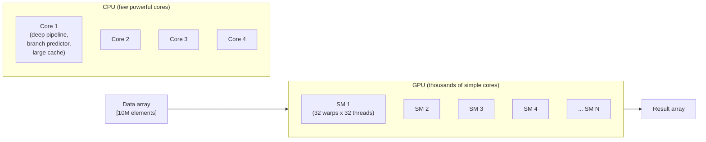
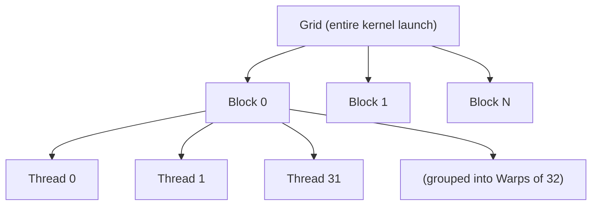
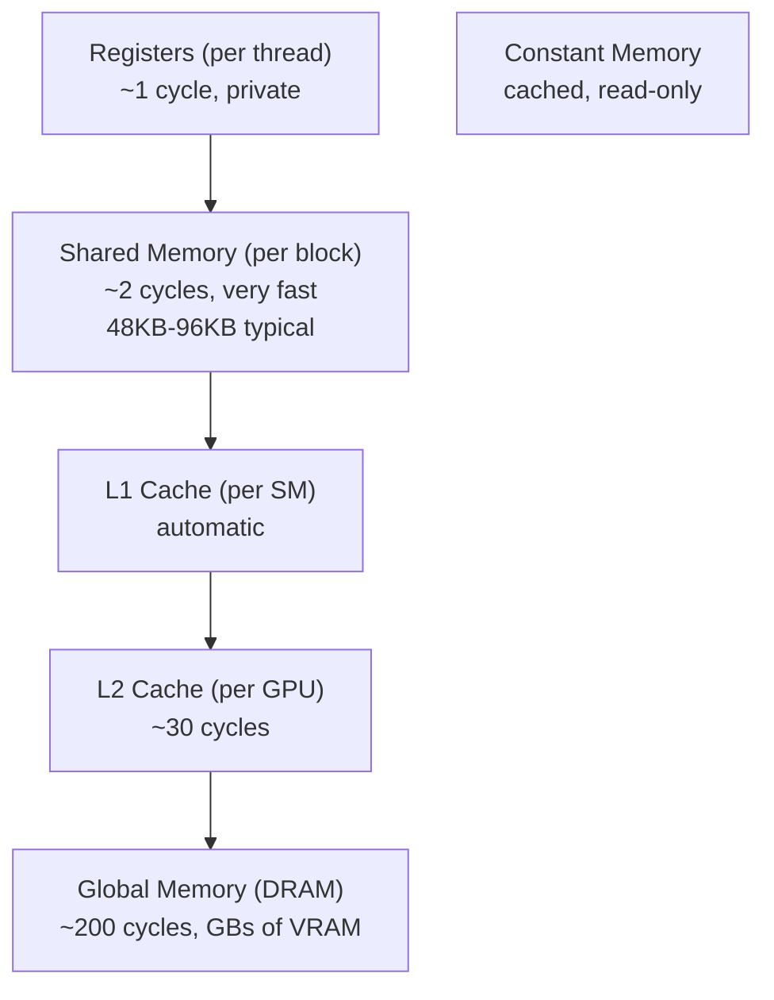
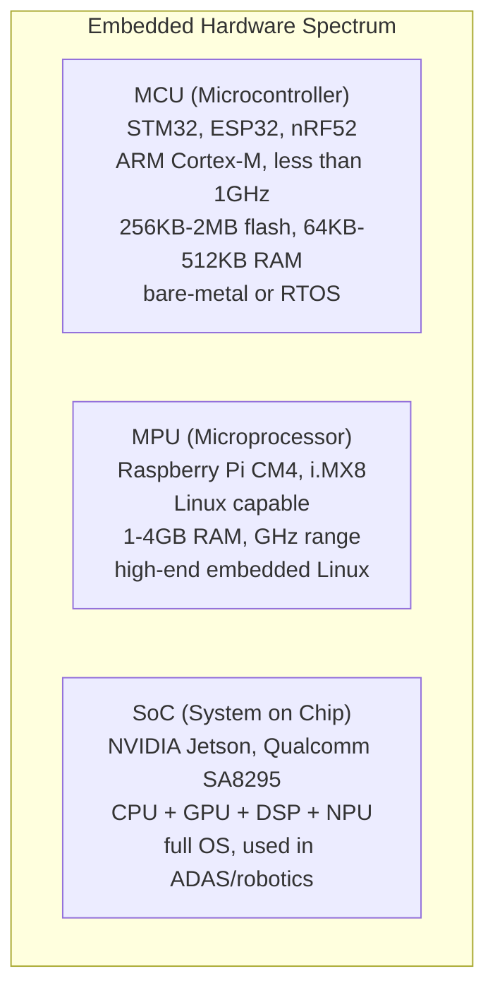
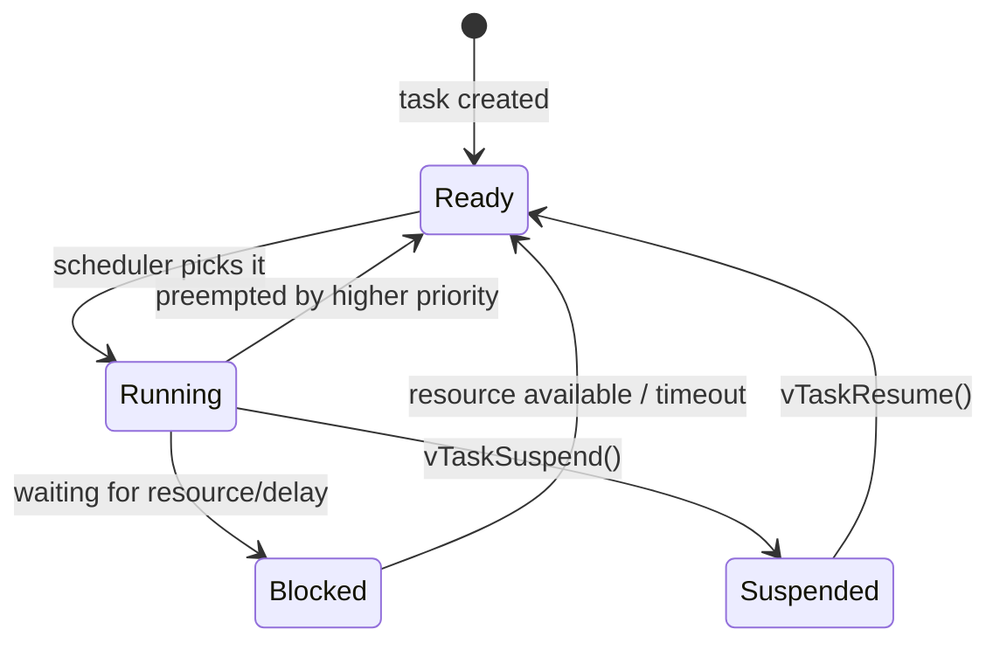

# C++ Bible — Phase 4a: CUDA + Embedded RTOS

> **For agentic workers:** Use superpowers:subagent-driven-development or superpowers:executing-plans to implement task-by-task. Steps use `- [ ]` checkbox syntax.

**Goal:** Write two domain-systems chapters (16-cuda and 17-embedded-rtos) for the C++ Bible tutorial. Each chapter includes a README, core.md (opinionated 2-page essentials), deep-dive.md (reference-grade), interview.md (Q&A pack), and pure-C++ example files that compile without GPU/MCU hardware.

**Tech Stack:** GCC 11.4.0, `g++ -std=c++17`. No `std::expected`, no `std::format`. No LaTeX — math in plain text. No GPU or MCU SDK required for examples (pure C++ simulations).

**Tutorial root:** `tutorial/pillar-4-domain-systems/`

---

## Task 1: Chapter 16-cuda

Tutorial path: `tutorial/pillar-4-domain-systems/16-cuda/`

### Step 1.1 — Create directory structure

- [ ] `mkdir -p tutorial/pillar-4-domain-systems/16-cuda/examples`

### Step 1.2 — Write README.md

- [ ] Create `tutorial/pillar-4-domain-systems/16-cuda/README.md`

```markdown
# Chapter 16: GPU Programming with CUDA

GPU programming with CUDA — from "what is a GPU" to production kernel optimization, the CUDA ecosystem, and interview-ready Q&A.

## Navigation Paths

1. **Beginner GPU path:** core.md → examples/01_vector_add_sim.cpp → deep-dive.md "Thread Hierarchy" section
2. **Memory model focus:** deep-dive.md "Memory Hierarchy" → deep-dive.md "Memory Coalescing" → examples/02_memory_latency_sim.cpp
3. **Ecosystem overview:** deep-dive.md "CUDA Ecosystem" (Thrust, cuBLAS, cuDNN, Nsight)
4. **Interview prep:** interview.md

## Prerequisites

- C++ basics (arrays, loops, functions, pointers)
- Understand what a for-loop does at the CPU level

## Time Estimates

| File | Time |
|---|---|
| core.md | 45 min |
| deep-dive.md | 4 hrs |
| interview.md | 45 min |
| examples (both) | 30 min |

## Platform Note

- **examples/01_vector_add_sim.cpp** and **examples/02_memory_latency_sim.cpp** are pure C++ — no GPU required. Compile with `g++ -std=c++17 -O2`.
- Real CUDA examples (`.cu` files, `nvcc` compiler) live in `projects/04-cuda/` (Atlas Lab). You need an NVIDIA GPU and CUDA toolkit for those.

## Files

| File | Purpose |
|---|---|
| core.md | 2-page essentials — what a GPU is, the programming model, thread hierarchy, memory hierarchy, CUDA ecosystem table, production rules |
| deep-dive.md | Reference-grade — hardware model, warp execution, coalescing, shared memory bank conflicts, occupancy, CUDA streams, unified memory, Thrust, cuBLAS, Nsight Compute workflow |
| interview.md | 13 Q&A pairs covering warp divergence, block sizing, bank conflicts, `__global__`/`__device__`/`__host__`, CUDA vs OpenCL, unified memory, streams, cuDNN layouts, occupancy, memory fences, CUDA graphs, debugging, plus 2 traps |
| examples/01_vector_add_sim.cpp | CPU simulation of CUDA vector add using std::thread — shows block/thread indexing |
| examples/02_memory_latency_sim.cpp | Sequential vs strided memory access benchmark — CPU analog of GPU coalescing |
```

### Step 1.3 — Write core.md

- [ ] Create `tutorial/pillar-4-domain-systems/16-cuda/core.md`

```markdown
# Chapter 16: GPU Programming with CUDA — Core

## What a GPU Actually Is

A CPU is a sprinter: 8–32 powerful cores, deep branch prediction, huge caches, designed to run one task as fast as possible. A GPU is a marathon relay team: thousands of simple cores, shallow pipelines, designed to run thousands of tasks simultaneously.

The key insight: most scientific, graphics, and AI workloads are "embarrassingly parallel" — you want to do the same thing to millions of data elements independently. Matrix multiply, image processing, physics simulation, neural network layers — all of these are `for(int i = 0; i < 10_000_000; i++) result[i] = f(input[i])`. The GPU turns that loop into 10 million simultaneous operations.



## The CUDA Programming Model

CUDA (Compute Unified Device Architecture) is NVIDIA's parallel computing platform. Your C++ code runs on the CPU (the "host"). GPU code ("kernels") runs on the GPU (the "device").

A kernel is a function that executes on the GPU, called from the CPU:

```cpp
// CPU calls this with <<<blocks, threads>>>
__global__ void add(float* a, float* b, float* c, int n) {
    int i = blockIdx.x * blockDim.x + threadIdx.x;  // global thread index
    if (i < n) c[i] = a[i] + b[i];
}

// Launch 1000 blocks of 256 threads = 256,000 threads
add<<<1000, 256>>>(d_a, d_b, d_c, N);
```

## Thread Hierarchy

CUDA organizes threads in three levels:



- **Thread:** the individual worker. Has threadIdx.x/y/z (position within its block).
- **Block:** a group of threads (up to 1024). Threads in a block can share memory and synchronize via `__syncthreads()`. Blocks run on one Streaming Multiprocessor (SM).
- **Grid:** the entire kernel launch. blockIdx.x/y/z identifies which block.
- **Warp:** 32 threads that execute in lockstep (SIMT: Single Instruction Multiple Threads). The hardware unit of execution.

Global thread index (1D grid): `int i = blockIdx.x * blockDim.x + threadIdx.x;`

## Memory Hierarchy



Fast path: keep data in shared memory. Slow path: global memory. The performance difference is 100x.

## The CUDA Ecosystem

CUDA is not just a compiler — it's an entire platform:

| Tool/Library | Purpose |
|---|---|
| nvcc | CUDA compiler (wraps g++) |
| cuda-gdb | GPU debugger |
| cuda-memcheck / compute-sanitizer | Memory error detection on GPU |
| Nsight Compute | Per-kernel GPU profiler (metrics, memory throughput, occupancy) |
| Nsight Systems | System-level timeline (CPU+GPU, CUDA API calls, streams) |
| Thrust | STL-style algorithms on GPU (sort, reduce, scan, transform) |
| cuBLAS | GPU BLAS (matrix multiply, vector ops) |
| cuDNN | Deep neural network primitives (conv, pooling, attention) |
| cuSPARSE | Sparse matrix operations |
| TensorRT | Inference optimizer (graph fusion, INT8 calibration) |
| CUDA Graphs | Record and replay CUDA operations, reduce launch overhead |
| NCCL | Multi-GPU collective operations (AllReduce for distributed training) |

## Production Rules

1. **Profile before optimizing.** 90% of speedup comes from 10% of kernels. Use Nsight Compute first.
2. **Coalesce global memory.** Threads in a warp should access consecutive addresses — one 128-byte cache line serves all 32 threads. Strided access = separate cache lines = 32x bandwidth waste.
3. **Avoid warp divergence.** If half a warp takes the `if` branch and half takes `else`, both branches execute serially. Restructure data to avoid branch divergence in hot paths.
4. **Maximize occupancy, but not at any cost.** Occupancy = active warps / max warps. Low occupancy means the SM is idle. But too many threads per block means too few registers per thread means register spill to local (global) memory.
5. **Use streams for overlap.** Multiple CUDA streams allow compute + memory transfer to overlap. Standard pipeline: `memcpy H->D -> kernel -> memcpy D->H` can be pipelined across batches.
```

### Step 1.4 — Write deep-dive.md

- [ ] Create `tutorial/pillar-4-domain-systems/16-cuda/deep-dive.md`

```markdown
# Chapter 16: GPU Programming with CUDA — Deep Dive

## The GPU Hardware Model

An NVIDIA GPU (e.g., A100, RTX 4090) consists of:
- **Streaming Multiprocessors (SMs):** The compute units. An A100 has 108 SMs. Each SM has 64 CUDA cores (FP32), 32 FP64 cores, tensor cores, an L1 cache, and 96KB of shared memory.
- **Memory controllers:** Connect to GDDR6/HBM2 VRAM. A100 has 80GB HBM2e at 2TB/s bandwidth.
- **L2 cache:** Shared across all SMs. ~40MB on A100.
- **CUDA cores:** 32-bit floating point / integer execution units. One CUDA core = one lane of a warp.

### The Warp Execution Model

A warp is 32 threads that execute the same instruction at the same cycle (SIMT). The SM's warp scheduler picks a warp to execute each cycle. If a warp is waiting for memory, the scheduler switches to another warp — this is how GPU latency hiding works.

Warp divergence: when threads in a warp follow different paths:
```cpp
// BAD: half the warp goes into if, half into else — serialized
if (threadIdx.x % 2 == 0) { /* path A — 16 threads active */ }
else                        { /* path B — 16 threads active */ }
// Both paths execute; inactive threads are masked off

// GOOD: restructure so all threads in a warp take the same path
// Split problem so even/odd threads are in different blocks
```

### Memory Coalescing

Global memory is accessed in 32-byte transactions (4 bytes x 8 threads on some architectures, or 128-byte cache lines). When 32 threads in a warp access 32 consecutive floats (stride-1), one cache line serves all 32 threads. When threads access with stride-N, you need N cache lines.

```cpp
// COALESCED: thread i accesses array[i] — one cache line for warp
float val = array[threadIdx.x + blockIdx.x * blockDim.x];

// NOT COALESCED: thread i accesses array[i * N] — N cache lines for warp
float val = array[(threadIdx.x + blockIdx.x * blockDim.x) * N];
```

For a matrix stored row-major: accessing by row is coalesced; accessing by column is not. This is why matrix transpose kernels are tricky.

### Shared Memory and Bank Conflicts

Shared memory is divided into 32 banks (for 32 threads in a warp). Bank k contains addresses at offset k*4 bytes. Conflict: two threads in the same warp access the same bank — serialized.

```cpp
__shared__ float smem[32][32];
// Thread 0 accesses smem[0][0], thread 1 accesses smem[1][0]...
// All different banks (row-major, consecutive) -> NO CONFLICT

// Thread 0 accesses smem[0][0], thread 1 accesses smem[0][1]...
// Same bank if stride-32 -> CONFLICT
```

Padding fix: `__shared__ float smem[32][33];` — adds 4 bytes to shift each row's bank alignment.

### Occupancy

Occupancy = (active warps on SM) / (max warps on SM). Max warps on SM: 64 (Ampere). Active warps limited by:
- **Registers:** If kernel uses 64 registers/thread, max threads = SM register file size / 64. Ampere: 65536 registers / 64 = 1024 threads = 32 warps = 50% occupancy.
- **Shared memory:** If kernel uses 32KB shared mem/block and SM has 96KB, max 3 blocks/SM.
- **Block size:** Must be a multiple of 32 (warp size). 128 or 256 is typical.

Tool: `nvcc --ptxas-options=-v` prints register usage. `cudaOccupancyMaxPotentialBlockSize()` computes optimal block size.

### CUDA Streams

A stream is a sequence of CUDA operations (memcpy, kernel) that execute in order. Operations in different streams can overlap.

```cpp
cudaStream_t s1, s2;
cudaStreamCreate(&s1);
cudaStreamCreate(&s2);

// Overlap: s1 does batch A while s2 does batch B
cudaMemcpyAsync(d_a1, h_a1, size, cudaMemcpyHostToDevice, s1);
cudaMemcpyAsync(d_a2, h_a2, size, cudaMemcpyHostToDevice, s2);
kernel<<<grid, block, 0, s1>>>(d_a1, d_out1, N);
kernel<<<grid, block, 0, s2>>>(d_a2, d_out2, N);
cudaMemcpyAsync(h_out1, d_out1, size, cudaMemcpyDeviceToHost, s1);
cudaMemcpyAsync(h_out2, d_out2, size, cudaMemcpyDeviceToHost, s2);
cudaStreamSynchronize(s1);
cudaStreamSynchronize(s2);
```

### Unified Memory

`cudaMallocManaged()` allocates memory accessible from both CPU and GPU. The CUDA runtime migrates pages on demand. Simpler code, but page faults (first access from device/host) can be costly. Use `cudaMemPrefetchAsync()` to preemptively move pages to the device before the kernel.

### Thrust

Thrust provides STL-like algorithms on GPU:

```cpp
thrust::device_vector<float> d_vec(N);
thrust::generate(d_vec.begin(), d_vec.end(), rand);
thrust::sort(d_vec.begin(), d_vec.end());  // radix sort on GPU
float sum = thrust::reduce(d_vec.begin(), d_vec.end(), 0.0f);
thrust::transform(d_vec.begin(), d_vec.end(), d_out.begin(),
                  [] __device__ (float x) { return x * 2.0f; });
```

### cuBLAS GEMM

For matrix multiply C = alpha*A*B + beta*C:
```cpp
cublasHandle_t handle;
cublasCreate(&handle);
// Note: cuBLAS uses column-major; for row-major A*B, compute B^T * A^T
cublasSgemm(handle, CUBLAS_OP_N, CUBLAS_OP_N,
            N, M, K,     // matrix dimensions
            &alpha,      // scalar multiplier
            d_B, N,      // matrix B and its leading dimension
            d_A, K,      // matrix A and its leading dimension
            &beta,       // scalar for C
            d_C, N);     // output C and its leading dimension
cublasDestroy(handle);
```

### Nsight Compute Workflow

1. Profile: `ncu --set full -o profile_output ./my_cuda_app`
2. View: `ncu-ui profile_output.ncu-rep` (GUI) or `ncu --import profile_output.ncu-rep`
3. Key metrics:
   - `sm__throughput.avg.pct_of_peak_sustained_elapsed`: overall SM utilization
   - `l1tex__t_sector_hit_rate.pct`: L1 hit rate
   - `dram__throughput.avg.pct_of_peak_sustained_elapsed`: memory bandwidth utilization
   - `smsp__warps_active.avg.pct_of_peak_sustained_active`: warp occupancy
```

### Step 1.5 — Write interview.md

- [ ] Create `tutorial/pillar-4-domain-systems/16-cuda/interview.md`

```markdown
# Chapter 16: CUDA — Interview Pack

## Q&A

**Q: What is warp divergence and what is its performance cost?**
A: Warp divergence occurs when threads in a warp (32 threads executing in lockstep) take different branches of an if/else. The GPU must execute both paths sequentially, masking off inactive threads in each pass. Cost: up to 2x slowdown for 50/50 divergence. Fix: restructure data so threads in the same warp make the same branch decision.

**Q: How do you choose block size for a CUDA kernel?**
A: Must be a multiple of 32 (warp size). Common choices: 128, 256, 512. Trade-offs: larger blocks mean more threads share SM resources (registers, shared memory), which means lower occupancy if resources are tight. Use `cudaOccupancyMaxPotentialBlockSize()` to compute the optimal value. Profile with Nsight Compute to verify.

**Q: What is a bank conflict in shared memory?**
A: Shared memory is divided into 32 banks. If two threads in the same warp access different addresses in the same bank, accesses are serialized (2-way conflict = 2x slower, 32-way = 32x). Fix: pad shared memory arrays by 1 element to shift bank alignment: `__shared__ float s[32][33]` instead of `[32][32]`.

**Q: What is the difference between `__global__`, `__device__`, and `__host__`?**
A: `__global__`: kernel function — called from host, runs on device. `__device__`: device function — called from device only (from another kernel or device function). `__host__`: runs on CPU only (default; only needed when combining with `__device__` for dual compilation). `__host__ __device__`: compiles for both — useful for math functions shared between CPU and GPU code.

**Q: CUDA vs OpenCL — when would you choose one over the other?**
A: CUDA: NVIDIA-only, better tooling (Nsight, cuBLAS, cuDNN), higher performance on NVIDIA hardware, larger ecosystem for AI/ML. OpenCL: vendor-neutral (AMD, Intel, NVIDIA, FPGAs), but worse tooling, more boilerplate, historically lower performance. In 2024+, also consider SYCL (Intel oneAPI) and HIP (AMD, CUDA-compatible source). Choose CUDA unless you need vendor portability.

**Q: When does unified memory hurt performance?**
A: When a kernel accesses memory that has not been prefetched to the device — each page fault pauses the kernel while the page migrates. Also: after the kernel, if the CPU reads GPU-resident pages, those pages migrate back. Fix: use `cudaMemPrefetchAsync()` to move pages before they are needed. Or avoid UM entirely for performance-critical kernels: use explicit `cudaMemcpy`.

**Q: What are CUDA streams and why do you need them?**
A: A CUDA stream is a queue of CUDA operations (memcpy, kernel launch) that execute in order. Operations in different streams can run concurrently (if hardware resources allow). This enables overlapping: H->D memcpy for batch N+1 overlaps with kernel processing batch N. Without streams, all CUDA operations serialize.

**Q: How does cuDNN handle different data layouts?**
A: cuDNN supports NCHW (batch, channel, height, width — standard on NVIDIA), NHWC (common on TensorFlow, faster on some hardware), and NCHWC32/NCHWC4 (tensor core formats). You specify the layout when creating tensor descriptors. Some operations are faster with NHWC on Ampere/Hopper due to tensor core alignment requirements.

**Q: What is occupancy and how do you maximize it?**
A: Occupancy = active warps / maximum warps per SM. Low occupancy means the SM is idle waiting for memory — you want to keep it busy with other warps. Increase occupancy by: reducing registers per thread (compile flag `--maxrregcount`), reducing shared memory per block, choosing smaller block sizes (more blocks per SM). But diminishing returns past ~50% occupancy — latency hiding saturates.

**Q: Explain the difference between `cudaMalloc` and `cudaMallocManaged`.**
A: `cudaMalloc`: allocates memory only on GPU device. You must explicitly `cudaMemcpy` between host and device. `cudaMallocManaged`: allocates unified memory, accessible from both CPU and GPU. Runtime migrates pages on demand. Simpler but with page-fault overhead. Use `cudaMalloc` + explicit memcpy for maximum performance; use `cudaMallocManaged` for prototyping or when migration cost is acceptable.

**TRAP: "Shared memory is always faster than global memory — always use it."**
WRONG: Shared memory has bank conflicts, and loading data into shared memory from global memory costs global memory bandwidth anyway. If your access pattern is already coalesced and you access each element exactly once, shared memory adds overhead. Use shared memory when: (1) data is reused by multiple threads in a block, (2) you need to rearrange access patterns to enable coalesced global memory reads.

**TRAP: "More threads always means more performance."**
WRONG: Too many threads per SM means fewer registers per thread, which means register spill to local memory (slow global memory). Also: too many blocks queued means the scheduler has more to manage. Optimal thread count depends on register usage, shared memory, and the specific SM's limits.

**Q: What is the CUDA memory model regarding writes — do I need memory fences?**
A: Within a block, `__syncthreads()` provides both a barrier (all threads reach it before any continue) and a memory fence (all shared/global writes before the barrier are visible to all threads after it). Across blocks, there is no hardware synchronization — you cannot reliably communicate between blocks in a single kernel. Use separate kernel launches or atomic operations for inter-block communication.

**Q: What is a CUDA Graph and when would you use one?**
A: A CUDA Graph captures a sequence of CUDA operations (kernels, memcpys, events) into a graph structure that can be replayed in a single launch. Benefit: eliminates per-operation launch overhead (~5-10 microseconds per launch). Useful when: same sequence of kernels runs many times (e.g., inference loops), or when launch overhead is a measurable fraction of execution time. Downside: graph capture must occur before parameters are known (no dynamic data-dependent dispatch in graphs).

**Q: How do you debug a CUDA kernel?**
A: (1) `compute-sanitizer --tool memcheck ./app` for memory errors (out-of-bounds, race conditions). (2) `cuda-gdb` for interactive debugging (set breakpoints in kernel code, print threadIdx/blockIdx). (3) `printf` in kernel code (works but buffers output, prints at synchronization points). (4) Nsight Compute for performance bugs. (5) `CUDA_LAUNCH_BLOCKING=1` env var makes all launches synchronous, making error attribution easier.
```

### Step 1.6 — Write example 01_vector_add_sim.cpp

- [ ] Create `tutorial/pillar-4-domain-systems/16-cuda/examples/01_vector_add_sim.cpp`

```cpp
// Simulates CUDA vector add in pure C++ — shows the concept without GPU.
// In real CUDA: each "thread" would be a GPU thread running in parallel.
// Compile: g++ -std=c++17 -O2 -o 01_vector_add_sim 01_vector_add_sim.cpp
#include <iostream>
#include <vector>
#include <thread>
#include <cmath>
#include <algorithm>

// This simulates what a CUDA kernel does: N threads, each handles one element
void cuda_kernel_sim(const float* a, const float* b, float* c, int n,
                     int block_id, int block_size) {
    int start = block_id * block_size;
    int end = std::min(start + block_size, n);
    // Within a CUDA block, 'threads' in a warp execute in lockstep
    for (int thread_idx = start; thread_idx < end; ++thread_idx) {
        // global thread index = blockIdx.x * blockDim.x + threadIdx.x
        int i = thread_idx;
        if (i < n) c[i] = a[i] + b[i];
    }
}

int main() {
    const int N = 1024;
    const int BLOCK_SIZE = 256;  // simulate 256 threads per block

    std::vector<float> h_a(N), h_b(N), h_c(N);
    for (int i = 0; i < N; i++) { h_a[i] = float(i); h_b[i] = float(i) * 2; }

    // Simulate kernel launch: <<<ceil(N/BLOCK_SIZE), BLOCK_SIZE>>>
    int num_blocks = (N + BLOCK_SIZE - 1) / BLOCK_SIZE;
    std::vector<std::thread> threads;
    for (int b = 0; b < num_blocks; b++) {
        threads.emplace_back(cuda_kernel_sim,
            h_a.data(), h_b.data(), h_c.data(), N, b, BLOCK_SIZE);
    }
    for (auto& t : threads) t.join();

    // Verify: c[i] should equal a[i] + b[i] = i + 2i = 3i
    bool ok = true;
    for (int i = 0; i < N; i++) {
        if (std::fabs(h_c[i] - 3.0f * i) > 0.001f) { ok = false; break; }
    }
    std::cout << "Vector add: " << (ok ? "CORRECT" : "WRONG") << "\n";
    std::cout << "Simulated " << num_blocks << " blocks x " << BLOCK_SIZE
              << " threads = " << num_blocks * BLOCK_SIZE << " GPU threads\n";
    std::cout << "c[0]=" << h_c[0] << " c[10]=" << h_c[10]
              << " c[100]=" << h_c[100] << " (expected 0, 30, 300)\n";
    return ok ? 0 : 1;
}
```

### Step 1.7 — Write example 02_memory_latency_sim.cpp

- [ ] Create `tutorial/pillar-4-domain-systems/16-cuda/examples/02_memory_latency_sim.cpp`

```cpp
// Demonstrates how memory access patterns (coalesced vs strided) affect performance.
// This is the CPU analog of what matters even more on a GPU.
// Compile: g++ -std=c++17 -O2 -o 02_memory_latency_sim 02_memory_latency_sim.cpp
#include <iostream>
#include <vector>
#include <chrono>
#include <numeric>
#include <algorithm>

using Clock = std::chrono::high_resolution_clock;

double bench_sequential(const float* data, int N, int repeats) {
    volatile float sum = 0;
    auto t0 = Clock::now();
    for (int r = 0; r < repeats; r++)
        for (int i = 0; i < N; i++) sum += data[i];
    auto t1 = Clock::now();
    (void)sum;
    return std::chrono::duration<double, std::milli>(t1 - t0).count() / repeats;
}

double bench_strided(const float* data, int N, int stride, int repeats) {
    volatile float sum = 0;
    auto t0 = Clock::now();
    for (int r = 0; r < repeats; r++)
        for (int i = 0; i < N; i += stride) sum += data[i];
    auto t1 = Clock::now();
    (void)sum;
    return std::chrono::duration<double, std::milli>(t1 - t0).count() / repeats;
}

int main() {
    const int N = 32 * 1024 * 1024;  // 128MB of floats
    std::vector<float> data(N);
    std::iota(data.begin(), data.end(), 0.0f);

    std::cout << "Memory access pattern benchmark (CPU analog of GPU coalescing)\n";
    std::cout << "Array size: " << N * sizeof(float) / (1024*1024) << " MB\n\n";

    double seq_ms = bench_sequential(data.data(), N, 5);
    std::cout << "Sequential (stride=1, cache-friendly): " << seq_ms << " ms\n";

    for (int stride : {4, 8, 16, 32}) {
        double strided_ms = bench_strided(data.data(), N, stride, 5);
        std::cout << "Stride=" << stride << ": " << strided_ms
                  << " ms  (relative: " << strided_ms/seq_ms << "x)\n";
    }

    std::cout << "\nConclusion: strided access wastes cache lines — same penalty on GPU.\n";
    std::cout << "On GPU, 32 threads accessing stride-32 elements = 32 separate cache lines\n";
    std::cout << "vs sequential access = 1 cache line for all 32 threads.\n";
    return 0;
}
```

### Step 1.8 — Commit chapter 16

- [ ] `git add tutorial/pillar-4-domain-systems/16-cuda/ && git commit -m "docs(tutorial): add chapter 16-cuda"`

---

## Task 2: Chapter 17-embedded-rtos

Tutorial path: `tutorial/pillar-4-domain-systems/17-embedded-rtos/`

### Step 2.1 — Create directory structure

- [ ] `mkdir -p tutorial/pillar-4-domain-systems/17-embedded-rtos/examples`

### Step 2.2 — Write README.md

- [ ] Create `tutorial/pillar-4-domain-systems/17-embedded-rtos/README.md`

```markdown
# Chapter 17: Embedded Systems & RTOS

Embedded systems and real-time operating systems — from "what is an MCU" to FreeRTOS internals, fixed-point math, MISRA safety standards, and interview-ready Q&A.

## Navigation Paths

1. **MCU fundamentals:** core.md → deep-dive.md "The Embedded Development Cycle"
2. **FreeRTOS focus:** deep-dive.md "FreeRTOS Internals" → examples/01_rtos_scheduler_sim.cpp
3. **Safety-critical:** deep-dive.md "MISRA + ISO 26262" → examples/03_memory_pool.cpp
4. **Fixed-point math:** deep-dive.md "Fixed-Point Math" → examples/02_fixed_point_math.cpp
5. **Interview prep:** interview.md

## Prerequisites

- C++ basics (functions, structs, loops)
- Understand what a function call is at the stack level

## Time Estimates

| File | Time |
|---|---|
| core.md | 45 min |
| deep-dive.md | 5 hrs |
| interview.md | 45 min |
| examples (all three) | 45 min |

## Platform Note

- All three examples are **pure C++ simulations** — no MCU, no RTOS SDK, no cross-compiler required.
- Compile with `g++ -std=c++17 -O2` (example 01 also needs `-pthread`).
- Real embedded code (cross-compiled for ARM Cortex-M, FreeRTOS SDK) lives in `projects/04-embedded/` (Atlas Lab). You need `arm-none-eabi-g++` and hardware or QEMU for those.

## Files

| File | Purpose |
|---|---|
| core.md | 2-page essentials — what embedded means, hard/firm/soft RT, RTOS fundamentals, FreeRTOS key API, ecosystem table, production rules |
| deep-dive.md | Reference-grade — embedded dev cycle, linker script, startup code, FreeRTOS internals (TCB, tick ISR, priority inheritance, stack overflow), ISR design rules, fixed-point math (Q15 format, PID), MISRA + ISO 26262, DMA |
| interview.md | 13 Q&A pairs covering priority inversion, malloc in RT systems, reentrancy, hard vs soft RT, context switch, tick ISR, ISR-safe APIs, stack canaries, float in embedded, MISRA, plus 2 traps |
| examples/01_rtos_scheduler_sim.cpp | Preemptive priority scheduler simulation using std::thread |
| examples/02_fixed_point_math.cpp | Q15 fixed-point arithmetic + discrete PID controller |
| examples/03_memory_pool.cpp | Fixed-size block memory pool (O(1) alloc/free, no fragmentation) |
```

### Step 2.3 — Write core.md

- [ ] Create `tutorial/pillar-4-domain-systems/17-embedded-rtos/core.md`

```markdown
# Chapter 17: Embedded Systems & RTOS — Core

## What "Embedded" Actually Means

An embedded system is a computer designed to perform a specific function within a larger device. The constraints that define embedded:

- **Resource limits:** A typical MCU (microcontroller unit) has 256KB of flash (program storage) and 64KB of RAM. Compare: your laptop has 16GB RAM and 1TB SSD.
- **No operating system (often):** Bare-metal embedded means your code runs directly on the hardware, no Linux, no memory manager, no file system. The CPU resets, executes your startup code, and jumps to main().
- **Real-time requirements:** The system must respond to events within a deadline. Miss the deadline and the system fails — an airbag controller that responds 10ms late might as well not respond at all.
- **Power constraints:** Battery-powered devices (IoT, wearables) run for months or years. Your code's CPU utilization and peripheral usage directly determine battery life.
- **Reliability:** Embedded systems often run for years without maintenance. In automotive/medical/aerospace, a crash means human harm.



## Real-Time: Hard, Firm, Soft

- **Hard real-time:** Missing a deadline is a system failure. Example: ABS brake controller must respond within 1ms. Used in automotive, medical devices, flight control.
- **Firm real-time:** Missing a deadline degrades quality but does not crash. Example: streaming video — a late frame is dropped, but the system continues.
- **Soft real-time:** Missing occasional deadlines is tolerable. Example: a UI that usually responds in 100ms but occasionally takes 500ms.

FreeRTOS is used for hard real-time on MCUs. Linux with PREEMPT_RT patches can achieve firm real-time. Standard Linux is soft real-time.

## RTOS Fundamentals

An RTOS (Real-Time Operating System) provides:
- **Tasks:** independent execution contexts with their own stack. Each task has a priority.
- **Scheduler:** determines which task runs. Preemptive priority scheduler: higher-priority task always preempts lower-priority tasks.
- **IPC primitives:** queues, semaphores, mutexes, event groups — safe ways to communicate between tasks.
- **Tick interrupt:** a hardware timer fires at a fixed rate (e.g., 1kHz = 1ms tick). The scheduler runs on every tick to decide which task runs next.



## FreeRTOS Key API

```cpp
// Create a task
xTaskCreate(
    task_function,    // void task(void* params)
    "task_name",
    stack_depth,      // words (not bytes on most platforms)
    nullptr,          // parameters to task
    priority,         // 0 = lowest, configMAX_PRIORITIES-1 = highest
    &task_handle      // optional: handle for later control
);

// Queue: safe producer/consumer across tasks
QueueHandle_t q = xQueueCreate(10, sizeof(int));  // 10 items of int size
xQueueSend(q, &value, portMAX_DELAY);              // block if full
xQueueReceive(q, &value, portMAX_DELAY);           // block if empty

// Mutex: mutual exclusion
MutexHandle_t m = xSemaphoreCreateMutex();
xSemaphoreTake(m, portMAX_DELAY);   // lock
// ... critical section ...
xSemaphoreGive(m);                   // unlock

// Delay: yield CPU for N ticks
vTaskDelay(pdMS_TO_TICKS(100));  // delay 100ms
```

## The Embedded Ecosystem

| Category | Tools |
|---|---|
| Cross-compilers | arm-none-eabi-g++ (bare-metal ARM Cortex-M), arm-linux-gnueabihf-g++ (Linux on ARM) |
| Build systems | CMake with toolchain file, PlatformIO (Arduino-compatible), Makefile |
| Debuggers | OpenOCD + GDB (JTAG/SWD via USB adapter), SEGGER J-Link, pyOCD |
| IDEs | STM32CubeIDE (ST Microelectronics), Keil MDK (ARM), PlatformIO (VS Code plugin), CLion |
| RTOS | FreeRTOS (most popular, free), Zephyr (Linux Foundation, board support packages), RIOT, ThreadX |
| Profiling | Percepio Tracealyzer (RTOS task trace), SEGGER SystemView, ITM trace (ARM Cortex-M) |
| Static analysis | PC-lint Plus, Polyspace (MISRA), cppcheck |
| Simulation | QEMU (CPU emulation), Renode (full embedded system emulation), Wokwi (online simulator) |

## Production Rules

1. **Never use `new`/`malloc` after init in hard real-time code.** Dynamic allocation can fail (OOM) or take variable time. Allocate everything at startup: global arrays, static instances, pre-allocated pools.
2. **Keep ISRs (Interrupt Service Routines) short.** An ISR interrupts everything else. It should: set a flag, post to a queue, clear the interrupt flag — and return. All processing happens in a task.
3. **Avoid priority inversion.** Low-priority task holds a mutex that a high-priority task needs — high-priority task blocks waiting for the low-priority task to release. Use priority-inheriting mutexes (FreeRTOS: `xSemaphoreCreateMutex()` has priority inheritance).
4. **Stack sizing is an art.** Default FreeRTOS stack is tiny. Add stack watermarking (`uxTaskGetStackHighWaterMark()`) and check it. A stack overflow on an MCU corrupts other variables — debugging is brutal.
5. **Watchdog timer.** Always enable the hardware watchdog. The watchdog resets the MCU if not kicked within a timeout. Forces you to keep tasks running; catches infinite loops in production.
```

### Step 2.4 — Write deep-dive.md

- [ ] Create `tutorial/pillar-4-domain-systems/17-embedded-rtos/deep-dive.md`

```markdown
# Chapter 17: Embedded Systems & RTOS — Deep Dive

## The Embedded Development Cycle

```
Write C++ -> Cross-compile (arm-none-eabi-g++) -> Link with linker script ->
Flash to MCU (via OpenOCD/J-Link) -> Debug with GDB over JTAG/SWD ->
Profile with SystemView/Tracealyzer -> Iterate
```

Cross-compiler toolchain file for CMake:
```cmake
set(CMAKE_SYSTEM_NAME Generic)
set(CMAKE_SYSTEM_PROCESSOR arm)
set(CMAKE_C_COMPILER arm-none-eabi-gcc)
set(CMAKE_CXX_COMPILER arm-none-eabi-g++)
set(CMAKE_EXE_LINKER_FLAGS "-specs=nosys.specs -specs=nano.specs")
```

## The Linker Script

The linker script defines the memory layout. Every embedded project has one. It tells the linker where to place code (flash) and data (RAM):

```
MEMORY {
    FLASH (rx) : ORIGIN = 0x08000000, LENGTH = 512K
    RAM (rwx)  : ORIGIN = 0x20000000, LENGTH = 128K
}

SECTIONS {
    .text : {          /* code goes in flash */
        *(.isr_vector) /* interrupt vector table first */
        *(.text*)
        *(.rodata*)
    } > FLASH

    .data : {          /* initialized globals: loaded from flash, copied to RAM */
        _sdata = .;
        *(.data*)
        _edata = .;
    } > RAM AT > FLASH  /* AT > FLASH: LMA in flash, VMA in RAM */

    .bss : {           /* zero-initialized globals: just reserved in RAM */
        _sbss = .;
        *(.bss*)
        *(COMMON)
        _ebss = .;
    } > RAM
}
```

## Startup Code

Before `main()` runs, the MCU executes startup code (usually in startup.s or startup.cpp):
1. Set stack pointer to top of RAM.
2. Copy `.data` section from flash to RAM (`memcpy(_sdata, _ldata, _edata - _sdata)`).
3. Zero `.bss` section (`memset(_sbss, 0, _ebss - _sbss)`).
4. Call global constructors (for C++ static objects).
5. Jump to `main()`.

If you forget step 2-3, global/static variables will have garbage values.

## FreeRTOS Internals

### Task Control Block (TCB)

Each task has a TCB (Task Control Block): a struct storing stack pointer, task priority, state, name, and scheduler linkage. The TCB is the OS's record of a task's existence.

### The Tick ISR and Context Switch

A hardware timer fires every 1ms (configTICK_RATE_HZ = 1000). This triggers the tick ISR:
1. Increment tick count.
2. Check if any delayed tasks should wake up (unblock them).
3. If a higher-priority task is now ready, set the PendSV interrupt flag.
PendSV (on ARM Cortex-M) is the lowest-priority interrupt, which defers context switch to after other ISRs. Context switch saves all CPU registers of the current task to its stack, then loads registers from the next task's TCB.

### Priority Inversion and Priority Inheritance

Classic scenario:
- Task H (high priority) needs Mutex M.
- Task L (low priority) holds Mutex M.
- Task M (medium priority) preempts Task L (because M > L).
- Task H is blocked waiting for L to release M, but L cannot run because M runs. H is effectively blocked by M.

Fix: **Priority Inheritance** — when Task H blocks on Mutex M held by Task L, temporarily raise Task L's priority to Task H's priority. L can now preempt M, complete its critical section, release M, and revert to its original priority. FreeRTOS mutexes (created with `xSemaphoreCreateMutex()`) implement priority inheritance. Binary semaphores do NOT.

### Stack Overflow Detection

FreeRTOS fills task stacks with a known pattern (0xA5A5A5A5) at creation time. `uxTaskGetStackHighWaterMark(handle)` returns the minimum free stack space ever observed (in words). If it is 0, you had a stack overflow. Enable `configCHECK_FOR_STACK_OVERFLOW 2` to call `vApplicationStackOverflowHook()` when detected.

## ISR Design Rules

ISR (Interrupt Service Routine) rules:
1. **No blocking.** Never call `xSemaphoreTake()` from an ISR — use `xSemaphoreTakeFromISR()`. Never call `vTaskDelay()` from an ISR.
2. **Minimal work.** Read the sensor register, post the value to a queue (`xQueueSendFromISR()`), clear the interrupt, return.
3. **Request context switch if needed.** If posting to a queue unblocked a higher-priority task, tell the scheduler: `BaseType_t xHigherPriorityTaskWoken = pdFALSE; xQueueSendFromISR(q, &val, &xHigherPriorityTaskWoken); portYIELD_FROM_ISR(xHigherPriorityTaskWoken);`

## Fixed-Point Math

Why: FPU (Floating Point Unit) is unavailable on low-end Cortex-M0/M0+ MCUs, or float operations are too slow for hard real-time loops on power-constrained devices.

Q-format fixed-point: Q15 means 1 sign bit + 15 fractional bits. Range: -1.0 to +0.99997. The integer value `v` represents `v / 32768.0`.

```cpp
using q15_t = int16_t;  // 1.15 fixed-point

// Convert float to Q15
q15_t float_to_q15(float x) { return (q15_t)(x * 32768.0f); }

// Convert Q15 to float
float q15_to_float(q15_t x) { return (float)x / 32768.0f; }

// Add: same scale, just add (watch for overflow)
q15_t q15_add(q15_t a, q15_t b) { return a + b; }

// Multiply: a*b gives Q30; shift right 15 to get Q15
q15_t q15_mul(q15_t a, q15_t b) {
    return (q15_t)(((int32_t)a * (int32_t)b) >> 15);
}

// PID in Q15
q15_t pid_update(q15_t error, q15_t kp, q15_t ki, q15_t kd) {
    static q15_t integral = 0;
    static q15_t prev_error = 0;
    integral = q15_add(integral, error);  // accumulate
    q15_t derivative = error - prev_error;
    prev_error = error;
    return q15_add(q15_add(q15_mul(kp, error),
                            q15_mul(ki, integral)),
                   q15_mul(kd, derivative));
}
```

## MISRA C++ and ISO 26262

**MISRA C++:2023** is a coding standard for safety-critical C++:
- No dynamic memory allocation after initialization (Rule A18-5-1).
- No recursive function calls (Rule A7-1-7) — unbounded stack depth.
- All functions must have a single return point (advisory).
- No use of undefined behavior (many rules).
- Every possible path through a switch must be covered.

**ISO 26262** (automotive functional safety) defines Automotive Safety Integrity Levels (ASIL A-D). ASIL D (highest) requires: formal software development process, code coverage at or above MC/DC (Modified Condition/Decision Coverage), independent safety analysis, hardware fault tolerance.

## DMA (Direct Memory Access)

DMA lets a peripheral (UART, SPI, ADC) transfer data to RAM without CPU intervention. You configure: source address (peripheral data register), destination address (RAM buffer), transfer count, transfer size (byte/halfword/word). The DMA fires an interrupt when done. Your CPU does other work during the transfer.

Without DMA: CPU reads each byte from UART RX register — 1 CPU cycle per byte. With DMA: DMA fills a 256-byte buffer — CPU gets one interrupt per 256 bytes. 256x fewer interrupts.
```

### Step 2.5 — Write interview.md

- [ ] Create `tutorial/pillar-4-domain-systems/17-embedded-rtos/interview.md`

```markdown
# Chapter 17: Embedded RTOS — Interview Pack

**Q: What is priority inversion and how do you fix it?**
A: Priority inversion occurs when a high-priority task is blocked waiting for a resource (mutex) held by a low-priority task, while a medium-priority task preempts the low-priority holder. Fix: priority inheritance — temporarily raise the low-priority task's priority to that of the high-priority waiter. FreeRTOS `xSemaphoreCreateMutex()` implements priority inheritance; binary semaphores do not.

**Q: Why avoid `malloc`/`new` in hard real-time systems?**
A: (1) Can fail: if heap is exhausted, allocation returns null — system must handle this. (2) Non-deterministic time: heap fragmentation means the same allocation might take 1 microsecond or 1 millisecond. (3) Fragmentation: repeated alloc/free eventually fragments heap, making large allocations impossible. Solution: allocate all memory at startup using static allocation or pre-allocated pools.

**Q: What makes a function non-reentrant?**
A: A function is non-reentrant if it uses shared state that can be corrupted if interrupted and called again: (1) global/static variables without protection, (2) calling non-reentrant library functions (strtok, rand, stdio — they use internal static state), (3) hardware registers accessed without atomic operations. Reentrancy matters in ISR context where your function may interrupt itself.

**Q: Difference between hard and soft real-time?**
A: Hard real-time: missing a deadline is a system failure (ABS brakes, pacemaker). Soft real-time: missing occasional deadlines degrades quality but system continues (video streaming, UI). The distinction matters for: scheduler design (EDF for hard RT), hardware selection (FPU, MCU clock speed), and certification requirements (IEC 61508, ISO 26262 for hard RT systems).

**Q: How does FreeRTOS context switch work?**
A: (1) Tick ISR fires (hardware timer, e.g., 1kHz). (2) Tick ISR increments tick count, unblocks any delayed tasks. (3) If a higher-priority task is now ready, the tick ISR requests a PendSV interrupt. (4) After the tick ISR returns, PendSV fires (lowest-priority interrupt on Cortex-M). (5) PendSV saves all CPU registers (r0-r12, lr, pc, sp) to the current task's stack. (6) Loads the next task's register set from its stack. (7) Returns to the next task.

**Q: What is a tick ISR and what does it do?**
A: The tick ISR is triggered by a hardware timer at a fixed rate (FreeRTOS: configTICK_RATE_HZ, typically 100-1000Hz). It: (1) increments the tick count (used for `vTaskDelay()`), (2) checks if any delayed tasks should be unblocked, (3) may trigger a context switch if a higher-priority task became ready. The tick rate is a trade-off: higher rate = finer timing granularity + more CPU overhead.

**Q: Which FreeRTOS functions are safe to call from an ISR?**
A: FreeRTOS has two variants of IPC functions: regular (e.g., `xQueueSend`) — unsafe in ISR because they may block or disable interrupts in non-ISR-safe ways. ISR-safe (e.g., `xQueueSendFromISR`, `xSemaphoreGiveFromISR`) — take an extra `BaseType_t* pxHigherPriorityTaskWoken` parameter, never block. Always end with `portYIELD_FROM_ISR(xHigherPriorityTaskWoken)`.

**Q: What is a stack canary?**
A: A stack canary is a known value placed at the bottom of a task's stack (FreeRTOS uses 0xA5A5A5A5). If a stack overflow occurs (too much local variable/recursion depth), the canary is overwritten. The OS checks the canary periodically (or at context switch with `configCHECK_FOR_STACK_OVERFLOW 2`) and calls `vApplicationStackOverflowHook()` if it is corrupt.

**Q: Why is float sometimes banned in embedded systems?**
A: (1) No FPU on Cortex-M0/M0+: float ops emulated in software, ~100 cycles vs ~1 cycle with FPU. (2) MISRA and ISO 26262 restrict floating-point due to IEEE 754 rounding non-determinism and NaN/Inf propagation, which can cause undetected errors. (3) Predictable timing: integer/fixed-point operations have deterministic cycle counts; float with FPU subnormal numbers has variable latency.

**Q: Which MISRA rule would you fight to keep?**
A: "No dynamic memory allocation after initialization" (MISRA C++ 2023 Rule A18-5-1). It forces the design discipline of bounding all memory usage at startup, which eliminates an entire class of runtime failures (OOM, fragmentation) in long-running safety-critical systems. Many teams want to relax it for convenience — but the discipline is the point.

**TRAP: "Use a mutex in an ISR."**
WRONG: Mutexes use priority inheritance, which requires the scheduler to be running. In an ISR, the scheduler is suspended. Calling `xSemaphoreTake()` from an ISR will crash or deadlock. Use only ISR-safe APIs: `xSemaphoreGiveFromISR()`, `xQueueSendFromISR()`, and never Take — ISRs should never block.

**TRAP: "More tasks = better RTOS design."**
WRONG: Each task consumes stack memory (250-1000 bytes minimum on MCU). 50 tasks x 512 bytes = 25KB stack alone, on an MCU with 64KB total RAM. Design for minimal tasks: sensor reader, processor, actuator writer, watchdog — 4-8 tasks is often right for MCUs.
```

### Step 2.6 — Write example 01_rtos_scheduler_sim.cpp

- [ ] Create `tutorial/pillar-4-domain-systems/17-embedded-rtos/examples/01_rtos_scheduler_sim.cpp`

```cpp
// Simulates a preemptive priority RTOS scheduler in pure C++.
// Shows task switching, priorities, blocking, and tick-based scheduling.
// Compile: g++ -std=c++17 -O2 -pthread -o 01_rtos_scheduler_sim 01_rtos_scheduler_sim.cpp
#include <iostream>
#include <vector>
#include <functional>
#include <string>
#include <thread>
#include <mutex>
#include <chrono>
#include <algorithm>

struct Task {
    std::string name;
    int priority;       // higher = more important
    int period_ticks;   // how often to run
    int next_run_tick;
    std::function<void()> fn;
};

class RTOSScheduler {
    std::vector<Task> tasks;
    int tick = 0;
    std::mutex log_mtx;

    void log(const std::string& msg) {
        std::lock_guard<std::mutex> lock(log_mtx);
        std::cout << "[tick " << tick << "] " << msg << "\n";
    }

public:
    void add_task(std::string name, int priority, int period_ticks,
                  std::function<void()> fn) {
        tasks.push_back({std::move(name), priority, period_ticks, 0, std::move(fn)});
    }

    void run(int max_ticks) {
        for (tick = 0; tick < max_ticks; ++tick) {
            // Find highest-priority ready task
            Task* selected = nullptr;
            for (auto& t : tasks) {
                if (tick >= t.next_run_tick) {
                    if (!selected || t.priority > selected->priority)
                        selected = &t;
                }
            }

            if (selected) {
                log("Running task '" + selected->name +
                    "' (priority=" + std::to_string(selected->priority) + ")");
                selected->fn();
                selected->next_run_tick = tick + selected->period_ticks;
            } else {
                log("IDLE (no ready tasks)");
            }

            std::this_thread::sleep_for(std::chrono::milliseconds(10));
        }
    }
};

int main() {
    RTOSScheduler sched;

    sched.add_task("sensor_read",    3, 1, []{ std::cout << "    [sensor] reading ADC\n"; });
    sched.add_task("pid_control",    2, 2, []{ std::cout << "    [PID] computing output\n"; });
    sched.add_task("can_transmit",   1, 5, []{ std::cout << "    [CAN] sending frame\n"; });
    sched.add_task("health_monitor", 0, 3, []{ std::cout << "    [watchdog] kicking\n"; });

    std::cout << "=== RTOS Scheduler Simulation (10 ticks) ===\n";
    sched.run(10);
    return 0;
}
```

### Step 2.7 — Write example 02_fixed_point_math.cpp

- [ ] Create `tutorial/pillar-4-domain-systems/17-embedded-rtos/examples/02_fixed_point_math.cpp`

```cpp
// Q15 fixed-point arithmetic + PID controller simulation.
// Demonstrates fixed-point math as used in embedded systems without FPU.
// Compile: g++ -std=c++17 -O2 -o 02_fixed_point_math 02_fixed_point_math.cpp
#include <iostream>
#include <cstdint>
#include <cmath>
#include <iomanip>
#include <algorithm>

using q15_t = int16_t;   // 1.15 fixed-point: 1 sign + 15 fractional bits
using q31_t = int32_t;   // intermediate for multiply

constexpr q15_t Q15_MAX = 32767;
constexpr q15_t Q15_MIN = -32768;

q15_t float_to_q15(float x) {
    float clamped = std::max(-1.0f, std::min(0.9999695f, x));
    return static_cast<q15_t>(clamped * 32768.0f);
}
float q15_to_float(q15_t x) { return static_cast<float>(x) / 32768.0f; }

q15_t q15_add(q15_t a, q15_t b) {
    q31_t sum = (q31_t)a + b;
    return (q15_t)std::max((q31_t)Q15_MIN, std::min((q31_t)Q15_MAX, sum));
}

q15_t q15_mul(q15_t a, q15_t b) {
    q31_t product = (q31_t)a * (q31_t)b;
    return (q15_t)(product >> 15);  // shift out 15 fractional bits
}

// Discrete PID controller
struct PID {
    q15_t kp, ki, kd;
    q15_t integral = 0;
    q15_t prev_error = 0;

    q15_t update(q15_t setpoint, q15_t measurement) {
        q15_t error = q15_add(setpoint, (q15_t)(-measurement));

        // Anti-windup: clamp integral
        q15_t new_integral = q15_add(integral, error);
        integral = new_integral;

        q15_t derivative = q15_add(error, (q15_t)(-prev_error));
        prev_error = error;

        return q15_add(q15_add(q15_mul(kp, error),
                               q15_mul(ki, integral)),
                       q15_mul(kd, derivative));
    }
};

int main() {
    // Simulate: motor position control
    // Setpoint: 0.7 (Q15), starting at 0.0, first-order plant: pos += 0.1 * output
    PID pid{
        float_to_q15(0.5f),   // kp = 0.5
        float_to_q15(0.05f),  // ki = 0.05
        float_to_q15(0.1f),   // kd = 0.1
    };

    q15_t setpoint = float_to_q15(0.7f);
    q15_t position = float_to_q15(0.0f);

    std::cout << "Q15 PID Controller Simulation\n";
    std::cout << std::setw(6) << "Step" << std::setw(12) << "Position"
              << std::setw(12) << "Error" << std::setw(12) << "Output\n";

    for (int step = 0; step < 20; ++step) {
        q15_t output = pid.update(setpoint, position);

        // Simple first-order plant: position += 0.1 * output
        q15_t delta = q15_mul(float_to_q15(0.1f), output);
        position = q15_add(position, delta);

        float pos_f = q15_to_float(position);
        float err_f = q15_to_float(setpoint) - pos_f;

        std::cout << std::setw(6) << step
                  << std::setw(12) << std::fixed << std::setprecision(4) << pos_f
                  << std::setw(12) << err_f
                  << std::setw(12) << q15_to_float(output) << "\n";
    }
    return 0;
}
```

### Step 2.8 — Write example 03_memory_pool.cpp

- [ ] Create `tutorial/pillar-4-domain-systems/17-embedded-rtos/examples/03_memory_pool.cpp`

```cpp
// Fixed-size block memory pool: O(1) alloc/free, no fragmentation.
// This is how embedded systems handle memory without malloc.
// Compile: g++ -std=c++17 -O2 -pthread -o 03_memory_pool 03_memory_pool.cpp
#include <iostream>
#include <array>
#include <cstddef>
#include <mutex>
#include <cassert>
#include <cstdio>

template<typename T, std::size_t N>
class MemoryPool {
    struct Block {
        alignas(T) std::byte storage[sizeof(T)];
        Block* next = nullptr;
    };

    std::array<Block, N> blocks;
    Block* free_list = nullptr;
    std::mutex mtx;
    std::size_t allocated = 0;

public:
    MemoryPool() {
        // Build the free list at construction time — no dynamic allocation
        for (std::size_t i = 0; i < N - 1; ++i)
            blocks[i].next = &blocks[i + 1];
        blocks[N - 1].next = nullptr;
        free_list = &blocks[0];
    }

    T* allocate() {
        std::lock_guard<std::mutex> lock(mtx);
        if (!free_list) return nullptr;  // pool exhausted — deterministic failure
        Block* b = free_list;
        free_list = b->next;
        ++allocated;
        return reinterpret_cast<T*>(b->storage);
    }

    void deallocate(T* ptr) {
        std::lock_guard<std::mutex> lock(mtx);
        auto* b = reinterpret_cast<Block*>(ptr);
        b->next = free_list;
        free_list = b;
        --allocated;
    }

    std::size_t size_allocated() const { return allocated; }
    std::size_t capacity() const { return N; }
};

struct Sensor { int id; float value; char label[16]; };

int main() {
    MemoryPool<Sensor, 8> pool;  // 8 sensor slots, all pre-allocated at startup

    std::cout << "Pool capacity: " << pool.capacity() << "\n";

    // Allocate all 8 slots
    std::array<Sensor*, 8> ptrs{};
    for (int i = 0; i < 8; ++i) {
        ptrs[i] = pool.allocate();
        assert(ptrs[i] != nullptr);
        ptrs[i]->id = i;
        ptrs[i]->value = float(i) * 1.5f;
        std::snprintf(ptrs[i]->label, sizeof(ptrs[i]->label), "sensor_%d", i);
        std::cout << "Allocated sensor " << i << " at " << ptrs[i] << "\n";
    }

    // 9th allocation should fail (pool full) — deterministic, not a crash
    Sensor* overflow = pool.allocate();
    std::cout << "9th allocation: " << (overflow ? "ALLOCATED (BUG!)" : "NULL (correct)") << "\n";

    // Free some, reallocate — O(1) in both directions
    pool.deallocate(ptrs[3]);
    pool.deallocate(ptrs[7]);
    std::cout << "After freeing 2: allocated=" << pool.size_allocated() << "\n";

    Sensor* reused = pool.allocate();
    std::cout << "Reallocated at: " << reused << " (reused freed block)\n";

    return 0;
}
```

### Step 2.9 — Commit chapter 17

- [ ] `git add tutorial/pillar-4-domain-systems/17-embedded-rtos/ && git commit -m "docs(tutorial): add chapter 17-embedded-rtos"`
