# C++ Bible — Phase 4b: Robotics Theory + ROS2 + AI Inference

> **For agentic workers:** Use superpowers:subagent-driven-development or superpowers:executing-plans to implement task-by-task. Steps use `- [ ]` checkbox syntax.

**Goal:** Write 3 chapters (18-robotics-theory, 19-ros2, 20-ai-inference) covering robotics mathematics, ROS2 middleware, and C++ AI inference runtimes.

**Compiler constraint:** GCC 11.4.0 — no `std::expected`, no `std::format`. All examples compile with `g++ -std=c++17`.

**Math notation:** plain readable text, NOT LaTeX. Example: `x = (-b ± sqrt(b²-4ac)) / 2a`

**Architecture:** Each chapter starts from first principles with Mermaid diagrams, then deep dives into production techniques. Examples are standalone C++ programs with no external dependencies (pure stdlib + math). Real ROS2 and ONNX Runtime code is shown as documentation (requires installed SDK) — pure-C++ simulations demonstrate the concepts for compilation.

---

## Task 1: Chapter 18-robotics-theory

Tutorial path: `tutorial/pillar-4-domain-systems/18-robotics-theory/`

### Step 1.1 — Create directory structure

- [ ] Create directory structure

```bash
mkdir -p /home/zaki/workspaces/cpp/tutorial/pillar-4-domain-systems/18-robotics-theory/examples
```

### Step 1.2 — Write README.md

- [ ] Create `/home/zaki/workspaces/cpp/tutorial/pillar-4-domain-systems/18-robotics-theory/README.md`

```markdown
# Chapter 18: Robotics Theory

**What you'll learn:** Coordinate frames and homogeneous transforms, rotation representations (matrices, Euler angles, quaternions), forward kinematics and the Jacobian, PID/LQR/MPC control theory, Kalman filtering and sensor fusion, SLAM concepts, and path planning algorithms (A*, RRT, RRT*).

**Prerequisites:** Linear algebra basics (vectors, matrices, dot product, cross product). Calculus basics (derivatives, integrals). C++ through Chapter 5.

**Time estimate:** Core = 1 hr. Deep Dive = 6 hrs. Interview = 1 hr.

**Reading paths:**

1. Coordinate geometry start: `core.md` → `deep-dive.md` section "Coordinate Frames" → `examples/01_transform_math.cpp`
2. Control theory focus: `core.md` section "PID Control" → `deep-dive.md` section "Control Theory Full Treatment" → `examples/02_pid_controller.cpp`
3. State estimation: `core.md` section "Kalman Filter Intuition" → `deep-dive.md` section "Kalman Filter 5 Equations" → `examples/03_kalman_filter.cpp`
4. Path planning: `deep-dive.md` section "Path Planning" → `examples/04_astar.cpp`
5. Interview prep only: `interview.md`

**Platform:** All examples are pure C++ (stdlib + cmath). No ROS2, no Eigen, no external libraries. Compile: `g++ -std=c++17 -O2`.
```

### Step 1.3 — Write core.md

- [ ] Create `/home/zaki/workspaces/cpp/tutorial/pillar-4-domain-systems/18-robotics-theory/core.md`

```markdown
# Chapter 18: Robotics Theory — Core

## What a Robot Is

A robot is a physical system that perceives its environment through sensors, reasons about what to do, and acts on the world through actuators. The three loops:

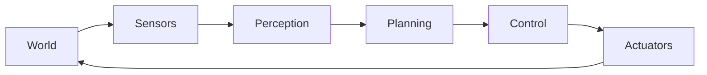

- **Sensors:** cameras (RGB, depth, stereo), LiDAR (360-degree laser range), IMU (accelerometer + gyroscope), encoders (wheel/joint rotation), GPS, force/torque sensors.
- **Actuators:** motors (DC, brushless, servo, stepper), hydraulics, pneumatics, grippers.
- **Computation:** from bare-metal MCU (PID motor controller) to embedded Linux (Nav stack) to cloud (fleet management).

The key insight that separates robotics from other software: the system operates in continuous physical time, must handle uncertainty (sensors are noisy, models are approximate), and must be safe (incorrect outputs move physical hardware).

## Coordinate Frames: The Foundation of Everything

Every robotics problem is fundamentally a question about spatial relationships. A coordinate frame is a reference system: an origin point and three orthogonal axes (X, Y, Z). The right-hand rule defines their orientation: point your right-hand fingers in the X direction, curl them toward Y — your thumb points in Z.

In robotics you always work with multiple frames simultaneously:

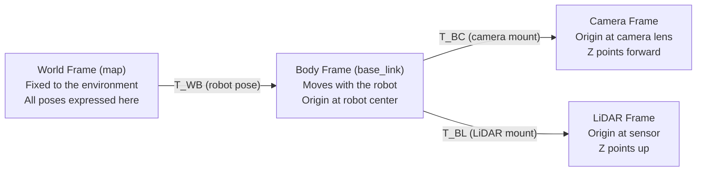

A pose (position + orientation) of frame B in frame W is encoded as a 4x4 homogeneous transformation matrix:

```
T_WB = | R  t |    where R is a 3x3 rotation matrix (columns are frame axes expressed in W)
        | 0  1 |          t is a 3x1 translation vector (origin of B expressed in W)
                          0  is a 1x3 row of zeros
                          1  is a scalar
```

To transform a point p_B expressed in B's frame into W's frame:

```
p_W = T_WB * p_B
```

where p_B is written in homogeneous form as [x, y, z, 1]^T (the trailing 1 allows the matrix multiply to simultaneously rotate and translate).

## Rotation: SO(3)

A rotation matrix R is a 3x3 matrix satisfying:
- Each column has unit length: |col_i| = 1
- Columns are mutually orthogonal: col_i dot col_j = 0 for i != j
- Determinant is +1 (not -1, which would be a reflection)

This set of all valid rotation matrices is called SO(3) — the Special Orthogonal group in 3 dimensions.

Rotation about Z by angle theta:
```
Rz(theta) = | cos(theta)  -sin(theta)  0 |
             | sin(theta)   cos(theta)  0 |
             | 0            0           1 |
```

Rotation about X by angle phi:
```
Rx(phi) = | 1    0          0       |
           | 0   cos(phi)  -sin(phi) |
           | 0   sin(phi)   cos(phi) |
```

Rotation about Y by angle psi:
```
Ry(psi) = |  cos(psi)  0  sin(psi) |
           |  0         1  0        |
           | -sin(psi)  0  cos(psi) |
```

RPY (Roll-Pitch-Yaw) using ZYX convention: `R = Rz(yaw) * Ry(pitch) * Rx(roll)`

This means: first rotate by roll about X, then by pitch about Y, then by yaw about Z. Concatenating rotations is just matrix multiplication — applied right-to-left.

**Gimbal lock:** when pitch = +/-90 degrees, the Rx and Rz axes become parallel — you lose one degree of freedom and can no longer represent arbitrary orientations without ambiguity. This is not a numerical error; it is a fundamental property of Euler angle parameterizations.

**Quaternions:** represent rotation as a 4-tuple `q = (w, x, y, z)` with the constraint `w^2 + x^2 + y^2 + z^2 = 1`. For a rotation by angle theta about a unit axis (ax, ay, az):

```
w = cos(theta/2)
x = ax * sin(theta/2)
y = ay * sin(theta/2)
z = az * sin(theta/2)
```

No gimbal lock. Cheap composition. Smooth interpolation via SLERP. Use quaternions in any production robotics code.

## PID Control: The Workhorse

PID (Proportional-Integral-Derivative) is the most widely deployed control algorithm in existence. It keeps a system at a desired setpoint by computing a corrective output from the error:

```
error(t) = setpoint - measurement(t)

output(t) = Kp * error(t)
           + Ki * integral of error from 0 to t
           + Kd * d(error)/dt
```

Intuition for each term:

- **Kp (Proportional):** respond proportionally to the current error. If the error is large, push hard. If Kp is too small, response is sluggish. If Kp is too large, the system oscillates.
- **Ki (Integral):** accumulate past error. Corrects steady-state offset that proportional control alone cannot eliminate (e.g., friction that always biases the system in one direction). Danger: integral windup if the system is saturated.
- **Kd (Derivative):** respond to the rate of change of error. Acts as a brake — if the error is shrinking fast, reduce the control output to avoid overshoot.

Ziegler-Nichols tuning procedure: set Ki=0, Kd=0. Raise Kp until the system just begins sustained oscillation. Record ultimate gain Ku and oscillation period Tu. Then set: Kp = 0.6*Ku, Ki = 2*Kp/Tu, Kd = Kp*Tu/8.

## Sensor Fusion Intuition: Kalman Filter

No single sensor gives perfect information. An IMU gives high-frequency orientation updates but drifts over seconds. GPS gives absolute position but at 1 Hz with 2-5 meter noise. A wheel encoder gives relative motion but accumulates slip error.

The Kalman filter fuses multiple noisy information sources optimally — where "optimal" means minimum variance estimate. The key insight: weight each sensor's contribution inversely proportional to its uncertainty. A sensor with tiny uncertainty contributes most to the final estimate.

The filter alternates between two phases:

**Predict:** use a motion model to propagate the state estimate forward in time. Uncertainty grows because model is imperfect.

**Update:** incorporate a new measurement. Uncertainty shrinks if the sensor is informative.

Over many cycles the estimate tracks the true state with bounded uncertainty, even when no single sensor is reliable alone.

## SLAM Overview

SLAM = Simultaneous Localization and Mapping. The problem: a robot enters an unknown environment. It must simultaneously build a map and localize itself within that map. This is a chicken-and-egg problem: you need a map to localize, but you need your location to build the map.

Modern solutions (like ORB-SLAM3, Cartographer, RTAB-Map) run graph optimization: robot poses become nodes in a graph, sensor constraints (odometry, landmark observations) become edges. Optimize the graph to find poses that best explain all constraints simultaneously. Loop closure — recognizing a previously-visited location — adds long-range constraints that correct accumulated drift.

## Path Planning Overview

Given: a start configuration, a goal configuration, and a map of obstacles.
Find: a collision-free path from start to goal.

Two broad families:

**Grid-based (A*):** discretize space into a grid. Search the grid for shortest path. Fast on small maps, does not scale to high-dimensional configuration spaces.

**Sampling-based (RRT, RRT*):** randomly sample the configuration space, growing a tree from the start. Handles high dimensions (6-DOF arm) where grid methods are computationally infeasible.

See deep-dive.md for full algorithmic treatment.
```

### Step 1.4 — Write deep-dive.md

- [ ] Create `/home/zaki/workspaces/cpp/tutorial/pillar-4-domain-systems/18-robotics-theory/deep-dive.md`

```markdown
# Chapter 18: Robotics Theory — Deep Dive

## Coordinate Frames: Full Treatment

### The TF Tree

In a robot with multiple sensors and moving joints, the set of all coordinate frames and their relationships forms a tree — called the TF tree (Transform Tree) in ROS2. Every frame has exactly one parent, except the root (usually "map" or "world"). Edges store the 4x4 transform between parent and child.

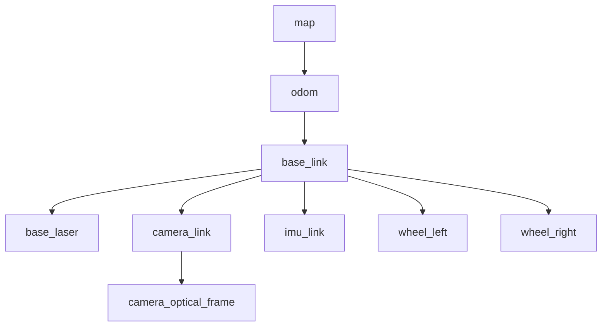

To get the transform between any two frames, walk the tree: find the path from frame A to frame B through the root (going up = apply inverse transform, going down = apply forward transform), compose all transforms along the path.

### Composing Transforms

If you have:
- T_WB: transform from body frame B to world frame W (i.e., robot pose in world)
- T_BC: transform from camera frame C to body frame B (i.e., camera mounting position on robot)

Then the camera pose in world coordinates is:

```
T_WC = T_WB * T_BC
```

Matrix multiplication — note order matters. Reading right-to-left: "first express something in C relative to B, then express it in B relative to W."

### Inverting a Transform

Given T_WB (body in world), to get T_BW (world in body):

For a pure rotation+translation matrix:
```
T = | R  t |
    | 0  1 |

T^(-1) = | R^T   -R^T * t |
          | 0      1       |
```

R^T is the transpose of R, which equals R^(-1) for rotation matrices (this is the definition of SO(3)). -R^T * t is the negated translation expressed in the child frame.

### World to Pixel: The Full Chain

To project a 3D world point into a camera pixel:

```
1. p_W = [X, Y, Z, 1]^T       (point in world frame, homogeneous)
2. p_C = T_CW * p_W            (world to camera: T_CW = T_WC^(-1))
3. p_norm = [p_C.x/p_C.z, p_C.y/p_C.z]  (perspective divide)
4. pixel = K * [p_norm; 1]     (apply camera intrinsics K)
```

Camera intrinsic matrix K:
```
K = | fx   0   cx |
    | 0    fy  cy |
    | 0    0    1 |
```
where fx, fy are focal lengths in pixels, cx, cy is the principal point (usually image center).

## Denavit-Hartenberg Parameters

DH parameters describe a serial robot arm as a chain of rigid bodies connected by joints. This gives a systematic way to assign coordinate frames to each link and compute forward kinematics.

Each link i is defined by 4 parameters:
- `a_i`: link length — distance along X_i from Z_{i-1} to Z_i
- `alpha_i`: link twist — angle from Z_{i-1} to Z_i, measured about X_i
- `d_i`: link offset — distance along Z_{i-1} from X_{i-1} to X_i
- `theta_i`: joint angle — angle from X_{i-1} to X_i, measured about Z_{i-1}. This is the variable for revolute joints; d_i is the variable for prismatic joints.

The homogeneous transform from frame i-1 to frame i:

```
T_{i-1,i} = Rz(theta_i) * Tz(d_i) * Tx(a_i) * Rx(alpha_i)

Expanded as a 4x4 matrix:
| cos(theta_i)  -sin(theta_i)*cos(alpha_i)   sin(theta_i)*sin(alpha_i)   a_i*cos(theta_i) |
| sin(theta_i)   cos(theta_i)*cos(alpha_i)  -cos(theta_i)*sin(alpha_i)   a_i*sin(theta_i) |
| 0              sin(alpha_i)                cos(alpha_i)                 d_i              |
| 0              0                           0                            1                |
```

Forward kinematics of an N-joint arm:

```
T_0N = T_01 * T_12 * T_23 * ... * T_{N-1,N}
```

The end-effector position is the top-right 3x1 column of T_0N. The end-effector orientation is the top-left 3x3 submatrix of T_0N.

Example: 2-link planar arm, both links length L, joints at angles theta1 and theta2:
```
End-effector x = L*cos(theta1) + L*cos(theta1 + theta2)
End-effector y = L*sin(theta1) + L*sin(theta1 + theta2)
```

## The Jacobian

The Jacobian J(q) relates joint velocities to end-effector velocity:

```
v_ee = J(q) * dq/dt
```

where:
- v_ee = [vx, vy, vz, wx, wy, wz]^T  (6-dimensional: linear + angular velocity of end-effector)
- q = [theta1, theta2, ..., thetaN]^T  (joint angles)
- dq/dt = joint velocities
- J(q) is a 6xN matrix (6 rows for 6 DOF velocity, N columns for N joints)

For a 6-DOF arm, J is 6x6. The Jacobian depends on the current joint configuration q.

Geometric Jacobian column i (for revolute joint i):
- Linear part (top 3 rows): `J_Li = Z_{i-1} cross (p_n - p_{i-1})`
  where Z_{i-1} is the joint axis direction and p_n - p_{i-1} is the vector from joint i-1 to the end-effector
- Angular part (bottom 3 rows): `J_Ai = Z_{i-1}` (the joint axis direction)

### Singularities

When det(J) = 0 (for square J) or J loses rank (for non-square J), the arm is at a singular configuration. At a singularity, the arm cannot move the end-effector in certain directions — or equivalently, would require infinite joint velocities to do so.

Common singularities:
- Fully extended arm: all joints aligned along a line — cannot push further in that direction
- Wrist singularity: wrist center lies on shoulder-elbow axis
- Shoulder singularity: elbow aligned with shoulder

Manipulability measure: `w = sqrt(det(J * J^T))`. When w = 0 the arm is at a singularity. Maximize w during motion planning for robust, well-conditioned configurations. Avoid trajectories that pass through or near w = 0.

### Inverse Kinematics

Given a desired end-effector pose T_desired, find joint angles q such that FK(q) = T_desired.

For simple chains: closed-form analytical solutions exist (e.g., 6-DOF arms with spherical wrist — decouple position and orientation). These are fast and exact.

For general chains: numerical IK using the Jacobian pseudo-inverse:
```
delta_q = J^+ * delta_x
q_new = q + delta_q
```
where J^+ = J^T * (J * J^T)^(-1) is the Moore-Penrose pseudoinverse. Iterate until ||delta_x|| < tolerance. Issue: can get stuck in local minima, may not converge near singularities.

## Control Theory — Full Treatment

### PID Discrete Implementation

The continuous PID formula must be discretized for a digital controller running at sample rate dt:

```
e[k] = setpoint - measurement[k]

integral[k] = integral[k-1] + e[k] * dt

derivative[k] = (e[k] - e[k-1]) / dt

u[k] = Kp * e[k] + Ki * integral[k] + Kd * derivative[k]
```

**Anti-windup:** if the actuator saturates (u[k] > u_max or u[k] < u_min), continuing to accumulate the integral causes "windup" — the integral grows to a huge value during the saturation period, causing large overshoot when the system returns to the normal operating range.

Solutions:
- Clamp: stop integrating when the output is saturated: `if (|u[k]| > u_max) { integral[k] = integral[k-1]; }`
- Back-calculation: subtract the saturation error from the integral: `integral[k] += (u_sat[k] - u[k]) / Ki`

**Derivative kick:** when the setpoint changes step-wise, (e[k] - e[k-1])/dt spikes huge (differentiating a step). Avoid by differentiating the measurement instead of the error: `derivative[k] = -(measurement[k] - measurement[k-1]) / dt`

**Derivative filter:** high-frequency noise on the measurement amplifies through differentiation. Low-pass filter the derivative: `d_filtered[k] = alpha * d_filtered[k-1] + (1 - alpha) * derivative[k]` where alpha = tau / (tau + dt), tau is the filter time constant.

### LQR (Linear Quadratic Regulator)

LQR finds the optimal linear state feedback controller `u = -K * x` that minimizes the infinite-horizon cost:

```
J = integral from 0 to infinity of (x^T * Q * x + u^T * R * u) dt
```

Q is a positive semi-definite matrix penalizing state deviation (diagonal: each entry weights how much you care about that state variable). R is a positive definite matrix penalizing control effort (diagonal: each entry weights the cost of that control input).

Intuition of tuning:
- Make Q[i,i] large: strongly penalize state i being off-target — controller becomes aggressive about that state
- Make R[j,j] large: strongly penalize control input j — controller becomes gentle, slower to respond
- Ratio Q/R determines the trade-off between tracking performance and control effort

Solution procedure:
1. Solve the Algebraic Riccati Equation (ARE): `A^T * P + P * A - P * B * R^(-1) * B^T * P + Q = 0` for symmetric positive definite matrix P
2. Compute gain: `K = R^(-1) * B^T * P`
3. Apply: `u = -K * x`

LQR requires a linear system model `x_dot = A*x + B*u`. For nonlinear systems: linearize at the operating point by computing the Jacobian of the dynamics (A = df/dx, B = df/du evaluated at the nominal trajectory). This gives Linear Time-Varying (LTV) LQR for trajectory tracking.

### MPC (Model Predictive Control)

MPC solves an optimization problem at each timestep over a finite future horizon of N steps:

```
minimize   sum_{k=0}^{N-1} (x_k^T * Q * x_k + u_k^T * R * u_k) + x_N^T * P_f * x_N

subject to:
    x_{k+1} = A * x_k + B * u_k    (linear dynamics)
    u_min <= u_k <= u_max           (actuator limits)
    x_min <= x_k <= x_max           (state constraints: joint limits, velocity limits)
    x_0 = x_current                 (initial condition)
```

Apply only the first control u_0 (the first step of the optimal sequence), then re-solve the problem at the next timestep with updated state measurement (receding horizon).

Advantages over LQR:
- Explicitly handles inequality constraints on states and controls (LQR is unconstrained)
- Can incorporate nonlinear dynamics predictions
- Terminal cost P_f provides stability guarantees for finite horizon

Disadvantages:
- Requires solving a QP (Quadratic Program) at each timestep — computationally expensive
- Horizon N and solve time must both be less than the sample period dt
- Requires an accurate system model

Used in: autonomous vehicle trajectory tracking (lane keeping + obstacle avoidance with speed/steering limits), legged robot locomotion (contact timing decisions), industrial process control.

## Kalman Filter — The 5 Equations

State space model:

```
Process: x_k = F * x_{k-1} + B * u_{k-1} + w_k   where w_k ~ N(0, Q)
Measurement: z_k = H * x_k + v_k                  where v_k ~ N(0, R)
```

x_k is the state vector (what you want to estimate). z_k is the measurement vector (what your sensors give you). F is the state transition matrix (how state evolves). H is the measurement matrix (how state maps to measurements). Q is process noise covariance (how uncertain your model is). R is measurement noise covariance (how noisy your sensor is).

The 5 equations — run these every timestep:

**Predict step** (propagate state forward using model):
```
1. x_pred = F * x_est + B * u           (predicted state mean)
2. P_pred = F * P_est * F^T + Q         (predicted state covariance)
```

**Update step** (incorporate new measurement z_k):
```
3. K = P_pred * H^T * (H * P_pred * H^T + R)^(-1)    (Kalman gain)
4. x_est = x_pred + K * (z_k - H * x_pred)            (corrected state)
5. P_est = (I - K * H) * P_pred                        (corrected covariance)
```

Interpretation of Kalman gain K:

```
K = P_pred * H^T / (H * P_pred * H^T + R)
           ^^^                         ^^^
    prediction uncertainty       measurement uncertainty
```

- When R is large (noisy sensor): K is small — weight the measurement lightly, trust the prediction
- When Q is large (uncertain model): P_pred is large, K approaches H^(-1) — weight the measurement heavily, trust the sensor

The innovation `(z_k - H * x_pred)` is the residual between what you measured and what you predicted you would measure. K scales how much to correct the state based on this surprise.

### Extended Kalman Filter (EKF)

For nonlinear systems: `x_k = f(x_{k-1}, u_{k-1}) + w` and `z_k = h(x_k) + v`.

Replace linear matrices with Jacobians evaluated at the current estimate:
- F = Jacobian of f with respect to x, evaluated at x_est
- H = Jacobian of h with respect to x, evaluated at x_pred

Then run the standard 5 equations. Works well for mild nonlinearity. Can diverge if the nonlinearity is severe or the initial estimate is far from the true state.

### Unscented Kalman Filter (UKF)

Instead of linearizing, UKF propagates a set of carefully chosen sigma points (2n+1 points for n-dimensional state) through the nonlinear functions, then computes the mean and covariance of the transformed points. Captures higher-order effects of nonlinearity. More accurate than EKF for highly nonlinear systems. Slightly more expensive.

### Complementary Filter (IMU)

The simplest practical fusion approach for IMU attitude estimation:

```
roll_est[k] = alpha * (roll_est[k-1] + gyro_roll_rate * dt) + (1 - alpha) * accel_roll
```

alpha ≈ 0.98: high-pass filter the gyro (fast response, but drifts), low-pass filter the accelerometer (absolute reference, but noisy and disturbed by acceleration). Simple, runs on any microcontroller, no matrix operations needed.

## SLAM: Simultaneous Localization and Mapping

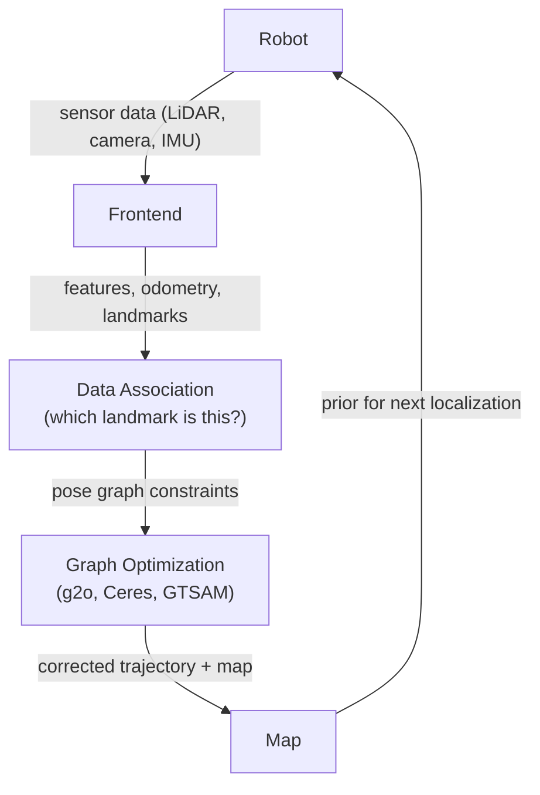

**Graph-based SLAM:**
- Nodes = robot poses at different timesteps
- Edges = constraints between poses (from odometry: "I moved ~1m forward", or from observations: "I see landmark L from pose A and pose B, so A and B must have this relative pose")
- Optimization: find poses that minimize the sum of squared constraint violations (nonlinear least squares)
- Loop closure: recognize a previously visited location. This adds a long-range edge in the graph, connecting poses that are far apart in time but nearby in space. After loop closure, re-optimize the entire graph — accumulated drift gets distributed across the trajectory.

**ORB-SLAM3** (state of the art, open-source):
- Uses ORB (Oriented FAST and Rotated BRIEF) feature descriptors for place recognition and matching
- Three parallel threads:
  - Tracking (per-frame, ~30ms): estimate current pose from ORB feature matching against local map
  - Local mapping (slower): triangulate new 3D points, refine recent poses with bundle adjustment
  - Loop closing (slowest): search for loop closure using bag-of-words vocabulary, optimize entire map when found
- Supports monocular (scale ambiguous), stereo (metric scale), RGB-D, and monocular+IMU

**Scale ambiguity:** monocular cameras cannot determine absolute scale from a single image sequence. Everything is relative. Doubling all distances gives an equally valid explanation of the observations. Stereo cameras or IMU integration resolves scale.

## Path Planning

### Configuration Space

Instead of planning in 3D Cartesian space (where the robot is a complex shape), plan in configuration space (C-space): the space of all possible robot configurations. For a point robot in 2D: C-space is 2D. For a 6-DOF arm: C-space is 6D. A joint limit or collision with an obstacle maps to a forbidden region in C-space.

Advantage: the robot becomes a point in C-space. Path planning reduces to finding a path for a point from start to goal, avoiding forbidden regions.

### A* Algorithm

```
1. Initialize: open_set = {start}, g[start] = 0, f[start] = h(start)
               closed_set = {}, parent = {}

2. Loop:
   a. If open_set is empty: no path exists — return failure
   b. current = node in open_set with lowest f value
   c. If current == goal: reconstruct path via parent pointers — return success
   d. Move current from open_set to closed_set

   e. For each neighbor n of current:
      - If n in closed_set: skip
      - g_new = g[current] + cost(current, n)
      - If g_new < g[n] (or n not yet visited):
          g[n] = g_new
          parent[n] = current
          f[n] = g[n] + h(n)
          Add n to open_set (or update priority)
```

Heuristic h(n) requirements:
- Admissible: h(n) <= true_cost(n, goal). Guarantees optimal path.
- Consistent (monotone): h(n) <= cost(n, m) + h(m) for all neighbors m. Guarantees no node is re-expanded.
- For 2D grid: Euclidean distance is admissible and consistent. Manhattan distance is admissible (and tighter) if movement is 4-directional.

A* vs Dijkstra: Dijkstra uses h(n) = 0 (explores all directions equally). A* uses an informed heuristic to bias search toward the goal — much faster on large maps with a good heuristic.

A* vs Greedy Best-First: Greedy uses only h(n), ignoring g(n). Finds a path fast but not necessarily optimal.

### RRT (Rapidly-exploring Random Tree)

```
1. T = tree with single node {start}

2. Repeat N times:
   a. q_rand = random point in C-space
      (with 5-10% probability: q_rand = goal  -- goal biasing)
   b. q_near = nearest node in T to q_rand  (using Euclidean distance)
   c. q_new = move from q_near toward q_rand by step size delta
              (or q_rand itself if |q_rand - q_near| < delta)
   d. If the straight-line path q_near -> q_new is collision-free:
          T.add_node(q_new)
          T.add_edge(q_near, q_new)
          If |q_new - goal| < epsilon:
              return path from start to q_new

3. Return failure (no path found in N iterations)
```

Properties:
- Probabilistically complete: as N -> infinity, probability of finding a path (if one exists) -> 1
- Not optimal: found path is typically 10-30% longer than shortest path
- Scales to high-dimensional C-spaces (6-DOF arm planning) where grid methods are infeasible
- Does not require an explicit C-space representation — only a collision checker

### RRT*

RRT* adds a rewiring step after adding q_new:

```
After adding q_new to T:

5. Find all nodes in T within radius r of q_new:
   near_nodes = {n in T : dist(n, q_new) < r}

6. Choose best parent for q_new:
   for n in near_nodes:
       if cost(start -> n) + cost(n -> q_new) < cost(start -> q_new) and collision_free(n, q_new):
           update q_new's parent to n

7. Rewire neighbors through q_new:
   for n in near_nodes:
       if cost(start -> q_new) + cost(q_new -> n) < cost(start -> n) and collision_free(q_new, n):
           update n's parent to q_new
```

RRT* is asymptotically optimal: as N -> infinity, the path converges to the globally optimal path. The radius r typically shrinks as the tree grows: `r = gamma * (log(N)/N)^(1/d)` where d is the dimension of C-space.

When does the difference between RRT and RRT* matter? When path quality is critical and you have budget for more iterations (offline planning). For real-time reactive planning in dynamic environments, RRT's speed often outweighs RRT*'s quality improvement.
```

### Step 1.5 — Write interview.md

- [ ] Create `/home/zaki/workspaces/cpp/tutorial/pillar-4-domain-systems/18-robotics-theory/interview.md`

```markdown
# Chapter 18: Robotics Theory — Interview Questions

## Q1: What is the difference between forward kinematics and inverse kinematics?

**Forward kinematics (FK):** given joint angles q = [theta1, ..., thetaN], compute the end-effector pose T_0N. This is always unique (one configuration -> one pose) and computationally trivial (multiply the DH transform matrices together).

**Inverse kinematics (IK):** given a desired end-effector pose T_desired, find joint angles q such that FK(q) = T_desired. This is hard: may have zero, one, or multiple solutions. For a 6-DOF arm with spherical wrist, up to 16 analytical solutions exist. Numerical IK (Jacobian pseudo-inverse) is iterative, can fail to converge, and does not find all solutions.

## Q2: What causes gimbal lock and how do you avoid it?

Gimbal lock occurs when two rotation axes align due to the intermediate rotation, causing a loss of one degree of freedom. In ZYX Euler angles (yaw-pitch-roll), when pitch = +/-90 degrees, the roll and yaw axes become parallel — any rotation that was previously achievable by a combination of roll and yaw now collapses into one axis.

Avoid by: (1) using quaternions, which have no gimbal lock (their parameterization is redundant — two quaternions represent each rotation — but this is harmless); (2) using rotation matrices directly; (3) re-parameterizing (choosing a different Euler convention) at the cost of shifting the singularity.

## Q3: Why use quaternions over Euler angles in production robotics code?

Four reasons:
1. No gimbal lock — quaternions represent all rotations without singularity
2. Composition is a single quaternion multiply (4-component operation) vs matrix multiply (27 multiplications + 18 additions for 3x3)
3. SLERP (Spherical Linear Interpolation) gives the shortest-arc, constant-speed interpolation between two orientations — essential for smooth motion planning
4. Numerical stability — a quaternion stays near unit length under repeated multiplication; a rotation matrix accumulates numerical drift requiring periodic re-orthogonalization

## Q4: What is the Jacobian in robotics and what does det(J) = 0 mean?

The Jacobian J(q) is a 6xN matrix that maps joint velocities to end-effector velocity: `v_ee = J(q) * dq/dt`. Each column corresponds to one joint; each row corresponds to one component of end-effector velocity (3 linear + 3 angular).

When det(J) = 0 (for 6-DOF arm), the Jacobian is rank-deficient. Physically, there exists a direction in Cartesian space where the end-effector cannot move — or would require infinite joint velocities to do so. This is a singularity. Controllers must detect and avoid singular configurations, typically by monitoring the manipulability measure `w = sqrt(det(J * J^T))`.

## Q5: When does the Kalman filter fail to converge?

Several failure modes:
1. **Wrong noise parameters:** if Q (process noise) is set too small, the filter trusts the model too much and the estimates diverge from reality. If R (measurement noise) is set too small, the filter over-trusts the sensor and becomes sensitive to outliers.
2. **Model mismatch:** Kalman filter assumes linear dynamics. If the real system is significantly nonlinear and you use the standard KF (not EKF), the linearization error accumulates and the filter diverges.
3. **Unobservable states:** if a state cannot be inferred from the measurements (the system is not observable — rank(observability matrix) < n), the covariance for that state grows unbounded.
4. **Data association failures:** in SLAM, if a landmark is incorrectly associated (you think you are observing landmark A but it is actually landmark B), the wrong constraint corrupts the estimate.

## Q6: EKF vs UKF — when to choose which?

**EKF:** linearizes nonlinear functions (f, h) by computing their Jacobians at the current estimate. First-order approximation. Fast (just matrix operations after linearization). Fails when nonlinearity is severe or the initial estimate is far from truth (linearization error too large). Widely used in robotics (attitude estimation, visual odometry).

**UKF:** propagates 2n+1 sigma points through the nonlinear function without linearizing. Captures mean and covariance to third order. More accurate for highly nonlinear systems. Slightly more expensive. Does not require computing Jacobians (useful when f or h are complex or discontinuous). Choose UKF when: EKF is diverging, the system is strongly nonlinear, or Jacobians are hard to compute analytically.

## Q7: What is loop closure in SLAM?

Loop closure is the event of recognizing that the robot has returned to a previously-visited location. In graph SLAM, this adds a new constraint (edge) between the current pose node and the old pose node where the location was first visited. This edge carries information that the two poses are spatially close.

Before loop closure, accumulated odometry error causes the map to be inconsistent (the robot thinks it is at position X but the old map says the starting point is 5 meters away). After loop closure, global optimization (g2o, GTSAM) redistributes the accumulated error across the entire trajectory, making the map consistent. This is the mechanism that prevents drift from accumulating indefinitely.

## Q8: A* vs Dijkstra — what is the difference?

Dijkstra's algorithm is A* with h(n) = 0. Both maintain a priority queue sorted by f(n). In Dijkstra f(n) = g(n) (cost from start). In A* f(n) = g(n) + h(n) (cost from start + estimated cost to goal).

The heuristic h(n) biases A*'s search toward the goal. On a large map, A* typically expands far fewer nodes than Dijkstra before finding the optimal path. On a sparse graph or when the heuristic is uninformative (h = 0), they are identical.

**TRAP:** "A* always finds the optimal path." Only if the heuristic is admissible (never overestimates the true remaining cost). An inadmissible heuristic (e.g., h(n) = 5 * Euclidean_distance on a map where movement costs 1 per cell) makes A* find paths faster but they may not be optimal.

## Q9: RRT vs RRT* — when does the difference matter?

Both are probabilistically complete (find a path eventually if one exists). The difference is path quality:

- **RRT:** adds nodes greedily, no rewiring. Finds a feasible path quickly. Path quality does not improve with more samples.
- **RRT*:** rewires the tree to improve path costs. Asymptotically optimal — path quality improves with more samples and converges to the global optimum.

The difference matters when:
- Path length/smoothness is critical (industrial arm with energy cost constraints)
- You have planning budget beyond "first feasible path"
- Obstacle geometry makes greedy RRT paths unnecessarily long (e.g., U-shaped obstacles)

Use RRT when: real-time planning is required, first feasible path is acceptable, environment changes rapidly (previous tree is discarded anyway).

## Q10: What is MPC and why is it computationally expensive?

MPC (Model Predictive Control) solves a constrained optimization problem at every control timestep: find the sequence of future control inputs over an N-step horizon that minimizes a cost function subject to dynamics constraints, actuator limits, and state constraints. Only the first control is applied; the rest are discarded and the problem is re-solved next timestep (receding horizon).

Computationally expensive because: solving a Quadratic Program (QP) or Nonlinear Program (NLP) at each timestep requires iterative solvers (active-set, interior-point, ADMM). For a 100-step horizon with 12-state, 4-input system, the QP has O(100 * 12) = 1200 decision variables. Solve times range from microseconds (simple linear MPC, warm-started) to tens of milliseconds (nonlinear MPC). The control frequency must be at least as fast as the solve time allows.

## Q11: PID anti-windup — what problem does it solve?

When the actuator saturates (e.g., motor at max current), the PID output is clamped and the commanded value is not applied to the system. However, the integral term keeps accumulating error during saturation. When the system eventually leaves saturation, the integral has "wound up" to a large value, causing a large overshoot in the opposite direction before the integral eventually decays.

Anti-windup prevents this: the most common approach stops integrating when the output is saturated (clamp method). A more sophisticated approach (back-calculation) subtracts the saturation error from the integrator, allowing it to unwind faster.

## Q12: What is controllability and observability?

**Controllability:** a system `x_dot = Ax + Bu` is controllable if you can drive the state from any initial state to any desired state in finite time using appropriate inputs u. Test: the controllability matrix `C = [B, AB, A^2*B, ..., A^(n-1)*B]` must have rank n (full row rank). If not controllable, some states are unreachable by any input.

**Observability:** a system is observable if you can determine the full state x from outputs y = Cx over finite time. Test: the observability matrix `O = [C; CA; CA^2; ...; CA^(n-1)]` must have rank n. If not observable, some states are invisible to the sensors — their values cannot be estimated no matter how good the estimator.

Both are prerequisites for designing a stabilizing state feedback controller (controllability) and a Kalman filter (observability).

## Q13: What is the DH convention used for?

Denavit-Hartenberg (DH) convention is a systematic method for assigning coordinate frames to the links of a serial robot arm, enabling a compact representation of the kinematic chain with only 4 parameters per joint: link length (a), link twist (alpha), link offset (d), and joint angle (theta). Given DH parameters for all N joints, forward kinematics is the product of N standard 4x4 matrices. This makes FK computation uniform regardless of the robot's geometry.

## Q14: How does ORB-SLAM3 handle scale ambiguity?

In monocular mode, ORB-SLAM3 cannot determine metric scale — the map is correct up to an unknown scale factor. Using IMU integration (visual-inertial mode): the accelerometer provides gravity reference and acceleration measurements that are independent of scale, allowing the algorithm to recover metric scale after sufficient motion. Using stereo cameras: disparity between left and right images directly encodes metric depth via the known baseline, so scale is recovered immediately from stereo triangulation.

## Q15: What is a particle filter and when is it better than EKF?

A particle filter represents the state distribution as a set of N weighted samples (particles). Each particle is a hypothesis about the current state. At each timestep: (1) propagate each particle through the motion model with random noise; (2) weight each particle by how well it explains the latest measurement; (3) resample particles proportional to weights (kill low-weight particles, duplicate high-weight ones).

Better than EKF when:
- The true distribution is multimodal (the robot could be in one of several rooms — EKF can only represent a single Gaussian, particle filter naturally represents multiple hypotheses)
- The nonlinearity is extreme and EKF linearization is inaccurate
- The measurement model is non-Gaussian (e.g., binary landmark detection)

Worse than EKF when: state dimension is high (particle filter requires exponentially more particles to cover a high-dimensional space), or real-time performance is needed on constrained hardware.

## Q16: Describe the Complementary Filter approach for IMU attitude estimation

A complementary filter fuses a gyroscope (high-frequency, low noise, but drifts) with an accelerometer (absolute orientation reference from gravity, but noisy and disturbed by linear acceleration):

```
roll[k] = alpha * (roll[k-1] + gyro_x * dt) + (1 - alpha) * atan2(accel_y, accel_z)
pitch[k] = alpha * (pitch[k-1] + gyro_y * dt) + (1 - alpha) * atan2(-accel_x, sqrt(accel_y^2 + accel_z^2))
```

alpha = 0.98 typical. The gyro integration term is high-passed (alpha = 0.98 means 98% gyro, decaying DC). The accelerometer term is low-passed. Together they cover the full frequency spectrum: fast changes from the gyro, long-term stability from the accelerometer.

## Q17: What is the manipulability ellipsoid?

The manipulability ellipsoid visualizes the directions in which the end-effector can move most easily given the current joint configuration. It is derived from the singular value decomposition of the Jacobian: `J = U * S * V^T`. The principal axes of the ellipsoid are the columns of U, and the lengths of the axes are the singular values S_i. Large singular values: high velocity amplification in that direction. Small singular values (close to 0): the robot is near-singular in that direction, and small joint velocities produce little end-effector motion.

## Q18: Why is Euclidean distance an admissible heuristic for A* on a grid?

The straight-line (Euclidean) distance between two points is always less than or equal to any actual path distance, because the shortest possible path between two points in Euclidean space is the straight line. On a grid with movement cost proportional to physical distance, Euclidean distance therefore never overestimates the true cost to reach the goal. Admissibility is satisfied.

## Q19: What is a kinematic chain and what is the difference between open and closed chains?

A kinematic chain is a series of rigid bodies connected by joints. An open chain has one end fixed (the base) and one end free (the end-effector) — like a robot arm. Forward kinematics is straightforward (sequential matrix multiplication). A closed chain has constraints that form loops — like a parallel robot (Delta robot, Stewart platform) or the legs of a walking robot (foot on ground closes the chain). Closed chains require solving constraint equations simultaneously; FK is much harder.

## Q20: How would you tune a PID controller for a drone's altitude hold?

Starting procedure:
1. Set Ki = 0, Kd = 0. Tune Kp by increasing from 0 until the drone oscillates. Use about half of the Kp that causes oscillation.
2. Add Ki gradually to eliminate steady-state altitude error (hovering slightly low/high). Start very small (10-100x smaller than Kp). Too much Ki causes slow oscillations.
3. Add Kd to dampen transient overshoot when a setpoint step is commanded. Differentiate the altitude measurement (not the error) to avoid derivative kick on setpoint changes.
4. Add anti-windup: altitude saturates throttle at 100% — without anti-windup, the integrator winds up during aggressive climbs, causing overshoot at the target altitude.
5. Add derivative filter (low-pass on barometric altitude measurement) since barometric sensors are noisy — unfiltered derivative amplifies noise into throttle commands.

Special consideration for altitude hold: barometric pressure altitude is accurate but has 0.5-2m noise at 1-10Hz. Use sensor fusion with an IMU's vertical accelerometer for a smoother signal.
```

### Step 1.6 — Write example 01_transform_math.cpp

- [ ] Create `/home/zaki/workspaces/cpp/tutorial/pillar-4-domain-systems/18-robotics-theory/examples/01_transform_math.cpp`

```cpp
// 01_transform_math.cpp
// Homogeneous transform math: SO(3) rotations, 4x4 transform matrices,
// composition, inverse, applying to points, and 3-link planar arm FK.
// Compile: g++ -std=c++17 -O2 -o 01_transform_math 01_transform_math.cpp

#include <array>
#include <cmath>
#include <cstdio>
#include <string>

// ─────────────────────────── 4x4 matrix ────────────────────────────────────

struct Mat4 {
    double m[4][4]{};

    static Mat4 identity() {
        Mat4 r;
        r.m[0][0] = r.m[1][1] = r.m[2][2] = r.m[3][3] = 1.0;
        return r;
    }

    Mat4 operator*(const Mat4& o) const {
        Mat4 r;
        for (int i = 0; i < 4; ++i)
            for (int j = 0; j < 4; ++j)
                for (int k = 0; k < 4; ++k)
                    r.m[i][j] += m[i][k] * o.m[k][j];
        return r;
    }

    void print(const char* name) const {
        std::printf("%s:\n", name);
        for (int i = 0; i < 4; ++i) {
            std::printf("  [");
            for (int j = 0; j < 4; ++j)
                std::printf(" %8.4f", m[i][j]);
            std::printf(" ]\n");
        }
    }
};

// 3-vector for convenience
struct Vec3 { double x, y, z; };

// ─────────────────────────── Rotation matrices ──────────────────────────────

// Rotation about Z axis by angle_rad
Mat4 Rz(double angle_rad) {
    Mat4 r = Mat4::identity();
    double c = std::cos(angle_rad), s = std::sin(angle_rad);
    r.m[0][0] =  c; r.m[0][1] = -s;
    r.m[1][0] =  s; r.m[1][1] =  c;
    return r;
}

// Rotation about X axis by angle_rad
Mat4 Rx(double angle_rad) {
    Mat4 r = Mat4::identity();
    double c = std::cos(angle_rad), s = std::sin(angle_rad);
    r.m[1][1] =  c; r.m[1][2] = -s;
    r.m[2][1] =  s; r.m[2][2] =  c;
    return r;
}

// Rotation about Y axis by angle_rad
Mat4 Ry(double angle_rad) {
    Mat4 r = Mat4::identity();
    double c = std::cos(angle_rad), s = std::sin(angle_rad);
    r.m[0][0] =  c; r.m[0][2] =  s;
    r.m[2][0] = -s; r.m[2][2] =  c;
    return r;
}

// Pure translation
Mat4 Trans(double tx, double ty, double tz) {
    Mat4 r = Mat4::identity();
    r.m[0][3] = tx;
    r.m[1][3] = ty;
    r.m[2][3] = tz;
    return r;
}

// ─────────────────────────── Transform utilities ────────────────────────────

// Inverse of a rotation+translation matrix:
//   T^-1 = | R^T  -R^T*t |
//           | 0     1     |
Mat4 inverse_transform(const Mat4& T) {
    Mat4 r = Mat4::identity();

    // R^T (transpose of upper-left 3x3)
    for (int i = 0; i < 3; ++i)
        for (int j = 0; j < 3; ++j)
            r.m[i][j] = T.m[j][i];

    // -R^T * t
    for (int i = 0; i < 3; ++i) {
        r.m[i][3] = 0.0;
        for (int k = 0; k < 3; ++k)
            r.m[i][3] -= r.m[i][k] * T.m[k][3];
    }
    return r;
}

// Apply transform T to point p (uses homogeneous form internally)
Vec3 apply_transform(const Mat4& T, Vec3 p) {
    return {
        T.m[0][0]*p.x + T.m[0][1]*p.y + T.m[0][2]*p.z + T.m[0][3],
        T.m[1][0]*p.x + T.m[1][1]*p.y + T.m[1][2]*p.z + T.m[1][3],
        T.m[2][0]*p.x + T.m[2][1]*p.y + T.m[2][2]*p.z + T.m[2][3]
    };
}

// Extract position (translation) from a 4x4 transform
Vec3 position(const Mat4& T) {
    return { T.m[0][3], T.m[1][3], T.m[2][3] };
}

// ─────────────────────────── Planar 3-link arm FK ───────────────────────────

// 3-link planar arm, all revolute joints, link lengths L1, L2, L3.
// Joint angles theta1 (base), theta2 (elbow), theta3 (wrist).
// All joints rotate about Z. Links extend along X of each joint frame.
// Returns end-effector position.

Vec3 planar_arm_fk(double L1, double L2, double L3,
                   double theta1, double theta2, double theta3) {
    // DH for planar arm: alpha=0, d=0. Each frame: rotate by theta, translate by L along X.
    // T_{i-1,i} = Rz(theta_i) * Trans(Li, 0, 0)

    Mat4 T01 = Rz(theta1) * Trans(L1, 0.0, 0.0);
    Mat4 T12 = Rz(theta2) * Trans(L2, 0.0, 0.0);
    Mat4 T23 = Rz(theta3) * Trans(L3, 0.0, 0.0);

    Mat4 T03 = T01 * T12 * T23;
    return position(T03);
}

// ─────────────────────────── main ───────────────────────────────────────────

int main() {
    const double PI = std::acos(-1.0);

    std::printf("=== Rotation Matrices ===\n\n");

    Mat4 Rz45 = Rz(PI / 4.0);
    Rz45.print("Rz(45 deg)");

    Mat4 Rx30 = Rx(PI / 6.0);
    Rx30.print("Rx(30 deg)");

    std::printf("\n=== Composed Transform: Rz(45) * Rx(30) ===\n\n");
    (Rz45 * Rx30).print("Rz45 * Rx30");

    std::printf("\n=== Transform and its Inverse ===\n\n");
    Mat4 T = Rz(PI / 3.0) * Trans(2.0, 3.0, 0.0);
    T.print("T (Rz(60deg), translate [2,3,0])");
    Mat4 Tinv = inverse_transform(T);
    Tinv.print("T_inv");
    Mat4 should_be_identity = T * Tinv;
    should_be_identity.print("T * T_inv (should be identity)");

    std::printf("\n=== Apply Transform to Point ===\n\n");
    Vec3 p_local = { 1.0, 0.0, 0.0 };
    Vec3 p_world = apply_transform(T, p_local);
    std::printf("Point in local frame: (%.4f, %.4f, %.4f)\n", p_local.x, p_local.y, p_local.z);
    std::printf("Point in world frame: (%.4f, %.4f, %.4f)\n", p_world.x, p_world.y, p_world.z);

    // Verify: applying T_inv to p_world should give back p_local
    Vec3 p_back = apply_transform(Tinv, p_world);
    std::printf("Back to local (via T_inv): (%.4f, %.4f, %.4f)\n", p_back.x, p_back.y, p_back.z);

    std::printf("\n=== 3-Link Planar Arm Forward Kinematics ===\n\n");
    const double L1 = 1.0, L2 = 0.8, L3 = 0.5;

    struct TestCase { double t1, t2, t3; const char* desc; };
    TestCase cases[] = {
        { 0.0,  0.0,  0.0,  "All joints at 0 (fully extended along X)" },
        { PI/2, 0.0,  0.0,  "Base rotated 90 deg, rest straight" },
        { 0.0,  PI/2, 0.0,  "Elbow bent 90 deg" },
        { PI/4, PI/4, PI/4, "All joints at 45 deg" },
        { PI/3, -PI/3, PI/6, "Mixed angles" },
    };

    std::printf("Link lengths: L1=%.2f, L2=%.2f, L3=%.2f\n\n", L1, L2, L3);

    for (const auto& tc : cases) {
        Vec3 ee = planar_arm_fk(L1, L2, L3, tc.t1, tc.t2, tc.t3);
        std::printf("%-45s  -> EE = (%.4f, %.4f, %.4f)\n", tc.desc, ee.x, ee.y, ee.z);
    }

    std::printf("\n=== Verify Fully Extended Case ===\n");
    std::printf("Expected EE.x = L1+L2+L3 = %.4f\n", L1 + L2 + L3);
    Vec3 ee0 = planar_arm_fk(L1, L2, L3, 0.0, 0.0, 0.0);
    std::printf("Computed EE.x = %.4f\n", ee0.x);

    std::printf("\n=== RPY (ZYX) Composition ===\n\n");
    double yaw = PI/6, pitch = PI/8, roll = PI/10;
    Mat4 R_rpy = Rz(yaw) * Ry(pitch) * Rx(roll);
    R_rpy.print("R_rpy = Rz(yaw) * Ry(pitch) * Rx(roll)");

    return 0;
}
```

### Step 1.7 — Write example 02_pid_controller.cpp

- [ ] Create `/home/zaki/workspaces/cpp/tutorial/pillar-4-domain-systems/18-robotics-theory/examples/02_pid_controller.cpp`

```cpp
// 02_pid_controller.cpp
// Discrete PID controller with anti-windup and derivative filter.
// Plant model: double integrator (joint position control).
// acceleration = control_output (divided by inertia)
// Compile: g++ -std=c++17 -O2 -o 02_pid_controller 02_pid_controller.cpp

#include <algorithm>
#include <cmath>
#include <cstdio>

struct PIDConfig {
    double Kp, Ki, Kd;
    double dt;            // sample period (seconds)
    double u_max;         // actuator saturation limit (±)
    double deriv_alpha;   // derivative low-pass filter coefficient (0=no filter, 0.9=heavy filter)
};

struct PIDState {
    double integral     = 0.0;
    double prev_error   = 0.0;
    double deriv_filt   = 0.0;  // filtered derivative
    bool   initialized  = false;
};

double pid_update(const PIDConfig& cfg, PIDState& st,
                  double setpoint, double measurement) {
    double error = setpoint - measurement;

    // Derivative (of error; on first call, skip to avoid spike)
    double raw_deriv = 0.0;
    if (st.initialized) {
        raw_deriv = (error - st.prev_error) / cfg.dt;
    }
    st.initialized = true;
    st.prev_error = error;

    // Low-pass filter on derivative
    st.deriv_filt = cfg.deriv_alpha * st.deriv_filt + (1.0 - cfg.deriv_alpha) * raw_deriv;

    // Tentative output (without integral yet, for anti-windup check)
    double u_pre = cfg.Kp * error + cfg.Kd * st.deriv_filt;

    // Integrate: only accumulate if not saturated (clamp anti-windup)
    double u_with_integral = u_pre + cfg.Ki * (st.integral + error * cfg.dt);
    if (std::abs(u_with_integral) <= cfg.u_max) {
        st.integral += error * cfg.dt;
    }
    // (If saturated, do not grow integral further)

    double u = cfg.Kp * error + cfg.Ki * st.integral + cfg.Kd * st.deriv_filt;

    // Clamp output to actuator limits
    u = std::max(-cfg.u_max, std::min(cfg.u_max, u));
    return u;
}

int main() {
    // Plant: double integrator
    //   accel = u / inertia
    //   velocity += accel * dt
    //   position += velocity * dt
    const double INERTIA = 1.0;   // kg (simplified)
    const double DT      = 0.01;  // 100 Hz control loop
    const int    STEPS   = 300;   // 3 seconds of simulation

    PIDConfig cfg;
    cfg.Kp          = 50.0;
    cfg.Ki          = 20.0;
    cfg.Kd          = 15.0;
    cfg.dt          = DT;
    cfg.u_max       = 100.0;   // max force (N)
    cfg.deriv_alpha = 0.7;     // moderate derivative filtering

    PIDState state;

    double setpoint = 1.0;   // target position: 1.0 m
    double pos      = 0.0;
    double vel      = 0.0;

    std::printf("%-6s  %-10s  %-10s  %-10s  %-10s\n",
                "Step", "Setpoint", "Position", "Error", "Output");
    std::printf("%s\n", std::string(58, '-').c_str());

    for (int i = 0; i < STEPS; ++i) {
        // Step setpoint change at t=1.5s to test anti-windup and transient response
        if (i == 150) {
            setpoint = 2.0;
            std::printf("\n--- Setpoint changed to %.1f at step %d ---\n\n", setpoint, i);
        }

        double u = pid_update(cfg, state, setpoint, pos);
        double accel = u / INERTIA;
        vel += accel * DT;
        pos += vel * DT;

        double error = setpoint - pos;

        // Print every 10 steps
        if (i % 10 == 0) {
            std::printf("%-6d  %-10.4f  %-10.4f  %-10.6f  %-10.4f\n",
                        i, setpoint, pos, error, u);
        }
    }

    std::printf("\nFinal position: %.6f (setpoint: %.1f, error: %.6f)\n",
                pos, setpoint, setpoint - pos);
    std::printf("Steady-state error < 0.001: %s\n",
                std::abs(setpoint - pos) < 0.001 ? "YES (Ki working)" : "NO");

    // Demonstrate anti-windup effect with windup-disabled version
    std::printf("\n=== Anti-windup demonstration ===\n");
    std::printf("Saturating the output artificially for 50 steps...\n");

    PIDConfig cfg_noaw = cfg;
    PIDConfig cfg_aw   = cfg;

    PIDState state_noaw, state_aw;

    double pos_noaw = 0.0, vel_noaw = 0.0;
    double pos_aw   = 0.0, vel_aw   = 0.0;

    // Manually simulate with very strong disturbance (position stuck at 0 for 50 steps)
    // to wind up the integral, then release
    for (int i = 0; i < 100; ++i) {
        double measurement_noaw = (i < 50) ? 0.0 : pos_noaw;  // stuck for 50 steps
        double measurement_aw   = (i < 50) ? 0.0 : pos_aw;

        double u_noaw = pid_update(cfg_noaw, state_noaw, 1.0, measurement_noaw);
        double u_aw   = pid_update(cfg_aw,   state_aw,   1.0, measurement_aw);

        if (i >= 50) {
            vel_noaw += (u_noaw / INERTIA) * DT;
            pos_noaw += vel_noaw * DT;
            vel_aw   += (u_aw / INERTIA) * DT;
            pos_aw   += vel_aw * DT;
        }

        if (i >= 48 && i % 2 == 0) {
            std::printf("step %3d: integral_state=%.4f  pos=%.4f  u=%.4f\n",
                        i, state_aw.integral, pos_aw, u_aw);
        }
    }

    return 0;
}
```

### Step 1.8 — Write example 03_kalman_filter.cpp

- [ ] Create `/home/zaki/workspaces/cpp/tutorial/pillar-4-domain-systems/18-robotics-theory/examples/03_kalman_filter.cpp`

```cpp
// 03_kalman_filter.cpp
// 2-state Kalman filter: tracks position and velocity from noisy position measurements.
// Demonstrates the 5 equations. Compares KF estimate to raw noisy measurement.
// Compile: g++ -std=c++17 -O2 -o 03_kalman_filter 03_kalman_filter.cpp

#include <array>
#include <cmath>
#include <cstdio>
#include <cstdlib>
#include <random>

// ─── Minimal 2x2 matrix math ─────────────────────────────────────────────────

using Mat2 = std::array<std::array<double,2>,2>;
using Vec2 = std::array<double,2>;

Mat2 mat2_add(const Mat2& A, const Mat2& B) {
    return {{ {{A[0][0]+B[0][0], A[0][1]+B[0][1]}},
              {{A[1][0]+B[1][0], A[1][1]+B[1][1]}} }};
}

Mat2 mat2_mul(const Mat2& A, const Mat2& B) {
    return {{ {{A[0][0]*B[0][0]+A[0][1]*B[1][0],  A[0][0]*B[0][1]+A[0][1]*B[1][1]}},
              {{A[1][0]*B[0][0]+A[1][1]*B[1][0],  A[1][0]*B[0][1]+A[1][1]*B[1][1]}} }};
}

Mat2 mat2_transpose(const Mat2& A) {
    return {{ {{A[0][0], A[1][0]}},
              {{A[0][1], A[1][1]}} }};
}

// Inverse of 2x2 matrix
Mat2 mat2_inv(const Mat2& A) {
    double det = A[0][0]*A[1][1] - A[0][1]*A[1][0];
    return {{ {{ A[1][1]/det, -A[0][1]/det}},
              {{-A[1][0]/det,  A[0][0]/det}} }};
}

Vec2 mat2_vec(const Mat2& A, const Vec2& v) {
    return {{ A[0][0]*v[0]+A[0][1]*v[1],
              A[1][0]*v[0]+A[1][1]*v[1] }};
}

// ─── Kalman Filter ────────────────────────────────────────────────────────────
// State: x = [position, velocity]^T   (2-dimensional)
// Measurement: z = position only       (1-dimensional scalar)
//
// Process model: x_k = F * x_{k-1} + w   (constant velocity model)
//   F = | 1  dt |
//       | 0   1 |
//
// Measurement model: z_k = H * x_k + v
//   H = | 1  0 |   (we only observe position)
//
// We implement the 5 KF equations using 2x2 matrices for the full state covariance.
// The 1D measurement scalar case simplifies the Kalman gain to a 2x1 vector.

struct KalmanFilter {
    Vec2 x;     // state estimate [position, velocity]
    Mat2 P;     // state covariance
    Mat2 F;     // state transition
    Mat2 Q;     // process noise covariance
    double H0;  // H = [1, 0] -- only first component is measured
    double R;   // measurement noise variance

    void init(double init_pos, double init_vel,
              double dt, double process_noise, double measurement_noise) {
        x = {{ init_pos, init_vel }};
        P = {{ {{10.0, 0.0}}, {{0.0, 10.0}} }};   // large initial uncertainty

        F = {{ {{1.0, dt}}, {{0.0, 1.0}} }};

        // Q = process noise: velocity random walk
        double q = process_noise;
        Q = {{ {{q*dt*dt*dt/3.0, q*dt*dt/2.0}},
               {{q*dt*dt/2.0,    q*dt       }} }};

        H0 = 1.0;  // H = [1, 0]
        R  = measurement_noise * measurement_noise;
    }

    // Returns filtered position estimate after incorporating measurement z
    double update(double z) {
        // ── Predict ──────────────────────────────────────────────────────────
        // Eq 1: x_pred = F * x
        Vec2 x_pred = mat2_vec(F, x);

        // Eq 2: P_pred = F * P * F^T + Q
        Mat2 FT    = mat2_transpose(F);
        Mat2 P_pred = mat2_add(mat2_mul(mat2_mul(F, P), FT), Q);

        // ── Update ──────────────────────────────────────────────────────────
        // Innovation: y = z - H * x_pred
        // H = [1, 0], so H * x_pred = x_pred[0]
        double y = z - x_pred[0];

        // Eq 3: Kalman gain: K = P_pred * H^T * (H * P_pred * H^T + R)^(-1)
        // H * P_pred * H^T = P_pred[0][0]  (scalar, since H picks first row/col)
        // P_pred * H^T = first column of P_pred = [P_pred[0][0], P_pred[1][0]]^T
        double S  = P_pred[0][0] + R;   // innovation covariance (scalar)
        Vec2 K = {{ P_pred[0][0] / S,   // K[0] = gain for position state
                    P_pred[1][0] / S }}; // K[1] = gain for velocity state

        // Eq 4: x_est = x_pred + K * y
        x[0] = x_pred[0] + K[0] * y;
        x[1] = x_pred[1] + K[1] * y;

        // Eq 5: P_est = (I - K*H) * P_pred
        // (I - K*H) applied to P_pred:
        // K*H is a 2x2 matrix with first column = K, rest = 0
        // (I - K*H)[i][j] = (i==j ? 1 : 0) - K[i] * H[j]
        // H = [1, 0] so only j=0 column is affected
        P[0][0] = (1.0 - K[0]) * P_pred[0][0];
        P[0][1] = (1.0 - K[0]) * P_pred[0][1];
        P[1][0] = (    - K[1]) * P_pred[0][0] + P_pred[1][0];
        P[1][1] = (    - K[1]) * P_pred[0][1] + P_pred[1][1];

        return x[0];  // filtered position
    }

    double estimated_pos() const { return x[0]; }
    double estimated_vel() const { return x[1]; }
    double pos_uncertainty() const { return std::sqrt(P[0][0]); }
};

int main() {
    const double DT = 0.1;       // 10 Hz
    const int    N  = 100;       // 10 seconds

    // True motion: constant velocity 0.5 m/s with a small acceleration bump at t=5s
    const double TRUE_VEL      = 0.5;   // m/s
    const double MEAS_NOISE    = 2.0;   // GPS-like: 2m std dev
    const double PROCESS_NOISE = 0.1;   // model uncertainty

    KalmanFilter kf;
    kf.init(0.0, 0.0, DT, PROCESS_NOISE, MEAS_NOISE);

    std::default_random_engine rng(42);
    std::normal_distribution<double> noise(0.0, MEAS_NOISE);

    double true_pos = 0.0;
    double true_vel = TRUE_VEL;

    std::printf("%-5s  %-10s  %-12s  %-12s  %-10s  %-10s\n",
                "Step", "True Pos", "Noisy Meas", "KF Estimate", "Error(raw)", "Error(KF)");
    std::printf("%s\n", std::string(72, '-').c_str());

    double sum_sq_raw = 0.0, sum_sq_kf = 0.0;

    for (int i = 0; i < N; ++i) {
        // True dynamics: gentle velocity change at step 50
        if (i == 50) {
            true_vel = 1.0;
            std::printf("\n--- True velocity changed to %.1f m/s at step %d ---\n\n",
                        true_vel, i);
        }
        true_pos += true_vel * DT;

        // Simulate noisy measurement
        double meas = true_pos + noise(rng);

        // KF update
        double kf_pos = kf.update(meas);

        double err_raw = meas    - true_pos;
        double err_kf  = kf_pos  - true_pos;
        sum_sq_raw += err_raw * err_raw;
        sum_sq_kf  += err_kf  * err_kf;

        if (i % 5 == 0) {
            std::printf("%-5d  %-10.4f  %-12.4f  %-12.4f  %-10.4f  %-10.4f\n",
                        i, true_pos, meas, kf_pos, err_raw, err_kf);
        }
    }

    std::printf("\n=== Summary ===\n");
    std::printf("RMS error (raw measurement): %.4f m\n", std::sqrt(sum_sq_raw / N));
    std::printf("RMS error (Kalman filter):   %.4f m\n", std::sqrt(sum_sq_kf  / N));
    std::printf("Improvement factor:          %.2fx\n",
                std::sqrt(sum_sq_raw) / std::sqrt(sum_sq_kf));
    std::printf("Final KF velocity estimate: %.4f m/s (true: %.1f)\n",
                kf.estimated_vel(), 1.0);
    std::printf("Final position uncertainty: %.4f m (1-sigma)\n",
                kf.pos_uncertainty());

    return 0;
}
```

### Step 1.9 — Write example 04_astar.cpp

- [ ] Create `/home/zaki/workspaces/cpp/tutorial/pillar-4-domain-systems/18-robotics-theory/examples/04_astar.cpp`

```cpp
// 04_astar.cpp
// A* path planning on a 20x20 grid with obstacle walls.
// Uses Manhattan distance heuristic. Prints ASCII map with path.
// Compile: g++ -std=c++17 -O2 -o 04_astar 04_astar.cpp

#include <algorithm>
#include <array>
#include <cmath>
#include <cstdio>
#include <functional>
#include <limits>
#include <queue>
#include <vector>

static const int ROWS = 20;
static const int COLS = 20;

struct Cell {
    int row, col;
    bool operator==(const Cell& o) const { return row == o.row && col == o.col; }
};

// Grid: 0 = free, 1 = obstacle
int grid[ROWS][COLS] = {};

void add_wall(int r1, int c1, int r2, int c2) {
    for (int r = r1; r <= r2; ++r)
        for (int c = c1; c <= c2; ++c)
            grid[r][c] = 1;
}

// Manhattan distance heuristic (admissible for 4-directional movement)
double heuristic(Cell a, Cell b) {
    return std::abs(a.row - b.row) + std::abs(a.col - b.col);
}

struct Node {
    double f;
    Cell   cell;
    bool operator>(const Node& o) const { return f > o.f; }
};

// Returns path from start to goal (inclusive), or empty if no path.
std::vector<Cell> astar(Cell start, Cell goal) {
    const int dr[] = {-1, 1,  0, 0};
    const int dc[] = { 0, 0, -1, 1};

    // g[r][c] = best known cost from start to (r,c)
    double g[ROWS][COLS];
    Cell   parent[ROWS][COLS];
    bool   in_closed[ROWS][COLS];

    for (int r = 0; r < ROWS; ++r)
        for (int c = 0; c < COLS; ++c) {
            g[r][c]         = std::numeric_limits<double>::infinity();
            parent[r][c]    = {-1, -1};
            in_closed[r][c] = false;
        }

    g[start.row][start.col] = 0.0;

    std::priority_queue<Node, std::vector<Node>, std::greater<Node>> open;
    open.push({heuristic(start, goal), start});

    while (!open.empty()) {
        auto [f_cur, cur] = open.top();
        open.pop();

        if (cur == goal) {
            // Reconstruct path
            std::vector<Cell> path;
            Cell c = goal;
            while (!(c == start)) {
                path.push_back(c);
                c = parent[c.row][c.col];
            }
            path.push_back(start);
            std::reverse(path.begin(), path.end());
            return path;
        }

        if (in_closed[cur.row][cur.col]) continue;
        in_closed[cur.row][cur.col] = true;

        for (int d = 0; d < 4; ++d) {
            int nr = cur.row + dr[d];
            int nc = cur.col + dc[d];
            if (nr < 0 || nr >= ROWS || nc < 0 || nc >= COLS) continue;
            if (grid[nr][nc] == 1) continue;       // obstacle
            if (in_closed[nr][nc])   continue;     // already finalized

            double g_new = g[cur.row][cur.col] + 1.0;
            if (g_new < g[nr][nc]) {
                g[nr][nc]         = g_new;
                parent[nr][nc]    = cur;
                double f_new      = g_new + heuristic({nr, nc}, goal);
                open.push({f_new, {nr, nc}});
            }
        }
    }

    return {};  // No path found
}

void print_map(const std::vector<Cell>& path, Cell start, Cell goal) {
    // Build path set for fast lookup
    bool on_path[ROWS][COLS] = {};
    for (const auto& c : path)
        on_path[c.row][c.col] = true;

    std::printf("\nMap (# = wall, . = free, * = path, S = start, G = goal):\n\n");
    std::printf("   ");
    for (int c = 0; c < COLS; ++c) std::printf("%d", c % 10);
    std::printf("\n");

    for (int r = 0; r < ROWS; ++r) {
        std::printf("%2d ", r);
        for (int c = 0; c < COLS; ++c) {
            Cell cur = {r, c};
            if (cur == start)      std::printf("S");
            else if (cur == goal)  std::printf("G");
            else if (grid[r][c])   std::printf("#");
            else if (on_path[r][c]) std::printf("*");
            else                   std::printf(".");
        }
        std::printf("\n");
    }
}

int main() {
    // Build obstacle map
    // Horizontal wall with gap
    add_wall(5, 2, 5, 14);   // horizontal wall, rows 5, cols 2-14
    // Leave gap at col 10: clear it
    grid[5][10] = 0;

    // Vertical wall
    add_wall(2, 10, 12, 10);
    grid[5][10] = 0;   // preserve gap
    grid[8][10] = 0;   // another gap in vertical wall

    // Small box obstacle
    add_wall(13, 5, 16, 8);

    Cell start = {1,  1};
    Cell goal  = {18, 18};

    std::printf("A* Path Planning — 20x20 Grid\n");
    std::printf("Start: (%d, %d)  Goal: (%d, %d)\n", start.row, start.col, goal.row, goal.col);

    auto path = astar(start, goal);

    if (path.empty()) {
        std::printf("No path found!\n");
        return 1;
    }

    std::printf("Path found! Length = %zu steps\n", path.size() - 1);
    print_map(path, start, goal);

    std::printf("\nPath coordinates:\n");
    for (std::size_t i = 0; i < path.size(); ++i) {
        std::printf("  [%2zu] (%2d, %2d)\n", i, path[i].row, path[i].col);
    }

    // Also test an impossible scenario (completely walled-off goal)
    std::printf("\n=== Testing unreachable goal ===\n");
    add_wall(7, 15, 10, 19);  // wall around goal area
    add_wall(7, 15, 7,  19);
    auto path2 = astar({1,1}, {9, 17});
    std::printf("Path to blocked cell: %s\n",
                path2.empty() ? "No path (correct)" : "Found path (unexpected)");

    return 0;
}
```

### Step 1.10 — Commit

- [ ] `git add tutorial/pillar-4-domain-systems/18-robotics-theory/ && git commit -m "docs(tutorial): add chapter 18-robotics-theory"`

---

## Task 2: Chapter 19-ros2

Tutorial path: `tutorial/pillar-4-domain-systems/19-ros2/`

### Step 2.1 — Create directory structure

- [ ] Create directory structure

```bash
mkdir -p /home/zaki/workspaces/cpp/tutorial/pillar-4-domain-systems/19-ros2/examples
```

### Step 2.2 — Write README.md

- [ ] Create `/home/zaki/workspaces/cpp/tutorial/pillar-4-domain-systems/19-ros2/README.md`

```markdown
# Chapter 19: ROS2

**What you'll learn:** DDS middleware architecture, ROS2 communication primitives (topics, services, actions, parameters, lifecycle), QoS policies, the ecosystem tools, and advanced topics (executors, composable nodes, Nav2, MoveIt2, ros2_control).

**Prerequisites:** Chapter 18 (Robotics Theory). Basic Linux/terminal familiarity. For the Atlas Lab (projects/03-ros2/), ROS2 Humble installed inside Docker.

**Time estimate:** Core = 1 hr. Deep Dive = 5 hrs. Interview = 1 hr.

**Important note:** Real ROS2 C++ code shown in deep-dive.md requires ROS2 Humble + colcon. The standalone C++ example in this chapter (01_ros2_concepts_sim.cpp) simulates ROS2 concepts using pure C++ stdlib — it compiles without any ROS2 installation.

**Reading paths:**

1. DDS/middleware first: `core.md` → `deep-dive.md` section "DDS RTPS Internals"
2. Node programming focus: `core.md` section "5 Communication Primitives" → `deep-dive.md` section "Lifecycle Nodes" → `projects/03-ros2/` lab
3. Nav2 architecture: `deep-dive.md` section "Nav2 Architecture"
4. MoveIt2: `deep-dive.md` section "MoveIt2 Architecture"
5. Interview prep: `interview.md`

**Atlas Lab:** `projects/03-ros2/` contains a full ROS2 Humble workspace with custom messages, services, actions, and navigation demos. Run via Docker.
```

### Step 2.3 — Write core.md

- [ ] Create `/home/zaki/workspaces/cpp/tutorial/pillar-4-domain-systems/19-ros2/core.md`

```markdown
# Chapter 19: ROS2 — Core

## Why ROS2 Exists

ROS1 was designed for research robots in a controlled lab: one network, one machine running rosmaster (the broker that every node connected to), relatively reliable connectivity. It worked well for its era but had fundamental limitations:

- **Single point of failure:** rosmaster crash = entire robot system down
- **No QoS:** messages either arrived or didn't, no reliability/latency guarantees
- **Python 2, no real-time support, no security**
- **Poor multi-robot support:** two robots on the same network would interfere

ROS2 (2017-present) was a ground-up redesign:

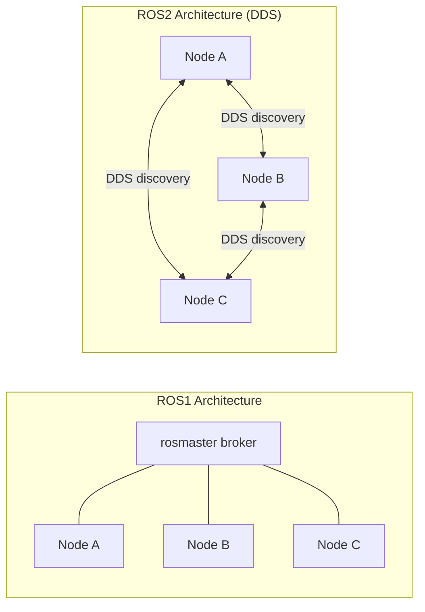

No central broker. Nodes discover each other automatically via DDS multicast. If one node crashes, the rest continue.

## What DDS Is

DDS (Data Distribution Service) is a publish-subscribe middleware standard from the Object Management Group (OMG). It is not a product — it is a specification. Multiple vendors implement it. ROS2 abstracts over vendors via the rmw (ROS MiddleWare interface) layer.

Key concepts:

- **Topic:** a named, typed data channel. Publishers write data to it; subscribers read from it.
- **DataWriter:** a publisher endpoint that writes data to a topic.
- **DataReader:** a subscriber endpoint that receives data from a topic.
- **QoS Policies:** per-endpoint settings controlling reliability, durability, deadline enforcement, and liveliness detection.
- **Domain:** a numeric namespace (0-232). Nodes in different domains are completely isolated. `ROS_DOMAIN_ID` environment variable. Default is 0.
- **Participant:** a DDS entity corresponding to one process. One process can host multiple nodes, each with multiple publishers/subscribers.

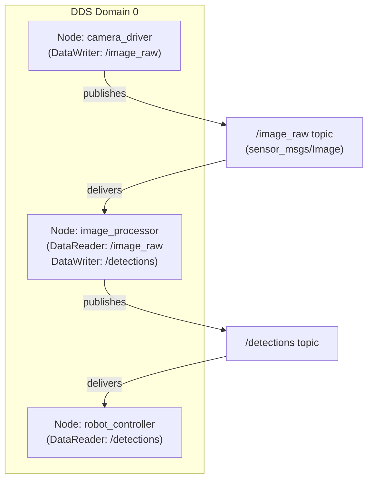

DDS vendor selection in ROS2 (set with `RMW_IMPLEMENTATION` env var):

| Vendor | rmw package | Notes |
|---|---|---|
| Fast-DDS (eProsima) | rmw_fastrtps_cpp | Default in ROS2 Humble. Good general performance. |
| Cyclone DDS | rmw_cyclonedds_cpp | Often lower latency in LAN. Popular in Nav2 setups. |
| Connext DDS (RTI) | rmw_connext_cpp | Commercial. Best for deterministic latency (aerospace, automotive). |
| Zenoh | rmw_zenoh_cpp | New in ROS2 Jazzy. Works across WANs and constrained networks. |

## The 5 Communication Primitives

### 1. Topics (Pub/Sub)

Asynchronous. Publisher writes; subscriber receives in a callback. No handshake required. Publisher and subscriber are decoupled — they do not need to know about each other.

```cpp
// Publisher (in a node's constructor):
auto pub = node->create_publisher<geometry_msgs::msg::Twist>("/cmd_vel", 10);

// Subscriber:
auto sub = node->create_subscription<nav_msgs::msg::Odometry>(
    "/odom", 10,
    [](nav_msgs::msg::Odometry::SharedPtr msg) {
        // called when a message arrives
    });
```

The `10` is the QoS history depth (keep last 10 messages).

### 2. Services (Request/Reply)

Synchronous request-response. Client sends a request; server processes it and returns a response. The RPC model.

```cpp
// Server:
auto srv = node->create_service<std_srvs::srv::Trigger>(
    "/reset",
    [](std_srvs::srv::Trigger::Request::SharedPtr req,
       std_srvs::srv::Trigger::Response::SharedPtr res) {
        res->success = true;
        res->message = "Reset complete";
    });

// Client:
auto client = node->create_client<std_srvs::srv::Trigger>("/reset");
auto future = client->async_send_request(std::make_shared<std_srvs::srv::Trigger::Request>());
// rclcpp::spin_until_future_complete(node, future);
auto result = future.get();
```

Do not use services for high-frequency data (overhead of request/reply handshake; use topics instead). Use services for: mode changes, one-shot commands, queries (get map, get current state).

### 3. Actions (Long-running Tasks)

For tasks that take seconds/minutes with continuous feedback and cancellation support.

```
Client                           Server
  |------ Send Goal ------------>|
  |<----- Goal Accepted ---------|
  |<----- Feedback (10Hz) -------|  (repeated)
  |<----- Feedback -------------|
  |------ Cancel (optional) ---->|
  |<----- Result ---------------|
```

Example use cases: `navigate_to_pose` (autonomous navigation — takes 30+ seconds, needs progress feedback, can be cancelled), `follow_joint_trajectory` (arm motion), `compute_path` (planning).

### 4. Parameters

Per-node key-value store. Declare a parameter with a default value:

```cpp
node->declare_parameter("max_speed", 1.5);
double speed = node->get_parameter("max_speed").as_double();
```

Other nodes can read/write parameters via the parameter service. `ros2 param set /my_node max_speed 2.0` from the command line. Parameter callbacks for dynamic reconfiguration without restart.

### 5. Lifecycle Nodes

A managed node state machine for deterministic startup/shutdown sequencing:

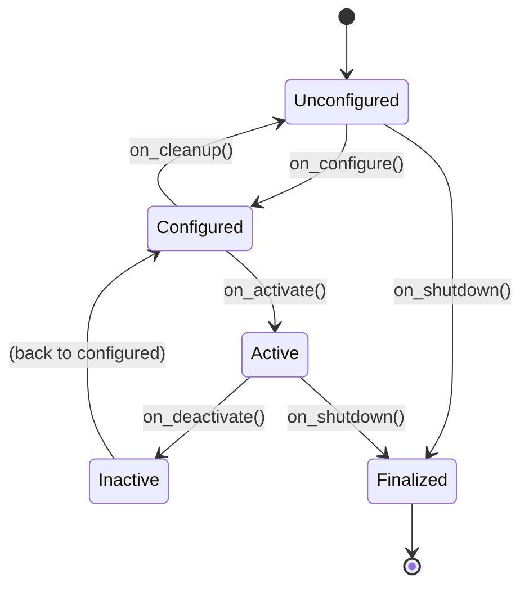

Benefit: launch the full robot system, then configure all nodes (allocate resources, open hardware connections), then activate them simultaneously. Deterministic startup order. Deactivate without destroying (useful for pausing a subsystem while replanning).

## QoS Policies

QoS (Quality of Service) settings control how DDS delivers data. A publisher and subscriber must have compatible QoS to connect — incompatibility is silent (no error message, no connection).

| Policy | Options | Use case |
|---|---|---|
| Reliability | **Reliable** (retransmit until acknowledged) | Commands, state changes — cannot afford to miss |
|             | **BestEffort** (fire-and-forget) | Sensor data — low latency more important than guaranteed delivery |
| Durability  | **Volatile** (no history for late joiners) | Live sensor streams |
|             | **TransientLocal** (cache N messages for late joiners) | Static maps, configuration — new subscriber gets the last message even if published before it started |
| Deadline    | Period (alert if no message within this time) | Watchdog for critical publishers |
| Liveliness  | Automatic / ManualByTopic | Detect if a publisher is still alive |
| History     | **KeepLast(N)** (queue depth N) | Most common — discard older messages when queue is full |
|             | **KeepAll** | Never discard — only if you can always consume fast enough |

**Common QoS mismatch bug:** sensor driver publishes with `BestEffort`. Nav2 subscriber expects `Reliable`. They are incompatible — the subscriber receives nothing. No error in the logs. Debug with `ros2 topic info /topic_name --verbose`.

## The ROS2 Ecosystem

| Category | Tool | Purpose |
|---|---|---|
| Build | colcon | Meta build system: discovers and builds ament_cmake / ament_python packages |
| Build | ament_cmake | CMake extensions: `find_package(rclcpp REQUIRED)`, `ament_target_dependencies()` |
| Runtime | ros2 launch | Launch multiple nodes from a Python/XML launch file |
| Runtime | ros2 run | Run a single node |
| Recording | ros2 bag | Record/playback all topics (mcap or sqlite3 backend) |
| Introspection | ros2 topic echo | Print messages on a topic |
| Introspection | ros2 service call | Call a service from the terminal |
| Introspection | ros2 action send_goal | Send an action goal from the terminal |
| Introspection | ros2 param list | List/get/set node parameters |
| Visualization | RViz2 | 3D visualization: robot model, point clouds, paths, TF tree |
| Visualization | Foxglove Studio | Web-based; works with bags and live rosbridge |
| Visualization | rqt_graph | Visual graph of nodes, topics, connections |
| Navigation | Nav2 | Complete 2D autonomous navigation stack |
| Manipulation | MoveIt2 | 6-DOF arm motion planning and execution |
| Hardware | ros2_control | Real-time control loop with hardware abstraction |
| Simulation | Gazebo (Ignition) | Physics-based robot simulation |
| Simulation | Isaac Sim | NVIDIA GPU-accelerated simulation with synthetic data |
| Diagnostics | diagnostic_updater | Publish hardware/software health status |
| Time | /use_sim_time | Parameter to use simulated clock from `/clock` topic (set true in simulation) |
```

### Step 2.4 — Write deep-dive.md

- [ ] Create `/home/zaki/workspaces/cpp/tutorial/pillar-4-domain-systems/19-ros2/deep-dive.md`

```markdown
# Chapter 19: ROS2 — Deep Dive

## DDS RTPS Internals

RTPS (Real-Time Publish-Subscribe) is the wire protocol that DDS uses on the network. Understanding it explains why ROS2 behaves the way it does.

### GUIDs and the Discovery Protocol

Every DDS entity has a GUID (Globally Unique Identifier) = 12-byte prefix + 4-byte entity ID. The prefix uniquely identifies the participant (process). The entity ID distinguishes endpoints within that participant.

Discovery happens in two phases:

**PDP (Participant Discovery Protocol):**
1. When a DDS participant starts, it sends a multicast UDP packet announcing its presence to the DDS discovery multicast address (239.255.0.1:7400 by default).
2. All other participants on the same network and domain receive this packet.
3. They respond with their own participant information (GUID, unicast addresses for direct communication).
4. Each participant maintains a list of discovered remote participants.

**EDP (Endpoint Discovery Protocol):**
1. Once participants know about each other (via PDP), they exchange their endpoint information via unicast: "I have a DataWriter on topic /image_raw with type sensor_msgs/Image and QoS = BestEffort/Volatile."
2. Remote participants check: does any of their DataReaders match this DataWriter (same topic name, same type, compatible QoS)?
3. If yes: a matched connection is established. Data flows directly between endpoints via unicast UDP.

No central broker participates in this process. Every participant discovers every other participant independently.

### Data Exchange

After matching:
- DataWriter sends RTPS DATA sub-messages to the DataReader's unicast address.
- For Reliable QoS: DataWriter sends periodic HEARTBEAT messages. DataReader responds with ACKNACK (acknowledgment or negative-acknowledgment requesting retransmission of missing sequence numbers). DataWriter retransmits missing messages.
- For BestEffort: DataWriter sends and forgets. No HEARTBEAT/ACKNACK.

**Fragmentation:** DDS fragments large messages (e.g., a 4MB point cloud) into MTU-sized UDP packets (typically 65KB), sends fragments, and reassembles them at the receiver. The maximum unfragmented message size is the DDS transport's message size limit (configurable). Large messages add latency due to fragmentation/reassembly.

### Why DDS Discovery Causes Problems

- **Multicast requirement:** PDP uses multicast. In environments that block multicast (AWS EC2, some corporate networks), DDS discovery fails silently. Workaround: use Fast-DDS XML configuration with `initialPeersList` (unicast discovery).
- **Discovery storms:** many nodes starting simultaneously on a large fleet all multicast at once, causing network congestion. Stagger startup.
- **Cross-host communication:** ensure all hosts are on the same multicast-capable network segment, or configure explicit peer discovery.

## Executor Models

An executor is the object that drives the ROS2 callback scheduling. You must call `executor.spin()` (or equivalent) to process messages.

### SingleThreadedExecutor

```cpp
rclcpp::executors::SingleThreadedExecutor executor;
executor.add_node(node1);
executor.add_node(node2);
executor.spin();
```

All callbacks (subscription callbacks, timer callbacks, service callbacks) run in the calling thread, one at a time, sequentially. Benefits: zero concurrency bugs. Drawback: one slow callback blocks all other callbacks. If a timer fires at 100Hz but a subscription callback takes 20ms, other callbacks are starved.

### MultiThreadedExecutor

```cpp
rclcpp::executors::MultiThreadedExecutor executor(rclcpp::ExecutorOptions{}, 4);
executor.add_node(node);
executor.spin();
```

Uses a thread pool. Multiple callbacks can run simultaneously. Risk: two subscription callbacks for the same node running concurrently, accessing shared member variables — race condition. Controlled with CallbackGroups:

```cpp
auto group1 = node->create_callback_group(rclcpp::CallbackGroupType::MutuallyExclusive);
auto group2 = node->create_callback_group(rclcpp::CallbackGroupType::Reentrant);

// Callbacks in group1: only one runs at a time (mutex-like)
auto sub1 = node->create_subscription<...>("/topic1", 10, cb1,
    rclcpp::SubscriptionOptions().callback_group = group1);

// Callbacks in group2: can run concurrently with each other
auto sub2 = node->create_subscription<...>("/topic2", 10, cb2,
    rclcpp::SubscriptionOptions().callback_group = group2);
```

### StaticSingleThreadedExecutor

Pre-builds the callback dispatch table at startup. Faster dispatch per callback (no dynamic lookup). Best for real-time nodes with deterministic callback sets that do not change at runtime.

## Lifecycle Nodes

```cpp
#include <rclcpp_lifecycle/lifecycle_node.hpp>

class SensorDriverNode : public rclcpp_lifecycle::LifecycleNode {
public:
    SensorDriverNode() : LifecycleNode("sensor_driver") {}

    // Called: Unconfigured -> Configured
    rclcpp_lifecycle::node_interfaces::LifecycleNodeInterface::CallbackReturn
    on_configure(const rclcpp_lifecycle::State&) override {
        // Initialize hardware, allocate resources, create publishers/subscribers
        pub_ = create_publisher<sensor_msgs::msg::LaserScan>("/scan", 10);
        RCLCPP_INFO(get_logger(), "Configured");
        return CallbackReturn::SUCCESS;
    }

    // Called: Configured -> Active (start producing data)
    CallbackReturn on_activate(const rclcpp_lifecycle::State&) override {
        pub_->on_activate();
        timer_ = create_wall_timer(std::chrono::milliseconds(100),
                                   [this]{ publish_scan(); });
        return CallbackReturn::SUCCESS;
    }

    // Called: Active -> Inactive (pause, do not produce data)
    CallbackReturn on_deactivate(const rclcpp_lifecycle::State&) override {
        pub_->on_deactivate();
        timer_.reset();
        return CallbackReturn::SUCCESS;
    }

    // Called: Inactive -> Unconfigured (release resources)
    CallbackReturn on_cleanup(const rclcpp_lifecycle::State&) override {
        pub_.reset();
        return CallbackReturn::SUCCESS;
    }

private:
    rclcpp_lifecycle::LifecyclePublisher<sensor_msgs::msg::LaserScan>::SharedPtr pub_;
    rclcpp::TimerBase::SharedPtr timer_;
    void publish_scan() { /* ... */ }
};
```

External management: a lifecycle manager node (provided by Nav2) transitions all nodes through the state machine in the correct order at startup and handles error recovery.

## Composable Nodes and Intra-Process Communication

Composable nodes run in the same process (component container). When publisher and subscriber are in the same container with intra-process communication enabled, messages are passed as `shared_ptr` (zero serialization, zero copy) instead of being serialized to DDS bytes.

```python
# In a Python launch file:
from rclcpp_components import ComposableNodeContainer, ComposableNode

container = ComposableNodeContainer(
    name='robot_container',
    namespace='',
    package='rclcpp_components',
    executable='component_container',
    composable_node_descriptions=[
        ComposableNode(
            package='my_robot',
            plugin='my_robot::CameraNode',
            name='camera',
            extra_arguments=[{'use_intra_process_comms': True}]
        ),
        ComposableNode(
            package='my_robot',
            plugin='my_robot::DetectionNode',
            name='detector',
            extra_arguments=[{'use_intra_process_comms': True}]
        ),
    ]
)
```

A 4MB point cloud passed intra-process costs essentially 0 bandwidth (just a pointer copy). Across DDS: serialize 4MB, send via UDP, deserialize 4MB. On a robot with a high-resolution depth camera, this difference is significant.

## Nav2 Architecture

Nav2 is the complete autonomous 2D navigation stack for ROS2. It handles everything from sensor processing to motor commands for a mobile ground robot.

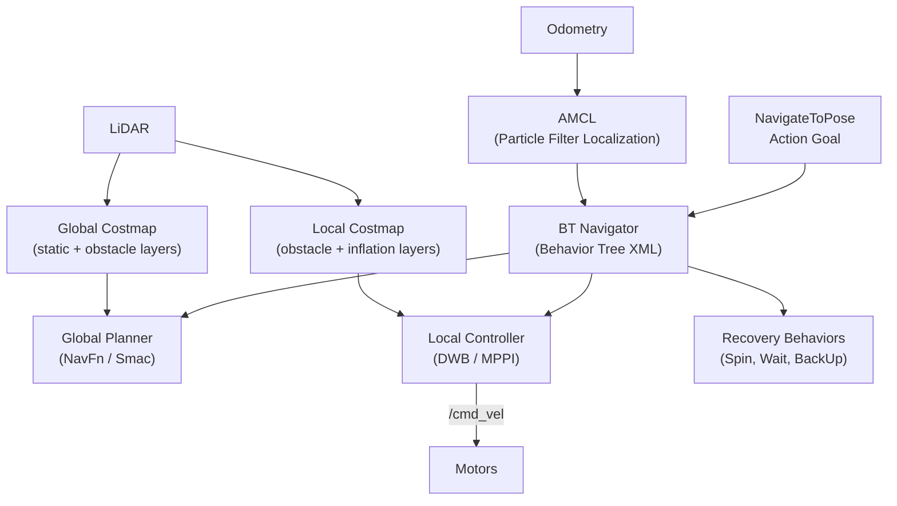

**BT Navigator:** executes a Behavior Tree (XML format) that defines the navigation logic. The BT is a tree of nodes: Sequence (all children must succeed), Fallback (try children until one succeeds), Decorator (modify child behavior). Example BT for navigation:

```xml
<BehaviorTree>
  <Sequence>
    <ComputePathToPose goal="{goal}" path="{path}"/>
    <FollowPath path="{path}">
      <RateController hz="1">
        <GoalUpdater input_goal="{goal}" output_goal="{updated_goal}"/>
      </RateController>
    </FollowPath>
  </Sequence>
</BehaviorTree>
```

**AMCL (Adaptive Monte Carlo Localization):** particle filter that localizes the robot in a known map using LiDAR scan matching. "Adaptive" means it dynamically adjusts the number of particles based on filter uncertainty (KLD sampling). Requires a pre-built map (from slam_toolbox or Cartographer). Does not work in unknown environments (use SLAM instead).

**Global Costmap:** 2D grid where each cell holds the cost of placing the robot there. Layers:
- Static layer: the pre-built map (walls = lethal cost 254)
- Obstacle layer: dynamic obstacles from LiDAR (added in real-time)
- Inflation layer: inflates obstacle costs by robot radius (ensures clearance). Global planner runs on this.

**Local Costmap:** smaller window around the robot (e.g., 4m × 4m). Updated at high frequency. Local controller (DWB or MPPI) plans short-horizon trajectories on this.

**Custom BT node:**

```cpp
#include <nav2_behavior_tree/bt_action_node.hpp>

class CheckBatteryCondition : public BT::ConditionNode {
public:
    CheckBatteryCondition(const std::string& name, const BT::NodeConfig& config)
        : BT::ConditionNode(name, config) {}

    BT::NodeStatus tick() override {
        double battery_level = 0.0;
        getInput("battery_level", battery_level);
        return battery_level > 20.0 ? BT::NodeStatus::SUCCESS : BT::NodeStatus::FAILURE;
    }

    static BT::PortsList providedPorts() {
        return { BT::InputPort<double>("battery_level") };
    }
};
```

## MoveIt2 Architecture

MoveIt2 is the robot arm manipulation stack for ROS2. It provides motion planning, kinematics, collision checking, and execution.

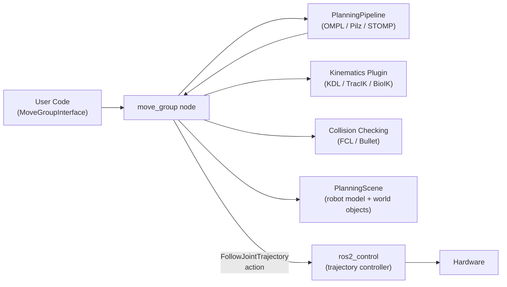

Key MoveIt2 concepts:

**JointModelGroup:** a named subset of joints, e.g., "arm" (all 6 arm joints), "gripper". Planning is done per group.

**PlanningScene:** the world model. Add/remove collision objects (boxes, spheres, meshes) that the planner must avoid:
```cpp
moveit_msgs::msg::CollisionObject box;
box.id = "table";
box.header.frame_id = "world";
// Set shape (box primitive), pose, operation (ADD)
planning_scene_interface.addCollisionObjects({box});
```

**Cartesian planning:** plan a straight-line path in Cartesian space (e.g., move end-effector linearly to grasp an object):
```cpp
std::vector<geometry_msgs::msg::Pose> waypoints;
waypoints.push_back(target_pose);
moveit_msgs::msg::RobotTrajectory trajectory;
double fraction = move_group.computeCartesianPath(waypoints, 0.01, 0.0, trajectory);
// fraction = 1.0 means full path achieved
```

**Servo (real-time Cartesian control):** instead of plan-then-execute, servo accepts a continuous stream of velocity commands (Cartesian or joint-space) and streams joint commands to the controller at high frequency. Used for teleoperation and closed-loop visual servoing.

## ros2_control Architecture

ros2_control provides a standardized real-time control framework. It separates hardware-specific code from control algorithms.

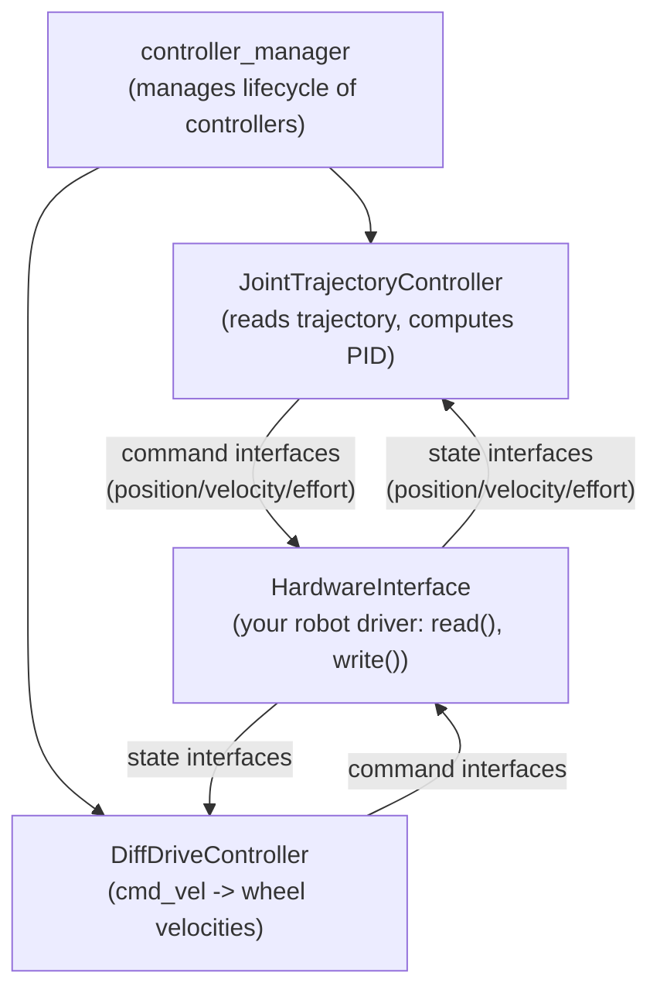

The real-time loop (running at 1kHz for typical industrial arms):
1. `hardware_interface.read()` — read joint positions/velocities/efforts from hardware
2. Controller manager calls each active controller's `update()`:
   - Controller reads state interfaces (current joint positions)
   - Controller computes commands (PID output, trajectory interpolation)
   - Controller writes to command interfaces
3. `hardware_interface.write()` — write joint commands to hardware

State interfaces: read-only data from hardware (joint position, velocity, effort, IMU data).
Command interfaces: writable data to hardware (position setpoint, velocity setpoint, torque setpoint).

A hardware interface implements `SystemInterface` (for a complete system like a full robot arm) or `SensorInterface` (read-only, for sensors only) or `ActuatorInterface` (for single-joint actuators). You write the hardware-specific `read()` and `write()` methods; ros2_control handles everything else.
```

### Step 2.5 — Write interview.md

- [ ] Create `/home/zaki/workspaces/cpp/tutorial/pillar-4-domain-systems/19-ros2/interview.md`

```markdown
# Chapter 19: ROS2 — Interview Questions

## Q1: Topics vs services vs actions — when to use each?

**Topics:** continuous, high-frequency, one-to-many data streams. Use when: publisher does not need to know if anyone is listening, data is produced at a fixed rate (sensor data, odometry), multiple subscribers may exist simultaneously. Examples: `/image_raw`, `/scan`, `/odom`, `/cmd_vel`.

**Services:** one-shot request/reply with an immediate response. Use when: you need a return value, the operation is quick (< 1 second), only one client calls at a time. Examples: `/get_map`, `/clear_costmap`, `/set_mode`. Do NOT use for high-frequency calls — the request/reply overhead is significant.

**Actions:** long-running operations with progress feedback and cancellation. Use when: the operation takes seconds to minutes, the client needs intermediate progress updates, the client might want to cancel mid-operation. Examples: `navigate_to_pose` (minutes), `follow_joint_trajectory` (seconds), `compute_path`.

## Q2: What is DDS and why does ROS2 use it?

DDS (Data Distribution Service) is a standardized publish-subscribe middleware with built-in discovery, QoS policies, and no central broker. ROS2 uses it instead of building its own transport layer because: (1) DDS is a mature standard with multiple production-grade implementations, (2) It provides QoS primitives (reliability, durability, deadlines) that ROS1 completely lacked, (3) Broker-free discovery eliminates the single-point-of-failure problem of rosmaster, (4) Multiple vendors compete on performance while ROS2 code remains vendor-agnostic via the rmw interface.

## Q3: Transient_local durability — when do you need it?

TransientLocal durability caches the last N messages and delivers them to any subscriber that joins late. Without it, a subscriber that starts after a publisher has already published its data receives nothing (Volatile durability — the default). Use TransientLocal when: the data is published once but must be received by all subscribers regardless of startup order. The canonical example is a static map: the `/map` topic is published once at startup by the map server. Navigation nodes that start later need to receive this map. Without TransientLocal, late-starting nodes would never get the map.

Note: publisher and subscriber must both have TransientLocal for the late-joining delivery to work. Publisher Volatile + Subscriber TransientLocal = incompatible QoS, no connection.

## Q4: How does intra-process communication work in ROS2?

When two composable nodes run in the same component container with `use_intra_process_comms: true`, ROS2 bypasses DDS entirely for communication between them. Instead of serializing the message to bytes and sending via UDP, the publisher stores the message in a ring buffer and passes a `shared_ptr` to the subscriber. The subscriber callback receives the same memory. Zero serialization, zero copy, near-zero latency. The message never leaves the process. This is critical for high-bandwidth data like camera images (4MB each at 30fps = 120MB/s) or point clouds.

## Q5: Lifecycle nodes — why use them instead of regular nodes?

Without lifecycle management, all nodes start simultaneously at launch time, in undefined order. A navigation node might start before the map server has published its map. A controller might start before the hardware driver has initialized. Race conditions at startup.

With lifecycle nodes: a lifecycle manager transitions all nodes through configure (allocate resources) then activate (start processing) in a defined sequence. Every node successfully configures before any node activates. If any node fails configuration, the manager can halt the startup sequence cleanly. Deactivation without destruction allows pausing subsystems without relaunching.

## Q6: What is ros2_control?

ros2_control is a hardware abstraction and controller management framework for ROS2. It provides a standardized real-time control loop that reads hardware state (joint positions from encoders), passes it to controllers (PID, trajectory follower), and writes controller outputs back to hardware (motor commands). The key interface is: `SystemInterface::read()` → controller `update()` → `SystemInterface::write()`, running at a fixed rate (typically 100Hz to 1kHz). This separates robot-specific hardware code (your driver) from reusable control algorithms (the controllers).

## Q7: How does Nav2's behavior tree work?

Nav2's BT Navigator loads a behavior tree XML file at startup. Each navigation request (NavigateToPose action goal) triggers execution of this tree. The tree is composed of:
- **Sequence nodes:** execute children left to right; return FAILURE if any child fails
- **Fallback nodes:** try children until one succeeds; implement recovery logic
- **Action nodes:** interface to ROS2 actions (ComputePathToPose calls the global planner, FollowPath calls the local controller)
- **Condition nodes:** check conditions (IsBatteryLow, IsGoalReached)

At each tick of the tree (typically 10-100Hz), each node returns SUCCESS, FAILURE, or RUNNING. The tree structure encodes the navigation policy: "plan a path, follow it, if following fails try a recovery, then retry planning."

## Q8: What is RTPS?

RTPS (Real-Time Publish-Subscribe) is the wire protocol specification that DDS implementations use for network communication. It defines the binary format of DDS messages on the wire (UDP datagrams), the discovery protocol (PDP and EDP for peer-to-peer participant and endpoint discovery), the reliability protocol (HEARTBEAT and ACKNACK sub-messages for Reliable QoS), and the fragmentation protocol for large messages. RTPS is defined in the OMG specification. DDS vendors must implement RTPS for interoperability — a Fast-DDS publisher can communicate with a Cyclone DDS subscriber because both implement RTPS correctly.

## Q9: How do you handle /use_sim_time?

In simulation (Gazebo, Isaac Sim), the simulated clock may run faster or slower than wall clock, and importantly it may jump when the simulation resets. ROS2 nodes that use `rclcpp::Clock::now()` or create timers by default use the system (wall) clock. When `use_sim_time: true` parameter is set on a node, it instead subscribes to the `/clock` topic and uses simulated time for all timers and time queries. This ensures node timers, TF transform lookups, and rosbag playback all respect simulated time. Set it globally in a launch file: `SetParameter(name='use_sim_time', value='true')` scoped to all nodes.

## Q10: What is a composable node container?

A component container is a process that can dynamically load and unload composable nodes at runtime. Instead of each node being a separate executable (separate process, separate DDS participants), multiple nodes share a single process. Benefits: (1) intra-process communication zero-copy, (2) lower process overhead (one DDS participant instead of many), (3) shared memory for large data. A composable node is a standard ROS2 node that is compiled as a shared library and registered as a component plugin. The container loads the library and instantiates the node class. `ros2 component load /ComponentManager my_pkg my_pkg::MyNode` loads a component at runtime.

## Q11: How would you debug a QoS mismatch?

Symptoms: subscriber receives no messages even though the publisher is publishing (visible in `ros2 topic hz`).

Debugging steps:
1. `ros2 topic info /topic_name --verbose` — shows all publishers and subscribers with their QoS profiles. Look for mismatched Reliability or Durability.
2. Enable RCLCPP_DEBUG logging or set `RCUTILS_LOGGING_SEVERITY=DEBUG` to see QoS incompatibility warnings at discovery time.
3. Common culprits: Nav2 topics require Reliable, but sensor drivers default to BestEffort. Solution: set subscriber QoS to match publisher, or set publisher QoS to Reliable if retransmission is acceptable.
4. Check DurabilityPolicy: TransientLocal publisher + Volatile subscriber (or vice versa) = incompatible.

## Q12: SingleThreadedExecutor vs MultiThreadedExecutor — when to choose?

**SingleThreadedExecutor:** simpler, no race conditions, predictable callback ordering within a node. Choose when: node has shared mutable state accessed by multiple callbacks, or when the combined callback processing time fits within the deadline.

**MultiThreadedExecutor:** concurrent callback execution, higher throughput. Choose when: some callbacks are slow (image processing) and should not block other callbacks (motor control timers). Must use MutuallyExclusive callback groups to protect shared state, or make callbacks stateless.

Rule of thumb: start with SingleThreaded. Switch to Multi only if you measure that slow callbacks are blocking time-sensitive ones.

## Q13: What is a callback group?

A callback group is a grouping mechanism for controlling which callbacks can run concurrently in a MultiThreadedExecutor. Two types: MutuallyExclusive (only one callback from this group runs at a time — like a mutex over the group), Reentrant (multiple callbacks from this group can run simultaneously). By default, all callbacks in a node are in the same MutuallyExclusive group — equivalent to SingleThreadedExecutor behavior within the node. To allow concurrent execution, create a Reentrant group and assign computationally independent callbacks to it.

## Q14: How does AMCL work?

AMCL (Adaptive Monte Carlo Localization) is a particle filter that estimates the robot's pose in a known map.

Initialization: spread N particles uniformly across the known map (or around a given initial pose estimate).

Each cycle:
1. **Motion update:** move each particle by the odometry delta plus random noise sampled from the odometry noise model. This propagates the distribution forward in time.
2. **Sensor update:** for each particle, compute the probability of observing the LiDAR scan from that particle's hypothesized pose (using the known map). Weight each particle by this probability.
3. **Resampling:** sample N new particles from the current distribution, proportional to weights. High-weight particles (good hypotheses) survive and reproduce; low-weight particles (bad hypotheses) die out.

"Adaptive" means the number of particles N is adjusted dynamically based on KLD sampling: use fewer particles when the distribution is concentrated (confident in location), more when spread (uncertain).

## Q15: What is the difference between global and local costmap?

**Global costmap:** covers the entire known map area. Updated relatively slowly (map changes, new obstacle observations). Used by the global planner to compute the full path from current pose to goal. Typically 5-10cm resolution.

**Local costmap:** covers only a small window around the robot (e.g., 4m × 4m). Updated at high frequency (every LiDAR scan). Used by the local controller to avoid dynamic obstacles not present in the global map and to track the global path locally. Typically 5cm resolution.

The global planner sees the big picture; the local controller handles immediate obstacle avoidance. The two-costmap architecture is essential for efficient planning at scale.

## Q16: TRAP — "ROS2 is real-time"

ROS2 is NOT real-time by default. Standard Linux scheduling does not provide deterministic latency. A DDS callback might be delayed by an arbitrary amount if the system is under load. For real-time operation you need: (1) a real-time Linux kernel (PREEMPT_RT patch), (2) SCHED_FIFO scheduling for critical threads, (3) memory locking (mlockall) to prevent page faults, (4) real-time-capable DDS configuration (Cyclone DDS or Fast-DDS with RT settings), (5) the StaticSingleThreadedExecutor or a custom real-time executor. This is an advanced configuration. ros2_control is designed with real-time in mind but requires proper OS configuration.

## Q17: TRAP — "Just call spin() for each node separately"

Calling `rclcpp::spin(node)` blocks the calling thread and processes callbacks for one node indefinitely. If you have two nodes, you cannot call `spin()` on both in the same thread — the second call never executes. Common (incorrect) beginner pattern: `spin(node1)` in thread 1, `spin(node2)` in thread 2. This works but is wasteful — you are running two executors, two thread pools, doubling overhead.

The correct approach: use one executor for multiple nodes: `executor.add_node(node1); executor.add_node(node2); executor.spin();`. Or for composable nodes, use a component container. One executor efficiently multiplexes all nodes' callbacks.

## Q18: What is /tf and /tf_static in ROS2?

`/tf` is a topic carrying time-stamped transform messages — dynamic transforms that change over time (robot pose, moving joints). Transforms are published with a timestamp and expire after a configurable duration. The TF2 library maintains a time-indexed buffer of transforms and can interpolate between timestamps.

`/tf_static` carries transforms that never change (sensor mounting positions, fixed joints). Published with TransientLocal QoS so late-joining nodes receive them. Only published once (or when updated). Processed differently from /tf — no expiry.

## Q19: How does rosbag2 work and when would you use it?

`ros2 bag record -a` subscribes to all topics and writes incoming messages to disk (mcap format by default in Humble). Each message is stored with: topic name, timestamp, serialized DDS bytes. `ros2 bag play <bag_directory>` replays the bag: reads messages in timestamp order and publishes them to the original topics, optionally at adjusted playback speed.

Use cases: (1) record sensor data in the field, replay in the lab for debugging without hardware, (2) regression testing — run the same bag through different algorithm versions, (3) logging for safety audits, (4) latency analysis — compute end-to-end latency from sensor timestamp to control output timestamp.

## Q20: How would you design a ROS2 node that processes camera images at 30fps without dropping frames?

Design: separate the image capture callback from the processing pipeline.

1. Use a MultiThreadedExecutor with two callback groups: camera subscription in a Reentrant group, everything else in a MutuallyExclusive group.
2. In the camera callback: check if a processing thread is free. If yes, hand off the image (via `shared_ptr` if intra-process) and return immediately. If the processing thread is busy, increment a dropped-frame counter and return (do not block).
3. Processing runs in a separate thread or async task. Post results back to the main node via a thread-safe queue.
4. For high-bandwidth: use composable nodes with intra-process communication to avoid serialization cost. A 1920x1080 RGB image is 6MB; serializing and deserializing via DDS at 30fps = 360MB/s throughput that intra-process eliminates.
5. Set subscription QoS to BestEffort + KeepLast(1) (not Reliable + KeepAll) — you never want a growing backlog of unprocessed images.
```

### Step 2.6 — Write example 01_ros2_concepts_sim.cpp

- [ ] Create `/home/zaki/workspaces/cpp/tutorial/pillar-4-domain-systems/19-ros2/examples/01_ros2_concepts_sim.cpp`

```cpp
// 01_ros2_concepts_sim.cpp
// Pure C++ simulation of ROS2 concepts: typed pub/sub, QoS reliability,
// service call pattern, and a spin() loop. No ROS2 SDK required.
// Compile: g++ -std=c++17 -O2 -pthread -o 01_ros2_concepts_sim 01_ros2_concepts_sim.cpp

#include <algorithm>
#include <chrono>
#include <cstdio>
#include <deque>
#include <functional>
#include <map>
#include <memory>
#include <mutex>
#include <random>
#include <string>
#include <thread>
#include <typeindex>
#include <vector>

// ─── QoS Policy ──────────────────────────────────────────────────────────────

enum class Reliability { BestEffort, Reliable };
enum class Durability  { Volatile, TransientLocal };

struct QoSProfile {
    Reliability reliability = Reliability::Reliable;
    Durability  durability  = Durability::Volatile;
    int         depth       = 10;   // history depth (keep last N)

    static QoSProfile sensor_data() {
        return { Reliability::BestEffort, Durability::Volatile, 1 };
    }
    static QoSProfile reliable() {
        return { Reliability::Reliable, Durability::Volatile, 10 };
    }
    static QoSProfile transient_local() {
        return { Reliability::Reliable, Durability::TransientLocal, 1 };
    }
};

bool qos_compatible(const QoSProfile& pub_qos, const QoSProfile& sub_qos) {
    // Reliability: pub Reliable is compatible with sub BestEffort, but NOT vice versa
    if (pub_qos.reliability == Reliability::BestEffort &&
        sub_qos.reliability == Reliability::Reliable) {
        return false;  // Publisher cannot guarantee what subscriber demands
    }
    // Durability: pub Volatile is incompatible with sub TransientLocal
    if (pub_qos.durability == Durability::Volatile &&
        sub_qos.durability == Durability::TransientLocal) {
        return false;
    }
    return true;
}

// ─── Message Bus (simulating DDS topic layer) ─────────────────────────────────

struct MessageBase {
    std::string topic;
    uint64_t    seq;
    std::chrono::steady_clock::time_point timestamp;
    virtual ~MessageBase() = default;
};

template<typename T>
struct Message : MessageBase {
    T data;
};

class MessageBus {
public:
    // Simulate message drop for BestEffort (50% drop probability for demo)
    static bool should_drop(Reliability rel) {
        if (rel != Reliability::BestEffort) return false;
        static std::mt19937 rng{42};
        static std::bernoulli_distribution drop_dist(0.3);  // 30% drop for BestEffort
        return drop_dist(rng);
    }

    using AnyCallback = std::function<void(const MessageBase&)>;

    struct Subscription {
        std::string  topic;
        QoSProfile   qos;
        AnyCallback  callback;
        std::string  subscriber_name;
    };

    struct Publication {
        std::string topic;
        QoSProfile  qos;
        std::string publisher_name;
        // TransientLocal cache (last message)
        std::shared_ptr<MessageBase> last_message;
    };

    void register_publisher(const std::string& name, const std::string& topic,
                             QoSProfile qos) {
        std::lock_guard<std::mutex> lock(mu_);
        pubs_.push_back({topic, qos, name, nullptr});
        std::printf("[BUS] Publisher registered: %s -> topic '%s' [%s]\n",
                    name.c_str(), topic.c_str(),
                    qos.reliability == Reliability::Reliable ? "Reliable" : "BestEffort");
    }

    void subscribe(const std::string& subscriber_name, const std::string& topic,
                   QoSProfile sub_qos, AnyCallback cb) {
        std::lock_guard<std::mutex> lock(mu_);
        subs_.push_back({topic, sub_qos, cb, subscriber_name});

        // Check QoS compatibility with existing publishers
        for (const auto& pub : pubs_) {
            if (pub.topic != topic) continue;
            if (!qos_compatible(pub.qos, sub_qos)) {
                std::printf("[BUS] WARNING: QoS MISMATCH! Publisher '%s' [%s] "
                            "incompatible with subscriber '%s' [%s] on topic '%s'\n",
                            pub.publisher_name.c_str(),
                            pub.qos.reliability == Reliability::Reliable ? "Reliable" : "BestEffort",
                            subscriber_name.c_str(),
                            sub_qos.reliability == Reliability::Reliable ? "Reliable" : "BestEffort",
                            topic.c_str());
            } else {
                std::printf("[BUS] Subscriber '%s' matched with publisher '%s' on '%s'\n",
                            subscriber_name.c_str(), pub.publisher_name.c_str(), topic.c_str());

                // TransientLocal: deliver cached last message immediately
                if (sub_qos.durability == Durability::TransientLocal && pub.last_message) {
                    std::printf("[BUS] TransientLocal: delivering cached message to '%s'\n",
                                subscriber_name.c_str());
                    cb(*pub.last_message);
                }
            }
        }
    }

    template<typename T>
    void publish(const std::string& publisher_name, const std::string& topic,
                 const T& data, QoSProfile pub_qos) {
        auto msg = std::make_shared<Message<T>>();
        msg->topic     = topic;
        msg->seq       = ++seq_;
        msg->timestamp = std::chrono::steady_clock::now();
        msg->data      = data;

        std::lock_guard<std::mutex> lock(mu_);

        // Cache for TransientLocal
        for (auto& pub : pubs_) {
            if (pub.topic == topic && pub.publisher_name == publisher_name) {
                pub.last_message = msg;
            }
        }

        // Deliver to matching subscribers
        for (const auto& sub : subs_) {
            if (sub.topic != topic) continue;
            if (!qos_compatible(pub_qos, sub.qos)) continue;  // incompatible, skip

            // BestEffort: may drop
            if (should_drop(pub_qos.reliability)) {
                std::printf("[BUS] BestEffort DROP: seq=%lu on '%s'\n",
                            static_cast<unsigned long>(msg->seq), topic.c_str());
                continue;
            }

            sub.callback(*msg);
        }
    }

private:
    std::mutex                     mu_;
    std::vector<Subscription>      subs_;
    std::vector<Publication>       pubs_;
    uint64_t                       seq_{0};
};

// Global bus (singleton for simplicity)
MessageBus g_bus;

// ─── Typed Publisher ──────────────────────────────────────────────────────────

template<typename T>
class Publisher {
public:
    Publisher(std::string node_name, std::string topic, QoSProfile qos)
        : node_name_(std::move(node_name)), topic_(std::move(topic)), qos_(qos) {
        g_bus.register_publisher(node_name_, topic_, qos_);
    }

    void publish(const T& msg) {
        g_bus.publish(node_name_, topic_, msg, qos_);
    }

private:
    std::string node_name_, topic_;
    QoSProfile  qos_;
};

// ─── Typed Subscriber ─────────────────────────────────────────────────────────

template<typename T>
class Subscription {
public:
    Subscription(std::string node_name, std::string topic, QoSProfile qos,
                 std::function<void(const T&)> callback)
        : callback_(std::move(callback)) {
        g_bus.subscribe(node_name, topic, qos,
            [this](const MessageBase& base) {
                const auto& m = static_cast<const Message<T>&>(base);
                callback_(m.data);
            });
    }

private:
    std::function<void(const T&)> callback_;
};

// ─── Simple Service Pattern ───────────────────────────────────────────────────

struct MapRequest  { int map_id; };
struct MapResponse { std::string map_data; bool success; };

class MapService {
public:
    void register_handler(std::function<MapResponse(const MapRequest&)> handler) {
        handler_ = std::move(handler);
    }

    MapResponse call(const MapRequest& req) {
        if (!handler_) return {"", false};
        std::printf("[SVC] Service call: map_id=%d\n", req.map_id);
        return handler_(req);
    }

private:
    std::function<MapResponse(const MapRequest&)> handler_;
};

MapService g_map_service;

// ─── Example messages ─────────────────────────────────────────────────────────

struct Odometry { double x, y, theta, vx, omega; };
struct LaserScan { std::vector<float> ranges; double angle_min, angle_max; };
struct StaticMap { std::string name; int width, height; };

// ─── Simulated Nodes ──────────────────────────────────────────────────────────

// Odometry publisher (simulates wheel encoder node)
class OdometryNode {
public:
    OdometryNode() : pub_("odom_node", "/odom", QoSProfile::reliable()) {}

    void step(double dt) {
        // Simulate differential drive motion
        x_    += std::cos(theta_) * vx_ * dt;
        y_    += std::sin(theta_) * vx_ * dt;
        theta_ += omega_ * dt;
        seq_++;

        if (seq_ % 10 == 0) {
            std::printf("[OdometryNode] Publishing odom: x=%.3f y=%.3f theta=%.3f\n",
                        x_, y_, theta_);
        }
        pub_.publish({x_, y_, theta_, vx_, omega_});
    }

private:
    Publisher<Odometry> pub_;
    double x_{0}, y_{0}, theta_{0};
    double vx_{0.5}, omega_{0.1};
    int    seq_{0};
};

// Laser scanner (BestEffort — latest scan is all that matters)
class LaserScanNode {
public:
    LaserScanNode() : pub_("laser_node", "/scan", QoSProfile::sensor_data()) {}

    void step(int tick) {
        LaserScan scan;
        scan.angle_min = -1.57f;
        scan.angle_max =  1.57f;
        // Simulate 10 range readings
        for (int i = 0; i < 10; ++i)
            scan.ranges.push_back(2.0f + 0.1f * (tick % 5));

        if (tick % 5 == 0)
            std::printf("[LaserNode] Publishing scan (10 rays, range ~%.1f)\n",
                        scan.ranges[0]);
        pub_.publish(scan);
    }

private:
    Publisher<LaserScan> pub_;
};

// Navigation node: subscribes to odom + scan, publishes on static map topic
class NavigationNode {
public:
    NavigationNode() {
        odom_sub_ = std::make_unique<Subscription<Odometry>>(
            "nav_node", "/odom", QoSProfile::reliable(),
            [this](const Odometry& odom) {
                odom_ = odom;
                odom_count_++;
            });

        scan_sub_ = std::make_unique<Subscription<LaserScan>>(
            "nav_node", "/scan",
            QoSProfile::sensor_data(),  // BestEffort OK for scan
            [this](const LaserScan& scan) {
                scan_count_++;
                (void)scan;
            });

        // Also subscribe to static map with TransientLocal (gets cached map even if late)
        map_sub_ = std::make_unique<Subscription<StaticMap>>(
            "nav_node", "/map", QoSProfile::transient_local(),
            [this](const StaticMap& m) {
                std::printf("[NavNode] Received map: '%s' (%dx%d)\n",
                            m.name.c_str(), m.width, m.height);
                has_map_ = true;
            });
    }

    void print_stats() {
        std::printf("[NavNode] Stats: odom_msgs=%d scan_msgs=%d current_pos=(%.3f,%.3f) has_map=%s\n",
                    odom_count_, scan_count_, odom_.x, odom_.y, has_map_ ? "yes" : "no");
    }

private:
    std::unique_ptr<Subscription<Odometry>> odom_sub_;
    std::unique_ptr<Subscription<LaserScan>> scan_sub_;
    std::unique_ptr<Subscription<StaticMap>> map_sub_;
    Odometry odom_{};
    int      odom_count_{0}, scan_count_{0};
    bool     has_map_{false};
};

// Map server: publishes a static map with TransientLocal durability
class MapServerNode {
public:
    MapServerNode() : pub_("map_server", "/map", QoSProfile::transient_local()) {
        // Register service handler
        g_map_service.register_handler([](const MapRequest& req) -> MapResponse {
            return {"map_data_for_id_" + std::to_string(req.map_id), true};
        });
    }

    void publish_map() {
        StaticMap m{"grid_map_v1", 200, 200};
        std::printf("[MapServer] Publishing static map '%s' (TransientLocal)\n", m.name.c_str());
        pub_.publish(m);
    }

private:
    Publisher<StaticMap> pub_;
};

// ─── Main (simulated spin loop) ───────────────────────────────────────────────

int main() {
    std::printf("=== ROS2 Concepts Simulation ===\n\n");
    std::printf("--- Phase 1: Normal operation (Reliable publishers, mixed subscribers) ---\n\n");

    // Create nodes
    OdometryNode  odom_node;
    LaserScanNode laser_node;
    NavigationNode nav_node;
    MapServerNode map_server;

    // Map server publishes the static map (TransientLocal — nav_node gets it immediately
    // even though nav_node subscribed before map_server published)
    std::printf("\n[Main] Map server publishing static map...\n");
    map_server.publish_map();

    std::printf("\n[Main] Starting spin loop (20 ticks, dt=0.1s each)...\n\n");

    const double DT    = 0.1;
    const int    TICKS = 20;

    for (int tick = 0; tick < TICKS; ++tick) {
        odom_node.step(DT);
        laser_node.step(tick);

        if (tick == 5) {
            std::printf("\n--- Tick %d: Making a service call to MapService ---\n", tick);
            MapRequest  req{42};
            MapResponse res = g_map_service.call(req);
            std::printf("[Main] Service response: success=%s data='%s'\n\n",
                        res.success ? "true" : "false", res.map_data.c_str());
        }
    }

    std::printf("\n--- Phase 2: QoS Mismatch Demonstration ---\n\n");
    // Create a subscriber that demands Reliable on a BestEffort topic
    // (laser_node publishes BestEffort)
    std::printf("[Main] Subscribing to /scan with Reliable QoS (mismatch with BestEffort publisher):\n");
    Subscription<LaserScan> bad_sub(
        "bad_node", "/scan", QoSProfile::reliable(),
        [](const LaserScan&) { std::printf("[BadNode] Got scan (should not happen)\n"); });

    std::printf("\n[Main] Publishing 3 more scans to show mismatch sub gets nothing:\n");
    for (int i = 0; i < 3; ++i) {
        laser_node.step(100 + i);
    }

    std::printf("\n--- Final Statistics ---\n");
    nav_node.print_stats();

    std::printf("\n=== Simulation Complete ===\n");
    std::printf("\nKey ROS2 concepts demonstrated:\n");
    std::printf("  - Typed pub/sub with QoS profiles\n");
    std::printf("  - BestEffort message dropping (30%% simulated)\n");
    std::printf("  - QoS mismatch detection and warning\n");
    std::printf("  - TransientLocal: late subscriber receives cached map\n");
    std::printf("  - Service call pattern (request/reply)\n");
    std::printf("  - Multi-subscriber topic delivery\n");

    return 0;
}
```

### Step 2.7 — Commit

- [ ] `git add tutorial/pillar-4-domain-systems/19-ros2/ && git commit -m "docs(tutorial): add chapter 19-ros2"`

---

## Task 3: Chapter 20-ai-inference

Tutorial path: `tutorial/pillar-4-domain-systems/20-ai-inference/`

### Step 3.1 — Create directory structure

- [ ] Create directory structure

```bash
mkdir -p /home/zaki/workspaces/cpp/tutorial/pillar-4-domain-systems/20-ai-inference/examples
```

### Step 3.2 — Write README.md

- [ ] Create `/home/zaki/workspaces/cpp/tutorial/pillar-4-domain-systems/20-ai-inference/README.md`

```markdown
# Chapter 20: AI Inference in C++

**What you'll learn:** Neural network mathematics (linear layers, activations, convolutions, attention), the C++ inference runtime landscape (ONNX Runtime, TensorRT, LibTorch, OpenVINO), quantization theory (FP32/FP16/INT8, PTQ vs QAT), production deployment patterns, and how to profile and optimize inference pipelines.

**Prerequisites:** Chapter 18 (Robotics Theory) for deployment context. Basic matrix math. C++ through Chapter 5.

**Time estimate:** Core = 1 hr. Deep Dive = 5 hrs. Interview = 1 hr.

**Important note:** ONNX Runtime and TensorRT examples in deep-dive.md require installed runtimes (onnxruntime C++ API, TensorRT 8+, CUDA). The standalone examples in this chapter (01_neural_net_math.cpp, 02_quantization_sim.cpp) are pure C++ — they compile without any external libraries and demonstrate the underlying math.

**Reading paths:**

1. Neural net math first: `core.md` → `deep-dive.md` section "Neural Network Math" → `examples/01_neural_net_math.cpp`
2. ONNX Runtime: `deep-dive.md` section "ONNX Runtime" → `projects/06-ai-inference/` lab
3. TensorRT: `deep-dive.md` section "TensorRT"
4. Quantization: `deep-dive.md` section "Quantization in Depth" → `examples/02_quantization_sim.cpp`
5. Interview prep: `interview.md`

**Platform:** Pure C++ examples compile on any platform (`g++ -std=c++17 -O2`). Runtime-specific code (ONNX Runtime, TensorRT, LibTorch) requires the respective SDK installed.
```

### Step 3.3 — Write core.md

- [ ] Create `/home/zaki/workspaces/cpp/tutorial/pillar-4-domain-systems/20-ai-inference/core.md`

```markdown
# Chapter 20: AI Inference in C++ — Core

## Inference vs Training

**Training:** adjusting a neural network's weights by computing gradients of a loss function and applying gradient descent. Runs on powerful GPU clusters (hundreds of GPUs in parallel), takes hours to weeks. Done offline. Consumes huge amounts of memory (need to store activations for backpropagation). Uses frameworks like PyTorch or TensorFlow. Not the focus of this chapter.

**Inference:** running a trained model's forward pass to make predictions. The weights are fixed — you are evaluating a function, not optimizing it. Runs everywhere: GPU data centers (latency-sensitive: < 10ms), edge devices (Jetson Orin, Raspberry Pi), mobile phones, FPGAs, custom NPUs. Latency, throughput, and memory are critical. C++ excels here.

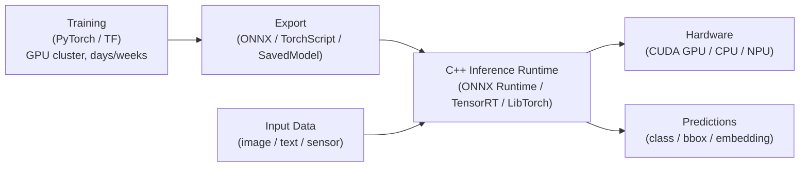

The export step is the bridge. ONNX (Open Neural Network Exchange) is the dominant interchange format: train in PyTorch, export to ONNX, run in any ONNX Runtime-compatible engine. TorchScript exports a model as a serialized PyTorch computation graph for use with LibTorch.

## What a Neural Network Is

A neural network is a composition of functions that transforms input data to predictions through a sequence of learned operations.

### Linear Layer (Fully Connected)

The core operation: `y = W * x + b`

- W is a matrix of learned weights (shape: output_dim × input_dim)
- b is a bias vector (shape: output_dim)
- This is a matrix-vector multiply — the single operation that dominates inference compute time

For a batch of N inputs: `Y = X * W^T + b` where X has shape (N, input_dim) and Y has shape (N, output_dim). This becomes a matrix-matrix multiply (GEMM), which GPUs and tensor cores are specifically optimized for.

Parameter count example: linear layer from 512 → 256 dimensions: 512 × 256 weights + 256 biases = 131,328 parameters.

### Activation Functions

After each linear layer, apply a nonlinear activation. Without activations, stacking linear layers is equivalent to one linear layer (linear of linear = linear).

**ReLU:** `f(x) = max(0, x)`. Most common, computationally trivial, produces sparse activations. "Dead neurons" problem: if W*x+b is always negative for a neuron, its gradient is always zero and it never learns.

**GELU (Gaussian Error Linear Unit):** `f(x) = x * Φ(x)` where Φ is the standard normal CDF. Approximation: `f(x) ≈ 0.5 * x * (1 + tanh(sqrt(2/pi) * (x + 0.044715 * x^3)))`. Smooth at zero, used in transformers (BERT, GPT). More expensive than ReLU.

**Softmax:** `p_i = exp(z_i) / sum_j(exp(z_j))`. Converts a vector of raw scores (logits) to a probability distribution (all values in [0,1], sum to 1). Used at the output of classification models. Numerically: always subtract the max logit before exponentiating to prevent overflow: `p_i = exp(z_i - max_z) / sum_j(exp(z_j - max_z))`.

### Convolution

For 2D images. A learnable kernel (filter) slides across the input, computing a dot product at each position.

Output size formula:
```
out_height = (in_height - kernel_h + 2 * padding_h) / stride_h + 1
out_width  = (in_width  - kernel_w + 2 * padding_w) / stride_w + 1
```

A conv layer with 64 filters, 3x3 kernel, applied to a 3-channel RGB input: 64 filters × 3 channels × 3 × 3 kernel = 1,728 parameters (+ 64 bias = 1,792 total). Convolutions are efficiently computed via im2col (reshape input patches into columns) + GEMM — the same matrix multiply as linear layers.

### The Forward Pass

Input → Layer1 → Activation → Layer2 → Activation → ... → Output

Each layer is a function. The model is the composition. No iteration at inference time — just a directed acyclic graph of tensor operations. Ideal for GPU parallelism: all activations in a layer can be computed simultaneously.

## The Inference Stack

```
Your C++ application
        |
        v
Inference Runtime API     (ONNX Runtime / TensorRT / LibTorch)
        |
        v
Execution Provider         (CPU EP, CUDA EP, TensorRT EP, OpenVINO EP)
        |
        v
Hardware                   (CPU, NVIDIA GPU, Intel GPU/VPU, ARM NPU)
```

The 4 major C++ inference runtimes:

| Runtime | Vendor | Best for |
|---|---|---|
| ONNX Runtime | Microsoft (open source, Apache 2.0) | Portability across platforms, broadest model support, cloud and edge |
| TensorRT | NVIDIA (SDK, free) | Maximum NVIDIA GPU performance, INT8 calibration, production serving |
| LibTorch | PyTorch / Meta (open source) | Native PyTorch models, research-to-production, flexible graph |
| OpenVINO | Intel (open source) | Intel CPU/GPU/Myriad VPU, mobile and edge |

ONNX Runtime is the best choice for most projects: portable, performant, and supports CUDA acceleration via the CUDA Execution Provider.

## The 6 Production Rules

**Rule 1: Profile before optimizing.**
Find the bottleneck: preprocessing (image decode, resize, normalize), model forward pass, postprocessing (NMS, decode), I/O (disk, network). Do not optimize blindly. Use NVIDIA Nsight for GPU profiling, ONNX Runtime's `EnableProfiling()` for op-level breakdown.

**Rule 2: Batch your requests.**
One GPU kernel launch for a batch of 32 is faster than 32 separate launches (kernel launch overhead amortized). On a throughput-optimized server: batch = 32-128. On a latency-optimized edge device: batch = 1. Tune based on your SLA (service level agreement: max acceptable latency).

**Rule 3: Use FP16 when possible.**
Modern NVIDIA GPUs (Volta+) run FP16 matrix multiplies at 2x the throughput of FP32 using tensor cores. Accuracy loss for inference is typically negligible (< 0.1% on classification). Enable in TensorRT: `config->setFlag(BuilderFlag::kFP16)`. In ONNX Runtime with CUDA EP: use `SetSessionOptionsExecutionMode` and the CUDA EP handles FP16 automatically when the hardware supports it.

**Rule 4: Consider INT8 for maximum throughput.**
INT8 tensor core operations are 4x faster than FP32 on Turing+ (T4, A100, H100). 4x smaller model (1 byte vs 4 bytes per weight) — better cache utilization. Requires calibration (for activations) or QAT training. Typical accuracy drop: 0.5-1.5% on classification, higher on detection/segmentation. Always validate accuracy after quantization.

**Rule 5: Pre-allocate all buffers.**
Never allocate CPU or GPU memory inside the inference loop. Allocate input/output CPU buffers and GPU device buffers once at startup. Use `cudaMalloc` once, reuse every call. Memory allocation is expensive (GPU allocation especially so). Use pinned memory (`cudaMallocHost`) for CPU buffers that are transferred to GPU — DMA transfer is faster with pinned memory.

**Rule 6: Warm up the model.**
The first 10-100 forward passes are slow due to: CUDA JIT compilation of kernels (first time a kernel is called, CUDA compiles it for your exact GPU), TensorRT engine optimization, CPU cache warming. Always run warm-up iterations before benchmarking. Report latency and throughput only after warm-up.
```

### Step 3.4 — Write deep-dive.md

- [ ] Create `/home/zaki/workspaces/cpp/tutorial/pillar-4-domain-systems/20-ai-inference/deep-dive.md`

```markdown
# Chapter 20: AI Inference — Deep Dive

## Neural Network Math — Full Treatment

### Matrix Multiply as Batched Dot Products

A linear layer `y = W * x` where W is (M × N) and x is (N × 1):
- Output y has M elements
- y[i] = dot(W[i, :], x) = sum over j of W[i,j] * x[j]
- Each output neuron computes the dot product of one row of W with the input vector

For a batch of B inputs (X is B × N, Y = X * W^T has shape B × M):
- Y[b, i] = dot(X[b, :], W[i, :])
- This is B*M dot products of length N — fully parallelizable on GPU

GPU tensor cores compute a matrix multiply A(M,K) × B(K,N) as a tiled GEMM operation, processing 16×16 tiles simultaneously (on Volta+ for FP16). Peak throughput for an A100 GPU: 312 TFLOPS (FP16 Tensor Core), 77.6 TFLOPS (FP32).

### Convolution as GEMM (im2col)

A 2D convolution with kernel K×K, C_in input channels, C_out output filters, on a H×W input:

im2col transform: reshape each K×K×C_in input patch (there are H_out × W_out of them) into a column vector of length K*K*C_in. Stack all patches as columns of a matrix: shape (K*K*C_in) × (H_out * W_out).

The filter weights: reshape C_out filters each of shape K×K×C_in into rows: shape C_out × (K*K*C_in).

Then: output = filters × im2col_patches, shape (C_out) × (H_out * W_out).

This reduces convolution to GEMM — the same hardware path as fully connected layers. The cuDNN library uses this approach (among others including Winograd and FFT-based methods for specific kernel sizes).

### Attention Mechanism

The attention mechanism is the core operation of Transformers (used in BERT, GPT, ViT, CLIP):

```
Attention(Q, K, V) = softmax(Q * K^T / sqrt(d_k)) * V
```

- Q (queries): shape (seq_len, d_k) — what we want to find
- K (keys): shape (seq_len, d_k) — what each position offers
- V (values): shape (seq_len, d_v) — what each position provides
- d_k: dimension of keys (scaling factor prevents dot products from growing too large, which would push softmax into saturated regions with tiny gradients)

Step by step:
1. `scores = Q * K^T` — shape (seq_len, seq_len). Each entry scores how relevant position j is to position i.
2. `scores_scaled = scores / sqrt(d_k)` — scale to prevent gradient vanishing
3. `weights = softmax(scores_scaled, dim=-1)` — each row sums to 1 (probability distribution over positions)
4. `output = weights * V` — weighted sum of values

Multi-Head Attention: run h attention heads in parallel with different weight matrices, concatenate outputs, project back to model dimension. Each head can specialize in different types of relationships.

### Transformer Block Structure

A transformer encoder block (used in BERT, ViT):
```
input
  |
  +---> LayerNorm1 -> MultiHeadAttention -> + --> x (residual connection 1)
  |                                         |
  +---> LayerNorm2 -> FFN (2 linear layers + GELU) -> + --> output (residual 2)
```

FFN (Feed-Forward Network) = Linear(d_model → 4*d_model) + GELU + Linear(4*d_model → d_model).

### Batch Normalization

`y = (x - mean) / sqrt(var + epsilon) * gamma + beta`

Compute mean and variance over the batch dimension (across all B samples) for each feature. gamma and beta are learned scale and shift parameters. Normalizes activations to have zero mean and unit variance per feature, preventing the "internal covariate shift" problem. Applied after linear/conv layers, before activation. At inference: use running mean and running variance computed during training (not batch statistics — batch size might be 1 at inference).

### Layer Normalization

Same formula but normalize over the feature dimension (across all features for each sample), not the batch dimension. Used in Transformers because sequence models process variable-length inputs, and normalizing over the batch is not meaningful for sequential data. At inference: no running statistics needed — compute mean/variance over features for each sample independently.

## Quantization in Depth

Quantization converts model weights (and optionally activations) from FP32 to lower-precision integer formats (INT8, INT4) to reduce memory and compute cost.

Why it works: most neural network weights and activations fall within a limited dynamic range and are approximately uniformly distributed within that range. The quantization error (distance from the real value to the nearest quantization level) is small relative to the signal.

### Symmetric Quantization

Map the range [-max_val, +max_val] to [-127, +127] (INT8):

```
scale = max(|W|) / 127
W_int8[i] = round(W[i] / scale)             (quantize)
W_dequant[i] = W_int8[i] * scale            (dequantize)
quantization_error[i] = W[i] - W_dequant[i]  (rounding error)
```

Matrix multiply in INT8: `Y_int32 = X_int8 * W_int8` (accumulate in INT32 to prevent overflow). Then dequantize: `Y_fp32 = Y_int32 * scale_x * scale_w`. This is how TensorRT INT8 works.

### Asymmetric (Affine) Quantization

Map the range [min_val, max_val] to [0, 255] (UINT8), using a zero_point offset:

```
scale = (max_val - min_val) / 255
zero_point = round(-min_val / scale)                (integer offset)
W_uint8[i] = clamp(round(W[i] / scale) + zero_point, 0, 255)
W_dequant[i] = (W_uint8[i] - zero_point) * scale
```

Asymmetric quantization is more accurate when the distribution is not centered at zero (e.g., ReLU activations which are always >= 0). Used in ARM (NNAPI), TFLite, and some ONNX Runtime quantization.

### PTQ (Post-Training Quantization)

Quantize after training, no retraining required:
1. Take the FP32 trained model.
2. Run a calibration dataset (representative samples, typically 100-1000 images) through the model.
3. For each layer's activations: observe the range of values seen during calibration to determine scale/zero_point.
4. Quantize all weights and apply activation quantization at runtime.

Calibration methods:
- **MinMax:** use the absolute minimum and maximum observed values. Simple, but outlier values waste quantization range.
- **Percentile (99.9th):** use the 99.9th percentile instead of absolute max. Clips extreme outliers, reducing quantization error for the bulk of the distribution.
- **Entropy (KL divergence):** choose scale that minimizes KL divergence between the FP32 distribution and the quantized distribution. Most accurate, used by TensorRT's INT8 calibration.

Typical accuracy impact: 0.1-0.5% accuracy drop for classification models, 0.5-2% for detection/segmentation. Models with layer normalization or attention sometimes degrade more.

### QAT (Quantization-Aware Training)

Insert "fake quantization" operations into the model during training: in the forward pass, quantize then immediately dequantize (simulate INT8 rounding while keeping FP32 for gradient computation). The model learns to minimize loss subject to quantization error, compensating by adjusting weights.

```
FP32 weight W
    -> quantize: W_int8 = round(W / scale)
    -> dequantize: W_sim = W_int8 * scale
    -> use W_sim in forward pass (simulates INT8 inference)
    -> gradient flows through dequantize (straight-through estimator: d(round(x))/dx ≈ 1)
    -> W is updated in FP32 by optimizer
```

QAT yields 0.1-0.3% accuracy drop vs FP32, significantly better than PTQ on sensitive models. Requires retraining for 10-50 epochs. Supported in PyTorch (`torch.quantization.prepare_qat`) and TensorFlow (`tf.quantization`).

### Sensitive Layers

Some layers are disproportionately sensitive to quantization:
- **First and last layers:** input distribution is diverse (raw pixels), output is class logits. Often left in FP16.
- **Embedding layers:** lookup table; quantizing reduces embedding quality significantly for NLP.
- **Softmax input (logits):** small quantization error here greatly changes the probability distribution. Leave in FP16.
- **Residual add:** accumulation of quantization errors across skip connections.

In TensorRT this is called "partial quantization" or "layer skipping." The profiler identifies which layers benefit from INT8 and which degrade accuracy.

## ONNX Runtime — C++ API

ONNX Runtime (ORT) is the most portable C++ inference runtime. Runs on CPU (all platforms) or GPU (via CUDA EP, TensorRT EP, DirectML EP, OpenVINO EP).

```cpp
#include <onnxruntime/onnxruntime_cxx_api.h>

// 1. Environment (one per process, sets global logging)
Ort::Env env(ORT_LOGGING_LEVEL_WARNING, "my_inference_engine");

// 2. Session options
Ort::SessionOptions session_options;
session_options.SetIntraOpNumThreads(4);             // threads for single-op parallelism
session_options.SetInterOpNumThreads(2);             // threads for graph-level parallelism
session_options.SetGraphOptimizationLevel(
    GraphOptimizationLevel::ORT_ENABLE_ALL);          // graph fusion, constant folding

// 3. Add CUDA execution provider (falls back to CPU if unavailable)
OrtCUDAProviderOptions cuda_options{};
cuda_options.device_id = 0;
cuda_options.arena_extend_strategy = 0;  // kNextPowerOfTwo
cuda_options.gpu_mem_limit = 4ULL * 1024 * 1024 * 1024;  // 4GB
session_options.AppendExecutionProvider_CUDA(cuda_options);

// 4. Load model (one-time, expensive: graph parsing + optimization)
Ort::Session session(env, "model.onnx", session_options);

// 5. Query model I/O metadata
Ort::AllocatorWithDefaultOptions allocator;
size_t num_inputs = session.GetInputCount();
std::string input_name = session.GetInputNameAllocated(0, allocator).get();  // e.g., "images"
auto input_shape_info = session.GetInputTypeInfo(0).GetTensorTypeAndShapeInfo();
auto input_shape = input_shape_info.GetShape();  // e.g., {-1, 3, 640, 640} (-1 = dynamic batch)

// 6. Prepare input tensor (pre-allocate once, reuse per inference)
std::vector<float> input_data(1 * 3 * 640 * 640);
// ... fill input_data with preprocessed image ...

auto memory_info = Ort::MemoryInfo::CreateCpu(OrtArenaAllocator, OrtMemTypeDefault);
std::array<int64_t, 4> input_tensor_shape{1, 3, 640, 640};
Ort::Value input_tensor = Ort::Value::CreateTensor<float>(
    memory_info,
    input_data.data(), input_data.size(),
    input_tensor_shape.data(), input_tensor_shape.size());

// 7. Run inference
const char* input_names[]  = {"images"};
const char* output_names[] = {"output0"};
auto output_tensors = session.Run(
    Ort::RunOptions{nullptr},
    input_names, &input_tensor, 1,
    output_names, 1);

// 8. Extract output
float* output_data = output_tensors[0].GetTensorMutableData<float>();
auto output_shape = output_tensors[0].GetTensorTypeAndShapeInfo().GetShape();
// Process output_data...
```

Key SessionOptions settings:
- `ORT_ENABLE_ALL` graph optimization: enables constant folding (precompute constant subgraphs), common subexpression elimination, graph layout optimization (NCHW to NHWC conversion for CPU EP), and op fusion (Conv+BN+ReLU fused into one kernel call).
- `SetExecutionMode(ORT_PARALLEL)`: enables parallel execution of independent graph nodes. Default is sequential.
- `EnableProfiling("profile.json")`: generates a Chrome-trace JSON file. Open in chrome://tracing to see per-op timing breakdown.
- `EnableMemPattern()`: reuse memory allocations across session.Run() calls for the same model. Reduces allocation overhead.
- `SetOptimizedModelFilePath("optimized.onnx")`: save the optimized graph to disk. Load the pre-optimized graph next run to skip optimization (useful for edge devices with limited compute at startup).

## TensorRT — Build and Runtime Phases

TensorRT takes an ONNX model and compiles it into an optimized "engine" specific to your exact GPU model and configuration. The build phase (slow, minutes) is done once; the runtime phase (fast, microseconds to milliseconds) runs for every inference.

### Build Phase

```cpp
#include <NvInfer.h>
#include <NvOnnxParser.h>

// Logger (required by TensorRT API)
class TRTLogger : public nvinfer1::ILogger {
    void log(Severity s, const char* msg) noexcept override {
        if (s <= Severity::kWARNING)
            std::printf("[TRT] %s\n", msg);
    }
} logger;

// Builder: entry point for building engines
auto builder = std::unique_ptr<nvinfer1::IBuilder>(
    nvinfer1::createInferBuilder(logger));

// Network: the computation graph
auto network = std::unique_ptr<nvinfer1::INetworkDefinition>(
    builder->createNetworkV2(
        1U << static_cast<uint32_t>(
            nvinfer1::NetworkDefinitionCreationFlag::kEXPLICIT_BATCH)));

// ONNX parser: parse ONNX model into TensorRT network
auto parser = std::unique_ptr<nvonnxparser::IParser>(
    nvonnxparser::createParser(*network, logger));
parser->parseFromFile("yolov8n.onnx",
    static_cast<int>(nvinfer1::ILogger::Severity::kWARNING));

// Builder configuration
auto config = std::unique_ptr<nvinfer1::IBuilderConfig>(
    builder->createBuilderConfig());
config->setMemoryPoolLimit(
    nvinfer1::MemoryPoolType::kWORKSPACE, 1ULL << 30);  // 1 GB workspace

// Enable FP16 (if GPU supports it -- Volta, Turing, Ampere, Ada, Hopper)
if (builder->platformHasFastFp16()) {
    config->setFlag(nvinfer1::BuilderFlag::kFP16);
    std::printf("FP16 enabled\n");
}

// Enable INT8 (requires calibration)
// config->setFlag(nvinfer1::BuilderFlag::kINT8);
// config->setInt8Calibrator(calibrator);

// Dynamic shape profile (for variable batch size)
auto profile = builder->createOptimizationProfile();
profile->setDimensions("images",
    nvinfer1::OptProfileSelector::kMIN, nvinfer1::Dims4(1, 3, 640, 640));
profile->setDimensions("images",
    nvinfer1::OptProfileSelector::kOPT, nvinfer1::Dims4(8, 3, 640, 640));
profile->setDimensions("images",
    nvinfer1::OptProfileSelector::kMAX, nvinfer1::Dims4(32, 3, 640, 640));
config->addOptimizationProfile(profile);

// Build serialized engine (this takes minutes -- do once, save to disk)
auto serialized = std::unique_ptr<nvinfer1::IHostMemory>(
    builder->buildSerializedNetwork(*network, *config));

// Save engine to disk
{
    std::ofstream f("model.trt", std::ios::binary);
    f.write(reinterpret_cast<const char*>(serialized->data()), serialized->size());
}
std::printf("Engine saved: %zu bytes\n", serialized->size());
```

### Runtime Phase

```cpp
// Load engine from disk
std::vector<char> engine_data;
{
    std::ifstream f("model.trt", std::ios::binary | std::ios::ate);
    engine_data.resize(f.tellg());
    f.seekg(0);
    f.read(engine_data.data(), engine_data.size());
}

auto runtime = std::unique_ptr<nvinfer1::IRuntime>(
    nvinfer1::createInferRuntime(logger));
auto engine = std::unique_ptr<nvinfer1::ICudaEngine>(
    runtime->deserializeCudaEngine(engine_data.data(), engine_data.size()));
auto context = std::unique_ptr<nvinfer1::IExecutionContext>(
    engine->createExecutionContext());

// Allocate GPU buffers (once at startup)
const int64_t input_size  = 1 * 3 * 640 * 640;
const int64_t output_size = 1 * 84 * 8400;  // YOLOv8 output shape

void* d_input;  void* d_output;
cudaMalloc(&d_input,  input_size  * sizeof(float));
cudaMalloc(&d_output, output_size * sizeof(float));

// Allocate pinned (page-locked) host buffers for fast H2D/D2H transfer
float* h_input;  float* h_output;
cudaMallocHost(&h_input,  input_size  * sizeof(float));
cudaMallocHost(&h_output, output_size * sizeof(float));

// Inference loop
cudaStream_t stream;
cudaStreamCreate(&stream);

// ... fill h_input with preprocessed image ...

// Host-to-Device copy (async)
cudaMemcpyAsync(d_input, h_input, input_size * sizeof(float),
                cudaMemcpyHostToDevice, stream);

// Set tensor addresses and dynamic shape
context->setInputShape("images", nvinfer1::Dims4(1, 3, 640, 640));
context->setTensorAddress("images",  d_input);
context->setTensorAddress("output0", d_output);

// Run inference (async -- does not block CPU)
context->enqueueV3(stream);

// Device-to-Host copy (async)
cudaMemcpyAsync(h_output, d_output, output_size * sizeof(float),
                cudaMemcpyDeviceToHost, stream);

// Synchronize (wait for all async operations to complete)
cudaStreamSynchronize(stream);

// Process h_output (NMS, decode bounding boxes, etc.)
```

What TensorRT does during build:
- **Layer fusion:** Conv + BatchNorm + ReLU → single fused kernel (eliminates intermediate memory reads/writes)
- **Kernel auto-tuning:** for each operation, TensorRT profiles multiple CUDA kernel implementations and selects the fastest for your specific GPU
- **Precision calibration:** determine per-layer INT8 scales (when INT8 is enabled)
- **Memory optimization:** find the optimal memory reuse plan (minimize total GPU memory allocated simultaneously)
- **Engine specialization:** the built engine only runs on the same GPU architecture it was built for (e.g., an A100 engine cannot run on a T4)

## LibTorch (PyTorch C++ API)

```cpp
#include <torch/script.h>   // For TorchScript models
#include <torch/torch.h>    // For tensor operations

// Load TorchScript model
torch::jit::script::Module model;
try {
    model = torch::jit::load("model.pt");
} catch (const c10::Error& e) {
    std::fprintf(stderr, "Error loading model: %s\n", e.what());
    return 1;
}

// Move to GPU and set to eval mode
model.to(torch::kCUDA);
model.eval();

// Disable gradient computation (saves memory and compute at inference)
torch::NoGradGuard no_grad;

// Create input tensor (batch=1, channels=3, H=640, W=640)
// Data is on GPU, dtype float32
auto input = torch::randn(
    {1, 3, 640, 640},
    torch::TensorOptions()
        .dtype(torch::kFloat32)
        .device(torch::kCUDA));

// ... fill input tensor with preprocessed image ...

// Run inference
std::vector<torch::jit::IValue> inputs{input};
auto output = model.forward(inputs).toTensor();

std::printf("Output shape: [");
for (auto d : output.sizes()) std::printf("%lld, ", static_cast<long long>(d));
std::printf("]\n");

// Access output data (move to CPU first)
auto output_cpu = output.to(torch::kCPU).contiguous();
const float* output_data = output_cpu.data_ptr<float>();
```

When to use LibTorch vs ONNX Runtime:
- **LibTorch:** model uses PyTorch-specific ops not in ONNX opset, need dynamic graph features, research workflow (modify model at C++ runtime), custom operators.
- **ONNX Runtime:** production deployment, cross-platform portability, when you cannot depend on PyTorch at runtime, integration with non-PyTorch models (HuggingFace models export to ONNX).

## Production Patterns

### Pipeline Parallelism

Run preprocessing (CPU), inference (GPU), and postprocessing (CPU) in overlapping threads:

```
Thread 1 (Preprocessing):  [prep batch N] [prep batch N+1] [prep batch N+2]
Thread 2 (Inference GPU):             [infer batch N]  [infer batch N+1]
Thread 3 (Postprocessing):                      [post batch N]   [post N+1]
```

Use two input buffers (double buffering): while GPU processes buffer A, CPU fills buffer B. Swap when GPU finishes. Eliminates CPU-GPU synchronization stalls.

Implementation: use a thread-safe queue (mutex + condition variable) between each stage. Thread 1 pushes to a "ready for inference" queue; Thread 2 pops, runs inference, pushes to a "ready for postprocessing" queue; Thread 3 pops and processes results.

### Dynamic Batching

Accumulate incoming inference requests in a queue. When either the batch is full (batch_size = 32) or a timeout expires (5ms), run inference on the collected batch:

```cpp
std::vector<Request> batch;
while (true) {
    // Wait for first request or timeout
    auto deadline = std::chrono::steady_clock::now() + std::chrono::milliseconds(5);
    queue.pop_until(batch, max_batch=32, deadline);

    if (!batch.empty()) {
        run_inference(batch);
        for (auto& req : batch) req.promise.set_value(req.result);
        batch.clear();
    }
}
```

Trade-off: larger max_batch → higher GPU throughput (fewer kernel launches per input), higher per-request latency (must wait longer to fill the batch). Tune max_batch and timeout based on your throughput/latency SLA.

### Memory and Stream Management

```cpp
// Pinned memory for fast H2D transfer (page-locked, DMA-accessible)
float* h_input;
cudaMallocHost(&h_input, input_size_bytes);

// Multiple CUDA streams for concurrent operations:
// Stream 0: H2D copy + inference for batch A
// Stream 1: H2D copy + inference for batch B (overlaps with stream 0 if GPU resources allow)
cudaStream_t stream0, stream1;
cudaStreamCreate(&stream0);
cudaStreamCreate(&stream1);

// Async overlap:
cudaMemcpyAsync(d_input_A, h_input_A, sz, cudaMemcpyHostToDevice, stream0);
cudaMemcpyAsync(d_input_B, h_input_B, sz, cudaMemcpyHostToDevice, stream1);
context->enqueueV3(stream0);  // inference on batch A
context->enqueueV3(stream1);  // inference on batch B (concurrent if GPU resources allow)
cudaStreamSynchronize(stream0);
cudaStreamSynchronize(stream1);
```

### Profiling Methodology

1. **Baseline:** measure end-to-end latency for batch=1 FP32, CPU-only. This is your worst case.
2. **Add CUDA EP / TensorRT:** measure GPU speedup.
3. **Enable FP16:** measure FP16 speedup vs FP32 GPU.
4. **Quantize to INT8:** measure INT8 speedup, check accuracy delta vs FP32 baseline.
5. **Profile op breakdown:** `EnableProfiling("profile.json")` in ORT, or Nsight Systems for TensorRT. Find the slowest ops. Verify they are running on GPU (not falling back to CPU).
6. **Optimize preprocessing:** often the bottleneck is image decoding and resizing on CPU, not the model itself. Use GPU-accelerated preprocessing (DALI, OpenCV CUDA).
```

### Step 3.5 — Write interview.md

- [ ] Create `/home/zaki/workspaces/cpp/tutorial/pillar-4-domain-systems/20-ai-inference/interview.md`

```markdown
# Chapter 20: AI Inference — Interview Questions

## Q1: ONNX Runtime vs TensorRT — when to choose each?

**Choose ONNX Runtime when:** you need cross-platform portability (CPU + GPU + edge), your deployment hardware varies (some machines have NVIDIA GPU, some do not), you need a vendor-agnostic solution (CUDA EP for NVIDIA, DirectML EP for Windows, OpenVINO EP for Intel), or your model uses standard ops well-supported by ONNX. ONNX Runtime is the "safe default" for most production deployments.

**Choose TensorRT when:** maximum NVIDIA GPU throughput is the primary requirement, you are deploying to a fixed NVIDIA GPU (cannot reuse the engine on a different GPU architecture), you need INT8 calibration with production-quality accuracy, or your use case is a high-volume inference server on NVIDIA hardware. TensorRT typically achieves 20-50% higher throughput than ONNX Runtime CUDA EP for the same model on the same GPU.

## Q2: What is quantization and why does it matter for inference?

Quantization converts model weights (and optionally activations) from FP32 (32-bit float, 4 bytes per value) to lower-precision formats like FP16 (16-bit, 2 bytes) or INT8 (8-bit integer, 1 byte).

Why it matters: (1) Memory: INT8 model is 4x smaller — fits in GPU L2 cache, enabling faster inference. (2) Compute: NVIDIA Turing+ INT8 tensor cores compute 4x as many operations per second as FP32 tensor cores. (3) Memory bandwidth: 4x fewer bytes to load from GPU memory to SM. (4) Deployment: smaller model fits on memory-constrained edge devices.

Accuracy cost: INT8 PTQ typically causes 0.5-1.5% accuracy drop on classification. This is often acceptable. INT8 QAT reduces the drop to 0.1-0.3% at the cost of retraining.

## Q3: FP16 vs INT8 — what are the trade-offs?

**FP16:** simple conversion (no calibration needed), negligible accuracy impact, 2x memory reduction over FP32, 2x compute throughput on Volta+ tensor cores. Can still represent the same dynamic range as FP32 (just with less precision). Generally safe.

**INT8:** 4x memory reduction, 4x compute throughput on Turing+ tensor cores. Requires calibration (to determine the scale mapping FP32 range to [-127, 127]) or QAT training. May have noticeable accuracy impact on some models. Activations must also be quantized at runtime, adding overhead per layer if the GPU does not natively support INT8. Best return when the model is memory-bandwidth bound (large embeddings, attention layers).

Default recommendation: try FP16 first (trivial to enable, near-zero accuracy risk). Then evaluate INT8 if you need more throughput or the model must fit in tight memory.

## Q4: How do you achieve zero-copy GPU inference?

Zero-copy inference means the input data is never redundantly copied. The full pipeline:

1. Allocate pinned (page-locked) host memory: `cudaMallocHost(&h_input, size)`. This memory is DMA-accessible — the GPU can read it directly without an intermediate copy through a bounce buffer.
2. Write preprocessed data directly into `h_input` (image decode, resize, normalize all write to pinned memory).
3. `cudaMemcpyAsync(d_input, h_input, size, cudaMemcpyHostToDevice, stream)` — asynchronous DMA transfer. CPU continues while GPU DMA engine copies data.
4. `context->enqueueV3(stream)` — inference reads directly from `d_input`.
5. `cudaMemcpyAsync(h_output, d_output, size, cudaMemcpyDeviceToHost, stream)` — async DMA back.

For intra-GPU pipelines (e.g., GPU preprocessing → inference), the data never leaves GPU memory — true zero-copy. For CPU→GPU pipelines, "zero-copy" refers to minimizing redundant copies: one DMA transfer, no intermediate CPU buffers.

## Q5: What is graph optimization in ONNX Runtime?

ONNX Runtime's graph optimizer transforms the ONNX computation graph before execution:

- **Level 1 (basic):** dead-code elimination, constant folding (precompute constant sub-expressions at load time), redundant reshape elimination.
- **Level 2 (extended):** GELU/FastGelu fusion, LayerNorm fusion (merge separate element-wise ops into a single fused kernel), attention fusion (merge Q/K/V linear projections + attention + projection into one optimized kernel).
- **Level 3 (all):** layout-specific optimizations (NCHW to NHWC transpose for CPU EP), quantization-aware fusion, execution provider-specific fusion (CUDA EP fuses more ops than CPU EP).

Impact: on a BERT model, attention fusion alone typically reduces inference time by 20-30% by replacing several separate CUDA kernel calls with one fused kernel that reads/writes data fewer times from global memory.

## Q6: TensorRT build phase vs runtime phase — why separate them?

The build phase compiles and optimizes the model for your specific GPU (kernel selection, layer fusion, INT8 calibration). This takes minutes and produces a GPU-specific binary (the "engine"). The engine is not portable — built for an A100, it cannot run on a T4. By separating the phases: (1) build once, deploy fast — production servers load the pre-built engine (seconds to deserialize, not minutes to build), (2) build offline on a development machine, ship the engine to production, (3) different precision modes can be pre-built and hot-swapped.

Save the engine to disk after building. At startup: deserialize the engine (fast, seconds), create an execution context, allocate buffers. Inference calls take microseconds to milliseconds.

Rebuild the engine when: the GPU changes, the ONNX model changes, TensorRT version changes, or you want to try a different precision mode.

## Q7: How does dynamic batching work?

A server receives individual inference requests (one image, one sentence) from many clients. Running one request at a time wastes GPU parallelism — the GPU is mostly idle between kernel launches. Dynamic batching collects requests into a batch before submitting to the GPU.

Implementation: a background thread runs a batching loop — collect requests from a queue, wait until either (a) the batch size reaches the maximum (e.g., 32), or (b) a timeout elapses (e.g., 5 ms, to bound the added latency). Then dispatch the batch to the GPU. Each request's future/promise receives its result when the batch completes.

The timeout creates a fundamental latency-throughput trade-off: short timeout = lower latency, lower throughput; long timeout = higher latency (wait longer before dispatching), higher throughput (larger batches). Tune based on your SLA. Triton Inference Server (NVIDIA) implements this automatically as "dynamic batcher."

## Q8: What is calibration in INT8 quantization?

Calibration determines the scale factor that maps FP32 values to the INT8 range [-127, 127]. For weights, calibration is straightforward (weights are fixed — just take max(|W|)). For activations, calibration requires running the model on a representative calibration dataset (100-1000 samples) and observing the distribution of activation values at each layer.

Calibration algorithms: MinMax (use the absolute maximum observed — simple but wastes range if outliers exist), Percentile (use 99.9th percentile — clips outliers, better for heavy-tailed distributions), Entropy/KL divergence (choose scale that minimizes the KL divergence between FP32 and quantized activation distributions — most accurate, default in TensorRT).

A good calibration dataset is representative of real inference inputs (same distribution as production data), but need not be large (100-1000 samples are typically sufficient to capture the activation range). Using a non-representative calibration set is a common cause of unexpectedly poor INT8 accuracy.

## Q9: TorchScript vs ONNX export — which to prefer?

**TorchScript:** export a PyTorch model as a serialized computation graph runnable by LibTorch. Preserves all PyTorch semantics (including dynamic control flow via `torch.jit.script`). Best for: dynamic models where input shape or control flow depends on input values, research code that uses custom PyTorch operations, teams deploying via LibTorch.

**ONNX:** export to a standardized format runnable by any ONNX-compatible runtime. Best for: cross-platform deployment (non-NVIDIA hardware, edge devices), teams using ONNX Runtime, models that will be further optimized by TensorRT (parses ONNX). Limitation: ONNX has a fixed opset version — custom PyTorch operations must be registered as ONNX custom ops to export successfully. Dynamic control flow is limited to ONNX's `If` and `Loop` ops (less flexible than TorchScript).

Default preference: ONNX for production cross-platform deployment. TorchScript when LibTorch is the target runtime or the model uses dynamic graph features not representable in ONNX.

## Q10: How do you validate accuracy after quantization?

Methodology:
1. Establish FP32 baseline: run the evaluation dataset through the FP32 model. Record accuracy metric (top-1 accuracy for classification, mAP for detection).
2. Quantize (PTQ or QAT).
3. Run the same evaluation dataset through the quantized model. Record the same metric.
4. Compute delta: `delta = FP32_accuracy - INT8_accuracy`. Acceptable threshold depends on use case (0.5% for consumer apps, < 0.1% for safety-critical).
5. If delta is too large: check for sensitive layers (first/last layer, embeddings, LayerNorm inputs), try QAT instead of PTQ, try percentile/entropy calibration instead of MinMax, use FP16 for the sensitive layers while keeping INT8 elsewhere (mixed precision).

Also validate: verify the output distribution (not just the final metric) — sometimes accuracy stays similar but the model outputs very different confidence scores (calibration shift), which breaks downstream thresholding logic.

## Q11: Explain the attention mechanism

Attention computes a weighted sum of value vectors, where the weights are determined by the similarity between query vectors and key vectors.

Given: Q (queries), K (keys), V (values), all with shape (sequence_length, d_k):

```
Attention(Q, K, V) = softmax(Q * K^T / sqrt(d_k)) * V
```

Step 1: `scores = Q * K^T` — each query attends to all keys; score[i,j] measures how relevant token j is to token i.
Step 2: `/ sqrt(d_k)` — scale to prevent extremely small gradients from softmax saturation.
Step 3: `softmax(...)` — convert scores to attention weights (probability distribution, each row sums to 1).
Step 4: `* V` — weighted sum of values; positions with high attention weight contribute more to the output.

Multi-head attention runs h parallel attention computations with different learned Q/K/V projections, then concatenates outputs and projects back to model dimension. This allows the model to attend to different types of relationships simultaneously.

## Q12: What is kernel fusion and why does it help?

Kernel fusion combines multiple element-wise or sequential operations into a single GPU kernel, instead of running each as a separate kernel. Without fusion: Conv → write intermediate result to GPU memory → read by BN kernel → write to memory → read by ReLU kernel → write to memory. Each step writes to and reads from global GPU memory (HBM), which is much slower than on-chip register/shared memory.

With fusion: Conv+BN+ReLU runs as a single kernel. The intermediate values (post-Conv, pre-BN) stay in registers or shared memory — never written to global memory. Result: dramatically reduced memory bandwidth usage, and fewer kernel launch overheads.

ONNX Runtime achieves this via graph optimization (CUDA EP fuses attention, layer norm, etc.). TensorRT performs aggressive fusion during the build phase (its primary optimization strategy). cuDNN also implements fused Conv+BN+ReLU kernels.

## Q13: What is the purpose of warm-up iterations?

The first inference calls are significantly slower than subsequent ones due to: (1) CUDA lazy initialization — CUDA context creation on first call; (2) JIT compilation — CUDA kernels are compiled to PTX assembly at first launch (unless pre-compiled with cubin); (3) TensorRT engine warm-up — even deserialized engines may have first-call overhead; (4) Memory allocation lazy initialization; (5) CPU instruction cache cold start.

After 10-100 warm-up iterations, all of these one-time costs are amortized, and latency stabilizes. Always run 50-100 warm-up iterations before collecting latency measurements. Report the steady-state latency (mean/p99 of iterations 50-1000), not the first-call latency.

## Q14: How do you handle a model with dynamic input shapes?

In ONNX Runtime: dynamic shapes are handled transparently. Create your input tensor with the actual shape at each call — ORT adapts. Performance may be suboptimal if shape changes cause re-optimization.

In TensorRT: you must declare an optimization profile at build time specifying the minimum, optimal, and maximum shapes. TensorRT builds separate kernel implementations for different shape regimes. At runtime: call `context->setInputShape("input", actual_dims)` before each inference. TensorRT selects the best kernel for the current shape. Build multiple engines for non-overlapping shape ranges if performance is critical.

For production systems with truly dynamic shapes (variable-length text, variable-resolution images): either pad inputs to a fixed shape (simple, wastes compute on padding), or use bucketing (group inputs into size buckets and build one engine per bucket — balances shape diversity vs engine count).

## Q15: What is QAT vs PTQ?

**PTQ (Post-Training Quantization):** quantize a trained FP32 model without retraining. Requires a calibration dataset to determine activation scales. Fast (minutes). Typical accuracy drop: 0.5-1.5%. Use when you cannot retrain (model checkpoint only, no training data) or when PTQ accuracy is acceptable.

**QAT (Quantization-Aware Training):** insert fake quantization operations into the model during training (or fine-tuning). The model learns to produce outputs that are robust to INT8 rounding. Typical accuracy drop: 0.1-0.3%. Use when PTQ accuracy drop is unacceptable and you have the training pipeline and data. Requires 10-50 additional training epochs. Supported in PyTorch `torch.quantization` and TF `tf.quantization`.

Rule of thumb: try PTQ first (fast and often sufficient). Switch to QAT only if PTQ accuracy is unacceptable.

## Q16: TRAP — "Quantization always speeds up inference"

False. Several scenarios where quantization does not help or hurts:

1. **Memory-bandwidth not the bottleneck:** if the model is compute-bound (small activation maps, large batch), INT8 reduces memory traffic but does not increase compute throughput enough to matter.
2. **Dequantization overhead:** on hardware without native INT8 tensor cores (some older GPUs, CPUs without VNNI), INT8 requires quantize→compute→dequantize cycles that can be slower than FP32.
3. **Mixed precision overhead:** if most layers are left in FP16 (sensitive layers), the quantize/dequantize boundaries between FP16 and INT8 layers add overhead that erases the speedup.
4. **Small models:** a tiny model that runs in 1ms in FP32 might run in 0.9ms in INT8 — the absolute speedup is meaningless if the bottleneck is preprocessing.

Always profile: compare FP32 vs INT8 on your actual hardware with your actual batch size. Do not assume quantization helps.

## Q17: TRAP — "Just export to ONNX and it works"

ONNX export from PyTorch has several common failure modes:

1. **Custom operations:** PyTorch operations not in the ONNX opset (e.g., Flash Attention, custom CUDA kernels) fail to export. Must register as ONNX custom ops or find an alternative representation.
2. **Dynamic control flow:** `if/else` based on tensor values, variable-length loops — ONNX's control flow ops (`If`, `Loop`) are limited. Some dynamic graphs cannot be exported faithfully.
3. **Opset version mismatch:** ONNX Runtime supports opset 7-18; TensorRT's ONNX parser may not support the latest opset. Specify `opset_version=17` explicitly in `torch.onnx.export()`.
4. **Data layout issues:** PyTorch uses NCHW by default; some runtimes prefer NHWC. The export may insert transpose ops that add overhead.
5. **Shape inference failures:** if the ONNX graph has unknown shapes (dynamic dimensions that cannot be inferred), some optimizations are disabled.

The correct approach: always validate the exported ONNX model: run `onnxruntime.InferenceSession` on a sample input and compare output numerically to the PyTorch output. Check for errors, warnings, and accuracy delta before deploying.

## Q18: How do you profile an ONNX Runtime session to find slow layers?

Enable profiling before creating the session:

```cpp
session_options.EnableProfiling("profile_output");
// After inference:
std::string profile_path = session.EndProfiling();
```

This produces a JSON file in Chrome Trace format. Open in `chrome://tracing` or `perfetto.dev`. The trace shows each operator's name, duration, and which execution provider ran it (CPU vs CUDA).

Look for: (1) operators running on CPU instead of CUDA (fallback to CPU EP — means ONNX Runtime does not have a CUDA kernel for that op, or the op has an unsupported attribute); (2) large operators with high duration (candidate for layer fusion or replacement with a more efficient equivalent); (3) memory allocation overhead (many small allocations = memory pattern optimization needed).

## Q19: What is the difference between latency and throughput in inference?

**Latency:** time from when a single request enters the inference pipeline to when the result is returned. Measured in milliseconds. Affected by: model size, GPU clock speed, batch size (higher batch = higher latency but better throughput), preprocessing time.

**Throughput:** number of requests processed per unit time. Measured in requests/second or inferences/second. Maximized with large batches, multiple CUDA streams, and pipeline parallelism.

The trade-off: maximizing throughput requires large batches (wait longer to fill the batch = higher latency). Minimizing latency means small batches (fewer requests batched together = lower throughput). For user-facing applications: optimize for P99 latency (the 99th percentile latency — the slow requests that users experience). For batch processing pipelines: optimize for throughput.

## Q20: How would you design a C++ inference server that must serve 1000 req/sec with P99 latency < 5ms?

Architecture:
1. **Model:** TensorRT FP16 engine on A100 GPU (maximum performance). Profile the model — a YOLOv8n at batch=32 takes ~15ms, so theoretical throughput with one batch every 15ms = 32/0.015 = 2133 req/sec — meets the requirement.
2. **Batching:** dynamic batcher with max_batch=32 and timeout=2ms. The timeout bounds the queuing latency contribution to 2ms, leaving 3ms budget for inference. Tune: if P99 is too high, reduce max_batch or timeout.
3. **Pipeline:** 3 threads: (1) HTTP/gRPC receiver → preprocessing → push to inference queue, (2) batcher → TensorRT enqueue → push to postprocessing queue, (3) NMS/decode → return results to waiting clients. Use double-buffered GPU memory.
4. **Memory:** pre-allocate all GPU buffers at startup. Pinned host memory for H2D transfers. No dynamic allocation in the hot path.
5. **Monitoring:** track per-request latency histogram (P50, P95, P99), queue depth (early warning of overload), GPU utilization (should be > 80% at target load), dropped requests (if queue overflows).
6. **Warm-up:** run 200 dummy requests at startup before accepting real traffic.
```

### Step 3.6 — Write example 01_neural_net_math.cpp

- [ ] Create `/home/zaki/workspaces/cpp/tutorial/pillar-4-domain-systems/20-ai-inference/examples/01_neural_net_math.cpp`

```cpp
// 01_neural_net_math.cpp
// Pure C++ 2-layer neural network forward pass from scratch.
// No external libraries. Demonstrates matrix multiply, ReLU, softmax.
// Network: 4 inputs -> 8 hidden (ReLU) -> 3 classes (Softmax)
// Compile: g++ -std=c++17 -O2 -o 01_neural_net_math 01_neural_net_math.cpp

#include <algorithm>
#include <array>
#include <cassert>
#include <cmath>
#include <cstdio>
#include <numeric>
#include <random>
#include <vector>

// ─── Matrix utilities ─────────────────────────────────────────────────────────

// Dense matrix: row-major storage
struct Matrix {
    int rows, cols;
    std::vector<float> data;

    Matrix(int r, int c) : rows(r), cols(c), data(r * c, 0.0f) {}

    float& at(int r, int c)       { return data[r * cols + c]; }
    float  at(int r, int c) const { return data[r * cols + c]; }

    // Matrix multiply: this (M x K) * B (K x N) -> result (M x N)
    Matrix matmul(const Matrix& B) const {
        assert(cols == B.rows);
        Matrix result(rows, B.cols);
        for (int i = 0; i < rows; ++i)
            for (int k = 0; k < cols; ++k)
                for (int j = 0; j < B.cols; ++j)
                    result.at(i, j) += at(i, k) * B.at(k, j);
        return result;
    }

    // Add bias vector (broadcast over rows)
    Matrix add_bias(const std::vector<float>& bias) const {
        assert(cols == static_cast<int>(bias.size()));
        Matrix result = *this;
        for (int i = 0; i < rows; ++i)
            for (int j = 0; j < cols; ++j)
                result.at(i, j) += bias[j];
        return result;
    }

    void print(const char* name) const {
        std::printf("%s (%dx%d):\n", name, rows, cols);
        for (int i = 0; i < rows; ++i) {
            std::printf("  [");
            for (int j = 0; j < cols; ++j)
                std::printf(" %7.4f", at(i, j));
            std::printf(" ]\n");
        }
    }
};

// ─── Activation functions ─────────────────────────────────────────────────────

// ReLU applied element-wise
Matrix relu(const Matrix& x) {
    Matrix result = x;
    for (float& v : result.data)
        v = std::max(0.0f, v);
    return result;
}

// Softmax applied to each row (numerically stable: subtract max before exp)
Matrix softmax(const Matrix& x) {
    Matrix result = x;
    for (int i = 0; i < x.rows; ++i) {
        // Find max in row for numerical stability
        float row_max = *std::max_element(
            result.data.begin() + i * x.cols,
            result.data.begin() + (i + 1) * x.cols);

        float sum_exp = 0.0f;
        for (int j = 0; j < x.cols; ++j) {
            result.at(i, j) = std::exp(result.at(i, j) - row_max);
            sum_exp += result.at(i, j);
        }
        for (int j = 0; j < x.cols; ++j)
            result.at(i, j) /= sum_exp;
    }
    return result;
}

// ─── Neural Network ───────────────────────────────────────────────────────────

struct LinearLayer {
    Matrix W;                    // weights: (out_features x in_features)
    std::vector<float> b;        // bias: (out_features)

    LinearLayer(int in_features, int out_features, std::mt19937& rng)
        : W(out_features, in_features), b(out_features, 0.0f) {
        // He initialization: N(0, sqrt(2/fan_in)) — good for ReLU
        float std_dev = std::sqrt(2.0f / in_features);
        std::normal_distribution<float> dist(0.0f, std_dev);
        for (float& w : W.data)
            w = dist(rng);
        // Bias initialized to small positive value for ReLU (avoid dead neurons)
        for (float& bias : b)
            bias = dist(rng) * 0.01f;
    }

    // Forward pass: input (batch x in_features) -> output (batch x out_features)
    // y = x * W^T + b   (standard linear layer formulation)
    Matrix forward(const Matrix& x) const {
        // x is (batch x in_features), W is (out_features x in_features)
        // We compute x * W^T: transpose W first
        Matrix WT(W.cols, W.rows);
        for (int i = 0; i < W.rows; ++i)
            for (int j = 0; j < W.cols; ++j)
                WT.at(j, i) = W.at(i, j);

        return x.matmul(WT).add_bias(b);
    }

    void print_info(const char* name) const {
        std::printf("%s: weight shape=(%d x %d), bias shape=(%zu)\n",
                    name, W.rows, W.cols, b.size());
        // Print first few weights
        std::printf("  W[:2, :4] =");
        for (int i = 0; i < std::min(2, W.rows); ++i) {
            std::printf("\n    [");
            for (int j = 0; j < std::min(4, W.cols); ++j)
                std::printf(" %7.4f", W.at(i, j));
            std::printf(" ...]");
        }
        std::printf("\n");
    }
};

struct TwoLayerNet {
    LinearLayer fc1;  // Input -> Hidden
    LinearLayer fc2;  // Hidden -> Output

    TwoLayerNet(int in_dim, int hidden_dim, int out_dim, std::mt19937& rng)
        : fc1(in_dim, hidden_dim, rng), fc2(hidden_dim, out_dim, rng) {}

    // Forward pass:
    // x -> fc1 -> ReLU -> fc2 -> Softmax -> probabilities
    Matrix forward(const Matrix& x) const {
        Matrix h = fc1.forward(x);         // Linear
        Matrix h_relu = relu(h);           // ReLU activation
        Matrix logits = fc2.forward(h_relu); // Linear
        return softmax(logits);             // Softmax output
    }

    void print_architecture(int in_dim, int hidden_dim, int out_dim) const {
        std::printf("Network Architecture:\n");
        std::printf("  Input: %d features\n", in_dim);
        std::printf("  Hidden: %d units (ReLU)\n", hidden_dim);
        std::printf("  Output: %d classes (Softmax)\n", out_dim);
        std::printf("  Total parameters: %d\n",
                    fc1.W.rows * fc1.W.cols + static_cast<int>(fc1.b.size()) +
                    fc2.W.rows * fc2.W.cols + static_cast<int>(fc2.b.size()));
    }
};

// ─── Main ─────────────────────────────────────────────────────────────────────

int main() {
    const int IN_DIM     = 4;
    const int HIDDEN_DIM = 8;
    const int OUT_DIM    = 3;
    const int BATCH_SIZE = 5;

    std::mt19937 rng(42);
    TwoLayerNet net(IN_DIM, HIDDEN_DIM, OUT_DIM, rng);

    std::printf("=== Neural Network Forward Pass Demo ===\n\n");
    net.print_architecture(IN_DIM, HIDDEN_DIM, OUT_DIM);

    std::printf("\n=== Layer Details ===\n");
    net.fc1.print_info("fc1 (4 -> 8)");
    net.fc2.print_info("fc2 (8 -> 3)");

    // Create a batch of test inputs (random)
    std::uniform_real_distribution<float> input_dist(-1.0f, 1.0f);
    Matrix X(BATCH_SIZE, IN_DIM);
    for (float& v : X.data)
        v = input_dist(rng);

    std::printf("\n=== Input Batch ===\n");
    X.print("X (5 samples, 4 features each)");

    // Intermediate activations (for educational display)
    std::printf("\n=== Forward Pass Step by Step ===\n\n");

    Matrix h_pre = net.fc1.forward(X);
    std::printf("Step 1: fc1 linear (X * W1^T + b1):\n");
    h_pre.print("  pre-ReLU hidden");

    Matrix h_act = relu(h_pre);
    std::printf("Step 2: ReLU activation:\n");
    h_act.print("  post-ReLU hidden");

    // Count dead neurons (zero outputs from ReLU)
    int dead = std::count_if(h_act.data.begin(), h_act.data.end(),
                              [](float v){ return v == 0.0f; });
    std::printf("  Dead neurons (ReLU=0): %d / %d (%.1f%%)\n\n",
                dead, h_act.rows * h_act.cols,
                100.0f * dead / (h_act.rows * h_act.cols));

    Matrix logits = net.fc2.forward(h_act);
    std::printf("Step 3: fc2 linear (hidden * W2^T + b2) = logits:\n");
    logits.print("  logits");

    Matrix probs = softmax(logits);
    std::printf("Step 4: Softmax probabilities:\n");
    probs.print("  probabilities");

    // Verify softmax: each row sums to 1
    std::printf("\n=== Verification ===\n");
    std::printf("Softmax row sums (must all be ~1.0):\n");
    bool all_valid = true;
    for (int i = 0; i < probs.rows; ++i) {
        float row_sum = 0.0f;
        for (int j = 0; j < probs.cols; ++j)
            row_sum += probs.at(i, j);
        std::printf("  Sample %d: sum = %.8f %s\n",
                    i, row_sum, std::abs(row_sum - 1.0f) < 1e-6f ? "OK" : "FAIL");
        if (std::abs(row_sum - 1.0f) >= 1e-6f) all_valid = false;
    }
    std::printf("All softmax sums valid: %s\n\n", all_valid ? "YES" : "NO");

    // Predicted classes (argmax of probabilities)
    std::printf("Predicted classes:\n");
    const char* class_names[] = {"class_A", "class_B", "class_C"};
    for (int i = 0; i < probs.rows; ++i) {
        int pred = 0;
        float max_prob = probs.at(i, 0);
        for (int j = 1; j < probs.cols; ++j) {
            if (probs.at(i, j) > max_prob) {
                max_prob = probs.at(i, j);
                pred = j;
            }
        }
        std::printf("  Sample %d -> %s (confidence: %.4f)\n",
                    i, class_names[pred], max_prob);
    }

    // Demonstrate ReLU sparsity property
    std::printf("\n=== ReLU Sparsity Property ===\n");
    std::printf("ReLU creates sparse activations (many zeros).\n");
    std::printf("For a random input, roughly 50%% of neurons fire.\n");
    std::printf("Observed: %.1f%% of hidden neurons are active.\n",
                100.0f * (h_act.rows * h_act.cols - dead) / (h_act.rows * h_act.cols));

    // Demonstrate softmax numerical stability
    std::printf("\n=== Softmax Numerical Stability ===\n");
    std::printf("Without max subtraction, large logits overflow:\n");
    Matrix big_logits(1, 3);
    big_logits.at(0, 0) = 1000.0f;
    big_logits.at(0, 1) = 1001.0f;
    big_logits.at(0, 2) = 1002.0f;
    Matrix stable = softmax(big_logits);
    std::printf("Input: [1000, 1001, 1002]\n");
    std::printf("Stable softmax: [%.6f, %.6f, %.6f] sum=%.6f\n",
                stable.at(0,0), stable.at(0,1), stable.at(0,2),
                stable.at(0,0) + stable.at(0,1) + stable.at(0,2));
    std::printf("(Without stability trick: exp(1000) = inf -> NaN)\n");

    return 0;
}
```

### Step 3.7 — Write example 02_quantization_sim.cpp

- [ ] Create `/home/zaki/workspaces/cpp/tutorial/pillar-4-domain-systems/20-ai-inference/examples/02_quantization_sim.cpp`

```cpp
// 02_quantization_sim.cpp
// FP32 -> INT8 quantization simulation.
// Demonstrates: calibration, symmetric quantization, asymmetric quantization,
// quantized forward pass with INT32 accumulation, accuracy comparison.
// Compile: g++ -std=c++17 -O2 -o 02_quantization_sim 02_quantization_sim.cpp

#include <algorithm>
#include <cassert>
#include <cmath>
#include <cstdio>
#include <cstdint>
#include <random>
#include <vector>
#include <numeric>
#include <string>

// ─── Quantization utilities ───────────────────────────────────────────────────

struct SymmetricQuantizer {
    float scale;    // FP32 value per INT8 unit

    // Calibrate from a set of FP32 values: scale = max(|v|) / 127
    void calibrate(const std::vector<float>& values) {
        float max_abs = 0.0f;
        for (float v : values)
            max_abs = std::max(max_abs, std::abs(v));
        scale = max_abs / 127.0f;
        if (scale == 0.0f) scale = 1.0f;  // avoid division by zero
    }

    int8_t quantize(float x) const {
        float qf = x / scale;
        // Round and clamp to [-127, 127] (we use 127 not 128 for symmetric)
        int32_t qi = static_cast<int32_t>(std::round(qf));
        qi = std::max(-127, std::min(127, qi));
        return static_cast<int8_t>(qi);
    }

    float dequantize(int8_t q) const {
        return static_cast<float>(q) * scale;
    }

    std::vector<int8_t> quantize_vec(const std::vector<float>& v) const {
        std::vector<int8_t> result(v.size());
        for (size_t i = 0; i < v.size(); ++i)
            result[i] = quantize(v[i]);
        return result;
    }

    std::vector<float> dequantize_vec(const std::vector<int8_t>& v) const {
        std::vector<float> result(v.size());
        for (size_t i = 0; i < v.size(); ++i)
            result[i] = dequantize(v[i]);
        return result;
    }
};

struct AsymmetricQuantizer {
    float   scale;       // FP32 value per UINT8 unit
    int32_t zero_point;  // UINT8 value corresponding to FP32 zero

    // Calibrate from [min_val, max_val] range
    void calibrate(float min_val, float max_val) {
        scale      = (max_val - min_val) / 255.0f;
        if (scale == 0.0f) scale = 1.0f;
        float zp_f = -min_val / scale;
        zero_point = static_cast<int32_t>(std::round(zp_f));
        zero_point = std::max(0, std::min(255, zero_point));
    }

    void calibrate(const std::vector<float>& values) {
        float min_val = *std::min_element(values.begin(), values.end());
        float max_val = *std::max_element(values.begin(), values.end());
        calibrate(min_val, max_val);
    }

    uint8_t quantize(float x) const {
        float qf = x / scale + static_cast<float>(zero_point);
        int32_t qi = static_cast<int32_t>(std::round(qf));
        qi = std::max(0, std::min(255, qi));
        return static_cast<uint8_t>(qi);
    }

    float dequantize(uint8_t q) const {
        return (static_cast<int32_t>(q) - zero_point) * scale;
    }
};

// ─── Matrix multiply in INT8 (with INT32 accumulation) ──────────────────────
// Simulates what a hardware INT8 GEMM unit does:
// - multiply INT8 values (product fits in INT16, accumulate in INT32)
// - dequantize result: output_fp32 = output_int32 * scale_W * scale_X

struct QuantizedLinearLayer {
    int in_dim, out_dim;
    std::vector<int8_t> W_int8;   // quantized weights
    std::vector<float>  bias;     // bias kept in FP32 (common practice)
    float               W_scale;  // scale for weights

    // Quantize a FP32 weight matrix
    void quantize_weights(const std::vector<float>& W_fp32,
                          int out_d, int in_d) {
        in_dim  = in_d;
        out_dim = out_d;
        bias.resize(out_d, 0.0f);

        SymmetricQuantizer q;
        q.calibrate(W_fp32);
        W_scale = q.scale;
        W_int8  = q.quantize_vec(W_fp32);
    }

    // FP32 forward pass (reference)
    std::vector<float> forward_fp32(const std::vector<float>& W_fp32,
                                    const std::vector<float>& x) const {
        std::vector<float> out(out_dim, 0.0f);
        for (int i = 0; i < out_dim; ++i) {
            for (int j = 0; j < in_dim; ++j)
                out[i] += W_fp32[i * in_dim + j] * x[j];
            out[i] += bias[i];
        }
        return out;
    }

    // INT8 forward pass with INT32 accumulation
    // Inputs also quantized with the provided scale
    std::vector<float> forward_int8(const std::vector<int8_t>& x_int8,
                                    float x_scale) const {
        std::vector<float> out(out_dim, 0.0f);
        for (int i = 0; i < out_dim; ++i) {
            int32_t acc = 0;
            for (int j = 0; j < in_dim; ++j) {
                // INT8 multiply, accumulate in INT32
                acc += static_cast<int32_t>(W_int8[i * in_dim + j]) *
                       static_cast<int32_t>(x_int8[j]);
            }
            // Dequantize: scale = W_scale * x_scale
            out[i] = static_cast<float>(acc) * W_scale * x_scale + bias[i];
        }
        return out;
    }
};

// ─── Error metrics ────────────────────────────────────────────────────────────

float compute_rmse(const std::vector<float>& a, const std::vector<float>& b) {
    assert(a.size() == b.size());
    float sum_sq = 0.0f;
    for (size_t i = 0; i < a.size(); ++i) {
        float d = a[i] - b[i];
        sum_sq += d * d;
    }
    return std::sqrt(sum_sq / a.size());
}

float compute_max_abs_error(const std::vector<float>& a, const std::vector<float>& b) {
    float max_err = 0.0f;
    for (size_t i = 0; i < a.size(); ++i)
        max_err = std::max(max_err, std::abs(a[i] - b[i]));
    return max_err;
}

// ─── Main ─────────────────────────────────────────────────────────────────────

int main() {
    std::mt19937 rng(42);
    std::normal_distribution<float> weight_dist(0.0f, 0.1f);
    std::normal_distribution<float> input_dist(0.0f, 1.0f);

    const int IN_DIM  = 16;
    const int OUT_DIM = 8;

    std::printf("=== INT8 Quantization Simulation ===\n\n");
    std::printf("Layer: Linear %d -> %d\n\n", IN_DIM, OUT_DIM);

    // ── Generate FP32 weights (simulating a trained model) ─────────────────
    std::vector<float> W_fp32(OUT_DIM * IN_DIM);
    for (float& w : W_fp32) w = weight_dist(rng);

    std::printf("Weight statistics (FP32):\n");
    float w_min = *std::min_element(W_fp32.begin(), W_fp32.end());
    float w_max = *std::max_element(W_fp32.begin(), W_fp32.end());
    float w_mean = std::accumulate(W_fp32.begin(), W_fp32.end(), 0.0f) / W_fp32.size();
    std::printf("  min=%.4f  max=%.4f  mean=%.4f\n\n", w_min, w_max, w_mean);

    // ── Part 1: Symmetric quantization (weights) ────────────────────────────
    std::printf("=== Part 1: Symmetric INT8 Weight Quantization ===\n\n");

    SymmetricQuantizer W_quant;
    W_quant.calibrate(W_fp32);
    std::printf("Calibrated scale = %.6f (max(|W|)/127 = %.4f/127)\n",
                W_quant.scale, std::max(std::abs(w_min), std::abs(w_max)));

    auto W_int8  = W_quant.quantize_vec(W_fp32);
    auto W_deq   = W_quant.dequantize_vec(W_int8);

    float w_quant_rmse = compute_rmse(W_fp32, W_deq);
    float w_quant_max  = compute_max_abs_error(W_fp32, W_deq);
    std::printf("Weight quantization error: RMSE=%.6f  MaxAbs=%.6f\n", w_quant_rmse, w_quant_max);
    std::printf("Theoretical max error = scale/2 = %.6f\n\n", W_quant.scale / 2.0f);

    // Show first 8 weights: FP32 vs INT8 vs dequantized
    std::printf("First 8 weights comparison:\n");
    std::printf("  %-12s  %-8s  %-12s  %-12s\n", "FP32", "INT8", "Dequant", "Error");
    for (int i = 0; i < 8; ++i) {
        std::printf("  %-12.6f  %-8d  %-12.6f  %-12.8f\n",
                    W_fp32[i], static_cast<int>(W_int8[i]), W_deq[i],
                    W_fp32[i] - W_deq[i]);
    }

    // ── Part 2: Asymmetric quantization (activations after ReLU) ──────────
    std::printf("\n=== Part 2: Asymmetric UINT8 Activation Quantization ===\n\n");
    std::printf("(Activations after ReLU are non-negative -> asymmetric is more efficient)\n\n");

    // Simulate ReLU activations (all non-negative)
    std::vector<float> activations(64);
    std::uniform_real_distribution<float> act_dist(0.0f, 3.5f);
    for (float& a : activations) a = act_dist(rng);

    float act_min = *std::min_element(activations.begin(), activations.end());
    float act_max = *std::max_element(activations.begin(), activations.end());
    std::printf("Activation range: [%.4f, %.4f]\n", act_min, act_max);

    // Symmetric quantization of asymmetric data (wastes range)
    SymmetricQuantizer sym_act;
    sym_act.calibrate(activations);
    std::printf("Symmetric: scale=%.6f, INT8 range used: [-127, +127]\n", sym_act.scale);
    std::printf("  But activations are all >= 0! Negative half of INT8 range is wasted.\n");
    std::printf("  Effective resolution: %.6f per level\n\n", sym_act.scale);

    // Asymmetric quantization (uses full UINT8 range)
    AsymmetricQuantizer asym_act;
    asym_act.calibrate(activations);
    std::printf("Asymmetric: scale=%.6f, zero_point=%d\n",
                asym_act.scale, asym_act.zero_point);
    std::printf("  UINT8 range [0, 255] fully covers [%.4f, %.4f]\n", act_min, act_max);
    std::printf("  Effective resolution: %.6f per level (%.1f%% better than symmetric)\n\n",
                asym_act.scale,
                100.0f * (sym_act.scale - asym_act.scale) / sym_act.scale);

    // ── Part 3: Quantized forward pass ─────────────────────────────────────
    std::printf("=== Part 3: Quantized vs FP32 Forward Pass ===\n\n");

    QuantizedLinearLayer layer;
    layer.quantize_weights(W_fp32, OUT_DIM, IN_DIM);

    // Generate test input (16-dimensional, calibrate on it)
    std::vector<float> x_fp32(IN_DIM);
    for (float& v : x_fp32) v = input_dist(rng);

    // Calibrate input quantizer
    SymmetricQuantizer x_quant;
    x_quant.calibrate(x_fp32);
    auto x_int8 = x_quant.quantize_vec(x_fp32);

    // FP32 reference
    auto out_fp32 = layer.forward_fp32(W_fp32, x_fp32);

    // INT8 forward pass
    auto out_int8 = layer.forward_int8(x_int8, x_quant.scale);

    float out_rmse    = compute_rmse(out_fp32, out_int8);
    float out_max_err = compute_max_abs_error(out_fp32, out_int8);

    std::printf("Output comparison (8 values):\n");
    std::printf("  %-12s  %-12s  %-12s\n", "FP32 output", "INT8 output", "Error");
    for (int i = 0; i < OUT_DIM; ++i) {
        std::printf("  %-12.6f  %-12.6f  %-12.8f\n",
                    out_fp32[i], out_int8[i], out_fp32[i] - out_int8[i]);
    }
    std::printf("\nOutput error: RMSE=%.6f  MaxAbs=%.6f\n", out_rmse, out_max_err);

    // ── Part 4: Effect of outliers on quantization quality ─────────────────
    std::printf("\n=== Part 4: Outlier Effect on Quantization ===\n\n");
    std::printf("Outliers in weights force a large scale factor, reducing resolution for the rest.\n\n");

    std::vector<float> W_with_outlier = W_fp32;
    W_with_outlier[0] = 5.0f;   // inject an outlier (10x larger than typical weight)

    SymmetricQuantizer q_with_out, q_percentile;
    q_with_out.calibrate(W_with_outlier);

    // Percentile calibration: ignore top 1% (exclude the outlier)
    std::vector<float> sorted_abs;
    for (float v : W_with_outlier) sorted_abs.push_back(std::abs(v));
    std::sort(sorted_abs.begin(), sorted_abs.end());
    float p99 = sorted_abs[static_cast<size_t>(0.99 * sorted_abs.size())];
    q_percentile.scale = p99 / 127.0f;

    auto W_q_normal     = q_with_out.quantize_vec(W_with_outlier);
    auto W_q_percentile = q_percentile.quantize_vec(W_with_outlier);

    auto W_deq_normal     = q_with_out.dequantize_vec(W_q_normal);
    auto W_deq_percentile = q_percentile.dequantize_vec(W_q_percentile);

    float rmse_normal     = compute_rmse(W_with_outlier, W_deq_normal);
    float rmse_percentile = compute_rmse(W_with_outlier, W_deq_percentile);

    std::printf("With outlier (W[0] = 5.0):\n");
    std::printf("  MinMax calibration:     scale=%.6f  RMSE=%.6f\n",
                q_with_out.scale, rmse_normal);
    std::printf("  Percentile(99%%) calib:  scale=%.6f  RMSE=%.6f\n",
                q_percentile.scale, rmse_percentile);
    std::printf("  Percentile RMSE improvement: %.1f%%\n",
                100.0f * (rmse_normal - rmse_percentile) / rmse_normal);
    std::printf("\n  Note: percentile clips the outlier but gains better resolution for the rest.\n");
    std::printf("  Outlier error with percentile: %.4f (clipped from 5.0 to ~%.4f)\n",
                std::abs(W_with_outlier[0] - W_deq_percentile[0]),
                W_deq_percentile[0]);

    // ── Summary ──────────────────────────────────────────────────────────────
    std::printf("\n=== Summary ===\n\n");
    std::printf("Memory savings:\n");
    std::printf("  FP32 weights: %d floats = %d bytes\n",
                OUT_DIM * IN_DIM, OUT_DIM * IN_DIM * 4);
    std::printf("  INT8 weights: %d bytes (4x reduction)\n",
                OUT_DIM * IN_DIM);
    std::printf("\nAccuracy:\n");
    std::printf("  Weight quantization RMSE:  %.6f\n", w_quant_rmse);
    std::printf("  Output quantization RMSE:  %.6f\n", out_rmse);
    std::printf("  (Small error = INT8 is faithful to FP32 for this layer)\n");
    std::printf("\nKey takeaways:\n");
    std::printf("  1. Symmetric quantization wastes range for non-negative activations\n");
    std::printf("  2. Asymmetric (UINT8 + zero_point) is better for ReLU outputs\n");
    std::printf("  3. Outliers in weights inflate the scale factor, hurting resolution\n");
    std::printf("  4. Percentile calibration clips outliers for better overall accuracy\n");
    std::printf("  5. INT8 accumulation uses INT32 to prevent overflow\n");

    return 0;
}
```

### Step 3.8 — Commit

- [ ] `git add tutorial/pillar-4-domain-systems/20-ai-inference/ && git commit -m "docs(tutorial): add chapter 20-ai-inference"`

---

## Task 4: Verify examples compile

- [ ] Verify all 6 examples compile cleanly

```bash
cd /home/zaki/workspaces/cpp/tutorial/pillar-4-domain-systems

# Chapter 18
g++ -std=c++17 -O2 -Wall -o /tmp/t18_1 18-robotics-theory/examples/01_transform_math.cpp && echo "18/01 OK"
g++ -std=c++17 -O2 -Wall -o /tmp/t18_2 18-robotics-theory/examples/02_pid_controller.cpp && echo "18/02 OK"
g++ -std=c++17 -O2 -Wall -o /tmp/t18_3 18-robotics-theory/examples/03_kalman_filter.cpp && echo "18/03 OK"
g++ -std=c++17 -O2 -Wall -o /tmp/t18_4 18-robotics-theory/examples/04_astar.cpp && echo "18/04 OK"

# Chapter 19
g++ -std=c++17 -O2 -Wall -pthread -o /tmp/t19_1 19-ros2/examples/01_ros2_concepts_sim.cpp && echo "19/01 OK"

# Chapter 20
g++ -std=c++17 -O2 -Wall -o /tmp/t20_1 20-ai-inference/examples/01_neural_net_math.cpp && echo "20/01 OK"
g++ -std=c++17 -O2 -Wall -o /tmp/t20_2 20-ai-inference/examples/02_quantization_sim.cpp && echo "20/02 OK"
```

- [ ] Run spot checks

```bash
/tmp/t18_1   # should print transform matrices and FK results
/tmp/t18_2   # should show PID convergence
/tmp/t18_3   # should show KF improving on noisy measurement
/tmp/t18_4   # should print ASCII map with path
/tmp/t19_1   # should show pub/sub events and QoS mismatch warning
/tmp/t20_1   # should print layer outputs with softmax sums ~1.0
/tmp/t20_2   # should show quantization error metrics
```

---

## Task 5: Final commit

- [ ] `git add tutorial/ && git commit -m "docs(tutorial): add pillar-4 chapters 18-robotics-theory 19-ros2 20-ai-inference"`
```
