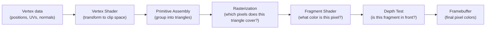

# C++ Bible — Phase 5a: Visual Pillar (OpenGL + Qt + ImGui)

> **For agentic workers:** Use superpowers:subagent-driven-development or superpowers:executing-plans to implement task-by-task. Steps use `- [ ]` checkbox syntax.

**Goal:** Write three visual-domain chapters (21-opengl, 22-qt, 23-imgui) for the C++ Bible tutorial. Each chapter includes a README, core.md (opinionated 2-page essentials), deep-dive.md (reference-grade), interview.md (Q&A pack), and pure-C++ example files that compile without GPU/display hardware.

**Tech Stack:** GCC 11.4.0, `g++ -std=c++17`. No `std::expected`, no `std::format`. No LaTeX — math in plain readable text. No OpenGL/Qt SDK required for examples (pure C++ simulations).

**Tutorial root:** `tutorial/pillar-5-visual/`

---

## Task 1: Chapter 21-opengl

Tutorial path: `tutorial/pillar-5-visual/21-opengl/`

### Step 1.1 — Create directory structure

- [ ] `mkdir -p tutorial/pillar-5-visual/21-opengl/examples`

### Step 1.2 — Write README.md

- [ ] Create `tutorial/pillar-5-visual/21-opengl/README.md`

```markdown
# Chapter 21: Computer Graphics with OpenGL

Computer graphics and OpenGL — from rasterization fundamentals to PBR shading, framebuffer objects, and the full modern OpenGL ecosystem.

## Navigation Paths

1. **Graphics math foundation:** core.md → deep-dive.md "Coordinate Spaces in Full" → examples/01_graphics_math.cpp
2. **Hello Triangle path:** core.md "VBO, VAO, EBO" → deep-dive.md "The Buffer Pipeline" → projects/07-opengl/ (Atlas Lab — real OpenGL, GPU required)
3. **Lighting focus:** core.md "GLSL" → deep-dive.md "Lighting Models" (Phong → Blinn-Phong → PBR)
4. **FBO / post-processing:** deep-dive.md "Framebuffer Objects"
5. **Interview prep:** interview.md

## Prerequisites

- C++ basics (pointers, arrays, structs)
- Linear algebra: vectors, dot product, cross product, matrix multiply (covered in core.md)

## Time Estimates

| File | Time |
|---|---|
| core.md | 1 hr |
| deep-dive.md | 5 hrs |
| interview.md | 45 min |
| examples (both) | 45 min |

## Platform Note

- **examples/01_graphics_math.cpp** and **examples/02_software_rasterizer.cpp** are pure C++ — no GPU required. Compile with `g++ -std=c++17 -O2`.
- Real OpenGL code (GLFW + GLAD + GLM) lives in `projects/07-opengl/` (Atlas Lab). You need a display server and OpenGL 4.6 driver for those.

## Files

| File | Purpose |
|---|---|
| core.md | Rasterization pipeline, MVP transforms, homogeneous coordinates, GLSL, VBO/VAO/EBO, ecosystem table, production rules |
| deep-dive.md | Coordinate spaces, textures, Phong/PBR lighting math, FBO, GLSL advanced (UBO/SSBO/compute), debugging |
| interview.md | 20 Q&A — MVP, VAO, z-fighting, Phong vs PBR, alpha blending, instanced rendering, compute shaders |
| examples/01_graphics_math.cpp | vec3/mat4 library: dot, cross, normalize, perspective, lookAt, MVP applied to cube |
| examples/02_software_rasterizer.cpp | ASCII framebuffer: barycentric coords, z-buffer, Gouraud shading, scanline fill |
```

### Step 1.3 — Write core.md

- [ ] Create `tutorial/pillar-5-visual/21-opengl/core.md`

```markdown
# Chapter 21: Computer Graphics with OpenGL — Core

## What a Pixel Is

A pixel (picture element) is a single point of color on a display. A 1920x1080 display has 2,073,600 pixels. Each pixel has an RGB value: three numbers (0-255 or 0.0-1.0) for red, green, blue intensity. The entire 2D array of pixel colors is the **framebuffer** — the image being displayed.

**Rasterization:** converting 3D geometry (triangles defined by vertices in 3D space) into 2D pixels. This is what graphics hardware does at enormous speed: a modern GPU can rasterize billions of triangles per second.

The rasterization pipeline:



## MVP Transforms: 3D to Screen

Every 3D object must pass through three transforms to become pixels:

**Model transform (M):** places the object in the world. A house model originally centered at origin (0,0,0) — the Model matrix moves it to its world position (50, 0, 30), rotates it, scales it.

**View transform (V):** moves the world so the camera is at the origin looking down -Z. The View matrix is the inverse of the camera's world transform: if the camera is at position (5, 2, 10) looking at the origin, the View matrix moves everything so the origin of the camera is at (0,0,0).

**Projection transform (P):** maps the view frustum (a truncated pyramid of what the camera sees) to a unit cube (-1 to +1 in X, Y, Z). Perspective projection makes distant objects smaller (like real vision). After projection, the GPU performs the **perspective divide** (x/w, y/w, z/w) to get NDC (Normalized Device Coordinates).

The MVP chain: `clip_pos = P * V * M * object_pos`

In GLSL (vertex shader): `gl_Position = projection * view * model * vec4(position, 1.0);`

## Homogeneous Coordinates

4D vectors in 3D graphics: [x, y, z, w]. A 3D point is [x, y, z, 1]. A 3D direction is [x, y, z, 0] (directions are not translated by transforms — the w=0 makes translation a no-op).

Why? A 4x4 matrix can encode rotation, scale, and translation in one operation. Without homogeneous coordinates, you would need a matrix plus a separate vector for translation.

The perspective divide: after multiplying by the projection matrix, w is not 1. Dividing x/w, y/w, z/w performs the perspective projection (distant objects get smaller because their w is larger).

## GLSL: The Shader Language

GLSL (OpenGL Shading Language) is a C-like language that runs on the GPU.

**Vertex shader:** runs once per vertex. Input: vertex attributes (position, UV, normal). Output: `gl_Position` (clip-space position) and whatever else you want interpolated across the triangle.

```glsl
#version 460 core
layout(location = 0) in vec3 aPos;
layout(location = 1) in vec2 aTexCoord;
layout(location = 2) in vec3 aNormal;

uniform mat4 model, view, projection;
uniform mat3 normalMatrix;  // inverse-transpose of upper-left 3x3 of model

out vec2 TexCoord;
out vec3 WorldPos;
out vec3 Normal;

void main() {
    gl_Position = projection * view * model * vec4(aPos, 1.0);
    TexCoord    = aTexCoord;
    WorldPos    = vec3(model * vec4(aPos, 1.0));
    Normal      = normalMatrix * aNormal;
}
```

**Fragment shader:** runs once per fragment (candidate pixel). Input: interpolated vertex outputs. Output: pixel color.

```glsl
#version 460 core
in vec2 TexCoord;
in vec3 WorldPos;
in vec3 Normal;
out vec4 FragColor;

uniform sampler2D diffuseMap;
uniform vec3 lightPos;
uniform vec3 viewPos;

void main() {
    vec3 albedo   = texture(diffuseMap, TexCoord).rgb;
    vec3 N        = normalize(Normal);
    vec3 L        = normalize(lightPos - WorldPos);
    vec3 V        = normalize(viewPos  - WorldPos);
    vec3 R        = reflect(-L, N);

    float ambient  = 0.1;
    float diffuse  = max(dot(N, L), 0.0);
    float specular = pow(max(dot(R, V), 0.0), 32.0);

    FragColor = vec4(albedo * (ambient + diffuse) + vec3(specular), 1.0);
}
```

## VBO, VAO, EBO: The Buffer Pipeline

**VBO (Vertex Buffer Object):** raw vertex data uploaded to the GPU. Just a block of memory on the GPU containing your vertex attributes (positions, normals, UVs, etc.) packed together.

**VAO (Vertex Array Object):** records how the vertex data in one or more VBOs is organized. "Attribute 0 is at offset 0, stride 32 bytes, 3 floats. Attribute 1 is at offset 12, stride 32 bytes, 2 floats." When you draw, OpenGL consults the bound VAO to know how to interpret the vertex data.

**EBO (Element Buffer Object):** an index buffer. Instead of repeating vertex data for shared vertices, store each unique vertex once in the VBO, then list indices for each triangle in the EBO. A quad (2 triangles) has 4 unique vertices, but 6 indices (two triangles x 3 vertices each).

```
VBO: [v0  v1  v2  v3]      (4 unique vertices)
EBO: [0 1 2   0 2 3]       (6 indices defining 2 triangles)
```

Typical setup sequence (using DSA — Direct State Access, OpenGL 4.5+):
```cpp
// Create VAO
GLuint vao;
glCreateVertexArrays(1, &vao);

// Create VBO, upload data
GLuint vbo;
glCreateBuffers(1, &vbo);
glNamedBufferStorage(vbo, sizeof(vertices), vertices, 0);

// Bind VBO to VAO binding point 0
glVertexArrayVertexBuffer(vao, 0, vbo, 0, sizeof(Vertex));

// Configure attributes
glEnableVertexArrayAttrib(vao, 0);  // position
glVertexArrayAttribFormat(vao, 0, 3, GL_FLOAT, GL_FALSE, offsetof(Vertex, pos));
glVertexArrayAttribBinding(vao, 0, 0);

glEnableVertexArrayAttrib(vao, 1);  // UV
glVertexArrayAttribFormat(vao, 1, 2, GL_FLOAT, GL_FALSE, offsetof(Vertex, uv));
glVertexArrayAttribBinding(vao, 1, 0);

// Create EBO, bind to VAO
GLuint ebo;
glCreateBuffers(1, &ebo);
glNamedBufferStorage(ebo, sizeof(indices), indices, 0);
glVertexArrayElementBuffer(vao, ebo);

// Draw
glBindVertexArray(vao);
glDrawElements(GL_TRIANGLES, 6, GL_UNSIGNED_INT, nullptr);
```

## The OpenGL Ecosystem

| Tool / Library | Purpose |
|---|---|
| GLFW | Cross-platform window creation, OpenGL context, keyboard/mouse input |
| GLAD | OpenGL extension loader — loads function pointers for all GL functions |
| GLM | Math library: vec2/3/4, mat4, perspective, lookAt, rotate, translate, normalize |
| Assimp | 3D model loader — FBX, OBJ, GLTF, Collada, PLY |
| stb_image.h | Single-header image loader — PNG, JPG, BMP, TGA, HDR |
| Dear ImGui | Debug GUI overlay rendered on top of your OpenGL scene |
| RenderDoc | GPU frame capture and replay debugger — inspect every draw call |
| Nsight Graphics | NVIDIA profiler: shader timing, memory bandwidth, pipeline stages |
| SPIRV-Cross | Compile SPIR-V shaders to GLSL/HLSL/MSL for cross-API portability |
| OpenGL 4.6 | Latest OpenGL — Direct State Access, SPIR-V ingestion, bindless textures, DSA |

## Production Rules

1. **Always enable the debug callback.** `glDebugMessageCallback()` with KHR_debug catches all GL errors at their source with source file and line. Without it, errors accumulate silently and you debug wrong draw calls for hours.

2. **Use DSA (Direct State Access).** `glCreateBuffers`, `glNamedBufferData` instead of `glGenBuffers` + `glBindBuffer` + `glBufferData`. Cleaner, no accidental state modification of the currently-bound buffer.

3. **Depth buffer precision matters.** Use a reversed-Z buffer (projection maps near to 1.0, far to 0.0) for dramatically better depth precision for distant objects. Standard Z packs almost all precision near the camera, leaving nearly nothing for objects 1000+ units away.

4. **Pack vertex data wisely.** Interleaved layout (position + normal + uv together per vertex) is generally cache-friendly for the GPU's vertex fetch unit. Separate attribute streams can be better for shadow passes that only need position.

5. **Measure before optimizing.** Use RenderDoc to count draw calls. Use Nsight Graphics for shader occupancy and memory bottlenecks. GPU performance is deeply counter-intuitive — measure it.
```

### Step 1.4 — Write deep-dive.md

- [ ] Create `tutorial/pillar-5-visual/21-opengl/deep-dive.md`

```markdown
# Chapter 21: OpenGL — Deep Dive

## Coordinate Spaces in Full

Every vertex transformation moves data through a chain of coordinate spaces. Understanding each space is essential for writing correct vertex shaders, debugging visual artifacts, and understanding why the normal matrix exists.

**Object Space (Local Space):** coordinates relative to the object's own origin. A sphere model is defined with its center at (0,0,0). Vertices range from -1 to +1. This is what the artist exports from Blender or Maya.

**World Space:** coordinates in the shared 3D scene. The sphere is placed at (5, 0, -3) by the Model matrix. The ground plane is at y=0. The point light is at (0, 10, 0). All objects share the same coordinate frame.

Transform: `world_pos = Model * object_pos`

**View Space (Camera Space / Eye Space):** coordinates relative to the camera. The camera is at the origin, looking down the -Z axis, with Y up and X right. This is the space in which lighting calculations are traditionally done (so light positions are also in view space).

Transform: `view_pos = View * world_pos`

The View matrix is the inverse of the camera's world transform (camera pose). If the camera has position P and rotation R, then `View = inverse(R * T(P))`. The `lookAt(eye, center, up)` function constructs this matrix directly:
```
forward = normalize(center - eye)
right   = normalize(cross(forward, up))
up      = cross(right, forward)         // reorthogonalize

View =
[ right.x    right.y    right.z    -dot(right,   eye) ]
[ up.x       up.y       up.z       -dot(up,      eye) ]
[-forward.x -forward.y -forward.z   dot(forward, eye) ]
[ 0          0          0           1                  ]
```

**Clip Space:** output of the vertex shader via `gl_Position`. The projection matrix transforms view space into a 4D homogeneous space. The GPU clips triangles against the unit cube defined by: -w <= x <= w, -w <= y <= w, 0 <= z <= w (OpenGL default depth range after remapping).

Perspective projection matrix for field-of-view f (in radians), aspect ratio a, near plane n, far plane f_far:
```
top    = n * tan(fov/2)
right  = top * aspect

P =
[ n/right   0          0                          0              ]
[ 0         n/top      0                          0              ]
[ 0         0         -(f_far+n)/(f_far-n)       -2*f_far*n/(f_far-n) ]
[ 0         0         -1                          0              ]
```

**NDC (Normalized Device Coordinates):** after the GPU performs the perspective divide (x/w, y/w, z/w), coordinates are in NDC: x and y in [-1, 1], z in [-1, 1] (OpenGL convention, Vulkan uses [0,1]).

**Screen Space / Window Space:** `glViewport(x, y, width, height)` maps NDC to screen pixels:
```
screen_x = viewport_x + (ndc_x + 1) / 2 * viewport_width
screen_y = viewport_y + (ndc_y + 1) / 2 * viewport_height
depth    = (ndc_z + 1) / 2   (into the depth buffer, 0.0 to 1.0)
```

**The Normal Transform Problem:**

Normals are surface tangent-space vectors, not positions. They cannot be transformed by the Model matrix directly. If the model is non-uniformly scaled (e.g., scale x by 2 but not y), the Model matrix will skew normals incorrectly — a normal pointing straight up would appear to tilt.

The correct transform is the **inverse-transpose** of the upper-left 3x3 of the Model matrix:
```
normalMatrix = transpose(inverse(mat3(model)))
```

In GLSL: `vec3 transformedNormal = normalMatrix * aNormal;`

This can be precomputed on the CPU and passed as a uniform. For uniform scaling (same scale on all axes), the Model matrix upper-left 3x3 works fine — but the habit of always using the normal matrix is safer.

**Concrete example:** transform the point (1, 0, 0) through MVP.

Camera at (0, 0, 5) looking at origin, 45-degree FOV, 800x600 window, near=0.1, far=100.

1. Object space: (1, 0, 0, 1)
2. World space (Model = identity): (1, 0, 0, 1)
3. View space (View moves world so camera is at origin):
   - Camera at (0,0,5), looking at origin, forward = (0,0,-1)
   - View shifts z by -5: (1, 0, -5, 1)
4. Clip space (perspective, 45-degree FOV, aspect 4/3):
   - f = 1/tan(pi/8) = 2.414
   - x_clip = f/aspect * 1 = 2.414/1.333 = 1.81
   - y_clip = f * 0 = 0
   - z_clip = -(100+0.1)/(100-0.1) * (-5) + (-2*100*0.1)/(100-0.1) * 1 = approx 4.9
   - w_clip = 5 (from -z_view = 5)
   - clip = (1.81, 0, 4.9, 5)
5. NDC: (1.81/5, 0/5, 4.9/5) = (0.362, 0, 0.98)
6. Screen: x = 400 + 0.362/2 * 800 = 545 px, y = 300

## Textures

A texture is a 2D (or 1D, 3D, cube) array of texels (texture elements) stored on the GPU. Texture coordinates (UV) are floating-point values from 0.0 to 1.0 mapping the texture onto a surface. UV (0,0) is typically the bottom-left, (1,1) is top-right in OpenGL convention.

**Texture formats:**

| Format | Bits/texel | Use case |
|---|---|---|
| GL_RGB8 | 24 | Standard color (no alpha) |
| GL_RGBA8 | 32 | Color with alpha |
| GL_SRGB8_ALPHA8 | 32 | Color in sRGB space — always use for albedo textures |
| GL_R16F | 16 | HDR single-channel (AO maps, roughness) |
| GL_RGB16F | 48 | HDR color (environment maps, emissive) |
| GL_RGBA32F | 128 | Full-precision float (scientific, G-buffer positions) |
| GL_DEPTH_COMPONENT24 | 24 | Depth attachment for FBOs |
| GL_DEPTH24_STENCIL8 | 32 | Depth + stencil attachment |
| GL_COMPRESSED_BC7 | 8 bits/px | DX10+ block compression, high quality |
| GL_COMPRESSED_ETC2 | 8 bits/px | Mobile-friendly block compression |

**Mipmaps:** pre-generated, progressively smaller versions of a texture (half size each level: 512x512, 256x256, 128x128, ..., 1x1). When a textured surface is far away and covers few pixels, the GPU samples from a smaller mip level — avoids aliasing and improves cache performance. Generate automatically: `glGenerateTextureMipmap(texID);`

**Filtering:**
- GL_NEAREST: nearest texel. Blocky/pixelated. Use for pixel art or when you want crisp texels.
- GL_LINEAR: bilinear interpolation between 4 texels. Smooth but blurry up close.
- GL_LINEAR_MIPMAP_LINEAR: trilinear filtering — bilinear within a mip level plus linear blend between two mip levels. Smoothest, standard choice.
- GL_LINEAR_MIPMAP_NEAREST: bilinear + nearest mip select. Avoids the blurring at mip transitions, sometimes used for performance.

Set filtering: `glTextureParameteri(texID, GL_TEXTURE_MIN_FILTER, GL_LINEAR_MIPMAP_LINEAR);`

**Wrapping modes:**
- GL_REPEAT: UV > 1.0 wraps back to 0. Seamless repeating textures.
- GL_CLAMP_TO_EDGE: UV is clamped to [0,1]. Edge texels stretch. Skyboxes, UI elements.
- GL_MIRRORED_REPEAT: UV mirrors at each integer boundary (0-1 forward, 1-2 backward).
- GL_CLAMP_TO_BORDER: UV outside [0,1] samples a border color (set with GL_TEXTURE_BORDER_COLOR). Shadow map PCF uses this.

**Texture units:** OpenGL has 48+ texture units (GL_TEXTURE0 through GL_TEXTURE47). Bind a texture to a unit, then tell the shader which unit to use:
```cpp
glActiveTexture(GL_TEXTURE0);
glBindTexture(GL_TEXTURE_2D, albedoTexID);
glUniform1i(glGetUniformLocation(shader, "albedoMap"), 0);  // unit 0

glActiveTexture(GL_TEXTURE1);
glBindTexture(GL_TEXTURE_2D, normalMapID);
glUniform1i(glGetUniformLocation(shader, "normalMap"), 1);  // unit 1
```

DSA equivalent (no bind needed): `glBindTextureUnit(0, albedoTexID);`

**Bindless textures (ARB_bindless_texture):** get a 64-bit handle for a texture:
```cpp
GLuint64 handle = glGetTextureHandleARB(texID);
glMakeTextureHandleResidentARB(handle);
// Pass the handle to a shader via uniform or SSBO
// Shader: layout(bindless_sampler) uniform sampler2D tex; (or via uint64)
```
No per-draw-call bind/unbind. Enables material systems that use thousands of textures per frame.

**Normal maps:** store surface normals in tangent space (R=+X, G=+Y, B=+Z where Z is "out of the surface"). In the shader, reconstruct the TBN matrix (Tangent, Bitangent, Normal) from vertex attributes and use it to transform the tangent-space normal into world space:
```glsl
mat3 TBN = mat3(T, B, N);  // tangent, bitangent, normal in world space
vec3 sampledNormal = texture(normalMap, TexCoord).rgb * 2.0 - 1.0;  // [0,1] -> [-1,1]
vec3 worldNormal = normalize(TBN * sampledNormal);
```

## Lighting Models

### Phong Shading

The classic local illumination model. Three components:

```
I_ambient  = Ka * Ia
I_diffuse  = Kd * Id * max(0, dot(N, L))
I_specular = Ks * Is * pow(max(0, dot(R, V)), alpha)

N = surface normal (unit vector pointing away from surface)
L = direction from surface point to light (unit vector)
V = direction from surface point to viewer/camera (unit vector)
R = perfect reflection of L about N = reflect(-L, N) = -L + 2 * dot(L,N) * N
Ka, Kd, Ks = material ambient, diffuse, specular coefficients
Ia, Id, Is = light ambient, diffuse, specular intensities
alpha       = shininess exponent (higher = sharper highlight, 1 to 256+)

Total: I = I_ambient + I_diffuse + I_specular
```

Problems with Phong: specular highlight looks wrong at grazing angles (V and R suddenly diverge), shininess is not physically meaningful, it's an approximation with no energy conservation.

### Blinn-Phong

Replace the reflection vector R with the half-vector H = normalize(L + V):
```
I_specular = Ks * Is * pow(max(0, dot(N, H)), alpha)
```

More physically correct at grazing angles. Slightly cheaper (no reflect() call). The shininess exponent must be roughly 4x larger than Phong to match the same highlight size. This is the model used in OpenGL fixed-function pipeline.

### PBR (Physically Based Rendering)

PBR aims to be physically correct: energy conserving, reciprocal, based on microfacet theory.

The Cook-Torrance BRDF (Bidirectional Reflectance Distribution Function):

```
f_r(L, V) = f_diffuse + f_specular

f_diffuse = albedo / pi      (Lambertian, energy-conserving)

f_specular = (D(N,H,alpha) * F(V,H) * G(N,L,N,V,alpha)) / (4 * max(dot(N,L), 0) * max(dot(N,V), 0) + epsilon)
```

**D — Normal Distribution Function (GGX/Trowbridge-Reitz):**
Describes what fraction of microfacets are aligned with H (and thus contribute to specular reflection).
```
D(N, H, alpha) = alpha^2 / (pi * ((dot(N,H))^2 * (alpha^2 - 1) + 1)^2)

where alpha = roughness^2  (squaring roughness gives more linear artistic response)
```

**F — Fresnel-Schlick approximation:**
Describes how much light is reflected vs refracted as a function of viewing angle. At grazing angles (near 90 degrees), almost all light reflects regardless of material.
```
F(cos_theta) = F0 + (1 - F0) * (1 - cos_theta)^5

where cos_theta = max(dot(V, H), 0)
      F0 = base reflectance at normal incidence
         = 0.04 for dielectrics (plastic, wood, skin — most non-metals)
         = albedo for metals (conductors — the albedo IS the reflectance)
```

**G — Geometry Function (Smith + Schlick-GGX):**
Accounts for microfacet self-shadowing and self-masking.
```
G_sub(N, X, k) = dot(N,X) / (dot(N,X) * (1-k) + k)
where k = alpha/2 for direct lighting, k = (alpha+1)^2 / 8 for IBL

G(N, V, L, k) = G_sub(N, V, k) * G_sub(N, L, k)
```

**PBR Parameters:**
- albedo: base color (metallic: this IS the specular color; dielectric: this is the diffuse color)
- metallic: 0.0 = dielectric (plastic), 1.0 = conductor (gold). Values in between are rare in nature (use only for transitions/blending).
- roughness: 0.0 = perfect mirror, 1.0 = completely rough Lambertian-like specular
- ao: ambient occlusion 0.0-1.0, pre-baked or from SSAO
- emissive: additive glow color (0.0-1.0 or HDR)

The full PBR rendering equation (reflectance equation):
```
L_out(V) = integral over hemisphere of f_r(L, V) * L_in(L) * max(dot(N,L), 0) dL

For point lights: L_out(V) = sum over lights of f_r(L_i, V) * L_radiance_i * max(dot(N,L_i), 0) * attenuation_i
```

For image-based lighting (IBL), the integral is precomputed into a specular cubemap (split-sum approximation: pre-filtered environment map + BRDF integration LUT) and a diffuse irradiance cubemap.

## Framebuffer Objects (FBO)

An FBO is a render target: you render into it instead of the screen. This enables render-to-texture for post-processing, shadow maps, deferred rendering, reflections, and portal rendering.

**Basic FBO setup:**
```cpp
GLuint fbo;
glCreateFramebuffers(1, &fbo);

// Create color attachment (texture)
GLuint colorTex;
glCreateTextures(GL_TEXTURE_2D, 1, &colorTex);
glTextureStorage2D(colorTex, 1, GL_RGBA16F, width, height);
glNamedFramebufferTexture(fbo, GL_COLOR_ATTACHMENT0, colorTex, 0);

// Create depth attachment (renderbuffer — faster than texture if you don't need to sample it)
GLuint depthRBO;
glCreateRenderbuffers(1, &depthRBO);
glNamedRenderbufferStorage(depthRBO, GL_DEPTH_COMPONENT24, width, height);
glNamedFramebufferRenderbuffer(fbo, GL_DEPTH_ATTACHMENT, GL_RENDERBUFFER, depthRBO);

// Check completeness
if (glCheckNamedFramebufferStatus(fbo, GL_FRAMEBUFFER) != GL_FRAMEBUFFER_COMPLETE) {
    // Handle error
}

// Render to FBO
glBindFramebuffer(GL_FRAMEBUFFER, fbo);
glViewport(0, 0, width, height);
glClear(GL_COLOR_BUFFER_BIT | GL_DEPTH_BUFFER_BIT);
// ... render scene ...

// Back to screen
glBindFramebuffer(GL_FRAMEBUFFER, 0);
// Now colorTex contains the rendered image — use it as a texture in the next pass
```

**MSAA (Multisample Anti-Aliasing):**
```cpp
// Multisample renderbuffer (4 samples)
glNamedRenderbufferStorageMultisample(msaaRBO, 4, GL_RGBA8, width, height);
glNamedFramebufferRenderbuffer(msaaFBO, GL_COLOR_ATTACHMENT0, GL_RENDERBUFFER, msaaRBO);

// Resolve: blit from MSAA FBO to regular FBO
glBlitNamedFramebuffer(msaaFBO, resolveFBO,
    0, 0, width, height,
    0, 0, width, height,
    GL_COLOR_BUFFER_BIT, GL_LINEAR);
```

**Multiple Render Targets (MRT):** write to multiple textures in one pass. Core of deferred rendering G-buffer:
```glsl
// Fragment shader for G-buffer pass:
layout(location = 0) out vec3 gPosition;   // GL_COLOR_ATTACHMENT0
layout(location = 1) out vec3 gNormal;     // GL_COLOR_ATTACHMENT1
layout(location = 2) out vec4 gAlbedoSpec; // GL_COLOR_ATTACHMENT2

void main() {
    gPosition   = WorldPos;
    gNormal     = normalize(Normal);
    gAlbedoSpec = vec4(albedo, specular);
}
```

Enable attachments:
```cpp
GLenum bufs[] = { GL_COLOR_ATTACHMENT0, GL_COLOR_ATTACHMENT1, GL_COLOR_ATTACHMENT2 };
glNamedFramebufferDrawBuffers(fbo, 3, bufs);
```

**Deferred rendering:** G-buffer pass renders geometry data into MRT textures; lighting pass reads those textures and computes lighting for every pixel. Advantage: O(geometry) + O(lights * screen_pixels) instead of O(geometry * lights). Disadvantage: no transparency, large memory bandwidth, MSAA is difficult.

## GLSL Advanced

### Uniform Buffer Objects (UBO)

Shared uniform data across multiple shaders without redundant uploads. Define a block with `std140` layout (strict rules about alignment):
```glsl
layout(std140, binding = 0) uniform Matrices {
    mat4 projection;  // offset 0, size 64 bytes
    mat4 view;        // offset 64, size 64 bytes
    vec4 viewPos;     // offset 128, size 16 bytes (vec3 pads to vec4 in std140)
    // Total: 144 bytes (plus padding to alignment multiple)
};
```

std140 alignment rules:
- float: 4 bytes aligned
- vec2: 8 bytes aligned
- vec3: 16 bytes aligned (rounds up to vec4 size!)
- vec4: 16 bytes aligned
- mat4: 4 x vec4 = 64 bytes
- arrays: each element rounded up to vec4 (16 bytes) regardless of type

Create and bind:
```cpp
GLuint ubo;
glCreateBuffers(1, &ubo);
glNamedBufferStorage(ubo, 144, nullptr, GL_DYNAMIC_STORAGE_BIT);
glBindBufferBase(GL_UNIFORM_BUFFER, 0, ubo);

// Update per frame:
glNamedBufferSubData(ubo, 0, 64, glm::value_ptr(projMatrix));
glNamedBufferSubData(ubo, 64, 64, glm::value_ptr(viewMatrix));
```

### Shader Storage Buffer Objects (SSBO)

Like UBO but: writable from shaders, no size limit (UBO limit ~16KB, SSBO ~2GB), uses `std430` layout (no vec3 padding — arrays use their natural element size).
```glsl
layout(std430, binding = 1) buffer Particles {
    vec4 positions[];   // std430: vec4 is 16 bytes, array is tightly packed
    vec4 velocities[];  // can write: positions[gl_VertexID] += dt * velocities[gl_VertexID];
};
```

SSBOs enable GPU-driven rendering: store draw commands in an SSBO, have a compute shader cull and write `glDrawArraysIndirectCommand` structs, then call `glMultiDrawArraysIndirect`. Zero CPU involvement in culling.

### Compute Shaders

Run arbitrary computations on the GPU without a rendering pass:
```glsl
#version 460 core
layout(local_size_x = 16, local_size_y = 16, local_size_z = 1) in;

layout(binding = 0, rgba16f) uniform image2D inputImage;
layout(binding = 1, rgba16f) uniform image2D outputImage;

void main() {
    ivec2 coords = ivec2(gl_GlobalInvocationID.xy);
    vec4 color = imageLoad(inputImage, coords);

    // Apply blur kernel or tone mapping or any operation
    vec4 result = processColor(color);

    imageStore(outputImage, coords, result);
}
```

Dispatch: `glDispatchCompute(ceil(width/16), ceil(height/16), 1);`

Synchronization (ensure compute finishes before next pass reads the image):
`glMemoryBarrier(GL_SHADER_IMAGE_ACCESS_BARRIER_BIT);`

Use cases: particle simulation, physics (update positions/velocities), post-processing (tone mapping, bloom, SSAO), GPU culling (test visibility for each object), texture compression.

### Geometry Shaders

Run once per primitive (triangle, line, point) after the vertex shader. Can emit 0 or more primitives:
```glsl
#version 460 core
layout(triangles) in;
layout(triangle_strip, max_vertices = 3) out;

in vec3 WorldPos[];  // array: one per input vertex

void main() {
    for (int i = 0; i < 3; i++) {
        gl_Position = gl_in[i].gl_Position;
        EmitVertex();
    }
    EndPrimitive();
}
```

Use cases: particle billboards (input a point, emit a camera-facing quad), shadow map cubemaps in one pass (emit to 6 faces via `gl_Layer`), wireframe rendering (emit line primitives from triangle input), normal visualization (emit lines from triangle center in normal direction).

Geometry shaders are powerful but expensive — they break the GPU's parallel pipeline. Prefer compute shaders or mesh shaders for new code.

### Shader Compilation and Error Handling

```cpp
GLuint compileShader(GLenum type, const char* source) {
    GLuint shader = glCreateShader(type);
    glShaderSource(shader, 1, &source, nullptr);
    glCompileShader(shader);

    GLint success;
    glGetShaderiv(shader, GL_COMPILE_STATUS, &success);
    if (!success) {
        char log[1024];
        glGetShaderInfoLog(shader, 1024, nullptr, log);
        fprintf(stderr, "Shader compilation error:\n%s\n", log);
        glDeleteShader(shader);
        return 0;
    }
    return shader;
}

GLuint linkProgram(GLuint vert, GLuint frag) {
    GLuint prog = glCreateProgram();
    glAttachShader(prog, vert);
    glAttachShader(prog, frag);
    glLinkProgram(prog);

    GLint success;
    glGetProgramiv(prog, GL_LINK_STATUS, &success);
    if (!success) {
        char log[1024];
        glGetProgramInfoLog(prog, 1024, nullptr, log);
        fprintf(stderr, "Program link error:\n%s\n", log);
    }
    return prog;
}
```

## Debugging

**KHR_debug callback (essential):**
```cpp
void APIENTRY glDebugCallback(GLenum source, GLenum type, GLuint id,
    GLenum severity, GLsizei length, const GLchar* message, const void* userParam)
{
    if (severity == GL_DEBUG_SEVERITY_NOTIFICATION) return;  // skip info messages

    const char* srcStr = "?";
    if (source == GL_DEBUG_SOURCE_API)             srcStr = "API";
    else if (source == GL_DEBUG_SOURCE_SHADER_COMPILER) srcStr = "SHADER";
    else if (source == GL_DEBUG_SOURCE_APPLICATION) srcStr = "APP";

    const char* typeStr = "?";
    if (type == GL_DEBUG_TYPE_ERROR)               typeStr = "ERROR";
    else if (type == GL_DEBUG_TYPE_DEPRECATED_BEHAVIOR) typeStr = "DEPRECATED";
    else if (type == GL_DEBUG_TYPE_PERFORMANCE)    typeStr = "PERF";

    fprintf(stderr, "[GL %s %s id=%u] %s\n", srcStr, typeStr, id, message);
    if (type == GL_DEBUG_TYPE_ERROR) { __builtin_trap(); }  // break on error
}

// Setup (after context creation, requires debug context):
glEnable(GL_DEBUG_OUTPUT);
glEnable(GL_DEBUG_OUTPUT_SYNCHRONOUS);  // callback on same thread as error
glDebugMessageCallback(glDebugCallback, nullptr);
glDebugMessageControl(GL_DONT_CARE, GL_DONT_CARE, GL_DEBUG_SEVERITY_NOTIFICATION, 0, nullptr, GL_FALSE);
```

**RenderDoc workflow:**
1. Launch your app from RenderDoc (or attach to process).
2. Press F12 to capture a frame.
3. Inspect every draw call: see bound VAO, shader uniforms, input textures, output (color + depth).
4. Click "Debug Vertex" or "Debug Pixel" to step through GLSL in a debugger.
5. Check "Timeline" for draw call ordering and resource transitions.

**GPU Timer Queries:**
```cpp
GLuint queries[2];
glGenQueries(2, queries);

glQueryCounter(queries[0], GL_TIMESTAMP);
// ... draw calls ...
glQueryCounter(queries[1], GL_TIMESTAMP);

// After swapBuffers and one more frame (queries may not be done immediately):
GLuint64 start, end;
glGetQueryObjectui64v(queries[0], GL_QUERY_RESULT, &start);
glGetQueryObjectui64v(queries[1], GL_QUERY_RESULT, &end);
double ms = (end - start) / 1e6;
```

**Reversed-Z for better depth precision:**
Standard perspective: near maps to -1 (NDC), far maps to +1. Most depth precision is packed near the camera; distant geometry suffers z-fighting. Reversed-Z: remap so near=1.0 in the depth buffer, far=0.0. Pair with `glDepthFunc(GL_GREATER)` and `glClearDepth(0.0)`. The float depth buffer has maximum precision near 0.0 — reversed-Z exploits this for the far range where z-fighting is worst.
```
```

### Step 1.5 — Write interview.md

- [ ] Create `tutorial/pillar-5-visual/21-opengl/interview.md`

```markdown
# Chapter 21: OpenGL — Interview Q&A

## Core Concepts

**Q1: Explain the MVP matrix and why it is a matrix multiplication chain.**
The Model matrix places an object in the world (rotation, translation, scale). The View matrix transforms world space to camera space (inverse of the camera's world pose). The Projection matrix maps the camera frustum to clip space. They are multiplied right-to-left: `clip = P * V * M * vertex`. Using matrices instead of sequential operations lets the GPU multiply 4x4 matrices once per vertex on SIMD hardware at maximum throughput.

**Q2: What is a VAO and why is it necessary?**
A VAO (Vertex Array Object) records the format of vertex data: which VBO provides data for each attribute, the stride, the offset, and the data type. Without a VAO, you would need to reconfigure all attribute pointers before every draw call. With a VAO bound, OpenGL knows exactly how to feed vertex data to the vertex shader. Modern OpenGL requires a VAO for any draw call.

**Q3: What is the depth buffer and how does z-fighting occur?**
The depth buffer stores the depth (z value) of the closest fragment at each pixel. When a new fragment arrives, its depth is compared to the stored depth — if it is closer (GL_LESS), the fragment passes and the depth buffer is updated. Z-fighting occurs when two surfaces are nearly coplanar: their depth values are so close that floating-point rounding causes them to alternate which is "in front" depending on viewing angle, producing a flickering shimmering artifact. Solutions: increase near plane distance (never use near=0.001 when near=0.1 works), use reversed-Z for better precision, add a tiny polygon offset (`glPolygonOffset`).

**Q4: What is the difference between Phong shading and PBR?**
Phong is a purely empirical model with ambient, diffuse (Lambert), and specular (shininess exponent) components. It is fast but not physically correct: it does not conserve energy (adding ambient + diffuse + specular can exceed the incoming light energy), and the specular term is not reciprocal. PBR (Cook-Torrance microfacet model) is physically based: energy conserving by design, uses Fresnel reflection to model the angle-dependent reflectance correctly, uses a statistical microfacet model (NDF) for specular distribution. PBR parameters (albedo, metallic, roughness) are artistically intuitive and produce consistent results under any lighting condition. Phong parameters (Ks, alpha) vary per lighting setup.

**Q5: What is the difference between a VBO and an EBO?**
A VBO (Vertex Buffer Object) stores vertex attribute data (positions, normals, UVs) on the GPU. An EBO (Element Buffer Object) stores indices — each index references a vertex in the VBO. For a mesh where many triangles share vertices, indices avoid duplicating vertex data. A cube has 8 unique vertices and 36 indices (12 triangles, 3 vertices each). Without an EBO you would need 36 full vertex records; with an EBO you store 8 and index into them.

**Q6: What causes alpha blending artifacts and how do you fix them?**
Alpha blending composites transparent surfaces: `result = src_alpha * src_color + (1 - src_alpha) * dst_color`. The depth buffer only stores opaque depth. If transparent objects write to the depth buffer, they occlude transparent objects behind them that have not been drawn yet. Fix: (1) Draw all opaque objects first with depth writes enabled. (2) Sort transparent objects back-to-front. (3) Draw transparent objects with depth writes disabled (`glDepthMask(GL_FALSE)`) but depth testing enabled. For order-independent transparency (OIT), use techniques like weighted blended OIT or per-pixel linked lists in an SSBO.

**Q7: What is a fragment shader and when does it NOT run?**
The fragment shader runs once per fragment (a candidate pixel) generated by rasterizing a triangle. It does NOT run if: (a) the fragment fails the depth test (early depth test kills it before the fragment shader), (b) the fragment is clipped by the view frustum or user-defined clip planes, (c) the triangle is back-face culled (`glEnable(GL_CULL_FACE)`), (d) the fragment is outside the scissor rectangle. Early depth testing (fragment shader must not write gl_FragDepth) can save enormous work on complex scenes.

**Q8: What is instanced rendering and when would you use it?**
Instanced rendering draws many copies of the same geometry with a single draw call: `glDrawElementsInstanced(GL_TRIANGLES, indexCount, GL_UNSIGNED_INT, 0, instanceCount)`. Each instance gets a unique `gl_InstanceID` in the shader — use it to index a buffer of per-instance transforms (passed via SSBO or vertex attribute with divisor=1). Use it for: forests (thousands of identical trees), particle systems, crowds of identical characters, grass. Eliminates per-draw-call CPU overhead which is typically 100-1000 microseconds per call.

**Q9: What is a geometry shader and what are its trade-offs?**
A geometry shader runs after the vertex shader on complete primitives (triangles, lines, points). It can emit zero or more primitives. Uses: particle billboards (emit camera-facing quad from a point), shadow cubemaps in one pass (emit to 6 faces via gl_Layer), normal visualization lines. Trade-off: geometry shaders break GPU parallelism — the GPU cannot pipeline vertex and fragment processing across a geometry shader stage efficiently. For anything performance-critical, prefer compute shaders or GPU-driven approaches. Geometry shaders are useful for quick debug visualization.

**Q10: What is a compute shader and how does it differ from a vertex/fragment shader?**
Compute shaders run arbitrary GPU computation outside the graphics pipeline. No input attributes, no fixed-function rasterization, no output attachments — just threads with access to SSBOs, images, and shared memory. Vertex/fragment shaders are tied to the rendering pipeline: vertex stage reads VBOs, fragment stage writes to the framebuffer. Compute shaders use `gl_GlobalInvocationID` to identify each thread, group threads into local workgroups with `layout(local_size_x/y/z)`, can use `shared` memory for fast intra-group communication, and synchronize with `barrier()` and `memoryBarrier()`. Use for: particle simulation, GPGPU physics, post-processing (no need to draw a fullscreen triangle), GPU culling, order-independent transparency.

## Practical / Debugging

**Q11: A texture appears all black in your shader. What do you check?**
(1) Is the texture bound to the correct texture unit? Check `glActiveTexture` was called before bind. (2) Is the uniform set to the correct unit index? `glUniform1i(loc, 0)` for unit 0. (3) Was the texture uploaded correctly? Check `glTextureStorage2D` parameters — width/height correct? Format matches the data? (4) Are UV coordinates in range? If they are outside [0,1] and wrapping is GL_CLAMP_TO_BORDER, and the border color is black, that explains it. (5) Does the texture have mipmaps? If `GL_TEXTURE_MIN_FILTER` is set to a mipmap mode (GL_LINEAR_MIPMAP_LINEAR) but no mipmaps were generated, the texture is incomplete and reads as black. Call `glGenerateTextureMipmap` or switch to GL_LINEAR.

**Q12: Draw calls are 500 microseconds each on the CPU. How do you reduce this overhead?**
(1) Instanced rendering for identical geometry. (2) Merge static geometry into large VBOs and draw with a single call using a material ID per vertex. (3) Multi-draw indirect: fill a buffer of `DrawElementsIndirectCommand` structs (potentially from a compute shader doing GPU culling), then call `glMultiDrawElementsIndirect` for one CPU call dispatching thousands of draws. (4) Bindless textures to eliminate texture bind overhead. (5) Sort draw calls by shader program to minimize program switches (very expensive).

**Q13: Normals look wrong after scaling an object non-uniformly. Why?**
The Model matrix's upper-left 3x3 transforms positions correctly but distorts normals when non-uniform scaling is applied. A normal pointing straight up on a sphere gets skewed toward the scaled axis. The correct transform is the inverse-transpose of the Model matrix's 3x3: `normalMatrix = transpose(inverse(mat3(model)))`. This is computed on the CPU and uploaded as a uniform, because inverse() in GLSL per-vertex is expensive.

**Q14: What is the OpenGL state machine and why is it a design problem?**
OpenGL is a global state machine — every setting (bound VAO, active shader, depth func, blend mode, scissor, viewport) is global context state. A draw call uses whatever state is currently set, not state passed as parameters. This causes bugs: if one draw call leaves depth testing disabled, the next draw call also runs without depth testing. It makes parallelism impossible (state changes must be serialized) and makes debugging hard. Modern APIs (Vulkan, DX12, Metal) address this with pipeline state objects (PSOs) that encode ALL state for a draw call into an immutable object compiled once and swapped atomically.

## Edge Cases / Traps

**Q15: Is VSync always the right choice?**
No. VSync synchronizes buffer swaps with the display refresh rate (60/120/144Hz) eliminating tearing, but adds 1-2 frame latency (your game logic runs 16ms ahead of what is displayed). For competitive games, many players prefer tearing over the latency hit. For a racing sim where input latency matters, tearing may be acceptable. Adaptive sync (AMD FreeSync, NVIDIA G-Sync) eliminates tearing without fixed latency by varying the display refresh to match the game framerate.

**Q16: Is GL error checking optional?**
No — ignoring GL errors causes silent corruption that is very hard to debug. Without `glDebugMessageCallback`, errors from draw call N can silently affect draw call N+100. The debug callback with `GL_DEBUG_OUTPUT_SYNCHRONOUS` fires immediately at the error site with a human-readable message and the call stack, making bugs trivial to locate. Enable it in debug builds unconditionally.

**Q17: When would you use a renderbuffer instead of a texture for an FBO attachment?**
Use a renderbuffer when you will not sample the attachment in a shader — for example, the depth-stencil buffer in a forward rendering pass that is used only for depth testing. Renderbuffers may have slightly better performance because the driver can choose an optimal internal tiled layout that is not texture-sample-compatible. Use a texture attachment when you need to read the data in another pass (shadow map depth texture, G-buffer color textures).

**Q18: What is SSAO and how does it work?**
SSAO (Screen-Space Ambient Occlusion) approximates ambient occlusion — how much ambient light reaches a surface point based on surrounding geometry. Algorithm: for each fragment, sample a hemisphere of points in screen space (using depth and normal buffers), count how many samples are "inside" geometry (their reconstructed world position is behind a surface), use that count as an occlusion factor. SSAO runs as a post-processing compute shader or fullscreen quad pass. It is a screen-space approximation — it cannot see geometry outside the frustum, and occlusion halos appear at screen edges.

**Q19: What is the GL_TRIANGLE_STRIP primitive type and when would you use it?**
GL_TRIANGLE_STRIP reuses the last two vertices for each new triangle: vertices [v0,v1,v2,v3,v4] generate triangles (v0,v1,v2), (v1,v2,v3), (v2,v3,v4). Each additional triangle requires only one new vertex instead of three. Memory savings for highly tessellated geometry like terrain or sphere meshes. Modern practice uses indexed triangles with an EBO for more flexibility, but triangle strips appear in embedded/WebGL contexts where vertex count is constrained.

**Q20: What is the difference between forward rendering and deferred rendering?**
Forward rendering: for each object, run the vertex and fragment shader, and in the fragment shader compute lighting from all lights. Cost: O(objects * lights) fragment shader invocations. Works well for up to ~8-16 lights. Handles transparency naturally. Simple to implement and debug.

Deferred rendering: first pass (G-buffer pass) stores per-pixel geometry data into MRT textures (position, normal, albedo, metalness). Second pass (lighting pass) reads those textures and computes lighting for each screen pixel once per light, regardless of scene geometry complexity. Cost: O(screen_pixels * lights) for lighting. Advantages: no wasted lighting computation on occluded geometry, easy to add lights (just run more lighting passes). Disadvantages: large G-buffer bandwidth (4+ RGBA16F textures at 1080p = 50+ MB), no MSAA (G-buffer stores single sample per pixel), transparency requires a separate forward pass.
```

### Step 1.6 — Write examples

- [ ] Create `tutorial/pillar-5-visual/21-opengl/examples/01_graphics_math.cpp`

```cpp
// 01_graphics_math.cpp — vec3/mat4 math library + MVP transform demo
// Compile: g++ -std=c++17 -O2 -o 01_graphics_math 01_graphics_math.cpp
// No GPU or display required.

#include <cmath>
#include <cstdio>
#include <cstring>
#include <cassert>
#include <array>
#include <algorithm>

// ─── vec3 ───────────────────────────────────────────────────────────────────

struct vec3 {
    float x, y, z;
    vec3(float x = 0, float y = 0, float z = 0) : x(x), y(y), z(z) {}
    vec3 operator+(vec3 b) const { return {x+b.x, y+b.y, z+b.z}; }
    vec3 operator-(vec3 b) const { return {x-b.x, y-b.y, z-b.z}; }
    vec3 operator*(float s) const { return {x*s, y*s, z*s}; }
    vec3 operator-() const { return {-x, -y, -z}; }
    float& operator[](int i) { return (&x)[i]; }
    float  operator[](int i) const { return (&x)[i]; }
};

float dot(vec3 a, vec3 b) { return a.x*b.x + a.y*b.y + a.z*b.z; }
float length(vec3 v) { return std::sqrt(dot(v, v)); }
vec3  normalize(vec3 v) { float l = length(v); return {v.x/l, v.y/l, v.z/l}; }

vec3 cross(vec3 a, vec3 b) {
    return {
        a.y*b.z - a.z*b.y,
        a.z*b.x - a.x*b.z,
        a.x*b.y - a.y*b.x
    };
}

void printVec3(const char* label, vec3 v) {
    printf("%-20s (%.4f, %.4f, %.4f)\n", label, v.x, v.y, v.z);
}

// ─── vec4 ───────────────────────────────────────────────────────────────────

struct vec4 {
    float x, y, z, w;
    vec4(float x = 0, float y = 0, float z = 0, float w = 1)
        : x(x), y(y), z(z), w(w) {}
    explicit vec4(vec3 v, float w = 1) : x(v.x), y(v.y), z(v.z), w(w) {}
    float& operator[](int i) { return (&x)[i]; }
    float  operator[](int i) const { return (&x)[i]; }
};

// ─── mat4 ───────────────────────────────────────────────────────────────────
// Column-major storage: col[c][r]. Same layout as OpenGL/GLM.

struct mat4 {
    float col[4][4];  // col[column][row]

    mat4() { std::memset(col, 0, sizeof(col)); }

    static mat4 identity() {
        mat4 m;
        m.col[0][0] = m.col[1][1] = m.col[2][2] = m.col[3][3] = 1.0f;
        return m;
    }

    float& at(int r, int c) { return col[c][r]; }
    float  at(int r, int c) const { return col[c][r]; }
};

vec4 operator*(const mat4& m, vec4 v) {
    vec4 result(0, 0, 0, 0);
    for (int r = 0; r < 4; r++)
        for (int c = 0; c < 4; c++)
            result[r] += m.at(r, c) * v[c];
    return result;
}

mat4 operator*(const mat4& a, const mat4& b) {
    mat4 result;
    for (int r = 0; r < 4; r++)
        for (int c = 0; c < 4; c++)
            for (int k = 0; k < 4; k++)
                result.at(r, c) += a.at(r, k) * b.at(k, c);
    return result;
}

void printMat4(const char* label, const mat4& m) {
    printf("%s:\n", label);
    for (int r = 0; r < 4; r++) {
        printf("  [");
        for (int c = 0; c < 4; c++)
            printf(" %8.4f", m.at(r, c));
        printf(" ]\n");
    }
}

// ─── Transform constructors ─────────────────────────────────────────────────

mat4 translate(vec3 t) {
    mat4 m = mat4::identity();
    m.at(0, 3) = t.x;
    m.at(1, 3) = t.y;
    m.at(2, 3) = t.z;
    return m;
}

mat4 scale(vec3 s) {
    mat4 m = mat4::identity();
    m.at(0, 0) = s.x;
    m.at(1, 1) = s.y;
    m.at(2, 2) = s.z;
    return m;
}

// Rotate angle (radians) around axis (unit vector)
mat4 rotate(float angle, vec3 axis) {
    float c = std::cos(angle), s = std::sin(angle);
    float t = 1.0f - c;
    float x = axis.x, y = axis.y, z = axis.z;

    mat4 m = mat4::identity();
    m.at(0,0) = t*x*x + c;     m.at(0,1) = t*x*y - s*z; m.at(0,2) = t*x*z + s*y;
    m.at(1,0) = t*x*y + s*z;   m.at(1,1) = t*y*y + c;   m.at(1,2) = t*y*z - s*x;
    m.at(2,0) = t*x*z - s*y;   m.at(2,1) = t*y*z + s*x; m.at(2,2) = t*z*z + c;
    return m;
}

// Perspective projection (field of view in radians, aspect w/h, near/far planes)
mat4 perspective(float fovY, float aspect, float nearZ, float farZ) {
    float f = 1.0f / std::tan(fovY * 0.5f);
    mat4 m;
    m.at(0,0) = f / aspect;
    m.at(1,1) = f;
    m.at(2,2) = -(farZ + nearZ) / (farZ - nearZ);
    m.at(2,3) = -2.0f * farZ * nearZ / (farZ - nearZ);
    m.at(3,2) = -1.0f;
    return m;
}

// View matrix: camera at eye, looking at center, with up vector
mat4 lookAt(vec3 eye, vec3 center, vec3 up) {
    vec3 f = normalize(center - eye);  // forward
    vec3 r = normalize(cross(f, up));  // right
    vec3 u = cross(r, f);              // reorthogonalized up

    mat4 m = mat4::identity();
    m.at(0,0) =  r.x;  m.at(0,1) =  r.y;  m.at(0,2) =  r.z;  m.at(0,3) = -dot(r, eye);
    m.at(1,0) =  u.x;  m.at(1,1) =  u.y;  m.at(1,2) =  u.z;  m.at(1,3) = -dot(u, eye);
    m.at(2,0) = -f.x;  m.at(2,1) = -f.y;  m.at(2,2) = -f.z;  m.at(2,3) =  dot(f, eye);
    return m;
}

// ─── Demo ───────────────────────────────────────────────────────────────────

int main() {
    printf("=== vec3 operations ===\n");
    vec3 a(1, 2, 3), b(4, 5, 6);
    printVec3("a", a);
    printVec3("b", b);
    printf("dot(a,b)         = %.4f  (expect 32.0)\n", dot(a, b));
    printVec3("cross(a,b)", cross(a, b));  // expect (-3, 6, -3)
    printVec3("normalize(a)", normalize(a));
    printf("length(a)        = %.4f  (expect %.4f)\n", length(a), std::sqrt(14.0f));
    printf("\n");

    printf("=== MVP transform demo ===\n");
    printf("Scene: unit cube at origin, camera at (0,3,5) looking at origin, 60-deg FOV\n\n");

    // Model: rotate cube 45 degrees around Y axis
    const float PI = 3.14159265f;
    mat4 model = rotate(PI / 4.0f, normalize(vec3(0, 1, 0)));

    // View: camera at (0, 3, 5) looking at origin
    mat4 view = lookAt(vec3(0, 3, 5), vec3(0, 0, 0), vec3(0, 1, 0));

    // Projection: 60-degree vertical FOV, 800x600 aspect, near=0.1, far=100
    mat4 proj = perspective(PI / 3.0f, 800.0f / 600.0f, 0.1f, 100.0f);

    mat4 vp  = proj * view;
    mat4 mvp = proj * view * model;

    printMat4("Model (45-deg Y rotation)", model);
    printf("\n");
    printMat4("View (camera at 0,3,5)", view);
    printf("\n");

    // 8 vertices of a unit cube [-0.5, 0.5]
    vec3 cube[8] = {
        {-0.5f,-0.5f,-0.5f}, { 0.5f,-0.5f,-0.5f},
        { 0.5f, 0.5f,-0.5f}, {-0.5f, 0.5f,-0.5f},
        {-0.5f,-0.5f, 0.5f}, { 0.5f,-0.5f, 0.5f},
        { 0.5f, 0.5f, 0.5f}, {-0.5f, 0.5f, 0.5f},
    };

    const int vpW = 800, vpH = 600;
    printf("%-4s  %-28s  %-28s  %-16s\n",
        "Vtx", "World pos", "Clip pos (xyz/w=NDC)", "Screen px");
    printf("%s\n", std::string(90, '-').c_str());

    for (int i = 0; i < 8; i++) {
        vec4 local(cube[i], 1.0f);
        vec4 world = model * local;
        vec4 clip  = vp * world;

        // Perspective divide -> NDC
        float ndcX = clip.x / clip.w;
        float ndcY = clip.y / clip.w;
        float ndcZ = clip.z / clip.w;

        // Viewport transform
        float sx = (ndcX + 1.0f) * 0.5f * vpW;
        float sy = (1.0f - ndcY) * 0.5f * vpH;  // flip Y for screen coords

        bool inFrustum = (ndcX >= -1 && ndcX <= 1 && ndcY >= -1 && ndcY <= 1 && ndcZ >= -1 && ndcZ <= 1);

        char worldStr[64], clipStr[64], screenStr[64];
        snprintf(worldStr, sizeof(worldStr), "(%.2f, %.2f, %.2f)",
            world.x, world.y, world.z);
        snprintf(clipStr, sizeof(clipStr), "(%.3f, %.3f, %.3f)",
            ndcX, ndcY, ndcZ);
        if (inFrustum)
            snprintf(screenStr, sizeof(screenStr), "(%4.0f, %4.0f)", sx, sy);
        else
            snprintf(screenStr, sizeof(screenStr), "CLIPPED");

        printf("v%-3d  %-28s  %-28s  %s\n", i, worldStr, clipStr, screenStr);
    }

    printf("\n=== Lighting vectors ===\n");
    vec3 surfacePoint(0, 0, 0);
    vec3 lightPos(2, 4, 3);
    vec3 cameraPos(0, 3, 5);
    vec3 normal = normalize(vec3(0, 1, 0));  // flat horizontal surface, normal up

    vec3 L = normalize(lightPos - surfacePoint);
    vec3 V = normalize(cameraPos - surfacePoint);
    vec3 H = normalize(L + V);  // Blinn-Phong half-vector
    // R = reflect(-L, normal) = -L + 2*dot(L,normal)*normal
    vec3 R = vec3(-L.x, -L.y, -L.z) + normal * (2.0f * dot(L, normal));
    R = normalize(R);

    printVec3("Surface normal N", normal);
    printVec3("Light direction L", L);
    printVec3("View direction V", V);
    printVec3("Half-vector H (Blinn)", H);
    printVec3("Reflect vector R (Phong)", R);

    float diffuse  = std::max(0.0f, dot(normal, L));
    float phong    = std::pow(std::max(0.0f, dot(R, V)), 32.0f);
    float blinnph  = std::pow(std::max(0.0f, dot(normal, H)), 128.0f);

    printf("\nDiffuse  = max(0, N.L)          = %.4f\n", diffuse);
    printf("Phong    = max(0, R.V)^32       = %.4f\n", phong);
    printf("Blinn-Ph = max(0, N.H)^128      = %.4f\n", blinnph);

    return 0;
}
```

- [ ] Create `tutorial/pillar-5-visual/21-opengl/examples/02_software_rasterizer.cpp`

```cpp
// 02_software_rasterizer.cpp — ASCII framebuffer software rasterizer
// Barycentric coordinates, z-buffer, Gouraud shading, scanline fill.
// Compile: g++ -std=c++17 -O2 -o 02_software_rasterizer 02_software_rasterizer.cpp

#include <cstdio>
#include <cmath>
#include <cstring>
#include <algorithm>
#include <limits>
#include <string>

// ─── Framebuffer ─────────────────────────────────────────────────────────────

static const int W = 60;
static const int H = 30;

// Each cell stores an ASCII shade character
static char colorbuf[H][W+1];
// Z-buffer: stores closest depth seen so far (we use 0.0=near, 1.0=far)
static float zbuf[H][W];

// Shade palette from dark to bright
static const char* SHADES = " .:+*#@";
static const int   NUM_SHADES = 7;

void clearBuffers() {
    for (int y = 0; y < H; y++) {
        for (int x = 0; x < W; x++) {
            colorbuf[y][x] = ' ';
            zbuf[y][x] = std::numeric_limits<float>::infinity();
        }
        colorbuf[y][W] = '\0';
    }
}

void setPixel(int x, int y, float depth, float intensity) {
    if (x < 0 || x >= W || y < 0 || y >= H) return;
    if (depth >= zbuf[y][x]) return;  // depth test: discard if further
    zbuf[y][x] = depth;
    int idx = static_cast<int>(std::clamp(intensity, 0.0f, 1.0f) * (NUM_SHADES - 1));
    colorbuf[y][x] = SHADES[idx];
}

void present() {
    printf("+");
    for (int x = 0; x < W; x++) printf("-");
    printf("+\n");
    for (int y = 0; y < H; y++) {
        printf("|%s|\n", colorbuf[y]);
    }
    printf("+");
    for (int x = 0; x < W; x++) printf("-");
    printf("+\n");
}

// ─── Vertex ──────────────────────────────────────────────────────────────────

struct Vertex {
    float x, y, z;      // screen space x,y in [0,W)x[0,H), z in [0,1]
    float intensity;     // per-vertex light intensity [0,1]
};

// ─── Barycentric coordinate rasterizer ───────────────────────────────────────
// For point P = (px, py), compute barycentric coords (u, v, w) for triangle (A, B, C).
// u corresponds to A, v to B, w to C.
// P is inside triangle when u >= 0, v >= 0, w >= 0.

struct Bary { float u, v, w; };

Bary barycentric(float ax, float ay, float bx, float by, float cx, float cy,
                 float px, float py) {
    // Using the signed area method
    float denom = (by - cy) * (ax - cx) + (cx - bx) * (ay - cy);
    if (std::abs(denom) < 1e-6f) return {-1, -1, -1};  // degenerate triangle
    float u = ((by - cy) * (px - cx) + (cx - bx) * (py - cy)) / denom;
    float v = ((cy - ay) * (px - cx) + (ax - cx) * (py - cy)) / denom;
    float w = 1.0f - u - v;
    return {u, v, w};
}

void drawTriangle(Vertex a, Vertex b, Vertex c) {
    // Bounding box of triangle in screen space
    int minX = static_cast<int>(std::max(0.0f, std::floor(std::min({a.x, b.x, c.x}))));
    int maxX = static_cast<int>(std::min((float)(W-1), std::ceil(std::max({a.x, b.x, c.x}))));
    int minY = static_cast<int>(std::max(0.0f, std::floor(std::min({a.y, b.y, c.y}))));
    int maxY = static_cast<int>(std::min((float)(H-1), std::ceil(std::max({a.y, b.y, c.y}))));

    for (int py = minY; py <= maxY; py++) {
        for (int px = minX; px <= maxX; px++) {
            float fpx = px + 0.5f, fpy = py + 0.5f;  // sample at pixel center
            Bary bary = barycentric(a.x, a.y, b.x, b.y, c.x, c.y, fpx, fpy);

            // Point-in-triangle test
            if (bary.u < 0 || bary.v < 0 || bary.w < 0) continue;

            // Interpolate depth and intensity (Gouraud shading)
            float depth     = bary.u * a.z     + bary.v * b.z     + bary.w * c.z;
            float intensity = bary.u * a.intensity + bary.v * b.intensity + bary.w * c.intensity;

            setPixel(px, py, depth, intensity);
        }
    }
}

// ─── Edge-walking scanline fill (alternative to barycentric) ─────────────────

void drawTriangleScanline(Vertex v0, Vertex v1, Vertex v2) {
    // Sort vertices by y (top to bottom in screen space)
    if (v0.y > v1.y) std::swap(v0, v1);
    if (v0.y > v2.y) std::swap(v0, v2);
    if (v1.y > v2.y) std::swap(v1, v2);

    int y0 = static_cast<int>(std::ceil(v0.y));
    int y1 = static_cast<int>(std::ceil(v1.y));
    int y2 = static_cast<int>(std::floor(v2.y));

    float totalHeight = v2.y - v0.y;
    if (totalHeight < 1e-4f) return;

    for (int y = std::max(y0, 0); y <= std::min(y2, H-1); y++) {
        float fy = y + 0.5f;
        bool topHalf = (fy < v1.y);

        float t_long = (fy - v0.y) / totalHeight;
        float segH   = topHalf ? (v1.y - v0.y) : (v2.y - v1.y);
        float t_short = (segH > 1e-4f)
            ? (topHalf ? (fy - v0.y) / segH : (fy - v1.y) / segH)
            : 0.0f;

        // Left edge always spans full triangle height (v0 to v2)
        float xA       = v0.x + (v2.x - v0.x) * t_long;
        float zA       = v0.z + (v2.z - v0.z) * t_long;
        float intA     = v0.intensity + (v2.intensity - v0.intensity) * t_long;

        // Right edge spans either top or bottom half
        float xB, zB, intB;
        if (topHalf) {
            xB   = v0.x + (v1.x - v0.x) * t_short;
            zB   = v0.z + (v1.z - v0.z) * t_short;
            intB = v0.intensity + (v1.intensity - v0.intensity) * t_short;
        } else {
            xB   = v1.x + (v2.x - v1.x) * t_short;
            zB   = v1.z + (v2.z - v1.z) * t_short;
            intB = v1.intensity + (v2.intensity - v1.intensity) * t_short;
        }

        if (xA > xB) { std::swap(xA, xB); std::swap(zA, zB); std::swap(intA, intB); }

        int xStart = static_cast<int>(std::ceil(xA));
        int xEnd   = static_cast<int>(std::floor(xB));
        float dx   = xB - xA;

        for (int x = std::max(xStart, 0); x <= std::min(xEnd, W-1); x++) {
            float t = (dx > 1e-4f) ? ((x + 0.5f - xA) / dx) : 0.0f;
            float z   = zA   + (zB   - zA)   * t;
            float intf = intA + (intB - intA) * t;
            setPixel(x, y, z, intf);
        }
    }
}

// ─── Main ─────────────────────────────────────────────────────────────────────

int main() {
    printf("Software Rasterizer — ASCII Framebuffer (%dx%d)\n", W, H);
    printf("Shades (dark to bright): [%s]\n\n", SHADES);

    // ── Demo 1: Single Gouraud-shaded triangle (barycentric) ──────────────────
    clearBuffers();
    printf("Demo 1: Gouraud-shaded triangle (barycentric rasterization)\n");

    Vertex tA = { 10.0f, 25.0f, 0.5f, 0.1f };   // bottom-left, dark
    Vertex tB = { 30.0f,  5.0f, 0.4f, 0.9f };   // top-center, bright
    Vertex tC = { 50.0f, 25.0f, 0.5f, 0.5f };   // bottom-right, mid

    drawTriangle(tA, tB, tC);
    present();
    printf("\n");

    // ── Demo 2: Two triangles testing the Z-buffer ─────────────────────────────
    clearBuffers();
    printf("Demo 2: Z-buffer test — two overlapping triangles\n");
    printf("Red (bright) triangle is closer (z=0.3), blue (dark) is further (z=0.7)\n");

    // First triangle: further away, dark
    Vertex f0 = {  5.0f, 20.0f, 0.7f, 0.15f };
    Vertex f1 = { 40.0f,  3.0f, 0.7f, 0.15f };
    Vertex f2 = { 55.0f, 27.0f, 0.7f, 0.15f };
    drawTriangle(f0, f1, f2);

    // Second triangle: closer, bright — should occlude the first where they overlap
    Vertex n0 = { 15.0f, 27.0f, 0.3f, 0.95f };
    Vertex n1 = { 45.0f,  2.0f, 0.3f, 0.95f };
    Vertex n2 = { 15.0f,  5.0f, 0.3f, 0.95f };
    drawTriangle(n0, n1, n2);

    present();
    printf("\n");

    // ── Demo 3: Scanline rasterizer, quad made of two triangles ───────────────
    clearBuffers();
    printf("Demo 3: Scanline rasterizer — gradient quad (2 triangles)\n");

    // Quad: bottom-left (dark) to top-right (bright)
    Vertex q0 = {  5.0f, 25.0f, 0.4f, 0.05f };   // BL dark
    Vertex q1 = { 55.0f, 25.0f, 0.4f, 0.50f };   // BR mid
    Vertex q2 = {  5.0f,  5.0f, 0.4f, 0.50f };   // TL mid
    Vertex q3 = { 55.0f,  5.0f, 0.4f, 0.95f };   // TR bright

    drawTriangleScanline(q0, q1, q2);  // lower-left triangle
    drawTriangleScanline(q1, q3, q2);  // upper-right triangle
    present();
    printf("\n");

    // ── Demo 4: Barycentric coordinate inspection ──────────────────────────────
    printf("Demo 4: Barycentric coordinate demo\n");
    float ax=10, ay=20, bx=30, by=5, cx=50, cy=20;
    printf("Triangle: A=(%.0f,%.0f) B=(%.0f,%.0f) C=(%.0f,%.0f)\n",
        ax, ay, bx, by, cx, cy);

    struct TestPoint { float x, y; const char* label; };
    TestPoint pts[] = {
        {30.0f, 15.0f, "centroid (u=v=w=1/3)"},
        {10.0f, 20.0f, "vertex A (u=1,v=0,w=0)"},
        {50.0f, 20.0f, "vertex C (u=0,v=0,w=1)"},
        { 5.0f,  5.0f, "outside triangle"},
    };
    for (auto& pt : pts) {
        auto b = barycentric(ax,ay,bx,by,cx,cy,pt.x,pt.y);
        bool inside = (b.u >= 0 && b.v >= 0 && b.w >= 0);
        printf("  P=(%.0f,%.0f) %-30s u=%.3f v=%.3f w=%.3f  %s\n",
            pt.x, pt.y, pt.label, b.u, b.v, b.w, inside ? "INSIDE" : "OUTSIDE");
    }

    return 0;
}
```

### Step 1.7 — Commit

- [ ] `git add tutorial/pillar-5-visual/21-opengl/ && git commit -m "docs(tutorial): add chapter 21-opengl — rasterization, MVP, GLSL, PBR, FBO"`

---

## Task 2: Chapter 22-qt

Tutorial path: `tutorial/pillar-5-visual/22-qt/`

### Step 2.1 — Create directory structure

- [ ] `mkdir -p tutorial/pillar-5-visual/22-qt/examples`

### Step 2.2 — Write README.md

- [ ] Create `tutorial/pillar-5-visual/22-qt/README.md`

```markdown
# Chapter 22: Qt6 Application Framework

Qt6 — from the event loop and signals/slots to Qt Widgets, QML, threading, and production deployment.

## Navigation Paths

1. **Signals/slots first:** core.md "Signals and Slots" → deep-dive.md "Signal/Slot Connection Internals" → examples/02_signals_slots_sim.cpp
2. **Qt Widgets MVC:** core.md → deep-dive.md "Qt Widgets / MVC"
3. **QML and reactive bindings:** deep-dive.md "QML — Reactive Properties and Bindings"
4. **Threading:** deep-dive.md "Qt Threading Model"
5. **Interview prep:** interview.md

## Prerequisites

- C++ basics (classes, virtual functions, templates)
- Understanding of function pointers or std::function helps

## Time Estimates

| File | Time |
|---|---|
| core.md | 45 min |
| deep-dive.md | 4 hrs |
| interview.md | 45 min |
| examples (both) | 30 min |

## Platform Note

- **examples/01_event_loop_sim.cpp** and **examples/02_signals_slots_sim.cpp** are pure C++ — no Qt SDK required. Compile with `g++ -std=c++17 -O2`.
- Real Qt applications (QWidget, QML, QNetworkAccessManager) live in `projects/08-qt/` (Atlas Lab). You need Qt6 SDK for those.

## Files

| File | Purpose |
|---|---|
| core.md | Qt ecosystem, event loop, QObject model, MOC, signals/slots, deployment |
| deep-dive.md | MOC internals, connection dispatch, Qt Widgets/MVC, threading, QML, Qt SQL, networking |
| interview.md | 20 Q&A — signals/slots vs std::function, MOC, QThread, QML exposure, profiling |
| examples/01_event_loop_sim.cpp | Reactor pattern: EventQueue, Dispatcher, event types |
| examples/02_signals_slots_sim.cpp | Full signal/slot system: connect, disconnect, direct/queued connections |
```

### Step 2.3 — Write core.md

- [ ] Create `tutorial/pillar-5-visual/22-qt/core.md`

```markdown
# Chapter 22: Qt6 — Core

## What Qt Is

Qt is a comprehensive C++ application framework. Not just a GUI library — it is a full platform:

| Component | What it does |
|---|---|
| Qt Widgets | Traditional desktop UI: windows, buttons, dialogs, trees, tables |
| Qt Quick / QML | Declarative, animated, touch-friendly UIs |
| Qt Network | HTTP client, TCP/UDP sockets, WebSocket |
| Qt SQL | Database abstraction: SQLite, PostgreSQL, MySQL |
| Qt Multimedia | Audio/video playback and recording |
| Qt Concurrent | Thread pool and parallel algorithms |
| Qt Test | Unit testing framework |
| Qt 3D | 3D scene graph and rendering |
| Qt WebEngine | Chromium-based web view |
| Qt Serial Port | RS-232 / USB serial communication |
| Qt Bluetooth | Bluetooth LE device interaction |
| Qt Charts | Line, bar, pie, polar charts on top of Qt Widgets or QML |

Qt targets: Windows, macOS, Linux, iOS, Android, WebAssembly, embedded Linux (without X11, using Qt for Embedded or Qt on EGLFS).

## The Event Loop

Every Qt application runs an event loop. `QApplication::exec()` or `QCoreApplication::exec()` starts it. The loop:

1. Waits for events: keyboard press, mouse move, socket data ready, timer fired, posted event, signal across threads.
2. Picks the next event from the event queue.
3. Dispatches it to the appropriate QObject via `event()` virtual dispatch or signal/slot connection.
4. Repeats indefinitely until `QCoreApplication::quit()` is called.

This is the reactor pattern — your code responds to events, it does not poll for them. Do not block the event loop (no `sleep()`, no long synchronous I/O on the main thread) or the UI becomes unresponsive.

```cpp
int main(int argc, char* argv[]) {
    QApplication app(argc, argv);  // creates event loop infrastructure
    MainWindow window;
    window.show();
    return app.exec();  // starts event loop, blocks until quit()
}
```

Non-GUI apps (daemons, CLI tools): use `QCoreApplication`. QML apps without widgets: use `QGuiApplication`.

## QObject and the Object Model

`QObject` is the base class for all Qt objects that participate in the event system and property system. Rules:

- **Not copyable:** `QObject(const QObject&) = delete`. Every QObject has a unique identity; copying would duplicate signals and slots, breaking the object graph.
- **Parent-child ownership:** `new QLabel("text", parentWidget)` — when parent is destroyed, it destroys all its children recursively. This is Qt's primary memory management strategy. You can safely pass `nullptr` as parent when you manage lifetime yourself.
- **Lives in one thread:** a QObject has an "affinity" to the thread that created it. Signal-slot connections across threads use queued connections (post an event). Direct cross-thread method calls are not safe without explicit locking.
- **Move between threads:** `object->moveToThread(targetThread)` changes a QObject's thread affinity. The object must not be called from the original thread after this.
- **Requires Q_OBJECT macro:** enables MOC to generate the metadata for signals, slots, and properties. Without Q_OBJECT, signals do not work even if declared correctly.

## What MOC Is

MOC (Meta-Object Compiler) is Qt's code generator. It is a build step that runs before your C++ compiler. MOC reads your header files, finds classes declaring `Q_OBJECT`, and generates corresponding `moc_ClassName.cpp` source files containing:

- `qt_metacall()` dispatch function that translates integer method IDs to actual slot invocations.
- Signal function bodies (signals are declared but not defined by you — MOC writes the implementations).
- Property getter/setter dispatch for `Q_PROPERTY`.
- `metaObject()` virtual function returning static metadata (method names, parameter types, property names as strings — enabling runtime reflection).

This is why Qt's signals and slots work at runtime with full type checking while also supporting introspection tools like Qt Designer. CMake integration: set `set(CMAKE_AUTOMOC ON)` or `set_target_properties(myapp PROPERTIES AUTOMOC ON)` — CMake invokes MOC automatically on any header containing `Q_OBJECT`.

## Signals and Slots

The core Qt inter-object communication mechanism: type-safe, decoupled, thread-aware, and introspectable.

```cpp
class Sensor : public QObject {
    Q_OBJECT
public:
    explicit Sensor(QObject* parent = nullptr) : QObject(parent) {}

    void sample() {
        float value = readHardware();  // platform-specific
        emit valueChanged(value);      // "emit" is a Qt keyword (expands to nothing, serves as documentation)
    }

signals:
    void valueChanged(float value);   // declaration only — MOC generates the body
    void errorOccurred(QString msg);
};

class Dashboard : public QWidget {
    Q_OBJECT
public:
    explicit Dashboard(QWidget* parent = nullptr) : QWidget(parent) {}

public slots:
    void onValueChanged(float value) {
        label->setText(QString("Speed: %1").arg(value));
    }

    void onError(const QString& msg) {
        QMessageBox::warning(this, "Sensor Error", msg);
    }
};

// Connecting signals to slots (new-style, compile-time checked):
Sensor* sensor = new Sensor;
Dashboard* dash = new Dashboard;
QObject::connect(sensor, &Sensor::valueChanged,  dash, &Dashboard::onValueChanged);
QObject::connect(sensor, &Sensor::errorOccurred, dash, &Dashboard::onError);

// Old style (runtime-checked via string): AVOID in new code
// QObject::connect(sensor, SIGNAL(valueChanged(float)), dash, SLOT(onValueChanged(float)));

// Connect to a lambda (no receiver QObject — careful about lifetime!):
QObject::connect(sensor, &Sensor::valueChanged, [](float v) {
    qDebug() << "lambda received:" << v;
});
```

Connection types (4th argument to connect):

- **Qt::AutoConnection (default):** DirectConnection if sender and receiver are in the same thread; QueuedConnection if different threads. Resolved at emit time.
- **Qt::DirectConnection:** slot executes in the emitter's thread immediately during `emit`. Thread-safe only if the slot is reentrant or the objects share a thread.
- **Qt::QueuedConnection:** Qt posts an event to the receiver's event queue. The slot runs in the receiver's thread when the event loop next processes that event. Safe for cross-thread signals.
- **Qt::BlockingQueuedConnection:** like QueuedConnection but the emitter's thread blocks until the slot returns. Deadlock risk if emitter and receiver are in the same thread.
- **Qt::UniqueConnection:** (can be OR'd with others) prevents duplicate connections.

Disconnect: `QObject::disconnect(sender, signal, receiver, slot)`. Any argument can be nullptr to match any. A QObject's destructor disconnects all its signals and removes it from all slots it was connected to.

## The Qt Ecosystem

**Build integration:**
```cmake
find_package(Qt6 REQUIRED COMPONENTS Widgets Quick Sql Network)
target_link_libraries(myapp PRIVATE Qt6::Widgets Qt6::Quick Qt6::Sql Qt6::Network)
set(CMAKE_AUTOMOC ON)    # run MOC automatically
set(CMAKE_AUTOUIC ON)    # run UIC on .ui files
set(CMAKE_AUTORCC ON)    # compile .qrc resource files
```

**Qt Designer:** WYSIWYG drag-and-drop editor for QWidget-based UIs. Saves `.ui` files (XML). The `uic` tool (run automatically by CMAKE_AUTOUIC) generates `ui_ClassName.h` with a `setupUi()` function.

**Qt Creator:** official IDE with integrated Qt Designer, profiler, memory analyzer, and remote deploy to Android/iOS.

**Qt Linguist:** internationalization. Mark strings with `tr()`: `label->setText(tr("Hello"))`. `lupdate` extracts all `tr()` calls to `.ts` source files. Translators edit `.ts` files in Qt Linguist. `lrelease` compiles `.ts` to binary `.qm` files loaded at runtime: `QTranslator tr; tr.load("app_fr"); app.installTranslator(&tr);`

**Deployment:**
- Windows: `windeployqt myapp.exe` — copies all required Qt DLLs + plugins.
- macOS: `macdeployqt myapp.app` — creates self-contained app bundle.
- Linux: `linuxdeployqt myapp -appimage` — creates portable AppImage.
- Android/iOS: Qt Creator handles packaging automatically.

**Qt Resource System (.qrc):** embed assets into the binary. No separate file to deploy:
```xml
<!-- resources.qrc -->
<RCC>
  <qresource prefix="/">
    <file>assets/icon.png</file>
    <file>qml/Main.qml</file>
  </qresource>
</RCC>
```
Access: `QPixmap(":/assets/icon.png")` or `QUrl("qrc:/qml/Main.qml")`.

## Production Rules

1. **Never access QWidget from a non-UI thread.** Qt widgets are not thread-safe. Any UI update from a worker thread must go through a signal-slot queued connection or `QMetaObject::invokeMethod(widget, ..., Qt::QueuedConnection)`.

2. **Use new-style connect syntax.** `&Sender::signal` instead of `SIGNAL(signal())`. Compile-time type checking catches misspelled names and parameter mismatches.

3. **Keep the event loop free.** Heavy computation belongs in a worker QObject moved to a QThread, or in `QtConcurrent::run()`. If the main thread is blocked for more than ~50ms, the UI feels frozen.

4. **Use Q_PROPERTY with NOTIFY.** Properties without a NOTIFY signal break QML bindings and property-animation systems. Always: `Q_PROPERTY(int value READ value WRITE setValue NOTIFY valueChanged)`.

5. **Parent your QObjects.** Passing a parent to every `new` QObject means memory is managed automatically when the parent is destroyed. This prevents leaks in complex widget hierarchies.
```

### Step 2.4 — Write deep-dive.md

- [ ] Create `tutorial/pillar-5-visual/22-qt/deep-dive.md`

```markdown
# Chapter 22: Qt6 — Deep Dive

## MOC Internals

When MOC processes a class with `Q_OBJECT`, it generates a `qt_metacall()` function and static metadata tables. Understanding this demystifies how signals and slots work at runtime.

**The generated signal body:** when you declare `signals: void valueChanged(float value);`, MOC generates the implementation:
```cpp
// MOC-generated in moc_sensor.cpp (simplified):
void Sensor::valueChanged(float _t1)
{
    void *_a[] = { nullptr, const_cast<void*>(reinterpret_cast<const void*>(&_t1)) };
    QMetaObject::activate(this, &staticMetaObject, 0, _a);
}
```
`QMetaObject::activate` iterates the connection list for signal index 0, and for each connection:
- DirectConnection: calls `qt_metacall` on the receiver with method index and argument array.
- QueuedConnection: serializes the arguments into a `QMetaCallEvent` and posts it to the receiver's thread's event queue.

**The slot dispatch table:**
```cpp
// MOC-generated qt_metacall for Dashboard:
int Dashboard::qt_metacall(QMetaObject::Call _c, int _id, void **_a)
{
    _id = QWidget::qt_metacall(_c, _id, _a);
    if (_id < 0) return _id;
    if (_c == QMetaObject::InvokeMetaMethod) {
        switch (_id) {
        case 0: onValueChanged(*reinterpret_cast<float*>(_a[1])); break;
        case 1: onError(*reinterpret_cast<QString*>(_a[1])); break;
        default: ;
        }
    }
    return _id - 2;  // number of methods in this class
}
```

This integer dispatch is why Qt's signals/slots have negligible overhead compared to virtual calls — no vtable lookup, just an array index plus one function call.

**Static metadata:** each class has a `QMetaObject` containing string tables for method names, parameter types, property names. This enables runtime introspection: `obj->metaObject()->methodCount()`, `QMetaMethod method = obj->metaObject()->method(i)`, `method.invoke(obj, ...)`. Qt Designer uses this to list available signals and slots at design time.

**Connection storage:** `QObject::connect` appends a `Connection` node to two linked lists: one on the sender (indexed by signal) and one on the receiver (indexed by slot). The connection stores: sender pointer, signal index, receiver pointer, slot index (or functor), and connection type. On signal emission, the sender-side list is walked. On QObject destruction, both lists are cleaned up atomically.

## Signal/Slot Connection Internals

**Argument passing for QueuedConnection:** Qt must copy the arguments to post them asynchronously. This uses the QMetaType system — each argument type must be registered with `qRegisterMetaType<MyType>()` (or use `Q_DECLARE_METATYPE(MyType)` and the registration happens automatically for built-ins). The copy is performed by `QMetaType::create(typeId, data)` and stored in the `QMetaCallEvent`. On delivery, the arguments are extracted and the slot called.

**Sender/receiver lifetime safety:** if the receiver QObject is destroyed before the queued signal is delivered, Qt detects this (the receiver pointer is set to null in the connection) and skips the slot call. The same applies to direct connections — the connection is removed when either end is destroyed. This makes Qt signal/slot significantly safer than raw function pointers or std::function with captured references to destroyed objects.

**Functor connections:** `connect(sender, signal, functor)` wraps the functor in a `QtPrivate::QFunctorSlotObject`. If a context QObject is provided (`connect(sender, signal, context, functor)`), the functor is only called while context is alive. Use this for lambdas that capture `this`:
```cpp
QObject::connect(timer, &QTimer::timeout, this, [this]() {
    updateDisplay();  // safe: if 'this' is destroyed, connection is auto-removed
});
```

## Qt Widgets / MVC

Qt's Model-View-Controller architecture for displaying tabular, tree, and list data without coupling data to presentation.

**QAbstractItemModel API:** every model must implement:
```cpp
class MyModel : public QAbstractItemModel {
    Q_OBJECT
public:
    // Required overrides:
    QModelIndex index(int row, int col, const QModelIndex& parent = {}) const override;
    QModelIndex parent(const QModelIndex& index) const override;
    int rowCount(const QModelIndex& parent = {}) const override;
    int columnCount(const QModelIndex& parent = {}) const override;
    QVariant data(const QModelIndex& index, int role = Qt::DisplayRole) const override;

    // Optional for editable models:
    bool setData(const QModelIndex& index, const QVariant& value, int role) override;
    Qt::ItemFlags flags(const QModelIndex& index) const override;

    // Optional for resizable models:
    bool insertRows(int row, int count, const QModelIndex& parent = {}) override;
    bool removeRows(int row, int count, const QModelIndex& parent = {}) override;
};
```

Roles: `Qt::DisplayRole` (text to display), `Qt::EditRole` (value for editing), `Qt::DecorationRole` (icon), `Qt::ToolTipRole`, `Qt::BackgroundRole` (QBrush), `Qt::ForegroundRole` (QBrush), `Qt::CheckStateRole` (Qt::Checked/Unchecked), `Qt::UserRole` (custom data base — use UserRole+1, UserRole+2...).

When data changes, emit `dataChanged(topLeft, bottomRight, roles)`. When rows are inserted, call `beginInsertRows(parent, first, last)` before insertion and `endInsertRows()` after. Never modify model data without these boundary calls — views will become inconsistent.

**View classes:**
- `QListView`: 1D list display using a flat model
- `QTableView`: 2D table with sortable columns (use `setSortingEnabled(true)` + `QSortFilterProxyModel`)
- `QTreeView`: hierarchical tree using parent() and index() to build the tree structure
- `QColumnView`: iOS-style column browser for hierarchical data

**QStyledItemDelegate:** customize how cells are painted and edited:
```cpp
class StarDelegate : public QStyledItemDelegate {
public:
    void paint(QPainter* painter, const QStyleOptionViewItem& option,
               const QModelIndex& index) const override {
        int stars = index.data(Qt::DisplayRole).toInt();
        painter->save();
        painter->setFont(QFont("Arial", 14));
        painter->drawText(option.rect, Qt::AlignCenter, QString("★").repeated(stars));
        painter->restore();
    }
    QSize sizeHint(const QStyleOptionViewItem& option, const QModelIndex& index) const override {
        return QSize(100, 30);
    }
};
```

**QSortFilterProxyModel:** wrap any model for client-side sorting and filtering without touching the source model:
```cpp
auto* proxy = new QSortFilterProxyModel(this);
proxy->setSourceModel(sourceModel);
proxy->setFilterCaseSensitivity(Qt::CaseInsensitive);
proxy->setFilterFixedString(searchText);  // or setFilterRegularExpression
tableView->setModel(proxy);
tableView->setSortingEnabled(true);
```

**Convenience classes:** `QStringListModel`, `QStandardItemModel` (editable tree/table with no custom model needed), `QFileSystemModel` (file system browser).

## Qt Threading Model

**The Wrong Way:**
```cpp
// WRONG: don't subclass QThread and put work in run()
class WorkerThread : public QThread {
    void run() override {
        while (true) { doWork(); }  // can't connect signals easily, lifetime unclear
    }
};
```

**The Right Way — Worker QObject + moveToThread:**
```cpp
class Worker : public QObject {
    Q_OBJECT
public slots:
    void doWork(const QString& param) {
        // Runs in workerThread's event loop
        QString result = heavyComputation(param);
        emit resultReady(result);
    }
signals:
    void resultReady(const QString& result);
};

// In the owning class (UI thread):
QThread* workerThread = new QThread(this);
Worker* worker = new Worker;
worker->moveToThread(workerThread);

connect(workerThread, &QThread::finished, worker, &QObject::deleteLater);
connect(this, &MyWidget::startWork, worker, &Worker::doWork);  // queued auto
connect(worker, &Worker::resultReady, this, &MyWidget::handleResult);  // queued auto

workerThread->start();
emit startWork("input data");  // posts event to worker's thread
```

This pattern is correct because: Worker's slots run in workerThread; signals back to the UI widget are queued (auto connection detects different threads). No shared state.

**QtConcurrent::run for fire-and-forget:**
```cpp
#include <QtConcurrent>

QFuture<QString> future = QtConcurrent::run([]() {
    return heavyComputation();  // runs in QThreadPool's thread pool
});

QFutureWatcher<QString>* watcher = new QFutureWatcher<QString>(this);
connect(watcher, &QFutureWatcher<QString>::finished, this, [this, watcher]() {
    QString result = watcher->result();
    label->setText(result);
    watcher->deleteLater();
});
watcher->setFuture(future);
```

**Thread synchronization:**
- `QMutex` + `QMutexLocker`: basic mutual exclusion. `QMutexLocker locker(&mutex);` — RAII unlock on scope exit.
- `QReadWriteLock`: multiple readers or one writer. `QReadLocker` / `QWriteLocker`.
- `QAtomicInt`, `QAtomicPointer`: lock-free atomic operations.
- `QWaitCondition`: condition variable — `wait(&mutex)` releases mutex and sleeps; `wakeOne()` or `wakeAll()` signals.
- `QSemaphore`: counting semaphore for producer/consumer.

**Rules:**
- Never call any QWidget method from a non-UI thread. This includes `setText`, `update`, `show`, `hide`, `resize`. Use signals.
- Never delete QObjects from a different thread — use `deleteLater()` (posts a deferred delete event to the object's thread).
- `QTimer::singleShot(0, receiver, slot)` schedules a slot to run on the next event loop iteration of the receiver's thread.

## QML — Reactive Properties and Bindings

QML is a declarative language for UIs. Properties are bound reactively — when a source property changes, all dependent expressions recompute automatically.

```qml
// Main.qml
import QtQuick 2.15
import QtQuick.Controls 2.15

ApplicationWindow {
    id: root
    width: 800; height: 600
    visible: true
    title: "Demo"

    property int count: 0          // declare property with initial value

    Column {
        anchors.centerIn: parent
        spacing: 10

        Text {
            // Property binding: text updates automatically when count changes
            text: "Count: " + root.count   // this IS a binding, not an assignment
            font.pixelSize: 20
        }

        Button {
            text: "Increment"
            onClicked: root.count += 1  // assignment breaks binding; for simple state this is fine
        }

        Slider {
            id: slider
            from: 0; to: 100; value: 50
        }

        Text {
            // Binding to another element's property
            text: "Slider: " + slider.value.toFixed(1)
        }
    }
}
```

**Property binding rules:**
- `property: expression` is a binding — recomputes when any accessed property in expression changes.
- `property = value` in JavaScript is an assignment — breaks the binding! To restore: `property = Qt.binding(() => expression)`.
- Signal handlers: `onPropertyChanged: { ... }` fires when a property changes.

**Exposing C++ to QML:**

Method 1 — context property (simple, not type-safe):
```cpp
// In C++:
MyBackend* backend = new MyBackend;
engine.rootContext()->setContextProperty("backend", backend);
```
```qml
// In QML:
Button { onClicked: backend.doSomething() }
```

Method 2 — registered QML type (recommended):
```cpp
// C++ header:
class MyBackend : public QObject {
    Q_OBJECT
    Q_PROPERTY(int count READ count WRITE setCount NOTIFY countChanged)
    QML_ELEMENT  // Qt6: auto-registers for QML
public:
    int count() const { return m_count; }
    void setCount(int v) { if (m_count == v) return; m_count = v; emit countChanged(); }

    Q_INVOKABLE void reset() { setCount(0); }  // callable from QML as backend.reset()

signals:
    void countChanged();

private:
    int m_count = 0;
};
```
```qml
import MyApp 1.0
MyBackend {
    id: backend
    onCountChanged: console.log("count:", count)
}
Button { onClicked: backend.reset() }
```

**Connections element** (connect to signals from C++ objects not in QML scope):
```qml
Connections {
    target: someBackend
    function onDataReady(result) {
        listModel.append({name: result.name, value: result.value})
    }
}
```

**ListModel and delegates:**
```qml
ListView {
    width: 300; height: 400
    model: ListModel {
        ListElement { name: "Alice"; score: 95 }
        ListElement { name: "Bob";   score: 88 }
    }
    delegate: Rectangle {
        width: ListView.view.width; height: 40
        color: index % 2 === 0 ? "#f0f0f0" : "white"
        Text {
            anchors.verticalCenter: parent.verticalCenter
            anchors.left: parent.left; anchors.leftMargin: 10
            text: model.name + ": " + model.score
        }
    }
}
```

## Qt SQL

```cpp
#include <QSqlDatabase>
#include <QSqlQuery>
#include <QSqlError>

// Open SQLite database
QSqlDatabase db = QSqlDatabase::addDatabase("QSQLITE");
db.setDatabaseName("myapp.db");
if (!db.open()) {
    qWarning() << "Database error:" << db.lastError().text();
    return;
}

// Create table
QSqlQuery query;
query.exec("CREATE TABLE IF NOT EXISTS users (id INTEGER PRIMARY KEY, name TEXT, age INTEGER)");

// Prepared statement (prevents SQL injection):
query.prepare("INSERT INTO users (name, age) VALUES (:name, :age)");
query.bindValue(":name", "Alice");
query.bindValue(":age", 30);
if (!query.exec()) {
    qWarning() << "Insert error:" << query.lastError().text();
}

// Select
query.exec("SELECT id, name, age FROM users ORDER BY name");
while (query.next()) {
    int id     = query.value(0).toInt();
    QString nm = query.value(1).toString();
    int age    = query.value(2).toInt();
    qDebug() << id << nm << age;
}

// Transaction
db.transaction();
for (auto& user : users) {
    query.prepare("UPDATE users SET age = :age WHERE id = :id");
    query.bindValue(":age", user.age);
    query.bindValue(":id", user.id);
    query.exec();
}
db.commit();  // or db.rollback() on error
```

**QSqlTableModel:** ready-made model for viewing/editing a single table in a QTableView:
```cpp
QSqlTableModel* model = new QSqlTableModel(this, db);
model->setTable("users");
model->setEditStrategy(QSqlTableModel::OnManualSubmit);
model->select();  // loads data
tableView->setModel(model);

// After user edits:
if (!model->submitAll()) {
    qWarning() << model->lastError().text();
}
```

## Qt Networking

**QNetworkAccessManager — HTTP client:**
```cpp
QNetworkAccessManager* nam = new QNetworkAccessManager(this);

QNetworkRequest request(QUrl("https://api.example.com/data"));
request.setHeader(QNetworkRequest::ContentTypeHeader, "application/json");

QNetworkReply* reply = nam->get(request);
connect(reply, &QNetworkReply::finished, this, [reply]() {
    if (reply->error() == QNetworkReply::NoError) {
        QByteArray data = reply->readAll();
        QJsonDocument doc = QJsonDocument::fromJson(data);
        // process doc...
    } else {
        qWarning() << "HTTP error:" << reply->errorString();
    }
    reply->deleteLater();
});
```

**QTcpServer / QTcpSocket:**
```cpp
// Server side:
QTcpServer* server = new QTcpServer(this);
server->listen(QHostAddress::Any, 8080);
connect(server, &QTcpServer::newConnection, this, [server]() {
    QTcpSocket* socket = server->nextPendingConnection();
    connect(socket, &QTcpSocket::readyRead, socket, [socket]() {
        QByteArray data = socket->readAll();
        socket->write("Echo: " + data);
    });
    connect(socket, &QTcpSocket::disconnected, socket, &QObject::deleteLater);
});
```

## Qt Deployment Details

**Platform deployers** copy the Qt shared libraries and plugins your app needs:
- Plugins: `platforms/` (qwindows.dll, libqxcb.so), `imageformats/`, `sqldrivers/`, `bearer/`, `styles/`.
- Without the correct platform plugin, your app crashes immediately with "This application failed to start because no Qt platform plugin could be initialized."

**Static linking:** `cmake -DBUILD_SHARED_LIBS=OFF`. Links all Qt modules statically. Single-file deployment but large binary (50-200MB). Requires LGPL compliance: either provide object files to allow relinking, or use commercial Qt license.

**Qt for WebAssembly:** compile with Emscripten toolchain: `qt-cmake -DCMAKE_TOOLCHAIN_FILE=...emscripten.cmake`. Produces `.wasm` + `.js` + `.html`. Qt event loop integrates with browser's event loop via emscripten_set_main_loop.
```

### Step 2.5 — Write interview.md

- [ ] Create `tutorial/pillar-5-visual/22-qt/interview.md`

```markdown
# Chapter 22: Qt6 — Interview Q&A

## Core Concepts

**Q1: How do Qt signals and slots differ from std::function or raw callbacks?**
std::function stores a callable and the caller invokes it directly — tight coupling. Qt signals/slots are decoupled: the emitter has no knowledge of how many receivers there are, what thread they live in, or what they do. Qt handles thread safety automatically (queued connections across threads). Qt connections are also introspectable at runtime (Qt Designer reads them), and connections are automatically cleaned up when either end is destroyed. std::function with captured references to destroyed objects causes undefined behavior; Qt protects against this. The trade-off: Qt requires Q_OBJECT and MOC; std::function is standard C++ with no build-step dependency.

**Q2: What is the Meta-Object Compiler (MOC) and what does it generate?**
MOC is Qt's code generator that runs before the C++ compiler. It reads header files containing `Q_OBJECT` and generates `moc_ClassName.cpp` files. These contain: signal method implementations (they serialize arguments and call `QMetaObject::activate`), the `qt_metacall()` dispatch table that maps integer slot IDs to actual slot function calls, property getter/setter dispatch, and static `QMetaObject` structs containing all method/property names as strings. Without MOC, signals are not callable (no body), and runtime reflection tools do not work. CMake's `AUTOMOC ON` integrates MOC transparently.

**Q3: What is the difference between DirectConnection and QueuedConnection?**
DirectConnection: the slot executes synchronously in the emitter's thread, immediately when the signal is emitted — like a function call. Safe when both objects live in the same thread. QueuedConnection: Qt posts a `QMetaCallEvent` to the receiver's thread's event queue; the slot runs when the event loop next processes that event in the receiver's thread. Safe for cross-thread communication. `Qt::AutoConnection` (the default) selects DirectConnection if sender and receiver share a thread, QueuedConnection otherwise — checked at emit time. BlockingQueuedConnection is QueuedConnection but the emitter blocks until the slot returns; used rarely because it risks deadlock if misused.

**Q4: How do you safely expose a C++ object to QML?**
Two main ways. (1) `engine.rootContext()->setContextProperty("name", object)` — simple but not type-safe; QML gets a QVariant/QObject*. (2) Register the class as a QML type: in Qt6, add `QML_ELEMENT` to the class and configure CMake with `qt_add_qml_module`. Mark methods `Q_INVOKABLE` to call them from QML. Use `Q_PROPERTY(T prop READ prop WRITE setProp NOTIFY propChanged)` for reactive properties — the NOTIFY signal is essential for QML bindings to update automatically. Always emit the notify signal only when the value actually changes, not unconditionally, to avoid binding reevaluation loops.

**Q5: What is the correct pattern for running heavy work in a Qt application?**
Create a Worker QObject, create a QThread, call `worker->moveToThread(thread)`, connect the worker's slots to signals from the UI thread, and connect the worker's signals back to UI thread slots (auto connection makes these queued). Start the thread with `thread->start()`. Emit a signal from the UI thread to trigger work; the worker slot runs in the worker thread. Emit a signal from the worker to return results; the slot runs in the UI thread. Never call QWidget methods from the worker thread — use signals. Do not subclass QThread and override `run()` for this pattern; that bypasses the event loop and makes signal/slot impossible.

**Q6: What is the Qt event loop and when must you NOT block it?**
`QCoreApplication::exec()` runs an event loop that processes a queue of events: GUI events (key press, mouse), timer timeouts, socket data ready, posted events (from QueuedConnection). If your code runs longer than ~50ms without returning control to the event loop, the UI freezes — drag operations lag, paint events do not fire, timers fire late. Never call `sleep()`, long synchronous file I/O, or network calls on the main thread. For one-time deferral, `QTimer::singleShot(0, this, slot)` posts an event to be processed next iteration. For long operations, use a worker thread or `QtConcurrent::run`.

**Q7: What are QAbstractItemModel's mandatory methods and why does Qt use this interface?**
The mandatory methods are: `index()` (create a QModelIndex for row/col), `parent()` (return parent index — for trees), `rowCount()`, `columnCount()`, and `data()` with a role argument. Qt's view classes (QListView, QTableView, QTreeView) speak only the QAbstractItemModel interface — they know nothing about your data structure. This means any view can display any data source by implementing the interface. Roles allow a single index to carry multiple data types: DisplayRole for text, DecorationRole for icon, EditRole for editable value, custom UserRole+n for domain-specific data. This decouples rendering from data completely.

**Q8: How do QML property bindings work and what breaks them?**
In QML, `propA: expressionUsingPropB` creates a binding — when propB changes (its notify signal fires), the QML engine re-evaluates the expression and updates propA. The binding engine tracks which properties were read during evaluation and subscribes to their notify signals. A JavaScript assignment `propA = someValue` replaces the binding with a static value — the binding is gone. To restore a binding in code: `propA = Qt.binding(() => expressionUsingPropB)`. Bindings can be chained: propA depends on propB which depends on propC — all update automatically. Circular bindings cause infinite loops and are detected by Qt (warning logged).

**Q9: How does Qt handle memory management?**
Primary mechanism: parent-child QObject ownership. When a QObject is destroyed, it recursively destroys all children that were passed it as parent. This is safe for widget hierarchies — `new QLabel(parent)` will be destroyed when parent is destroyed. Secondary: `deleteLater()` posts a deferred delete event to the object's own thread's event loop — safe when you need to delete a QObject from a signal it emitted. For non-QObject heap allocations: use `std::unique_ptr` or `std::shared_ptr` as in normal C++. Smart pointers and Qt parenting can be mixed but be careful — if a QObject is owned by both a smart pointer and a Qt parent, double-free is possible. Choose one ownership mechanism.

**Q10: What is a QEventLoop and when would you use one directly?**
`QEventLoop` is a local event loop that can block the current call stack while still processing events. Use case: waiting for a one-shot async operation inside a function without restructuring the whole call graph into callbacks:
```cpp
QNetworkReply* reply = nam->get(request);
QEventLoop loop;
connect(reply, &QNetworkReply::finished, &loop, &QEventLoop::quit);
loop.exec();  // blocks here, but still processes all Qt events including the reply
QByteArray data = reply->readAll();
```
This is useful for testing or simple scripts but considered bad practice in production UI code because nested event loops can cause re-entrant signal delivery. Prefer async patterns with signals/slots instead.

## Practical / Debugging

**Q11: A QTimer fires once but then stops. Why?**
Either `setSingleShot(true)` was set (fires once by design), or the QTimer was created on the stack and went out of scope (destroying it stops it), or `stop()` was called somewhere. Also: if the QTimer's thread's event loop is not running (the thread exited, or exec() was not called on a worker QThread), the timer never fires after the first timeout event is processed.

**Q12: Your Qt application crashes immediately on startup with "cannot create children for a parent that is in a different thread."**
A QObject was created in one thread but passed a parent that lives in another thread. Fix: ensure both parent and child are created in the same thread. Alternatively, create the child with no parent and use `moveToThread()` after construction.

**Q13: How would you profile a Qt application for performance?**
Qt Creator includes a profiler (QML Profiler for QML, Perf/Callgrind integration for C++). For QML: QML Profiler shows time per binding evaluation, signal, and JS function. For C++: compile with `-pg` for gprof, or use perf + flamegraph on Linux. For event-loop load: subclass `QAbstractEventDispatcher` and measure time between event dispatches. For widgets: override `paintEvent()` and measure paint time. For I/O: `QNetworkAccessManager` has `finished` signal timing; add timestamps around requests.

**Q14: How do you prevent memory leaks in a Qt application?**
Use parent-child ownership for QObjects (passing parent to constructor). Use `deleteLater()` for objects that need to delete themselves from their own signals. For QNetworkReply: always call `reply->deleteLater()` in the `finished` handler. Use Valgrind or AddressSanitizer to detect leaks. Qt's test framework integrates with ASan. Enable `Q_OBJECT_CHECK` for debug builds to catch common QObject errors. Use `QPointer<T>` for weak references that auto-null when the QObject is destroyed.

## Edge Cases / Traps

**Q15: Connect with string literals (SIGNAL/SLOT macros) vs new-style connect — what is the difference?**
Old style: `connect(a, SIGNAL(valueChanged(int)), b, SLOT(onValue(int)))` — macros expand to string literals checked at runtime. Typos compile fine but fail silently at runtime (Qt prints a warning to stderr). New style: `connect(a, &A::valueChanged, b, &B::onValue)` — pointer-to-member-function syntax, checked by the compiler. Mismatched types or nonexistent methods are compile errors. Always use new style.

**Q16: Accessing QWidget from a non-UI thread — what happens?**
Undefined behavior. Qt widgets are not thread-safe. In practice: crashes (segfault in paint code), assertion failures in debug mode, or silent corruption. The correct fix is always to emit a signal from the worker thread and handle it in the UI thread via auto (queued) connection. `QMetaObject::invokeMethod(widget, "update", Qt::QueuedConnection)` is another safe path.

**Q17: What is QPointer and when would you use it?**
`QPointer<T>` is a guarded pointer that automatically becomes `nullptr` when the pointed-to QObject is destroyed. Use it when you store a pointer to a QObject that you do not own and cannot guarantee will outlive you:
```cpp
QPointer<QLabel> label = new QLabel("Hello", parent);
// Later, parent may have deleted label:
if (label) {  // QPointer null check
    label->setText("Updated");  // safe
}
```
Without QPointer, a dangling pointer to a destroyed widget is undefined behavior. QPointer adds slight overhead (it registers with the QObject for destruction notification).

**Q18: How do you handle internationalization with Qt?**
Mark all user-visible strings: `tr("Hello")` in QObject subclasses, `QCoreApplication::translate("Context", "Hello")` elsewhere. Run `lupdate` to extract all tr() calls into `.ts` translation source files. Share `.ts` files with translators who use Qt Linguist. Run `lrelease` to compile `.ts` to binary `.qm` files. At startup: `QTranslator t; t.load(":/" + QLocale::system().name()); app.installTranslator(&t);`. Strings marked with `tr()` are automatically replaced by the loaded translation. Numbers, dates, currency: use `QLocale::toString()` for locale-aware formatting.

**Q19: What does Q_DECLARE_METATYPE do and when is it needed?**
It registers a type with Qt's type system so it can be stored in a QVariant and passed through QueuedConnections. Without it, using your custom type in a signal argument over a QueuedConnection fails at runtime: "QObject::connect: Cannot queue arguments of type 'MyType'". Usage:
```cpp
struct Point3D { float x, y, z; };
Q_DECLARE_METATYPE(Point3D)
// Also call at startup:
qRegisterMetaType<Point3D>("Point3D");
```
In Qt6 with new-style connects and same-thread direct connections, Q_DECLARE_METATYPE is only needed for QueuedConnections and QVariant storage.

**Q20: Qt Widgets vs QML — how do you choose?**
Qt Widgets: mature, dense desktop UIs (dialogs, toolbars, dock panels, property sheets), native look-and-feel via platform style, complex item views (QTableView with sorting/filtering), excellent IDE tools (Qt Designer). Better for: business desktop apps, engineering tools, applications where native OS look matters.

QML: fluid, animated, touch-friendly UIs, mobile/embedded targets, visual state machines (State/Transition), custom rendered controls, GPU-accelerated (Qt Quick uses OpenGL/Vulkan/Metal). Better for: kiosk displays, media players, consumer electronics UIs, games, anything with heavy animation. Can mix QML and C++ backend freely. Performance-sensitive drawing: implement QQuickItem subclass with custom QSGNode scene graph geometry.
```

### Step 2.6 — Write examples

- [ ] Create `tutorial/pillar-5-visual/22-qt/examples/01_event_loop_sim.cpp`

```cpp
// 01_event_loop_sim.cpp — Pure C++ reactor / event loop simulation
// Demonstrates the Qt event loop pattern without any Qt dependency.
// Compile: g++ -std=c++17 -O2 -o 01_event_loop_sim 01_event_loop_sim.cpp

#include <functional>
#include <queue>
#include <string>
#include <vector>
#include <memory>
#include <chrono>
#include <cassert>
#include <cstdio>
#include <optional>

// ─── Event types ─────────────────────────────────────────────────────────────

enum class EventType {
    Timer,
    KeyPress,
    MouseClick,
    SocketData,
    Posted,   // cross-"thread" event posted to queue
    Quit,
};

struct Event {
    EventType type;
    std::string data;
    int timerId = -1;

    std::string typeName() const {
        switch (type) {
            case EventType::Timer:       return "Timer";
            case EventType::KeyPress:    return "KeyPress";
            case EventType::MouseClick:  return "MouseClick";
            case EventType::SocketData:  return "SocketData";
            case EventType::Posted:      return "Posted";
            case EventType::Quit:        return "Quit";
            default:                     return "Unknown";
        }
    }
};

// ─── EventQueue ──────────────────────────────────────────────────────────────

class EventQueue {
public:
    void post(Event ev) { queue_.push(std::move(ev)); }
    bool empty() const { return queue_.empty(); }
    Event take() {
        Event ev = std::move(queue_.front());
        queue_.pop();
        return ev;
    }
private:
    std::queue<Event> queue_;
};

// ─── Handler ─────────────────────────────────────────────────────────────────
// A handler is an "object" that can process events dispatched to it.

class Handler {
public:
    explicit Handler(std::string name) : name_(std::move(name)) {}
    virtual ~Handler() = default;

    // event() is the virtual dispatch method — like QObject::event()
    virtual void event(const Event& ev) {
        printf("[%s] ignoring event type=%s data='%s'\n",
            name_.c_str(), ev.typeName().c_str(), ev.data.c_str());
    }

    const std::string& name() const { return name_; }

protected:
    std::string name_;
};

// ─── Timer ───────────────────────────────────────────────────────────────────

struct TimerEntry {
    int id;
    int intervalTicks;    // fire every N ticks
    int remaining;        // ticks until next fire
    bool singleShot;
    Handler* target;      // which handler receives the event
};

// ─── Dispatcher (Event Loop) ─────────────────────────────────────────────────

class Dispatcher {
public:
    Dispatcher() = default;

    // Register a handler to receive events of a given type
    void registerHandler(EventType type, Handler* handler) {
        handlers_[static_cast<int>(type)].push_back(handler);
    }

    // Post an event to the queue (from "other threads" or deferred)
    void postEvent(Event ev) { queue_.post(std::move(ev)); }

    // Create a timer (returns timer ID)
    int createTimer(int intervalTicks, bool singleShot, Handler* target) {
        int id = nextTimerId_++;
        timers_.push_back({ id, intervalTicks, intervalTicks, singleShot, target });
        return id;
    }

    // Stop (remove) a timer
    void killTimer(int id) {
        timers_.erase(std::remove_if(timers_.begin(), timers_.end(),
            [id](const TimerEntry& t) { return t.id == id; }),
            timers_.end());
    }

    // Run the event loop for maxTicks iterations
    void exec(int maxTicks) {
        printf("\n[Dispatcher] Starting event loop (maxTicks=%d)\n\n", maxTicks);
        running_ = true;
        tick_ = 0;

        while (running_ && tick_ < maxTicks) {
            // ── Phase 1: Advance timers ────────────────────────────────
            for (auto& t : timers_) {
                if (--t.remaining <= 0) {
                    Event ev;
                    ev.type = EventType::Timer;
                    ev.timerId = t.id;
                    ev.data = "timer#" + std::to_string(t.id);
                    // Post to queue or direct call — Qt uses direct call for timers
                    // to avoid extra event-queue latency:
                    t.target->event(ev);

                    if (t.singleShot) {
                        t.remaining = -1;  // mark for removal
                    } else {
                        t.remaining = t.intervalTicks;
                    }
                }
            }
            // Remove dead single-shot timers
            timers_.erase(std::remove_if(timers_.begin(), timers_.end(),
                [](const TimerEntry& t) { return t.remaining < 0; }),
                timers_.end());

            // ── Phase 2: Process pending events ───────────────────────
            while (!queue_.empty()) {
                Event ev = queue_.take();

                if (ev.type == EventType::Quit) {
                    printf("[Dispatcher] Quit event received. Stopping.\n");
                    running_ = false;
                    break;
                }

                // Dispatch to all registered handlers for this event type
                auto& handlerList = handlers_[static_cast<int>(ev.type)];
                if (handlerList.empty()) {
                    printf("[Dispatcher] tick=%d: unhandled event type=%s data='%s'\n",
                        tick_, ev.typeName().c_str(), ev.data.c_str());
                } else {
                    for (Handler* h : handlerList) {
                        h->event(ev);
                    }
                }
            }

            tick_++;
        }
        printf("\n[Dispatcher] Event loop ended at tick=%d\n", tick_);
    }

    void quit() { postEvent({EventType::Quit, "quit"}); }
    int tick() const { return tick_; }

private:
    EventQueue queue_;
    std::vector<TimerEntry> timers_;
    std::vector<Handler*> handlers_[7];  // one list per EventType
    bool running_ = false;
    int tick_ = 0;
    int nextTimerId_ = 1;
};

// ─── Example handlers ────────────────────────────────────────────────────────

class Keyboard : public Handler {
public:
    explicit Keyboard(Dispatcher& disp) : Handler("Keyboard"), disp_(disp) {}
    void event(const Event& ev) override {
        if (ev.type == EventType::KeyPress) {
            printf("[Keyboard] Key pressed: '%s'\n", ev.data.c_str());
            if (ev.data == "q") { disp_.quit(); }
        }
    }
private:
    Dispatcher& disp_;
};

class NetworkSocket : public Handler {
public:
    explicit NetworkSocket(std::string addr) : Handler("Socket"), addr_(std::move(addr)) {}
    void event(const Event& ev) override {
        if (ev.type == EventType::SocketData) {
            printf("[Socket %s] Received data: '%s' (would parse HTTP/JSON here)\n",
                addr_.c_str(), ev.data.c_str());
        }
    }
private:
    std::string addr_;
};

class HeartbeatTimer : public Handler {
public:
    explicit HeartbeatTimer(Dispatcher& disp, int intervalTicks)
        : Handler("Heartbeat"), disp_(disp), count_(0) {
        id_ = disp.createTimer(intervalTicks, false, this);
        printf("[Heartbeat] Started timer id=%d every %d ticks\n", id_, intervalTicks);
    }
    void event(const Event& ev) override {
        if (ev.type == EventType::Timer && ev.timerId == id_) {
            printf("[Heartbeat] tick=%d beat #%d\n", disp_.tick(), ++count_);
            if (count_ >= 3) {
                printf("[Heartbeat] Stopping after 3 beats, posting quit\n");
                disp_.quit();
            }
        }
    }
private:
    Dispatcher& disp_;
    int id_;
    int count_;
};

// ─── Main ─────────────────────────────────────────────────────────────────────

int main() {
    printf("=== Qt Event Loop Simulation ===\n");
    printf("Demonstrates: reactor pattern, event dispatch, timer simulation\n");

    Dispatcher disp;

    // Handlers
    Keyboard kb(disp);
    NetworkSocket sock("192.168.1.1:8080");
    HeartbeatTimer heartbeat(disp, 3);  // fires every 3 ticks

    // Register handlers
    disp.registerHandler(EventType::KeyPress,   &kb);
    disp.registerHandler(EventType::SocketData, &sock);

    // Pre-load events (simulating external input arriving)
    disp.postEvent({EventType::KeyPress,   "a"});
    disp.postEvent({EventType::SocketData, "GET /api/data HTTP/1.1"});
    disp.postEvent({EventType::KeyPress,   "b"});
    // tick 3: heartbeat fires, tick 6: heartbeat fires, tick 9: heartbeat fires + quit

    // Additional posted event
    disp.postEvent({EventType::Posted, "cross-thread result: 42"});

    disp.exec(20);

    printf("\n=== Key observations ===\n");
    printf("1. Reactor pattern: handlers respond to events, they do not poll\n");
    printf("2. Timer dispatch: fires every N ticks, not blocking (non-preemptive)\n");
    printf("3. Posted events: safe cross-'thread' communication via queue\n");
    printf("4. Quit mechanism: posting Quit event stops the loop cleanly\n");
    printf("5. Multiple handlers per event type: all receive the same event\n");

    return 0;
}
```

- [ ] Create `tutorial/pillar-5-visual/22-qt/examples/02_signals_slots_sim.cpp`

```cpp
// 02_signals_slots_sim.cpp — Signal/slot system simulation in pure C++17
// Shows the mechanics of Qt's connect(), emit, queued connections, and cleanup.
// Compile: g++ -std=c++17 -O2 -o 02_signals_slots_sim 02_signals_slots_sim.cpp

#include <functional>
#include <vector>
#include <deque>
#include <string>
#include <memory>
#include <cstdio>
#include <algorithm>
#include <typeindex>
#include <cassert>
#include <stdexcept>

// ─── Connection types ─────────────────────────────────────────────────────────

enum class ConnectionType { Direct, Queued };

// ─── QueuedCall — deferred function call (simulates cross-thread event posting)

struct QueuedCall {
    std::function<void()> fn;
    std::string desc;
};

// One global queued-call list (simulates a second thread's event queue)
static std::deque<QueuedCall> g_queue;

// ─── Object — base class (simulates QObject)
// Tracks live instances; when destroyed, invalidates weak references.

class Object {
public:
    int id;
    std::string name;
    explicit Object(std::string n) : id(nextId_++), name(std::move(n)) {
        printf("[Object #%d '%s'] created\n", id, name.c_str());
    }
    virtual ~Object() {
        printf("[Object #%d '%s'] destroyed — connections will auto-clean\n", id, name.c_str());
    }
    Object(const Object&) = delete;
    Object& operator=(const Object&) = delete;

private:
    static inline int nextId_ = 1;
};

// ─── Connection handle ────────────────────────────────────────────────────────

struct Connection {
    int id;
    Object* sender;    // non-owning — used for identity check only
    Object* receiver;  // may be nullptr for lambda connections
    ConnectionType type;
    std::function<void()> invoke;  // bound call (captures args at emit time)
    bool active = true;

    void fire() const {
        if (!active) return;
        if (type == ConnectionType::Direct) {
            invoke();
        } else {
            // QueuedConnection: post to event queue
            std::string desc = "queued connection id=" + std::to_string(id);
            g_queue.push_back({ invoke, desc });
        }
    }
};

// ─── Signal<Args...> — a signal that carries arguments ───────────────────────
// Template: Signal<int, std::string> etc.

template<typename... Args>
class Signal {
public:
    explicit Signal(Object* owner, std::string name)
        : owner_(owner), name_(std::move(name)) {}

    // Connect to a free function or lambda (no receiver — careful about lifetimes)
    int connect(std::function<void(Args...)> fn,
                ConnectionType type = ConnectionType::Direct) {
        int id = nextConnId_++;
        connections_.push_back({
            id, owner_, nullptr, type,
            [fn = std::move(fn)](){ /* bound later at emit */ },
            true
        });
        // Store fn separately because we need Args at emit time
        fns_.push_back(fn);
        return id;
    }

    // Connect to a member slot on a receiver object
    template<typename Receiver, typename SlotFn>
    int connect(Receiver* receiver, SlotFn slot,
                ConnectionType type = ConnectionType::Direct) {
        int id = nextConnId_++;
        Object* recvObj = static_cast<Object*>(receiver);
        connections_.push_back({
            id, owner_, recvObj, type,
            {},  // invoke set at emit time
            true
        });
        // Store slot wrapper
        fns_.push_back([receiver, slot](Args... args) {
            (receiver->*slot)(args...);
        });
        return id;
    }

    // Disconnect by connection ID
    void disconnect(int connId) {
        for (size_t i = 0; i < connections_.size(); i++) {
            if (connections_[i].id == connId) {
                connections_[i].active = false;
                printf("  [Signal '%s'] disconnected connection id=%d\n",
                    name_.c_str(), connId);
                return;
            }
        }
    }

    // Disconnect all connections where receiver is `obj`
    void disconnectReceiver(Object* obj) {
        for (size_t i = 0; i < connections_.size(); i++) {
            if (connections_[i].receiver == obj) {
                connections_[i].active = false;
            }
        }
    }

    // emit: call all active connections
    void emit(Args... args) {
        printf("  [Signal '%s::%s'] emitting (%zu connections)\n",
            owner_->name.c_str(), name_.c_str(), connections_.size());

        for (size_t i = 0; i < connections_.size(); i++) {
            if (!connections_[i].active) continue;

            auto& fn = fns_[i];
            auto& conn = connections_[i];

            // Capture args by value for queued connections
            if (conn.type == ConnectionType::Direct) {
                fn(args...);
            } else {
                // Capture args into lambda for later execution
                auto capturedFn = fn;
                auto capturedArgs = std::tuple<Args...>(args...);
                int connId = conn.id;
                g_queue.push_back({
                    [capturedFn, capturedArgs]() {
                        std::apply(capturedFn, capturedArgs);
                    },
                    "queued conn id=" + std::to_string(connId)
                });
                printf("    -> QueuedConnection: posted to queue (conn id=%d)\n", connId);
            }
        }
    }

    int connectionCount() const {
        return std::count_if(connections_.begin(), connections_.end(),
            [](const Connection& c) { return c.active; });
    }

    const std::string& signalName() const { return name_; }

private:
    Object* owner_;
    std::string name_;
    std::vector<Connection> connections_;
    std::vector<std::function<void(Args...)>> fns_;
    static inline int nextConnId_ = 1;
};

// ─── Example objects ──────────────────────────────────────────────────────────

class Sensor : public Object {
public:
    Signal<float>       valueChanged{this, "valueChanged"};
    Signal<std::string> errorOccurred{this, "errorOccurred"};

    explicit Sensor(std::string name) : Object(std::move(name)) {}

    void sampleValue(float v) {
        printf("[Sensor '%s'] sampling: %g\n", name.c_str(), v);
        valueChanged.emit(v);
    }

    void triggerError(std::string msg) {
        printf("[Sensor '%s'] error: %s\n", name.c_str(), msg.c_str());
        errorOccurred.emit(msg);
    }
};

class Dashboard : public Object {
public:
    explicit Dashboard(std::string name) : Object(std::move(name)) {}

    void onValueChanged(float v) {
        printf("[Dashboard '%s'] displaying value: %g\n", name.c_str(), v);
        lastValue_ = v;
    }

    void onError(const std::string& msg) {
        printf("[Dashboard '%s'] ERROR DISPLAY: %s\n", name.c_str(), msg.c_str());
    }

    float lastValue() const { return lastValue_; }

private:
    float lastValue_ = 0;
};

class Logger : public Object {
public:
    explicit Logger() : Object("Logger") {}

    void log(float v) {
        entries_.push_back(v);
        printf("[Logger] logged value: %g (total=%zu)\n", v, entries_.size());
    }

    const std::vector<float>& entries() const { return entries_; }

private:
    std::vector<float> entries_;
};

// ─── Main ─────────────────────────────────────────────────────────────────────

int main() {
    printf("=== Signal/Slot System Simulation ===\n\n");

    // ── Demo 1: Basic direct connection ──────────────────────────────────────
    printf("--- Demo 1: Direct connection ---\n");
    {
        Sensor sensor("TempSensor");
        Dashboard dash("Display");
        Logger logger;

        // Connect sensor.valueChanged -> dash.onValueChanged (direct)
        int connA = sensor.valueChanged.connect(&dash, &Dashboard::onValueChanged);

        // Connect sensor.valueChanged -> logger.log (direct)
        int connB = sensor.valueChanged.connect(&logger, &Logger::log);

        // Connect sensor.errorOccurred -> dash.onError
        sensor.errorOccurred.connect(&dash, &Dashboard::onError);

        // Connect to a lambda (no receiver object)
        sensor.valueChanged.connect([](float v) {
            printf("[Lambda] captured value: %g\n", v);
        });

        printf("\n[emit] sensor.sampleValue(98.6)\n");
        sensor.sampleValue(98.6f);

        printf("\n[emit] sensor.sampleValue(99.1)\n");
        sensor.sampleValue(99.1f);

        printf("\nConnections before disconnect: valueChanged=%d\n",
            sensor.valueChanged.connectionCount());

        // Disconnect the dashboard connection
        sensor.valueChanged.disconnect(connA);
        printf("Connections after disconnect connA: valueChanged=%d\n",
            sensor.valueChanged.connectionCount());

        printf("\n[emit] sensor.sampleValue(100.0) — dash no longer receives\n");
        sensor.sampleValue(100.0f);

        printf("\n[emit] sensor.triggerError(\"overheat\")\n");
        sensor.triggerError("overheat: temperature exceeded 100.0");

        printf("\nLogger entries: %zu values\n", logger.entries().size());
        printf("Dashboard last value: %g\n", dash.lastValue());
    }

    printf("\n--- Demo 2: Queued connection (simulates cross-thread) ---\n");
    {
        Sensor sensor("PressureSensor");
        Dashboard dash("WorkerDash");

        // QueuedConnection: emit posts to g_queue; slot runs when queue is drained
        sensor.valueChanged.connect(&dash, &Dashboard::onValueChanged,
                                    ConnectionType::Queued);

        printf("\n[emit] sensor.sampleValue(14.7) — queued\n");
        sensor.sampleValue(14.7f);
        printf("[emit] sensor.sampleValue(15.2) — queued\n");
        sensor.sampleValue(15.2f);

        printf("\nQueue size before drain: %zu\n", g_queue.size());
        printf("Dashboard last value (not yet updated): %g\n", dash.lastValue());

        printf("\n--- Draining event queue (simulates worker thread's event loop) ---\n");
        while (!g_queue.empty()) {
            auto call = std::move(g_queue.front());
            g_queue.pop_front();
            printf("[Queue] processing: %s\n", call.desc.c_str());
            call.fn();
        }
        printf("Dashboard last value after drain: %g\n", dash.lastValue());
    }

    printf("\n--- Demo 3: Auto-cleanup when receiver is destroyed ---\n");
    {
        Sensor sensor("FlowSensor");

        // Create dashboard in inner scope
        {
            Dashboard dash("TempDash");
            sensor.valueChanged.connect(&dash, &Dashboard::onValueChanged);
            printf("\n[emit] sensor.sampleValue(5.0) — dash alive\n");
            sensor.sampleValue(5.0f);

            // In a real Qt system, Object destructor would call disconnectAll()
            // Here we simulate it by manually disconnecting before destruction:
            sensor.valueChanged.disconnectReceiver(&dash);
            printf("[Simulating] disconnected all dash connections before destruction\n");
            // dash goes out of scope here — destroyed safely
        }

        printf("\n[emit] sensor.sampleValue(5.5) — no receivers\n");
        sensor.sampleValue(5.5f);
        printf("  (dash was disconnected; no dangling pointer)\n");
    }

    printf("\n--- Demo 4: Signal chains (one signal connected to trigger another) ---\n");
    {
        Sensor sensorA("SensorA");
        Sensor sensorB("SensorB");
        Dashboard dash("ChainDash");

        // sensorA.valueChanged -> sensorB.sampleValue (chain through objects)
        // sensorB.valueChanged -> dash.onValueChanged
        sensorA.valueChanged.connect([&sensorB](float v) {
            printf("[Chain] sensorA value %g forwarded to sensorB\n", v);
            sensorB.sampleValue(v * 2.0f);  // transform the value
        });
        sensorB.valueChanged.connect(&dash, &Dashboard::onValueChanged);

        printf("\n[emit] sensorA.sampleValue(10.0)\n");
        sensorA.sampleValue(10.0f);
        printf("Dashboard received: %g (expect 20.0)\n", dash.lastValue());
    }

    printf("\n=== Key observations ===\n");
    printf("1. connect() registers a typed callable — type-safe at compile time\n");
    printf("2. emit propagates args to all active connections synchronously (direct)\n");
    printf("3. QueuedConnection defers to event queue — models cross-thread safety\n");
    printf("4. disconnect() by ID or by receiver — cleanup is deterministic\n");
    printf("5. Signal chains: one signal can trigger another object's slot\n");
    printf("6. Lambda connections: no receiver object needed, but lifetime is manual\n");

    return 0;
}
```

### Step 2.7 — Commit

- [ ] `git add tutorial/pillar-5-visual/22-qt/ && git commit -m "docs(tutorial): add chapter 22-qt — event loop, signals/slots, QML, threading"`

---

## Task 3: Chapter 23-imgui

Tutorial path: `tutorial/pillar-5-visual/23-imgui/`

### Step 3.1 — Create directory structure

- [ ] `mkdir -p tutorial/pillar-5-visual/23-imgui/examples`

### Step 3.2 — Write README.md

- [ ] Create `tutorial/pillar-5-visual/23-imgui/README.md`

```markdown
# Chapter 23: Dear ImGui

Dear ImGui — immediate mode GUI: from the core loop to ImPlot, ImNodes, docking, and custom widgets.

## Navigation Paths

1. **Immediate mode concept first:** core.md → examples/01_imgui_sim.cpp
2. **Basic widgets reference:** deep-dive.md "Full Widget Reference"
3. **Scientific plots:** deep-dive.md "ImPlot"
4. **Node editor:** deep-dive.md "ImNodes"
5. **Docking layout:** deep-dive.md "Docking"
6. **Interview prep:** interview.md

## Prerequisites

- C++ basics (structs, arrays, functions)
- Understanding of a game loop (update + render every frame) helps

## Time Estimates

| File | Time |
|---|---|
| core.md | 45 min |
| deep-dive.md | 4 hrs |
| interview.md | 30 min |
| examples | 30 min |

## Platform Note

- **examples/01_imgui_sim.cpp** is pure C++ — no ImGui library required. Compile with `g++ -std=c++17 -O2`.
- Real ImGui (with actual rendering) lives in `projects/09-imgui/` (Atlas Lab). Copy `imgui/*.cpp` and `imgui_impl_*.cpp` into your project — no CMake find_package needed.

## Files

| File | Purpose |
|---|---|
| core.md | Immediate vs retained, why ImGui, frame loop, ID system, ecosystem |
| deep-dive.md | Draw list, layout, widget reference, ImPlot, ImNodes, docking, custom widgets, perf |
| interview.md | 20 Q&A — immediate vs retained, state management, ImPlot ring buffer, custom widgets |
| examples/01_imgui_sim.cpp | Immediate mode widget system rendering to stdout — shows the pattern |
```

### Step 3.3 — Write core.md

- [ ] Create `tutorial/pillar-5-visual/23-imgui/core.md`

```markdown
# Chapter 23: Dear ImGui — Core

## Immediate Mode vs Retained Mode

**Retained mode (Qt, GTK, WinForms, SwiftUI):** you create widget objects that persist between frames. The framework owns a widget tree. You update widget state; the framework decides when to redraw.

```cpp
// Retained mode (Qt conceptual example)
QPushButton* button = new QPushButton("Click me", parent);  // object lives forever
connect(button, &QPushButton::clicked, [&] { doThing(); });  // register callback
// Framework calls button->repaint() when needed
// State lives IN the button object
```

**Immediate mode (Dear ImGui):** every frame you call widget functions. If you do not call it, it does not exist. The widget IS the function call.

```cpp
// Immediate mode (Dear ImGui actual API)
while (running) {
    // --- Every frame ---
    ImGui::NewFrame();

    ImGui::Begin("Control Panel");
    if (ImGui::Button("Fire!")) { fireMissile(); }  // returns true on click THIS frame
    ImGui::SliderFloat("Speed", &speed, 0.0f, 100.0f);  // modifies speed directly
    ImGui::Text("Current speed: %.1f", speed);
    ImGui::End();

    ImGui::Render();
    backend_render(ImGui::GetDrawData());  // your renderer or provided backend
}
```

The widget function returns results (button: true/false this frame, slider: value in your variable). There is no callback registration. Widget state (hovered? active? animating?) lives in ImGui's internal state table, keyed by ID. Your application state lives in your variables.

**Trade-offs:**

| Aspect | Immediate Mode | Retained Mode |
|---|---|---|
| Widget state | ImGui's internal table | Widget object fields |
| Code coupling | Low (call or don't call) | High (object lifecycle management) |
| Iteration speed | Very fast (5 lines to new panel) | Slower (create class, register, wire) |
| Complex layout | Harder | Easier (layout managers) |
| Animation | Manual (track time in your vars) | Framework handles |
| Accessibility | Harder | Framework provides |
| Performance for large UIs | O(widgets per frame) | O(dirty widgets) |

## Why ImGui Exists

Created by Omar Cornut for game engine internal tools. The goal: add a debug panel while implementing a feature, without leaving the C++ file or invoking a UI design tool.

Why it spread beyond game engines:

1. **Minimal integration:** copy 5 source files into your project. No package manager, no CMake find_package, no shared library. The imgui.cpp + imgui_draw.cpp + imgui_tables.cpp + imgui_widgets.cpp files plus your platform/renderer backends are everything.

2. **No framework lock-in:** ImGui generates draw lists (lists of triangles, lines, text). You write the renderer or use a provided backend. You own the render loop.

3. **Intrinsic debugging:** a debug panel that shows your game's state IS the easiest possible debugging tool. `ImGui::Text("pos: %.1f %.1f %.1f", pos.x, pos.y, pos.z);` — done.

4. **Shipped products:** many AAA game engines (and some games) ship their editor UI built entirely with ImGui. The misconception that it is "debug-only" or "ugly" is false — heavily styled ImGui is indistinguishable from a polished desktop app.

Common uses: game engine editors (scene hierarchy, property panel, shader editor), robotics debug dashboards (ROS2 introspection tools), scientific real-time data visualization (telemetry), embedded systems configuration panels (kiosk UI over OpenGL ES).

## The Frame Loop

Setup (once at startup — using GLFW + OpenGL3 backend as example):
```cpp
IMGUI_CHECKVERSION();
ImGui::CreateContext();
ImGuiIO& io = ImGui::GetIO();
io.ConfigFlags |= ImGuiConfigFlags_DockingEnable;    // enable docking
io.ConfigFlags |= ImGuiConfigFlags_ViewportsEnable;  // windows outside main window

// Load font (optional — default font built in):
io.Fonts->AddFontFromFileTTF("fonts/Roboto-Medium.ttf", 16.0f);

// Style:
ImGui::StyleColorsDark();      // Dark theme
// Or: ImGui::StyleColorsLight(), ImGui::StyleColorsClassic()

// Initialize backends:
ImGui_ImplGlfw_InitForOpenGL(window, true);
ImGui_ImplOpenGL3_Init("#version 460");
```

Every frame:
```cpp
// Platform/renderer new-frame:
ImGui_ImplOpenGL3_NewFrame();
ImGui_ImplGlfw_NewFrame();
ImGui::NewFrame();            // begin ImGui frame — resets all per-frame state

// ── All ImGui calls here ──────────────────────────────────────────────────
ImGui::ShowDemoWindow();      // built-in reference for all widgets

// Your panels:
if (ImGui::Begin("My Panel")) {
    // ... widgets ...
}
ImGui::End();  // always call End() even if Begin() returns false (collapsed window)
// ─────────────────────────────────────────────────────────────────────────

ImGui::Render();              // finalize draw lists (does not touch GPU)

// Clear screen, draw your 3D scene:
glClear(GL_COLOR_BUFFER_BIT | GL_DEPTH_BUFFER_BIT);
renderScene();

// Draw ImGui on top:
ImGui_ImplOpenGL3_RenderDrawData(ImGui::GetDrawData());

// For multi-viewport (ImGui windows outside main app window):
if (io.ConfigFlags & ImGuiConfigFlags_ViewportsEnable) {
    GLFWwindow* backup = glfwGetCurrentContext();
    ImGui::UpdatePlatformWindows();
    ImGui::RenderPlatformWindowsDefault();
    glfwMakeContextCurrent(backup);
}

glfwSwapBuffers(window);
glfwPollEvents();
```

## The ID System

ImGui identifies each widget by its label string, which becomes a hash. The hash is scoped by the current ID stack (window + group + push IDs). This allows two widgets with the same label to coexist in different windows.

**Hash ID from label:** `Button("OK")` — the entire label "OK" is the ID. The widget is stable across frames as long as the label does not change.

**The ## separator:** text before ## is display text; text from ## onward is the ID:
```cpp
ImGui::Button("OK##confirm_dialog");   // displays "OK", ID = "OK##confirm_dialog"
ImGui::Button("OK##cancel_dialog");    // displays "OK", ID = "OK##cancel_dialog"
// Both display "OK" but have different IDs — no collision
```

**The ### separator:** text after ### replaces the entire label as the ID:
```cpp
ImGui::Text("Frame %d###status", frameCount);  // display changes every frame, ID stays "status"
```

**PushID / PopID for lists:**
```cpp
for (int i = 0; i < items.size(); i++) {
    ImGui::PushID(i);                      // push integer onto ID stack
    if (ImGui::Button("Delete")) {         // ID = (parent_id, i, "Delete") — unique per row
        itemsToDelete.push_back(i);
    }
    ImGui::SameLine();
    ImGui::Text("%s", items[i].name.c_str());
    ImGui::PopID();
}
```

**PushID with string or pointer:**
```cpp
ImGui::PushID("sensor_panel");
ImGui::SliderFloat("Value", &sensor.value, 0, 100);  // ID = ("sensor_panel", "Value")
ImGui::PopID();
```

## The ImGui Ecosystem

| Library | What it adds | Integration |
|---|---|---|
| Dear ImGui core | All standard widgets: input, slider, button, tree, combo, table, popup | Copy 5 .cpp files |
| ImPlot | Scientific plots: line, scatter, bar, heatmap, real-time ring buffer | Copy imgui_plot.cpp/.h |
| ImNodes | Node editor: visual scripting, shader graph, behavior tree editor | Copy imnodes.cpp/.h |
| ImGuizmo | 3D transform gizmo (translate/rotate/scale handles over 3D viewport) | Copy ImGuizmo.cpp/.h |
| ImFileDialog | File browser dialog with preview | Copy source |
| imgui_markdown | Render markdown text inside ImGui windows | Header only |
| imgui-node-editor | Alternative node editor from thedmd (thirdparty/imgui-node-editor) | Copy source |
| ImGui Color Picker | Extended color picker (already built into core since 1.74) | Built in |

Integration philosophy: always copy source files directly. No CMake packages, no shared libraries. This makes ImGui trivially portable to any platform — embedded systems, consoles, custom renderers.

Available backends (in imgui/backends/ directory):
- imgui_impl_glfw.cpp + imgui_impl_opengl3.cpp (most common desktop setup)
- imgui_impl_sdl2.cpp + imgui_impl_opengl3.cpp (SDL-based apps)
- imgui_impl_win32.cpp + imgui_impl_dx11.cpp (Windows DX11 apps)
- imgui_impl_vulkan.cpp (any window system, Vulkan renderer)
- imgui_impl_metal.cpp (macOS/iOS Metal)
- imgui_impl_android.cpp (Android without SDL)

## Production Rules

1. **Call End() even if Begin() returns false.** Begin() returns false when the window is collapsed. You must still call End(). Only skip contents: `if (ImGui::Begin("Panel")) { /* contents */ } ImGui::End();`

2. **Do not call ImGui functions outside NewFrame/Render.** Crash or state corruption.

3. **One ImGui context per thread/window.** `ImGui::CreateContext()` returns a context pointer. Use `ImGui::SetCurrentContext(ctx)` when working across multiple contexts (e.g., multiple windows in a plugin system).

4. **PushID in all loops.** Any loop that creates widgets must push a unique ID per iteration, or widgets in different iterations collide.

5. **Do not hold the ImDrawList pointer across frames.** `GetWindowDrawList()` is valid only within the current Begin/End block. Cache it in a local variable, not a member.
```

### Step 3.4 — Write deep-dive.md

- [ ] Create `tutorial/pillar-5-visual/23-imgui/deep-dive.md`

```markdown
# Chapter 23: Dear ImGui — Deep Dive

## Draw List System

ImGui does not render directly — it builds draw lists that your renderer consumes. Understanding this makes custom widgets and backend writing clear.

**ImDrawList:** a list of draw commands, vertices, and indices. Each ImGui window has its own draw list. After `ImGui::Render()`, `ImGui::GetDrawData()` returns all draw lists merged.

```cpp
ImDrawList* dl = ImGui::GetWindowDrawList();  // current window's draw list
// Or for the background: ImGui::GetBackgroundDrawList()
// Or for the foreground (on top of everything): ImGui::GetForegroundDrawList()

// Primitive drawing (coordinates are screen-space pixels):
ImVec2 p = ImGui::GetCursorScreenPos();  // cursor position in screen space

dl->AddRect(p, ImVec2(p.x+100, p.y+50), IM_COL32(255,0,0,255));          // red rectangle outline
dl->AddRectFilled(p, ImVec2(p.x+100, p.y+50), IM_COL32(0,100,200,200));  // blue filled rect
dl->AddCircle(ImVec2(p.x+50, p.y+25), 20.0f, IM_COL32(255,255,0,255));   // yellow circle outline
dl->AddCircleFilled(ImVec2(p.x+50, p.y+25), 20.0f, IM_COL32(255,255,0,128)); // semi-transparent fill
dl->AddLine(p, ImVec2(p.x+100, p.y+50), IM_COL32(255,255,255,255), 2.0f); // white line, 2px thick
dl->AddText(p, IM_COL32(255,255,255,255), "Hello, draw list!");            // text
dl->AddImage(myTexId, p, ImVec2(p.x+64, p.y+64));                         // textured rect
dl->AddBezierCubic(                                                         // cubic bezier curve
    p,
    ImVec2(p.x+30, p.y-30),
    ImVec2(p.x+70, p.y+80),
    ImVec2(p.x+100, p.y),
    IM_COL32(0,255,0,255), 2.0f);
```

`IM_COL32(r, g, b, a)` packs four 0-255 values into a uint32_t. `ImVec4` (0-1 floats) can be converted: `ImGui::ColorConvertFloat4ToU32(col)`.

**Draw commands:** each AddRect/AddLine etc. may emit a new draw command if a texture change is needed. Minimizing texture switches reduces draw calls. The backend sorts by texture and dispatches one `glDrawElements` per draw command.

**Custom vertex/index data:** for advanced rendering inside ImGui windows:
```cpp
ImDrawList* dl = ImGui::GetWindowDrawList();
dl->PrimReserve(6, 4);  // reserve 6 indices and 4 vertices

ImVec2 a(10,10), b(110,10), c(110,60), d(10,60);
ImVec2 uv(0,0);
ImU32 col = IM_COL32(255,200,100,255);
dl->PrimWriteVtx(a, uv, col);
dl->PrimWriteVtx(b, uv, col);
dl->PrimWriteVtx(c, uv, col);
dl->PrimWriteVtx(d, uv, col);
dl->PrimWriteIdx(0); dl->PrimWriteIdx(1); dl->PrimWriteIdx(2);  // triangle 1
dl->PrimWriteIdx(0); dl->PrimWriteIdx(2); dl->PrimWriteIdx(3);  // triangle 2
```

## ID Stack Internals

Every widget call hashes its label against the current ID stack to produce a unique widget ID. The stack is a simple stack of uint32_t values combined by the hashing function (`ImHashStr`, `ImHashData`).

`ImGui::Begin("Window")` pushes the window's hash onto the ID stack, creating an isolated namespace. All widgets inside belong to that namespace. `ImGui::End()` pops it.

`ImGui::PushID(int)`, `PushID(const char*)`, `PushID(const void*)` all push additional scope. `PopID()` removes one level. The final ID for a widget is: `hash(stack[0], stack[1], ..., stack[n], label)`.

The state table: ImGui stores per-widget state (hovered last frame, active/pressed, selected, scroll position) in `ImGuiContext::MovingWindow`, `ActiveId`, `HoveredId`, `StateStorage` (a sorted array of [id, value] pairs). `IsItemHovered()`, `IsItemActive()`, `IsItemClicked()` query these values for the widget just rendered.

## Layout System

ImGui uses a cursor-based layout: each widget advances the cursor down (or right with SameLine).

**Cursor positioning:**
```cpp
ImGui::SetCursorPosX(100.0f);    // absolute X within window
ImGui::SetCursorPosY(50.0f);     // absolute Y within window
ImGui::SetCursorPos({100, 50});  // both
ImVec2 pos = ImGui::GetCursorPos();  // current cursor position
```

**Horizontal layout:**
```cpp
ImGui::Button("A");
ImGui::SameLine();               // next widget on same line
ImGui::Button("B");
ImGui::SameLine(200.0f);         // specific X offset from window left
ImGui::Button("C");
```

**Item width:**
```cpp
ImGui::SetNextItemWidth(150.0f);  // only affects the next widget
ImGui::InputFloat("##val", &value);

ImGui::PushItemWidth(120.0f);    // affects all subsequent widgets
ImGui::InputFloat("X", &x);
ImGui::InputFloat("Y", &y);
ImGui::InputFloat("Z", &z);
ImGui::PopItemWidth();
```

**Groups:**
```cpp
ImGui::BeginGroup();
ImGui::Text("Name:");
ImGui::InputText("##name", buf, sizeof(buf));
ImGui::EndGroup();               // group becomes a single item for SameLine/IsItemHovered
ImGui::SameLine();
// Next item to the right of the group
```

**Tables (ImGui 1.80+, replaces deprecated Columns):**
```cpp
if (ImGui::BeginTable("##data", 4, ImGuiTableFlags_Borders | ImGuiTableFlags_Resizable
    | ImGuiTableFlags_RowBg | ImGuiTableFlags_ScrollY, ImVec2(0, 300))) {
    ImGui::TableSetupScrollFreeze(0, 1);  // freeze header row
    ImGui::TableSetupColumn("Name",   ImGuiTableColumnFlags_WidthStretch);
    ImGui::TableSetupColumn("Value",  ImGuiTableColumnFlags_WidthFixed, 80.0f);
    ImGui::TableSetupColumn("Min",    ImGuiTableColumnFlags_WidthFixed, 60.0f);
    ImGui::TableSetupColumn("Max",    ImGuiTableColumnFlags_WidthFixed, 60.0f);
    ImGui::TableHeadersRow();

    for (auto& row : data) {
        ImGui::TableNextRow();
        ImGui::TableSetColumnIndex(0); ImGui::Text("%s", row.name.c_str());
        ImGui::TableSetColumnIndex(1); ImGui::Text("%.2f", row.value);
        ImGui::TableSetColumnIndex(2); ImGui::Text("%.2f", row.min);
        ImGui::TableSetColumnIndex(3); ImGui::Text("%.2f", row.max);
    }
    ImGui::EndTable();
}
```

**Indent / Unindent:**
```cpp
ImGui::Indent(20.0f);       // shift cursor right
ImGui::Text("Indented");
ImGui::Unindent(20.0f);
```

**Child windows (scrollable sub-regions):**
```cpp
ImGui::BeginChild("ScrollRegion", ImVec2(0, 200), true, ImGuiWindowFlags_HorizontalScrollbar);
for (int i = 0; i < 100; i++) {
    ImGui::Text("Item %d", i);
}
ImGui::EndChild();
```

## Full Widget Reference

**Text:**
```cpp
ImGui::Text("Hello %s", name);                  // printf-style
ImGui::TextColored({1,0,0,1}, "Red text");
ImGui::TextWrapped("Long text that wraps...");
ImGui::TextDisabled("Grayed out");
ImGui::LabelText("Label", "Value");             // label + right-aligned value
ImGui::BulletText("Bullet point");
ImGui::SeparatorText("Section Title");
```

**Buttons:**
```cpp
if (ImGui::Button("Click me")) { /* clicked this frame */ }
if (ImGui::Button("Fixed size", ImVec2(120, 40))) { }
if (ImGui::SmallButton("Small")) { }
if (ImGui::ArrowButton("##left", ImGuiDir_Left)) { }
bool pressed = ImGui::ImageButton("##icon", texId, ImVec2(32, 32));
```

**Checkboxes and Radio Buttons:**
```cpp
static bool checked = false;
ImGui::Checkbox("Enable feature", &checked);

static int selected = 0;
ImGui::RadioButton("Option A", &selected, 0);
ImGui::SameLine();
ImGui::RadioButton("Option B", &selected, 1);
ImGui::SameLine();
ImGui::RadioButton("Option C", &selected, 2);
```

**Sliders and Drags:**
```cpp
static float val = 0.5f;
ImGui::SliderFloat("Speed", &val, 0.0f, 100.0f, "%.1f");
ImGui::SliderFloat("Log scale", &val, 0.001f, 1000.0f, "%.3f", ImGuiSliderFlags_Logarithmic);
ImGui::SliderInt("Count", &count, 0, 100);
ImGui::SliderFloat3("Position", &pos.x, -100, 100);  // ImVec3 or float[3]
ImGui::SliderAngle("Rotation", &angle_rad);           // displays in degrees

ImGui::DragFloat("DragSpeed", &val, 0.01f, 0.0f, 100.0f);  // click-drag to change
ImGui::DragInt("DragCount", &count, 1.0f, 0, 1000);
ImGui::DragFloat3("DragPos", &pos.x, 0.1f);
```

**Input Fields:**
```cpp
static char buf[256] = "";
ImGui::InputText("Name", buf, sizeof(buf));
ImGui::InputText("Password", buf, sizeof(buf), ImGuiInputTextFlags_Password);

// Multiline:
static char text[1024*16] = "";
ImGui::InputTextMultiline("Notes", text, sizeof(text), ImVec2(-1, 100));

// Numeric inputs:
static float f = 0;
ImGui::InputFloat("Float", &f, 0.01f, 1.0f, "%.3f");  // step, step_fast, format
ImGui::InputInt("Int", &count, 1, 100);
ImGui::InputFloat3("Vec3", &v.x);
ImGui::InputDouble("Double", &d);
```

**Combos and List Boxes:**
```cpp
const char* items[] = {"Apple", "Banana", "Cherry", "Date"};
static int current = 0;
ImGui::Combo("Fruit", &current, items, IM_ARRAYSIZE(items));

// Full-featured combo:
if (ImGui::BeginCombo("##combo", items[current])) {
    for (int i = 0; i < IM_ARRAYSIZE(items); i++) {
        bool selected = (current == i);
        if (ImGui::Selectable(items[i], selected)) current = i;
        if (selected) ImGui::SetItemDefaultFocus();
    }
    ImGui::EndCombo();
}

// ListBox:
if (ImGui::BeginListBox("Items", ImVec2(-1, 5 * ImGui::GetTextLineHeightWithSpacing()))) {
    for (int i = 0; i < IM_ARRAYSIZE(items); i++) {
        if (ImGui::Selectable(items[i], current == i)) current = i;
    }
    ImGui::EndListBox();
}
```

**Color:**
```cpp
static float col[4] = {1.0f, 0.5f, 0.2f, 1.0f};
ImGui::ColorEdit3("Color", col);
ImGui::ColorEdit4("RGBA", col, ImGuiColorEditFlags_AlphaBar);
ImGui::ColorPicker4("ColorPicker", col, ImGuiColorEditFlags_PickerHueWheel);
```

**Trees and Collapsibles:**
```cpp
if (ImGui::TreeNode("Category")) {
    ImGui::Text("Child content");
    ImGui::TreePop();
}

if (ImGui::CollapsingHeader("Settings", ImGuiTreeNodeFlags_DefaultOpen)) {
    ImGui::Checkbox("Option", &opt);
}
```

**Popups and Modals:**
```cpp
if (ImGui::Button("Open Popup")) ImGui::OpenPopup("MyPopup");
if (ImGui::BeginPopup("MyPopup")) {
    ImGui::Text("Popup content");
    if (ImGui::Button("Close")) ImGui::CloseCurrentPopup();
    ImGui::EndPopup();
}

// Modal (blocks interaction with rest of app):
if (ImGui::Button("Open Modal")) ImGui::OpenPopup("Modal##main");
if (ImGui::BeginPopupModal("Modal##main", nullptr, ImGuiWindowFlags_AlwaysAutoResize)) {
    ImGui::Text("Are you sure?");
    if (ImGui::Button("Yes")) { doAction(); ImGui::CloseCurrentPopup(); }
    ImGui::SameLine();
    if (ImGui::Button("No")) { ImGui::CloseCurrentPopup(); }
    ImGui::EndPopup();
}

// Right-click context menu:
if (ImGui::BeginPopupContextItem("##context")) {
    if (ImGui::MenuItem("Copy")) { doCopy(); }
    if (ImGui::MenuItem("Paste")) { doPaste(); }
    ImGui::EndPopup();
}
```

**ProgressBar:**
```cpp
ImGui::ProgressBar(progress, ImVec2(-1, 0), "50%");   // fill fraction [0,1]
ImGui::ProgressBar(-1.0f * ImGui::GetTime(), ImVec2(-1, 0), "Loading...");  // animated
```

## ImPlot

ImPlot (github.com/epezent/implot) adds scientific plotting. Copy `implot.cpp` + `implot_items.cpp` + `implot.h` into your project.

**Setup:**
```cpp
ImPlot::CreateContext();   // after ImGui::CreateContext()
// ...
ImPlot::DestroyContext();  // before ImGui::DestroyContext()
```

**Basic line plot:**
```cpp
static float xs[100], ys[100];
// Fill with data...
if (ImPlot::BeginPlot("##myplot", ImVec2(-1, 200))) {
    ImPlot::SetupAxes("Time (s)", "Voltage (V)");
    ImPlot::SetupAxisLimits(ImAxis_X1, 0, 10, ImGuiCond_Always);
    ImPlot::SetupAxisLimits(ImAxis_Y1, -5, 5);
    ImPlot::PlotLine("Channel A", xs, ys, 100);
    ImPlot::EndPlot();
}
```

**Real-time ring buffer pattern** (for live data streaming — telemetry, sensor data):
```cpp
struct ScrollingBuffer {
    int maxSize;
    int offset;
    std::vector<ImVec2> data;

    ScrollingBuffer(int max = 2000) : maxSize(max), offset(0) {
        data.reserve(maxSize);
    }
    void addPoint(float x, float y) {
        if ((int)data.size() < maxSize)
            data.push_back(ImVec2(x, y));
        else {
            data[offset] = ImVec2(x, y);
            offset = (offset + 1) % maxSize;
        }
    }
};

static ScrollingBuffer buf;
static float t = 0;
t += ImGui::GetIO().DeltaTime;
buf.addPoint(t, sensorValue);

static float history = 10.0f;
ImGui::SliderFloat("History (s)", &history, 1, 30, "%.1f s");

if (ImPlot::BeginPlot("Real-Time Data", ImVec2(-1, 150))) {
    ImPlot::SetupAxes("Time", "Value");
    ImPlot::SetupAxisLimits(ImAxis_X1, t - history, t, ImGuiCond_Always);
    ImPlot::SetupAxisLimits(ImAxis_Y1, -1, 1, ImGuiCond_Once);  // auto-fit initially
    ImPlot::PlotLine("Sensor", &buf.data[0].x, &buf.data[0].y,
        buf.data.size(), 0, buf.offset, 2 * sizeof(float));
    ImPlot::EndPlot();
}
```

**Other plot types:**
```cpp
// Bar chart
const char* labels[] = {"A","B","C","D"};
float values[] = {4.5f, 2.3f, 6.1f, 3.8f};
if (ImPlot::BeginPlot("##bar")) {
    ImPlot::SetupAxes("Category", "Value");
    ImPlot::PlotBarGroups(labels, values, 1, 4, 0.67, 0,
                          ImPlotBarGroupsFlags_Horizontal);
    ImPlot::EndPlot();
}

// Scatter plot
if (ImPlot::BeginPlot("##scatter")) {
    ImPlot::PlotScatter("Points", xs, ys, N);
    ImPlot::EndPlot();
}

// Heatmap
float heatData[10][10] = { /* fill */ };
if (ImPlot::BeginPlot("##heat", ImVec2(200,200))) {
    ImPlot::PlotHeatmap("Heat", (float*)heatData, 10, 10, 0, 1, "%g");
    ImPlot::EndPlot();
}

// Digital signal (0/1 step function)
if (ImPlot::BeginPlot("##digital")) {
    ImPlot::PlotDigital("CLK", xs, ys_digital, N);
    ImPlot::EndPlot();
}
```

## ImNodes

ImNodes (github.com/Nelarius/imnodes) adds a node editor (visual scripting / shader graph). Copy `imnodes.cpp` + `imnodes.h`.

```cpp
// Setup:
ImNodes::CreateContext();   // after ImGui::CreateContext()
// ...
ImNodes::DestroyContext();

// Usage (inside a window):
ImNodes::BeginNodeEditor();

// Node:
ImNodes::BeginNode(nodeId);
    ImNodes::BeginNodeTitleBar();
    ImGui::TextUnformatted("Add");
    ImNodes::EndNodeTitleBar();

    ImNodes::BeginInputAttribute(inputAttr1Id, ImNodesPinShape_CircleFilled);
    ImGui::Text("X");
    ImNodes::EndInputAttribute();

    ImNodes::BeginInputAttribute(inputAttr2Id, ImNodesPinShape_CircleFilled);
    ImGui::Text("Y");
    ImNodes::EndInputAttribute();

    ImNodes::BeginOutputAttribute(outputAttrId);
    ImGui::Text("X + Y");
    ImNodes::EndOutputAttribute();
ImNodes::EndNode();

// Draw links between nodes:
for (auto& link : links) {
    ImNodes::Link(link.id, link.startAttr, link.endAttr);
}

ImNodes::EndNodeEditor();

// Check for new links created by user drag:
int startAttr, endAttr;
if (ImNodes::IsLinkCreated(&startAttr, &endAttr)) {
    links.push_back({nextLinkId++, startAttr, endAttr});
}

// Check for deleted links:
int linkId;
if (ImNodes::IsLinkDestroyed(&linkId)) {
    links.erase(std::remove_if(links.begin(), links.end(),
        [linkId](const Link& l) { return l.id == linkId; }), links.end());
}

// MiniMap:
ImNodes::MiniMap(0.2f, ImNodesMiniMapLocation_BottomRight);
```

## Docking

Enable with: `io.ConfigFlags |= ImGuiConfigFlags_DockingEnable;`

**Automatic dockspace (most common — fills the entire main window):**
```cpp
ImGui::DockSpaceOverViewport(ImGui::GetMainViewport());
// Now any ImGui window can be docked by dragging
```

**Manual dockspace inside a window:**
```cpp
ImGuiID dockId = ImGui::GetID("MainDockspace");
ImGui::DockSpace(dockId, ImVec2(0.0f, 0.0f), ImGuiDockNodeFlags_None);
```

**DockBuilder API — set up initial layout in code (run once):**
```cpp
// Call this once when the layout has not been set up yet:
ImGuiID dockId = ImGui::GetID("MainDockspace");
ImGui::DockBuilderRemoveNode(dockId);                     // clear existing
ImGui::DockBuilderAddNode(dockId, ImGuiDockNodeFlags_DockSpace);
ImGui::DockBuilderSetNodeSize(dockId, viewport->Size);

// Split into left panel and main area:
ImGuiID leftId, mainId;
ImGui::DockBuilderSplitNode(dockId, ImGuiDir_Left, 0.25f, &leftId, &mainId);

// Split main area into top and bottom:
ImGuiID topId, bottomId;
ImGui::DockBuilderSplitNode(mainId, ImGuiDir_Down, 0.3f, &bottomId, &topId);

// Assign windows to docks:
ImGui::DockBuilderDockWindow("Scene Hierarchy", leftId);
ImGui::DockBuilderDockWindow("Viewport", topId);
ImGui::DockBuilderDockWindow("Console", bottomId);
ImGui::DockBuilderFinish(dockId);
```

**Save/load layout:**
```cpp
ImGui::SaveIniSettingsToDisk("layout.ini");
ImGui::LoadIniSettingsFromDisk("layout.ini");
// Or in memory: GetIniSizeInMemory/SaveIniSettingsToMemory/LoadIniSettingsFromMemory
```

## Custom Widgets

Build custom widgets using InvisibleButton for hit detection and DrawList for visual:

```cpp
// Custom graph widget: displays an array of floats as a waveform with zoom
void CustomGraph(const char* id, const float* values, int count,
                 float minY, float maxY, ImVec2 size = ImVec2(-1, 80)) {

    ImVec2 avail = ImGui::GetContentRegionAvail();
    if (size.x < 0) size.x = avail.x;
    if (size.y < 0) size.y = 80.0f;

    ImVec2 p = ImGui::GetCursorScreenPos();
    ImDrawList* dl = ImGui::GetWindowDrawList();

    // Background
    dl->AddRectFilled(p, ImVec2(p.x+size.x, p.y+size.y), IM_COL32(30, 30, 40, 255));
    dl->AddRect(p, ImVec2(p.x+size.x, p.y+size.y), IM_COL32(100, 100, 120, 255));

    // Draw waveform
    float rangeY = maxY - minY;
    for (int i = 1; i < count; i++) {
        float x0 = p.x + (float)(i-1) / (count-1) * size.x;
        float x1 = p.x + (float)i     / (count-1) * size.x;
        float y0 = p.y + size.y - (values[i-1] - minY) / rangeY * size.y;
        float y1 = p.y + size.y - (values[i  ] - minY) / rangeY * size.y;
        dl->AddLine(ImVec2(x0,y0), ImVec2(x1,y1), IM_COL32(0, 200, 255, 255), 1.5f);
    }

    // Zero line
    float zeroY = p.y + size.y - (0.0f - minY) / rangeY * size.y;
    if (zeroY > p.y && zeroY < p.y + size.y) {
        dl->AddLine(ImVec2(p.x, zeroY), ImVec2(p.x+size.x, zeroY),
                    IM_COL32(180, 180, 0, 100), 1.0f);
    }

    // Invisible button for hit testing
    ImGui::InvisibleButton(id, size);
    if (ImGui::IsItemHovered()) {
        ImVec2 mouse = ImGui::GetMousePos();
        float t = (mouse.x - p.x) / size.x;
        int idx = (int)(t * (count-1));
        idx = std::clamp(idx, 0, count-1);
        ImGui::SetTooltip("Sample %d: %.3f", idx, values[idx]);

        // Hover cursor line
        dl->AddLine(ImVec2(mouse.x, p.y), ImVec2(mouse.x, p.y+size.y),
                    IM_COL32(255, 255, 255, 60), 1.0f);
    }
}

// Usage:
CustomGraph("##wave", data.data(), (int)data.size(), -1.0f, 1.0f);
```

## Performance

**ImGuiListClipper — skip off-screen items in large lists:**
```cpp
// Without clipper: all 100,000 items are processed every frame even if invisible
// With clipper: only visible items (~30) are processed
ImGuiListClipper clipper;
clipper.Begin(100000);
while (clipper.Step()) {
    for (int row = clipper.DisplayStart; row < clipper.DisplayEnd; row++) {
        ImGui::TableNextRow();
        ImGui::TableSetColumnIndex(0);
        ImGui::Text("Item %d", row);
        ImGui::TableSetColumnIndex(1);
        ImGui::Text("%.2f", data[row]);
    }
}
clipper.End();
```

**Avoid per-frame string formatting where possible:**
```cpp
// Slow (string formatting every frame at 60Hz):
ImGui::Text("Position: %.2f, %.2f, %.2f", pos.x, pos.y, pos.z);  // actually fine for a few

// For thousands of items: precompute and cache strings, invalidate only on change
```

**Texture atlas management:** ImGui packs all fonts into a single texture atlas. Adding many fonts or glyphs increases the atlas size and GPU memory. Configure at startup: `io.Fonts->Flags |= ImFontAtlasFlags_NoPowerOfTwoHeight;` to pack more efficiently. Use `BuildCustomRects` for embedding custom icons as texture regions inside the font atlas.

**Multi-viewport performance:** each platform window (OS window) requires a separate OpenGL context and incurs a context-switch cost per frame. For applications with many floating panels, prefer keeping windows inside the main viewport when performance matters.
```

### Step 3.5 — Write interview.md

- [ ] Create `tutorial/pillar-5-visual/23-imgui/interview.md`

```markdown
# Chapter 23: Dear ImGui — Interview Q&A

## Core Concepts

**Q1: What is the fundamental difference between immediate mode and retained mode GUI?**
In retained mode (Qt, GTK, Win32), widget objects persist between frames — the framework owns the widget tree, manages redraws, and stores all widget state in the objects. You update state; the framework draws. In immediate mode (ImGui), you call widget functions every frame — if you do not call `Button("X")` this frame, the button does not exist this frame. The function returns the interaction result (true if clicked). There is no object to manage. State (hovered? active? scroll position?) lives in ImGui's internal table keyed by widget ID. Your application state lives in your variables, not in widget objects. The trade-off: immediate mode is faster to iterate (add a widget in one line, no class hierarchy), but retained mode excels at complex layouts and accessibility.

**Q2: How does ImGui identify widgets across frames?**
By the widget's label string, hashed with the current ID stack context. `Button("OK")` always has the same ID if called in the same context. The ID stack scope is pushed by `Begin()` (window name), `BeginGroup()`, `PushID()`. To disambiguate two identical labels: use `##` — `Button("OK##dialog1")` and `Button("OK##dialog2")` both display "OK" but have different IDs. The `###` separator lets the label change while keeping the ID stable: `Text("Frame %d###status", n)` — display changes, ID "status" is fixed (used to preserve scroll position across label text changes). In loops: always `PushID(i)` and `PopID()` to give each iteration a unique namespace.

**Q3: What state persists between ImGui frames?**
Virtually none from your side. ImGui internally keeps: which window is active/hovered/moving/resized (ImGuiContext fields), the active widget ID (ActiveId — a widget clicked but mouse not yet released), the ID stack (cleared every frame after frame ends, rebuilt by your calls), text input state (for InputText — the editing buffer), scroll positions (per window), collapsed state (per window by its name), and docking state. No widget "object" persists — only these cached interaction states keyed by ID. Your application variables are the real state. If you stop calling `SliderFloat("Speed", &speed, ...)`, the slider vanishes and `speed` retains its last value.

**Q4: How does ImGui render? What does it actually output?**
ImGui does not render directly — it builds `ImDrawList` objects containing draw commands (add rectangle, add text, add textured quad). After `ImGui::Render()`, `ImGui::GetDrawData()` returns an `ImDrawData` containing all draw lists merged. This is a platform-agnostic list of triangles: each command has a texture ID, a clip rect, and a range of vertices/indices from the shared vertex buffer. The backend (your renderer or the provided `imgui_impl_opengl3.cpp` etc.) calls `glDrawElements` for each draw command. You own the render loop; ImGui is a draw list producer, not a renderer.

**Q5: What is ImPlot's ring buffer pattern and why is it needed?**
For real-time streaming data (sensor telemetry at 1000Hz, game stats), you cannot append to an ever-growing array without eventually running out of memory and slowing down the plot. The ring buffer pre-allocates a fixed-size array (e.g., 2000 points), uses an `offset` index to track where to write next, and wraps around when full. `PlotLine` accepts a `stride` and an `offset` argument specifically to handle ring buffers: it reads from `data[offset]` to `data[count]` then from `data[0]` to `data[offset-1]`, logically presenting a continuous sliding window. The `ImGui::GetIO().DeltaTime` is used to advance the time axis automatically.

**Q6: How would you implement a custom widget in ImGui?**
Use `InvisibleButton(id, size)` to establish the widget's bounding box and capture mouse interactions. Then draw your visuals using `ImGui::GetWindowDrawList()` draw primitives. After calling `InvisibleButton`, query: `IsItemHovered()`, `IsItemActive()`, `IsItemClicked()`. The pattern: position the cursor (GetCursorScreenPos), draw background via draw list, call InvisibleButton, draw foreground elements relative to the saved screen position, query interaction state, advance cursor. This is exactly how ImGui's built-in Knob, Bezier, and Gradient widgets are implemented in community add-ons.

**Q7: What are ImGui's built-in font capabilities?**
ImGui packs fonts into a GPU texture atlas (a large RGBA texture containing all glyphs). Add fonts with `io.Fonts->AddFontFromFileTTF("font.ttf", 16.0f)`. Multiple fonts with different sizes or weights can coexist in one atlas. Switch fonts per-widget: `ImGui::PushFont(bigFont); ImGui::Text("Title"); ImGui::PopFont();`. Icons (Font Awesome, etc.) are embedded as extra glyph ranges within the same atlas. The default embedded font (ProggyClean) is a bitmap font at 13px; for any other size or style you must load a TTF. `ImFontConfig::MergeMode = true` merges a second font's glyphs into the previous font entry, useful for mixing Latin text + icon glyphs.

**Q8: How does ImGui integrate with OpenGL?**
Copy `imgui_impl_glfw.cpp` and `imgui_impl_opengl3.cpp` from the ImGui backends directory into your project. Call `ImGui_ImplGlfw_InitForOpenGL(window, true)` and `ImGui_ImplOpenGL3_Init("#version 460")` at startup. Each frame: `ImGui_ImplOpenGL3_NewFrame()`, `ImGui_ImplGlfw_NewFrame()`, `ImGui::NewFrame()`. After your scene rendering: `ImGui::Render()` then `ImGui_ImplOpenGL3_RenderDrawData(ImGui::GetDrawData())`. The backend creates a VAO + VBO + EBO for the draw list geometry, uploads `ImDrawData` vertex/index data to the VBO each frame, and calls `glDrawElements` per draw command. It uses a simple colored textured shader compiled once at init.

**Q9: What is docking and how does it work in ImGui?**
Docking (enabled by `ImGuiConfigFlags_DockingEnable`) allows ImGui windows to be dragged onto each other and snapped into a dock space, creating a panel layout like a real IDE. `ImGui::DockSpaceOverViewport()` creates a full-window dockspace. Users can drag window title bars to split and resize panels. Dock state is saved to the `.ini` file automatically. The DockBuilder API lets you set up the initial layout in code: split a node into left/right or top/bottom child nodes, then assign windows to specific nodes. This is how game engines (like Hazel, Godot, and others using ImGui) build their editor layouts.

**Q10: ImPlot vs ImGui tables for displaying data — when do you choose which?**
ImGui tables: for structured row/column data with sorting, filtering, labels — think spreadsheet or property panel. ImPlot: for visualizing numerical trends, distributions, relationships — think oscilloscope, scatter plot, heat map. Use tables when the user needs to read individual values; use plots when the user needs to see patterns, anomalies, or trends across many data points. For mixed use: a table of sensors with a sparkline (mini plot) per row — ImPlot's `BeginPlot` can be called inside a table cell, making this trivially composable.

## Practical / Traps

**Q11: "ImGui is only good for debug UIs and cannot be used in shipped products." True?**
False. Many shipped game engines (and some games) use ImGui for their editor UI. Dear ImGui has been styled to look indistinguishable from polished native UIs. The misconception comes from default style being intentionally minimal. You can fully override colors, rounding, spacing, fonts, and add custom widgets. Examples: Naughty Dog uses ImGui-based tools, Roblox Studio UI components, the NVIDIA Nsight profiler UI. The constraint is accessibility (no screen reader support) and complex layout (no automatic constraint-based layout), not visual quality.

**Q12: You call ImGui::Button but it never returns true. What do you check?**
(1) Is the window focused? `Begin()` windows with `ImGuiWindowFlags_NoFocusOnAppearing` may not receive input. (2) Is another widget active (text input capturing all keyboard/mouse)? `ActiveId` blocks other interactions. (3) Is the button overlapped by another window? The topmost window receives input; windows with NoMove/NoResize flags may still block. (4) Is the framerate so low that click events are being processed before the frame completes? Unlikely but check DeltaTime. (5) Multi-viewport: is the click in a different OS window's ImGui context?

**Q13: Memory layout for custom draw: what pitfalls exist with GetWindowDrawList?**
The draw list pointer returned by `GetWindowDrawList()` is valid only within the current `Begin/End` scope for that window. Do not store it in a member variable and use it in the next frame — the pointer may still be valid (ImGui pools draw lists) but the draw list has been cleared and rebuilt. Always call `GetWindowDrawList()` fresh each frame. For overlays that must appear on top of all windows, use `GetForegroundDrawList()` instead of a window's draw list.

**Q14: How do you handle InputText for a std::string (variable length buffer)?**
ImGui's `InputText` writes to a fixed `char*` buffer. For `std::string`, use the callback pattern:
```cpp
static std::string str = "initial";
auto cb = [](ImGuiInputTextCallbackData* data) -> int {
    if (data->EventFlag == ImGuiInputTextFlags_CallbackResize) {
        auto* s = static_cast<std::string*>(data->UserData);
        s->resize(data->BufTextLen);
        data->Buf = s->data();
    }
    return 0;
};
ImGui::InputText("##str", str.data(), str.capacity() + 1,
    ImGuiInputTextFlags_CallbackResize, cb, &str);
```
Or use `imgui_stdlib.h` (in imgui/misc/cpp/) which wraps this pattern: `ImGui::InputText("Label", &str)`.

## Edge Cases

**Q15: What is the overhead of calling hundreds of ImGui widgets per frame?**
ImGui is designed for thousands of widgets per frame. Each widget call is typically: hash the ID (fast), look up state (binary search in a sorted array), compute layout, emit a few draw commands. The bottleneck is the GPU draw call count (one per texture change), not the CPU widget calls. Use `ImGuiListClipper` for lists of 1000+ items to skip off-screen items. Font rendering is the CPU-heaviest part (glyph lookup + quad generation), so avoid very long scrolling text areas.

**Q16: When would you use GetForegroundDrawList vs GetBackgroundDrawList vs GetWindowDrawList?**
`GetWindowDrawList()`: draws within the current window, clipped to the window's rect. Use for custom widget visuals inside panels. `GetForegroundDrawList()`: draws on top of EVERYTHING, uncipped — appears over all windows and OS decorations. Use for global overlays: full-screen crosshair, debug world-space labels projected to screen, always-on-top tooltips. `GetBackgroundDrawList()`: draws behind all ImGui windows but in front of your 3D scene (if you draw ImGui over the scene). Use for world-space ground overlays, heat maps drawn under windows.

**Q17: How does multi-viewport work and what is its cost?**
With `ImGuiConfigFlags_ViewportsEnable`, ImGui windows dragged outside the main OS window become separate OS windows, each with its own rendering context. Every additional viewport requires: platform window creation (GLFW/Win32 call), GL context sharing or creation, and separate `RenderDrawData` calls. At the end of each frame: `ImGui::UpdatePlatformWindows()` creates/destroys/resizes OS windows as needed; `ImGui::RenderPlatformWindowsDefault()` renders each viewport's draw data. The cost is per-viewport: 1-5ms additional frame time per floating window depending on size and content. For most use cases (< 10 floating windows), this is negligible.

**Q18: How do you persist widget state across sessions (e.g., remember collapsed/expanded trees)?**
ImGui automatically saves window positions, sizes, collapsed state, and docking layouts to an `.ini` file (default: `imgui.ini` in the working directory). Customize: `io.IniFilename = "myapp_ui.ini"` or `io.IniFilename = nullptr` to disable auto-save. For custom state (which tree nodes were open), use `ImGui::SetNextItemOpen(isOpen, ImGuiCond_Once)` to set initial state, and `IsItemOpen = TreeNode(...)` to read current state and save it yourself. The `ImGui::GetStateStorage()` map (per-window, keyed by widget ID) stores simple per-widget bool/int state; you can write to it for custom persistent state.

**Q19: What are the main differences between ImGui::Columns (deprecated) and BeginTable?**
Columns (old): simpler API, fixed column count, limited control over sizing and borders. Known bugs with scrolling and mixed content. BeginTable: full-featured, supports resizable columns, sortable headers, frozen rows/columns, row background alternation, horizontal scrolling, clipping per column, and nested tables. Columns is deprecated since ImGui 1.80. Always use BeginTable for new code. The migration is mechanical: `Columns(4)` becomes `BeginTable("##id", 4, flags)`, `NextColumn()` becomes `TableNextColumn()`, `Columns(1)` becomes `EndTable()`.

**Q20: ImGui vs Qt — how do you choose for a new project?**
Choose ImGui when: your target audience is technical (engineers, developers), the UI is a tool or debug panel embedded inside another application (game engine, simulator), you need rapid iteration without a build step or designer tool, you are on an embedded or console platform where Qt cannot be licensed or installed, or your team is all C++ and a UI designer is not involved.

Choose Qt when: your application IS the UI (not a UI wrapped around something else), you need native OS look-and-feel, accessibility support is required (screen readers, high contrast), the UI is designed by a non-programmer using Qt Designer or QML, you target mobile (Qt has mature Android/iOS support), or you need the Qt ecosystem (SQL, Network, Multimedia, WebEngine all integrated).

Hybrid: use Qt for the outer application shell (menus, file dialogs, settings) and ImGui for real-time data panels (plots, 3D viewport controls) — both can coexist using QOpenGLWidget with ImGui rendering inside it.
```

### Step 3.6 — Write examples

- [ ] Create `tutorial/pillar-5-visual/23-imgui/examples/01_imgui_sim.cpp`

```cpp
// 01_imgui_sim.cpp — Immediate mode widget system simulation (stdout "rendering")
// Demonstrates the immediate mode pattern: stateless widget functions that
// query input state and return results. No ImGui library required.
// Compile: g++ -std=c++17 -O2 -o 01_imgui_sim 01_imgui_sim.cpp

#include <string>
#include <vector>
#include <functional>
#include <cstdio>
#include <cstring>
#include <cmath>
#include <algorithm>
#include <cassert>
#include <sstream>
#include <map>

// ─── Input state ─────────────────────────────────────────────────────────────
// Simulates the mouse and keyboard state that the platform backend provides.

struct InputState {
    int mouseX = 0;     // "pixel" column in terminal coordinates
    int mouseY = 0;     // "pixel" row
    bool mouseDown = false;
    bool mouseClicked = false;   // true only on the frame of the click
    bool mouseReleased = false;
    std::string typedText;       // characters typed this frame
    bool enterPressed = false;
};

// ─── ID system ───────────────────────────────────────────────────────────────
// Each widget gets a unique ID from its label and the current scope.

static int g_idSeed = 0;
static std::map<std::string, int> g_idCache;

int getWidgetId(const std::string& label) {
    auto it = g_idCache.find(label);
    if (it != g_idCache.end()) return it->second;
    int id = ++g_idSeed;
    g_idCache[label] = id;
    return id;
}

// ─── Per-widget persistent state ─────────────────────────────────────────────
// Simulates ImGui's internal state table (keyed by widget ID).

struct WidgetState {
    bool active = false;   // mouse held down on this widget
    bool hovered = false;
};
static std::map<int, WidgetState> g_widgetState;

// ─── Draw output ─────────────────────────────────────────────────────────────
// Instead of a GPU draw list, we accumulate text lines.

struct DrawCommand {
    std::string text;
    int indent;
};
static std::vector<DrawCommand> g_drawList;
static int g_currentIndent = 0;
static bool g_windowOpen = false;
static std::string g_windowTitle;

void drawText(const std::string& text, int extraIndent = 0) {
    g_drawList.push_back({ text, g_currentIndent + extraIndent });
}

// ─── ImGui-like API ──────────────────────────────────────────────────────────

namespace IM {

static InputState g_input;
static int g_lastHoveredId = 0;
static int g_activeId = 0;
static std::string g_activeInputText;

void setInput(const InputState& input) { g_input = input; }

void NewFrame() {
    g_drawList.clear();
    g_currentIndent = 0;
    g_windowOpen = false;
    // Reset per-frame hovered state
    g_lastHoveredId = 0;
}

void Render() {
    // Print the "framebuffer" (draw list) to stdout
    printf("\033[2J\033[H");  // clear terminal, move to top (ANSI escape codes)
    for (auto& cmd : g_drawList) {
        for (int i = 0; i < cmd.indent; i++) printf("  ");
        printf("%s\n", cmd.text.c_str());
    }
}

// ── Window management ────────────────────────────────────────────────────────

bool Begin(const char* title, bool* open = nullptr) {
    g_windowOpen = true;
    g_windowTitle = title;
    // Render window border
    std::string border(40, '=');
    drawText("+" + border + "+");
    drawText("| " + std::string(title) + std::string(40 - 2 - strlen(title), ' ') + "|");
    drawText("+" + border + "+");
    g_currentIndent = 1;
    return true;  // window is always "open" in this sim
}

void End() {
    g_currentIndent = 0;
    drawText(std::string(42, '='));
}

// ── Text ────────────────────────────────────────────────────────────────────

void Text(const char* fmt, ...) {
    char buf[256];
    va_list args;
    va_start(args, fmt);
    vsnprintf(buf, sizeof(buf), fmt, args);
    va_end(args);
    drawText(std::string(buf));
}

void SeparatorText(const char* label) {
    std::string s = "--- ";
    s += label;
    s += " ---";
    drawText(s);
}

void Separator() {
    drawText(std::string(36, '-'));
}

// ── Button ─────────────────────────────────────────────────────────────────
// Stateless: returns true only on the frame the button is "clicked"
// (we simulate clicks via InputState.mouseClicked + widget position)

bool Button(const char* label) {
    int id = getWidgetId(label);
    WidgetState& st = g_widgetState[id];

    // In a real implementation, compare widget rect with mouse pos.
    // Here we simulate by matching label in the input's "clicked target":
    bool clicked = (g_input.mouseClicked &&
                    g_input.typedText.empty() &&
                    getWidgetId(g_input.typedText.empty() ? "" : g_input.typedText) == id);

    // For simulation, just check if typedText equals the label (a shortcut):
    bool simClick = (!g_input.typedText.empty() &&
                     g_input.typedText == std::string(label));

    std::string prefix = simClick ? "[CLICKED]" : "[ ]";
    drawText(prefix + " [" + std::string(label) + "]");

    if (simClick) {
        g_input.typedText.clear();  // consume input
        return true;
    }
    return false;
}

// ── Checkbox ────────────────────────────────────────────────────────────────

bool Checkbox(const char* label, bool* v) {
    assert(v != nullptr);
    int id = getWidgetId(label);

    // Simulate toggle when user types the label
    bool toggled = (!g_input.typedText.empty() && g_input.typedText == std::string(label));
    if (toggled) {
        *v = !(*v);
        g_input.typedText.clear();
    }

    std::string checkStr = *v ? "[x]" : "[ ]";
    drawText(checkStr + " " + std::string(label));
    return toggled;
}

// ── SliderFloat ─────────────────────────────────────────────────────────────
// Modifies *v directly. Returns true if value changed.

bool SliderFloat(const char* label, float* v, float minV, float maxV) {
    assert(v != nullptr);

    // Simulate: read from typedText as "label=value"
    bool changed = false;
    if (!g_input.typedText.empty()) {
        std::string prefix = std::string(label) + "=";
        if (g_input.typedText.substr(0, prefix.size()) == prefix) {
            try {
                float newVal = std::stof(g_input.typedText.substr(prefix.size()));
                *v = std::clamp(newVal, minV, maxV);
                changed = true;
                g_input.typedText.clear();
            } catch (...) {}
        }
    }

    // Render slider as ASCII
    int barW = 20;
    float t = (*v - minV) / (maxV - minV);
    int pos = (int)(t * barW);
    std::string bar = "[";
    for (int i = 0; i < barW; i++) bar += (i == pos) ? "|" : (i < pos ? "=" : "-");
    bar += "]";

    char valStr[32];
    snprintf(valStr, sizeof(valStr), " %.2f", *v);
    drawText(bar + valStr + "  " + std::string(label));

    return changed;
}

// ── InputText ───────────────────────────────────────────────────────────────

bool InputText(const char* label, char* buf, size_t bufSize) {
    assert(buf != nullptr);
    bool changed = false;

    // Simulate: if typedText starts with label+":", treat rest as new value
    if (!g_input.typedText.empty()) {
        std::string prefix = std::string(label) + ":";
        if (g_input.typedText.substr(0, prefix.size()) == prefix) {
            std::string newVal = g_input.typedText.substr(prefix.size());
            strncpy(buf, newVal.c_str(), bufSize - 1);
            buf[bufSize-1] = '\0';
            changed = true;
            g_input.typedText.clear();
        }
    }

    drawText("[InputText] " + std::string(label) + ": \"" + std::string(buf) + "\"");
    return changed;
}

// ── Combo ──────────────────────────────────────────────────────────────────

bool Combo(const char* label, int* current, const char* const* items, int count) {
    assert(current != nullptr && items != nullptr);
    bool changed = false;

    if (!g_input.typedText.empty()) {
        std::string prefix = std::string(label) + "#";
        if (g_input.typedText.substr(0, prefix.size()) == prefix) {
            try {
                int idx = std::stoi(g_input.typedText.substr(prefix.size()));
                if (idx >= 0 && idx < count) {
                    *current = idx;
                    changed = true;
                }
                g_input.typedText.clear();
            } catch (...) {}
        }
    }

    std::string selected = (*current >= 0 && *current < count) ? items[*current] : "---";
    std::string output = "[Combo] " + std::string(label) + ": [" + selected + "] (";
    for (int i = 0; i < count; i++) {
        if (i > 0) output += ", ";
        output += (i == *current ? "*" : "") + std::string(items[i]);
    }
    output += ")";
    drawText(output);
    return changed;
}

// ── ProgressBar ─────────────────────────────────────────────────────────────

void ProgressBar(float fraction, const char* overlay = "") {
    fraction = std::clamp(fraction, 0.0f, 1.0f);
    int barW = 24;
    int filled = (int)(fraction * barW);
    std::string bar = "[";
    for (int i = 0; i < barW; i++) bar += (i < filled ? '#' : ' ');
    bar += "] ";
    char pct[16];
    snprintf(pct, sizeof(pct), "%.0f%%", fraction * 100);
    bar += pct;
    if (overlay && overlay[0]) bar += std::string("  ") + overlay;
    drawText(bar);
}

// ── TreeNode ────────────────────────────────────────────────────────────────

bool TreeNode(const char* label) {
    int id = getWidgetId(label);
    auto& st = g_widgetState[id];

    bool toggled = (!g_input.typedText.empty() && g_input.typedText == std::string(label));
    if (toggled) {
        st.active = !st.active;
        g_input.typedText.clear();
    }

    std::string arrow = st.active ? "v " : "> ";
    drawText(arrow + std::string(label));

    if (st.active) {
        g_currentIndent++;
        return true;
    }
    return false;
}

void TreePop() {
    if (g_currentIndent > 1) g_currentIndent--;
}

}  // namespace IM

// ─── Application state ───────────────────────────────────────────────────────

struct AppState {
    bool wireframe = false;
    bool vsync = true;
    float fov = 60.0f;
    float ambientLight = 0.2f;
    float exposure = 1.0f;
    int renderMode = 0;
    char sceneName[64] = "default_scene";
    float progress = 0.35f;
};

// ─── Render one UI frame ─────────────────────────────────────────────────────

void renderUI(AppState& app, int frame) {
    IM::NewFrame();

    if (IM::Begin("Scene Editor")) {
        IM::Text("Frame: %d", frame);
        IM::SeparatorText("Render Settings");

        IM::Checkbox("Wireframe", &app.wireframe);
        IM::Checkbox("VSync", &app.vsync);

        const char* modes[] = { "Forward", "Deferred", "Path Trace" };
        IM::Combo("Render Mode", &app.renderMode, modes, 3);

        IM::Separator();
        IM::SeparatorText("Camera");
        IM::SliderFloat("FOV", &app.fov, 20.0f, 120.0f);

        IM::Separator();
        IM::SeparatorText("Lighting");
        IM::SliderFloat("Ambient", &app.ambientLight, 0.0f, 1.0f);
        IM::SliderFloat("Exposure", &app.exposure, 0.1f, 10.0f);

        IM::Separator();
        IM::InputText("Scene Name", app.sceneName, sizeof(app.sceneName));

        IM::Separator();
        IM::SeparatorText("Asset Loading");
        IM::ProgressBar(app.progress, "Loading textures...");

        IM::Separator();
        if (IM::Button("Reload Shaders")) {
            IM::Text(">>> Shaders reloaded!");
        }
        if (IM::Button("Reset Camera")) {
            app.fov = 60.0f;
            IM::Text(">>> Camera reset to default");
        }

        IM::Separator();
        if (IM::TreeNode("Advanced")) {
            IM::Text("Depth precision: reversed-Z");
            IM::Text("Shadow cascades: 4");
            IM::Text("MSAA samples: 4");
            IM::TreePop();
        }
    }
    IM::End();
}

// ─── Main: simulate several frames of interaction ─────────────────────────────

int main() {
    printf("Immediate Mode UI Simulation\n");
    printf("Each frame: widget functions called -> draw list -> 'render' to stdout\n");
    printf("State lives in AppState, NOT in widget objects.\n\n");

    AppState app;

    // Frame 0: initial state
    printf("=== Frame 0: Initial state ===\n");
    IM::setInput({});
    renderUI(app, 0);
    for (auto& cmd : g_drawList) {
        for (int i = 0; i < cmd.indent; i++) printf("  ");
        printf("%s\n", cmd.text.c_str());
    }
    printf("\n");

    // Frame 1: user clicks "Reload Shaders"
    printf("=== Frame 1: User clicks 'Reload Shaders' ===\n");
    InputState input1;
    input1.typedText = "Reload Shaders";  // simulate button click by label
    IM::setInput(input1);
    renderUI(app, 1);
    for (auto& cmd : g_drawList) {
        for (int i = 0; i < cmd.indent; i++) printf("  ");
        printf("%s\n", cmd.text.c_str());
    }
    printf("\n");

    // Frame 2: user toggles Wireframe checkbox
    printf("=== Frame 2: User toggles Wireframe (was %s) ===\n", app.wireframe ? "on" : "off");
    InputState input2;
    input2.typedText = "Wireframe";
    IM::setInput(input2);
    renderUI(app, 2);
    for (auto& cmd : g_drawList) {
        for (int i = 0; i < cmd.indent; i++) printf("  ");
        printf("%s\n", cmd.text.c_str());
    }
    printf("App state: wireframe=%s\n\n", app.wireframe ? "ON" : "OFF");

    // Frame 3: user drags FOV slider to 90
    printf("=== Frame 3: User sets FOV to 90.0 ===\n");
    InputState input3;
    input3.typedText = "FOV=90.0";
    IM::setInput(input3);
    renderUI(app, 3);
    for (auto& cmd : g_drawList) {
        for (int i = 0; i < cmd.indent; i++) printf("  ");
        printf("%s\n", cmd.text.c_str());
    }
    printf("App state: fov=%.1f\n\n", app.fov);

    // Frame 4: user expands Advanced tree node
    printf("=== Frame 4: User expands 'Advanced' tree ===\n");
    InputState input4;
    input4.typedText = "Advanced";
    IM::setInput(input4);
    renderUI(app, 4);
    for (auto& cmd : g_drawList) {
        for (int i = 0; i < cmd.indent; i++) printf("  ");
        printf("%s\n", cmd.text.c_str());
    }
    printf("\n");

    // Frame 5: no input (idle) — tree still expanded (state persists in g_widgetState)
    printf("=== Frame 5: Idle (no input) — Advanced node remains expanded ===\n");
    IM::setInput({});
    renderUI(app, 5);
    for (auto& cmd : g_drawList) {
        for (int i = 0; i < cmd.indent; i++) printf("  ");
        printf("%s\n", cmd.text.c_str());
    }
    printf("\n");

    printf("=== Key observations ===\n");
    printf("1. No widget OBJECTS — widgets are function calls that return results\n");
    printf("2. State lives in AppState (your code), not in widget objects\n");
    printf("3. Widget ID identifies state across frames (g_widgetState[id])\n");
    printf("4. Skipping a widget call = widget does not exist this frame\n");
    printf("5. Checkbox/Button return true ONLY on the frame of interaction\n");
    printf("6. SliderFloat modifies *v directly — immediate state update\n");
    printf("7. TreeNode state (expanded/collapsed) IS stored in ImGui's table\n");

    return 0;
}
```

### Step 3.7 — Commit

- [ ] `git add tutorial/pillar-5-visual/23-imgui/ && git commit -m "docs(tutorial): add chapter 23-imgui — immediate mode, ImPlot, ImNodes, docking, custom widgets"`

---

## Final Commit

After all three chapters are written and committed:

- [ ] `git log --oneline -5`  (verify all three chapter commits are present)
