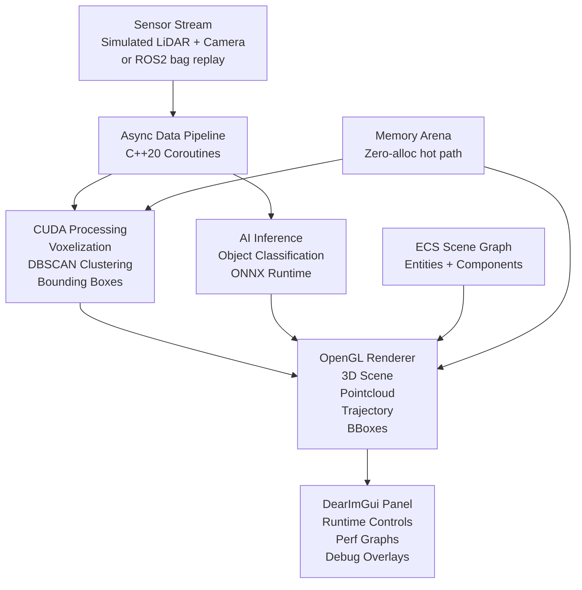
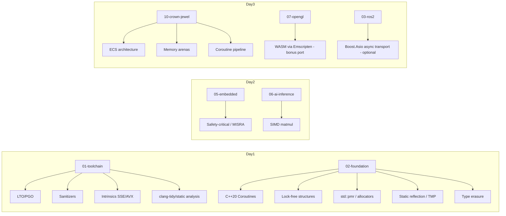

# C++ Senior Engineer Interview Roadmap — Design Spec

**Date:** 2026-05-04
**Duration:** 3 days, 8–10 hours/day (~27 hours total)
**Goal:** Rebuild active C++ mastery, produce 10 demonstrable projects across all major C++ domains, and be ready to discuss and live-code at senior (+5 year) level.

---

## Context

- **Starting level:** Solid C++ foundation (classes, STL, RAII, basic templates) but rusty — not used professionally recently.
- **Interview format:** Live coding + system design + project walkthrough discussion.
- **Domains required:** Compiler toolchain, language core, ROS2, CUDA, Embedded/RTOS, AI/ML inference, OpenGL, Qt, DearImGui.
- **New fields to include:** C++20 coroutines, lock-free structures, ECS, `std::pmr`/custom allocators, WASM/Emscripten (bonus), high-perf networking (Boost.Asio — in `03-ros2` as optional async transport layer), safety-critical patterns, static reflection/TMP, PGO/LTO, compiler intrinsics.
- **Compiler requirements:** C++20 needs GCC 10+/Clang 12+. C++23 features (`std::expected`, `std::generator`, `std::print`) need GCC 12+/Clang 16+. All projects target C++23 by default with graceful fallback noted per feature.

---

## Workspace Structure

```
/home/zaki/workspaces/cpp/
│
├── docs/
│   ├── superpowers/specs/          # This file and future specs
│   ├── roadmap.md                  # Master roadmap with daily schedule
│   ├── concepts/                   # One .md per topic cluster
│   └── cheatsheets/                # Quick-reference markdown files
│
├── projects/
│   ├── 01-toolchain/               # Day 1 — CMake + compiler toolchain mastery
│   ├── 02-foundation/              # Day 1 — Rich C++ language features showcase
│   ├── 03-ros2/                    # Day 2 — ROS2 robotics system
│   ├── 04-cuda/                    # Day 2 — CUDA parallel compute engine
│   ├── 05-embedded/                # Day 2 — Embedded/RTOS simulator
│   ├── 06-ai-inference/            # Day 2 — C++ AI/ML inference pipeline
│   ├── 07-opengl/                  # Day 3 — Mini 3D renderer
│   ├── 08-qt/                      # Day 3 — System monitor dashboard
│   ├── 09-imgui/                   # Day 3 — Developer debug tools panel
│   └── 10-crown-jewel/             # Day 3 — Real-time sensor fusion visualizer
│
├── cmake/
│   └── modules/                    # Shared CMake helpers, toolchain files
│
└── scripts/
    └── setup.sh                    # One-shot environment bootstrap
```

Each `projects/XX-name/` is an independent CMake project with:
- Its own `CMakeLists.txt` using modern target-based CMake
- A `README.md` explaining what it demonstrates and why
- GoogleTest unit tests
- A `CMakePresets.json` (or inherits from root)

---

## Day 1 — Core Mastery (~9 hours)

```mermaid
gantt
    title Day 1 — Foundation Sprint
    dateFormat HH:mm
    axisFormat %H:%M
    section 01-toolchain
    CMake presets, sanitizers, flags         :09:00, 90m
    Cross-compilation, LTO/PGO, intrinsics   :10:30, 60m
    clang-tidy, static analysis, ASM output  :11:30, 60m
    section 02-foundation
    Memory: RAII, smart ptrs, allocators, pmr :13:00, 90m
    OOP: Rule of 0/3/5, move semantics, CRTP  :14:30, 90m
    Templates: variadic, TMP, SFINAE, concepts :16:00, 90m
    Rich types, patterns, concurrency, C++20/23 :17:30, 90m
```

### Project: `01-toolchain/` — CMake Toolchain Mastery

**Purpose:** Demonstrate deep knowledge of the C++ build and tooling ecosystem — a differentiator most candidates cannot speak to.

**What it covers:**

| Area | Details |
|---|---|
| CMake Presets | `CMakePresets.json` with debug / release / asan / tsan / ubsan / msan / coverage / cross-arm presets |
| Compiler Flags | `-O0` → `-O3` → `-Os`, `-march=native`, `-mtune`, `-ffast-math`, `-fno-exceptions`, `-fno-rtti` |
| Sanitizers | ASan (memory errors), TSan (data races), UBSan (undefined behavior), MSan (uninitialized reads) — each as a CMake preset + runner script |
| LTO | Full LTO (`-flto`) and thin LTO (`-flto=thin`) with link flags |
| PGO | Profile-generate → workload run → profile-use workflow scripted end-to-end |
| Cross-compilation | ARM Linux toolchain file (`arm-linux-gnueabihf`), bare-metal ARM (`arm-none-eabi`) |
| Compiler Intrinsics | SSE4.2 / AVX2 dot-product example with CPUID dispatch |
| Static Analysis | `clang-tidy` with `.clang-tidy` config, `cppcheck`, `include-what-you-use` as CMake targets |
| Assembly Output | CMake custom target to emit `-S` assembly and `-emit-llvm` IR for inspection |
| Build acceleration | Unity builds (`CMAKE_UNITY_BUILD`), precompiled headers (`target_precompile_headers`) |
| Testing | CTest integration with GoogleTest, code coverage report via `lcov`/`gcovr` |

**Interview talking points this unlocks:**
- "How do you find memory bugs before production?" → ASan/TSan/MSan workflow
- "How do you optimize a hot path?" → PGO + LTO + intrinsics
- "How do you ship to an embedded target?" → cross-compilation toolchain files
- "How do you maintain code quality?" → clang-tidy + cppcheck as CI gates

---

### Project: `02-foundation/` — C++ Language Showcase Library

**Purpose:** A single CMake project organized into thematic modules, each implemented as a small library + demo executable. Covers the full breadth of modern C++ from C++11 through C++23.

**Structure:**

```
02-foundation/
├── CMakeLists.txt
├── CMakePresets.json
├── include/
│   └── foundation/
│       ├── memory/
│       ├── oop/
│       ├── templates/
│       ├── types/
│       ├── patterns/
│       └── concurrency/
├── src/
│   └── (implementations)
├── demos/
│   └── (one executable per module)
└── tests/
```

**Concept clusters:**

#### C++ Standards Timeline

| Standard | Key Features Demonstrated |
|---|---|
| C++11 | `auto`, range-for, lambdas, rvalue refs, move semantics, `unique_ptr`/`shared_ptr`, `nullptr`, `constexpr`, initializer lists, variadic templates, `std::thread`, `std::chrono`, `std::array`, `std::unordered_map`, `emplace_back` |
| C++14 | Generic lambdas (`auto` params), `auto` return type deduction, `std::make_unique`, variable templates, binary literals |
| C++17 | Structured bindings, `if constexpr`, `std::optional`, `std::variant`, `std::string_view`, fold expressions, CTAD, parallel algorithms (`std::execution`), `std::filesystem`, `std::any`, `std::invoke`, `std::apply` |
| C++20 | Concepts + requires expressions, ranges + views, coroutines (`co_await`/`co_yield`/`co_return`), modules (basic), `std::span`, `std::format`, three-way comparison (`<=>`), designated initializers, `consteval`/`constinit`, `std::jthread`/`stop_token`, `std::bit_cast` |
| C++23 | `std::expected`, `std::flat_map`/`flat_set`, `std::print`/`println`, deducing `this`, `std::stacktrace`, `std::generator` |

#### Memory Management

- Stack vs heap, stack unwinding through destructors
- RAII principle: `ResourceGuard<F>` generic RAII wrapper
- Smart pointers: `unique_ptr` with custom deleters, `shared_ptr`/`weak_ptr` with cycle detection, intrusive ref-count pattern
- Custom allocators: stack allocator, pool allocator, arena allocator
- Placement new and aligned storage (`alignas`/`alignof`)
- `std::pmr`: `monotonic_buffer_resource`, `unsynchronized_pool_resource`, custom `memory_resource`
- `std::atomic` with all memory orders (`seq_cst`, `acquire`/`release`, `relaxed`, `consume`) — with correctness demonstrations

#### OOP and Class Design

- Rule of Zero — preferred default
- Rule of Three — pre-C++11 style, why it breaks with moves
- Rule of Five — correct modern C++ resource management
- Copy vs move: deep copy cost, move as O(1) transfer of ownership
- `virtual` dispatch internals: vtable layout, vptr overhead, devirtualization
- Non-virtual interface (NVI) idiom
- Virtual inheritance and the diamond problem — `virtual` base classes
- CRTP for zero-cost static polymorphism and mixin composition

#### Templates

- Function, class, and variable templates
- Full and partial specialization
- Variadic templates: recursive vs fold-expression based
- Template metaprogramming: compile-time type lists, `type_traits` from scratch
- SFINAE with `enable_if` and `void_t`
- C++20 Concepts: `concept` keyword, `requires` clauses, abbreviated function templates
- Policy-based design (Alexandrescu): pluggable behaviors via template parameters
- Expression templates: lazy evaluation of arithmetic expressions (no temporaries)

#### Rich Types

- Strong typedefs: `StrongType<T, Tag>` via CRTP — prevents `int` aliasing errors
- Phantom types for compile-time state machines
- `std::variant` + `std::visit` — exhaustive pattern matching alternative
- `std::optional` and `std::expected` (C++23) — monadic error handling
- User-defined literals (`operator""_km`, `operator""_ms`)
- Full operator overloading: arithmetic, comparison (`<=>`), stream, subscript, function call
- Explicit conversion operators and `explicit` constructors

#### Design Patterns (C++ flavored)

| Pattern | C++ Implementation |
|---|---|
| RAII ScopeGuard | Generic `defer`/`ScopeExit` for arbitrary cleanup |
| PIMPL | ABI-stable interface + implementation separation |
| Type Erasure | `std::function`-like type: virtual concept pattern |
| Observer | `std::function`-based event system, thread-safe variant |
| Factory + Registry | Self-registering factory with `static` initializers |
| Builder | Fluent builder with method chaining |
| Strategy | Compile-time (template) vs runtime (virtual) variants |
| Command | `std::function` + coroutine-based undo/redo |
| CRTP Decorator | Mixin composition without virtual overhead |

#### Concurrency

- `std::thread`, `std::jthread` with `stop_token` (C++20)
- `std::mutex`, `std::condition_variable`, `std::shared_mutex` (readers-writer lock)
- `std::atomic<T>` with memory order deep-dive — correct vs broken examples
- Lock-free SPSC queue (single producer, single consumer) using atomics
- `std::async`, `std::future`, `std::promise`, `std::packaged_task`
- C++20 coroutine task type: `Task<T>` with `co_await`, `co_return`
- Thread pool: work-stealing queue, graceful shutdown
- `std::counting_semaphore`, `std::latch`, `std::barrier` (C++20)

#### Architecture and Idioms

- Header-only library design
- C++20 modules: converting a header-only lib to a module
- Dependency injection: constructor injection, service locator (and its pitfalls)
- Compile-time vs runtime polymorphism: when to choose each

---

## Day 2 — Systems Sprint (~9 hours)

```mermaid
gantt
    title Day 2 — Systems Sprint
    dateFormat HH:mm
    axisFormat %H:%M
    section 03-ros2
    Lifecycle nodes, components, params       :09:00, 90m
    Custom msgs/srvs/actions, TF2, executor   :10:30, 60m
    section 04-cuda
    Memory model, thread hierarchy, coalescing :12:00, 90m
    Thrust, streams, unified memory, profiling :13:30, 60m
    section 05-embedded
    RTOS scheduler sim, memory pools, ISR sim  :15:00, 90m
    HSM, ring buffer, fixed-point, MISRA       :16:30, 60m
    section 06-ai-inference
    ONNX/LibTorch C++ API, pipeline, SIMD      :17:30, 90m
```



### Project: `03-ros2/` — Autonomous Navigation Stack

**What it demonstrates:** Production-grade ROS2 architecture — the kind of thing used in real robot deployments.

| Feature | Details |
|---|---|
| Lifecycle nodes | `rclcpp_lifecycle` with managed state transitions |
| Component architecture | `rclcpp::Node` as composable components, `ComponentManager` |
| Custom interfaces | `.msg`, `.srv`, `.action` definitions and generation |
| Parameter system | Typed parameters, runtime reconfiguration, parameter callbacks |
| QoS policies | Reliable vs best-effort, transient local, deadline |
| TF2 | Broadcasting and listening to transforms, `tf2_geometry_msgs` |
| Action server/client | Long-running tasks with feedback and cancellation |
| Executor | Custom executor for real-time constraints, `MultiThreadedExecutor` |
| Launch system | Python launch files with arguments and conditions |
| Bag integration | Recording and playback for deterministic testing |
| Boost.Asio (optional) | Async transport layer replacing DDS for custom low-latency comms — demonstrates `io_context`, coroutine-based async ops, strand executor |
| C++ style | Modern C++17/20 throughout: structured bindings, `std::expected`, concepts for message type constraints |

---

### Project: `04-cuda/` — Parallel Compute Engine

**What it demonstrates:** GPU programming at a level beyond "hello CUDA" — memory hierarchy, occupancy, and async pipelines.

| Feature | Details |
|---|---|
| Memory model | Global, shared, constant, texture memory — with benchmark showing speedup |
| Thread hierarchy | Thread/warp/block/grid design — occupancy calculator |
| Memory coalescing | Coalesced vs strided access benchmark |
| Bank conflicts | Shared memory bank conflict demonstration and fix |
| Thrust | `thrust::device_vector`, algorithms, custom functors |
| cuBLAS | SGEMM, batched operations |
| Streams + events | Async kernel launch, H2D/D2H overlap, event timing |
| Unified memory | `cudaMallocManaged`, prefetch hints, migration tracking |
| Error handling | `CUDA_CHECK` macro pattern, error propagation |
| Profiling | `nvtxRangePush/Pop` annotations, nsight systems markers |

---

### Project: `05-embedded/` — RTOS Task Scheduler Simulator

**What it demonstrates:** Embedded systems thinking — determinism, zero-allocation hot paths, ISR safety — all in pure C++ without actual hardware.

| Feature | Details |
|---|---|
| Scheduler | Cooperative + preemptive priority scheduler (FreeRTOS-style) |
| Memory pools | Static memory pool — no `new`/`delete` in tasks |
| ISR simulation | `volatile` + `std::atomic` ISR-safe flag pattern |
| Ring buffer | Lock-free interrupt-safe SPSC ring buffer |
| HSM | Hierarchical state machine with entry/exit/transition actions |
| Bit manipulation | `BitField<T, offset, width>` CRTP helper |
| Fixed-point | `Fixed<int32_t, 16>` arithmetic class |
| MMIO simulation | Memory-mapped register abstraction (`Register<addr, mask>`) |
| MISRA patterns | No dynamic allocation, no recursion, bounded loops, explicit casts |
| Timing | `std::chrono`-based tick simulation with deadline monitoring |

---

### Project: `06-ai-inference/` — Tensor Inference Engine

**What it demonstrates:** C++ in the AI/ML domain — not Python wrapping, but actual C++ inference pipelines.

| Feature | Details |
|---|---|
| ONNX Runtime | C++ API: session creation, input/output tensor binding, execution providers |
| LibTorch | `torch::jit::load`, tensor operations, CUDA device placement |
| Custom Tensor | `Tensor<T, Dims...>` with expression templates — no temporaries in arithmetic |
| SIMD matmul | AVX2-optimized matrix multiplication with scalar fallback |
| Pipeline | `PreProcessor` → `InferenceEngine` → `PostProcessor` with pluggable backends |
| Memory | Pre-allocated inference buffers, zero-copy where possible |
| Batching | Dynamic batching with memory reuse across frames |
| Benchmarking | `std::chrono` + statistical aggregation (p50/p95/p99 latency) |
| Error handling | `std::expected<T, InferenceError>` throughout |

---

## Day 3 — Visual/UI Sprint + Crown Jewel (~9 hours)

```mermaid
gantt
    title Day 3 — Visual Sprint + Crown Jewel
    dateFormat HH:mm
    axisFormat %H:%M
    section Visual Domains
    07-opengl: VAO/VBO, shaders, lighting, FBO :09:00, 90m
    08-qt: MVC, signals/slots, QML, threading  :10:30, 90m
    09-imgui: docking, ImPlot, ImNodes         :12:00, 90m
    section Crown Jewel
    Architecture scaffold + ECS               :13:30, 60m
    CUDA pipeline + OpenGL renderer           :14:30, 90m
    ImGui panel + coroutine data flow         :16:00, 90m
    Polish, README, demo                      :17:30, 60m
```

### Project: `07-opengl/` — Mini 3D Renderer

**What it demonstrates:** Modern OpenGL — not legacy `glBegin/glEnd`, but a real render pipeline.

| Feature | Details |
|---|---|
| Core profile | OpenGL 4.6 core profile — no deprecated features |
| Buffers | VAO, VBO, EBO — correct binding and layout specification |
| Shaders | GLSL vertex + fragment, shader program manager (compile, link, cache) |
| Textures | 2D texture loading (stb_image), mipmaps, sampler objects |
| Math | `glm` for transforms, view/projection matrices |
| Camera | Orbit camera + FPS camera, mouse/keyboard input via GLFW |
| Lighting | Phong model: ambient + diffuse + specular, multiple point lights |
| Shadows | Basic shadow mapping with depth FBO |
| FBO | Off-screen rendering, post-processing pass |
| Debug | `glDebugMessageCallback` for driver-level error reporting |
| Resource manager | RAII wrappers for GL objects (`GLTexture`, `GLShader`, `GLVAO`) |

---

### Project: `08-qt/` — System Monitor Dashboard

**What it demonstrates:** Qt6 with modern C++ — model/view, QML, multithreading, plugins.

| Feature | Details |
|---|---|
| Qt6 + CMake | `find_package(Qt6)`, `qt_add_executable`, `qt_add_qml_module` |
| Model/View | `QAbstractItemModel` subclass for custom tree/list data |
| Signals/slots | New pointer-to-member syntax, lambda connections |
| QML | `QtQuick` UI with C++ backend models exposed via `QML_ELEMENT` |
| Custom painting | `QWidget::paintEvent` + `QPainter` for custom charts |
| Threading | `QThread` worker, `QtConcurrent::run`, thread-safe signal emission |
| Networking | `QNetworkAccessManager` for REST API calls, JSON parsing |
| Settings | `QSettings` for persistence, portable across platforms |
| Plugins | `QPluginLoader` for runtime-loaded display modules |
| Testing | `QTest` framework with `QCOMPARE`/`QVERIFY` |

---

### Project: `09-imgui/` — Developer Debug Tools Panel

**What it demonstrates:** DearImGui — the standard for in-app developer tooling in games, robotics, and simulations.

| Feature | Details |
|---|---|
| Integration | SDL2 + OpenGL backend, `imgui_impl_sdl2`, `imgui_impl_opengl3` |
| Docking | `ImGuiConfigFlags_DockingEnable`, persistent layout |
| Custom widgets | Composite widgets with `ImGui::PushID` scoping |
| ImPlot | Real-time scrolling plots, histograms, heatmaps |
| ImNodes | Node-based graph editor for pipeline visualization |
| Theming | Custom color scheme, font atlas with multiple fonts |
| Serialization | INI file persistence for window layout and settings |

---

### Project: `10-crown-jewel/` — Real-time Sensor Fusion Visualizer

**Purpose:** A complete, architecturally sophisticated system that integrates all previous work. This is the answer to *"tell me about the most complex C++ system you've built."*

**System overview:**



**Architecture decisions and what they demonstrate:**

| Decision | Why it shows seniority |
|---|---|
| ECS for scene objects | Understands data-oriented design, cache-friendly layouts, separation of data from behavior |
| C++20 coroutines for pipeline | Understands async without threads, backpressure, cooperative concurrency |
| `std::expected` for error paths | Understands monadic error handling, no exceptions in hot path |
| Memory arena for per-frame allocations | Understands allocation cost, fragmentation, deterministic latency |
| Concepts for typed interfaces | Understands zero-cost abstractions, compile-time correctness guarantees |
| CUDA/OpenGL interop (cudaGraphicsResource) | Understands GPU memory ownership, avoiding needless copies |

**Components:**

| Component | Responsibility |
|---|---|
| `SensorSource` | Abstract interface (concept-based) for LiDAR + camera data; implementations: file replay, simulated, ROS2 bag |
| `DataPipeline` | C++20/23 coroutine-based async pipeline using `std::generator` for sensor frame generation, `co_await` for CUDA/inference stages: source → CUDA → inference → renderer |
| `CudaProcessor` | Voxelization, DBSCAN clustering, bounding box extraction on GPU |
| `SceneRenderer` | OpenGL renderer consuming ECS scene; CUDA/GL interop for pointcloud VBO |
| `InferenceEngine` | ONNX Runtime object classifier on camera frames |
| `DebugPanel` | DearImGui panel: play/pause, sensor selection, perf graphs, cluster visualization toggle |
| `ECSWorld` | Entity-Component-System: `Entity` IDs, typed component pools, systems |
| `FrameArena` | Per-frame memory arena: reset every frame, zero fragmentation, O(1) alloc |
| `AppConfig` | Typed configuration via `std::expected`-returning loaders |

---

## New Fields Coverage Map



---

## Concept-to-Interview-Question Mapping

| Interview Question | Project(s) to Reference |
|---|---|
| "Explain RAII and why it matters" | `02-foundation` memory module |
| "What's the difference between `shared_ptr` and `unique_ptr`?" | `02-foundation` memory module |
| "How do you avoid data races?" | `02-foundation` concurrency + TSan from `01-toolchain` |
| "Explain move semantics" | `02-foundation` OOP module |
| "What are C++20 concepts and when do you use them?" | `02-foundation` templates + `10-crown-jewel` |
| "How do you write a lock-free data structure?" | `02-foundation` lock-free queue + `05-embedded` ring buffer |
| "How do you optimize GPU memory access?" | `04-cuda` coalescing benchmark |
| "What's an ECS and why use it over OOP?" | `10-crown-jewel` |
| "How do you debug memory corruption?" | `01-toolchain` ASan workflow |
| "Explain your CMake setup" | `01-toolchain` presets |
| "How do you ship to an embedded target?" | `01-toolchain` cross-compilation + `05-embedded` |
| "How do you handle errors without exceptions?" | `02-foundation` `std::expected` + `10-crown-jewel` |
| "Walk me through the most complex system you've built" | `10-crown-jewel` |
| "How do you profile and optimize a C++ application?" | `01-toolchain` PGO + `04-cuda` profiling |

---

## Success Criteria

By end of Day 3:
- [ ] 10 independent projects built and runnable
- [ ] Every project has a `README.md` explaining what it demonstrates and why
- [ ] Can explain every architectural decision in `10-crown-jewel` from first principles
- [ ] Can reproduce core demos from `02-foundation` live under pressure
- [ ] Can discuss trade-offs (virtual vs CRTP, `shared_ptr` vs arena, exceptions vs `expected`) without hesitation
- [ ] `01-toolchain` presets work: asan build catches injected bug, tsan catches injected race
