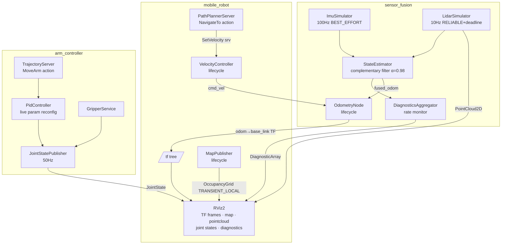

# 03-ros2: Comprehensive ROS2 Showcase Design

## Goal

Build a fully runnable multi-package ROS2 Humble workspace demonstrating production-grade ROS2 architecture across three robotics subsystems: mobile robot navigation, sensor fusion, and robot arm control. Runs inside Docker Compose with RViz2 visualization via X11 forwarding from WSL2.

## Architecture

Single ROS2 colcon workspace with four packages. `custom_interfaces` is built first and depended upon by the three subsystem packages. All packages run in a shared Docker network so ROS2 DDS discovery works across containers. RViz2 runs in a dedicated container with X11 socket mounted from the WSL2 host.

## Tech Stack

- **ROS2 Humble Hawksbill** (Ubuntu 22.04 base)
- **Docker + Docker Compose** (host source volume-mounted into container)
- **colcon** build system
- **C++17** throughout (Humble's minimum; no C++20 features to avoid rclcpp compatibility issues)
- **GoogleTest** for unit tests, `launch_testing` for integration tests
- **RViz2** for visualization (X11 forwarding)

---

## Repository Layout

```
projects/03-ros2/
├── docker/
│   ├── Dockerfile              # ros:humble-ros-base + colcon + RViz2 + X11 libs
│   └── entrypoint.sh           # source Humble setup, source workspace if built
├── docker-compose.yml          # dev + rviz2 services
├── ros2_ws/
│   └── src/
│       ├── custom_interfaces/  # .msg .srv .action — no node code
│       ├── mobile_robot/       # lifecycle nodes, TF2, A* path planner action server
│       ├── sensor_fusion/      # multi-threaded executor, QoS, state estimator
│       └── arm_controller/     # composable components, parameter PID, gripper svc
├── docs/
│   ├── docker-setup.md
│   ├── ros2-architecture.md
│   ├── lifecycle-nodes.md
│   ├── custom-interfaces.md
│   ├── executors-qos.md
│   ├── tf2-and-navigation.md
│   └── components-params.md
└── README.md
```

---

## Docker Environment

### `docker/Dockerfile`

```
FROM ros:humble-ros-base
RUN apt-get update && apt-get install -y \
    python3-colcon-common-extensions \
    ros-humble-rviz2 \
    ros-humble-rclcpp-components \
    ros-humble-tf2-ros \
    ros-humble-tf2-geometry-msgs \
    ros-humble-nav-msgs \
    ros-humble-sensor-msgs \
    ros-humble-diagnostic-msgs \
    ros-humble-launch-testing-ament-cmake \
    x11-apps \
    && rm -rf /var/lib/apt/lists/*
COPY docker/entrypoint.sh /entrypoint.sh
ENTRYPOINT ["/entrypoint.sh"]
```

### `docker-compose.yml`

Two services sharing a bridge network:

| Service | Purpose | X11 |
|---------|---------|-----|
| `dev` | Build + run all nodes; volume-mounts `ros2_ws/` | No |
| `rviz2` | RViz2 only | Yes — `DISPLAY`, `/tmp/.X11-unix` socket |

### Commands

```bash
# Build image
docker compose build

# Build ROS2 workspace
docker compose run --rm dev bash -c "cd /ros2_ws && colcon build --symlink-install"

# Run full demo
docker compose run --rm dev ros2 launch mobile_robot full_demo.launch.py

# Open RViz2 (separate terminal)
xhost +local:docker
docker compose run --rm rviz2
```

---

## Package 1: `custom_interfaces`

No node code — only interface definitions. Built first; all other packages depend on it.

### Messages

| File | Fields |
|------|--------|
| `msg/Odometry2D.msg` | `std_msgs/Header header`, `float64 x`, `float64 y`, `float64 theta`, `float64 vx`, `float64 vtheta` |
| `msg/ImuReading.msg` | `std_msgs/Header header`, `float64[3] linear_acceleration`, `float64[3] angular_velocity`, `float64[9] covariance` |
| `msg/PointCloud2D.msg` | `std_msgs/Header header`, `float64[] ranges`, `float64[] angles`, `uint32 num_points` |
| `msg/JointPoint.msg` | `float64[] positions`, `float64[] velocities`, `float64[] efforts`, `builtin_interfaces/Duration time_from_start` |
| `msg/JointTrajectoryCustom.msg` | `std_msgs/Header header`, `string[] joint_names`, `JointPoint[] points` |

### Services

| File | Request | Response |
|------|---------|---------|
| `srv/SetVelocity.srv` | `float64 linear`, `float64 angular` | `bool accepted`, `string reason` |
| `srv/GripperCommand.srv` | `float64 position`, `float64 max_force` | `bool success`, `float64 actual_position` |

### Actions

| File | Goal | Feedback | Result |
|------|------|---------|--------|
| `action/NavigateTo.action` | `float64 x`, `float64 y`, `float64 theta`, `float64 tolerance` | `float64 distance_remaining`, `float64 heading_error` | `bool reached`, `float64 final_error`, `string message` |
| `action/MoveArm.action` | `JointTrajectoryCustom trajectory` | `float64 progress`, `string current_joint` | `bool success`, `string message` |

### `CMakeLists.txt` key points
- `rosidl_generate_interfaces()` with all `.msg`, `.srv`, `.action` files
- `ament_export_dependencies(rosidl_default_runtime)`

---

## Package 2: `mobile_robot`

Demonstrates: lifecycle nodes, TF2 broadcasting, action server (A* path planner), service server, Python launch files.

### Nodes

#### `OdometryNode` — `rclcpp_lifecycle::LifecycleNode`

State machine: `Unconfigured → Inactive → Active → Finalized`

| Transition callback | Action |
|--------------------|--------|
| `on_configure` | Allocate publishers/subscribers, load parameters |
| `on_activate` | Start timer (50 Hz pose update), activate publishers |
| `on_deactivate` | Stop timer, deactivate publishers |
| `on_cleanup` | Release all resources |

Publishes:
- `custom_interfaces/Odometry2D` on `/odom`
- TF2 transform `odom → base_link` via `tf2_ros::TransformBroadcaster`

Subscribes:
- `geometry_msgs/Twist` on `/cmd_vel` — integrates velocity into pose

#### `VelocityController` — `rclcpp_lifecycle::LifecycleNode`

- Provides `SetVelocity` service server
- Publishes `geometry_msgs/Twist` to `/cmd_vel` at 20 Hz
- Parameters: `max_linear_vel` (default 1.0), `max_angular_vel` (default 1.5)

#### `MapPublisher` — `rclcpp_lifecycle::LifecycleNode`

- Loads a hardcoded 20×20 occupancy grid (walls around perimeter + obstacles)
- Publishes `nav_msgs/OccupancyGrid` on `/map` (latched — `TRANSIENT_LOCAL` QoS)
- Publishes TF2 static transform `map → odom`

#### `PathPlannerServer` — `rclcpp::Node`

Action server for `NavigateTo`:
- On goal: run A* on the occupancy grid from current pose to goal
- Feedback: publish `distance_remaining` every 500ms while robot moves
- On cancel: stop immediately, return partial result
- Sends velocity commands via `SetVelocity` service to `VelocityController`

### Launch files

| File | What it starts |
|------|---------------|
| `launch/mobile_robot.launch.py` | All 4 nodes with parameters; triggers lifecycle transitions |
| `launch/full_demo.launch.py` | All three subsystems + RViz2 config |

### Tests

| File | Tests |
|------|-------|
| `test/test_path_planner.cpp` | A* on 5×5 grid: reachable goal, blocked goal, diagonal path |
| `test/test_lifecycle.launch.py` | Configure → activate → deactivate state transitions |

---

## Package 3: `sensor_fusion`

Demonstrates: QoS policies, callback groups, multi-threaded executor, diagnostics.

### Nodes

#### `ImuSimulator` — `rclcpp::Node`

- Publishes `ImuReading` at 100 Hz
- QoS: `BEST_EFFORT`, depth 10 — models real IMU (lossy is acceptable)
- Simulates white noise on accelerometer (`σ = 0.01 m/s²`) and gyroscope (`σ = 0.001 rad/s`)
- Configurable via parameters: `noise_stddev_accel`, `noise_stddev_gyro`

#### `LidarSimulator` — `rclcpp::Node`

- Publishes `PointCloud2D` at 10 Hz with 360 rays
- QoS: `RELIABLE`, depth 5, `deadline(150ms)` — deadline violation triggers diagnostic warning
- Simulates a circular room with configurable obstacles

#### `StateEstimator` — `rclcpp::Node`

Fuses IMU angular velocity + odometry using a complementary filter:

```
theta_fused = alpha * (theta_gyro_integrated) + (1 - alpha) * theta_odom
```

- Two `MutuallyExclusiveCallbackGroup` (one per subscription) — shows callback group isolation
- Uses `MultiThreadedExecutor` in `main()`
- Publishes fused `Odometry2D` on `/fused_odom`
- Parameter: `alpha` (default 0.98) — configurable at runtime

#### `DiagnosticsAggregator` — `rclcpp::Node`

- Monitors actual publish rate of `/imu` and `/lidar` topics
- Publishes `diagnostic_msgs/DiagnosticArray` on `/diagnostics` at 1 Hz
- Status levels: OK (rate within 10%), WARN (rate within 50%), ERROR (rate below 50%)

### Tests

| File | Tests |
|------|-------|
| `test/test_state_estimator.cpp` | Filter convergence: pure gyro, pure odom, blended; alpha=0 and alpha=1 edge cases |
| `test/test_qos_compatibility.cpp` | BEST_EFFORT publisher + RELIABLE subscriber → no connection (expected) |

---

## Package 4: `arm_controller`

Demonstrates: composable components, parameter callbacks, action server with trajectory interpolation, service server.

### Components (loaded via `rclcpp_components`)

#### `JointStatePublisher` — component

- Publishes `sensor_msgs/JointState` for 6 joints at 50 Hz
- Joint names: `shoulder_pan`, `shoulder_lift`, `elbow`, `wrist_1`, `wrist_2`, `wrist_3`
- Internal state: current positions updated by `PidController`

#### `PidController` — component

- Subscribes to target joint positions
- Computes PID output per joint: `u = Kp*e + Ki*∫e + Kd*de/dt`
- Parameters declared: `kp`, `ki`, `kd` (per joint via parameter namespace)
- `OnSetParametersCallbackHandle` — live gain reconfiguration without restart:

```cpp
param_cb_ = add_on_set_parameters_callback(
    [this](const std::vector<rclcpp::Parameter>& params) {
        // validate and apply new gains
    });
```

#### `TrajectoryServer` — component

Action server for `MoveArm`:
- Accepts `JointTrajectoryCustom` goal
- Interpolates linearly between waypoints using wall-clock time
- Streams `progress` feedback (0.0 → 1.0)
- Supports preemption: new goal cancels current trajectory

#### `GripperService` — component

- Service server for `GripperCommand`
- Simulates spring-damper gripper model: position converges over ~200ms
- Returns `actual_position` after simulated settling

### `ArmComponentManager`

- `main()` creates a `rclcpp::executors::MultiThreadedExecutor`
- Loads all four components into the same process via `rclcpp_components::ComponentManager`
- Demonstrates intra-process communication (zero-copy within same process)

### Tests

| File | Tests |
|------|-------|
| `test/test_pid_controller.cpp` | Step response: proportional-only, integral windup prevention, derivative kick |
| `test/test_trajectory_server.cpp` | Linear interpolation accuracy, cancellation mid-trajectory |

---

## Data Flow



---

## RViz2 Configuration (`rviz/full_demo.rviz`)

| Display | Source |
|---------|--------|
| TF | `/tf` + `/tf_static` |
| Map | `/map` (`nav_msgs/OccupancyGrid`) |
| LaserScan (approximated) | `/lidar` (`PointCloud2D` → converted) |
| RobotModel | Inline URDF box approximation |
| JointState | `/joint_states` |
| DiagnosticStatus | `/diagnostics` |

---

## Testing Strategy

| Layer | Tool | What's tested |
|-------|------|--------------|
| Unit | GoogleTest | A*, complementary filter, PID math |
| Interface | GoogleTest | Custom message serialization |
| Integration | `launch_testing` | Lifecycle transitions, node graph connections |
| Manual | `ros2 topic echo`, RViz2 | End-to-end data flow |

---

## Interview Talking Points Coverage

| ROS2 Concept | Where demonstrated |
|-------------|-------------------|
| Lifecycle nodes | `OdometryNode`, `VelocityController`, `MapPublisher` |
| Custom interfaces (.msg/.srv/.action) | `custom_interfaces` package |
| Action server + feedback + cancellation | `PathPlannerServer`, `TrajectoryServer` |
| QoS policies (RELIABLE, BEST_EFFORT, deadline, TRANSIENT_LOCAL) | `sensor_fusion` nodes + `MapPublisher` |
| Callback groups + MultiThreadedExecutor | `StateEstimator`, `ArmComponentManager` |
| TF2 broadcasting + listening | `OdometryNode`, `MapPublisher` |
| Composable components + intra-process comms | All `arm_controller` nodes |
| Parameter callbacks + live reconfiguration | `PidController` |
| Launch system with arguments + conditions | `full_demo.launch.py` |
| Docker + colcon workspace | Project infrastructure |
