# CMake Setup — Toolchain Mastery

This project (`toolchain_mastery`) is a self-contained C++ showcase that demonstrates
production-grade CMake practices: preset-driven builds, shared reusable modules, sanitizer
integration, LTO/PGO, AVX2 intrinsics, cross-compilation toolchains, and code coverage.
Every concept appears in isolation so it can be studied or discussed in an interview.

---

## Table of Contents

1. [Project layout](#project-layout)
2. [CMakeLists.txt walkthrough](#cmakeliststxt-walkthrough)
3. [Shared CMake modules](#shared-cmake-modules)
4. [CMakePresets.json — every preset explained](#cmakepresetssjson--every-preset-explained)
5. [How to build each preset](#how-to-build-each-preset)
6. [Preset inheritance diagram](#preset-inheritance-diagram)

---

## Project layout

```
01-toolchain/
├── CMakeLists.txt          # project root
├── CMakePresets.json       # all named presets
├── src/
│   ├── asan_demo.cpp       # heap-use-after-free / leak / OOB demo
│   ├── tsan_demo.cpp       # data-race demo
│   ├── ubsan_demo.cpp      # signed-overflow / bad-shift demo
│   ├── intrinsics_demo.cpp # AVX2 SIMD demo
│   └── pgo_workload.cpp    # PGO training workload
├── tests/
│   └── test_basic.cpp      # GoogleTest suite
├── scripts/
│   ├── run-asan.sh
│   └── run-tsan.sh
├── toolchain/
│   ├── arm-linux-gnueabihf.cmake
│   └── arm-none-eabi.cmake
└── docs/
    ├── cmake-setup.md      # ← this file
    └── sanitizers.md
```

The shared CMake modules live at the workspace root:

```
cmake/modules/
├── CompilerWarnings.cmake
├── Sanitizers.cmake
├── StaticAnalyzers.cmake
├── Coverage.cmake
└── StandardVersion.cmake
```

---

## CMakeLists.txt walkthrough

### 1. Project declaration and module path

```cmake
cmake_minimum_required(VERSION 3.22)
project(toolchain_mastery VERSION 1.0.0 LANGUAGES CXX)

list(APPEND CMAKE_MODULE_PATH "${CMAKE_SOURCE_DIR}/../../cmake/modules")
```

CMake 3.22 is the minimum because that version introduced full `CMakePresets.json` v3
support (condition expressions, `buildPresets`, `testPresets`). The `CMAKE_MODULE_PATH`
append points two levels up to the shared `cmake/modules/` directory, making the
`include()` calls below work for every project in the workspace.

### 2. Shared module includes

```cmake
include(CompilerWarnings)
include(Sanitizers)
include(StaticAnalyzers)
include(Coverage)
include(StandardVersion)
```

These five `include()` calls load the function definitions from the shared modules. No
function is called here — the modules only register the functions; each target opts in
explicitly later.

### 3. Optional static analysis (controlled by cache variables)

```cmake
if(ENABLE_CLANG_TIDY)
  enable_clang_tidy()
endif()
if(ENABLE_CPPCHECK)
  enable_cppcheck()
endif()
```

`ENABLE_CLANG_TIDY` and `ENABLE_CPPCHECK` are off by default. The `clang-tidy` preset
flips `ENABLE_CLANG_TIDY=ON`. These checks run as part of the normal compile step via
CMake's `CMAKE_CXX_CLANG_TIDY` / `CMAKE_CXX_CPPCHECK` integration — no separate step
required.

### 4. FetchContent for GoogleTest

```cmake
include(FetchContent)
FetchContent_Declare(
  googletest
  GIT_REPOSITORY https://github.com/google/googletest.git
  GIT_TAG        v1.14.0
)
set(gtest_force_shared_crt ON CACHE BOOL "" FORCE)
FetchContent_MakeAvailable(googletest)
enable_testing()
include(GoogleTest)
```

`FetchContent_Declare` registers the dependency without downloading it yet.
`FetchContent_MakeAvailable` downloads (on first configure) and adds it as a subdirectory,
making `GTest::gtest_main` available as a link target. `gtest_force_shared_crt` is a
Windows guard that prevents CRT mismatch errors; it is a no-op on Linux. `enable_testing()`
activates CTest. `include(GoogleTest)` brings in `gtest_discover_tests()`.

### 5. Demo executables

Each demo target follows the same three-line pattern:

```cmake
add_executable(asan_demo src/asan_demo.cpp)
require_cpp20(asan_demo)
target_apply_sanitizers(asan_demo)
```

| Target | Source | Sanitizers applied | Notes |
|---|---|---|---|
| `asan_demo` | `src/asan_demo.cpp` | From preset | Heap UAF / leak / OOB |
| `tsan_demo` | `src/tsan_demo.cpp` | From preset | Data race |
| `ubsan_demo` | `src/ubsan_demo.cpp` | From preset | Signed overflow / bad shift |
| `intrinsics_demo` | `src/intrinsics_demo.cpp` | None | `-march=native` for AVX2 |
| `pgo_workload` | `src/pgo_workload.cpp` | None | PGO training binary |

The `intrinsics_demo` target adds `-march=native` directly so the compiler can emit AVX2
instructions when the CPU supports them. This is intentionally not routed through
`target_apply_sanitizers` because sanitizer instrumentation and aggressive vectorisation
interact poorly.

### 6. Assembly / LLVM IR custom target

```cmake
add_custom_target(asm_output
  COMMAND ${CMAKE_CXX_COMPILER} -std=c++20 -O2 -S
          ${CMAKE_SOURCE_DIR}/src/pgo_workload.cpp
          -o ${CMAKE_BINARY_DIR}/pgo_workload.s
  COMMENT "Generating assembly output"
)
```

This is a custom (not built by default) target. Build it explicitly:

```bash
cmake --build build/debug --target asm_output
```

The `-S` flag tells the compiler to stop after assembly generation and emit a `.s` file
rather than an object file. Useful for studying how the compiler lowers C++ to machine
instructions.

### 7. Test executable

```cmake
add_executable(toolchain_tests tests/test_basic.cpp)
require_cpp20(toolchain_tests)
target_apply_sanitizers(toolchain_tests)
target_apply_coverage(toolchain_tests)
target_link_libraries(toolchain_tests PRIVATE GTest::gtest_main)
gtest_discover_tests(toolchain_tests)

add_coverage_target()
```

`toolchain_tests` is the only target that calls both `target_apply_sanitizers` and
`target_apply_coverage`. When the `coverage` preset is active, `--coverage` is added to
compile and link flags. `gtest_discover_tests` runs the test binary at configure time (or
post-build with CMake 3.18+) to enumerate individual test cases so CTest can report
pass/fail per test, not just per binary.

---

## Shared CMake modules

All modules live in `/home/zaki/workspaces/cpp/cmake/modules/`.

### `StandardVersion.cmake`

Provides two functions for enforcing a C++ standard without GNU extensions:

#### `require_cpp20(target)`

```cmake
function(require_cpp20 target)
  get_target_property(_type ${target} TYPE)
  if(_type STREQUAL "INTERFACE_LIBRARY")
    target_compile_features(${target} INTERFACE cxx_std_20)
  else()
    target_compile_features(${target} PRIVATE cxx_std_20)
    set_target_properties(${target} PROPERTIES CXX_EXTENSIONS OFF)
  endif()
endfunction()
```

Uses `target_compile_features` rather than `CMAKE_CXX_STANDARD` so the requirement
propagates correctly through the CMake target graph. `CXX_EXTENSIONS OFF` translates to
`-std=c++20` (not `-std=gnu++20`), enforcing strict ISO conformance. The `INTERFACE_LIBRARY`
branch handles header-only targets where `PRIVATE` would be a CMake error.

#### `require_cpp23(target)`

Identical pattern for C++23. Does not need the `INTERFACE_LIBRARY` guard because no
interface targets in this workspace require C++23 yet.

### `CompilerWarnings.cmake`

#### `target_apply_warnings(target)`

```cmake
function(target_apply_warnings target)
  if(MSVC)
    target_compile_options(${target} PRIVATE /W4 /WX)
  else()
    target_compile_options(${target} PRIVATE
      -Wall -Wextra -Wpedantic -Werror
      -Wshadow -Wnon-virtual-dtor -Wold-style-cast
      -Wcast-align -Wunused -Woverloaded-virtual
      -Wconversion -Wsign-conversion -Wnull-dereference
      -Wdouble-promotion -Wformat=2
    )
  endif()
endfunction()
```

The GCC/Clang flag set goes well beyond `-Wall`:

| Flag | What it catches |
|---|---|
| `-Wall -Wextra -Wpedantic` | Standard baseline + extensions |
| `-Werror` | All warnings are errors — CI stays clean |
| `-Wshadow` | Local variable hiding outer scope |
| `-Wnon-virtual-dtor` | Base class with non-virtual destructor |
| `-Wold-style-cast` | C-style casts in C++ code |
| `-Wcast-align` | Pointer casts that increase alignment requirement |
| `-Wconversion -Wsign-conversion` | Implicit narrowing / signed↔unsigned |
| `-Wnull-dereference` | Statically detectable null deref |
| `-Wdouble-promotion` | `float` implicitly promoted to `double` |
| `-Wformat=2` | `printf`-family format string mismatches |

MSVC receives `/W4` (the highest practical level) and `/WX` (warnings-as-errors).

### `Sanitizers.cmake`

#### `target_apply_sanitizers(target)`

```cmake
function(target_apply_sanitizers target)
  set(sanitizers "")
  if(ENABLE_SANITIZER_ADDRESS)   list(APPEND sanitizers "address")   endif()
  if(ENABLE_SANITIZER_THREAD)    list(APPEND sanitizers "thread")    endif()
  if(ENABLE_SANITIZER_UNDEFINED) list(APPEND sanitizers "undefined") endif()
  if(ENABLE_SANITIZER_MEMORY)    list(APPEND sanitizers "memory")    endif()
  if(ENABLE_SANITIZER_LEAK)      list(APPEND sanitizers "leak")      endif()

  if(sanitizers)
    list(JOIN sanitizers "," sanitizer_flags)
    target_compile_options(${target} PRIVATE -fsanitize=${sanitizer_flags} -fno-omit-frame-pointer -g)
    target_link_options(${target} PRIVATE -fsanitize=${sanitizer_flags})
  endif()
endfunction()
```

The function reads the five `ENABLE_SANITIZER_*` cache variables set by presets, builds a
comma-separated list, and applies `-fsanitize=<list>` to both compile and link steps.
`-fno-omit-frame-pointer` keeps frame pointers so the sanitizer runtime can produce
complete stack traces. `-g` ensures debug symbols are present even in Release-mode
sanitizer builds. If no sanitizer variable is ON, the function is a no-op.

### `StaticAnalyzers.cmake`

#### `enable_clang_tidy()`

Finds `clang-tidy` on `PATH` and sets `CMAKE_CXX_CLANG_TIDY`, which makes CMake run the
tool on every translation unit as a side-effect of compilation. If the binary is not found,
a warning is emitted and the build proceeds without analysis. `--extra-arg=-Wno-unknown-warning-option`
prevents clang-tidy from rejecting GCC-only warning flags in the compile database.

#### `enable_cppcheck()`

Same pattern for `cppcheck`. The flags `--suppress=missingInclude --enable=all
--error-exitcode=1` enable all checks, suppress the common false-positive about missing
system headers, and make cppcheck failures fail the build.

### `Coverage.cmake`

#### `target_apply_coverage(target)`

Conditionally adds `--coverage -O0 -g` to compile flags and `--coverage` to link flags
when `ENABLE_COVERAGE=ON`. `-O0` disables optimisation so coverage lines map 1:1 to
source. The `--coverage` flag is GCC's shorthand for `-fprofile-arcs -ftest-coverage`.

#### `add_coverage_target()`

Creates a custom build target named `coverage` that:
1. Runs `lcov --capture` to collect `.gcda` counters into `coverage.info`
2. Strips system headers and test scaffolding from the report
3. Runs `genhtml` to produce an HTML report in `coverage_report/`

Only added when `ENABLE_COVERAGE=ON` and both `lcov` and `genhtml` are on `PATH`.

---

## CMakePresets.json — every preset explained

### Hidden base preset

```json
{
  "name": "base",
  "hidden": true,
  "generator": "Unix Makefiles",
  "binaryDir": "${sourceDir}/build/${presetName}",
  "cacheVariables": {
    "CMAKE_EXPORT_COMPILE_COMMANDS": "ON"
  }
}
```

All configure presets inherit from `base`. It fixes the generator to `Unix Makefiles` and
places each build tree under `build/<preset-name>/` so presets never overwrite each other.
`CMAKE_EXPORT_COMPILE_COMMANDS=ON` writes `compile_commands.json` in the build directory —
required by clang-tidy, clangd, and most IDE language servers.

---

### `debug`

```json
{ "name": "debug", "inherits": "base",
  "cacheVariables": { "CMAKE_BUILD_TYPE": "Debug" } }
```

**When to use:** Day-to-day development, GDB/LLDB debugging, running tests without
sanitizer overhead. Adds `-g` and disables optimisation by default (GCC/Clang Debug
defaults). No LTO, no sanitizers.

---

### `release`

```json
{ "name": "release", "inherits": "base",
  "cacheVariables": {
    "CMAKE_BUILD_TYPE": "Release",
    "CMAKE_INTERPROCEDURAL_OPTIMIZATION": "TRUE"
  } }
```

**When to use:** Benchmarking, performance measurement, final shipping builds.
`CMAKE_INTERPROCEDURAL_OPTIMIZATION=TRUE` enables Link-Time Optimisation (LTO) on all
targets via `-flto`. CMake handles the correct flags per compiler automatically.

---

### `asan`

```json
{ "name": "asan", "inherits": "base",
  "cacheVariables": {
    "CMAKE_BUILD_TYPE": "Debug",
    "ENABLE_SANITIZER_ADDRESS": "ON",
    "ENABLE_SANITIZER_LEAK": "ON"
  } }
```

**When to use:** Hunting heap-use-after-free, out-of-bounds reads/writes, stack buffer
overflows, and memory leaks. Enables both ASan and LSan (Leak Sanitizer, which ships as
part of ASan on Linux). Runtime overhead is approximately 2x.

---

### `tsan`

```json
{ "name": "tsan", "inherits": "base",
  "cacheVariables": {
    "CMAKE_BUILD_TYPE": "Debug",
    "ENABLE_SANITIZER_THREAD": "ON"
  } }
```

**When to use:** Detecting data races in multi-threaded code. Runtime overhead is roughly
5–10x and memory overhead is 5–10x. Cannot be combined with ASan. **WSL2 caveat:** TSan
requires kernel support for the `ASLR` virtual memory layout it uses; the WSL2 kernel
disables this. See `sanitizers.md` for details.

---

### `ubsan`

```json
{ "name": "ubsan", "inherits": "base",
  "cacheVariables": {
    "CMAKE_BUILD_TYPE": "Debug",
    "ENABLE_SANITIZER_UNDEFINED": "ON"
  } }
```

**When to use:** Catching C++ undefined behaviour: signed integer overflow, invalid shifts,
null pointer dereference through a reference, misaligned pointers, out-of-bounds array
indexing on stack arrays, and more. Very low overhead (typically < 1.5x). Safe to run in CI
on every commit.

---

### `msan`

```json
{ "name": "msan", "inherits": "base",
  "cacheVariables": {
    "CMAKE_BUILD_TYPE": "Debug",
    "CMAKE_C_COMPILER": "clang",
    "CMAKE_CXX_COMPILER": "clang++",
    "ENABLE_SANITIZER_MEMORY": "ON"
  } }
```

**When to use:** Detecting reads from uninitialised memory — something neither ASan nor
UBSan reliably catches. Clang-only; GCC does not implement MSan. Requires that all
dependencies (including libc++) are also instrumented, which typically means building with
a custom libc++ from source. Runtime overhead is approximately 3x.

---

### `coverage`

```json
{ "name": "coverage", "inherits": "base",
  "cacheVariables": {
    "CMAKE_BUILD_TYPE": "Debug",
    "ENABLE_COVERAGE": "ON"
  } }
```

**When to use:** Measuring line and branch coverage before a PR or code review. Produces
`.gcda`/`.gcno` files consumed by `lcov`. After building and running tests, call the
`coverage` custom target to generate the HTML report.

---

### `clang-tidy`

```json
{ "name": "clang-tidy", "inherits": "debug",
  "cacheVariables": {
    "CMAKE_BUILD_TYPE": "Debug",
    "CMAKE_C_COMPILER": "clang",
    "CMAKE_CXX_COMPILER": "clang++",
    "ENABLE_CLANG_TIDY": "ON"
  } }
```

**When to use:** Static analysis pass. Inherits from `debug` (not `base` directly) so it
picks up the `debug` build-type settings and then overlays clang-tidy. Forces Clang as the
compiler because clang-tidy is designed to parse Clang's AST; using it with GCC produces
more false positives.

---

### `cross-arm-linux`

```json
{ "name": "cross-arm-linux", "inherits": "base",
  "toolchainFile": "${sourceDir}/toolchain/arm-linux-gnueabihf.cmake",
  "cacheVariables": { "CMAKE_BUILD_TYPE": "Release" } }
```

**When to use:** Producing ARM hard-float binaries that run on Linux (Raspberry Pi, i.MX
boards). The toolchain file sets `CMAKE_SYSTEM_NAME`, `CMAKE_C_COMPILER`, and
`CMAKE_CXX_COMPILER` to the `arm-linux-gnueabihf-*` cross toolchain. Build outputs cannot
run on the host — use QEMU or deploy to the target.

---

### `cross-arm-baremetal`

```json
{ "name": "cross-arm-baremetal", "inherits": "base",
  "toolchainFile": "${sourceDir}/toolchain/arm-none-eabi.cmake",
  "cacheVariables": { "CMAKE_BUILD_TYPE": "MinSizeRel" } }
```

**When to use:** Embedded targets with no OS (microcontrollers). `arm-none-eabi` means the
ABI has no vendor (`none`) and no OS (`eabi`). `MinSizeRel` minimises binary footprint,
which is critical when flash is measured in kilobytes. The linker script and startup code
must be provided separately.

---

### `pgo-generate`

```json
{ "name": "pgo-generate", "inherits": "base",
  "cacheVariables": {
    "CMAKE_BUILD_TYPE": "Release",
    "CMAKE_CXX_FLAGS": "-fprofile-generate",
    "CMAKE_EXE_LINKER_FLAGS": "-fprofile-generate"
  } }
```

**When to use:** Step 1 of a two-step Profile-Guided Optimisation workflow. The binary
emits `.gcda` profile data as it runs. Execute the binary with a representative workload
(the `pgo_workload` target), then switch to the `pgo-use` preset.

---

### `pgo-use`

```json
{ "name": "pgo-use", "inherits": "base",
  "cacheVariables": {
    "CMAKE_BUILD_TYPE": "Release",
    "CMAKE_CXX_FLAGS": "-fprofile-use -fprofile-correction",
    "CMAKE_EXE_LINKER_FLAGS": "-fprofile-use"
  } }
```

**When to use:** Step 2 of PGO. The compiler reads the `.gcda` files from the training run
and uses branch/call frequency data to make better inlining, loop unrolling, and code
placement decisions. `-fprofile-correction` tolerates minor count mismatches between
training and source (e.g. if the source was modified slightly between the two steps).

---

## How to build each preset

All commands run from the project root (`projects/01-toolchain/`).

### Standard configure + build pattern

```bash
cmake --preset <name>                       # configure
cmake --build --preset <name>               # build all targets
cmake --build --preset <name> --target foo  # build one target
ctest --preset <name>                       # run tests (where testPreset exists)
```

### Preset-by-preset quick reference

```bash
# Debug
cmake --preset debug
cmake --build --preset debug
ctest --preset debug

# Release with LTO
cmake --preset release
cmake --build --preset release

# AddressSanitizer
cmake --preset asan
cmake --build --preset asan --target asan_demo
ASAN_OPTIONS="halt_on_error=1:print_stacktrace=1" ./build/asan/asan_demo uaf

# ThreadSanitizer (native Linux only — fails on WSL2)
cmake --preset tsan
cmake --build --preset tsan --target tsan_demo
TSAN_OPTIONS="halt_on_error=1" ./build/tsan/tsan_demo race

# UndefinedBehaviorSanitizer
cmake --preset ubsan
cmake --build --preset ubsan --target ubsan_demo
./build/ubsan/ubsan_demo overflow

# MemorySanitizer (Clang required)
cmake --preset msan
cmake --build --preset msan

# Code coverage
cmake --preset coverage
cmake --build --preset coverage
ctest --preset coverage          # runs tests, emits .gcda files
cmake --build build/coverage --target coverage   # generates HTML report

# clang-tidy static analysis
cmake --preset clang-tidy
cmake --build --preset clang-tidy

# Cross-compile: ARM Linux
cmake --preset cross-arm-linux
cmake --build --preset cross-arm-linux

# Cross-compile: ARM bare-metal
cmake --preset cross-arm-baremetal
cmake --build --preset cross-arm-baremetal

# PGO — two-step workflow
cmake --preset pgo-generate
cmake --build --preset pgo-generate
./build/pgo-generate/pgo_workload          # training run — emits .gcda files

cmake --preset pgo-use
cmake --build --preset pgo-use

# Assembly output (custom target)
cmake --preset debug
cmake --build build/debug --target asm_output
cat build/debug/pgo_workload.s
```

### Convenience scripts

```bash
scripts/run-asan.sh   # configure, build, and run asan_demo uaf + leak
scripts/run-tsan.sh   # configure, build, and run tsan_demo race
```

---

## Preset inheritance diagram

```mermaid
graph TD
    base["base (hidden)\nUnix Makefiles\nbuild/&#36;{presetName}\nEXPORT_COMPILE_COMMANDS=ON"]

    base --> debug["debug\nBuildType=Debug"]
    base --> release["release\nBuildType=Release\nIPO=TRUE"]
    base --> asan["asan\nBuildType=Debug\nASAN+LSAN=ON"]
    base --> tsan["tsan\nBuildType=Debug\nTSAN=ON"]
    base --> ubsan["ubsan\nBuildType=Debug\nUBSAN=ON"]
    base --> msan["msan (Clang)\nBuildType=Debug\nMSAN=ON"]
    base --> coverage["coverage\nBuildType=Debug\nCOVERAGE=ON"]
    base --> cross_linux["cross-arm-linux\nBuildType=Release\ntoolchain: gnueabihf"]
    base --> cross_bare["cross-arm-baremetal\nBuildType=MinSizeRel\ntoolchain: none-eabi"]
    base --> pgo_gen["pgo-generate\nBuildType=Release\n-fprofile-generate"]
    base --> pgo_use["pgo-use\nBuildType=Release\n-fprofile-use"]

    debug --> clang_tidy["clang-tidy\nCompiler=clang++\nCLANG_TIDY=ON"]

    style base fill:#555,color:#fff
    style clang_tidy fill:#2266aa,color:#fff
    style msan fill:#2266aa,color:#fff
```



> Note: `clang-tidy` is the only configure preset that inherits from `debug` rather than
> directly from `base`. This means it picks up `BuildType=Debug` from the `debug` preset
> and then layers the clang-tidy settings on top.
