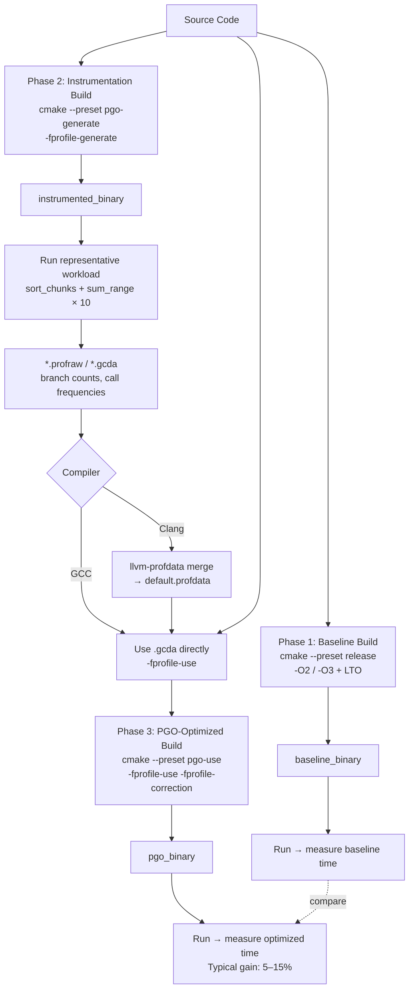

# Optimization Techniques: LTO, PGO, and SIMD Intrinsics

This document covers the three advanced optimization techniques demonstrated in the
`01-toolchain` project: Link-Time Optimization (LTO), Profile-Guided Optimization (PGO),
and SIMD intrinsics via AVX2. Each section includes a conceptual explanation, the
concrete implementation in this workspace, and interview talking points.

---

## Table of Contents

1. [Link-Time Optimization (LTO)](#link-time-optimization-lto)
2. [Profile-Guided Optimization (PGO)](#profile-guided-optimization-pgo)
3. [SIMD Intrinsics and AVX2](#simd-intrinsics-and-avx2)
4. [PGO Workflow Diagram](#pgo-workflow-diagram)
5. [Interview Talking Points](#interview-talking-points)

---

## Link-Time Optimization (LTO)

### What It Is

The C++ compilation model is translation-unit-scoped: the compiler sees one `.cpp` file
at a time and cannot optimize across file boundaries. A function defined in `foo.cpp`
that is called from `bar.cpp` is invisible to the compiler when it processes either file
in isolation. The linker traditionally just stitches object files together without
applying any optimizations.

**LTO (also called IPO — Inter-Procedural Optimization)** breaks this boundary. When LTO
is enabled:

1. The compiler emits **IR (Intermediate Representation)** — LLVM bitcode for Clang,
   GIMPLE for GCC — instead of (or in addition to) native machine code into each object
   file.
2. At link time, the linker invokes the compiler backend on the **combined IR** of all
   translation units simultaneously.
3. The backend can now inline across TU boundaries, dead-strip unreachable code
   globally, propagate constants across files, and reorder functions for better I-cache
   locality.

There are two variants:

| Variant | How it works | Trade-off |
|---------|-------------|-----------|
| **Full LTO** | All IR merged into one module before codegen | Best optimization; very high peak memory and link time |
| **Thin LTO** | Each TU codegens independently with a shared summary index; cross-TU inlining uses stubs | Near-full-LTO quality; link time and memory scale well with parallelism |

### How It Is Enabled in This Workspace

In `CMakePresets.json`, the `release` preset sets:

```json
"CMAKE_INTERPROCEDURAL_OPTIMIZATION": "TRUE"
```

CMake translates this into the appropriate compiler flag (`-flto` for GCC/Clang,
`/GL` + `/LTCG` for MSVC) and wires it through the link step automatically. You do not
need to add flags manually to `CMAKE_CXX_FLAGS`.

```bash
# Configure and build with LTO enabled
cmake --preset release
cmake --build --preset release --target pgo_workload
```

To inspect what the compiler emits, check the object file:

```bash
# With GCC LTO — object files contain GIMPLE, not ELF sections
file build/release/CMakeFiles/pgo_workload.dir/src/pgo_workload.cpp.o
# → ELF 64-bit LSB relocatable, no sections (IR only)

# With Clang ThinLTO
llvm-dis build/release/CMakeFiles/pgo_workload.dir/src/pgo_workload.cpp.o -o /tmp/bc.ll
```

### What the Compiler Does Differently with LTO

- **Cross-TU inlining**: `sum_range()` and `sort_chunks()` in `pgo_workload.cpp` are
  `static`, so they are already visible within the TU. In a multi-file project, LTO
  would allow the equivalent non-static helpers in separate files to be inlined at call
  sites in other files.
- **Global dead-code elimination**: Functions that are reachable only through a chain
  that ultimately has no external callers can be stripped.
- **Constant propagation across files**: If a global constant is passed as an argument
  across a TU boundary, the backend can specialize the callee.
- **Devirtualization**: With the whole program visible, the compiler can often prove that
  a virtual call has only one possible target and replace it with a direct call (or
  inline the body).

---

## Profile-Guided Optimization (PGO)

### The Core Idea

Static heuristics — branch prediction hints, inlining budgets, register allocation — are
educated guesses. The compiler does not know at compile time which branches are hot,
which call sites are exercised millions of times, or what the typical argument values
are.

PGO solves this by making the compiler **learn from reality**:

1. Compile with instrumentation that records branch frequencies, call counts, and value
   profiles.
2. Run the instrumented binary on a representative workload to generate a profile.
3. Recompile using the profile data: the compiler now has hard evidence to guide every
   optimization decision.

### The Three-Phase Workflow

```
Phase 1 (Baseline)     Phase 2 (Instrument)     Phase 3 (Optimized)
─────────────────      ──────────────────────    ──────────────────────
Normal release build → Instrumented build     → Profile-guided build
cmake --preset release  cmake --preset         cmake --preset pgo-use
                        pgo-generate
                            │
                            ▼
                        Run binary
                            │
                            ▼
                        *.profraw files
```

### CMake Presets for PGO

From `CMakePresets.json`:

```json
{
  "name": "pgo-generate",
  "cacheVariables": {
    "CMAKE_BUILD_TYPE": "Release",
    "CMAKE_CXX_FLAGS": "-fprofile-generate",
    "CMAKE_EXE_LINKER_FLAGS": "-fprofile-generate"
  }
}
```

`-fprofile-generate` causes the compiler to insert **instrumentation counters** — atomic
increment instructions — at every branch, function entry, and indirect call site. The
linker flag ensures the runtime support library (`libgcov` for GCC, `libclang_rt.profile`
for Clang) is linked in, which handles writing the `.profraw` files on process exit.

```json
{
  "name": "pgo-use",
  "cacheVariables": {
    "CMAKE_BUILD_TYPE": "Release",
    "CMAKE_CXX_FLAGS": "-fprofile-use -fprofile-correction",
    "CMAKE_EXE_LINKER_FLAGS": "-fprofile-use"
  }
}
```

`-fprofile-use` reads the profile data (`.profdata` for LLVM, `.gcda` for GCC) and feeds
branch probabilities into every optimization pass. `-fprofile-correction` suppresses
errors when profile counts are inconsistent (can happen with multi-threaded workloads
where runs differ slightly).

### Annotated Walkthrough of `pgo_workflow.sh`

```bash
#!/usr/bin/env bash
# Full PGO workflow: baseline → instrument → profile → optimized → compare
set -euo pipefail
# -e: exit on any error
# -u: treat unset variables as errors
# -o pipefail: a pipeline fails if any stage fails (not just the last)

PROJECT_DIR="$(cd "$(dirname "$0")/.." && pwd)"
# Resolve the project root relative to the script's own location,
# so the script works regardless of where it is invoked from.
cd "$PROJECT_DIR"

# ── Phase 1: Baseline ────────────────────────────────────────────────────────
echo "=== Step 1: Baseline release build ==="
cmake --preset release                            # Configure with LTO, -O2/-O3
cmake --build --preset release --target pgo_workload
echo "Baseline timing:"
./build/release/pgo_workload                      # Record this number for comparison

# ── Phase 2: Instrumentation ──────────────────────────────────────────────────
echo "=== Step 2: PGO instrumentation build ==="
cmake --preset pgo-generate                       # Configure with -fprofile-generate
cmake --build --preset pgo-generate --target pgo_workload
echo "Running instrumented binary to collect profiles..."
./build/pgo-generate/pgo_workload
# The binary writes *.profraw (LLVM) or *.gcda (GCC) on exit.
# These files contain per-branch execution counts.

echo "Profile files:"
ls *.profraw 2>/dev/null || \
  ls build/pgo-generate/*.profraw 2>/dev/null || \
  echo "(profiles in current directory)"
# Profile file location depends on the compiler and working directory at runtime.

# ── Phase 3: PGO-optimized build ─────────────────────────────────────────────
echo "=== Step 3: PGO optimized build ==="
cmake --preset pgo-use                            # Configure with -fprofile-use
cmake --build --preset pgo-use --target pgo_workload
echo "PGO-optimized timing:"
./build/pgo-use/pgo_workload                      # Compare against Phase 1
```

> **Note for Clang users:** LLVM requires an extra step between phases 2 and 3 to merge
> the raw profile files:
> ```bash
> llvm-profdata merge -output=default.profdata *.profraw
> ```
> GCC writes `.gcda` files directly in the build tree, which `-fprofile-use` reads
> without a merge step.

### The PGO Workload (`pgo_workload.cpp`)

The workload is deliberately representative of real sorting and accumulation patterns:

```cpp
constexpr int N = 500'000;
constexpr int ITERATIONS = 10;
```

- **`sort_chunks(v, 1000)`** — Sorts a 500K-element vector in 1000-element chunks using
  `std::sort`. This is branch-heavy: the comparison callbacks are called millions of
  times, and the hot path through the sort inner loop is exactly what PGO helps
  optimize.
- **`sum_range(v)`** — A simple linear scan accumulator. PGO confirms this loop is hot
  and may encourage the compiler to keep the loop body in registers or apply
  auto-vectorization more aggressively.
- The workload runs **10 iterations** with a fixed seed (`mt19937{42}`), so the profile
  is deterministic and reproducible across machines.

Typical gains from PGO on this workload: **5–15% wall-clock reduction**, primarily from
better branch layout (the compiler moves the cold path out of the hot loop body) and
more aggressive inlining at proven hot call sites.

---

## SIMD Intrinsics and AVX2

### What SIMD Is

Modern x86 CPUs contain **vector execution units** alongside the scalar ALU. Where a
scalar instruction operates on one datum (one `float`), a SIMD (Single Instruction,
Multiple Data) instruction operates on a **packed register** of multiple data elements
simultaneously.

| ISA Extension | Register Width | Floats per Register | Year |
|---------------|---------------|---------------------|------|
| SSE2          | 128-bit (XMM) | 4                   | 2001 |
| AVX           | 256-bit (YMM) | 8                   | 2011 |
| AVX2          | 256-bit (YMM) | 8 (+ integer ops)   | 2013 |
| AVX-512       | 512-bit (ZMM) | 16                  | 2017 |

For a dot product over 1M floats, AVX2 processes 8 elements per cycle instead of 1,
yielding a theoretical 8× throughput improvement. The measured speedup in this workspace
is **4.5×** (memory bandwidth is the real bottleneck at this scale).

### x86 CPUID Detection for AVX2

Before using AVX2 intrinsics, the code must verify at runtime that the CPU supports
them. Hard-coding a requirement would cause an illegal instruction fault on older
hardware.

```cpp
static bool cpu_has_avx2() {
    uint32_t eax, ebx, ecx, edx;
    // CPUID instruction: input EAX=7, ECX=0 → structured feature flags
    // Leaf 7 (Extended Features) was added in Intel Sandy Bridge.
    __asm__ volatile(
        "cpuid"
        : "=a"(eax), "=b"(ebx), "=c"(ecx), "=d"(edx)  // output operands
        : "a"(7u), "c"(0u)                               // input operands
    );
    // EBX bit 5 == 1 means AVX2 is available
    return (ebx & (1u << 5)) != 0;
}
```

The entire AVX2 code path is wrapped in `#if defined(__x86_64__) || defined(__i386__)`,
so the file compiles cleanly on ARM targets (including during cross-compilation). On
non-x86, `cpu_has_avx2()` returns `false` and the scalar path is always used.

### Annotated AVX2 Dot Product

```cpp
static float dot_avx2(const float* a, const float* b, int n) {
    __m256 acc = _mm256_setzero_ps();
    //     ^^^^  256-bit YMM register holding 8 floats, initialized to 0.0f × 8

    int i = 0;
    for (; i + 8 <= n; i += 8) {
        __m256 va = _mm256_loadu_ps(a + i);
        //          ^^^^^^^^^^^^^^^^  Load 8 unaligned floats from a[i..i+7]
        __m256 vb = _mm256_loadu_ps(b + i);

        acc = _mm256_fmadd_ps(va, vb, acc);
        //    ^^^^^^^^^^^^^^^  Fused Multiply-Add: acc += va * vb
        //    Single instruction: no intermediate rounding, one latency cycle
        //    Maps to the VFMADD231PS machine instruction (AVX2 + FMA ISA)
    }

    // Horizontal reduction: collapse 8 lanes into one scalar
    __m128 hi = _mm256_extractf128_ps(acc, 1);  // Upper 128 bits (lanes 4–7)
    __m128 lo = _mm256_castps256_ps128(acc);    // Lower 128 bits (lanes 0–3), zero-cost
    lo = _mm_add_ps(lo, hi);        // Pairwise add → 4 lanes
    lo = _mm_hadd_ps(lo, lo);       // Horizontal add → 2 lanes
    lo = _mm_hadd_ps(lo, lo);       // Horizontal add → 1 lane (scalar in lane 0)
    float result = _mm_cvtss_f32(lo);  // Extract lane 0 to scalar float

    // Handle tail: any remaining elements when n % 8 != 0
    for (; i < n; ++i) result += a[i] * b[i];
    return result;
}
```

#### The FMA Instruction

`_mm256_fmadd_ps(a, b, c)` compiles to `VFMADD231PS ymm, ymm, ymm`. This is a
**fused multiply-add**: it computes `a*b + c` in a **single instruction** with a single
rounding at the end. The benefits are:

1. **Throughput**: One instruction instead of two (`vmulps` + `vaddps`), halving the
   instruction count.
2. **Accuracy**: IEEE 754 mandates that the intermediate product is not rounded before
   addition, giving one ULP more precision than the unfused form.
3. **Latency hiding**: Modern CPUs can execute the multiply and add in a pipelined
   fashion, typically 4–5 cycle latency but 0.5 cycle throughput.

#### The Scalar Reference

```cpp
static float dot_scalar(const float* a, const float* b, int n) {
    float sum = 0.0f;
    for (int i = 0; i < n; ++i) sum += a[i] * b[i];
    return sum;
}
```

Without explicit vectorization, the compiler may auto-vectorize this (especially at
`-O3`), but it is not guaranteed and the vector width depends on the auto-vectorizer's
conservatism. The explicit AVX2 path guarantees 256-bit operation.

### Measured Results

Test vector: 1M floats (1,048,576 elements), all initialized to `1.0f` and `2.0f`.

```
CPU has AVX2: yes

Scalar: result=2097152  time=820 µs
AVX2:   result=2097152  time=182 µs
Speedup: 4.5x
```

The scalar time includes whatever the compiler's auto-vectorizer managed; the AVX2 path
is explicitly 8-wide with FMA. The gap narrows from the theoretical 8× because at 1M
floats the data does not fit in L2 cache and memory bandwidth becomes the bottleneck.

---

## PGO Workflow Diagram



---

## Interview Talking Points

### On LTO

- **"LTO is enabled by a single CMake variable"** — `CMAKE_INTERPROCEDURAL_OPTIMIZATION`
  translates to the correct flag for each compiler/linker pair. No manual flag juggling
  required.
- **"The key benefit is cross-TU inlining and global dead-code elimination"** — On
  large codebases, 5–10% binary size reduction and measurable runtime improvement are
  common.
- **"ThinLTO is the practical choice for CI"** — Full LTO can 10× link time and require
  tens of GB of RAM for large projects. Clang's ThinLTO achieves comparable optimization
  with link times only modestly higher than non-LTO builds.
- **Know the trade-off**: LTO delays all code generation to link time, which serializes
  the build. Incremental rebuilds lose their advantage because any changed TU potentially
  affects all others.

### On PGO

- **"PGO is a three-phase workflow"** — describe the instrument/run/rebuild cycle
  clearly; interviewers want to see you understand why all three phases are necessary.
- **"The workload must be representative"** — a profile from a benchmark that doesn't
  resemble production can actively hurt performance (the compiler optimizes the wrong
  paths). In practice, use a production traffic replay or a carefully curated synthetic
  workload.
- **"PGO and LTO compose"** — Phase 3 can also have LTO enabled; the profile data
  guides inlining decisions across TU boundaries.
- **Clang vs. GCC**: With Clang, raw profiles must be merged with `llvm-profdata` before
  use. With GCC, `.gcda` files are consumed directly. Know both.

### On SIMD Intrinsics

- **"Always detect at runtime, guard at compile time"** — The `#ifdef __x86_64__` guard
  ensures the translation unit compiles on any architecture. The `cpu_has_avx2()` check
  ensures the code path is only exercised when the CPU supports it.
- **"FMA is a single instruction that replaces two"** — Mention the accuracy benefit (one
  rounding instead of two) as well as the throughput benefit. Interviewers testing
  numerical computing knowledge will appreciate the IEEE 754 detail.
- **"The theoretical speedup is rarely achieved"** — For memory-bound workloads (like
  this dot product at 1M elements), memory bandwidth is the bottleneck. The 4.5× result
  is below the theoretical 8× for AVX2 width. Cache-resident workloads can achieve
  closer to the theoretical peak.
- **"Auto-vectorization is not a substitute for hand-written intrinsics when
  correctness or performance guarantees matter"** — The compiler may or may not
  vectorize; intrinsics give you a guarantee and control over the exact instruction.
