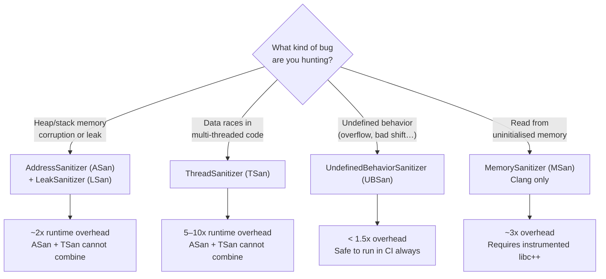
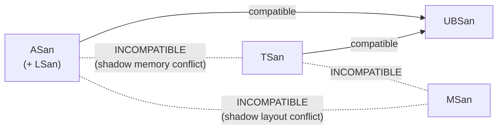

# Runtime Sanitizers — Reference and Interview Guide

Sanitizers are compiler instrumentations that insert lightweight checks into the compiled
binary. They catch entire classes of bugs at runtime — bugs that are silent, produce wrong
answers, or crash unpredictably in production — with far more precision than Valgrind and
far less overhead than full formal verification. All three sanitizers covered here are
built into both GCC (≥ 4.8) and Clang (≥ 3.1).

---

## Table of Contents

1. [When to use which sanitizer](#when-to-use-which-sanitizer)
2. [AddressSanitizer (ASan)](#addresssanitizer-asan)
3. [ThreadSanitizer (TSan)](#threadsanitizer-tsan)
4. [UndefinedBehaviorSanitizer (UBSan)](#undefinedbehaviorsanitizer-ubsan)
5. [Sanitizer compatibility matrix](#sanitizer-compatibility-matrix)
6. [WSL2 caveat for TSan](#wsl2-caveat-for-tsan)
7. [Interview talking points](#interview-talking-points)

---

## When to use which sanitizer



| Sanitizer | Catches | Can combine with | Overhead |
|---|---|---|---|
| ASan | Heap/stack OOB, UAF, double-free | UBSan | ~2x |
| LSan | Memory leaks (bundled with ASan on Linux) | ASan | negligible |
| TSan | Data races | UBSan | 5–10x |
| UBSan | Signed overflow, bad shifts, null deref, etc. | ASan or TSan | < 1.5x |
| MSan | Uninitialised reads | UBSan | ~3x |

---

## AddressSanitizer (ASan)

### What it catches

ASan instruments every heap allocation and stack frame with "shadow memory" — a parallel
byte array where 1 shadow byte tracks the poisoned/unpoisoned state of 8 application bytes.
Before each load and store the compiler inserts a shadow-memory check. If the access hits
a poisoned region, ASan prints a full report and aborts.

Detected bug classes:

- **Heap use-after-free** — reading/writing memory after `delete` or `free`
- **Heap buffer overflow / underflow** — reading/writing past the end (or before the start) of a heap allocation
- **Stack buffer overflow** — same for local arrays
- **Global buffer overflow**
- **Use-after-return** — accessing a local variable through a dangling pointer after the function has returned (requires `-fsanitize-address-use-after-return=always`)
- **Memory leaks** — via the bundled LeakSanitizer (Linux only, enabled by `ENABLE_SANITIZER_LEAK`)

### Demo source — `src/asan_demo.cpp`

```cpp
#include <cstdlib>
#include <iostream>
#include <vector>

// MODE selects which bug to trigger (pass as argv[1]):
//   clean  - no bug (default)
//   uaf    - heap-use-after-free
//   leak   - memory leak
//   oob    - out-of-bounds read

int main(int argc, char* argv[]) {
    const char* mode = (argc > 1) ? argv[1] : "clean";
    std::string m{mode};

    if (m == "uaf") {
        int* p = new int(42);
        delete p;
        //                            ↑ p is now a dangling pointer.
        //                              The heap block is freed and poisoned
        //                              in ASan shadow memory.
        std::cout << *p << "\n";  // USE AFTER FREE — ASan catches this
        //                  ↑ Shadow memory check fires here.
        //                    Without ASan this may print 42, 0, or crash
        //                    depending on allocator reuse timing.
    } else if (m == "leak") {
        int* p = new int[1024];
        (void)p;
        // intentionally not deleted — LSan (part of ASan) catches this
        // LSan runs at program exit and walks all live heap blocks,
        // reporting any that were never freed.
    } else if (m == "oob") {
        std::vector<int> v{1, 2, 3};
        std::cout << v[10] << "\n";  // OUT OF BOUNDS — ASan catches this
        //                  ↑ v.size() == 3. Index 10 is 28 bytes past the
        //                    last element. operator[] does no bounds check,
        //                    but ASan's heap shadow catches the overrun.
    } else {
        std::cout << "ASan demo: no bug triggered.\n";
        std::cout << "Run with: uaf | leak | oob\n";
    }

    return 0;
}
```

**Key point for `oob`:** `std::vector::operator[]` is not bounds-checked in release builds
(use `at()` for a checked alternative). ASan catches the out-of-bounds access because the
heap block allocated for `v`'s storage is surrounded by "red zones" — poisoned bytes that
exist solely to catch overruns.

### Build and run commands

```bash
# Configure and build
cmake --preset asan
cmake --build --preset asan --target asan_demo

# Or use the convenience script (runs both uaf and leak)
scripts/run-asan.sh
```

#### Mode: `uaf` (heap-use-after-free)

```bash
ASAN_OPTIONS="halt_on_error=1:print_stacktrace=1" \
  ./build/asan/asan_demo uaf
```

`halt_on_error=1` — stop on the first error (default is to continue).
`print_stacktrace=1` — show a stack trace even when the binary has no debug symbols.

**Expected ASan output:**

```
=================================================================
==12345==ERROR: AddressSanitizer: heap-use-after-free on address 0x602000000010
READ of size 4 at 0x602000000010 thread T0
    #0 0x... in main src/asan_demo.cpp:18
    #1 0x... in __libc_start_main
    ...
0x602000000010 is located 0 bytes inside of 4-byte region [0x602000000010,0x602000000014)
freed by thread T0 here:
    #0 0x... in operator delete(void*)
    #1 0x... in main src/asan_demo.cpp:17
previously allocated by thread T0 here:
    #0 0x... in operator new(unsigned long)
    #1 0x... in main src/asan_demo.cpp:16
SUMMARY: AddressSanitizer: heap-use-after-free src/asan_demo.cpp:18 in main
```

The report gives you three stack traces: where the bad access happened, where the memory
was freed, and where it was originally allocated. This is sufficient to fix the bug without
a debugger in most cases.

#### Mode: `leak` (memory leak via LSan)

```bash
ASAN_OPTIONS="halt_on_error=0:detect_leaks=1" \
  LSAN_OPTIONS="print_suppressions=0" \
  ./build/asan/asan_demo leak
```

`detect_leaks=1` — activate LSan at program exit (default on Linux when ASan is active).
`print_suppressions=0` — show all leaks including those that could be suppressed.

**Expected LSan output (at program exit):**

```
=================================================================
==12346==ERROR: LeakSanitizer: detected memory leaks

Direct leak of 4096 byte(s) in 1 object(s) allocated from:
    #0 0x... in operator new[](unsigned long)
    #1 0x... in main src/asan_demo.cpp:20

SUMMARY: LeakSanitizer: 4096 byte(s) leaked in 1 allocation(s).
```

#### Mode: `oob` (out-of-bounds read)

```bash
ASAN_OPTIONS="halt_on_error=1:print_stacktrace=1" \
  ./build/asan/asan_demo oob
```

**Expected output:**

```
=================================================================
==12347==ERROR: AddressSanitizer: heap-buffer-overflow on address 0x...
READ of size 4 at 0x... thread T0
    #0 0x... in main src/asan_demo.cpp:24
    ...
0x... is located 28 bytes to the right of 12-byte region [...]
```

---

## ThreadSanitizer (TSan)

### What it catches

TSan uses a hybrid of happens-before analysis and lockset analysis to detect data races.
Every memory access is associated with a vector clock. When two threads access the same
memory location without a synchronisation edge between them and at least one access is a
write, TSan reports a race.

Detected bug classes:

- **Data races** — concurrent reads/writes to shared memory without mutual exclusion
- **Races on `std::mutex`** — unlocking a mutex from a different thread than locked it
- **Double-lock** — locking a non-recursive mutex that the same thread already holds (in some configurations)
- **Use-after-free races** — racing access and deallocation

TSan does **not** detect logical races (incorrect lock ordering that could theoretically
deadlock) — that requires a separate tool like `Helgrind`.

### Demo source — `src/tsan_demo.cpp`

```cpp
#include <iostream>
#include <thread>

// MODE: clean | race
// TSan detects the data race in "race" mode.

int shared_counter = 0;  // intentionally not atomic
//                  ↑ A plain int, not std::atomic<int>.
//                    Concurrent writes without synchronisation = data race.

void increment(int n) {
    for (int i = 0; i < n; ++i)
        ++shared_counter;  // DATA RACE: concurrent unsynchronized write
        //              ↑ Read-modify-write is not atomic.
        //                Two threads can read the same value, both increment,
        //                and write back — losing one increment.
        //                TSan's shadow memory tracks which thread last wrote
        //                each memory location and flags the conflict.
}

int main(int argc, char* argv[]) {
    const char* mode = (argc > 1) ? argv[1] : "clean";
    std::string m{mode};

    if (m == "race") {
        shared_counter = 0;
        std::thread t1(increment, 100'000);
        std::thread t2(increment, 100'000);
        //           ↑ Two threads call increment() simultaneously.
        //             No mutex, no atomic, no memory_order — pure data race.
        t1.join();
        t2.join();
        std::cout << "Final counter: " << shared_counter
                  << " (expected 200000 — will differ due to race)\n";
        //                                ↑ Without a race the answer would be
        //                                  200000. With a race it is often
        //                                  less, and it changes every run.
    } else {
        std::cout << "TSan demo: no race triggered.\n";
        std::cout << "Run with: race\n";
    }
    return 0;
}
```

**The fix** (not in the demo — the demo intentionally leaves the bug unfixed):
```cpp
#include <atomic>
std::atomic<int> shared_counter{0};
// Now ++shared_counter is a single atomic RMW instruction — no race.
```

### Build and run commands

```bash
# Configure and build
cmake --preset tsan
cmake --build --preset tsan --target tsan_demo

# Or use the convenience script
scripts/run-tsan.sh

# Run directly
TSAN_OPTIONS="halt_on_error=1" ./build/tsan/tsan_demo race
```

`halt_on_error=1` — stop on the first race report. By default TSan continues and may
report many races for the same root cause, which can be noisy.

**Expected TSan output:**

```
==================
WARNING: ThreadSanitizer: data race (pid=12348)
  Write of size 4 at 0x... by thread T2:
    #0 increment(int) src/tsan_demo.cpp:11

  Previous write of size 4 at 0x... by thread T1:
    #0 increment(int) src/tsan_demo.cpp:11

  Location is global 'shared_counter' of size 4 at 0x... (tsan_demo+0x...)

  Thread T2 (tid=..., running) created by main thread at:
    #0 ... in main src/tsan_demo.cpp:20

  Thread T1 (tid=..., running) created by main thread at:
    #0 ... in main src/tsan_demo.cpp:19

SUMMARY: ThreadSanitizer: data race src/tsan_demo.cpp:11 in increment(int)
==================
```

The report identifies the exact source line where both conflicting accesses occur, which
thread performed each access, and where each thread was created. The fix is almost always
immediately obvious from this information.

---

## UndefinedBehaviorSanitizer (UBSan)

### What it catches

Undefined behavior (UB) in C++ is any operation whose result is not specified by the
standard. The compiler is permitted to assume UB never occurs, which means it can and does
optimise away the checks you might expect to prevent it. UBSan inserts runtime checks
before every potentially-UB operation.

Selected bug classes (the full list is long):

| Check | Flag | Example |
|---|---|---|
| Signed integer overflow | `-fsanitize=signed-integer-overflow` | `INT_MAX + 1` |
| Unsigned integer overflow | `-fsanitize=unsigned-integer-overflow` | (not UB by standard, but often a bug) |
| Shift past bit width | `-fsanitize=shift` | `1u << 33` on a 32-bit `uint32_t` |
| Null pointer dereference | `-fsanitize=null` | `*(int*)nullptr` |
| Misaligned pointer use | `-fsanitize=alignment` | `*(int*)((char*)p + 1)` |
| Invalid enum value | `-fsanitize=enum` | casting `42` to a 2-value enum |
| Return from non-void | `-fsanitize=return` | missing `return` in `int f()` |
| Out-of-bounds array index | `-fsanitize=bounds` | `int a[3]; a[5]` (stack arrays) |
| Dynamic type mismatch | `-fsanitize=vptr` | downcast to wrong derived type |

`-fsanitize=undefined` enables all of the above (and more) as a group.

### Demo source — `src/ubsan_demo.cpp`

```cpp
#include <climits>
#include <cstdint>
#include <iostream>

// MODE: clean | overflow | shift
// UBSan detects undefined behavior at runtime.
// (nullptr deref intentionally omitted — it also triggers a signal)

int main(int argc, char* argv[]) {
    const char* mode = (argc > 1) ? argv[1] : "clean";
    std::string m{mode};

    if (m == "overflow") {
        // Signed integer overflow — undefined behavior in C++
        volatile int x = INT_MAX;
        //           ↑ volatile prevents the compiler from constant-folding
        //             INT_MAX + 1 at compile time and optimising it away.
        //             Without volatile, a sufficiently smart compiler may
        //             delete this entire branch because "UB cannot happen."
        std::cout << "INT_MAX + 1 = " << (x + 1) << "\n";  // UB
        //                                   ↑ On x86 this typically wraps
        //                                     to INT_MIN (-2147483648), but
        //                                     the standard does not guarantee
        //                                     that. The compiler can assume
        //                                     (x + 1) > x is always true.
    } else if (m == "shift") {
        // Shift past bit-width — undefined behavior
        uint32_t x = 1u;
        std::cout << (x << 33) << "\n";  // UB: shift >= width
        //               ↑ uint32_t has 32 bits. Shifting by 33 is UB
        //                 regardless of the value of x. On x86 the hardware
        //                 masks the shift count to 5 bits (shift & 0x1f),
        //                 so this prints 2 (shifting by 1), but the standard
        //                 gives no such guarantee.
    } else {
        std::cout << "UBSan demo: no UB triggered.\n";
        std::cout << "Run with: overflow | shift\n";
    }
    return 0;
}
```

**Why `volatile`?** Without it, GCC and Clang will constant-fold `INT_MAX + 1` at compile
time. Because the standard says signed overflow is UB, the compiler is allowed to assume it
never happens and may delete the `if (m == "overflow")` branch entirely. `volatile`
prevents this by forcing the value to be read from memory at runtime, making the overflow
happen at the load+add instruction.

### Build and run commands

```bash
# Configure and build
cmake --preset ubsan
cmake --build --preset ubsan --target ubsan_demo

# Run each mode
./build/ubsan/ubsan_demo overflow
./build/ubsan/ubsan_demo shift
./build/ubsan/ubsan_demo clean    # exits cleanly — no UB triggered
```

#### Mode: `overflow` (signed integer overflow)

```bash
./build/ubsan/ubsan_demo overflow
```

**Expected UBSan output:**

```
src/ubsan_demo.cpp:16:34: runtime error: signed integer overflow:
  2147483647 + 1 cannot be represented in type 'int'
INT_MAX + 1 = -2147483648
```

Note that UBSan prints the error and then **continues** by default — the `cout` line still
executes and prints the wrapped value. This is intentional: UBSan is designed to find all
bugs in a test run, not just the first one. Use `UBSAN_OPTIONS="halt_on_error=1"` to stop
on first error.

#### Mode: `shift` (shift past bit width)

```bash
./build/ubsan/ubsan_demo shift
```

**Expected UBSan output:**

```
src/ubsan_demo.cpp:20:26: runtime error: shift exponent 33 is too large
  for 32-bit type 'unsigned int'
2
```

---

## Sanitizer compatibility matrix



The fundamental constraint is that ASan, TSan, and MSan each use a large shadow memory
region mapped at a fixed virtual address. Only one can be active per process because they
would conflict over the same virtual address range.

---

## WSL2 caveat for TSan

TSan cannot run on WSL2. The error message is:

```
==PID==FATAL: ThreadSanitizer: unexpected memory mapping 0x... with type 0
FATAL: ThreadSanitizer: unexpected memory mapping
```

**Root cause:** TSan relies on a specific virtual address space layout (it reserves a large
contiguous region at a known address for its shadow memory). The WSL2 kernel enables ASLR
(Address Space Layout Randomisation) in a way that places other mappings in the range TSan
needs, and the WSL2 `vm.mmap_rnd_bits` value is higher than TSan can accommodate.

**Workarounds (in order of preference):**

1. **Run on native Linux** — a VM, a CI container, or a bare-metal Linux install.
2. **GitHub Actions** — the `ubuntu-latest` runner is native Linux; TSan works there without any configuration.
3. **Docker Desktop on WSL2** — a Linux container with a standard kernel (not the WSL2 kernel) can run TSan. Pull `gcc:13` or `clang:17` and build inside it.
4. **Reduce ASLR entropy (not recommended for production):**
   ```bash
   sudo sysctl vm.mmap_rnd_bits=28   # may not help on all WSL2 kernels
   ```

**For interview prep:** The TSan source, build commands, and expected output described in
this document are accurate for native Linux. On WSL2, configure and build with `cmake
--preset tsan` succeeds; the binary simply cannot execute. The architecture discussion and
the race condition analysis are unaffected.

---

## Interview talking points

### "What is a sanitizer and how does it work?"

> A sanitizer is a compiler instrumentation pass that adds runtime checks to a binary.
> The compiler rewrites every memory access, every thread synchronisation operation, or
> every potentially-undefined arithmetic operation to first check an invariant and abort
> with a detailed report if the invariant is violated. The overhead comes entirely from
> these inserted checks — there is no emulation or virtualisation. Because the checks are
> compiled into the binary, the sanitizer has perfect access to all type and symbol
> information, which is why the reports are so precise compared to Valgrind.

### "When would you use ASan vs Valgrind?"

> I reach for ASan first. It is roughly 2x overhead versus 10–20x for Valgrind/Memcheck,
> so it is practical to run in CI on every PR. ASan also catches stack buffer overflows,
> which Valgrind cannot detect because it only intercepts heap allocation calls. Valgrind's
> advantage is that it requires no recompilation — you can run it on any binary — and it
> works on production builds. ASan requires recompilation. I use Valgrind mainly when I am
> debugging a problem in a binary I do not have the full build system for.

### "How would you catch a data race in code review?"

> During code review I look for shared mutable state — any variable that is written by one
> thread and read or written by another — and check that every access is either protected
> by the same mutex or uses `std::atomic`. In practice, data races are hard to catch by
> inspection in large codebases because the races are often between distant callsites.
> That is exactly what TSan is for: I add it to the CI pipeline targeting the multi-threaded
> test suite and let the tool find races automatically. TSan's output tells me the exact
> source line, the two conflicting accesses, and which threads performed them.

### "What is undefined behavior and why does the compiler care?"

> Undefined behavior is any operation whose result the C++ standard explicitly leaves
> unspecified — signed integer overflow, dereferencing a null pointer, reading an
> uninitialised variable, and about two hundred other cases. The standard leaves them
> undefined so compiler writers can assume these things never happen and generate faster
> code. For example, knowing that signed overflow cannot occur lets the compiler assume
> `x + 1 > x` is always true and eliminate range checks. UBSan catches these at runtime by
> inserting checks before the UB would occur. The most important practical consequence is
> that UB can cause security vulnerabilities: an attacker who controls the input that
> triggers UB can exploit the compiler's assumption to bypass security checks that the
> compiler has optimised away.

### "How do you use sanitizers in a CI pipeline?"

> I define separate CMake presets for each sanitizer — `asan`, `tsan`, `ubsan` — and run
> them as separate jobs in CI. The `asan` and `ubsan` jobs run on every PR because their
> overhead is low enough (2x and 1.5x respectively). The `tsan` job runs only on the
> nightly build or on PRs that touch concurrency code, because its 5–10x overhead makes
> it slow for a full test suite. Each job configures with the corresponding preset, builds,
> and runs `ctest`. Any sanitizer error produces a non-zero exit code, which fails the CI
> job automatically.

### "Can you combine sanitizers?"

> ASan and UBSan are compatible — the canonical combination is `-fsanitize=address,undefined`.
> TSan and UBSan are also compatible. The incompatible combinations are ASan+TSan and
> ASan+MSan, because all three use a large shadow memory region at fixed virtual addresses
> and only one can be mapped at a time. In practice I run ASan+UBSan together for
> memory-safety testing and TSan alone for concurrency testing.

### "What does LeakSanitizer (LSan) do differently from ASan?"

> LSan is bundled with ASan on Linux and activates automatically at program exit. While
> ASan monitors every individual access, LSan takes a different approach at exit: it walks
> all live heap allocations and checks whether any are reachable through a live pointer. If
> a heap block has no live reference pointing to it, it is leaked memory. LSan is
> essentially a conservative garbage collector run once at exit. It catches the classic
> "allocate and forget" leak but also subtle leaks where a container holds the only
> reference and nobody ever clears it. LSan does not catch "use-after-free" or OOB — that
> is ASan's job.
