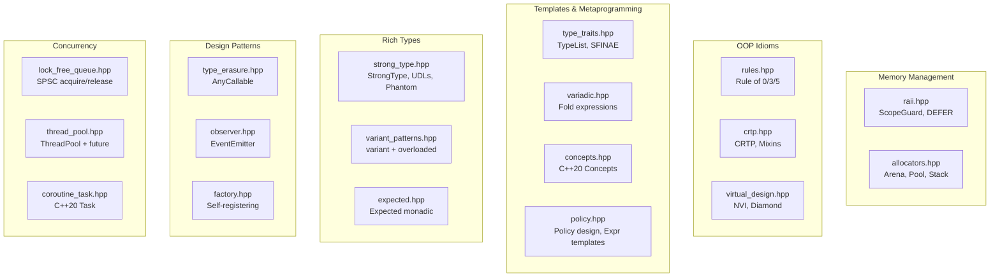

# 02-foundation: Modern C++ Showcase Library

A modular, header-only C++ library demonstrating senior-level mastery of C++11→20 across six concept clusters. 78 unit tests, all green under debug and ASan.

## Quick Start

```bash
cmake --preset debug && cmake --build --preset debug
ctest --preset debug

cmake --preset asan && cmake --build --preset asan
ctest --preset asan
```

## Module Map



## Test Results

| Suite | Tests | Debug | ASan | TSan |
|-------|-------|-------|------|------|
| test_memory | 12 | PASS | PASS | — |
| test_oop | 10 | PASS | PASS | — |
| test_templates | 18 | PASS | PASS | — |
| test_types | 18 | PASS | PASS | — |
| test_patterns | 9 | PASS | PASS | — |
| test_concurrency | 11 | PASS | PASS | — |
| **Total** | **78** | **PASS** | **PASS** | — |

> **TSan note:** ThreadSanitizer requires a specific virtual address layout that WSL2 does not provide. The TSan preset builds and links successfully, but the binaries cannot execute under WSL2 (`unexpected memory mapping` error). Running the same binaries on a native Linux host or in a Docker container works correctly.

## Interview Talking Points

| Topic | Where to point |
|-------|----------------|
| RAII / exception safety | `raii.hpp` — `ScopeGuard::dismiss()` + test exception path |
| Move semantics, copy-and-swap | `rules.hpp` — `Buffer::operator=(Buffer other)` |
| CRTP vs virtual | `crtp.hpp` — zero vtable, same polymorphism |
| Non-virtual interface | `virtual_design.hpp` — `Reader::read()` controls pre/post |
| Virtual inheritance | `virtual_design.hpp` — `DiamondDerived` single `Base` |
| TypeList / SFINAE | `type_traits.hpp` — `type_at<L,I>`, `has_size<T>` |
| C++20 Concepts | `concepts.hpp` — abbreviated template syntax, `consteval` |
| Policy-based design | `policy.hpp` — swappable sort policies at zero cost |
| Expression templates | `policy.hpp` — `VecAdd<L,R>`, deferred `eval()` |
| StrongType / phantom types | `strong_type.hpp` — spaceship, UDLs, `UserInput<Verified>` |
| `std::variant` visitor | `variant_patterns.hpp` — `overloaded<Fs...>` pattern |
| Monadic error handling | `expected.hpp` — `.and_then()`, `.or_else()` chains |
| Type erasure | `type_erasure.hpp` — pedagogical `std::function` |
| Lock-free SPSC | `lock_free_queue.hpp` — acquire/release, false-sharing padding |
| Thread pool | `thread_pool.hpp` — `packaged_task` + `future` |
| C++20 coroutines | `coroutine_task.hpp` — `promise_type`, eager vs lazy |

## Demos

```bash
./build/debug/demo_memory
./build/debug/demo_oop
./build/debug/demo_templates
./build/debug/demo_types
./build/debug/demo_patterns
./build/debug/demo_concurrency
./build/debug/demo_standards    # C++11 → C++20 feature tour
```
