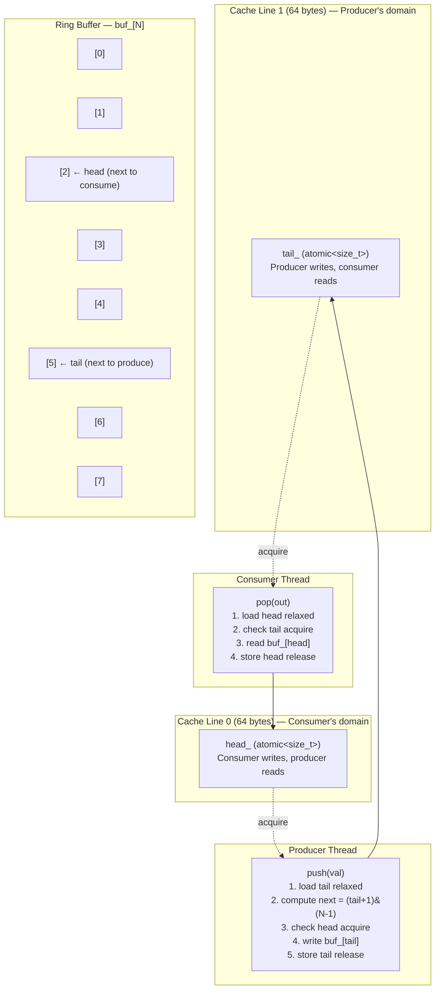
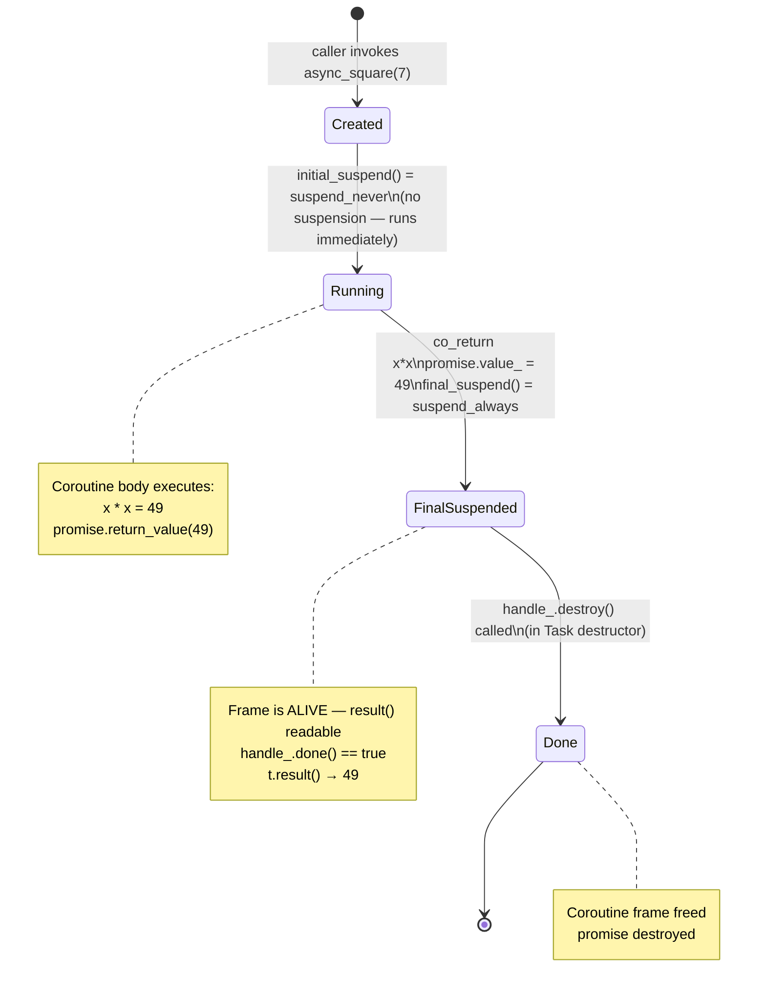

# Concurrency — Lock-Free Queue, Thread Pool, and C++20 Coroutines

> Source headers: `include/foundation/concurrency/`
> Tests: `tests/test_concurrency.cpp` | Demo: `demos/concurrency_demo.cpp`

---

## Table of Contents

1. [SPSCQueue\<T, N\> — Lock-Free Single-Producer Single-Consumer Queue](#1-spscqueuet-n--lock-free-single-producer-single-consumer-queue)
2. [SPSC Queue Layout Diagram](#2-spsc-queue-layout-diagram)
3. [ThreadPool — Work Queue with std::future](#3-threadpool--work-queue-with-stdfuture)
4. [C++20 Coroutines — Task\<T\>](#4-c20-coroutines--taskt)
5. [Coroutine Lifecycle Diagram](#5-coroutine-lifecycle-diagram)
6. [WSL2 TSan Note](#6-wsl2-tsan-note)
7. [Interview Talking Points](#7-interview-talking-points)

---

## 1. SPSCQueue\<T, N\> — Lock-Free Single-Producer Single-Consumer Queue

### The SPSC Constraint

`SPSCQueue` is correct only when **exactly one thread calls `push()`** and **exactly one thread calls `pop()`** — they may be different threads. This constraint eliminates the need for a mutex because:

- Only the producer writes `tail_`, only the consumer reads `tail_` (to check for empty).
- Only the consumer writes `head_`, only the producer reads `head_` (to check for full).

Each thread owns its half of the state. Atomic loads/stores with acquire/release ordering are sufficient.

### Power-of-2 Bitmask Trick

```cpp
static_assert((N & (N - 1)) == 0, "N must be a power of 2");
```

Wrapping an index in a ring buffer normally requires modulo: `(index + 1) % N`. Modulo is a division — expensive on most CPUs. When N is a power of 2, `(N - 1)` is an all-ones bitmask and the equivalent is a single bitwise AND:

```cpp
auto next = (tail + 1) & (N - 1);   // same as (tail + 1) % N, but a single AND
```

For `N = 8`:  `N - 1 = 0b0111`. Any index `& 0b0111` wraps in the range [0, 7] — no branch, no division.

The `static_assert` enforces the constraint at compile time: `N & (N-1) == 0` iff N is a power of 2 (binary property: a power of 2 has exactly one bit set, so subtracting 1 flips all lower bits and clears the leading bit, giving bitwise AND = 0).

### Acquire / Release Memory Ordering

Memory ordering controls which memory operations a CPU (and compiler) may reorder relative to the atomic operation.

| Ordering | What it prevents |
|---|---|
| `memory_order_release` on a **store** | All writes in the current thread that appear *before* this store are visible to any thread that later performs an **acquire** load of the same atomic variable. |
| `memory_order_acquire` on a **load** | All reads in the current thread that appear *after* this load see all writes that the other thread performed before its paired **release** store. |
| `memory_order_relaxed` | No ordering guarantee beyond atomicity — used when you only need to read/write without synchronisation (e.g., reading your own `tail_` before the release store). |

In plain language: the **release store of `tail_`** in `push()` acts as a fence that says "all my writes to `buf_[tail]` are done; whoever acquires this tail value will see them." The **acquire load of `tail_`** in `pop()` says "I see all writes that happened before the release store I just observed."

### Cache-Line Padding — False Sharing Prevention

```cpp
alignas(64) std::atomic<std::size_t> head_{0};  // consumer writes this
alignas(64) std::atomic<std::size_t> tail_{0};  // producer writes this
```

A modern CPU cache line is 64 bytes. If two variables share a cache line and different CPU cores write to them, hardware **false sharing** occurs: every write by either core invalidates the entire cache line in the other core's cache, forcing a round-trip to memory — even though the two variables are logically independent.

`alignas(64)` places each atomic on its own cache line, ensuring that the producer's writes to `tail_` never invalidate the consumer's cache entry for `head_`, and vice versa.

### Annotated push() and pop()

```cpp
// Called from producer thread only. Returns false if full.
bool push(const T& val) {
    // relaxed: producer is the only writer of tail_ — no need to synchronise
    // with itself. This is a plain non-atomic read of our own counter.
    auto tail = tail_.load(std::memory_order_relaxed);

    // Power-of-2 bitmask wrap: same as (tail + 1) % N
    auto next = (tail + 1) & (N - 1);

    // acquire: we need to see the latest value of head_ written by the consumer.
    // Without acquire, the CPU could speculate and see a stale head_, falsely
    // concluding the queue is full.
    if (next == head_.load(std::memory_order_acquire)) return false;  // full

    // Write the value into the buffer — must happen BEFORE the release store below
    buf_[tail] = val;

    // release: "I have finished writing buf_[tail]. Any thread that acquire-loads
    // tail_ will now see the completed write to buf_[tail]."
    tail_.store(next, std::memory_order_release);
    return true;
}

// Called from consumer thread only. Returns false if empty.
bool pop(T& out) {
    // relaxed: consumer is the only writer of head_ — no synchronisation needed
    // with itself
    auto head = head_.load(std::memory_order_relaxed);

    // acquire: must see the latest tail_ written by the producer, including all
    // writes to buf_[] that happened before that release store
    if (head == tail_.load(std::memory_order_acquire)) return false;  // empty

    // Read the value — safe because acquire above synchronises with producer's
    // release store of tail_, which guarantees buf_[head] is fully written
    out = buf_[head];

    // release: "I have finished reading buf_[head]. Any thread that acquire-loads
    // head_ will see this slot is free."
    head_.store((head + 1) & (N - 1), std::memory_order_release);
    return true;
}
```

**Capacity is N-1, not N:** one slot is permanently wasted to distinguish "full" (`next == head`) from "empty" (`head == tail`). If all N slots were usable, both conditions would be `head == tail`, making them indistinguishable.

---

## 2. SPSC Queue Layout Diagram



**Memory ordering edges:** the dashed arrows show the acquire/release synchronisation edges. The consumer's acquire load of `tail_` synchronises with the producer's release store of `tail_`, establishing a happens-before relationship that guarantees the consumer sees the completed `buf_[tail]` write.

---

## 3. ThreadPool — Work Queue with std::future

### Worker Thread Loop

```cpp
// include/foundation/concurrency/thread_pool.hpp

explicit ThreadPool(std::size_t n) {
    workers_.reserve(n);
    for (std::size_t i = 0; i < n; ++i) {
        workers_.emplace_back([this] {
            while (true) {
                std::function<void()> task;
                {
                    std::unique_lock lock{mutex_};

                    // condition_variable::wait(lock, predicate):
                    //   - releases lock and blocks while predicate() returns false
                    //   - re-acquires lock and returns when predicate() returns true
                    //   - predicate guards against spurious wakeups
                    cv_.wait(lock, [this]{ return stop_ || !tasks_.empty(); });

                    // Drain remaining tasks even during shutdown
                    if (stop_ && tasks_.empty()) return;

                    task = std::move(tasks_.front());
                    tasks_.pop();
                }
                // Execute task outside the lock — allows other workers to dequeue
                task();
            }
        });
    }
}
```

**Why the predicate matters:** `condition_variable::wait` can wake spuriously (i.e., without a corresponding `notify`). The predicate `stop_ || !tasks_.empty()` re-checks the condition after every wakeup, making spurious wakeups harmless.

### submit() — Returning std::future

```cpp
template<typename F, typename... Args>
auto submit(F&& f, Args&&... args)
    -> std::future<std::invoke_result_t<F, Args...>>
{
    using Ret = std::invoke_result_t<F, Args...>;

    // packaged_task wraps f and connects it to a promise/future pair.
    // Shared ownership via shared_ptr so the lambda in tasks_ can capture it.
    auto task = std::make_shared<std::packaged_task<Ret()>>(
        std::bind(std::forward<F>(f), std::forward<Args>(args)...)
    );

    // Get the future before moving the task into the queue.
    // After the task is moved, we can no longer call get_future().
    std::future<Ret> fut = task->get_future();

    {
        std::lock_guard lock{mutex_};
        // Lambda captures shared_ptr by value — safe across thread boundaries
        tasks_.emplace([task]{ (*task)(); });
    }
    cv_.notify_one();  // wake one sleeping worker
    return fut;        // caller blocks on fut.get() when it needs the result
}
```

**Data flow:**

```
submit(f, args...)
    │
    ├── packaged_task<Ret()> ── wraps bind(f, args)
    │        │
    │        └── get_future() ──► std::future<Ret> (returned to caller)
    │
    └── tasks_.emplace(lambda)   ← lambda captures shared_ptr<packaged_task>
              │
              ▼
         worker thread
              │
         (*task)()              ← calls bind(f, args), stores result in promise
              │
              ▼
         fut.get()              ← caller retrieves result or rethrows exception
```

### Exception Propagation

`packaged_task` catches any exception thrown by the wrapped function and stores it in the shared state. When the caller calls `fut.get()`, the exception is rethrown:

```cpp
// From the test:
auto fut = pool.submit([]() -> int {
    throw std::runtime_error("task error");
    return 0;
});
EXPECT_THROW(fut.get(), std::runtime_error);  // exception travels across threads
```

No explicit exception handling is needed — `packaged_task` does it automatically.

### Graceful Shutdown in Destructor

```cpp
~ThreadPool() {
    // Set stop flag under lock so workers see a consistent state
    { std::lock_guard lock{mutex_}; stop_ = true; }

    // Wake all sleeping workers so they re-evaluate the stop_ condition
    cv_.notify_all();

    // Join every worker — destructor blocks until all tasks complete
    for (auto& w : workers_) w.join();
}
```

Workers drain the remaining task queue (`if (stop_ && tasks_.empty()) return`) before exiting. Tasks submitted before the destructor are guaranteed to complete. Tasks submitted concurrently with the destructor may or may not be accepted depending on timing.

---

## 4. C++20 Coroutines — Task\<T\>

### The Coroutine Machinery

C++20 coroutines are stackless: a coroutine's local variables are stored in a **coroutine frame** on the heap, not on the call stack. The compiler transforms a coroutine function into a state machine. The mechanism involves three components:

1. **`promise_type`** — controls the coroutine's behaviour at key lifecycle points.
2. **`coroutine_handle`** — an opaque pointer to the coroutine frame; used to resume or destroy.
3. **The return object (`Task<T>`)** — what the caller receives; owns the handle.

```cpp
// include/foundation/concurrency/coroutine_task.hpp

template<typename T>
class Task {
public:
    struct promise_type {
        T value_{};                          // where co_return stores the result
        std::exception_ptr exception_{};     // where unhandled_exception stores errors

        // Called first by the compiler to create the Task object that is
        // returned to the caller. The handle is bound to this promise.
        Task get_return_object() {
            return Task{std::coroutine_handle<promise_type>::from_promise(*this)};
        }

        // suspend_never = do NOT suspend at the start.
        // The coroutine body runs immediately when the function is called —
        // "eager" execution. The caller does not need to resume it.
        std::suspend_never  initial_suspend() noexcept { return {}; }

        // suspend_always = suspend at the end instead of destroying the frame.
        // This keeps the coroutine frame alive so Task::result() can read value_.
        // The frame is destroyed by Task's destructor.
        std::suspend_always final_suspend()   noexcept { return {}; }

        // co_return x stores x in value_
        void return_value(T v) noexcept { value_ = std::move(v); }

        // Any uncaught exception is captured here — rethrown by result()
        void unhandled_exception() { exception_ = std::current_exception(); }
    };

    explicit Task(std::coroutine_handle<promise_type> h) : handle_{h} {}

    // RAII: destroy the coroutine frame when Task goes out of scope
    ~Task() { if (handle_) handle_.destroy(); }

    Task(const Task&) = delete;              // frames are not copyable
    Task(Task&& o) noexcept : handle_{std::exchange(o.handle_, {})} {}

    // Retrieve result — rethrows any stored exception
    T result() {
        if (handle_.promise().exception_)
            std::rethrow_exception(handle_.promise().exception_);
        return handle_.promise().value_;
    }

    bool done() const noexcept { return !handle_ || handle_.done(); }

private:
    std::coroutine_handle<promise_type> handle_;
};
```

### async_square — Annotated Example

```cpp
inline Task<int> async_square(int x) {
    co_return x * x;
    //  ^
    //  co_return transforms this into: promise.return_value(x * x); then suspends
    //  at final_suspend (suspend_always) — frame stays alive, value_ is readable
}
```

**Call sequence:**

```
auto t = async_square(7);
   │
   1. Compiler allocates coroutine frame on heap
   2. promise_type is constructed inside the frame
   3. get_return_object() called — creates Task{handle}
   4. initial_suspend() returns suspend_never — coroutine does NOT suspend
   5. Coroutine body runs: x * x = 49, co_return stores 49 in promise.value_
   6. final_suspend() returns suspend_always — coroutine suspends, frame is KEPT
   7. Task object returned to caller, holding the handle
   │
t.result()
   │
   8. Checks promise.exception_ — none
   9. Returns promise.value_ = 49
   │
~Task()  (t goes out of scope)
   │
   10. handle_.destroy() — frees the coroutine frame
```

### Eager vs Lazy Execution

| | `initial_suspend() = suspend_never` (eager) | `initial_suspend() = suspend_always` (lazy) |
|---|---|---|
| When body runs | Immediately when the coroutine function is called | Only when the caller explicitly `.resume()`s the handle |
| Use case | Fire-and-forget computations, synchronous tasks, simple generators | Async I/O where setup must happen before the first resume (e.g., posting to an event loop) |
| Side effects | Side effects happen before the caller can store the Task | Side effects are deferred until the caller chooses to drive the coroutine |
| This implementation | **Eager** (`suspend_never`) | N/A |

**Demonstrated in tests:**

```cpp
TEST(CoroutineTask, EagerExecution) {
    int side_effect = 0;
    auto make_task = [&]() -> foundation::Task<int> {
        side_effect = 1;   // this runs immediately on Task construction
        co_return 99;
    };
    auto t = make_task();
    // Eager: body already executed before result() is called
    EXPECT_EQ(side_effect, 1);   // true — side effect already happened
    EXPECT_EQ(t.result(), 99);
}
```

### Why `final_suspend()` Must Be `suspend_always`

If `final_suspend()` returned `suspend_never`, the coroutine frame would be automatically destroyed at the end of the coroutine body — before `Task::result()` has a chance to read `promise.value_`. `suspend_always` at the final suspension point keeps the frame alive until `Task`'s destructor explicitly calls `handle_.destroy()`. The `Task` object owns the frame's lifetime.

---

## 5. Coroutine Lifecycle Diagram



**Suspension points with `co_await` (not shown above — not used in this example):**

If the coroutine used `co_await some_awaitable`, it would suspend at that point, yielding control back to the caller. The caller could then do other work and later call `handle_.resume()` to continue the coroutine from the suspension point. This is the pattern used in async I/O frameworks (Asio, libuv wrappers) where the awaitable represents a pending I/O operation.

---

## 6. WSL2 TSan Note

ThreadSanitizer (TSan) detects data races by instrumenting memory accesses at compile time and tracking happens-before edges at runtime. It requires specific kernel support for virtual memory layout that the WSL2 kernel (Microsoft's fork of the Linux kernel) does not expose.

**Build behaviour:** TSan-instrumented binaries (`-fsanitize=thread`) **compile cleanly** under WSL2 — no compilation errors.

**Run behaviour:** Executing a TSan binary on WSL2 fails immediately with an error similar to:

```
==1234==ERROR: ThreadSanitizer failed to allocate 0x00008000 (32768) bytes ...
FATAL: ThreadSanitizer: unexpected memory mapping
```

This is a kernel VM constraint, not a bug in the code. TSan requires `ASLR` to map its shadow memory in specific address ranges that the WSL2 kernel reserves for other purposes.

**Workarounds:**
- Run TSan tests in a native Linux VM (VirtualBox, VMware, or a cloud instance).
- Use GitHub Actions or another CI runner on bare Linux to run the TSan preset.
- Test with AddressSanitizer (ASan) and UBSan on WSL2 — both work correctly.

The CMake TSan preset (`cmake --preset tsan`) is retained in the repository so the configuration is available for native Linux environments.

---

## 7. Interview Talking Points

### Lock-Free vs Mutex Tradeoffs

- "Lock-free means threads never block waiting for a mutex. Progress is guaranteed as long as the hardware scheduler keeps running threads. In contrast, a mutex-based queue can cause priority inversion, convoy effects, or deadlock if a thread holding the lock is descheduled."
- "But lock-free is not always faster. The acquire/release atomics still generate memory barriers, which are expensive. For high-contention scenarios with many producers/consumers, a well-implemented mutex queue can outperform a lock-free one because it avoids spinning."
- "SPSC is the sweet spot: the constraint (one producer, one consumer) makes the problem simple enough that acquire/release suffice — no CAS loops needed. For MPMC (multiple producers and consumers), you need CAS (`compare_exchange_weak`) loops, which can suffer from ABA problems and contention."
- "The power-of-2 bitmask trick eliminates modulo, which matters in a tight loop. On modern CPUs, integer division has ~20-40 cycle latency vs ~1 cycle for bitwise AND."
- "False sharing is a subtle performance killer. Two threads writing to variables on the same cache line cause cache line bouncing between cores even if the variables are logically independent. `alignas(64)` is the standard fix."

### Thread Pool

- "The `packaged_task` + `future` pattern is the standard C++ way to move results and exceptions between threads. The alternative (shared `std::atomic` or shared memory) is error-prone. `future::get()` gives you both the result and exception propagation in one call."
- "The condition variable predicate is critical. Without it, spurious wakeups cause workers to wake, find `tasks_` empty and `stop_` false, and immediately block again — but the predicate makes this a no-op rather than a crash or race."
- "Graceful shutdown: the destructor sets `stop_` under the lock (so no worker sees a partial update), broadcasts to all workers, then joins. Workers drain remaining tasks before exiting. This guarantees submitted work completes even during destruction."
- "A real production pool would also cap the task queue to prevent unbounded memory growth under backpressure, and might add work-stealing for better CPU utilisation under uneven load."

### C++20 Coroutines

- "Coroutines are stackless: their frame is heap-allocated, not on the call stack. This makes them much cheaper to create than OS threads (no 2MB default stack) and cheaper to suspend/resume than `setjmp`/`longjmp` or `ucontext`."
- "Use cases: async I/O (Asio, networking), generators (`co_yield`), lazy sequences, structured concurrency. Coroutines are not threads — they don't run concurrently on their own. A scheduler or event loop drives them."
- "The promise_type protocol is the coroutine customisation point. `initial_suspend` controls eagerness; `final_suspend` controls frame lifetime; `return_value` / `return_void` / `yield_value` handle `co_return` / `co_yield`. This lets library authors define completely different coroutine semantics without compiler changes."
- "Eager (`suspend_never` initial) is appropriate when the coroutine runs synchronously to its first `co_await` and the caller doesn't need to configure anything before the body starts. Lazy (`suspend_always` initial) is appropriate when the coroutine must be posted to an executor or event loop before it starts."
- "Exception handling in coroutines: `unhandled_exception()` captures the exception into `std::exception_ptr`. The caller retrieves and rethrows it via `result()`. This is analogous to how `packaged_task` propagates exceptions through `future`."
