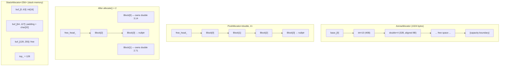

# Memory Management in C++

A deep-dive into RAII, scope guards, smart pointers, and custom allocators as implemented in `foundation/memory/`.

---

## Table of Contents

1. [The RAII Principle](#the-raii-principle)
2. [ScopeGuard](#scopeguard)
3. [FOUNDATION_DEFER Macro](#foundation_defer-macro)
4. [Smart Pointers](#smart-pointers)
5. [ArenaAllocator](#areaallocator)
6. [PoolAllocator](#poolallocator)
7. [StackAllocator](#stackallocator)
8. [Allocator Memory Layout](#allocator-memory-layout)
9. [Running the Demo and Tests](#running-the-demo-and-tests)
10. [Interview Talking Points](#interview-talking-points)

---

## The RAII Principle

**Resource Acquisition Is Initialization** — the most important idiom in C++.

The problem it solves: C APIs and raw resources (heap memory, file handles, mutex locks, sockets, GPU buffers) must be explicitly released. If any of these paths are forgotten — early returns, exceptions thrown mid-function, complex branching — the resource leaks.

```cpp
// BAD: manual resource management
void process_file(const char* path) {
    FILE* f = fopen(path, "r");
    // ...
    if (error_condition) return;   // file leaked here
    // ...
    fclose(f);                     // only reached on the happy path
}
```

RAII's answer: **tie resource lifetime to object lifetime**. Constructors acquire; destructors release. The compiler guarantees destructors run when objects go out of scope — even on exception paths.

```cpp
// GOOD: RAII wrapper
void process_file(const char* path) {
    std::ifstream f(path);         // acquires in constructor
    if (error_condition) return;   // destructor closes file automatically
    // ...
}                                  // destructor closes file here too
```

Why it matters for interviews: every `unique_ptr`, `lock_guard`, `ifstream`, and `FILE*` wrapper in the standard library is RAII. Interviewers expect you to explain *why* C++ chose this over `finally` blocks (Java/C#): destructors are always called, they compose naturally, and they work with exceptions without any special syntax.

---

## ScopeGuard

**File:** `include/foundation/memory/raii.hpp`

`ScopeGuard<F>` is a generic RAII wrapper that runs any callable when it goes out of scope. It's the goto tool when you need cleanup logic that doesn't justify a dedicated RAII class.

```cpp
template<typename F>
class ScopeGuard {
    F fn_;            // the cleanup callable (lambda, function pointer, functor)
    bool active_{true}; // controls whether cleanup runs

public:
    // (1) Perfect-forwarding constructor — avoids an extra copy of the callable
    explicit ScopeGuard(F&& f) : fn_{std::forward<F>(f)} {}

    // (2) Destructor — the RAII "release" point
    ~ScopeGuard() { if (active_) fn_(); }

    // (3) Non-copyable — two guards owning the same cleanup would run it twice
    ScopeGuard(const ScopeGuard&)            = delete;
    ScopeGuard& operator=(const ScopeGuard&) = delete;

    // (4) Move constructor — transfers ownership, silences the moved-from guard
    ScopeGuard(ScopeGuard&& other) noexcept
        : fn_{std::move(other.fn_)}, active_{other.active_} {
        other.active_ = false;  // crucial: moved-from guard must not fire
    }

    // (5) dismiss() — cancel the cleanup (e.g., on success)
    void dismiss() noexcept { active_ = false; }
};
```

### Why non-copyable?

If `ScopeGuard` were copyable, two guards with `active_ = true` would both point to the same logical resource. Both destructors would fire — double-free. Copying is deleted to make this a compile error.

### How `dismiss()` works

The typical pattern is "register cleanup at the top, cancel on success":

```cpp
void acquire_two_resources() {
    Resource* a = acquire_a();

    // If anything below throws, guard fires and releases a
    auto guard_a = foundation::make_scope_guard([&]{ release_a(a); });

    Resource* b = acquire_b();   // might throw
    // Success — we're taking ownership, cancel the cleanup
    guard_a.dismiss();
    take_ownership(a, b);
}
```

### Move constructor nuance

`make_scope_guard` returns a `ScopeGuard<F>` by value. Without the move constructor, returning it would require a copy (which is deleted). The move constructor transfers `fn_` and `active_` from the temporary, then sets `other.active_ = false` so the moved-from temporary's destructor is a no-op. Without that line, the cleanup would fire *twice*: once when the moved-from temporary is destroyed, and once when the destination goes out of scope.

### Factory function

```cpp
template<typename F>
[[nodiscard]] auto make_scope_guard(F&& f) {
    return ScopeGuard<std::decay_t<F>>{std::forward<F>(f)};
}
```

`[[nodiscard]]` ensures the caller cannot silently discard the returned guard (which would destroy it immediately, making it useless). `std::decay_t<F>` strips references — we store the callable by value inside the guard.

---

## FOUNDATION_DEFER Macro

**File:** `include/foundation/memory/raii.hpp`

```cpp
#define FOUNDATION_DEFER(expr) \
    auto FOUNDATION_DEFER_##__LINE__ = ::foundation::make_scope_guard([&]{ expr; })
```

This creates a `ScopeGuard` with a lambda that captures everything by reference and executes `expr` at scope exit.

```cpp
void example() {
    FILE* f = fopen("data.bin", "rb");
    FOUNDATION_DEFER(fclose(f));        // runs when function exits, no matter how

    int* buf = new int[1024];
    FOUNDATION_DEFER(delete[] buf);     // LIFO: buf freed before f closed

    process(f, buf);                    // might throw
}
```

`##__LINE__` appends the source line number to the variable name, allowing multiple `FOUNDATION_DEFER` calls in one scope without name collisions.

### Comparison to Go's `defer` and Rust's `Drop`

| Feature | `FOUNDATION_DEFER` | Go `defer` | Rust `Drop` |
|---|---|---|---|
| Mechanism | Stack-allocated lambda + RAII | Runtime deferred call stack | Compiler-generated destructor |
| Execution order | LIFO (innermost first) | LIFO | Reverse declaration order |
| Cancellable | Yes (`guard.dismiss()`) | No | No (but `std::mem::forget` exists) |
| Performance | Zero overhead (inlined) | Small runtime cost | Zero overhead |
| Exception-safe | Yes | N/A (no exceptions in Go) | Yes (unwind-safe) |

Go's `defer` is a language feature with runtime bookkeeping. Rust's `Drop` is embedded in the type system and cannot be skipped. `FOUNDATION_DEFER` lands in between: zero runtime cost (the lambda is inlined), cancellable via `dismiss()`, but requires a macro to get the syntactic convenience.

---

## Smart Pointers

Smart pointers from `<memory>` are the standard RAII wrappers for heap allocations. The tests in `tests/test_memory.cpp` demonstrate the key behaviors.

### `unique_ptr` — Exclusive Ownership

```cpp
auto p = std::make_unique<int>(42);
// p is the sole owner. No ref count. Destructor calls delete.

auto q = std::move(p);  // ownership transfer — O(1), no heap activity
// p == nullptr         — moved-from unique_ptr is always null
// *q == 42             — q now owns the int
```

`unique_ptr` has zero overhead vs. a raw pointer — the destructor is inlined and the size is exactly one pointer (when using the default deleter).

### `shared_ptr` — Shared Ownership via Reference Counting

```cpp
auto a = std::make_shared<int>(10);
// use_count() == 1

{
    auto b = a;            // copy: increments ref count atomically
    // a.use_count() == 2
    // b.use_count() == 2
}
// b destroyed: ref count drops to 1
// a.use_count() == 1 — object still alive

// When last shared_ptr goes out of scope: count hits 0, delete fires
```

`make_shared` allocates the control block (ref counts) and the managed object in **one allocation**, improving cache locality and reducing allocator overhead vs. `shared_ptr<T>(new T(...))`.

### `weak_ptr` — Cycle Breaking

A `shared_ptr` cycle (A owns B, B owns A) causes a memory leak — ref count never reaches zero. `weak_ptr` observes without owning:

```cpp
struct Node {
    std::shared_ptr<Node> next;   // strong: keeps target alive
    std::weak_ptr<Node>   prev;   // weak: does NOT increment ref count
    int val;
};

auto n1 = std::make_shared<Node>(Node{nullptr, {}, 1});
auto n2 = std::make_shared<Node>(Node{nullptr, {}, 2});
n1->next = n2;    // n2.use_count() == 2 (n1->next + local n2)
n2->prev = n1;    // n1.use_count() == 1 (only local n1 — weak doesn't count)

// When n1 and n2 go out of scope, both ref counts reach 0 cleanly
```

To use a `weak_ptr`, call `.lock()` which returns a `shared_ptr` (empty if the object was already destroyed):

```cpp
if (auto sp = n2->prev.lock()) {
    // sp is a valid shared_ptr for the duration of this block
}
```

### Custom Deleters

```cpp
auto deleter = [&](int* p) {
    deleted = true;   // track that deletion happened
    delete p;
};
std::unique_ptr<int, decltype(deleter)> p(new int(5), deleter);
// When p goes out of scope, deleter is called instead of the default delete
```

Custom deleters let `unique_ptr` manage non-heap resources: file descriptors (`fclose`), GPU buffers, COM objects (`Release()`), etc. The deleter type is part of `unique_ptr`'s template parameter — no virtual dispatch, no overhead.

---

## ArenaAllocator

**File:** `include/foundation/memory/allocators.hpp`

### Design: Linear Bump Allocator

An arena pre-allocates one large block. Each `alloc_raw` call simply advances a cursor (`used_`) — O(1) with no locks, no fragmentation tracking, no free-list traversal. The entire arena is reclaimed in O(1) by resetting `used_` to zero.

```
base_
  |
  v
  [-------- used --------][---------- remaining ----------]
  ^                       ^                               ^
  0                     used_                         capacity_
```

### `alloc_raw` Alignment Logic

```cpp
void* alloc_raw(std::size_t size,
                std::size_t alignment = alignof(std::max_align_t)) {
    // (1) Round used_ up to the next multiple of alignment
    std::size_t aligned = align_up(used_, alignment);
    //
    // align_up(v, a) = (v + a - 1) & ~(a - 1)
    //   Add (a-1) to ensure we exceed the next boundary,
    //   then mask off the low bits with ~(a-1).
    //   Example: align_up(5, 4) = (5+3) & ~3 = 8 & 0xFFFC = 8

    if (aligned + size > capacity_) throw std::bad_alloc{};

    void* ptr = base_ + aligned;
    used_ = aligned + size;       // (2) Advance cursor past this allocation
    return ptr;
}
```

Alignment matters because CPUs require certain types to be at addresses that are multiples of their size (`double` at 8-byte boundaries, SIMD types at 16/32-byte boundaries). Misaligned access causes hardware exceptions on some architectures and silent performance penalties on x86.

### Why `reset()` is O(1)

```cpp
void reset() noexcept { used_ = 0; }
```

No destructors are called. No memory is returned to the OS. The cursor just resets, and subsequent allocations overwrite the old data. This is valid as long as all objects in the arena have trivial destructors or their destructors have already been called manually.

The test demonstrates that after `reset()`, the next allocation returns the **same pointer** as before:

```cpp
void* p1 = arena.alloc_raw(100, 8);
arena.reset();
void* p2 = arena.alloc_raw(100, 8);
EXPECT_EQ(p1, p2);   // same address reused
```

### When to Use an Arena

- **Per-frame allocations** in game engines: allocate everything for a frame, reset at frame end
- **Per-request allocations** in servers: each HTTP request gets its own arena
- **Parse trees**: allocate all AST nodes from an arena, free the whole tree in one reset
- **When you know the lifetime is bounded**: the entire arena lives and dies together

The tradeoff: individual objects cannot be freed. If you need to release specific objects mid-lifetime, use a pool or the heap.

---

## PoolAllocator

**File:** `include/foundation/memory/allocators.hpp`

### Free-List Design Using the Union Trick

A pool pre-allocates `Capacity` blocks of `sizeof(T)` bytes. Blocks not in use are linked together in a singly-linked free list. The key insight: a free block doesn't store any `T` — it stores a pointer to the next free block. The `union` lets both interpretations share the same memory:

```cpp
template<typename T, std::size_t Capacity>
class PoolAllocator {
    union Block {
        alignas(T) std::byte storage[sizeof(T)]; // when allocated: T lives here
        Block* next{nullptr};                     // when free: pointer to next free block
    };
    //                                            ↑ default-initializes next to nullptr

    Block blocks_[Capacity];   // the entire pool — statically allocated
    Block* free_head_{nullptr};
    std::size_t available_{Capacity};
    ...
```

Constructor links all blocks into the free list:

```cpp
PoolAllocator() {
    for (std::size_t i = 0; i + 1 < Capacity; ++i)
        blocks_[i].next = &blocks_[i + 1];
    blocks_[Capacity - 1].next = nullptr;
    free_head_ = &blocks_[0];
}
// free list: [0] -> [1] -> [2] -> ... -> [N-1] -> nullptr
```

### O(1) Allocate and Deallocate

```cpp
T* allocate() {
    if (!free_head_) throw std::bad_alloc{};
    Block* blk  = free_head_;        // pop from head
    free_head_  = blk->next;
    --available_;
    return reinterpret_cast<T*>(blk->storage);  // return as T*
}

void deallocate(T* p) noexcept {
    auto* blk   = reinterpret_cast<Block*>(p);  // reinterpret back to Block*
    blk->next   = free_head_;                   // push to head of free list
    free_head_  = blk;
    ++available_;
}
```

Both operations are a pointer swap — truly O(1) regardless of pool size. No heap allocation occurs after construction.

The test verifies slot reuse:

```cpp
int* a = pool.allocate();
pool.deallocate(a);
int* b = pool.allocate();
EXPECT_EQ(a, b);    // same memory reused — LIFO for the free list
```

### Characteristics

- **Zero fragmentation**: all objects are the same size, so any free slot fits any new object
- **Cache-friendly**: all blocks are contiguous in `blocks_[]`
- **No heap after construction**: `blocks_[]` is typically a member of a class or placed in a static buffer
- **Fixed capacity**: must know the maximum concurrent live objects at design time

---

## StackAllocator

**File:** `include/foundation/memory/allocators.hpp`

```cpp
template<std::size_t N>
class StackAllocator {
    alignas(std::max_align_t) std::byte buf_[N];  // compile-time fixed buffer on the stack
    std::size_t top_{0};

public:
    void* alloc(std::size_t size,
                std::size_t align = alignof(std::max_align_t)) {
        std::size_t aligned = (top_ + align - 1) & ~(align - 1);
        if (aligned + size > N) throw std::bad_alloc{};
        void* p = buf_ + aligned;
        top_ = aligned + size;
        return p;
    }
    void reset() noexcept { top_ = 0; }
    std::size_t used() const noexcept { return top_; }
};
```

### Characteristics

- **Zero heap**: the buffer lives entirely on the stack (or as a member variable — which may also be stack-allocated depending on context)
- **LIFO constraint**: objects should be freed in reverse allocation order. Since there is no per-object `dealloc`, the only reclaim mechanism is `reset()` — wiping the entire allocator
- **`alignas(std::max_align_t)`**: ensures the buffer itself is maximally aligned, so any type can be placed at offset 0 without additional padding
- **Use case**: small, short-lived scratch space — small string operations, tiny parse buffers, temporary arrays in hot loops — where heap latency is unacceptable

---

## Allocator Memory Layout



---

## Running the Demo and Tests

### Prerequisites

```bash
# From the project root
cmake --preset dev          # configure with debug + ASan
cmake --build build/dev
```

### Run the memory demo

```bash
./build/dev/demos/memory_demo
```

Expected output:

```
=== Memory Demo ===

-- ScopeGuard --
  (inside scope)
  ScopeGuard fired
  ScopeGuard dismissed
  (after defer setup)
  DEFER fired

-- Smart Pointers --
  unique_ptr value: 42
  after move, original null: 1
  shared_ptr use_count=1: 1
  shared_ptr use_count=2: 2
  shared_ptr use_count=1 again: 1
  custom deleter called: 1

-- ArenaAllocator --
  squares: 0 1 4 9 16 25 36 49 64 81
  same address after reset: 1

-- PoolAllocator --
  a=3.14  b=2.71
  reused slot (c==a): 1

Done.
```

### Run the tests

```bash
ctest --test-dir build/dev -R Memory --output-on-failure
# or directly:
./build/dev/tests/test_memory
```

---

## Interview Talking Points

**On RAII:**
- "RAII ties resource lifetime to object lifetime. The compiler guarantees destructors run, so you cannot forget to release a resource — even on exception paths."
- "This is why C++ doesn't need `finally` blocks. Destructors *are* the finally block, and they compose automatically."

**On ScopeGuard vs. dedicated RAII types:**
- "A dedicated RAII type (`unique_ptr`, `lock_guard`) is clearer and more self-documenting. `ScopeGuard` is for one-off cleanup that doesn't justify a new class — C API teardown, test fixtures, rollback-on-failure logic."

**On `dismiss()`:**
- "The commit-or-rollback pattern: register the rollback at the top, call dismiss() on success. The guard fires only if something goes wrong before dismiss() is reached."

**On `unique_ptr` vs. `shared_ptr`:**
- "Default to `unique_ptr`. It has zero overhead and makes ownership explicit. Only upgrade to `shared_ptr` when you genuinely need shared ownership — it carries atomic ref-count overhead and a separate control block allocation (unless you use `make_shared`)."

**On `weak_ptr`:**
- "Any time you have bidirectional relationships in a `shared_ptr` graph, the back-pointer should be `weak_ptr`. Otherwise you create a reference cycle where the count never reaches zero."

**On ArenaAllocator:**
- "An arena trades flexibility for speed. Allocations are a pointer bump — O(1) with no lock. You pay for it with inflexibility: no individual frees. Perfect for per-frame or per-request lifetimes where everything goes away at once."

**On PoolAllocator:**
- "A pool gives O(1) alloc and free for fixed-size objects by recycling slots through a free list. The union trick is key: free blocks reuse their storage to store the next-pointer. No extra memory overhead, no fragmentation."

**On alignment:**
- "Alignment is not optional. `align_up(v, a) = (v + a - 1) & ~(a - 1)` rounds up to the next multiple of `a`. Unaligned access is UB on strict architectures and a performance penalty on x86."
