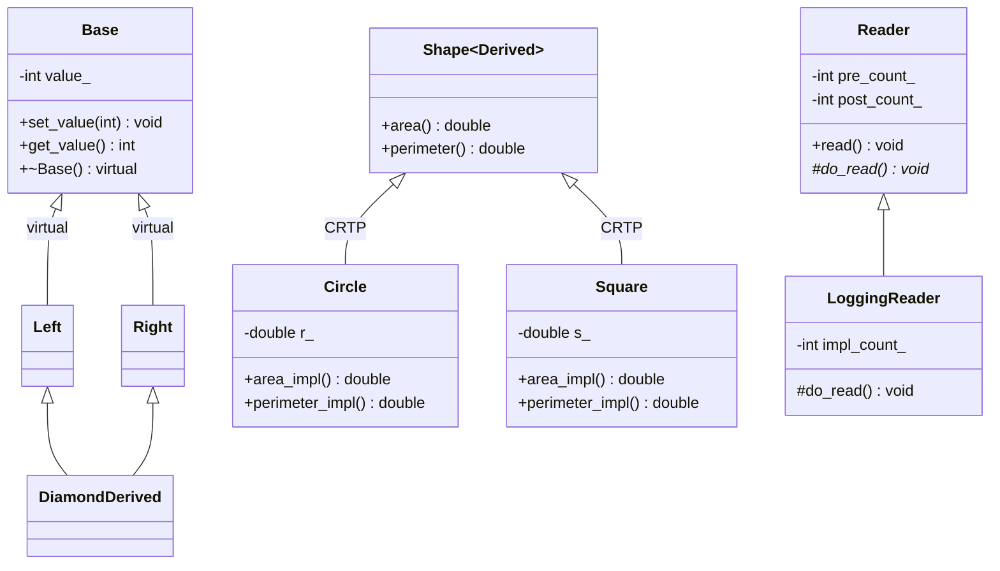

# Object-Oriented Design in C++

A deep-dive into the Rules of Zero/Five, CRTP, NVI, and the diamond problem as implemented in `foundation/oop/`.

---

## Table of Contents

1. [Rule of Zero](#rule-of-zero)
2. [Rule of Five — Buffer](#rule-of-five--buffer)
3. [CRTP — Static Polymorphism](#crtp--static-polymorphism)
4. [CRTP Mixins](#crtp-mixins)
5. [NVI — Non-Virtual Interface](#nvi--non-virtual-interface)
6. [Virtual Inheritance and the Diamond Problem](#virtual-inheritance-and-the-diamond-problem)
7. [Class Hierarchy Diagram](#class-hierarchy-diagram)
8. [Running the Demo and Tests](#running-the-demo-and-tests)
9. [Interview Talking Points](#interview-talking-points)

---

## Rule of Zero

**File:** `include/foundation/oop/rules.hpp`

The Rule of Zero: **if your class owns no raw resources, declare none of the five special members.** Let the compiler synthesize them — it will do the right thing.

```cpp
struct RuleOfZeroExample {
    std::vector<int>     data;   // RAII: handles deep copy, move, destroy
    std::unique_ptr<int> ptr;    // RAII: move-only, destructor frees
    std::string          name;   // RAII: handles copy/move/destroy
    // No destructor, no copy constructor, no copy-assignment,
    // no move constructor, no move-assignment declared.
    // The compiler generates correct versions from the member types.
};
```

The compiler-generated copy constructor calls each member's copy constructor in turn. The move constructor calls each member's move constructor. The destructor calls each member's destructor in reverse declaration order.

**When it breaks down:** the moment you own a raw resource (`new`, file descriptor, socket, mutex handle), the compiler-generated destructor does nothing with it. That's when you step up to the Rule of Five.

---

## Rule of Five — Buffer

**File:** `include/foundation/oop/rules.hpp`

`Buffer` owns a heap-allocated byte array. It demonstrates all five special members explicitly:

```cpp
class Buffer {
    std::byte* data_{nullptr};  // raw resource: heap pointer
    std::size_t size_{0};

public:
    Buffer() = default;

    // Allocating constructor — acquire the resource
    explicit Buffer(std::size_t size)
        : data_{size ? new std::byte[size]() : nullptr}
        //              ^^^^ value-initializes to zero
        , size_{size} {}

    // 1. Destructor — the "release" half of RAII
    ~Buffer() { delete[] data_; }
    //         ^^^ matches new[], not new

    // 2. Copy constructor — deep copy
    Buffer(const Buffer& other)
        : data_{other.size_ ? new std::byte[other.size_] : nullptr}
        , size_{other.size_}
    {
        if (data_) std::memcpy(data_, other.data_, size_);
        // Allocates independent memory, then copies bytes.
        // After this, *this and other are identical but independent.
    }

    // 3. Copy assignment — copy-and-swap idiom
    Buffer& operator=(Buffer other) noexcept {
        // (a) Parameter is taken BY VALUE — this invokes the copy constructor,
        //     which allocates new memory and copies. If the copy throws,
        //     *this is unchanged (strong exception guarantee).
        swap(other);
        // (b) Swap the internals — O(1), noexcept
        return *this;
        // (c) 'other' (which now holds our old data) is destroyed here,
        //     freeing the old memory. Self-assignment is safe:
        //     if (this == &other), the copy still works correctly.
    }

    // 4. Move constructor — O(1) ownership transfer
    Buffer(Buffer&& other) noexcept
        : data_{other.data_}   // steal the pointer
        , size_{other.size_}
    {
        other.data_ = nullptr; // put moved-from into valid empty state
        other.size_ = 0;
        // The moved-from Buffer's destructor will call delete[] nullptr — safe.
    }

    // Note: move assignment is implicitly provided by copy-and-swap
    // (operator= takes by value, and move construction is used when
    // the caller passes an rvalue: buf = std::move(other))

    void swap(Buffer& other) noexcept {
        std::swap(data_, other.data_);
        std::swap(size_, other.size_);
    }

    std::byte*  data() const noexcept { return data_; }
    std::size_t size() const noexcept { return size_; }
};
```

### Copy-and-Swap Idiom Explained

The trick in `operator=(Buffer other)` is subtle:

1. **Take by value** — the compiler calls the copy constructor for lvalues, the move constructor for rvalues. If the copy constructor throws (out-of-memory), the exception propagates before `swap` is called, so `*this` is unchanged. This provides the **strong exception guarantee**.
2. **Swap** — exchange internals with the local copy. O(1), `noexcept`.
3. **Destroy the parameter** — when `other` goes out of scope at the closing brace, it holds our *old* data and destroys it via `~Buffer()`.

Self-assignment (`buf = buf`) works correctly: the copy constructor makes a new allocation of the same data, swap exchanges pointers, then the old allocation is freed.

### Moved-From State

After `Buffer b = std::move(a)`:
- `a.data_ == nullptr`
- `a.size_ == 0`

The moved-from object is in a **valid but unspecified state** — the standard requires it to be destructible and assignable. Our implementation goes further: it's a valid empty `Buffer`, which avoids subtle bugs if the moved-from object is accidentally used.

---

## CRTP — Static Polymorphism

**File:** `include/foundation/oop/crtp.hpp`

**CRTP** (Curiously Recurring Template Pattern): a derived class passes itself as the template argument to its base class, enabling the base to call derived methods through a `static_cast` — no vtable, no virtual dispatch.

```cpp
template<typename Derived>
class Shape {
public:
    // area() calls area_impl() on the actual derived type at compile time
    double area() const {
        return static_cast<const Derived*>(this)->area_impl();
        //     ^^^^^^^^^^^^^^^^^^^^^^^^^^^^^^^^^^^
        //     Safe: we know 'this' IS a Derived, because Derived inherits
        //     from Shape<Derived>. The cast is resolved at compile time.
    }
    double perimeter() const {
        return static_cast<const Derived*>(this)->perimeter_impl();
    }
};

class Circle : public Shape<Circle> {     // Derived = Circle
    double r_;
public:
    explicit Circle(double r) : r_{r} {}
    double area_impl()      const { return std::numbers::pi * r_ * r_; }
    double perimeter_impl() const { return 2.0 * std::numbers::pi * r_; }
};

class Square : public Shape<Square> {     // Derived = Square
    double s_;
public:
    explicit Square(double s) : s_{s} {}
    double area_impl()      const { return s_ * s_; }
    double perimeter_impl() const { return 4.0 * s_; }
};
```

### How `static_cast<const Derived*>(this)` Works

At the point where `Shape<Circle>::area()` is instantiated by the compiler, `Derived = Circle`. The `static_cast` converts the `Shape<Circle>*` to a `Circle*`. This is safe because `Circle` inherits from `Shape<Circle>`, meaning the memory layout guarantees the base subobject sits at the start (or at a known offset) of the `Circle` object.

No vtable pointer is stored. No indirect branch occurs. The call is a direct function call — typically inlined.

### Virtual Dispatch vs. CRTP

| Property | `virtual` | CRTP |
|---|---|---|
| Runtime polymorphism | Yes (through base pointer) | No |
| Compile-time polymorphism | No | Yes (template instantiation) |
| Vtable overhead | 1 pointer per object | None |
| Function call cost | Indirect (vtable lookup) | Direct (inlined) |
| Can put in heterogeneous container | Yes (`vector<Shape*>`) | No (each instantiation is a distinct type) |
| Works across translation units | Yes | Yes (templates in headers) |

Use CRTP when you know the concrete types at compile time and need maximum performance. Use `virtual` when you need runtime polymorphism — storing mixed derived types in a container and dispatching at runtime.

---

## CRTP Mixins

**File:** `include/foundation/oop/crtp.hpp`

CRTP enables mixin composition: attach independent, orthogonal behaviors to a class without virtual overhead and without modifying the class hierarchy.

```cpp
// Mixin 1: adds logging capability
template<typename Derived>
class Loggable {
    mutable std::vector<std::string> log_;  // mutable: accessible from const methods
public:
    void log(std::string msg) const { log_.push_back(std::move(msg)); }
    int  log_count()          const { return static_cast<int>(log_.size()); }
    const std::vector<std::string>& logs() const { return log_; }
};

// Mixin 2: adds sort behavior — calls into Derived for logging
template<typename Derived>
class Sortable {
public:
    void sort_data() {
        auto* self = static_cast<Derived*>(this);  // reach into Derived
        self->log("before sort");                  // calls Loggable::log via Derived
        // ... actual sort work ...
        self->log("after sort");
    }
};

// Compose both mixins — no virtual, no overhead
class LoggableSorter
    : public Loggable<LoggableSorter>    // acquires log(), log_count(), logs()
    , public Sortable<LoggableSorter>    // acquires sort_data()
{};
```

Demo usage:

```cpp
LoggableSorter ls;
ls.log("preparing");       // 1 entry
ls.sort_data();            // adds "before sort" + "after sort" (2 more entries)
// ls.log_count() == 3
// ls.logs() == ["preparing", "before sort", "after sort"]
```

The key is that `Sortable<LoggableSorter>::sort_data()` calls `self->log()`, which resolves to `Loggable<LoggableSorter>::log()` through the `LoggableSorter` type — all at compile time. Multiple inheritance of CRTP bases works cleanly because each base is a distinct type.

---

## NVI — Non-Virtual Interface

**File:** `include/foundation/oop/virtual_design.hpp`

The NVI pattern separates the *interface contract* (pre/post conditions, invariants) from the *customization point* (what derived classes override).

```cpp
class Reader {
public:
    // PUBLIC NON-VIRTUAL: the interface clients call.
    // The base class retains full control over what happens
    // before and after the actual work.
    void read() {
        ++pre_count_;    // pre-condition hook: track calls, acquire lock, validate state
        do_read();       // customization point: let derived classes do the work
        ++post_count_;   // post-condition hook: log, release lock, validate invariants
    }

    int pre_count()  const noexcept { return pre_count_; }
    int post_count() const noexcept { return post_count_; }

    virtual ~Reader() = default;  // virtual destructor: safe deletion through base pointer

protected:
    // PROTECTED VIRTUAL: the customization point.
    // Derived classes override this but cannot be called directly by clients.
    virtual void do_read() = 0;

private:
    int pre_count_{0};   // invariant maintained by base, not visible to derived
    int post_count_{0};
};

class LoggingReader : public Reader {
    int impl_count_{0};
protected:
    void do_read() override { ++impl_count_; }  // just the impl, no boilerplate
public:
    int impl_count() const noexcept { return impl_count_; }
};
```

### Why Public Non-Virtual + Protected Virtual?

1. **Invariant enforcement**: the base class can add locking, logging, pre/post validation, timing, or any cross-cutting concern to *every* call — regardless of which derived class is in use.
2. **Interface stability**: clients call `read()`. The base class can change the pre/post logic without updating every derived class.
3. **Derived class simplicity**: `LoggingReader::do_read()` only contains the unique work. It doesn't need to remember to call `++pre_count_` or release any lock.

The test verifies that `pre_count_`, `impl_count_`, and `post_count_` all reach 3 after three `read()` calls — confirming the base class hooks fire correctly around the derived class implementation.

---

## Virtual Inheritance and the Diamond Problem

**File:** `include/foundation/oop/virtual_design.hpp`

The diamond problem arises when two classes inherit from the same base, and a fourth class inherits from both of them.

### The Ambiguity Without `virtual`

```
       Base          (one copy per inheritance path)
      /    \
   Left    Right     (both inherit a Base subobject)
      \    /
  DiamondDerived     (contains two separate Base subobjects)
```

Without `virtual`, `DiamondDerived` contains `Left::Base` and `Right::Base` as separate, independent subobjects. Calling `d.set_value(42)` is ambiguous — the compiler cannot decide which `Base` to use.

### Virtual Inheritance: One Shared Subobject

```cpp
class Base {
    int value_{0};
public:
    void set_value(int v) noexcept { value_ = v; }
    int  get_value()      const noexcept { return value_; }
    virtual ~Base() = default;
};

class Left  : public virtual Base {};  // ← virtual keyword
class Right : public virtual Base {};  // ← virtual keyword

class DiamondDerived : public Left, public Right {
    // Only ONE Base subobject, shared by Left and Right.
    // set_value() and get_value() are unambiguous.
};
```

With `virtual` inheritance, the compiler creates a single `Base` subobject inside `DiamondDerived` and both `Left` and `Right` reference the same one. `DiamondDerived` is responsible for constructing that single `Base` subobject directly (bypassing `Left` and `Right`'s constructors for the base).

```cpp
DiamondDerived d;
d.set_value(42);
d.get_value();    // == 42, unambiguous
```

The test confirms that `get_value()` returns exactly what `set_value()` wrote — there is only one `value_` field.

### Cost of Virtual Inheritance

Virtual inheritance adds a vptr-like indirection per virtual base (a virtual base table pointer). It also complicates construction order and can increase object size. Use it only when the diamond topology genuinely reflects the domain model.

---

## Class Hierarchy Diagram



---

## Running the Demo and Tests

### Build

```bash
cmake --preset dev
cmake --build build/dev
```

### Run the OOP demo

```bash
./build/dev/demos/oop_demo
```

Expected output:

```
=== OOP Demo ===

-- Rule of 5 (Buffer) --
  after copy, a[0]=42  b[0]=99
  after move, a.size()=0  c.size()=8

-- CRTP (static polymorphism) --
  Circle area=78.5398  perimeter=31.4159
  Square area=16  perimeter=16

-- CRTP Mixins (Loggable + Sortable) --
  log entries: 3
    [log] preparing
    [log] before sort
    [log] after sort

-- NVI (Non-Virtual Interface) --
  pre_count=3  impl_count=3  post_count=3

-- Virtual Inheritance (diamond) --
  DiamondDerived::get_value() = 42

Done.
```

### Run the tests

```bash
ctest --test-dir build/dev -R OOP --output-on-failure
# or directly:
./build/dev/tests/test_oop
```

---

## Interview Talking Points

**On the Rule of Zero vs. Five:**
- "If your class only contains RAII-managed members, declare nothing — the compiler-generated specials are correct. The moment you own a raw pointer, file descriptor, or other non-RAII resource, you must declare all five. The reason is that the compiler-generated destructor won't free a raw pointer."
- "A useful heuristic: if you need to write a destructor, you almost certainly need to write all five."

**On copy-and-swap:**
- "Copy-and-swap gives you the strong exception guarantee for free. The copy happens before any modification to `*this`. If it throws, you've modified nothing. After swap, the old resource is owned by the local parameter and destroyed at the closing brace."
- "It also handles self-assignment correctly without an explicit `if (this == &other)` check."

**On the moved-from state:**
- "The standard only requires that a moved-from object be in a valid state — destructible and assignable. My Buffer implementation goes further: moved-from is an empty Buffer with null data and zero size. This is more defensive."

**On CRTP vs. virtual:**
- "CRTP is static polymorphism. The method dispatch is resolved at compile time through a `static_cast`. No vtable pointer in each object. Typically the call gets inlined. The downside: you cannot put `Circle` and `Square` in a `vector<Shape*>` — each CRTP instantiation is a distinct type."
- "Use CRTP when types are known at compile time and you need zero-overhead dispatch. Use `virtual` when you need runtime polymorphism — plugging in different implementations without recompiling."

**On NVI:**
- "NVI keeps invariants in the base class and customization in derived classes. A client calling `read()` always triggers the pre/post hooks — even if someone forgets to call `super.read()` in the derived class, because there's no `super.read()` to call; the hook is in the public method, not the virtual one."

**On the diamond problem:**
- "Without `virtual` inheritance, a diamond gives you two copies of the base subobject, making any method on the base ambiguous. `virtual` inheritance tells the compiler to share one instance. The tradeoff is a slightly larger object and more complex construction rules."
- "In practice, deep diamond hierarchies are a design smell. Composition over inheritance, or CRTP mixins, often solve the same problem with less complexity."
