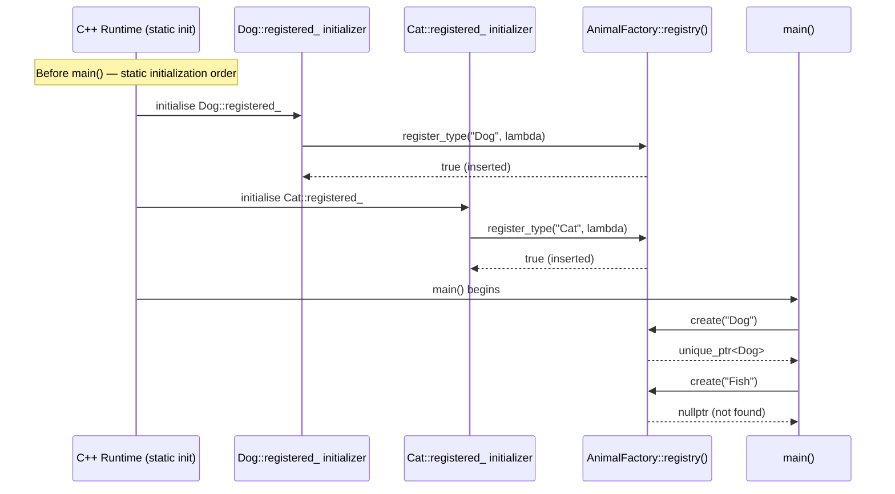

# Design Patterns — Type Erasure, Observer, and Self-Registering Factory

> Source headers: `include/foundation/patterns/`
> Tests: `tests/test_patterns.cpp` | Demo: `demos/patterns_demo.cpp`

---

## Table of Contents

1. [Type Erasure — AnyCallable\<Ret(Args...)\>](#1-type-erasure--anycallableretargs)
2. [Type Erasure vs std::function vs Virtual Base](#2-type-erasure-vs-stdfunction-vs-virtual-base)
3. [EventEmitter\<EventT\> — Observer Without Inheritance](#3-eventemittereventt--observer-without-inheritance)
4. [Self-Registering Factory — AnimalFactory](#4-self-registering-factory--animalfactory)
5. [Factory Registration Flow Diagram](#5-factory-registration-flow-diagram)
6. [Interview Talking Points](#6-interview-talking-points)

---

## 1. Type Erasure — AnyCallable\<Ret(Args...)\>

### The Problem

When you want to store heterogeneous callables (lambdas, function pointers, functors) in a container or member variable, you hit a wall: each lambda has a **unique, unnamed type** that the compiler generates. You cannot write a `std::vector<???>` that holds three different lambda types without either:

- Making everything a template (which pushes the type into the interface/header and prevents runtime polymorphism), or
- Erasing the concrete type behind a uniform interface.

Type erasure is the technique of hiding the concrete type behind a virtual interface so callers only know the **signature**, not the underlying callable type.

### Implementation

```cpp
// include/foundation/patterns/type_erasure.hpp

template<typename Sig> class AnyCallable;  // primary template — uninstantiatable

template<typename Ret, typename... Args>
class AnyCallable<Ret(Args...)> {

    // --- Inner virtual interface ---
    // Caller only ever sees Base*. The concrete type lives inside Wrapper<F>.
    struct Base {
        virtual ~Base() = default;
        virtual Ret call(Args...) = 0;
        virtual std::unique_ptr<Base> clone() const = 0;  // needed for copy
    };

    // --- Concrete wrapper — templated on F, hidden from the outside ---
    template<typename F>
    struct Wrapper final : Base {
        F fn;
        explicit Wrapper(F f) : fn{std::move(f)} {}

        // Dispatch to the wrapped callable
        Ret call(Args... args) override { return fn(args...); }

        // Deep-copy the callable for AnyCallable's copy constructor
        std::unique_ptr<Base> clone() const override {
            return std::make_unique<Wrapper>(fn);
        }
    };

    std::unique_ptr<Base> impl_;  // owns the erased callable

public:
    AnyCallable() = default;  // empty / null state

    // Constructing from any F: decay_t strips reference/const qualifiers
    template<typename F>
    AnyCallable(F f)
        : impl_{std::make_unique<Wrapper<std::decay_t<F>>>(std::move(f))} {}

    // Copy: delegate to virtual clone() — each Wrapper knows how to copy itself
    AnyCallable(const AnyCallable& o)
        : impl_{o.impl_ ? o.impl_->clone() : nullptr} {}

    AnyCallable(AnyCallable&&) = default;

    // Copy-and-swap idiom: parameter is taken by value (invokes copy or move ctor)
    // then impl_ is swapped with the local copy — exception safe, self-assign safe
    AnyCallable& operator=(AnyCallable o) {
        std::swap(impl_, o.impl_);
        return *this;
    }

    Ret operator()(Args... args) const { return impl_->call(args...); }
    explicit operator bool() const noexcept { return impl_ != nullptr; }
};
```

**Annotated data flow:**

```
AnyCallable<int(int)> f([](int x){ return x*2; });
         │
         ▼
  impl_ = unique_ptr<Base>
              │
              └──► Wrapper<lambda_type>
                        fn = the lambda
                        call(5) → fn(5) → 10
```

**Why `clone()` for copy support:**

`std::unique_ptr` is move-only. To make `AnyCallable` copyable, the copy constructor must allocate a new `Wrapper` with a copy of `fn`. The virtual `clone()` method lets each `Wrapper<F>` perform a type-safe copy of its own `F fn` without the outer class needing to know `F`.

---

## 2. Type Erasure vs std::function vs Virtual Base

| Dimension | `AnyCallable<Ret(Args...)>` | `std::function<Ret(Args...)>` | Virtual base class |
|---|---|---|---|
| Purpose | Pedagogical — exposes the mechanism | Production-ready standard library | Object-oriented polymorphism |
| Signature constraint | Single fixed signature | Single fixed signature | Multiple virtual methods possible |
| Storage | Heap via `unique_ptr` | SBO (small buffer optimisation) + heap | Typically heap (`new` / `shared_ptr`) |
| Copy support | Yes (via `clone()`) | Yes | Depends on design |
| Overhead | One virtual call per invocation | One virtual call per invocation | One virtual call per invocation |
| Capturing state | Any `F` with any captured state | Same | Only via member variables |
| Open/closed | Adding new callable: no changes needed | Same | Adding new method: change all subclasses |
| When to use | Learning / custom needs | Default choice | When you need multiple related methods |

**Rule of thumb:** reach for `std::function` in production. Implement `AnyCallable` in an interview to demonstrate you understand the underlying mechanism.

---

## 3. EventEmitter\<EventT\> — Observer Without Inheritance

### Design

Traditional observer pattern (GoF) requires a `Listener` base class with a virtual `on_event()` method. Every subscriber must inherit from it. `EventEmitter` achieves the same result without any inheritance: subscribers are plain callables wrapped in `std::function`.

```cpp
// include/foundation/patterns/observer.hpp

using SubscriptionToken = uint64_t;  // opaque handle to a subscription

template<typename EventT>
class EventEmitter {
    using Handler = std::function<void(const EventT&)>;

    // Token -> handler map. uint64_t key allows O(1) unsubscribe.
    std::unordered_map<SubscriptionToken, Handler> handlers_;
    SubscriptionToken next_{1};  // monotonically increasing, starts at 1 (0 = invalid)

public:
    // Returns a token the caller uses to unsubscribe later
    SubscriptionToken subscribe(Handler h) {
        SubscriptionToken tok = next_++;
        handlers_.emplace(tok, std::move(h));
        return tok;
    }

    // O(1) removal — erase by key
    void unsubscribe(SubscriptionToken tok) { handlers_.erase(tok); }

    // Fire all handlers. const: emit does not modify subscriber list.
    void emit(const EventT& event) const {
        for (auto& [tok, h] : handlers_) h(event);
    }
};
```

**Usage pattern from the demo:**

```cpp
struct UserEvent { std::string name; int id; };
foundation::EventEmitter<UserEvent> bus;

// Subscribe — store token to enable later unsubscription
auto tok1 = bus.subscribe([](const UserEvent& e){
    std::cout << "Logger: " << e.name << " joined\n";
});
auto tok2 = bus.subscribe([](const UserEvent& e){
    std::cout << "Notifier: welcome email to " << e.name << "\n";
});

bus.emit({"Alice", 1});  // both handlers fire

bus.unsubscribe(tok1);   // logger removed
bus.emit({"Carol", 3});  // only notifier fires
```

**Single-threaded caveat:** `emit`, `subscribe`, and `unsubscribe` are not synchronized. For multi-threaded use, guard all three with a `std::mutex` (or use a `std::shared_mutex` if reads — `emit` — are more frequent than writes):

```cpp
// Thread-safe extension sketch
std::shared_mutex mtx_;

SubscriptionToken subscribe(Handler h) {
    std::unique_lock lock{mtx_};  // exclusive write
    ...
}
void emit(const EventT& event) const {
    std::shared_lock lock{mtx_};  // shared read
    ...
}
```

**Key properties:**

- No `Listener` base class — any lambda or callable works as a subscriber.
- Unsubscription in O(1) via `unordered_map::erase`.
- Emission iterates handlers in unspecified order (hash map — no ordering guarantee).
- Multiple independent emitters can coexist with no shared state.

---

## 4. Self-Registering Factory — AnimalFactory

### The Problem with Switch-Based Factories

The naive factory pattern uses a switch or if-else chain:

```cpp
// BAD: every new animal type requires editing this function
std::unique_ptr<Animal> create(const std::string& name) {
    if (name == "Dog") return std::make_unique<Dog>();
    if (name == "Cat") return std::make_unique<Cat>();
    return nullptr;
}
```

This violates the **Open/Closed Principle**: the factory is closed for modification in theory but forces modification in practice every time a new type is added. It also concentrates knowledge of all subtypes in one file.

### Self-Registering Design

Each concrete type registers itself into a central registry at **static initialisation time** — before `main()` runs. The factory function has no knowledge of individual types.

```cpp
// include/foundation/patterns/factory.hpp

struct Animal {
    virtual ~Animal() = default;
    virtual std::string speak() const = 0;
};

class AnimalFactory {
    using Creator = std::function<std::unique_ptr<Animal>()>;

    // Meyers singleton: function-local static. Guaranteed to be initialised
    // on first call — safe even if called during static init of other globals.
    static std::unordered_map<std::string, Creator>& registry() {
        static std::unordered_map<std::string, Creator> reg;
        return reg;
    }

public:
    // Called by each type at static init time — returns bool for the
    // inline const bool trick (see below)
    static bool register_type(const std::string& name, Creator creator) {
        return registry().emplace(name, std::move(creator)).second;
    }

    // Lookup and invoke — no knowledge of Dog, Cat, or any concrete type
    static std::unique_ptr<Animal> create(const std::string& name) {
        auto it = registry().find(name);
        if (it == registry().end()) return nullptr;
        return it->second();  // invoke the stored factory lambda
    }
};
```

### The `inline const bool` Registration Trick

```cpp
struct Dog : Animal {
    std::string speak() const override { return "Woof"; }
    static const bool registered_;  // declaration
};

// Definition — runs before main(), calls register_type as a side effect
inline const bool Dog::registered_ =
    AnimalFactory::register_type("Dog", []{ return std::make_unique<Dog>(); });
```

**Why this works:**

1. `inline const bool Dog::registered_` is a definition of a static data member. The C++ standard guarantees that definitions of static variables with static storage duration are initialised before `main()`.
2. The initialiser `AnimalFactory::register_type(...)` is called as part of that initialisation, inserting "Dog" into the registry.
3. The `inline` keyword (C++17) makes the definition header-safe — including the header in multiple translation units does not cause ODR violations or duplicate registrations.
4. The `bool` return value from `emplace().second` is stored in `registered_` merely to give the side-effectful call somewhere to live. The value itself is never read.

**Adding a new animal type:**

1. Write a new struct inheriting `Animal` in a new header.
2. Add the two-line `inline const bool` self-registration.
3. Include the header anywhere in the project.

The factory function requires zero changes.

---

## 5. Factory Registration Flow Diagram



---

## 6. Interview Talking Points

### Type Erasure

- "Type erasure separates the interface from the implementation type. The caller knows `AnyCallable<int(int)>` — it doesn't know whether the callable is a lambda, a functor, or a function pointer. This enables heterogeneous storage and runtime substitution."
- "The `clone()` virtual method is the secret to making it copyable. `std::unique_ptr` is move-only, so we need the underlying object to teach the outer class how to copy itself, without the outer class knowing the concrete type."
- "Copy-and-swap in `operator=` gives strong exception safety. If the copy constructor throws, the original `impl_` is never modified. The local parameter catches the exception on its way out."
- "Compared to `std::function`: `std::function` uses small buffer optimisation (SBO) to avoid heap allocation for small callables. `AnyCallable` always heap-allocates. In production, use `std::function` unless you need custom allocation or move-only semantics."

### EventEmitter / Observer

- "The classic GoF Observer requires subscribers to inherit a `Listener` interface. This creates coupling — the subscriber type must know about the event system at definition time. Using `std::function` as the handler type removes that coupling entirely."
- "The `SubscriptionToken` is critical for correct unsubscription. Without it, you'd need to store the handler and rely on equality comparison of `std::function`, which is not supported. The opaque integer token gives O(1) lookup and removal."
- "The single-threaded caveat is a real production concern. In a multi-threaded system, `emit` racing with `unsubscribe` is undefined behaviour. The fix is a `shared_mutex` — shared lock for `emit` (multiple concurrent emitters are safe), exclusive lock for subscribe/unsubscribe."

### Self-Registering Factory

- "The Open/Closed Principle says: open for extension, closed for modification. The switch-based factory violates this — every new type modifies the factory. Self-registration is closed: the factory function never changes, new types extend it by simply including the right header."
- "The Meyers singleton (`static` local variable inside a function) avoids the static initialisation order fiasco. If Dog's initialiser calls `registry()` and the map were a plain global, there'd be no guarantee the map was constructed first. The function-local static is guaranteed to be constructed on first call."
- "The `inline` keyword on the static member definition is a C++17 feature. Without it, you'd need the definition in exactly one `.cpp` file. With `inline`, the header can be safely included in many translation units."
- "A weakness: if the header is never included (e.g., a library translation unit is not linked), the type never registers. This is the 'plugin linkage' problem — common solutions include linker scripts, explicit list files, or a registration call in a constructor."
