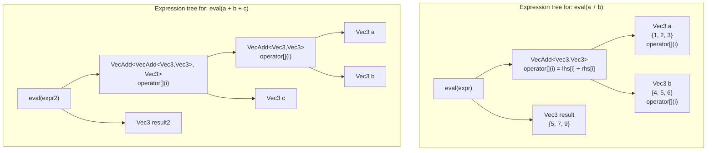

# Templates and Generic Programming in C++

A deep-dive into type traits, variadic templates, C++20 concepts, policy-based design, and expression templates as implemented in `foundation/templates/`.

---

## Table of Contents

1. [remove_cvref — Type Transformation](#remove_cvref--type-transformation)
2. [TypeList — Compile-Time Type Sequences](#typelist--compile-time-type-sequences)
3. [void_t and SFINAE Detection](#void_t-and-sfinae-detection)
4. [pow_ct — Compile-Time Integer Power](#pow_ct--compile-time-integer-power)
5. [Fold Expressions](#fold-expressions)
6. [C++20 Concepts](#c20-concepts)
7. [Policy-Based Design](#policy-based-design)
8. [Expression Templates](#expression-templates)
9. [Expression Template Tree Diagram](#expression-template-tree-diagram)
10. [Running the Demo and Tests](#running-the-demo-and-tests)
11. [Interview Talking Points](#interview-talking-points)

---

## remove_cvref — Type Transformation

**File:** `include/foundation/templates/type_traits.hpp`

C++20 introduced `std::remove_cvref`, but understanding its composition illuminates how type transformations compose in the standard library.

```cpp
template<typename T>
struct remove_cvref {
    using type = std::remove_cv_t<std::remove_reference_t<T>>;
    //                            ^^^^^^^^^^^^^^^^^^^^^^^^^^^
    //     Step 1: strip the reference (& or &&) → gives the referred-to type
    //     Step 2: strip const/volatile qualifiers from that type
};

template<typename T>
using remove_cvref_t = typename remove_cvref<T>::type;
```

### Why It Is Needed

Template functions frequently receive forwarding references (`T&&`) whose actual type carries noise:

| Input type `T` | `remove_reference_t<T>` | `remove_cvref_t<T>` |
|---|---|---|
| `int` | `int` | `int` |
| `const int&` | `const int` | `int` |
| `volatile double&&` | `volatile double` | `double` |
| `const char* const&` | `const char* const` | `const char*` |

Note: `remove_cvref` strips the top-level `const`/`volatile` from the *type itself*, not from what a pointer points to. `const char*` becomes `const char*` — the pointer is non-const, so there is nothing to strip at the top level.

The composition order matters: you must remove the reference first. If you tried to strip `const` from `const int&`, you would get `int&` — the reference prevents `remove_cv` from seeing the `const`. Remove the reference first to expose the bare type.

---

## TypeList — Compile-Time Type Sequences

**File:** `include/foundation/templates/type_traits.hpp`

`TypeList<Ts...>` is a zero-runtime-overhead container of types. It exists solely at compile time — no data members, no instantiated objects.

```cpp
template<typename... Ts>
struct TypeList {
    static constexpr std::size_t size = sizeof...(Ts);
    // sizeof...(Ts) is a compile-time constant: the number of types in the pack
};

using MyList = TypeList<int, double, float>;
// MyList::size == 3 — computed entirely by the compiler
```

### `type_at<List, I>` — Recursive Specialization

Accessing the I-th type requires peeling types off the front of the list recursively:

```cpp
// Primary template — declared but not defined
// (instantiating it would be a compile error, which is intentional)
template<typename List, std::size_t I> struct type_at;

// Recursive case: I > 0 — strip Head and decrement I
template<typename Head, typename... Tail, std::size_t I>
struct type_at<TypeList<Head, Tail...>, I>
    : type_at<TypeList<Tail...>, I - 1> {};
//  ^^^^^^^^^^^^^^^^^^^^^^^^^^^^^^^^^^
//  Inherit from the result of asking for index (I-1) in the remaining list.
//  This is compile-time recursion — the compiler expands this at instantiation.

// Base case: I == 0 — Head is the answer
template<typename Head, typename... Tail>
struct type_at<TypeList<Head, Tail...>, 0> {
    using type = Head;
};

template<typename List, std::size_t I>
using type_at_t = typename type_at<List, I>::type;
```

Example: `type_at_t<TypeList<int, double, float>, 2>` expands as:
1. `type_at<TypeList<int, double, float>, 2>` → strip `int`, recurse with `I=1`
2. `type_at<TypeList<double, float>, 1>` → strip `double`, recurse with `I=0`
3. `type_at<TypeList<float>, 0>` → base case: `type = float`

All of this happens at compile time. At runtime, `type_at_t<L, 2>` is simply `float` — the template machinery has been erased.

### `type_list_contains` — Membership Check

```cpp
// Base case: empty list → not found
template<typename List, typename T>
struct type_list_contains : std::false_type {};

// Recursive case: check head, then tail
template<typename Head, typename... Tail, typename T>
struct type_list_contains<TypeList<Head, Tail...>, T>
    : std::conditional_t<
        std::is_same_v<Head, T>,     // if Head == T
        std::true_type,              //   → found
        type_list_contains<TypeList<Tail...>, T>  // else check tail
      > {};

template<typename List, typename T>
inline constexpr bool type_list_contains_v = type_list_contains<List, T>::value;
```

`std::conditional_t<Cond, A, B>` selects type `A` if `Cond` is true, `B` otherwise — all at compile time. The struct then inherits from the selected type, making its `value` member `true` or `false`.

---

## void_t and SFINAE Detection

**File:** `include/foundation/templates/type_traits.hpp`

`void_t` is the key to the detection idiom: detect at compile time whether a type has a particular member, method, or nested type.

```cpp
// void_t: maps any set of valid types to void
template<typename...> using void_t = void;
// If any type in the pack is ill-formed, substitution fails (SFINAE)
```

### `has_size<T>` — Detecting a `.size()` Member

```cpp
// Primary template: assume T does NOT have .size()
template<typename T, typename = void>
struct has_size : std::false_type {};

// Specialization: valid only if the expression T{}.size() is well-formed
template<typename T>
struct has_size<T, void_t<decltype(std::declval<T>().size())>>
    : std::true_type {};
//                   ^^^^^^^^^^^^^^^^^^^^^^^^^^^^^^^^^^^^^^^
//   void_t<...> succeeds if decltype(...) is a valid type.
//   decltype(std::declval<T>().size()) asks: "what is the return type
//   of calling .size() on a T?" — without constructing any T object.
//   If T has no .size(), this decltype expression is ill-formed,
//   void_t substitution fails (SFINAE), and the primary template is used.

template<typename T>
inline constexpr bool has_size_v = has_size<T>::value;
```

The tests confirm:

```cpp
static_assert(foundation::has_size<std::vector<int>>::value);  // true: vector has .size()
static_assert(!foundation::has_size<int>::value);              // false: int has no .size()
```

**SFINAE** (Substitution Failure Is Not An Error): when template argument substitution produces an invalid type or expression, the compiler silently discards that overload/specialization instead of issuing an error. It only becomes an error if no valid overload remains.

In C++20 this pattern is superseded by concepts (see below), but it remains important for library code that must support C++17.

---

## pow_ct — Compile-Time Integer Power

**File:** `include/foundation/templates/type_traits.hpp`

```cpp
// Recursive case: Base^Exp = Base * Base^(Exp-1)
template<long long Base, unsigned Exp>
struct pow_ct {
    static constexpr long long value = Base * pow_ct<Base, Exp - 1>::value;
};

// Base case: anything^0 = 1
template<long long Base>
struct pow_ct<Base, 0> {
    static constexpr long long value = 1;
};

template<long long Base, unsigned Exp>
inline constexpr long long pow_ct_v = pow_ct<Base, Exp>::value;
```

`pow_ct<2, 10>::value` expands as: `2 * pow_ct<2,9>::value` → ... → `2 * pow_ct<2,0>::value` → `2 * 1` — all collapsed by the compiler into the constant `1024`. No runtime computation occurs.

The tests verify:

```cpp
static_assert(foundation::pow_ct<2, 10>::value == 1024);
static_assert(foundation::pow_ct<3, 3>::value  == 27);
```

Today you would write this as a `constexpr` function, which is cleaner. The template metaprogramming form predates C++11 `constexpr` and remains common in legacy codebases and library internals.

---

## Fold Expressions

**File:** `include/foundation/templates/variadic.hpp`

C++17 fold expressions collapse a parameter pack over a binary operator in a single syntactic form. They replace C++11/14 recursive variadic templates for most practical purposes.

### Left Fold Syntax

```
(... op pack)
```

For a pack `a, b, c, d`, `(... + pack)` expands to `((a + b) + c) + d` — left-to-right.

### `sum` and `product`

```cpp
// Left fold over +: ((arg1 + arg2) + arg3) + ...
template<typename... Ts>
auto sum(Ts&&... args) {
    return (... + std::forward<Ts>(args));
}

// Left fold over *
template<typename... Ts>
auto product(Ts&&... args) {
    return (... * std::forward<Ts>(args));
}
```

`sum(1, 2, 3, 4)` → `((1 + 2) + 3) + 4` = `10`. Works with any types that support `operator+` — ints, doubles, even strings.

### `all_of` and `any_of`

```cpp
// Left fold over &&: short-circuits (the compiler may optimize this)
template<typename... Bools>
constexpr bool all_of(Bools... bs) {
    return (... && bs);
    // true && true && false → false (stops at first false)
}

// Left fold over ||
template<typename... Bools>
constexpr bool any_of(Bools... bs) {
    return (... || bs);
    // false || false || true → true
}
```

These are `constexpr` — they can be evaluated at compile time if all arguments are compile-time constants.

### `for_each_arg` — Comma Fold

```cpp
// Comma fold: evaluates f(arg) for each arg, in order
template<typename F, typename... Ts>
void for_each_arg(F&& f, Ts&&... args) {
    (f(std::forward<Ts>(args)), ...);
    // Expands to: f(a), (f(b), (f(c), ...))
    // The comma operator guarantees left-to-right evaluation
}
```

Usage (from the test):

```cpp
int count = 0;
foundation::for_each_arg([&](auto){ ++count; }, 1, 2.0, 'x', "str");
// count == 4 — the lambda is called once per argument, types can differ
```

### Before Fold Expressions (C++11/14 style)

```cpp
// Recursive pre-C++17 implementation — verbose, requires a base case
inline void print_all_recursive() {}  // base case: empty pack

template<typename Head, typename... Tail>
void print_all_recursive(Head&& h, Tail&&... tail) {
    process(h);                                      // handle head
    print_all_recursive(std::forward<Tail>(tail)...); // recurse on tail
}

// C++17 equivalent using fold — one line:
template<typename... Ts>
void print_all_fold(Ts&&... args) {
    for_each_arg([](auto&& v){ process(v); }, std::forward<Ts>(args)...);
}
```

The fold expression version generates a flat expansion. The recursive version generates `N` function template instantiations, each calling the next. Fold expressions are faster to compile and easier to read.

---

## C++20 Concepts

**File:** `include/foundation/templates/concepts.hpp`

Concepts constrain template parameters. They make error messages comprehensible and document intent directly in the function signature.

### `Printable`

```cpp
template<typename T>
concept Printable = requires(T v, std::ostream& os) {
    { os << v } -> std::same_as<std::ostream&>;
    //  ^^^^^^^^    ^^^^^^^^^^^^^^^^^^^^^^^^^^^
    //  Expression  Constraint on the return type
};
// "T is Printable if os << v is a valid expression that returns std::ostream&"
```

### `Numeric`

```cpp
template<typename T>
concept Numeric = std::is_arithmetic_v<T> && !std::is_pointer_v<T>;
// Concepts can combine type-trait predicates with &&/||
// Arithmetic: integral + floating-point types
// Excludes pointers (pointers are technically arithmetic in C but not here)
```

### `Addable`

```cpp
template<typename T>
concept Addable = requires(T a, T b) {
    { a + b } -> std::convertible_to<T>;
    // "a + b must be valid and the result must be convertible to T"
};
```

### `Container`

```cpp
template<typename C>
concept Container = requires(C c) {
    { c.begin() } -> std::input_or_output_iterator;
    { c.end()   } -> std::input_or_output_iterator;
};
```

### Using Concepts — Three Equivalent Syntaxes

```cpp
// 1. Abbreviated template syntax (most concise — C++20)
auto add(Numeric auto a, Numeric auto b) { return a + b; }
//       ^^^^^^^^^^^^                          — each parameter independently constrained

// 2. requires-clause after template parameter list
template<typename T> requires Numeric<T>
T clamp(T val, T lo, T hi) {
    return val < lo ? lo : val > hi ? hi : val;
}

// 3. Concept as template parameter constraint (most explicit)
template<Numeric T>
T scale(T val, T factor) { return val * factor; }
```

### `if constexpr` — Compile-Time Branching

```cpp
template<typename T>
std::string describe_type() {
    if constexpr (std::is_integral_v<T>)          return "integral";
    else if constexpr (std::is_floating_point_v<T>) return "float";
    else if constexpr (std::is_pointer_v<T>)      return "pointer";
    else                                           return "other";
    // Only the matching branch is compiled for each T.
    // Unlike runtime if, the discarded branches need not be well-formed.
}
```

### `consteval` — Mandatory Compile-Time Evaluation

```cpp
consteval int factorial(int n) {
    return n <= 1 ? 1 : n * factorial(n - 1);
}
// 'consteval' means: MUST be called with compile-time constant arguments.
// Calling factorial(runtime_value) is a compile error.
// Unlike 'constexpr', which allows runtime evaluation as a fallback.

static_assert(factorial(5) == 120);  // verified entirely at compile time
```

The `static_assert` at namespace scope guarantees this check runs as part of compilation — it is not a test that can fail at runtime.

---

## Policy-Based Design

**File:** `include/foundation/templates/policy.hpp`

Policy-based design (from Alexandrescu's *Modern C++ Design*) parameterizes behavior via template arguments. Algorithms become composable: swap the policy type and the behavior changes — with zero virtual overhead and no code duplication.

```cpp
// Policies: stateless structs with a static method
struct StdSortPolicy {
    template<typename It>
    static void apply(It first, It last) {
        std::sort(first, last);               // unstable, O(n log n)
    }
};

struct StableSortPolicy {
    template<typename It>
    static void apply(It first, It last) {
        std::stable_sort(first, last);        // stable, O(n log^2 n)
    }
};

struct ReverseSortPolicy {
    template<typename It>
    static void apply(It first, It last) {
        std::sort(first, last, std::greater<>{});  // descending
    }
};

// Host class: parameterized by policy, delegates to it
template<typename SortPolicy = StdSortPolicy>   // default policy
class Sorter {
public:
    template<typename It>
    void sort(It first, It last) {
        SortPolicy::apply(first, last);
        // Direct static call — no vtable, typically inlined
    }
};
```

### Swapping Policies at Compile Time

```cpp
foundation::Sorter<foundation::StdSortPolicy>     asc;   // ascending
foundation::Sorter<foundation::ReverseSortPolicy> desc;  // descending
foundation::Sorter<foundation::StableSortPolicy>  stbl;  // stable

std::vector<int> v{5, 2, 8, 1, 9, 3};
asc.sort(v.begin(), v.end());     // → 1 2 3 5 8 9
desc.sort(v.begin(), v.end());    // → 9 8 5 3 2 1
stbl.sort(v.begin(), v.end());    // → 1 2 3 5 8 9 (preserves equal element order)
```

Each `Sorter` instantiation is a distinct type. The compiler sees the exact policy at instantiation time and can inline `apply` entirely. Compare this to a virtual-based design where `sort_policy_->apply(first, last)` requires an indirect function call through a vtable.

The tests confirm behavior:

```cpp
foundation::Sorter<foundation::StdSortPolicy> s;
s.sort(v.begin(), v.end());
EXPECT_TRUE(std::is_sorted(v.begin(), v.end()));         // ascending order

foundation::Sorter<foundation::ReverseSortPolicy> rs;
rs.sort(v.begin(), v.end());
EXPECT_TRUE(std::is_sorted(v.begin(), v.end(), std::greater<int>{}));  // descending
```

---

## Expression Templates

**File:** `include/foundation/templates/policy.hpp`

Expression templates eliminate intermediate temporaries in arithmetic expressions by deferring computation until the result is materialized.

### The Problem They Solve

Without expression templates:

```cpp
Vec3 a{1, 2, 3}, b{4, 5, 6}, c{7, 8, 9};
Vec3 result = a + b + c;
// Step 1: a + b  → allocates a temporary Vec3 t1{5, 7, 9}
// Step 2: t1 + c → allocates another temporary Vec3 t2{12, 15, 18}
// Step 3: result = t2 → one more copy
// Three traversals, two unnecessary allocations
```

### The Expression Template Solution

Three classes form the expression tree:

```cpp
// 1. CRTP base for all expression nodes
template<typename E>
struct VecExpr {
    // Dispatch operator[] to the concrete expression type
    double operator[](std::size_t i) const {
        return static_cast<const E&>(*this)[i];
        // Same CRTP pattern as Shape<Derived>: no vtable
    }
};

// 2. Concrete vector — a leaf node in the expression tree
struct Vec3 : VecExpr<Vec3> {
    double x, y, z;
    Vec3(double x_, double y_, double z_) : x{x_}, y{y_}, z{z_} {}

    double operator[](std::size_t i) const {
        return i == 0 ? x : i == 1 ? y : z;
    }
};

// 3. Lazy addition node — stores REFERENCES, computes on demand
template<typename L, typename R>
struct VecAdd : VecExpr<VecAdd<L,R>> {
    const L& lhs;   // reference to left operand — no copy
    const R& rhs;   // reference to right operand — no copy

    VecAdd(const L& l, const R& r) : lhs{l}, rhs{r} {}

    // Evaluation is deferred: computes lhs[i] + rhs[i] only when asked
    double operator[](std::size_t i) const { return lhs[i] + rhs[i]; }
};

// 4. operator+ returns a lazy expression node, NOT a Vec3
template<typename L, typename R>
VecAdd<L,R> operator+(const VecExpr<L>& l, const VecExpr<R>& r) {
    return {static_cast<const L&>(l), static_cast<const R&>(r)};
    // Zero computation here. Returns a lightweight node holding two references.
}

// 5. eval() materializes the expression into a Vec3 — single traversal
template<typename E>
Vec3 eval(const VecExpr<E>& e) {
    return {e[0], e[1], e[2]};
    // e[0] calls the expression tree recursively and returns the result
    // for index 0. Exactly one traversal of the tree.
}
```

### Trace Through `a + b`

```cpp
Vec3 a{1, 2, 3};
Vec3 b{4, 5, 6};

auto expr = a + b;
// Returns VecAdd<Vec3, Vec3>{a, b}
// No Vec3 allocation. expr holds two references.

Vec3 c = eval(expr);
// eval calls expr[0] → VecAdd::operator[](0) → a[0] + b[0] → 1 + 4 = 5
// eval calls expr[1] → a[1] + b[1] = 7
// eval calls expr[2] → a[2] + b[2] = 9
// One Vec3 constructed: {5, 7, 9}
// Zero temporaries.
```

For `a + b + c`:

```cpp
auto expr = a + b + c;
// Step 1: a + b → VecAdd<Vec3, Vec3>
// Step 2: (result) + c → VecAdd<VecAdd<Vec3,Vec3>, Vec3>
// Still no Vec3 allocation — the tree grows but holds only references.

Vec3 result = eval(expr);
// One traversal: result[i] = a[i] + b[i] + c[i] for i in {0,1,2}
```

The type of `expr` encodes the entire computation: `VecAdd<VecAdd<Vec3,Vec3>, Vec3>`. The compiler sees this type and can inline the entire evaluation — it becomes equivalent to hand-written element-wise addition.

---

## Expression Template Tree Diagram



At `eval()` time, the compiler walks the tree from root to leaves, computing one element at a time. No intermediate `Vec3` objects are created. This is equivalent to a hand-written loop `result[i] = a[i] + b[i] + c[i]`.

---

## Running the Demo and Tests

### Build

```bash
cmake --preset dev
cmake --build build/dev
```

### Run the templates demo

```bash
./build/dev/demos/templates_demo
```

Expected output:

```
=== Templates Demo ===

-- TypeList ---
  size: 4
  contains double: 1
  contains bool:   0
  2^10 at compile time: 1024

-- Variadic / Fold Expressions --
  sum(1..5): 15
  product(2,3,4): 24
  all_of(T,T,F): 0
  any_of(F,F,T): 1
  for_each_arg types: i d c PKc

-- Concepts (C++20) --
  add(3, 4) = 7
  add(1.5, 2.5) = 4
  clamp(15, 0, 10) = 10
  describe int: integral
  describe vector<int>: other
  consteval 5! = 120

-- Policy-Based Sort --
  std sort: 1 2 3 5 8 9
  reverse:  9 8 5 3 2 1
  stable:   1 2 3 5 8 9

-- Expression Templates (zero temporaries) --
  (1,2,3)+(4,5,6) = (5,7,9)

Done.
```

### Run the tests

```bash
ctest --test-dir build/dev -R Templates --output-on-failure
# or directly:
./build/dev/tests/test_templates
```

---

## Interview Talking Points

**On SFINAE and `void_t`:**
- "`void_t` turns an arbitrary expression into `void` if it's valid, and causes substitution failure if it's invalid. By putting it in a default template argument, you get a specialization that only matches types with the required property."
- "In C++20 you'd write a concept instead. But `void_t` is important to recognize in C++14/17 library code."

**On `TypeList` and compile-time recursion:**
- "A `TypeList` is a zero-size type that holds type information in the parameter pack. All operations on it — `type_at`, `contains` — are compile-time recursive template specializations. No runtime data structure exists."
- "The pattern predates C++17. Today you might use `std::tuple` or a fold expression for many of the same tasks, but type lists are still common in DSL and reflection-adjacent code."

**On fold expressions:**
- "Fold expressions are the C++17 answer to pre-17 recursive variadic templates. `(... + args)` is a left fold: `((a + b) + c)`. Right fold: `(args + ...)`. Binary fold: `(init + ... + args)` — starts with an init value, useful when the pack might be empty."
- "They generate a flat expansion — the compiler does not instantiate `N` function templates, which improves compile times."

**On concepts:**
- "A concept is a named predicate on types evaluated at compile time. It constrains templates with clear semantics and produces readable error messages instead of pages of substitution failure output."
- "`consteval` is stronger than `constexpr`: it mandates compile-time evaluation. Calling a `consteval` function with a runtime argument is a hard compile error."

**On policy-based design:**
- "Policies let you compose behavior at compile time by swapping template parameters. Compared to strategy pattern with virtual dispatch, policies have zero runtime overhead: the call is direct and often inlined. The downside is that each combination is a distinct type — you cannot swap policies at runtime."

**On expression templates:**
- "Expression templates are a compile-time DAG. The `operator+` overload returns a lightweight node that holds references to its operands — no computation yet. `eval()` walks the tree once, producing the result. For large vector operations this eliminates N-1 temporary allocations."
- "The technique relies on CRTP for static dispatch through the expression hierarchy. Each node type encodes the entire computation in its type, allowing the compiler to inline and optimize the full tree."
- "Modern compilers with `-O2` can often eliminate temporaries through copy elision and dead-store elimination, but expression templates guarantee zero temporaries regardless of optimizer quality — useful in embedded or real-time code where predictability matters more than average performance."
