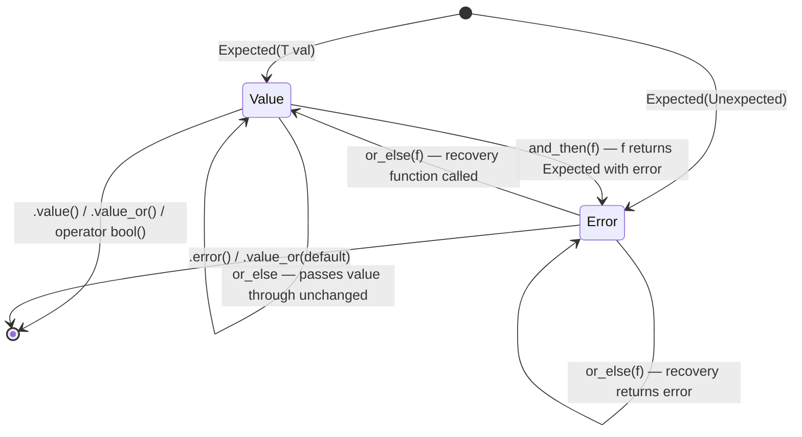

# Types — Strong Types, Variant Patterns, and Expected

> Source headers: `include/foundation/types/`
> Tests: `tests/test_types.cpp` | Demo: `demos/types_demo.cpp`

---

## Table of Contents

1. [StrongType\<T, Tag\>](#1-strongtypet-tag)
2. [User-Defined Literals (UDLs)](#2-user-defined-literals-udls)
3. [Phantom Types — UserInput\<State\>](#3-phantom-types--userinputstate)
4. [overloaded\<Fs...\> — Variadic Visitor](#4-overloadedfs--variadic-visitor)
5. [std::variant + overloaded — Shape Dispatch](#5-stdvariant--overloaded--shape-dispatch)
6. [Expected\<T, E\> — Monadic Error Handling](#6-expectedt-e--monadic-error-handling)
7. [MathError Chain Example](#7-matherror-chain-example)
8. [Expected State Machine Diagram](#8-expected-state-machine-diagram)
9. [Interview Talking Points](#9-interview-talking-points)

---

## 1. StrongType\<T, Tag\>

### The Aliasing Problem

C++ `typedef` and `using` create aliases, not new types. Consider a navigation function:

```cpp
// BAD: both parameters are double — the compiler cannot catch this bug
void set_waypoint(double km, double seconds);

set_waypoint(3.0, 5.0);   // correct intent
set_waypoint(5.0, 3.0);   // SILENT BUG — arguments swapped
```

`StrongType` wraps a value together with a **phantom tag type**. Different tags produce incompatible types, so the compiler rejects the swap at compile time.

### Implementation

```cpp
// include/foundation/types/strong_type.hpp

template<typename T, typename Tag>
class StrongType {
    T value_;
public:
    // explicit prevents implicit conversion from T
    // constexpr enables use in compile-time contexts
    explicit constexpr StrongType(T v) : value_{std::move(v)} {}

    constexpr T  value() const noexcept { return value_; }  // read
    constexpr T& value()       noexcept { return value_; }  // write

    // <=> with = default generates ==, !=, <, >, <=, >= automatically
    constexpr auto operator<=>(const StrongType&) const = default;

    // friend: defined inside the template — found by ADL, not polluting namespace
    friend std::ostream& operator<<(std::ostream& os, const StrongType& st) {
        return os << st.value_;
    }
};
```

**Key design decisions:**

| Choice | Why |
|---|---|
| `explicit` constructor | Prevents `Kilometers k = 5.0;` — must write `Kilometers{5.0}` |
| `constexpr` throughout | Allows use in `static_assert`, template non-type params, `consteval` |
| `operator<=>` `= default` | Compiler generates all six comparison operators via member-wise three-way comparison |
| `friend operator<<` | Defined inside the class body — ADL finds it without polluting `foundation::` |
| Phantom `Tag` | Tag is **never instantiated**; it exists solely to make `StrongType<double, KmTag>` and `StrongType<double, SecTag>` incompatible |

### Predefined Types

```cpp
using Kilometers = StrongType<double, struct KilometersTag>;
using Seconds    = StrongType<double, struct SecondsTag>;
using Meters     = StrongType<double, struct MetersTag>;
```

`struct KilometersTag` is declared inline as a tag — it has no members and is never defined anywhere else. The compiler uses it purely for type identity.

---

## 2. User-Defined Literals (UDLs)

```cpp
// inside namespace foundation::literals

Kilometers operator""_km(long double v) { return Kilometers{static_cast<double>(v)}; }
Seconds    operator""_s (long double v) { return Seconds   {static_cast<double>(v)}; }
Meters     operator""_m (long double v) { return Meters    {static_cast<double>(v)}; }
```

**Usage:**

```cpp
using namespace foundation::literals;

auto dist = 5.0_km;   // type: Kilometers
auto time = 3.0_s;    // type: Seconds
auto len  = 10.0_m;   // type: Meters

// Compiler error — cannot pass Seconds where Kilometers expected:
// void travel(Kilometers k);
// travel(time);  // error: no matching function
```

**The `long double` parameter requirement:** The C++ standard requires that UDL operators for floating-point literals take `long double` as their parameter, not `double`. The literal `5.0_km` is parsed by the compiler as a `long double` value passed to `operator""_km`. The `static_cast<double>` truncates it to the stored precision. Using `double` directly as the parameter type is ill-formed per [lex.ext].

**Scope discipline:** UDLs live in `foundation::literals` — a sub-namespace. Users opt in with `using namespace foundation::literals` only where needed, preventing name pollution in headers.

---

## 3. Phantom Types — UserInput\<State\>

### The Problem

Runtime validation is easy to forget. A function that accepts a raw string and one that accepts a validated string look identical from the caller's perspective:

```cpp
void process(const std::string& input);  // validated or not? the type won't say
```

Phantom types encode validation state into the type so the compiler enforces it.

### Implementation

```cpp
struct Unverified {};
struct Verified   {};

template<typename State = Unverified>
class UserInput {
    std::string raw_;
    explicit UserInput(std::string s) : raw_{std::move(s)} {}
    template<typename S> friend class UserInput;  // allows Unverified to construct Verified

public:
    // Factory: the only way to create an Unverified input (constructor is private)
    static UserInput<Unverified> from_raw(std::string s) {
        return UserInput<Unverified>{std::move(s)};
    }

    // C++20 requires clause: this method only exists when State == Unverified.
    // Calling .verify() on a UserInput<Verified> is a hard compile error.
    UserInput<Verified> verify() const
        requires std::is_same_v<State, Unverified>
    {
        // real sanitisation / validation logic goes here
        return UserInput<Verified>{raw_};
    }

    const std::string& get() const { return raw_; }
};
```

**Why the compiler prevents double-verification:**

`UserInput<Verified>` is a completely different type from `UserInput<Unverified>` — they share a template definition but their instantiations are separate types. The `requires` constraint removes `verify()` from the `Verified` instantiation's overload set entirely, so calling it is a compile-time error, not a runtime check.

```cpp
auto raw      = UserInput<>::from_raw("hello");
auto verified = raw.verify();           // OK
// verified.verify();                   // compile error: no matching member function
```

**Encoding state transitions in the type system** is a core technique for making illegal states unrepresentable.

---

## 4. overloaded\<Fs...\> — Variadic Visitor

`std::visit` requires a single callable that handles every alternative in a variant. Writing a single struct with multiple `operator()` overloads by hand is verbose. `overloaded` composes any set of lambdas into one:

```cpp
// include/foundation/types/variant_patterns.hpp

// Inherit from every F in the pack — each brings its operator() into scope
template<typename... Fs>
struct overloaded : Fs... { using Fs::operator()...; };

// CTAD deduction guide: overloaded{f1, f2, f3} deduces overloaded<F1,F2,F3>
template<typename... Fs> overloaded(Fs...) -> overloaded<Fs...>;
```

**How it works:**

1. `struct overloaded : Fs...` — multiple inheritance from every lambda type.
2. `using Fs::operator()...` — pack expansion pulls each `operator()` into `overloaded`'s overload set.
3. The deduction guide lets you write `overloaded{...}` without spelling out template arguments (C++17 CTAD).

When `std::visit` calls the resulting object, normal overload resolution picks the lambda whose parameter type matches the active alternative.

---

## 5. std::variant + overloaded — Shape Dispatch

```cpp
struct CircleShape    { double radius; };
struct RectangleShape { double width, height; };
struct TriangleShape  { double base, height; };

using Shape = std::variant<CircleShape, RectangleShape, TriangleShape>;
```

### shape_area

```cpp
inline double shape_area(const Shape& s) {
    return std::visit(overloaded{
        // Each lambda handles exactly one alternative — exhaustiveness is checked
        // at compile time. Adding a new variant member without adding a handler
        // is a compile error.
        [](const CircleShape&    c) { return std::numbers::pi * c.radius * c.radius; },
        [](const RectangleShape& r) { return r.width * r.height; },
        [](const TriangleShape&  t) { return 0.5 * t.base * t.height; }
    }, s);
}
```

### shape_name

```cpp
inline std::string shape_name(const Shape& s) {
    return std::visit(overloaded{
        [](const CircleShape&)    { return std::string("Circle"); },
        [](const RectangleShape&) { return std::string("Rectangle"); },
        [](const TriangleShape&)  { return std::string("Triangle"); }
    }, s);
}
```

**Key property:** `std::variant` holds exactly one alternative at a time. `std::visit` dispatches to the right lambda via an internal vtable-like jump table — no `dynamic_cast`, no manual `if`/`else if` chains. The compiler verifies that every alternative is handled.

**Advantages over inheritance:**

| `std::variant` + `overloaded` | Virtual dispatch |
|---|---|
| Value semantics (stack allocated) | Pointer/reference semantics (heap typical) |
| Closed set of types, compiler-checked exhaustiveness | Open set, exhaustiveness not checked |
| Adding an alternative breaks all visit sites (good: forces updates) | Adding a derived class is silent |
| No virtual table overhead | vtable pointer per object |

---

## 6. Expected\<T, E\> — Monadic Error Handling

### The Problem with Exceptions and Error Codes

- **Exceptions** are invisible in signatures, expensive on the error path, and cannot cross C boundaries.
- **Error codes** (`errno`, return int) are silently ignorable and can't carry a value simultaneously with the error.

`Expected<T, E>` (a polyfill for C++23 `std::expected`) encodes "either a value of type T or an error of type E" in the return type itself — both sides are explicit, neither is ignorable by the type system.

### Unexpected\<E\> Wrapper

```cpp
template<typename E>
struct Unexpected {
    E error;
    explicit Unexpected(E e) : error{std::move(e)} {}
};

template<typename E>
Unexpected<E> make_unexpected(E e) { return Unexpected<E>{std::move(e)}; }
```

`Unexpected` distinguishes "returning an error" from "returning a value of type E", solving the ambiguity that would arise if `Expected<int,int>` accepted a plain `int` for both cases.

### Expected\<T, E\> Internals

```cpp
template<typename T, typename E>
class Expected {
    std::variant<T, E> data_;  // holds either T or E — never both, never neither
    bool has_value_;

public:
    Expected(T val)            // value path
        : data_{std::move(val)}, has_value_{true} {}
    Expected(Unexpected<E> err) // error path — requires wrapping in Unexpected
        : data_{std::move(err.error)}, has_value_{false} {}

    bool has_value() const noexcept { return has_value_; }
    explicit operator bool() const noexcept { return has_value_; }

    // Throws if no value — use has_value() or operator bool() to check first
    T& value() & { ... }
    const T& value() const& { ... }

    // Safe fallback — never throws
    T value_or(T def) const { return has_value_ ? std::get<T>(data_) : def; }

    // Throws if no error
    const E& error() const { ... }
```

### Monadic Interface

#### `.and_then(f)` — transform value, propagate error

```cpp
template<typename F>
auto and_then(F&& f) const -> decltype(f(std::declval<T>())) {
    using Ret = decltype(f(std::declval<T>()));
    if (has_value_)
        return f(std::get<T>(data_));     // call f with the value
    return Ret{Unexpected<E>{std::get<E>(data_)}};  // propagate error unchanged
}
```

`and_then` is **flat-map**: `f` must return an `Expected`. If the current object holds an error, `f` is never called — the error short-circuits the chain.

#### `.or_else(f)` — recover from error, propagate value

```cpp
template<typename F>
auto or_else(F&& f) const -> decltype(f(std::declval<E>())) {
    using Ret = decltype(f(std::declval<E>()));
    if (!has_value_)
        return f(std::get<E>(data_));    // call recovery function with the error
    return Ret{std::get<T>(data_)};      // pass value through unchanged
}
```

`or_else` is the complement of `and_then`: it handles the error side and passes the value through untouched.

---

## 7. MathError Chain Example

```cpp
enum class MathError { DivisionByZero, NegativeSqrt, ParseError };

// Each function returns Expected — callers cannot ignore the error case
inline Expected<double, MathError> safe_divide(double a, double b) {
    if (b == 0.0) return make_unexpected(MathError::DivisionByZero);
    return a / b;
}

inline Expected<double, MathError> safe_sqrt(double x) {
    if (x < 0.0) return make_unexpected(MathError::NegativeSqrt);
    return std::sqrt(x);
}

inline Expected<double, MathError> parse_double(const std::string& s) {
    try {
        std::size_t pos{};
        double v = std::stod(s, &pos);
        if (pos != s.size()) return make_unexpected(MathError::ParseError);
        return v;
    } catch (...) {
        return make_unexpected(MathError::ParseError);
    }
}

// Monadic chain: parse string -> sqrt
// If parse fails, and_then short-circuits — safe_sqrt is never called
inline Expected<double, MathError> parse_and_sqrt(const std::string& s) {
    return parse_double(s).and_then(safe_sqrt);
}
```

**Usage examples from the demo:**

```cpp
// Success path: "25.0" -> 25.0 -> sqrt -> 5.0
auto r = parse_and_sqrt("25.0");
// r.has_value() == true, r.value() == 5.0

// Error path: "bad" -> ParseError -> and_then skipped
auto r2 = parse_and_sqrt("bad");
// r2.has_value() == false, r2.error() == MathError::ParseError

// Safe fallback
double v = safe_divide(1.0, 0.0).value_or(-999.0);
// v == -999.0

// Recovery with or_else
auto recovered = safe_divide(1.0, 0.0)
    .or_else([](MathError){ return Expected<double, MathError>{0.0}; });
// recovered.value() == 0.0
```

**Multi-step chain with and_then:**

```cpp
// safe_divide(16,2) = 8  ----and_then----> safe_sqrt(8) = 2.828...
auto r = safe_divide(16.0, 2.0).and_then(safe_sqrt);
// r.value() ~= 2.828

// Error propagation: divide by zero short-circuits sqrt
auto r2 = safe_divide(1.0, 0.0).and_then(safe_sqrt);
// r2.error() == MathError::DivisionByZero
```

---

## 8. Expected State Machine Diagram



---

## 9. Interview Talking Points

**StrongType:**
- "It solves the aliasing problem — `double` and `double` are the same type, so `void f(double km, double seconds)` offers no protection against swapped arguments. By wrapping each in a distinct tag, the compiler enforces correct usage at zero runtime cost."
- "The phantom tag is never instantiated — it's pure compile-time identity. The wrapper is `constexpr` throughout, so the abstraction costs nothing at runtime."
- "`operator<=>` with `= default` generates all six comparison operators. Before C++20 you'd write five separate operators by hand."

**UDLs:**
- "The standard requires `long double` for floating-point UDL operators. The `static_cast<double>` is intentional — we lose precision only if the literal exceeds `double` range, which is acceptable here."
- "Putting UDLs in a sub-namespace means users opt in explicitly with `using namespace foundation::literals` — they don't pollute the global namespace in headers."

**Phantom Types:**
- "The `requires` constraint removes the method from the overload set entirely for `Verified` inputs. It's not a runtime check — the code doesn't compile if you call `verify()` on an already-verified input."
- "The pattern is: encode state transitions in the type. `UserInput<Unverified>` and `UserInput<Verified>` are unrelated types from the compiler's perspective."

**overloaded / variant:**
- "The `using Fs::operator()...` pack expansion is the key — it performs overload resolution across all the inherited `operator()` members, picking the right lambda based on the active alternative type."
- "`std::visit` guarantees exhaustiveness: if you add a new variant member and forget to handle it in the visitor, it's a compile error, not a runtime crash."

**Expected:**
- "It's a value type — both success and failure are stack-allocated and explicit in the signature. Exceptions are invisible in signatures and have non-trivial cost on the error path."
- "The monadic interface (`and_then` / `or_else`) lets you build pipelines where errors propagate automatically. No `if (!result) return error;` boilerplate between every step."
- "`make_unexpected` exists to disambiguate: `Expected<int,int>` couldn't accept a plain `int` and know whether it's a value or an error. The `Unexpected` wrapper makes the intent explicit."
