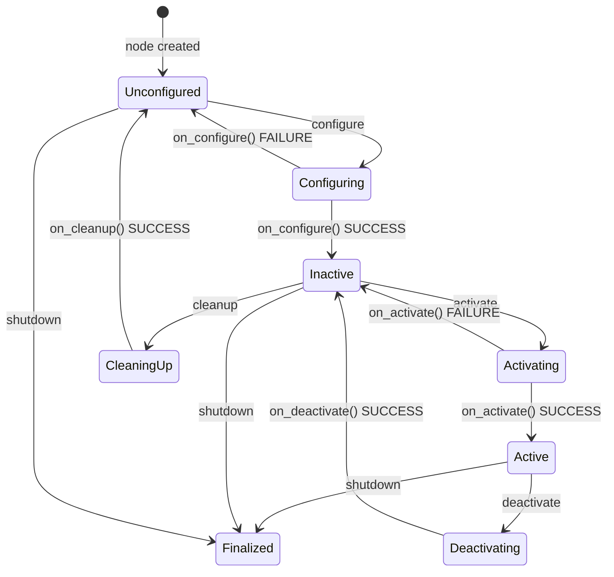

# Lifecycle Nodes

ROS2 Humble's managed-node (lifecycle) interface adds a formal state machine to regular nodes.
This document explains the state machine, the four transition callbacks, and how the showcase
implements them in `OdometryNode`, `VelocityController`, and `MapPublisher`.

## Why Lifecycle Nodes?

In a robot system, an unmanaged node starts publishing immediately after `rclcpp::init`.
This is dangerous: sensors may not be calibrated, actuators may not be homed, and parameters
may not have been validated. A lifecycle node stays in `Unconfigured` until an external
supervisor explicitly tells it to configure and then activate. This enables:

- **Safe startup sequencing** — map must be loaded before the planner activates
- **Graceful degradation** — deactivate a node without killing the process; reconfigure and
  reactivate when the fault clears
- **Hot-swappable behavior** — change parameters in `Inactive` state without stopping the whole system

## State Machine



The full lifecycle has 11 states (the 4 primary + 4 transition + ErrorProcessing + Finalized +
[*]). The 4 primary states and their transitions are what an implementation handles via
override callbacks.

## The Four Transition Callbacks

### `on_configure` — Allocate Resources

Called when the supervisor issues `configure`. The node should:
- Create publishers and subscriptions (but **not** start sending/receiving yet)
- Allocate memory, open files, initialize data structures
- Validate parameters

Resources created here survive until `on_cleanup`. A `LifecyclePublisher` created here is
created in **deactivated** state — it will drop any `publish()` calls until `on_activate`
calls `->on_activate()` on it.

```cpp
OdometryNode::CallbackReturn OdometryNode::on_configure(const rclcpp_lifecycle::State&) {
    RCLCPP_INFO(get_logger(), "Configuring OdometryNode");
    // Create publisher — initially deactivated
    odom_pub_ = create_publisher<custom_interfaces::msg::Odometry2D>("/odom", 10);
    // Subscription is fine to create here — it starts receiving immediately
    cmd_sub_ = create_subscription<geometry_msgs::msg::Twist>(
        "/cmd_vel", 10,
        std::bind(&OdometryNode::cmd_vel_callback, this, std::placeholders::_1));
    tf_broadcaster_ = std::make_unique<tf2_ros::TransformBroadcaster>(*this);
    last_time_ = now();
    return CallbackReturn::SUCCESS;
}
```

### `on_activate` — Start I/O

Called when the supervisor issues `activate`. The node should:
- Call `->on_activate()` on every `LifecyclePublisher` it owns (enables publish calls)
- Start timers that drive periodic behavior
- Acquire any real-time resources (hardware handles, shared memory)

```cpp
OdometryNode::CallbackReturn OdometryNode::on_activate(const rclcpp_lifecycle::State&) {
    RCLCPP_INFO(get_logger(), "Activating OdometryNode");
    last_time_ = now();
    odom_pub_->on_activate();   // MANDATORY — without this, publish() is a no-op
    timer_ = create_wall_timer( // Start 50 Hz odometry loop
        std::chrono::milliseconds(20),
        std::bind(&OdometryNode::timer_callback, this));
    return CallbackReturn::SUCCESS;
}
```

**Critical**: `LifecyclePublisher<T>::on_activate()` must be called explicitly. Forgetting it
causes silent message drops — the publisher is valid, `publish()` returns without error, but
no messages reach subscribers.

### `on_deactivate` — Stop I/O

Called when the supervisor issues `deactivate`. The mirror of `on_activate`:
- Cancel/destroy timers (stop the periodic loop)
- Call `->on_deactivate()` on every `LifecyclePublisher` (disables publish calls)
- Release real-time resources

```cpp
OdometryNode::CallbackReturn OdometryNode::on_deactivate(const rclcpp_lifecycle::State&) {
    RCLCPP_INFO(get_logger(), "Deactivating OdometryNode");
    timer_->cancel();             // Stop the 50 Hz loop
    odom_pub_->on_deactivate();   // Disable publish
    return CallbackReturn::SUCCESS;
}
```

After `on_deactivate` completes the node is in `Inactive`. It can be re-activated (transition
back to `Active`) without going through configure again — all publishers and subscriptions are
still allocated.

### `on_cleanup` — Release Resources

Called when the supervisor issues `cleanup` (from `Inactive`). The mirror of `on_configure`:

```cpp
OdometryNode::CallbackReturn OdometryNode::on_cleanup(const rclcpp_lifecycle::State&) {
    RCLCPP_INFO(get_logger(), "Cleaning up OdometryNode");
    odom_pub_.reset();
    cmd_sub_.reset();
    tf_broadcaster_.reset();
    timer_.reset();
    return CallbackReturn::SUCCESS;
}
```

After cleanup the node returns to `Unconfigured` and can be re-configured with new parameters.

## LifecyclePublisher Activation Pattern

`rclcpp_lifecycle::LifecyclePublisher<T>` inherits from `rclcpp::Publisher<T>` but overrides
`publish()` to check an internal `activated_` flag:

```
publish() called
    └── if (!activated_) return;   // silent drop in Inactive/Unconfigured
    └── serialize and send
```

This means a subscription on the other end will not receive stale data during deactivate/cleanup
phases — the publisher becomes "quiet" without destroying the underlying DDS writer (which
would cost a re-discovery round trip on re-activation).

## Launch File Lifecycle Transitions

The launch file automates the configure → activate sequence:

```python
# From mobile_robot.launch.py
from launch_ros.actions import LifecycleNode
from launch.actions import TimerAction, EmitEvent
from launch_ros.events.lifecycle import ChangeState
from lifecycle_msgs.msg import Transition

# Declare the lifecycle node
odometry = LifecycleNode(
    package='mobile_robot',
    executable='odometry_node',
    name='odometry_node',
    namespace='')

# After 1 second, configure
configure_event = EmitEvent(event=ChangeState(
    lifecycle_node_matcher=lambda node: node is odometry,
    transition_id=Transition.TRANSITION_CONFIGURE))

# After 2 seconds, activate
activate_event = EmitEvent(event=ChangeState(
    lifecycle_node_matcher=lambda node: node is odometry,
    transition_id=Transition.TRANSITION_ACTIVATE))

return LaunchDescription([
    odometry,
    TimerAction(period=1.0, actions=[configure_event]),
    TimerAction(period=2.0, actions=[activate_event]),
])
```

## CLI Lifecycle Control

```bash
# Check current state
ros2 lifecycle get /odometry_node
# Output: active [3]

# Deactivate
ros2 lifecycle set /odometry_node deactivate
# Output: Transitioning [3] deactivate

# Reconfigure (only valid from Inactive)
ros2 lifecycle set /odometry_node cleanup
ros2 lifecycle set /odometry_node configure

# Re-activate
ros2 lifecycle set /odometry_node activate

# List all available transitions from current state
ros2 lifecycle list /odometry_node
```

State numbers: Unconfigured=1, Inactive=2, Active=3, Finalized=4.

## MapPublisher: TRANSIENT_LOCAL + Lifecycle

`MapPublisher` demonstrates that lifecycle and QoS compose independently:

```cpp
MapPublisher::CallbackReturn MapPublisher::on_configure(const rclcpp_lifecycle::State&) {
    // TRANSIENT_LOCAL = "latched" — late subscribers receive the last published message
    auto qos = rclcpp::QoS(rclcpp::KeepLast(1)).transient_local().reliable();
    map_pub_    = create_publisher<nav_msgs::msg::OccupancyGrid>("/map", qos);
    static_tf_  = std::make_shared<tf2_ros::StaticTransformBroadcaster>(*this);
    return CallbackReturn::SUCCESS;
}

MapPublisher::CallbackReturn MapPublisher::on_activate(const rclcpp_lifecycle::State&) {
    map_pub_->on_activate();
    map_pub_->publish(build_map());   // Publish once; TRANSIENT_LOCAL caches it for late joiners
    publish_static_tf();
    return CallbackReturn::SUCCESS;
}
```

`PathPlannerServer` subscribes with matching `transient_local()` QoS. Even if the planner
starts after the map is published, DDS delivers the cached map message immediately upon
subscription — no need to republish.

## VelocityController Lifecycle

`VelocityController` adds a parameter declaration in `on_configure`:

```cpp
VelocityController::CallbackReturn VelocityController::on_configure(const rclcpp_lifecycle::State&) {
    declare_parameter("max_linear_vel",  1.0);
    declare_parameter("max_angular_vel", 1.5);
    max_linear_  = get_parameter("max_linear_vel").as_double();
    max_angular_ = get_parameter("max_angular_vel").as_double();

    cmd_vel_pub_ = create_publisher<geometry_msgs::msg::Twist>("/cmd_vel", 10);
    set_vel_srv_ = create_service<custom_interfaces::srv::SetVelocity>(
        "/set_velocity",
        std::bind(&VelocityController::set_velocity_callback, this, _1, _2));
    return CallbackReturn::SUCCESS;
}
```

Note: services (`create_service`) are always active regardless of node lifecycle state.
Only `LifecyclePublisher` enforces the deactivated-drop behavior.

## Interview Talking Points

1. **Why not use regular nodes?** Regular nodes have no safe stop/start contract. A lifecycle
   node can be stopped, reconfigured with new parameters, and restarted — all without killing
   the process. Critical for field robotics where restarting a process may reset hardware state.

2. **`LifecyclePublisher` vs `Publisher`** — The only observable difference is the `publish()`
   no-op behavior in non-Active state. The subscription side does not know the difference.

3. **Partial failure handling** — Returning `CallbackReturn::FAILURE` from any callback
   transitions the node to `ErrorProcessing` state. The supervisor can then issue `cleanup`
   to recover or `shutdown` to terminate cleanly.

4. **Ordering constraint** — `on_activate()` must call `publisher->on_activate()` before the
   first `publish()`. The timer callback may fire before `on_activate` returns if created
   before the publisher is activated — in this showcase, the timer is created after the
   `on_activate()` call to guarantee correct ordering.
