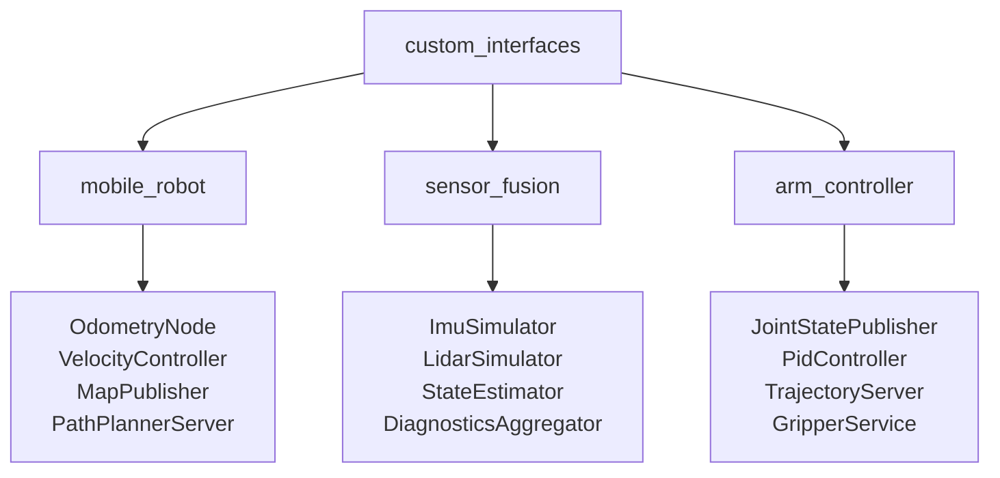
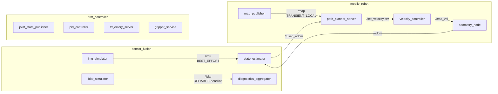

# ROS2 Architecture

Complete reference for all nodes, topics, services, and actions in the showcase workspace,
with Mermaid diagrams and expected CLI output.

## Package Dependency Graph



`custom_interfaces` must always build first because it generates C++ headers that the other
three packages include. `colcon build` resolves this automatically via `ament_cmake` dependency
declarations in each `package.xml`.

## Full Node Graph



## colcon Build Order

Because `custom_interfaces` generates message headers used by the other packages, colcon
resolves the build order based on `<depend>` entries in `package.xml`:

1. `custom_interfaces` — runs `rosidl_generate_interfaces`, installs headers
2. `arm_controller`, `mobile_robot`, `sensor_fusion` — build in parallel (no inter-dependency)

If you add a new package that depends on `mobile_robot`, colcon will place it after step 2.

## Topic Reference

| Topic | Message Type | Publisher | Subscriber | QoS |
|-------|-------------|-----------|------------|-----|
| `/imu` | `custom_interfaces/ImuReading` | `imu_simulator` | `state_estimator` | BEST_EFFORT, KeepLast(10) |
| `/lidar` | `custom_interfaces/PointCloud2D` | `lidar_simulator` | `diagnostics_aggregator` | RELIABLE, deadline 150ms |
| `/odom` | `custom_interfaces/Odometry2D` | `odometry_node` | `state_estimator`, `path_planner_server` | RELIABLE, KeepLast(10) |
| `/fused_odom` | `custom_interfaces/Odometry2D` | `state_estimator` | — | RELIABLE, KeepLast(10) |
| `/map` | `nav_msgs/OccupancyGrid` | `map_publisher` | `path_planner_server` | TRANSIENT_LOCAL, RELIABLE, KeepLast(1) |
| `/cmd_vel` | `geometry_msgs/Twist` | `velocity_controller` | `odometry_node` | RELIABLE, KeepLast(10) |
| `/joint_states` | `sensor_msgs/JointState` | `joint_state_publisher` | — | RELIABLE, KeepLast(10) |
| `/diagnostics` | `diagnostic_msgs/DiagnosticArray` | `diagnostics_aggregator` | — | RELIABLE, KeepLast(10) |

## Service Reference

| Service Name | Interface Type | Server | Client |
|-------------|---------------|--------|--------|
| `/set_velocity` | `custom_interfaces/srv/SetVelocity` | `velocity_controller` | `path_planner_server` |
| `/gripper` | `custom_interfaces/srv/GripperCommand` | `gripper_service` | — |

`/set_velocity` is called by `PathPlannerServer` during path execution to drive the robot
toward waypoints. `VelocityController` clamps the request to `max_linear_vel` /
`max_angular_vel` parameters before accepting.

## Action Reference

| Action Name | Interface Type | Server | Client |
|------------|---------------|--------|--------|
| `/navigate_to` | `custom_interfaces/action/NavigateTo` | `path_planner_server` | CLI / other nodes |
| `/move_arm` | `custom_interfaces/action/MoveArm` | `trajectory_server` | CLI / other nodes |

Both servers spawn a detached `std::thread` from `handle_accepted` to avoid blocking the
executor. Cancellation is checked with `goal_handle->is_canceling()` inside the execution loop.

## Expected CLI Output

After launching `mobile_robot.launch.py`:

```
$ ros2 node list
/launch_ros_<pid>
/map_publisher
/odometry_node
/path_planner_server
/velocity_controller
```

After launching `full_demo.launch.py` (adds sensor_fusion and arm_controller):

```
$ ros2 node list
/diagnostics_aggregator
/gripper_service
/imu_simulator
/joint_state_publisher
/launch_ros_<pid>
/map_publisher
/odometry_node
/path_planner_server
/pid_controller
/state_estimator
/trajectory_server
/velocity_controller
```

Expected topic list (subset):

```
$ ros2 topic list
/cmd_vel
/diagnostics
/fused_odom
/imu
/joint_states
/lidar
/map
/odom
/parameter_events
/rosout
```

Expected service list (subset):

```
$ ros2 service list
/gripper
/set_velocity
/odometry_node/change_state
/odometry_node/get_state
/map_publisher/change_state
/map_publisher/get_state
/velocity_controller/change_state
/velocity_controller/get_state
```

Expected action list:

```
$ ros2 action list
/move_arm
/navigate_to
```

## TF Tree

```
map (static)
 └─ odom  [published by map_publisher via StaticTransformBroadcaster]
     └─ base_link  [published by odometry_node via TransformBroadcaster, every 20 ms]
```

View in real time:

```bash
ros2 run tf2_tools view_frames
# creates frames.pdf showing the tree
```
