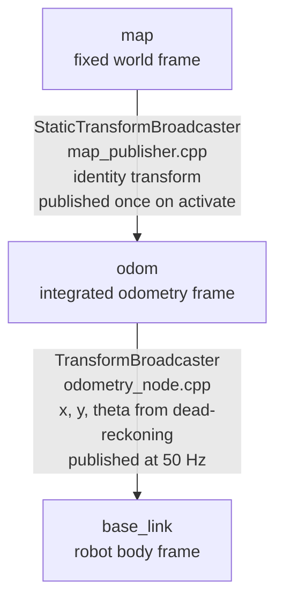
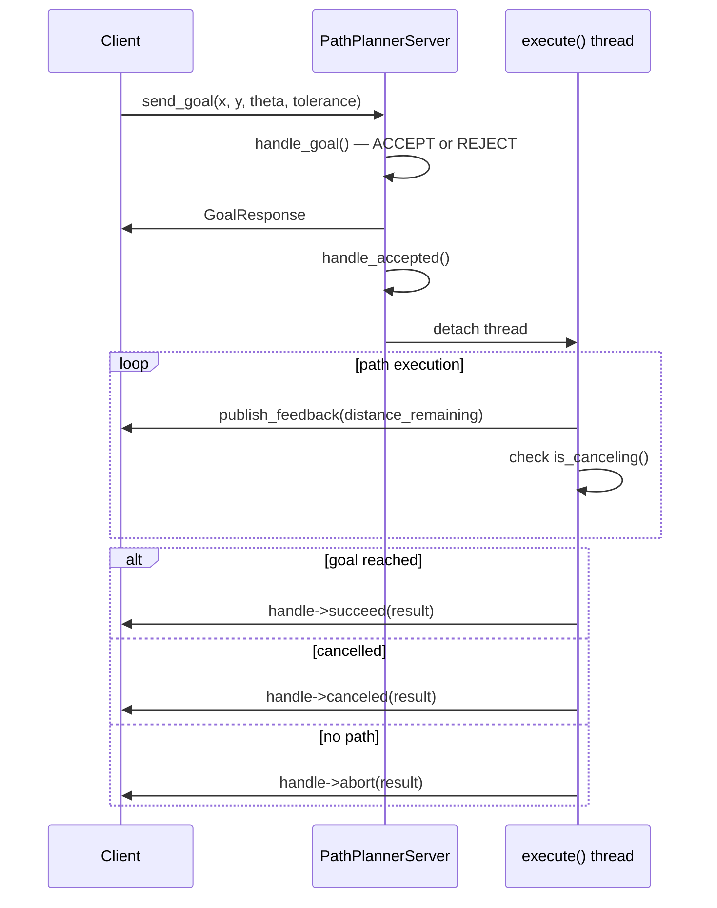

# TF2 and Navigation

This document covers the TF2 transform tree, dynamic vs static broadcasting, the A* path
planning algorithm, and the action server/client lifecycle for `PathPlannerServer`.

## TF2 Transform Tree

TF2 maintains a tree of coordinate frames. Each edge in the tree is a `TransformStamped`
that expresses the pose of a child frame relative to its parent.



### map → odom (Static Transform)

```cpp
// From map_publisher.cpp
void MapPublisher::publish_static_tf() {
    geometry_msgs::msg::TransformStamped tf{};
    tf.header.stamp    = now();
    tf.header.frame_id = "map";
    tf.child_frame_id  = "odom";
    tf.transform.rotation.w = 1.0;  // identity quaternion — no rotation, no translation
    static_tf_->sendTransform(tf);
}
```

`StaticTransformBroadcaster` publishes to `/tf_static` (TRANSIENT_LOCAL, latched) rather than
`/tf`. Any node that subscribes to `/tf_static` after the broadcaster has published receives
the full set of static transforms immediately without waiting for a republish.

The `map → odom` transform is an identity (no translation, no rotation) in this showcase
because the robot starts at the map origin and the map frame aligns with the odometry frame.
In a real SLAM system, a localization algorithm (AMCL, Cartographer) continuously updates
this transform to correct accumulated odometry drift.

### odom → base_link (Dynamic Transform)

```cpp
// From odometry_node.cpp — timer_callback runs at 50 Hz
void OdometryNode::timer_callback() {
    auto now = this->now();
    double dt = (now - last_time_).seconds();
    last_time_ = now;

    // Integrate velocity into pose
    theta_ += vtheta * dt;
    x_ += vx * std::cos(theta_) * dt;
    y_ += vx * std::sin(theta_) * dt;

    // Broadcast TF odom -> base_link
    geometry_msgs::msg::TransformStamped tf{};
    tf.header.stamp    = now;
    tf.header.frame_id = "odom";
    tf.child_frame_id  = "base_link";
    tf.transform.translation.x = x_;
    tf.transform.translation.y = y_;
    // Convert 2D heading to quaternion
    tf2::Quaternion q;
    q.setRPY(0, 0, theta_);  // roll=0, pitch=0, yaw=theta
    tf.transform.rotation.x = q.x();
    tf.transform.rotation.y = q.y();
    tf.transform.rotation.z = q.z();
    tf.transform.rotation.w = q.w();
    tf_broadcaster_->sendTransform(tf);
}
```

`TransformBroadcaster` publishes to `/tf` (volatile, not latched). Consumers use
`tf2_ros::Buffer` to look up transforms and extrapolate between timestamps.

## Quaternion from Yaw

For a 2D robot moving in the XY plane, only the Z rotation (yaw = θ) is non-zero.
`tf2::Quaternion::setRPY(roll, pitch, yaw)` constructs the quaternion:

```
q = cos(θ/2) + sin(θ/2)·k̂
  = (w=cos(θ/2), x=0, y=0, z=sin(θ/2))
```

This is equivalent to the ZYX Euler angle convention with roll=0, pitch=0. For θ=0 (pointing
along +X axis): q=(w=1, x=0, y=0, z=0) — the identity quaternion.

## TransformStamped Field Reference

```cpp
geometry_msgs::msg::TransformStamped tf{};
tf.header.stamp    = now();          // time the transform was valid
tf.header.frame_id = "odom";        // parent frame
tf.child_frame_id  = "base_link";   // child frame
// Translation: origin of child expressed in parent coords
tf.transform.translation.x = x_;
tf.transform.translation.y = y_;
tf.transform.translation.z = 0.0;   // planar robot — z=0
// Rotation: quaternion rotating from parent to child
tf.transform.rotation.x = q.x();
tf.transform.rotation.y = q.y();
tf.transform.rotation.z = q.z();
tf.transform.rotation.w = q.w();
```

## A* Path Planning Algorithm

### Algorithm Overview

A* finds the shortest path in a grid from `start` to `goal` using a priority queue ordered
by `f = g + h`:
- `g` = actual cost from start to current cell (1.0 per step in this implementation)
- `h` = heuristic estimate of cost from current cell to goal (Manhattan distance)

```cpp
// From a_star.cpp
double heuristic(Cell a, Cell b) {
    return std::abs(a.first - b.first) + std::abs(a.second - b.second);
}
```

Manhattan distance is an admissible heuristic for 4-connected grids (no diagonal movement)
because it never overestimates the true cost. This guarantees A* finds the optimal path.

### Implementation Walkthrough

```cpp
Path a_star(const Grid& grid, Cell start, Cell goal) {
    // Guard clauses
    if (!in_bounds(grid, start) || !in_bounds(grid, goal)) return {};
    if (!passable(grid, start) || !passable(grid, goal)) return {};
    if (start == goal) return {start};

    // Min-heap: (f_score, cell)
    using PQEntry = std::pair<double, Cell>;
    std::priority_queue<PQEntry, std::vector<PQEntry>, std::greater<>> open;

    std::map<Cell, Cell>   came_from;   // path reconstruction map
    std::map<Cell, double> g_score;     // actual cost from start
    std::set<Cell>         closed;      // fully processed cells

    g_score[start] = 0.0;
    open.push({heuristic(start, goal), start});

    while (!open.empty()) {
        auto [f, current] = open.top(); open.pop();

        if (current == goal) {
            // Reconstruct path by walking came_from backwards
            Path path;
            Cell c = goal;
            while (c != start) {
                path.push_back(c);
                c = came_from[c];
            }
            path.push_back(start);
            std::reverse(path.begin(), path.end());
            return path;
        }

        if (closed.count(current)) continue;  // already processed via a better path
        closed.insert(current);

        // Expand 4-connected neighbors
        for (auto& dir : DIRS) {  // DIRS = {(-1,0),(1,0),(0,-1),(0,1)}
            Cell next = {current.first + dir.first, current.second + dir.second};
            if (!in_bounds(grid, next) || !passable(grid, next) || closed.count(next))
                continue;
            double tentative_g = g_score[current] + 1.0;
            if (!g_score.count(next) || tentative_g < g_score[next]) {
                g_score[next]   = tentative_g;
                came_from[next] = current;
                open.push({tentative_g + heuristic(next, goal), next});
            }
        }
    }
    return {};  // no path found
}
```

**Complexity**: O(N log N) with a binary heap priority queue, where N is the number of cells
in the grid. The `closed` set prevents re-processing and bounds the work to O(N) expansions.
The 20×20 grid in this showcase has at most 400 cells — A* runs in microseconds.

**Obstacle representation**: Cells with `grid[r][c] == 100` are obstacles (100% occupancy
probability). Free cells are `0`. The OccupancyGrid from `MapPublisher` uses a threshold of
50: cells with value > 50 become obstacles.

## Action Server Lifecycle

### Server Side (PathPlannerServer)



### handle_goal — Accept or Reject

```cpp
rclcpp_action::GoalResponse PathPlannerServer::handle_goal(
    const rclcpp_action::GoalUUID&,
    std::shared_ptr<const NavigateTo::Goal> goal)
{
    RCLCPP_INFO(get_logger(), "Received goal: (%.2f, %.2f, %.2f)",
        goal->x, goal->y, goal->theta);
    std::lock_guard<std::mutex> lock(map_mutex_);
    if (!current_map_) {
        RCLCPP_WARN(get_logger(), "No map received yet — rejecting goal");
        return rclcpp_action::GoalResponse::REJECT;  // client receives REJECTED
    }
    return rclcpp_action::GoalResponse::ACCEPT_AND_EXECUTE;
}
```

`handle_goal` runs in the executor thread and must return quickly. Heavy computation belongs
in `execute()`.

### handle_accepted — Spawn Execution Thread

```cpp
void PathPlannerServer::handle_accepted(const std::shared_ptr<GoalHandle> handle) {
    cancel_requested_ = false;
    std::thread([this, handle]() { execute(handle); }).detach();
}
```

The `std::thread(...).detach()` pattern ensures the executor thread is not blocked. The
`GoalHandle` shared_ptr captures the handle into the lambda, extending its lifetime until
the thread completes.

### Cancellation Check

```cpp
void PathPlannerServer::execute(const std::shared_ptr<GoalHandle> handle) {
    // ...
    for (size_t i = 1; i < path.size(); ++i) {
        if (cancel_requested_ || handle->is_canceling()) {
            result->reached = false;
            result->message = "Cancelled";
            handle->canceled(result);   // notify client of cancellation
            return;
        }
        // ... drive toward waypoint, publish feedback ...
    }
}
```

`cancel_requested_` is set by `handle_cancel()` which runs in the executor thread.
`handle->is_canceling()` is the thread-safe ROS2 API equivalent. Both checks are included
for robustness.

### Cancel Handler

```cpp
rclcpp_action::CancelResponse PathPlannerServer::handle_cancel(
    const std::shared_ptr<GoalHandle>)
{
    RCLCPP_INFO(get_logger(), "Cancel requested");
    cancel_requested_ = true;
    return rclcpp_action::CancelResponse::ACCEPT;
}
```

Returning `ACCEPT` allows the client to proceed; the actual cancellation happens when the
execute thread checks the flag and calls `handle->canceled(result)`.

## CLI Action Usage

```bash
# Send a navigation goal
ros2 action send_goal /navigate_to custom_interfaces/action/NavigateTo \
  "{x: 5.0, y: 5.0, theta: 0.0, tolerance: 0.5}"

# Send goal with feedback visible
ros2 action send_goal /navigate_to custom_interfaces/action/NavigateTo \
  "{x: 5.0, y: 5.0, theta: 0.0, tolerance: 0.5}" --feedback

# Send arm trajectory goal
ros2 action send_goal /move_arm custom_interfaces/action/MoveArm \
  "{trajectory: {header: {frame_id: 'base_link'},
    joint_names: ['joint1','joint2'],
    points: [{positions: [0.5, -0.3], velocities: [], efforts: [],
              time_from_start: {sec: 1, nanosec: 0}}]}}"

# List active goals
ros2 action list

# Cancel a goal (replace <uuid> with actual goal UUID shown in send_goal output)
ros2 action cancel /navigate_to <uuid>
```

## Why Detached Thread vs Timer?

An alternative to `std::thread` for action execution is a timer that fires at the control
rate. The thread approach is used here because:

1. **Blocking calls** — `rate.sleep()` and service calls block the calling thread. A timer
   callback must return quickly to avoid starving the executor.
2. **Simplicity** — Linear code in a thread is easier to reason about than a state machine
   driven by timer callbacks.
3. **Trade-off** — The thread approach requires `cancel_requested_` to be `std::atomic<bool>`
   or protected by a mutex, since it is set by one thread and read by another.

For production code with multiple concurrent goals, a thread pool or coroutine approach
provides better resource control.
