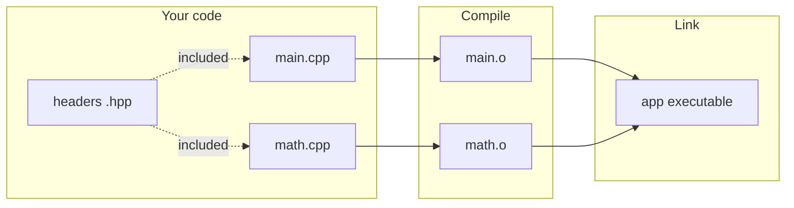

# How C++ Programs Work (Beginner)

This chapter builds a mental model of what happens between typing code and running a program. Everything else (CMake, sanitizers, templates) sits on top of this.

## 1. The big picture

C++ is a **compiled** language. You write **source code**; a **compiler** turns it into **machine code** your CPU runs. Often you have many `.cpp` files; each compiles to an **object file**; a **linker** joins them into one executable (or library).



**Key idea:** The compiler usually sees **one `.cpp` at a time** (a **translation unit**). Headers are **textually pasted in** where you `#include` them.

## 2. Headers vs source files

| Kind | Typical name | Role |
|------|--------------|------|
| Header | `.h`, `.hpp` | Declarations: “this function exists, here is its signature.” Often `inline` functions and templates too. |
| Source | `.cpp` | Definitions: function bodies, `main`, global objects used in this file only. |

**Declaration** (promise):

```cpp
// math.hpp
#pragma once
int add(int a, int b);
```

**Definition** (actual code):

```cpp
// math.cpp
#include "math.hpp"
int add(int a, int b) { return a + b; }
```

**Why headers?** So many `.cpp` files can share the same declarations without duplicating mistakes. The **One Definition Rule (ODR)** says: most things (non-inline functions, global variables) must have **exactly one** definition across the whole program, but can have many declarations.

*Beginner pitfall:* Putting a non-inline function definition in a header that is included from two `.cpp` files → **linker error** (multiple definitions).

## 3. Preprocessor (the first pass)

Before the compiler parses C++, the **preprocessor** runs:

- `#include` pastes a file.
- `#define` does text replacement (macros).
- `#if` / `#ifdef` removes code in some builds.

Example:

```cpp
#include <iostream>   // standard library header
#include "my.hpp"     // your project header (quotes = search project first)
```

Modern style: use **`#pragma once`** (or include guards) at the top of every header to avoid including the same declarations many times.

## 4. Namespaces

Namespaces avoid name clashes. The standard library lives in `std`.

```cpp
#include <iostream>

int main() {
    std::cout << "Hello\n";   // cout lives in std
    return 0;
}
```

You may see `using namespace std;` in tutorials. In real projects, prefer **`std::`** or **using-declarations** (`using std::cout;`) so names stay clear in large codebases.

## 5. From code to running program (step by step)

**Step 1 — Edit:** Create `main.cpp`:

```cpp
#include <iostream>

int main() {
    std::cout << "Hello, world!\n";
    return 0;
}
```

**Step 2 — Compile (conceptually):**

```text
g++ -std=c++20 -Wall -Wextra -pedantic -O2 -o hello main.cpp
```

- `-std=c++20` picks the language rules.
- `-Wall -Wextra` ask for useful warnings.
- `-O2` enables optimizations (optional while learning).
- `-o hello` names the output executable.

**Step 3 — Run:**

```text
./hello
```

**Step 4 — Multiple files:** compile each `.cpp`, then link:

```text
g++ -std=c++20 -c math.cpp -o math.o
g++ -std=c++20 -c main.cpp -o main.o
g++ math.o main.o -o app
```

In real projects, **CMake** generates these commands for you (see `07-build-quality-toolchain-basics.md`).

## 6. What “C++ standard” means

The **ISO C++ standard** is the official language + library rules. Compilers implement a **standard version** (C++11, C++14, …, C++20, C++23, …). Your workspace targets **C++20** in many places, but **the library** may lag (GCC 11: no `std::format`, no `std::expected`).

**Standard Library (STL):** roughly, the **`std::`** containers, iterators, algorithms, strings, I/O, threading, etc. People say “STL” loosely; strictly, the STL was an ancestor of today’s standard library containers/algorithms.

## 7. Errors you will see (and what they mean)

| Message flavor | Usually means |
|----------------|----------------|
| **Compile error** in `.cpp` | Syntax or type problem in that translation unit. |
| **Compile error** in header | Any `.cpp` including that header breaks. |
| **Undefined reference** at link time | Declaration exists, definition missing or not linked. |
| **Multiple definition** at link time | Same non-inline function defined in two `.cpp` files. |

## 8. Best practices (beginner)

1. **Compile with warnings** (`-Wall -Wextra`) and fix them.
2. **Initialize variables** (`int x{};` or `int x = 0;`) — avoid “maybe garbage” reads.
3. **Prefer `std::` facilities** over raw arrays and manual memory (covered in chapter 2–3).
4. **Small functions** with clear names beat huge `main`.
5. **Do not ignore** `[[nodiscard]]` warnings — they flag easy-to-miss bugs.

## Connect to this repo

- `projects/01-toolchain/` shows **real** CMake presets, sanitizers, and optimization — after you read chapter 7.
- `projects/02-foundation/demos/standards_demo.cpp` tours C++11→20 features; read it **after** chapters 2–4 so each feature has a place in your head.

## Mini exercise

1. Make `add.hpp` / `add.cpp` / `main.cpp` as above; build with two-step compile+link.
2. Move `add` into namespace `math` and call `math::add` from `main`.

---

*Next:* [02-the-stl-and-standard-library.md](02-the-stl-and-standard-library.md)
