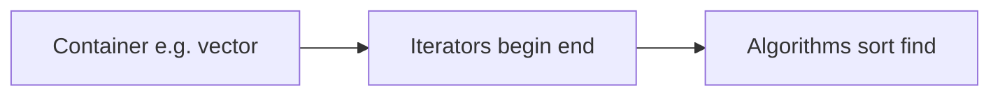

# The C++ Standard Library & STL (In-Depth, Beginner-Friendly)

The **standard library** is C++’s “batteries included” layer: containers, algorithms, strings, I/O, time, threads, and utilities. This chapter explains the **ideas** that make the library usable, then walks the **main tools** you will see in real code and in this repo.

## 1. Design ideas (learn these once)

### 1.1 Containers, iterators, algorithms

The classic STL split:



- A **container** owns elements and stores them in memory in a specific layout.
- **Iterators** are “handles” that let algorithms walk elements without knowing the container’s internals.
- **Algorithms** (`std::sort`, `std::find`, …) work on iterator *ranges*.

**Range:** from `begin` up to (but not including) `end`:

```cpp
std::vector<int> v{3, 1, 4};
auto first = v.begin();   // iterator to first element
auto last  = v.end();     // one-past-last (“sentinel”)
```

Almost all standard algorithms take a **half-open range** `[first, last)`.

### 1.2 Complexity (Big-O) intuition

| Operation | `vector` | `list` | `map` (balanced tree) | `unordered_map` (hash) |
|-----------|----------|--------|------------------------|-------------------------|
| Index `v[i]` | O(1) | — | — | — |
| Insert end | amortized O(1) | O(1) | O(log n) | O(1) avg |
| Find by key | — | — | O(log n) | O(1) avg |

You do not need to prove these; you need to **choose containers** that match how you access data.

### 1.3 Value semantics vs pointers

Standard containers **own their elements** (they store objects or move them). They can store **pointers** too, but then *you* own the pointed-to memory unless you use **smart pointers** (chapter 3).

---

## 2. Essential type aliases and literals

```cpp
#include <cstddef>
std::size_t  // unsigned type for sizes (from .size())
#include <cstdint>
std::int32_t // fixed-width integers when you care about layout/wire format
```

Use **`std::size_t`** for indexing from `.size()` to avoid signed/unsigned comparison warnings.

---

## 3. `std::vector` (dynamic array)

**What it is:** Contiguous memory, O(1) random access, grows at the end.

```cpp
#include <vector>
#include <iostream>

int main() {
    std::vector<int> v;           // empty
    v.push_back(10);              // append
    v.push_back(20);
    v[0] = 5;                     // unchecked index
    v.at(1) = 7;                  // checked index (throws if out of range)

    for (std::size_t i = 0; i < v.size(); ++i) {
        std::cout << v[i] << ' ';
    }
    std::cout << '\n';

    for (int x : v) {             // range-for (C++11)
        std::cout << x << ' ';
    }
    std::cout << '\n';
}
```

**Capacity vs size:**

- `size()` — how many elements are stored.
- `capacity()` — how much memory is reserved (often ≥ size).

**Reserve** when you know the final count to avoid repeated reallocations:

```cpp
v.reserve(1'000'000);
```

**Erase-remove idiom** (remove all `7`s):

```cpp
#include <algorithm>
v.erase(std::remove(v.begin(), v.end(), 7), v.end());
```

**Best practice:** default to `vector` unless you have a measured reason not to.

---

## 4. `std::array` (fixed size, stack)

```cpp
#include <array>
std::array<int, 3> a{1, 2, 3};
a[2] = 99;
```

Size is part of the **type** (`array<int,3>` ≠ `array<int,4>`). Good for small fixed buffers with no allocation.

---

## 5. `std::deque`, `std::list`, `std::forward_list`

- **`deque`:** double-ended queue; fast insert/erase at **both ends**; still O(1) index but not always as cache-friendly as `vector`.
- **`list`:** doubly-linked; O(1) insert/erase **if you already have an iterator** there; **no** random access.
- **`forward_list`:** singly-linked; even less memory, only forward iteration.

**Beginner rule:** use `vector` first; reach for `list` when you splice mid-sequence often *and* profiling says it matters.

---

## 6. `std::string` and `std::string_view`

```cpp
#include <string>
#include <string_view>

std::string s = "hello";
s += " world";
std::string_view sv = s;   // non-owning view (C++17)
```

**`string_view`** is cheap to pass into functions that only **read** text; it does not guarantee null-termination.

**Best practice:** accept `string_view` for read-only string parameters; return `string` when the callee allocates.

---

## 7. Associative containers

### 7.1 Ordered: `std::map`, `std::set`, `multimap`, `multiset`

Backed by a tree; keys sorted; O(log n) operations.

```cpp
#include <map>
#include <string>

std::map<std::string, int> scores;
scores["Ada"] = 100;
scores.insert({"Bob", 90});

if (auto it = scores.find("Ada"); it != scores.end()) {
    it->second += 5;
}
```

### 7.2 Hash tables: `unordered_map`, `unordered_set`

Average O(1); keys need a **hash** and **equality**. Great default for large dictionaries when order does not matter.

```cpp
#include <unordered_map>
std::unordered_map<std::string, int> m;
m["x"] = 1;
```

**Pitfall:** iterator invalidation rules differ from `vector`; read docs before erasing during iteration.

---

## 8. Container adapters: `stack`, `queue`, `priority_queue`

They wrap underlying sequences. Example: min-heap behavior with `priority_queue`.

```cpp
#include <queue>
#include <vector>
#include <iostream>

int main() {
    std::priority_queue<int> pq;
    pq.push(3); pq.push(10); pq.push(5);
    while (!pq.empty()) {
        std::cout << pq.top() << ' ';  // largest first by default
        pq.pop();
    }
}
```

---

## 9. Iterators (what you must know)

Categories (simplified):

- **Random access** (`vector`, `array`, `deque`): `it + n`, `it[n]`.
- **Bidirectional** (`list`, `set`, `map`): `++`, `--`.
- **Forward** (`forward_list`, `unordered_*` in practice): `++` only.

**Iterator pairs** feed algorithms:

```cpp
std::sort(v.begin(), v.end());
```

**Reverse iteration:**

```cpp
for (auto it = v.rbegin(); it != v.rend(); ++it) { /* *it */ }
```

---

## 10. Algorithms (`<algorithm>`, `<numeric>`)

### 10.1 Sorting and searching

```cpp
#include <algorithm>
#include <vector>

std::vector<int> v{3,1,4,1,5};
std::sort(v.begin(), v.end());                          // ascending
std::sort(v.begin(), v.end(), std::greater<int>{});     // descending

bool has_four = std::binary_search(v.begin(), v.end(), 4); // requires sorted range
auto it = std::lower_bound(v.begin(), v.end(), 4);         // first place to insert 4
```

### 10.2 `find` / `count`

```cpp
auto it = std::find(v.begin(), v.end(), 42);
if (it != v.end()) { /* found at it */ }
```

### 10.3 `for_each` (and why range-for often wins)

```cpp
std::for_each(v.begin(), v.end(), [](int x){ /* use x */ });
```

### 10.4 Numeric

```cpp
#include <numeric>
int sum = std::accumulate(v.begin(), v.end(), 0);
```

### 10.5 C++20 `std::ranges` (if available)

Many compilers let you write:

```cpp
#include <ranges>
#include <algorithm>
// std::ranges::sort(v);  // when your toolchain supports it cleanly
```

If your environment is picky, stick to iterator style — it is universal.

---

## 11. Smart pointers (`<memory>`) — preview

Deep dive in chapter 3; here is the API surface:

```cpp
#include <memory>

auto p = std::make_unique<int>(42);           // sole ownership
auto q = std::make_shared<std::string>("hi"); // shared ownership + control block
```

**Best practice:** call **`make_unique` / `make_shared`**, not `new`, in modern code.

---

## 12. Utilities: `pair`, `tuple`, `optional`, `variant`

### `pair` and `tuple`

```cpp
#include <utility>
#include <tuple>

std::pair<int, std::string> p{1, "one"};
auto t = std::make_tuple(1, 2.0, 'x');
```

### `optional` (C++17) — “maybe a value”

```cpp
#include <optional>

std::optional<int> parse_int(const std::string& s) {
    // pretend logic
    if (s == "42") return 42;
    return std::nullopt;
}

if (auto x = parse_int("42")) {
    std::cout << *x;
}
```

### `variant` (C++17) — “one of several types”

```cpp
#include <variant>
std::variant<int, std::string> v = 10;
v = std::string("hi");
```

Use `std::get` / `std::visit` carefully (errors if wrong type).

---

## 13. Function objects and lambdas

```cpp
#include <functional>

std::function<int(int)> f = [](int x){ return x * 2; };
```

**Cost note:** `std::function` can allocate and type-erase; for hot loops, prefer **templates** or a concrete lambda type (chapter 5).

**Lambda capture:**

```cpp
int factor = 10;
auto g = [factor](int x){ return x * factor; };      // copy factor
auto h = [&factor](int x){ return x * factor; };    // reference — watch lifetime!
```

---

## 14. I/O streams (`<iostream>`, `<fstream>`, `<sstream>`)

```cpp
#include <iostream>
#include <fstream>
#include <sstream>

std::ostringstream oss;
oss << "value=" << 42;
std::string s = oss.str();

std::ifstream in("data.txt");
if (!in) { /* handle error */ }
```

**Best practice:** check stream state after operations; I/O errors are easy to ignore.

---

## 15. Time (`<chrono>`) — mental model

```cpp
#include <chrono>
using namespace std::chrono_literals;
auto t0 = std::chrono::steady_clock::now();
// ... work ...
auto dt = std::chrono::steady_clock::now() - t0;
```

Use **`steady_clock`** for durations; **`system_clock`** for wall time (can jump).

---

## 16. Common beginner mistakes

1. **Invalid iterators** after `vector` reallocation (e.g. keeping an old `iterator` after `push_back` that reallocates).
2. **`unsigned` underflow** in loops: `for (auto i = n-1; i >= 0; --i)` fails when `i` is unsigned.
3. **Range-for over temporaries** binding to references incorrectly (rare but nasty).
4. **Passing large objects by value** — use `const&` for read-only big data.

---

## 17. Best-practice checklist

- Default container: **`vector`**.
- Prefer **`const_iterator`** when not mutating through iterators.
- Use **`at()`** when you want checks; **`[]`** when you have proof of validity.
- Prefer **`make_unique` / `make_shared`** over raw `new`.
- **`string_view`** for read-only string parameters; mind lifetime (view must not outlive backing storage).
- Learn **half-open ranges** `[begin, end)` — they are everywhere.

## Connect to this repo

- `projects/02-foundation/demos/standards_demo.cpp` uses vectors, algorithms, `optional`, `variant`, `span`, etc.
- Foundation headers build on these ideas (e.g. strong types, allocators). Read **foundation docs** only **after** you are comfortable with this chapter.

---

*Next:* [03-memory-raii-and-smart-pointers.md](03-memory-raii-and-smart-pointers.md)
