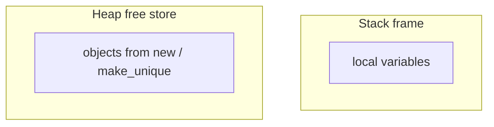

# Memory, RAII, and Smart Pointers (Beginner)

C++ lets you work close to the machine. That power includes **manual memory** — and **bugs** if you forget rules. Modern C++ pushes you toward **RAII** and **smart pointers** so cleanup happens automatically.

## 1. Stack vs heap (very short)



- **Stack:** function-local variables; destroyed automatically when the function returns.
- **Heap:** dynamic objects; **you** (or a smart pointer) must free them.

```cpp
void f() {
    int x = 5;                         // stack
    auto p = new int{42};              // heap — BAD style without delete
    delete p;                          // manual free — easy to forget
}
```

**Goal:** rarely write `new`/`delete` directly in application code.

---

## 2. RAII: Resource Acquisition Is Initialization

**Rule:** tie a resource (memory, file, lock, socket) to an object whose **destructor** releases it.

```cpp
#include <fstream>

void read_file(const char* path) {
    std::ifstream f(path);   // constructor opens
    if (!f) return;          // destructor still closes — no leak
    // read...
}                            // destructor runs here always
```

Why C++ likes this over “finally” blocks: destructors run on **every** exit path, including exceptions, and **nest** naturally.

**Connect:** `projects/02-foundation/include/foundation/memory/raii.hpp` implements a general **`ScopeGuard`** — a callable that runs on scope exit unless dismissed.

---

## 3. `std::unique_ptr` (exclusive ownership)

Exactly **one** owner; copying is disabled; **move** transfers ownership.

```cpp
#include <memory>
#include <iostream>

struct Widget { int x; };

void demo() {
    std::unique_ptr<Widget> p = std::make_unique<Widget>(Widget{7});
    std::cout << p->x << '\n';

    std::unique_ptr<Widget> q = std::move(p);  // p becomes null
    if (!p) std::cout << "p is empty\n";
}
```

**Factory pattern:**

```cpp
std::unique_ptr<Widget> make_widget(int x) {
    return std::make_unique<Widget>(Widget{x});
}
```

**Best practice:** return `unique_ptr` from factories; caller owns the result.

---

## 4. `std::shared_ptr` (shared ownership)

Reference-counted; last owner destroys the object.

```cpp
#include <memory>

auto a = std::make_shared<std::string>("hi");
auto b = a;  // refcount +1
```

**Costs:** control block allocation + atomic refcount updates. Use when ownership is **truly** shared (graphs, caches with care).

**`weak_ptr`:** observes a `shared_ptr` without keeping object alive — break cycles.

```cpp
std::weak_ptr<std::string> w = a;
if (auto s = w.lock()) {
    // use *s
}
```

---

## 5. Rule of zero / three / five (simplified)

If your class **does not** manage a raw resource, **do not** write destructor/copy/move — the compiler’s defaults are right (**rule of zero**).

If you **do** manage raw memory (discouraged), you likely need **all five** special members: destructor, copy ctor, copy assign, move ctor, move assign — or **`delete`** copy to make ownership unique.

**Modern shortcut:** wrap resources in smart pointers / standard types so you stay at **rule of zero**.

**Connect:** `projects/02-foundation/docs/memory.md` and `rules.hpp` demonstrate copy-and-swap assignment.

---

## 6. Common bugs (and how tools help)

| Bug | Symptom | Tool hint |
|-----|---------|-----------|
| Use-after-free | crash, weird values | ASan |
| Double free | crash | ASan |
| Memory leak | RSS grows | LeakSan (often bundled with ASan) |
| Buffer overflow | security + crash | ASan |
| Data race | flaky behavior | TSan (not on WSL2 in this workspace) |

**Connect:** `projects/01-toolchain` scripts like `run-asan.sh` and docs under `docs/sanitizers.md`.

---

## 7. Custom allocators (just the idea)

`std::vector` can use different **allocator** types to get memory from arenas or pools. Beginners should **understand the idea** (reduce fragmentation, batch frees) before writing one.

**Connect:** `projects/02-foundation/include/foundation/memory/allocators.hpp`.

---

## 8. Step-by-step: refactor raw pointer → `unique_ptr`

**Before:**

```cpp
Widget* w = new Widget{};
// ...
delete w;
```

**After:**

```cpp
auto w = std::make_unique<Widget>();
// no delete — destructor runs automatically
```

**After (factory):**

```cpp
std::unique_ptr<Widget> w = std::make_unique<Widget>();
return w;
```

---

## 9. Best practices

1. **`make_unique` / `make_shared`** over raw `new`.
2. **`unique_ptr` by default**; `shared_ptr` only when sharing is real.
3. **Avoid** `shared_ptr` cycles — use `weak_ptr` or restructure ownership.
4. **Do not** store raw pointers to owned heap objects alongside owners without a clear contract.
5. **RAII** for every resource type — files, locks (`std::lock_guard`), etc.

## Connect to this repo

- Read `projects/02-foundation/docs/memory.md` after this chapter.
- Run `./build/debug/demo_memory` once you can build `02-foundation`.

---

*Next:* [04-classes-oop-and-polymorphism.md](04-classes-oop-and-polymorphism.md)
