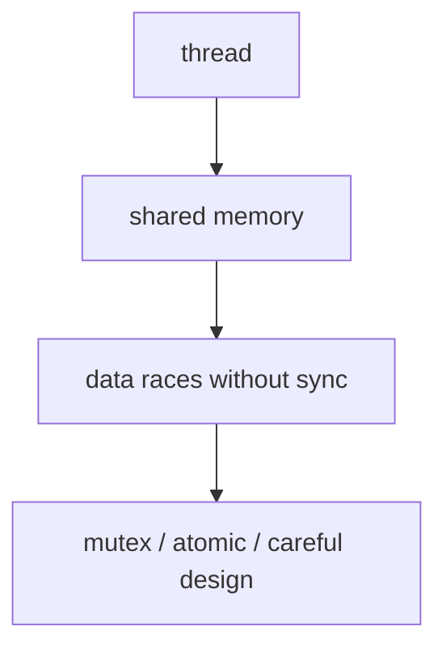

# Patterns, Concurrency, and Modern Types (Overview)

This chapter ties together **error modeling** (`optional`, `expected`-style), **sum types** (`variant`), **type erasure** (like `std::function`), and a **safe first look at threads** — all themes in `02-foundation`.

## 1. Strong types (newtype idiom)

Avoid mixing `int` meanings (user id vs count):

```cpp
struct UserId { int value; };
struct Count   { int value; };
```

Foundation goes further with templates; see `strong_type.hpp` later.

---

## 2. `std::variant` + visitor pattern

Model “either A or B”:

```cpp
#include <variant>
#include <string>
#include <iostream>

using Value = std::variant<int, std::string>;

struct Printer {
    void operator()(int x) const { std::cout << "int " << x << '\n'; }
    void operator()(const std::string& s) const { std::cout << "str " << s << '\n'; }
};

void print_value(const Value& v) {
    std::visit(Printer{}, v);
}
```

**Best practice:** centralize behavior with `std::visit` instead of chained `if (std::holds_alternative<...>)`.

**Connect:** `variant_patterns.hpp`.

---

## 3. `Expected`-style errors (without `std::expected` on GCC 11)

Some codebases use `std::optional` + error logging; others use `Outcome`/`Result` types. Foundation provides **`Expected<T,E>`** with monadic `.and_then`.

**Idea:** return **either** a value **or** an error in the type system instead of out-parameters + `bool`.

---

## 4. Type erasure — why `std::function` exists

Different lambdas have **different types**. Sometimes you need one storage slot for “any callable with signature `int(int)`”:

```cpp
#include <functional>
std::function<int(int)> f = [](int x){ return x+1; };
f = [](int x){ return x*2; };
```

**Cost:** indirection + possible allocation. Use when **flexibility** beats **raw speed**.

**Connect:** `type_erasure.hpp` builds a pedagogical version.

---

## 5. Concurrency — core vocabulary



- **`std::thread`:** OS thread.
- **`std::mutex` + `std::lock_guard`:** exclusive access RAII lock.
- **`std::atomic`:** low-level lock-free atomics — easy to misuse; start with mutexes.
- **`std::async`:** high-level tasks — understand launch policy pitfalls before relying on it.

**Pitfall:** capturing local variables by reference in async work that outlives them.

**Connect:** `thread_pool.hpp`, `lock_free_queue.hpp` (advanced), `coroutine_task.hpp` (C++20 coroutines).

---

## 6. Coroutines (C++20) — intuition

**Coroutines** let functions **suspend** and **resume**, enabling async-style code. They require compiler support and careful `promise_type` wiring.

**Connect:** `coroutine_task.hpp` — read **after** you understand classes and templates.

---

## 7. Step-by-step: safe counter with mutex

```cpp
#include <mutex>

class ThreadSafeCounter {
public:
    void add(int n) {
        std::lock_guard<std::mutex> lock(mutex_);
        value_ += n;
    }
    int get() const {
        std::lock_guard<std::mutex> lock(mutex_);
        return value_;
    }
private:
    mutable std::mutex mutex_;
    int value_{0};
};
```

`mutable` lets `get() const` lock the mutex.

---

## 8. Best practices

1. **Prefer RAII locks** (`lock_guard`, `unique_lock`) over manual lock/unlock.
2. **Minimize** work under mutex.
3. **Document** threading model of types (e.g. “not thread-safe”).
4. **TSan** to find races — when your environment supports running it (see toolchain docs).

## Connect to this repo

- `projects/02-foundation/docs/patterns.md`, `concurrency.md`
- Demos: `demo_patterns.cpp`, `demo_concurrency.cpp`

---

*Next:* [07-build-quality-toolchain-basics.md](07-build-quality-toolchain-basics.md)
