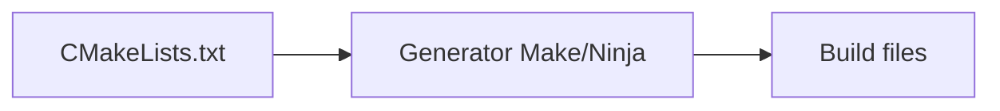

# Build Systems & Quality Tools (Beginner View of `01-toolchain`)

The `01-toolchain` project is “senior interview” depth. This chapter gives you **just enough** to navigate it while learning.

## 1. Why CMake exists

Hand-writing compiler flags for every `.cpp` does not scale. **CMake** generates build files (Makefiles, Ninja, Visual Studio, …) from **`CMakeLists.txt`**.



You typically:

1. **Configure** (detect compiler, set flags).
2. **Build** (compile + link).
3. **Test** (`ctest`).

---

## 2. Targets mental model

CMake builds **targets**:

- **Executable** — produces a program.
- **Library** — `STATIC`, `SHARED`, or `INTERFACE` (header-only).

Targets carry **include paths**, **compile options**, and **linked libraries**.

---

## 3. Presets (this repo)

Instead of long command lines, `CMakePresets.json` names configurations like `debug`, `release`, `asan`.

Typical flow:

```bash
cmake --preset debug
cmake --build --preset debug
ctest --preset debug
```

**Connect:** `projects/01-toolchain/CMakePresets.json` and `docs/cmake-setup.md`.

---

## 4. Sanitizers (what they are for)

**Sanitizers** add compiler instrumentation:

| Sanitizer | Finds (examples) |
|-----------|-------------------|
| **ASan** | heap buffer overflow, use-after-free, stack overflow |
| **UBSan** | signed overflow, misaligned access, UB patterns |
| **TSan** | data races |

**Workspace note (from `CLAUDE.md`):** TSan binaries may **not run** under WSL2; building them can still be useful elsewhere.

**Connect:** `docs/sanitizers.md`, scripts `run-asan.sh`, `run-tsan.sh`.

---

## 5. Optimizations — names only

- **LTO / IPO:** link-time optimization — cross translation-unit inlining.
- **PGO:** profile-guided optimization — compiler uses measured hot paths.

**Connect:** `docs/optimization.md`, `scripts/pgo_workflow.sh`.

---

## 6. Static analysis (clang-tidy)

**clang-tidy** applies rule packs (modernize, performance, readability). In mature setups, warnings can be **errors** in CI.

**Connect:** `docs/static-analysis.md`, `.clang-tidy`.

---

## 7. Cross-compilation — one sentence

A **toolchain file** points CMake at a compiler that targets **another** OS/CPU (e.g. ARM embedded).

**Connect:** `docs/cross-compilation.md`, `toolchain/arm-none-eabi.cmake`.

---

## 8. Step-by-step: build `01-toolchain` tests

From `projects/01-toolchain/`:

```bash
cmake --preset debug
cmake --build --preset debug
ctest --preset debug
```

If a preset fails, read the error: often a missing compiler (Clang-only presets) or optional dependency.

---

## 9. Best practices

1. **Debug + warnings** while learning; **release** for benchmarks only.
2. Run **ASan** when chasing crashes or memory bugs.
3. Keep **compile times** sane: prefer forward declarations, avoid mega-headers.
4. Treat **compiler warnings** as guidance, not noise.

## Connect to this repo

- `projects/01-toolchain/README.md` — capability matrix
- Deep docs: `projects/01-toolchain/docs/*.md`

---

*Next:* [08-ros2-vocabulary-and-architecture.md](08-ros2-vocabulary-and-architecture.md)
