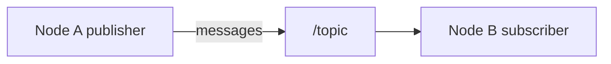

# ROS 2 Vocabulary & Architecture (Beginner Bridge to `03-ros2`)

ROS 2 is a **middleware** for robotics: nodes talk over the network (or locally) using typed messages. The `03-ros2` project in this workspace is a **showcase** — read this first so the architecture docs make sense.

## 1. Mental model



- **Node:** process-like unit of computation (often one main class + `spin`).
- **Topic:** named bus with a **message type** (e.g. odometry).
- **Publisher / Subscriber:** send/receive streams of messages.
- **Service:** request/response RPC pattern (one reply).
- **Action:** long-running goal with **feedback** and **cancel** (async tasks).

---

## 2. Messages, services, actions

| Mechanism | Shape | Example use |
|-----------|-------|-------------|
| **msg** | data struct | sensor stream |
| **srv** | request + response | “set velocity once” |
| **action** | goal + result + feedback | navigate, move arm |

**Connect:** `projects/03-ros2/ros2_ws/src/custom_interfaces/` defines `.msg`, `.srv`, `.action` files.

---

## 3. Packages & workspace

A **package** has `package.xml` (metadata) + `CMakeLists.txt` (build). A **workspace** contains many packages under `src/`, built with **`colcon build`**.

Typical loop:

```bash
cd ros2_ws
colcon build --packages-select my_package
source install/setup.bash
ros2 run my_package my_executable
```

**Connect:** `projects/03-ros2/README.md`, `docs/docker-setup.md`.

---

## 4. Executors & callbacks

ROS 2 schedules **callbacks** (subscription handlers, timers) on an **executor**. Single-threaded vs multi-threaded changes concurrency guarantees.

**Connect:** `docs/executors-qos.md`.

---

## 5. QoS (Quality of Service)

QoS policies control **reliability**, **history**, **durability**. Example: a **map** publisher often uses settings that allow late-joining subscribers to receive the last map.

**Connect:** `docs/executors-qos.md` (QoS sections).

---

## 6. Lifecycle nodes

Some nodes use **managed lifecycle** states (`unconfigured`, `inactive`, `active`, …) so supervisors bring up systems in order.

**Connect:** `docs/lifecycle-nodes.md`.

---

## 7. TF2 & navigation vocabulary (very short)

**TF2** tracks **coordinate frames** (map → odom → base_link → sensor). Navigation stacks transform poses between frames.

**Connect:** `docs/tf2-and-navigation.md`.

---

## 8. Components & parameters

**Composable nodes** can run in the same process for lower latency. **Parameters** tune behavior at runtime (e.g. PID gains).

**Connect:** `docs/components-params.md`.

---

## 9. Best practices (beginner)

1. **Always `source install/setup.bash`** in each new shell.
2. **Match message types** exactly between publishers and subscribers.
3. Start **single-threaded** executor until you understand reentrancy.
4. Use **Docker** from this repo if your host ROS install differs.

## Connect to this repo

- Architecture: `docs/ros2-architecture.md`
- Interfaces: `docs/custom-interfaces.md`
- Full index: `projects/03-ros2/docs/*.md`

---

*Course index:* [README.md](README.md)
