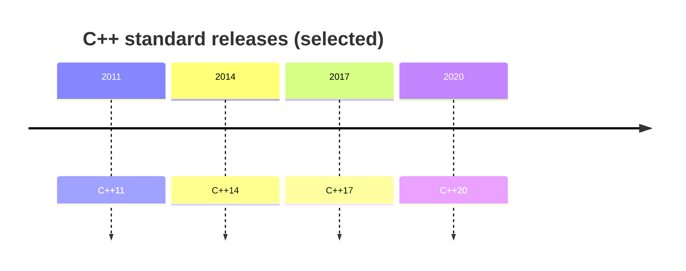

# C++11 → C++20: A Beginner’s Feature Tour

This chapter is a **roadmap of language/library features** you will see in modern codebases and in `projects/02-foundation/demos/standards_demo.cpp`. Read it **after** [01](01-how-cpp-programs-work.md) and [02](02-the-stl-and-standard-library.md).

## How to read this

- Each row is **one idea** + **why it exists** + **tiny example**.
- Your workspace uses **GCC 11** + **C++20** in many targets; a few library features need **newer** compilers (called out).



---

## C++11 (foundation of “modern C++”)

| Feature | Plain English | Example |
|---------|---------------|---------|
| **`auto`** | Let compiler deduce a type from the initializer. | `auto x = 3.14;` |
| **Range-for** | Loop over containers without index math. | `for (int v : vec) { }` |
| **Lambdas** | Inline function objects; capture locals. | `[&]{ return count; }` |
| **Move semantics** | Steal resources instead of copying big buffers. | `std::move(v)` |
| **`unique_ptr` / `shared_ptr`** | Heap ownership without manual `delete`. | `std::make_unique<int>(4)` |
| **`nullptr`** | Typed null pointer; safer than `0` or `NULL`. | `int* p = nullptr;` |
| **`constexpr`** | Compute at compile time when possible. | `constexpr int n = 8*8;` |
| **`static_assert`** | Fail compile if a condition is false. | `static_assert(sizeof(int)==4);` |
| **Initializer lists** | Uniform `{ }` initialization for many types. | `std::vector<int> v{1,2,3};` |
| **`<thread>` / mutexes** | Standard concurrency building blocks. | `std::thread`, `std::mutex` |

---

## C++14 (quality-of-life)

| Feature | Plain English | Example |
|---------|---------------|---------|
| **Generic lambdas** | `auto` parameters in lambdas. | `[](auto a, auto b){ return a+b; }` |
| **`make_unique`** | Safer factory for `unique_ptr`. | `std::make_unique<T>(...)` |
| **Relaxed `constexpr`** | More logic allowed in `constexpr` functions. | loops in constexpr |

---

## C++17 (structure & clarity)

| Feature | Plain English | Example |
|---------|---------------|---------|
| **Structured bindings** | Split pair/tuple into named parts. | `auto [a,b] = std::pair{1,2};` |
| **`if` / `switch` with initializer** | Narrow scope for temporaries. | `if (auto it = m.find(k); it!=m.end())` |
| **`std::optional`** | Value or “nothing”. | `std::optional<int>` |
| **`std::variant`** | One of several types, type-safe union. | `std::variant<int,string>` |
| **`std::string_view`** | Non-owning read-only string slice. | pass by `string_view` |
| **Parallel algorithms** *(optional)* | Execution policies on some algorithms. | rarely first thing to learn |

---

## C++20 (big step — learn in waves)

| Feature | Plain English | Example / note |
|---------|---------------|----------------|
| **Concepts** | Constraints on template parameters. | `template<std::integral T>` |
| **`requires` clauses** | Fine-grained template requirements. | advanced templates |
| **Ranges** | Compose algorithms more naturally. | `std::ranges::sort(v);` if available |
| **`std::span`** | Non-owning view over contiguous sequence. | `span<int>` over buffer |
| **Spaceship `<=>`** | Auto-generate comparisons in many classes. | `auto operator<=>(...) = default;` |
| **Coroutines** | Suspend/resume functions. | see foundation `coroutine_task.hpp` |
| **`std::format`** | Type-safe formatting. | **needs newer libstdc++** than GCC 11 |
| **`std::expected`** | Value-or-error without exceptions. | **needs newer libstdc++** than GCC 11 |

---

## Suggested learning order (features)

1. **`auto`, range-for, lambdas** — read/write everyday loops.
2. **Move + smart pointers** — own memory safely.
3. **`optional` / `variant` / `string_view`** — model data honestly.
4. **Concepts** — tame templates.
5. **Ranges / span** — modern idioms for algorithms.
6. **Coroutines** — last; powerful but wiring-heavy.

---

## Connect to this repo

Run and read (after you can build `02-foundation`):

```bash
./build/debug/demo_standards
```

Source: `projects/02-foundation/demos/standards_demo.cpp`.

---

*Course index:* [README.md](README.md)
