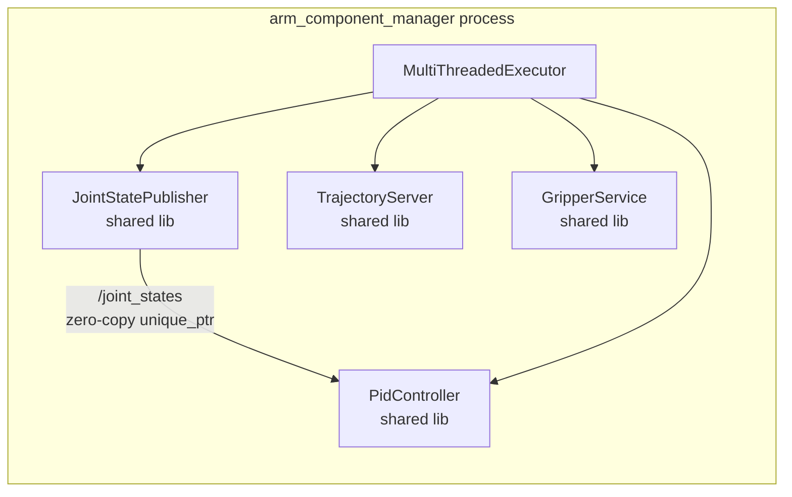

# Composable Components and Live Parameter Callbacks

This document covers the composable component system, intra-process zero-copy communication,
the `add_on_set_parameters_callback` API, and live PID gain reconfiguration in `PidController`.

## Composable Components Overview

A **composable component** is a ROS2 node packaged as a shared library instead of a standalone
executable. A **component manager** (the executable) loads one or more component libraries
into a single process at runtime. Components in the same process can use **intra-process
communication** — passing `unique_ptr` ownership between publisher and subscriber without
serializing or copying message data.



## RCLCPP_COMPONENTS_REGISTER_NODE Macro

Every composable component must call this macro at file scope (outside any namespace or class):

```cpp
// From pid_controller.cpp
RCLCPP_COMPONENTS_REGISTER_NODE(arm_controller::PidController)
```

```cpp
// From joint_state_publisher.cpp
RCLCPP_COMPONENTS_REGISTER_NODE(arm_controller::JointStatePublisher)
```

```cpp
// From trajectory_server.cpp
RCLCPP_COMPONENTS_REGISTER_NODE(arm_controller::TrajectoryServer)
```

```cpp
// From gripper_service.cpp
RCLCPP_COMPONENTS_REGISTER_NODE(arm_controller::GripperService)
```

**What the macro generates**: It creates a factory function (a `NodeFactory`) that the
component manager calls to instantiate the node. The factory signature is:

```cpp
std::shared_ptr<rclcpp::Node> create_node(const rclcpp::NodeOptions& options);
```

The macro also registers this factory in a shared library symbol table, discoverable via the
`pluginlib` mechanism at runtime.

## CMake Integration

```cmake
# From arm_controller/CMakeLists.txt
add_library(joint_state_publisher SHARED src/joint_state_publisher.cpp)
add_library(pid_controller        SHARED src/pid_controller.cpp src/pid_logic.cpp)
add_library(trajectory_server     SHARED src/trajectory_server.cpp)
add_library(gripper_service       SHARED src/gripper_service.cpp)

# Register each library as a component — enables runtime discovery
rclcpp_components_register_nodes(joint_state_publisher "arm_controller::JointStatePublisher")
rclcpp_components_register_nodes(pid_controller        "arm_controller::PidController")
rclcpp_components_register_nodes(trajectory_server     "arm_controller::TrajectoryServer")
rclcpp_components_register_nodes(gripper_service       "arm_controller::GripperService")

# The manager executable links all component libraries
add_executable(arm_component_manager src/arm_component_manager.cpp)
target_link_libraries(arm_component_manager
    joint_state_publisher pid_controller trajectory_server gripper_service)
```

`rclcpp_components_register_nodes()` writes metadata to the ament index so that
`ros2 component list` and `ros2 component load` can discover the component without inspecting
the binary. The string argument must match the fully-qualified class name passed to
`RCLCPP_COMPONENTS_REGISTER_NODE`.

## Shared Library vs Executable

| Aspect | Component (shared lib) | Standalone executable |
|--------|----------------------|----------------------|
| Build output | `.so` file | ELF binary |
| Launch | Loaded by component manager | Runs as separate process |
| IPC | Intra-process (zero-copy possible) | Inter-process (DDS serialization) |
| Fault isolation | None — crash kills all components | Full — crash only kills that process |
| Debugging | Single process, one GDB session | Multiple processes, must attach separately |

**When to use composable components**:
- Tightly coupled nodes that exchange high-bandwidth data (e.g., image pipeline: camera → filter → detector)
- Performance-critical paths where DDS serialization overhead is measurable
- Nodes that are always deployed together (not mix-and-match)

**When NOT to use composable components**:
- Nodes that need fault isolation (a crash in one must not affect others)
- Nodes with different safety integrity levels
- Nodes that may be deployed on different machines

## Intra-Process Communication

```cpp
// From arm_component_manager.cpp
rclcpp::NodeOptions opts;
opts.use_intra_process_comms(true);  // enable for all nodes created with these opts

auto js  = std::make_shared<arm_controller::JointStatePublisher>(opts);
auto pid = std::make_shared<arm_controller::PidController>(opts);
auto ts  = std::make_shared<arm_controller::TrajectoryServer>(opts);
auto gs  = std::make_shared<arm_controller::GripperService>(opts);

exec->add_node(js);
exec->add_node(pid);
exec->add_node(ts);
exec->add_node(gs);
```

**How zero-copy works**: When intra-process comms is enabled and both publisher and subscriber
are in the same process, `rclcpp` detects this at the time of subscription creation. Instead
of serializing the message to a DDS buffer and deserializing it on the subscriber side, the
publisher transfers `unique_ptr<MsgType>` ownership directly to the subscriber's callback.
No heap allocation for the subscriber, no copy, no serialization overhead.

**Requirement for zero-copy**: The publisher must use `publish(std::unique_ptr<MsgType> msg)`
overload (not the `const MsgType&` overload). The `const MsgType&` overload always copies.

```cpp
// Zero-copy publish pattern
auto msg = std::make_unique<sensor_msgs::msg::JointState>();
msg->header.stamp = now();
// ... fill msg ...
pub_->publish(std::move(msg));   // ownership transferred — msg is null after this
```

## Live Parameter Callbacks

### `add_on_set_parameters_callback`

Registers a function called whenever `ros2 param set` (or any other parameter setter)
attempts to update one or more parameters. The callback can inspect new values, validate
them, and apply them — all without restarting the node.

```cpp
// From pid_controller.cpp
param_cb_ = add_on_set_parameters_callback(
    [this](const std::vector<rclcpp::Parameter>& params) {
        rcl_interfaces::msg::SetParametersResult result;
        result.successful = true;
        for (const auto& p : params) {
            if (p.get_name() == "kp" || p.get_name() == "ki" || p.get_name() == "kd") {
                auto gains = read_pid_params();
                for (auto& pid : pids_) pid.set_gains(gains);
                RCLCPP_INFO(get_logger(), "PID gains updated: kp=%.3f ki=%.3f kd=%.3f",
                    gains.kp, gains.ki, gains.kd);
            }
        }
        return result;
    });
```

### SetParametersResult

`rcl_interfaces::msg::SetParametersResult` has two fields:
- `successful` (bool): If `false`, ROS2 rejects the parameter update and the value is not changed.
- `reason` (string): Human-readable explanation, shown by `ros2 param set` on failure.

```cpp
// Validation example (not in showcase, shown for reference)
if (p.get_name() == "kp" && p.as_double() < 0.0) {
    result.successful = false;
    result.reason = "kp must be non-negative";
    return result;
}
```

### Critical: Callback Handle Lifetime

```cpp
// In pid_controller.hpp
rclcpp::node_interfaces::OnSetParametersCallbackHandle::SharedPtr param_cb_;
```

`add_on_set_parameters_callback` returns a `shared_ptr` to a handle. If this handle is not
stored as a member (e.g., assigned to a local variable), it goes out of scope immediately and
the callback is **automatically unregistered**. The parameter can still be set, but the
callback will never fire. This is a common silent bug — always store the handle as a member.

## Live PID Gain Reconfiguration Demo

Start the arm component manager, then in another terminal:

```bash
# List all parameters on pid_controller
ros2 param list /pid_controller
# Output:
# /pid_controller:
#   kd
#   ki
#   kp
#   use_sim_time

# Check current values
ros2 param get /pid_controller kp   # → Double value is: 2.0
ros2 param get /pid_controller ki   # → Double value is: 0.1
ros2 param get /pid_controller kd   # → Double value is: 0.05

# Update gains live — no restart required
ros2 param set /pid_controller kp 3.0
ros2 param set /pid_controller ki 0.5
ros2 param set /pid_controller kd 0.1
```

Expected log output from the node:

```
[pid_controller]: PID gains updated: kp=3.000 ki=0.100 kd=0.050
[pid_controller]: PID gains updated: kp=3.000 ki=0.500 kd=0.050
[pid_controller]: PID gains updated: kp=3.000 ki=0.500 kd=0.100
```

Each `ros2 param set` call triggers the callback once with only the changed parameter.
`read_pid_params()` reads all three at once (using the node's parameter store, which has
already applied the update), so all three PID loops get consistent gains.

## PidController Annotated Source

```cpp
// From pid_controller.cpp — constructor
PidController::PidController(const rclcpp::NodeOptions& opts)
    : rclcpp::Node("pid_controller", opts)
{
    declare_pid_params();          // declare kp, ki, kd with defaults

    auto gains = read_pid_params(); // read initial values from param server
    for (auto& pid : pids_) pid.set_gains(gains);  // apply to all 6 joint PIDs

    // Register live-update callback
    param_cb_ = add_on_set_parameters_callback(
        [this](const std::vector<rclcpp::Parameter>& params) {
            rcl_interfaces::msg::SetParametersResult result;
            result.successful = true;
            for (const auto& p : params) {
                if (p.get_name() == "kp" || p.get_name() == "ki" || p.get_name() == "kd") {
                    auto gains = read_pid_params();
                    for (auto& pid : pids_) pid.set_gains(gains);
                    RCLCPP_INFO(get_logger(), "PID gains updated: kp=%.3f ki=%.3f kd=%.3f",
                        gains.kp, gains.ki, gains.kd);
                }
            }
            return result;
        });

    timer_ = create_wall_timer(
        std::chrono::milliseconds(20),  // 50 Hz control loop
        std::bind(&PidController::timer_callback, this));
}
```

```cpp
void PidController::declare_pid_params() {
    declare_parameter("kp", 2.0);    // proportional gain
    declare_parameter("ki", 0.1);    // integral gain
    declare_parameter("kd", 0.05);   // derivative gain
}

PidGains PidController::read_pid_params() {
    return {
        get_parameter("kp").as_double(),
        get_parameter("ki").as_double(),
        get_parameter("kd").as_double()};
}
```

## Interview Talking Points

1. **Why composable?** Intra-process zero-copy eliminates the dominant cost in high-bandwidth
   pipelines (e.g., 30 fps 4K camera → depth estimator → object detector: 3 × 4K × 3 channels
   × 4 bytes = 720 MB/s if serialized; 0 copies with intra-process comms).

2. **`OnSetParametersCallbackHandle` lifetime** — The handle is a RAII wrapper. Dropping it
   unregisters the callback silently. Store it as a member.

3. **Callback thread safety** — `add_on_set_parameters_callback` is called from the
   `ros2 param set` service handler, which runs in the executor thread. If the callback
   modifies state that the timer callback (also in the executor) also reads, they are
   serialized by the default `MutuallyExclusiveCallbackGroup` — no mutex needed. If using
   `MultiThreadedExecutor` with multiple groups, add a mutex.

4. **`use_intra_process_comms` caveat** — Works only when publisher and subscriber are in
   the same process AND the executor is spin-based. It does not work across processes.
   `ros2 topic echo /joint_states` from a separate terminal still goes through DDS.

5. **`rclcpp_components_register_nodes` vs `RCLCPP_COMPONENTS_REGISTER_NODE`** — The CMake
   call registers the component in the ament index (for `ros2 component load` CLI). The
   macro registers the factory in the shared library's symbol table (for
   `rclcpp_components::NodeFactory`). Both are required for full dynamic loading support.
