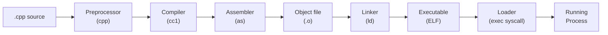

# Core: How C++ Thinks

> The mental model. Read this before anything else.

---

## The C++ Contract

C++ makes you a single promise: **you don't pay for what you don't use.** Every other language in widespread production use breaks this promise somewhere. Java has a garbage collector running whether you want it or not. Python has a global interpreter lock, reference counting, and a bytecode VM. Go has goroutine scheduling overhead baked into every binary. C++ has none of these costs unless you explicitly opt in.

The corollary is that C++ trusts you completely. It will not hold your hand. If you write code that reads past the end of an array, the language will let you do it and then allow anything to happen — including your program appearing to work correctly for months before silently corrupting production data. This is not a bug in C++. It is the price of the zero-cost abstraction contract. You get full control, and full control means full responsibility.

This is the mindset shift that separates engineers who use C++ from engineers who understand C++. The language is not hostile to you. It is simply honest: it does exactly what you told it to do, no more.

---

## The Compilation Pipeline

When you run `g++ -std=c++20 main.cpp -o main`, six distinct stages happen in sequence. Understanding each stage explains every error message you will ever see and every performance mystery you will ever investigate.

**Preprocessor:** Handles `#include`, `#define`, `#ifdef`. It is a pure text-substitution engine. It has no knowledge of C++ types or syntax. Every `#include` literally pastes the contents of the header file into your source. A single `.cpp` file with a few standard library includes can expand to 50,000 lines before the compiler sees a single token.

**Compiler:** The actual C++ frontend. Parses your expanded source, type-checks it, builds an AST, runs optimizations (at `-O2` this is aggressive), and emits assembly. This is where undefined behavior is "exploited" — the optimizer assumes UB never happens, which allows transformations that make your code faster but may silently remove safety checks you wrote.

**Assembler:** Converts text assembly into binary machine code. Produces an object file (`.o`). Object files contain machine code with unresolved symbol references — calls to functions defined in other translation units show up as placeholders.

**Linker:** Combines all object files and libraries. Resolves symbol references. If you call `printf` but forget `-lc`, the linker tells you. If you define a function in two translation units, the linker (usually) tells you. Link-time optimization (LTO) runs here, enabling cross-translation-unit inlining.

**Loader:** When you run the binary, the OS kernel maps the ELF sections into virtual memory, loads shared libraries (`libc.so`, etc.), runs constructors of global objects, and transfers control to `_start`, which calls `main()`. The loader is why global constructors run before `main()` and destructors run after it.

---

## Undefined Behavior Is a Feature

Undefined behavior (UB) sounds like a defect. It is actually a deliberate design decision that makes C++ faster than any safe language.

Consider signed integer overflow. In C++, `INT_MAX + 1` is undefined behavior. In Rust, it panics in debug mode and wraps in release mode. In Java, it wraps. The C++ compiler, knowing that signed overflow is UB, is allowed to assume it never happens. This means the optimizer can hoist loop bounds checks, vectorize loops that would otherwise require overflow checks on every iteration, and generate code that is measurably faster than any implementation that must handle overflow.

The same reasoning applies to null pointer dereferences, out-of-bounds array access, use-after-free, and data races. Each one is UB, and each one lets the compiler assume it does not occur, enabling optimizations that would be illegal if the behavior were defined.

The practical consequence: **UB is a contract between you and the optimizer.** If you keep your end of the bargain (never triggering UB), the optimizer keeps its end (generating the fastest possible code). If you break the contract, all bets are off — not just at the point of the bug but anywhere in the program, because the optimizer's reasoning chain may span multiple functions and translation units.

Use sanitizers. ASan catches out-of-bounds and use-after-free at runtime. UBSan catches signed overflow, null dereferences, and misaligned access. Run them in CI. Ship with neither, but never develop without them.

---

## The Mental Model That Changes Everything

C++ has two fundamental ways to handle data: **value semantics** and **reference semantics**. Getting this wrong is the source of most C++ bugs.

**Value semantics:** When you assign or pass, you copy. The copy is independent. Modifying the copy does not affect the original. This is the default in C++. Integers, structs, `std::array`, `std::string` — all value types. If you copy a `std::string`, you have two independent strings.

**Reference semantics:** When you assign or pass, you share. Both names refer to the same underlying object. Modifying through either name affects the shared object. Raw pointers and references are reference semantics. `std::shared_ptr` is reference semantics with reference counting.

The modern C++ answer is: **prefer value semantics, use move semantics to make it cheap.** Move semantics (C++11) means that passing a `std::string` by value into a function does not necessarily copy the string's heap allocation — if the caller is done with it, the compiler will move the allocation instead of copying it. The result is code that reads like value semantics but performs like reference semantics.

Ownership is the third axis: who is responsible for cleaning up? In modern C++, ownership is explicit. `std::unique_ptr` means one owner. `std::shared_ptr` means shared ownership with reference counting. Stack objects mean the scope owns them. When ownership is clear, resource leaks become structurally impossible — RAII (Resource Acquisition Is Initialization) ensures the destructor runs when the owner's lifetime ends.

---

## What C++ Is Not

**C++ is not Java with manual memory management.** Java's object model is entirely reference semantics — every object is a pointer, every assignment is a pointer copy. C++ is primarily value semantics, with pointers as an explicit opt-in. Writing `ClassName obj;` in C++ creates the object on the stack and it is automatically destroyed when it goes out of scope. This is not how Java works at all.

**C++ is not C with classes.** C++ compiles most C code, but idiomatic C++ is a fundamentally different language. C uses `malloc`/`free`, `void*` casts, and manual error codes. Idiomatic C++ uses constructors/destructors, templates, `std::optional`/`std::variant` for error handling, and RAII for every resource. The mental model is completely different.

**C++ is not unsafe by default.** The safety violations in C++ (UB, raw pointers, `reinterpret_cast`) require you to actively choose them. A codebase that uses `std::vector`, range-for, smart pointers, and never does pointer arithmetic is substantially safe in practice. The unsafety comes from C-style code, not from C++ itself.

---

## Production Rules

Every senior C++ engineer applies these rules without thinking about them. Internalize them now.

1. **RAII for every resource.** If something needs cleanup — memory, a file handle, a mutex, a network connection — wrap it in a class where the constructor acquires and the destructor releases. Never manage resources manually.

2. **Prefer stack to heap.** Heap allocation is slower, introduces lifetime complexity, and fragments the allocator. Stack allocation is free and cache-friendly. Use the heap only when you need dynamic lifetime or unknown size.

3. **Measure before optimizing.** The optimizer is smarter than you. Write clear code first. Profile under realistic workload. Optimize the bottleneck, not the code you think is slow.

4. **Make interfaces impossible to misuse.** If a function can be called incorrectly, it will be. Use the type system to make incorrect calls fail at compile time. Strong typedefs, `[[nodiscard]]`, `explicit` constructors.

5. **Use sanitizers in CI.** ASan and UBSan find bugs that code review and testing miss. Run them on every pull request. They add roughly 2× runtime overhead but cost nothing in production.

---

## Lab

The companion project for this chapter is `projects/01-toolchain`. It demonstrates the compilation pipeline in practice: sanitizers, LTO, PGO, SIMD intrinsics, and cross-compilation. After reading this chapter, navigate to `projects/01-toolchain/README.md` and follow the build instructions. Pay particular attention to the sanitizer demos — seeing ASan catch a buffer overflow in real time makes the UB discussion above concrete.
