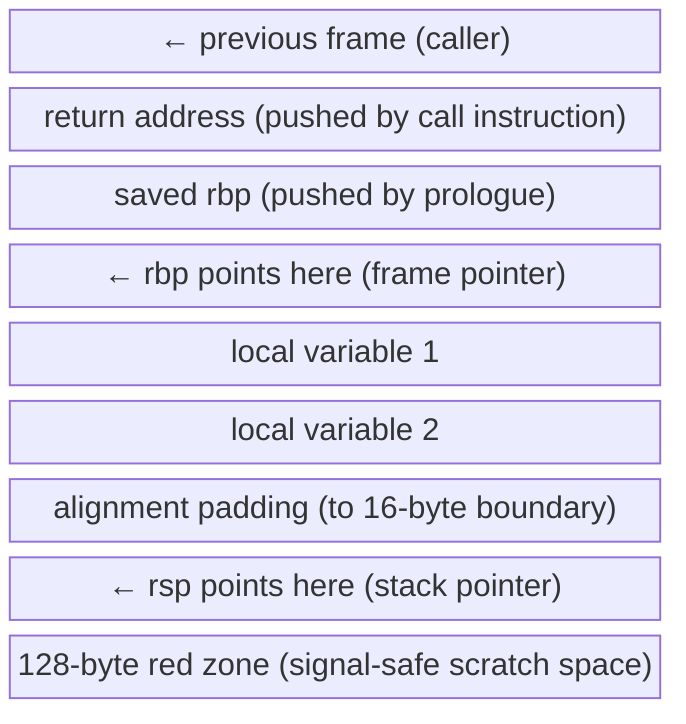

# Deep Dive: The Compilation Model in Detail

> Reference-grade. ABI, linkage, name mangling, calling conventions, and the stack frame.

---

## Translation Units and the ODR

A **translation unit** is a single `.cpp` file after preprocessing — after all `#include` directives have been expanded and all `#ifdef` branches resolved. It is the unit of compilation: `cc1` compiles one translation unit at a time, producing one object file.

The **One Definition Rule (ODR)** says: every entity must have exactly one definition across the entire program. Functions, variables, and class types may be *declared* any number of times (that is what header files are for), but they may be *defined* only once. If you define the same function in two `.cpp` files and link them together, you have an ODR violation.

The insidious part: ODR violations are usually not a compile error. They are undefined behavior at link time. The linker picks one definition, discards the other, and says nothing. If the two definitions differ (perhaps one was compiled with a different optimization level or `#define`), you get silent wrong behavior that manifests only under specific conditions. This is one of the hardest bugs in C++ to diagnose.

Exceptions to the one-definition rule: `inline` functions, `constexpr` functions, and class definitions may be defined in multiple translation units provided all definitions are identical. This is why you can put a class definition in a header and `#include` it everywhere — as long as you don't violate the identical-definition requirement.

---

## Linkage

**Linkage** describes which translation units can see a name.

**External linkage:** The name is visible to the linker and can be referenced from other translation units. Free functions and global variables have external linkage by default. This is why you can call a function defined in `foo.cpp` from `bar.cpp` after declaring it with a header.

**Internal linkage:** The name is visible only within its own translation unit. Achieved two ways:
- `static` at file scope: `static void helper() {}` — the function exists in every translation unit that includes this, but each copy is independent and not visible to the linker.
- Anonymous namespace: `namespace { void helper() {} }` — preferred in modern C++ because it also applies to types, not just functions and variables.

**`inline` variables (C++17):** A variable declared `inline` in a header has external linkage but the linker is required to merge all definitions into one. This finally allows non-`const` global variables in headers without ODR violation. Combined with `constexpr`, `inline constexpr` is the modern replacement for `#define` numeric constants.

---

## Name Mangling

The linker operates on symbol names, not C++ source names. When the compiler emits an object file, every function is represented by a mangled symbol name that encodes the function's return type, parameter types, namespace, and class membership. This is how function overloading is possible at the object file level — two functions named `add` with different parameter types produce different mangled names.

Example: `int add(int, int)` compiles to the symbol `_Z3addii` under the Itanium ABI (used by GCC and Clang on Linux). The `3` is the length of `add`, the `ii` encodes two `int` parameters.

To decode a mangled symbol: `c++filt _Z3addii` outputs `add(int, int)`. This is essential when reading linker error messages, which always show mangled names.

The `extern "C"` linkage specifier suppresses mangling: `extern "C" int add(int, int);` produces the symbol `add`, identical to a C function. This is how C++ code calls C libraries and how C code calls C++ functions — you must agree on a symbol name, and that means suppressing C++'s mangling.

---

## Calling Conventions

When a function is called, both caller and callee must agree on how arguments are passed and how results are returned. This agreement is the **calling convention**, and on 64-bit Linux it is defined by the **System V AMD64 ABI**.

**Integer and pointer arguments** are passed in registers in order: `rdi`, `rsi`, `rdx`, `rcx`, `r8`, `r9`. The seventh and subsequent arguments are passed on the stack. This means a function with six or fewer integer arguments passes them entirely in registers — no memory access for argument passing.

**Floating-point arguments** use `xmm0`–`xmm7`.

**Return values** up to 64 bits go in `rax`. Values up to 128 bits use `rax:rdx`. Larger return values cause the caller to allocate space and pass a pointer in `rdi` (the hidden first argument), shifting all other arguments right.

**Caller-saved registers** (`rax`, `rcx`, `rdx`, `rsi`, `rdi`, `r8`–`r11`, `xmm0`–`xmm15`): the callee may clobber these without saving them. If the caller needs a value in one of these registers after the call, it must save it before the call.

**Callee-saved registers** (`rbx`, `rbp`, `r12`–`r15`): if the callee uses these, it must save and restore them. The caller can rely on their values surviving a call.

---

## The Stack Frame

Every function call produces a **stack frame** — a region of the stack that holds the function's local variables, saved registers, and bookkeeping. Frames are laid out by the ABI.

**Prologue:** `push rbp; mov rbp, rsp; sub rsp, N` — saves the caller's frame pointer, sets the frame pointer for this frame, and reserves space for locals.

**Epilogue:** `mov rsp, rbp; pop rbp; ret` — restores the stack and returns.

**Red zone:** The 128 bytes below `rsp` are guaranteed not to be clobbered by signal handlers or asynchronous interrupts. Leaf functions (those that call no other functions) can use this space as scratch without adjusting `rsp`, saving two instructions. The kernel violates this guarantee for signal delivery, so `rsp` must be valid when a signal arrives — hence the guarantee only holds for leaf functions.

**Frame pointer omission:** `-fomit-frame-pointer` (default at `-O1` and above) eliminates the `rbp` save/restore and uses `rbp` as a general-purpose register. This slightly improves performance but makes stack unwinding harder. GCC emits DWARF unwind tables regardless, so stack traces still work, but live debugging with `gdb` `up`/`down` is less reliable.

---

## ABI Stability

**ABI (Application Binary Interface)** is the machine-level interface of a compiled binary: symbol names, calling convention, struct layout, vtable layout. Two pieces of code are ABI-compatible if they can be linked together and work correctly without recompiling either.

ABI stability matters most for shared libraries (`.so` files). If you ship a `.so` and a user links against it, they must be able to upgrade to a new version of the `.so` without recompiling their code. Any change that alters the ABI of a class breaks this.

**Changes that break ABI:**
- Adding a virtual function to a class (changes vtable size and layout)
- Adding a data member to a class (changes `sizeof` and member offsets)
- Removing or reordering data members
- Changing a non-virtual function to virtual or vice versa
- Changing the base classes of a class

**Changes that do not break ABI:**
- Adding a non-virtual function (does not affect vtable or struct layout)
- Changing function implementations (as long as the signature is unchanged)
- Adding a new class that was not previously part of the library's interface

The `pimpl` idiom (pointer to implementation) is the classic technique for providing ABI stability: the public class holds only a `unique_ptr<Impl>` where `Impl` is defined in the `.cpp` file. Users of the class never see `Impl`'s layout, so you can change it freely without breaking ABI.

---

## RTTI and Its Cost

**RTTI (Run-Time Type Information)** enables `typeid` and `dynamic_cast`. The compiler emits a `type_info` object for every polymorphic class (any class with a virtual function). The vtable contains a pointer to this `type_info`. `dynamic_cast<Derived*>(base_ptr)` walks this chain at runtime to verify the cast is valid.

The cost: every polymorphic class's `type_info` is emitted in every translation unit that uses the class and then deduplicated by the linker. In large codebases, this can add megabytes to the binary. `dynamic_cast` itself is O(depth of inheritance hierarchy) at runtime.

`-fno-rtti` disables RTTI entirely. `typeid` becomes a compile error, `dynamic_cast` becomes a compile error. Many embedded and game codebases use this flag to reduce binary size and eliminate the vtable pointer overhead for type info. The trade-off: you can no longer use `dynamic_cast` anywhere, which forces you to use alternative dispatch mechanisms (visitor pattern, `std::variant`).

---

## Exceptions and Stack Unwinding

C++ exceptions use the **zero-cost exception model** on modern platforms. Under normal (non-exception) execution, exception handling has zero runtime overhead — no per-function cost, no branch on every function exit. The cost is paid only when an exception is actually thrown, and it is paid by the exception handling itself.

The mechanism: the compiler emits **DWARF unwind tables** (`.eh_frame` section) that describe, for every instruction address, how to unwind the stack — which registers to restore, which destructors to call, how many bytes to pop. When an exception is thrown, the C++ runtime's **stack unwinder** (`_Unwind_RaiseException`) walks these tables from the throw point backward, calling destructors (RAII cleanup) along the way until it reaches a matching `catch`.

Cost: unwind table generation increases object file size by 10–30%. Walking the unwind tables on a thrown exception takes on the order of microseconds per frame. For code where exceptions are rare (truly exceptional: I/O failure, out-of-memory), this is the right trade-off. For code where exceptions are used for control flow (throwing on every invalid input), this is prohibitively expensive.

`-fno-exceptions` disables exception support. `throw` becomes a call to `std::terminate`. This eliminates unwind table generation and reduces binary size significantly. Embedded and real-time codebases use this flag. The trade-off: any library that throws must be replaced or wrapped, and you need an alternative error-handling mechanism (error codes, `std::expected` if GCC 12+, or output parameters).
