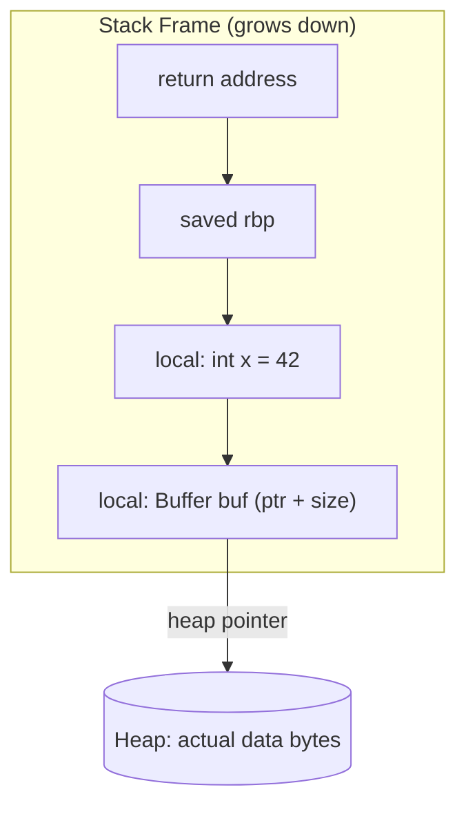
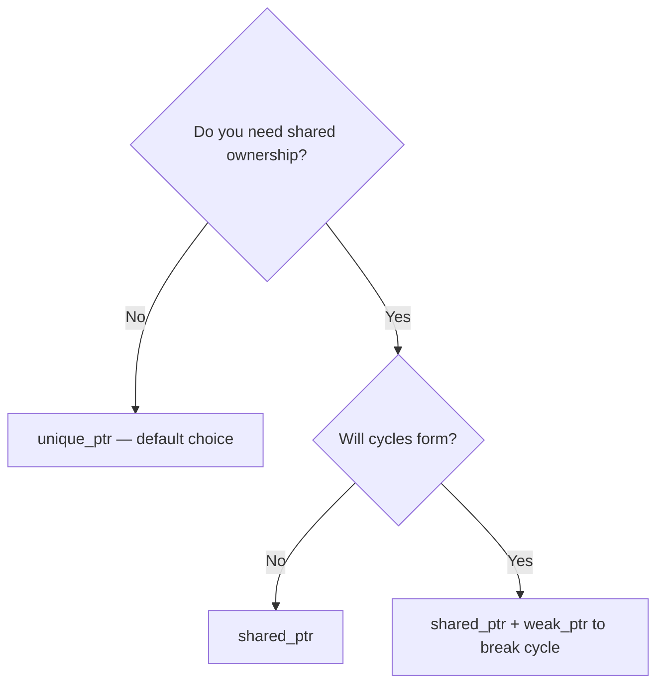

# Memory — Core

> The mental model. Read this before anything else in this chapter.

---

## The Golden Rule

If you write `delete`, you are doing it wrong.

This sounds extreme. It is not. Manual `delete` is a trap that catches everyone eventually. Here is why:

```cpp
void process(std::vector<int>& data) {
    Resource* r = new Resource();
    heavy_computation(data);  // can throw std::bad_alloc
    delete r;                 // never reached if above throws
}
```

If `heavy_computation` throws, `delete r` never runs. The resource leaks. You cannot fix this with a try/catch around everything — that approach scales to zero. There are too many call sites, too many exception paths, and the code becomes unreadable. The solution is not "be more careful." The solution is RAII.

---

## Stack vs Heap

The stack is where functions live. Every function call gets a stack frame: a contiguous chunk of memory that holds local variables, the return address, and saved registers. Allocation is O(1) — the hardware just decrements the stack pointer. Deallocation is O(1) too — the stack pointer goes back up when the function returns. Stack memory is also cache-friendly: it is used in LIFO order, so it is almost always hot in L1.

The heap is a pool of memory managed by the allocator (`malloc`/`free` under the hood). Heap allocation is slower (it has to find a free block of the right size), less cache-friendly (allocations can be scattered across 4KB pages), and requires you to track lifetime explicitly.



Use the stack when: size is known at compile time, lifetime is tied to the current scope, size is small (< a few KB — don't blow the stack).

Use the heap when: size is unknown at compile time (user input, runtime config), lifetime must outlive the function, or you need a large allocation (images, buffers, matrices).

---

## RAII: The Most Important Idiom in C++

RAII stands for Resource Acquisition Is Initialization. The rule: acquire a resource in the constructor, release it in the destructor. The magic: C++ guarantees that destructors run when an object goes out of scope — including during exception-driven stack unwinding.

```cpp
class FileHandle {
    FILE* f_;
public:
    explicit FileHandle(const char* path, const char* mode)
        : f_(fopen(path, mode)) {
        if (!f_) throw std::runtime_error("cannot open file");
    }
    ~FileHandle() { if (f_) fclose(f_); }

    // Non-copyable, movable
    FileHandle(const FileHandle&) = delete;
    FileHandle& operator=(const FileHandle&) = delete;
    FileHandle(FileHandle&& o) noexcept : f_(o.f_) { o.f_ = nullptr; }
    FileHandle& operator=(FileHandle&& o) noexcept {
        if (this != &o) { if (f_) fclose(f_); f_ = o.f_; o.f_ = nullptr; }
        return *this;
    }

    FILE* get() const noexcept { return f_; }
};
```

Now no exception path leaks the file handle. The destructor runs whether the scope exits normally or via exception. RAII is what makes C++ tractable at scale — it is the idiom that turns manual resource management into automatic resource management without a garbage collector.

---

## Smart Pointer Decision Tree

The standard library provides three smart pointers. Here is how to choose:



**`unique_ptr<T>`:** Zero overhead. One owner. Destructor runs when the unique_ptr is destroyed. This is the right choice 90% of the time. If you find yourself reaching for `shared_ptr`, ask: is the shared ownership genuinely unavoidable, or is it a design smell?

**`shared_ptr<T>`:** Reference-counted. Multiple owners. The managed object is destroyed when the last `shared_ptr` is destroyed. Cost: two atomic operations (increment + decrement) per copy/destruction. Use only when ownership is genuinely shared across independent lifetimes.

**`weak_ptr<T>`:** Observes without owning. Does not affect the reference count. Call `lock()` to get a `shared_ptr` — returns empty if the object has already been destroyed. Use to break ownership cycles and to implement caches (the cache does not prevent the object from being destroyed).

---

## Custom Allocators in One Paragraph

The default allocator (`new`/`delete`) is a general-purpose heap. It is excellent for typical workloads. It becomes your bottleneck when you are making thousands of small allocations per millisecond on a latency-sensitive hot path, when heap fragmentation causes your 24-hour-uptime server to page fault at 23:00, or when you are on an embedded system with no heap at all. Arena allocation solves these with a bump pointer: one large buffer, advance a pointer for each allocation, reset to zero to free everything at once. `std::pmr::monotonic_buffer_resource` is the standard library's arena. Use it when you can. Write your own only when you have measured that `pmr` is not enough.

---

## Production Rules

- Prefer stack allocation. Always. Heap only when forced.
- Use `std::make_unique<T>(...)` — never `new` in application code.
- Use `std::make_shared<T>(...)` — one allocation instead of two.
- Never write `delete` anywhere outside a destructor.
- Use `std::pmr::monotonic_buffer_resource` for request-scoped arenas before writing a custom allocator.
- Run ASan in CI. Every memory safety violation ASan catches at test time is a production incident you avoided.
- `shared_ptr` is not safer than `unique_ptr`. It is more expensive. Prefer `unique_ptr`.

---

## Lab

The companion project is `projects/02-foundation/include/foundation/memory/`. It contains production-grade implementations of:
- `raii.hpp` — `ScopeGuard<F>` and the `DEFER` macro
- `allocators.hpp` — Arena, Pool, and Stack allocators

Run the tests from `projects/02-foundation/`: `cmake --preset debug && cmake --build --preset debug && ctest --preset debug -R test_memory`. The test file is `tests/test_memory.cpp` — read it alongside the headers.
