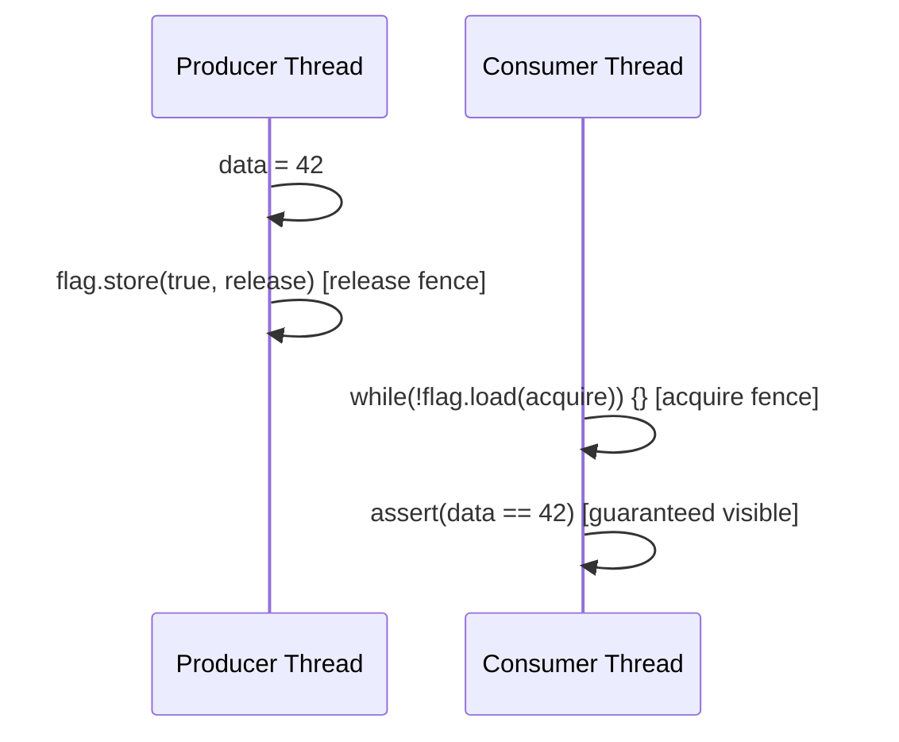

# Memory — Deep Dive

> Reference-grade. Stack unwinding, shared_ptr internals, placement new, pmr, and the memory model.

---

## Stack Unwinding Through Destructors

When an exception is thrown, the C++ runtime performs **stack unwinding**: it walks back up the call stack, calling the destructor of every local object with a non-trivial destructor along the way, until it finds a matching `catch` handler (or reaches `main()` and calls `std::terminate()`).

The mechanism is the `.gcc_except_table` section in the compiled object file — a table of **landing pads** (addresses of `catch` blocks and cleanup code) indexed by the PC (program counter) range that can reach them. The unwind library (`libgcc_s`) uses this table to walk the stack and find cleanup actions.

The guarantee: if you are inside a scope when an exception is thrown, every local object whose constructor has completed will have its destructor called. This is the formal guarantee that makes RAII work. There is no partial cleanup — either the constructor ran to completion (and the destructor will run) or the constructor itself threw (and you never had the object).

The exception: `noexcept` functions. A function marked `noexcept` has no landing pads generated. If an exception propagates out of a `noexcept` function, the runtime calls `std::terminate()` directly — no stack unwinding, no destructors. This is why `std::terminate` can be your first sign of a bug in a `noexcept` destructor that throws.

**Destructors must not throw.** If destructor A throws during unwinding from exception X, C++ calls `std::terminate()`. The language has no mechanism to handle two simultaneous exceptions. Mark all destructors `noexcept` (the default for compiler-generated destructors).

---

## shared_ptr Reference Count Internals

A `shared_ptr<T>` is two pointers: one to the managed object, one to a **control block**. The control block contains:

- `atomic<long> strong_count` — number of `shared_ptr` copies. When this reaches zero, the managed object is destroyed.
- `atomic<long> weak_count` — number of `weak_ptr` copies + 1 (the +1 keeps the block alive while any `shared_ptr` exists). When this reaches zero, the control block itself is freed.
- `deleter` — a type-erased callable that destroys the managed object (default: `delete`).
- `allocator` — a type-erased allocator for the control block itself.
- (For `make_shared`) the managed object `T` is stored inline in the block.

```
make_shared<T>()  →  [ strong | weak | deleter | T_data ]  (one allocation)
shared_ptr(new T) →  [ strong | weak | deleter ] + [ T_data ]  (two allocations)
```

The single-allocation advantage of `make_shared` comes with a subtle trade-off: the object `T` cannot be freed until the weak count also reaches zero. With `shared_ptr(new T)`, the object is freed when strong count hits zero, and the control block is freed separately when weak count hits zero. With `make_shared`, you keep the object's memory (though not the object itself — its destructor runs at strong count = 0) alive until the last weak_ptr is gone. For large objects with lingering weak_ptrs, `shared_ptr(new T)` may use less peak memory.

---

## weak_ptr and the Cycle Problem

```cpp
struct Node {
    std::string name;
    std::shared_ptr<Node> next;  // CYCLE if last node points to first
    ~Node() { printf("Node %s destroyed\n", name.c_str()); }
};

{
    auto a = std::make_shared<Node>("A");
    auto b = std::make_shared<Node>("B");
    a->next = b;
    b->next = a;  // cycle: a → b → a
}
// Neither destructor prints. Both nodes are leaked.
```

Breaking the cycle: replace one link with `weak_ptr`:

```cpp
struct Node {
    std::string name;
    std::shared_ptr<Node> next;
    std::weak_ptr<Node> prev;  // observes without owning
    ~Node() { printf("Node %s destroyed\n", name.c_str()); }
};
```

`weak_ptr::lock()` atomically promotes a `weak_ptr` to a `shared_ptr` if the object still exists, returning an empty `shared_ptr` if it has been destroyed. This promotion is race-free: the atomic check-and-increment ensures no other thread can destroy the object between the check and the increment.

---

## Custom Deleters

`unique_ptr` and `shared_ptr` both accept custom deleters.

```cpp
// unique_ptr: deleter is part of the type
auto fp = std::unique_ptr<FILE, decltype(&fclose)>(
    fopen("log.txt", "w"), &fclose);

// shared_ptr: deleter is type-erased (stored in control block)
auto mapping = std::shared_ptr<void>(
    mmap(nullptr, 4096, PROT_READ|PROT_WRITE, MAP_ANONYMOUS|MAP_PRIVATE, -1, 0),
    [](void* p) { munmap(p, 4096); });
```

For `unique_ptr`, the deleter is a template parameter and is stored inline (zero overhead for stateless deleters via empty base optimization). For `shared_ptr`, the deleter is type-erased and stored in the control block — you pay pointer-to-function or small-callable overhead, but the `shared_ptr<T>` type itself does not change based on the deleter.

---

## Placement New and Aligned Storage

Placement new constructs an object at a specified address without allocating memory:

```cpp
alignas(int) char buf[sizeof(int)];
int* p = new(buf) int(42);  // constructs int at buf
// ... use *p ...
p->~int();                   // explicit destructor call (required for non-trivial types)
```

Rules:
- `buf` must be properly aligned for `T` (`alignas(T)` or `std::max_align_t`).
- You must call the destructor explicitly if `T` has a non-trivial destructor.
- Do NOT call `delete p` — you did not allocate with `new`, so `delete` is UB.

Minimal pool using placement new:

```cpp
template<typename T, std::size_t N>
class Pool {
    alignas(T) char storage_[N * sizeof(T)];
    std::size_t next_ = 0;
public:
    T* alloc(auto&&... args) {
        if (next_ >= N) throw std::bad_alloc{};
        return new(storage_ + next_++ * sizeof(T)) T(std::forward<decltype(args)>(args)...);
    }
    void free(T* p) { p->~T(); }  // no memory release — pool owns the storage
};
```

---

## std::pmr — Polymorphic Memory Resources

`std::pmr` (C++17, `<memory_resource>`) provides a virtual interface for memory allocation that can be swapped at runtime without changing container types:

```cpp
#include <memory_resource>

char buf[1024];
std::pmr::monotonic_buffer_resource arena(buf, sizeof(buf));

// Same container type, different allocator — passed as constructor arg
std::pmr::vector<int> v(&arena);
std::pmr::string s("hello", &arena);
```

Standard memory resources:
- `monotonic_buffer_resource` — bump allocator. Allocates from a fixed buffer, then falls back to upstream. `release()` frees all at once. No individual deallocation. Fastest option.
- `unsynchronized_pool_resource` — pool of fixed-size chunks per size class. Good for mixed-size allocations in single-threaded code.
- `synchronized_pool_resource` — same but thread-safe (mutex per pool). Use only if you need concurrent allocation.
- `null_memory_resource()` — throws `std::bad_alloc` on every allocation. Useful for testing: verifies a container does not allocate.

The key design: `pmr::vector<T>` is `std::vector<T, std::pmr::polymorphic_allocator<T>>`. The allocator holds a pointer to the `memory_resource`. Swapping the resource at runtime changes allocation behavior without a template parameter change.

---

## Arena Allocator Internals

A bump-pointer arena is the simplest fast allocator:

```
[ used | used | used | ...... free ...... ]
 ^                    ^
 buffer start         offset
```

Allocation: round `offset` up to the required alignment, check capacity, return `buffer + offset`, advance `offset` by the allocation size. O(1). No per-allocation metadata. No free list.

Alignment math: `aligned = (offset + align - 1) & ~(align - 1)`

This rounds `offset` up to the nearest multiple of `align`. `align` must be a power of two.

Reset: `offset = 0`. O(1). All previous allocations are now invalid (no destructors called by the arena — that is the caller's responsibility). If objects need destructors, the caller must call them before reset or use a destructor list.

Fragmentation: only at the end of a large allocation that doesn't fill the arena. No internal fragmentation (no per-block headers). External fragmentation does not apply to a single-arena model.

---

## The C++ Memory Model

The C++ memory model defines when one thread's writes are visible to another thread's reads. The default (`memory_order_seq_cst`) gives sequential consistency: all threads agree on a single total order of all operations on all atomic variables. This is the safest and most intuitive ordering — and the most expensive on architectures with weak memory models (ARM, POWER).

The acquire/release pair establishes a **synchronizes-with** relationship:



A store with `release` prevents all preceding writes from being reordered after it. A load with `acquire` prevents all subsequent reads from being reordered before it. If thread C reads the value written by P's `release` store (via an `acquire` load), then C is guaranteed to see all writes P made before the `release`.

Orderings from weakest to strongest:
- `relaxed` — no ordering. Only atomicity. Use for counters where you don't need ordering guarantees.
- `acquire` (loads) / `release` (stores) — one-directional. The workhorse of lock-free programming.
- `acq_rel` (RMW operations) — both acquire and release in one operation.
- `seq_cst` — total order. Default. Necessary when you need all threads to agree on the order of operations across multiple atomic variables.

---

## False Sharing and Cache Line Padding

Modern CPUs transfer memory in **cache lines** — typically 64 bytes on x86. The MESI protocol ensures that if two threads write to any two variables in the same cache line, only one can hold the line in "Modified" state at a time. The other thread must fetch the line (invalidating the first thread's copy), modify it, and write it back. This ping-pong between L1 caches (false sharing) can reduce throughput by 10× or more on contended counters.

Fix: pad hot counters to separate cache lines.

```cpp
#include <new>  // std::hardware_destructive_interference_size

struct alignas(std::hardware_destructive_interference_size) PaddedCounter {
    std::atomic<long> value{0};
};
// sizeof(PaddedCounter) == 64 on x86. Two threads can increment
// their own PaddedCounter concurrently without false sharing.
```

`std::hardware_destructive_interference_size` is typically 64 on x86. If unavailable (GCC 11 supports it in `<new>`), use `alignas(64)` directly.

Measuring false sharing: `perf stat -e cache-misses,cache-references ./program`. Expect to see cache-miss rate drop dramatically after padding.
