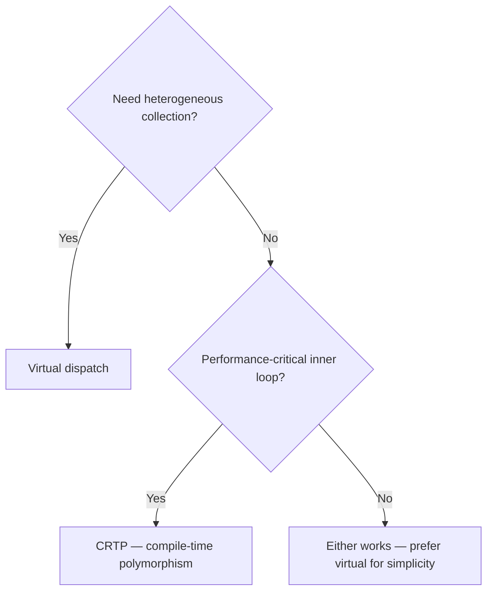

# OOP — Core

> The mental model. Read this before anything else in this chapter.

---

## The Rule of Zero

The best class is one where the compiler generates all the special members for you — and they are all correct. This is the Rule of Zero: if every data member is a value type or a smart pointer, you need no destructor, no copy/move constructor, and no copy/move assignment operator.

```cpp
class Config {
    std::string name_;
    std::vector<std::string> options_;
    std::unique_ptr<Backend> backend_;
    // No destructor — unique_ptr cleans up backend_
    // No copy — unique_ptr is not copyable (intentional: Config has single ownership)
    // Move is generated by the compiler — moves all three members
};
```

When all members handle themselves, the class handles itself. Reach for the Rule of Zero first. Only fall through to the Rule of Five when you are directly managing a raw resource.

---

## The Rule of Five

When your class directly owns a raw resource — a raw pointer, a file descriptor, a socket, a mutex — the compiler-generated special members will be wrong. You must write all five:

1. **Destructor** — release the resource
2. **Copy constructor** — duplicate the resource
3. **Copy assignment** — release current resource, duplicate source's resource
4. **Move constructor** — steal the resource, leave source empty
5. **Move assignment** — release current resource, steal source's resource

The cleanest way to implement copy assignment is the **copy-and-swap idiom**:

```cpp
class Buffer {
    char* data_;
    size_t size_;
public:
    Buffer(size_t n) : data_(new char[n]), size_(n) {}
    ~Buffer() { delete[] data_; }

    // Copy constructor: deep copy
    Buffer(const Buffer& o) : data_(new char[o.size_]), size_(o.size_) {
        std::copy(o.data_, o.data_ + o.size_, data_);
    }

    // Copy-and-swap: take by value (invokes copy ctor), swap, old data dies with parameter
    Buffer& operator=(Buffer o) noexcept {
        std::swap(data_, o.data_);
        std::swap(size_, o.size_);
        return *this;
    }

    // Move constructor: steal pointer, null source
    Buffer(Buffer&& o) noexcept : data_(o.data_), size_(o.size_) {
        o.data_ = nullptr; o.size_ = 0;
    }
    // Move assignment: covered by copy-and-swap when o is passed as rvalue
};
```

The copy-and-swap trick works because when `operator=` takes its argument by value, an rvalue (temporary or `std::move`-cast) invokes the move constructor instead of the copy constructor — giving you strong exception safety and move efficiency in one operator.

---

## Move Semantics in Plain English

Move is a "steal." When you move a `std::vector`, you copy the internal pointer, size, and capacity (three integers), then set the source's pointer to null. No heap allocation, no element copies — O(1) regardless of vector size.

The moved-from object is left in a **valid but unspecified state**: you can safely assign to it again or destroy it, but you cannot count on its value.

```cpp
std::vector<int> a = {1, 2, 3, 4, 5};
std::vector<int> b = std::move(a);  // O(1): pointers swapped
// a is now empty (valid but unspecified). b has the data.
```

The compiler picks move over copy automatically when the source is an rvalue — a temporary or an expression cast with `std::move`. **`std::move` does not move anything.** It is a cast to rvalue reference (`T&&`). The actual moving is done by the move constructor or move assignment operator.

Rule of thumb: pass by value and let the compiler choose copy vs move. Return by value — NRVO (Named Return Value Optimization) usually eliminates the copy entirely.

---

## Virtual vs CRTP



**Virtual dispatch:** The compiler stores a `vptr` (pointer to vtable) in every polymorphic object. A virtual call `obj->foo()` dereferences the vptr, loads the function pointer from the vtable slot for `foo`, and calls it. Overhead: one indirect call, prevents inlining. Benefit: you can put `Dog*` and `Cat*` in the same `vector<Animal*>` and call `speak()` on each.

**CRTP (Curiously Recurring Template Pattern):** `Base<Derived>` calls `static_cast<Derived*>(this)->impl()`. This is a direct call — the compiler knows the type at compile time. Zero overhead, full inlining. But: `Base<Dog>` and `Base<Cat>` are different types. You cannot mix them in a container without type erasure.

When you need polymorphism in a performance-critical inner loop (think: physics engine updating thousands of entities per frame), measure virtual against CRTP. On modern CPUs with good branch prediction, the difference is often negligible — but when it is not, CRTP wins.

---

## Production Rules

- Declare destructors `virtual` in base classes intended for polymorphic deletion. Forgetting this is undefined behavior when deleting a derived object through a base pointer.
- Prefer `= default` and `= delete` over empty implementations. Explicit intent is better than implicit.
- Mark `final` classes and functions that you know will not be overridden — enables devirtualization.
- Mark single-argument constructors `explicit` to prevent implicit conversions.
- Never return polymorphic objects by value from virtual functions — slicing kills derived-class state silently.
- When in doubt between Rule of Zero and Rule of Five: if you are writing a destructor, write all five.

---

## Lab

Atlas's `projects/02-foundation/include/foundation/oop/` implements:
- `rules.hpp` — full Rule of 0/3/5 showcase with `Buffer::operator=(Buffer other)` (copy-and-swap)
- `crtp.hpp` — CRTP mixins: `Printable<D>`, `Comparable<D>`, zero vtable
- `virtual_design.hpp` — NVI pattern (`Reader::read()` controls pre/post), diamond inheritance with `virtual` base

Run: `ctest --preset debug -R test_oop` from `projects/02-foundation/` to see all 10 tests pass.
