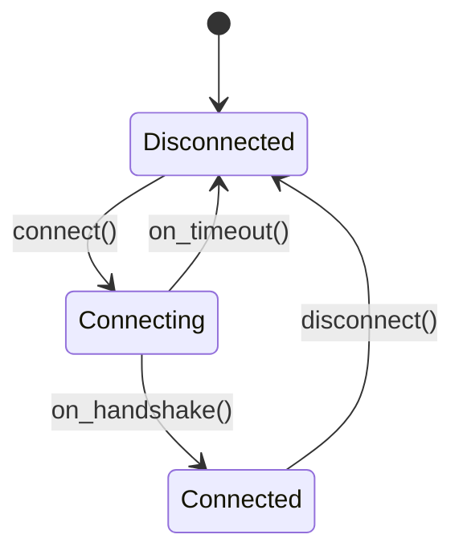

# Type System — Core

> The mental model. Read this before anything else in this chapter.

---

## Make Illegal States Unrepresentable

Every time you write `int` where you mean "a user ID," you create an opportunity for a bug. Every time you return `nullptr` where you mean "no value," you create an opportunity for a null dereference. Every time you pass a float as meters when the function expects seconds, the compiler says nothing because they are the same type.

The type system is a free, compile-time bug detector. Using it well means encoding your domain logic into types so that incorrect programs fail to compile rather than fail at runtime. This principle — making illegal states unrepresentable — is the most powerful tool in C++ for writing correct code at scale.

Three practices get you most of the way there:

1. Use strong types instead of raw ints/doubles for domain concepts.
2. Use `std::optional` instead of sentinel values or nullable pointers.
3. Use `std::variant` instead of inheritance for closed sets of alternatives.

---

## Strong Typedefs: Preventing int Aliasing Bugs

```cpp
using Meters  = double;  // type alias — NOT a new type
using Seconds = double;  // same underlying type as Meters

void move_robot(Meters distance, Seconds time);
move_robot(5.0, 3.0);     // compiles — correct
move_robot(3.0, 5.0);     // compiles — arguments swapped — BUG
```

A type alias creates a new name, not a new type. The compiler cannot distinguish `Meters` from `Seconds`. A strong typedef wraps the underlying type in a struct, creating a genuinely distinct type:

```cpp
template<typename T, typename Tag>
struct StrongType {
    explicit StrongType(T v) : value_(v) {}
    T value() const { return value_; }
private:
    T value_;
};

struct MetersTag  {};
struct SecondsTag {};
using Meters  = StrongType<double, MetersTag>;
using Seconds = StrongType<double, SecondsTag>;

void move_robot(Meters distance, Seconds time);
move_robot(Meters{5.0}, Seconds{3.0});  // compiles
move_robot(Seconds{3.0}, Meters{5.0}); // compile error — types wrong
move_robot(5.0, 3.0);                  // compile error — no implicit conversion
```

Zero runtime overhead: the struct wraps one `double`, the compiler eliminates the wrapper. The cost is only at compile time. This pattern prevents entire categories of unit-confusion bugs — the kind that led to the Mars Climate Orbiter crash in 1999.

---

## optional, variant, and Expected

Three types for three situations:

**`std::optional<T>`** — "this value might not exist":
```cpp
std::optional<std::string> find_user(int id);

auto user = find_user(42);
if (user.has_value()) {
    printf("Found: %s\n", user->c_str());
}
// Or: user.value_or("anonymous")
```
Use `optional` instead of returning `nullptr`, -1, or any other sentinel value. The optionality is explicit in the type — callers cannot forget to check.

**`std::variant<T1, T2, ...>`** — "this is exactly one of these types":
```cpp
using Shape = std::variant<Circle, Rectangle, Triangle>;

double area(const Shape& s) {
    return std::visit(overloaded{
        [](const Circle& c)    { return 3.14159 * c.radius * c.radius; },
        [](const Rectangle& r) { return r.width * r.height; },
        [](const Triangle& t)  { return 0.5 * t.base * t.height; }
    }, s);
}
```
Unlike an `if`/`else` chain, `std::visit` is exhaustive — if you add a new alternative to the variant and forget to update the visitor, it is a compile error, not a silent skip.

**`Expected<T, E>`** (manual for GCC 11, `std::expected` in C++23) — "either success or typed error":
```cpp
Expected<int, std::string> parse_port(const std::string& s);

auto result = parse_port(argv[1])
    .and_then(validate_range)
    .and_then(bind_socket);
```
Error propagation composes without `if` guards at every step.

---

## The Type System as a State Machine

Model your state machine as types, not enums:



With a `variant<Disconnected, Connecting, Connected>`, the active state is the type. A `send()` function that only accepts a `Connected` connection refuses to compile on a `Disconnected` connection — the incorrect state is unrepresentable at the call site. With an enum + switch, the compiler accepts `send()` in any state; the wrong state is only caught at runtime.

---

## Production Rules

- Use `enum class` instead of `enum` — prevents implicit conversion to int and name pollution.
- Use `std::optional<T>` for values that may not exist — never return -1, nullptr, or a "magic value."
- Create strong types for domain concepts (UserId, Timestamp, Meters) — not for every int.
- Use `std::variant` for closed discriminated unions — when the set of alternatives is fixed and known at compile time.
- Add `[[nodiscard]]` to functions returning `optional` or error values — prevents silent discard.
- Use `explicit` on all single-argument constructors — prevents accidental implicit conversions.
- Add `= delete` to copy constructors of handle types that should not be copied — makes misuse a compile error.

---

## Lab

Atlas's `projects/02-foundation/include/foundation/types/` implements:
- `strong_type.hpp` — `StrongType<T, Tag>` with UDLs, phantom types, spaceship operator
- `variant_patterns.hpp` — `overloaded<Fs...>` visitor, exhaustive dispatch
- `expected.hpp` — `Expected<T,E>` with `.and_then()`, `.or_else()` monadic chains

Run: `ctest --preset debug -R test_types` from `projects/02-foundation/`.
