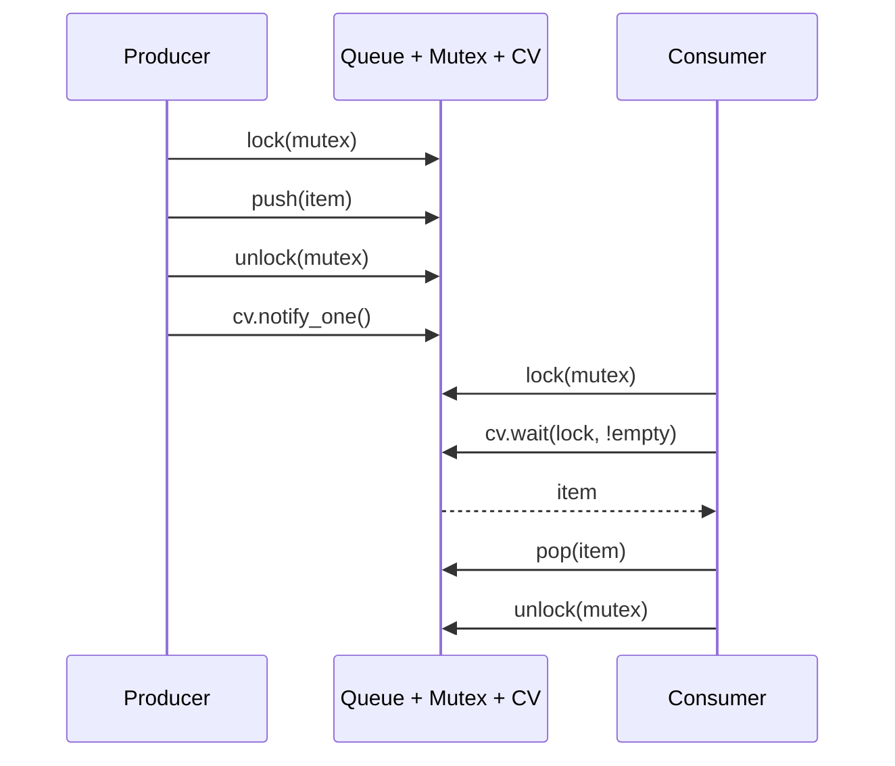

# Core: Concurrency in C++

## The Three Problems

### Data Races

A data race occurs when two threads access the same memory location concurrently, at least one of the accesses is a write, and there is no synchronization between the accesses.

The consequence is not "you might get the wrong value." The consequence is **undefined behaviour**. The C++ standard explicitly says a program with a data race has undefined behaviour, and compilers exploit this. A compiler seeing code that cannot have a data race under the abstract machine may eliminate synchronization, reorder stores, or generate code that appears to work 99.9% of the time and then catastrophically fails under specific CPU or optimization conditions.

"I know the write finishes before the read because of the sleep" is not synchronization. It is wishful thinking. The standard does not recognize timing as a synchronization mechanism.

### Race Conditions

A race condition is a correctness bug where the outcome of a computation depends on the timing or scheduling of threads. Race conditions can exist even when there is no data race — with proper synchronization, a program can still have bugs because the order of synchronized operations is non-deterministic.

Example: two threads each check `if (balance >= amount) withdraw(amount)`. Even with a mutex around each operation individually, the check-then-act sequence can interleave and allow both threads to withdraw when only one should succeed. Fix: hold the lock for the entire check-then-act sequence.

Race conditions are logic bugs. Data races are language-level undefined behaviour. Both are bad. They are different.

### The Memory Model

Modern CPUs do not execute stores in program order from the perspective of other cores. A store on core 0 may sit in a store buffer, write-combining buffer, or L1 cache long before it propagates to core 1's view of memory. The C++ memory model defines **when writes become visible** to other threads, and the answer is: only when you use the right synchronization.

On x86, the hardware provides strong ordering (TSO — Total Store Order): stores from one thread become visible to others in order, and loads see the latest committed store. On ARM and POWER, the hardware is weaker: reordering is more aggressive. C++ abstract machine targets the weakest reasonable model, so portable code must not rely on x86's strength.

Three concepts define the model:
- **Sequenced-before**: within a single thread, statements execute in program order.
- **Synchronizes-with**: a store with `release` synchronizes-with a load with `acquire` that reads the stored value.
- **Happens-before**: if A sequenced-before B, or A synchronizes-with B, or there is a transitive chain, then A happens-before B — and all of A's effects are visible when B executes.

Without a happens-before edge between a write and a read, no guarantee exists.

---

## The Three Tools

### Mutex + unique_lock

`std::mutex` provides mutual exclusion: only one thread holds the lock at a time. Any code protected by the same mutex is serialized — no two threads execute it simultaneously.

```cpp
std::mutex mu;
int shared = 0;

void increment() {
    std::unique_lock<std::mutex> lock(mu);  // acquires on construction
    ++shared;
}                                            // releases on destruction (RAII)
```

`std::unique_lock` is the standard RAII wrapper. Use it over `std::lock_guard` when you need deferred locking, manual unlock, or to pass the lock to a condition variable. Use `std::lock_guard` when none of those apply — it is slightly cheaper.

Mutexes are blocking: a thread waiting for a locked mutex is descheduled by the OS until the lock is available. For most workloads, contention is rare and mutex overhead is negligible. Profile before dismissing them.

### Atomic + memory_order

`std::atomic<T>` provides lock-free operations on small types (bool, integers, pointers). Operations appear instantaneous to other threads — no partial writes, no torn reads.

```cpp
std::atomic<int> counter{0};
counter.fetch_add(1, std::memory_order_relaxed);  // no ordering, just atomicity
```

Atomics are non-blocking: no thread waits. But they provide weaker guarantees than mutexes unless you specify the right memory ordering. `std::memory_order_relaxed` provides only atomicity — no ordering relative to other memory operations. `std::memory_order_seq_cst` (the default) provides full sequential consistency — safe, but the most expensive.

**Do not reach for atomics as a default.** Atomics are harder to reason about than mutexes. Lock-free code is subtle. Measure first; most programs are not bottlenecked on mutex contention.

### Condition Variable

A condition variable lets a thread wait until a condition becomes true, without spinning. The canonical pattern is producer-consumer:

```cpp
std::mutex mu;
std::queue<int> q;
std::condition_variable cv;

// Producer
{
    std::unique_lock<std::mutex> lock(mu);
    q.push(item);
}
cv.notify_one();

// Consumer
std::unique_lock<std::mutex> lock(mu);
cv.wait(lock, [&]{ return !q.empty(); });  // atomically releases lock and waits
int item = q.front();
q.pop();
```

`cv.wait(lock, pred)` is equivalent to `while (!pred()) cv.wait(lock)` — it handles spurious wakeups automatically. Always use the predicate form.

---

## Prefer jthread

`std::thread` (C++11) is joinable or detached. If a `std::thread` goes out of scope while joinable — neither joined nor detached — the program calls `std::terminate`. This is a design flaw that bites every C++ programmer once.

`std::jthread` (C++20) joins on destruction. It is RAII for threads. There is no reason to use `std::thread` in new C++20 code.

```cpp
{
    std::jthread t([]{
        std::this_thread::sleep_for(std::chrono::milliseconds(100));
        std::cout << "done\n";
    });
}  // joins here automatically — no std::terminate risk
```

`std::jthread` also supports **cooperative cancellation** via `std::stop_token`. The thread receives a `stop_token` as its first parameter; the caller requests cancellation with `t.request_stop()`. The thread checks `stop_token::stop_requested()` at its own convenience — it is cooperative, not preemptive.

```cpp
std::jthread worker([](std::stop_token st) {
    while (!st.stop_requested()) {
        do_work();
    }
});
// Later:
worker.request_stop();  // sets the flag; worker exits at its next check
```

---

## The Rule: Protect All Shared Mutable State

If two or more threads can access the same data and at least one access is a write, you need synchronization. No exceptions.

"I know the write finishes first" — data race.
"The threads are on different cores and the variable is in a register" — data race.
"It's just a bool" — data race (unless it is `std::atomic<bool>`).
"I only write once at startup" — still needs happens-before to the reads.

**Use ASan + TSan** (in Docker or native Linux) to detect violations during testing. ASan detects memory corruption; TSan detects data races at runtime. The 2-5x slowdown is acceptable in test builds. You cannot reason your way to a race-free program with high confidence in non-trivial code — use the tools.

In WSL2, TSan cannot execute due to a kernel virtual-memory mapping constraint. To use TSan:
```bash
# In Docker:
docker run --rm -v $(pwd):/workspace -w /workspace gcc:11 \
  g++ -std=c++20 -fsanitize=thread -o prog prog.cpp && ./prog
```

---

## Mermaid: Producer-Consumer with condition_variable



---

## Production Rules

1. **Default to `unique_lock` + `mutex`.** Lock-free is not your default. It is an optimization you apply after profiling proves the mutex is the bottleneck.
2. **Use `lock_guard` for simple scopes** where you do not need deferred locking or condition variables.
3. **Never hold a lock while calling user code.** If a callback or virtual function you call tries to acquire the same lock, you deadlock. Release the lock, call user code, reacquire if needed.
4. **Prefer `jthread` over `thread`.** There is no scenario where the old termination-on-out-of-scope behaviour is desirable.
5. **Use `stop_token` for cancellation.** Do not use a `std::atomic<bool>` stop flag — `stop_token` provides the same mechanism with better semantics and `std::stop_source` / `std::stop_callback` integration.
6. **Measure before going lock-free.** Lock-free data structures are subtle, hard to test, and often not faster than a well-designed mutex-based structure. Lock-free shines in high-contention, cache-hot, latency-critical paths — not everywhere.
7. **Lock ordering prevents deadlocks.** When acquiring multiple mutexes, always acquire them in the same order. Or use `std::scoped_lock(mu1, mu2)` which uses deadlock-avoidance internally.

---

## Lab

`projects/02-foundation/include/foundation/concurrency/` contains three implementations that directly correspond to this chapter's theory:

- `lock_free_queue.hpp`: Single-producer single-consumer ring buffer using `acquire`/`release` atomics and cache-line padding. The production version of `examples/01_spsc_queue.cpp`.
- `thread_pool.hpp`: Work-queue thread pool with `jthread`, `packaged_task`, and cooperative shutdown. The production version of `examples/02_thread_pool.cpp`.
- `coroutine_task.hpp`: An eager coroutine task type — `promise_type` with `initial_suspend` returning `std::suspend_never`, value storage, and `co_await` support.

Run the tests:
```bash
cd projects/02-foundation
cmake --preset debug
cmake --build --preset debug
ctest --preset debug -R test_concurrency
```
