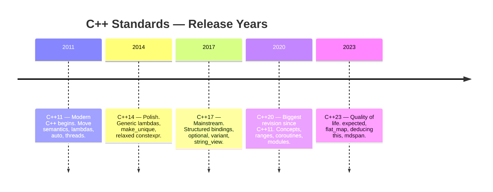

# Chapter 07: Modern C++ — Standards Tour (C++11 through C++23)

> The capstone of Pillar 1. Every previous chapter (memory, OOP, templates, type system,
> design patterns, concurrency) taught you *how* C++ works. This chapter teaches you *when*
> each tool arrived and *why* the committee added it — so you can read any modern codebase
> and immediately understand what era it was written in.

---

## Table of Contents

| Section | What You Will Learn |
|---------|---------------------|
| [core.md](core.md) | One-page summary tables for C++11–23: top 5 features per standard with "why it matters" |
| [deep-dive.md](deep-dive.md) | Full reference per standard — every major feature, code patterns, compiler notes |
| [interview.md](interview.md) | 8 interview Q&A with traps and follow-ups |
| [examples/01_cpp11_cpp14.cpp](examples/01_cpp11_cpp14.cpp) | Runnable demos: auto, lambdas, move, constexpr, variadic, make_unique, generic lambdas |
| [examples/02_cpp17.cpp](examples/02_cpp17.cpp) | Runnable demos: structured bindings, if constexpr, optional, variant, string_view, fold expressions |
| [examples/03_cpp20.cpp](examples/03_cpp20.cpp) | Runnable demos: concepts, ranges/views, jthread, span, three-way comparison, consteval |

---

## Prerequisites

Complete all previous chapters before this one — this chapter *synthesises* them:

| Chapter | Why It Matters Here |
|---------|---------------------|
| 01-memory | Move semantics, RAII, smart pointers, `std::span` all have memory roots |
| 02-oop | Defaulted comparisons (`<=>`), CTAD, virtual dispatch evolution |
| 03-templates | Concepts, ranges, variadic packs, CTAD |
| 04-type-system | `decltype`, `auto`, type traits, `std::variant`, `std::optional` |
| 05-design-patterns | Type erasure, CRTP, policy-based design enabled by modern features |
| 06-concurrency | `std::jthread`, `std::latch`, `std::barrier`, coroutines |

---

## Standards Timeline



---

## Time Estimate

| Activity | Time |
|----------|------|
| core.md (summary tables) | 30 minutes |
| deep-dive.md (full reference) | 3–4 hours |
| examples (all three, run and understand) | 2–3 hours |
| interview.md (self-test) | 45 minutes |
| **Total** | **6–8 hours** |

---

## Compiler Notes (GCC 11.4.0 on WSL2)

This workspace uses GCC 11.4.0. Feature availability:

| Feature | Standard | GCC 11 Support |
|---------|---------|----------------|
| `std::format` | C++20 | GCC 13+ only — **not available** |
| `std::expected<T,E>` | C++23 | GCC 12+ only — **not available** |
| `std::generator<T>` | C++23 | GCC 14+ only — **not available** |
| `std::flat_map` | C++23 | GCC 13+ only — **not available** |
| Everything else in examples | C++20 | Available |

The examples use `printf`/`cout` wherever `std::format` would be used in production.

---

## How to Run the Examples

```bash
export PATH="$(python3 -c 'import cmake; print(cmake.CMAKE_BIN_DIR)'):$PATH"

g++ -std=c++20 -Wall -Wextra -o /tmp/ch07_ex1 \
    tutorial/pillar-1-language/07-modern-cpp/examples/01_cpp11_cpp14.cpp && /tmp/ch07_ex1

g++ -std=c++20 -Wall -Wextra -o /tmp/ch07_ex2 \
    tutorial/pillar-1-language/07-modern-cpp/examples/02_cpp17.cpp && /tmp/ch07_ex2

g++ -std=c++20 -Wall -Wextra -o /tmp/ch07_ex3 \
    tutorial/pillar-1-language/07-modern-cpp/examples/03_cpp20.cpp && /tmp/ch07_ex3
```
