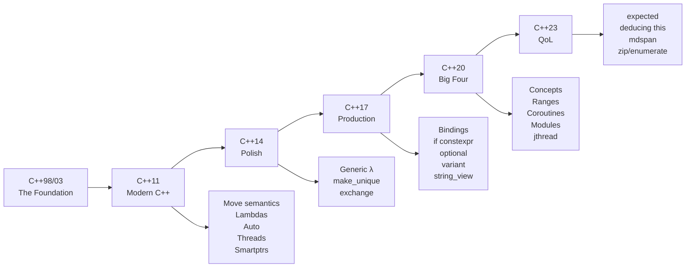

# Chapter 07: Deep Dive — C++11 Through C++23 Complete Reference

---

## C++11 — The Modern C++ Foundation

### Move Semantics and Rvalue References

Before C++11 every value was either an lvalue (has a name/address) or a copy. Returning
`std::vector<Widget>` from a function triggered a deep copy of every element.

**The core idea:** distinguish values that *own* resources (lvalues) from temporary values
that are *about to be destroyed* (rvalues). Rvalues can be *moved from* — their resources
stolen rather than copied.

```cpp
// T&& is an rvalue reference — binds only to temporaries
void steal(std::vector<int>&& v) {
    internal_ = std::move(v);  // O(1) — pointer swap, not O(n) copy
}

steal(make_big_vector());   // OK — temporary binds to &&
```

**`std::move`** is a cast to rvalue reference — it does NOT move. It tells the compiler
"treat this as a temporary so the move constructor/assignment can be selected."

**Move constructor/assignment pattern:**

```cpp
class Buffer {
    int* data_; size_t size_;
public:
    // Move constructor: steal from other, leave it in valid empty state
    Buffer(Buffer&& other) noexcept
        : data_(other.data_), size_(other.size_) {
        other.data_ = nullptr;
        other.size_ = 0;
    }
    // Move assignment
    Buffer& operator=(Buffer&& other) noexcept {
        if (this != &other) {
            delete[] data_;
            data_ = other.data_;  size_ = other.size_;
            other.data_ = nullptr; other.size_ = 0;
        }
        return *this;
    }
};
```

### Perfect Forwarding and Universal References

**Universal reference:** `T&&` where `T` is a *deduced* template parameter. This is NOT
an rvalue reference — it collapses to `T&` for lvalues and `T&&` for rvalues.

```cpp
template<typename T>
void wrapper(T&& arg) {
    // std::forward preserves the value category of arg
    target(std::forward<T>(arg));
}
```

Reference collapsing rules: `T& &&` → `T&`, `T&& &&` → `T&&`. This is what makes
`std::forward` work.

### Lambda Expressions

Lambdas are syntactic sugar for anonymous function objects (functors). The compiler
generates a class with `operator()`.

```cpp
// Capture by value (copy of x at capture time)
int x = 10;
auto f = [x](int y) { return x + y; };  // x captured by copy

// Capture by reference (reference to x — beware dangling!)
auto g = [&x](int y) { x += y; };      // x captured by reference

// Capture by move (C++14 init-capture)
std::vector<int> v{1,2,3};
auto h = [captured = std::move(v)]() { return captured.size(); };

// mutable: allows modifying captured-by-value copies
auto counter = [n = 0]() mutable { return ++n; };
```

**Capture-by-value is NOT always safe.** If the lambda outlives the captured variable
(stored in a `std::function`, passed to another thread), and captured by reference,
you have undefined behaviour. Capture by value avoids this but silently copies.

Note: generic lambdas (`auto` params) are **C++14**, not C++11.

### `auto` and Type Deduction

`auto` uses template argument deduction rules. Key differences from `decltype`:

```cpp
int x = 5;
const int& rx = x;

auto  a = rx;  // a is int  (strips &, strips const) — deduced like pass-by-value
auto& b = rx;  // b is const int& (ref preserved because auto& was written)

decltype(rx)   c = rx;  // c is const int& (exact type of expression)
decltype(auto) d = rx;  // d is const int& (decltype rules applied to initialiser)
```

**Trailing return types** allow the return type to refer to parameter names:

```cpp
template<typename T, typename U>
auto add(T t, U u) -> decltype(t + u) { return t + u; }  // C++11
// C++14: just write auto add(T t, U u) { return t + u; }
```

### Range-Based For

```cpp
std::vector<int> v{1,2,3,4,5};
for (auto& x : v) x *= 2;          // by reference — modifies v
for (const auto& x : v) use(x);    // by const ref — no copy
for (auto x : v) use(x);           // by value — copies each element
```

Works on anything that has `begin()` and `end()` (member or ADL-found).

### `nullptr`, `enum class`, Uniform Initialization

```cpp
// nullptr has type std::nullptr_t — no ambiguity
void f(int);    // #1
void f(int*);   // #2
f(NULL);        // ERROR: ambiguous. f(nullptr) calls #2.

// enum class — scoped, no implicit int conversion
enum class Color { Red, Green, Blue };
Color c = Color::Red;   // must qualify
// int i = c;           // ERROR — no implicit conversion

// Uniform initialization — no narrowing conversions
int arr[]{1, 2, 3};
std::vector<int> v{1, 2, 3, 4};
Widget w{arg1, arg2};   // if Widget has matching constructor or is aggregate
```

### `constexpr` Functions (C++11 Restrictions)

In C++11, `constexpr` functions could contain only a single `return` statement (plus
`static_assert`, `typedef`, `using`). No loops, no local variables.

```cpp
constexpr int factorial(int n) {
    return n <= 1 ? 1 : n * factorial(n - 1);  // recursive OK, loops NOT (C++11)
}
static_assert(factorial(5) == 120, "");
```

### Initializer Lists

`std::initializer_list<T>` is a lightweight view of a brace-initializer. Constructors
taking it are preferred over other constructors when brace-init is used:

```cpp
std::vector<int> v{1, 2, 3};  // calls vector(initializer_list<int>)
std::vector<int> w(3, 0);     // calls vector(size_t, int) — 3 zeros
```

This is the "most vexing parse" successor — brace-init never parses as a function
declaration.

### Variadic Templates

```cpp
// Recursive variadic — C++11 style
template<typename T>
T sum(T t) { return t; }

template<typename T, typename... Rest>
T sum(T t, Rest... rest) { return t + sum(rest...); }

// C++17 fold expression: (args + ...) — see C++17 section
```

### `static_assert`, `noexcept`

```cpp
static_assert(sizeof(int) == 4, "Need 32-bit int");  // compile-time
static_assert(std::is_trivially_copyable_v<int>);    // C++17 variable template

void f() noexcept;          // promises no exception — enables optimizations
void g() noexcept(false);   // explicitly may throw
template<typename T>
void h(T t) noexcept(noexcept(t.method()));  // conditional noexcept
```

### Threading (C++11)

```cpp
#include <thread>
#include <mutex>
#include <condition_variable>
#include <atomic>

std::mutex mtx;
std::condition_variable cv;
std::atomic<int> counter{0};

std::thread t([&]() {
    std::unique_lock lk(mtx);
    cv.wait(lk, [&]{ return ready; });
    ++counter;
});
t.join();  // must join or detach — or terminate() is called
```

`std::thread` does NOT auto-join. Forgetting to join causes `std::terminate`. This was
fixed in C++20 with `std::jthread`.

### Smart Pointers and `std::function`

```cpp
auto p = std::make_shared<Widget>(args);   // reference-counted
auto q = std::unique_ptr<Widget>(new Widget(args));  // C++11 — use make_unique in C++14

std::function<int(int,int)> f = [](int a, int b){ return a+b; };
// std::function has overhead (type erasure + heap) — use auto& for local lambdas
```

---

## C++14 — Polishing the Foundation

### Generic Lambdas

```cpp
auto add = [](auto a, auto b) { return a + b; };
// The compiler generates: template<typename A, typename B> auto operator()(A a, B b)

add(1, 2);       // int
add(1.5, 2.5);   // double
add(std::string{"a"}, std::string{"b"});  // string
```

### Relaxed `constexpr`

C++14 removed the single-return restriction. `constexpr` functions can now have:
- Local variable declarations
- `if`/`else`, `for`, `while`, `do-while`
- Multiple `return` statements

```cpp
constexpr int factorial(int n) {
    int result = 1;
    for (int i = 2; i <= n; ++i) result *= i;  // NOT allowed in C++11
    return result;
}
```

### `make_unique<T>()`

The missing partner to C++11's `make_shared`. Never write `new` directly:

```cpp
// Before C++14 — exception-unsafe if second allocation throws before unique_ptr takes ownership
f(std::unique_ptr<Widget>(new Widget()), make_gadget());

// C++14 — safe: make_unique performs allocation+construction atomically
f(std::make_unique<Widget>(), make_gadget());
```

### Return Type Deduction

```cpp
auto square(int x) { return x * x; }  // deduced as int

// decltype(auto) preserves references:
int x = 10;
decltype(auto) get_ref() { return x; }  // returns int& (not int)
```

### Variable Templates

```cpp
template<typename T>
constexpr T pi = T(3.14159265358979323846);

float  f = pi<float>;   // 3.14159f
double d = pi<double>;  // 3.14159265358979...
```

### `std::exchange`

```cpp
// exchange(obj, new_val) — sets obj=new_val, returns old value
// The canonical move constructor pattern:
Buffer(Buffer&& other) noexcept
    : data_(std::exchange(other.data_, nullptr)),
      size_(std::exchange(other.size_, 0)) {}
```

### `std::integer_sequence`

Enables compile-time index sequences for tuple unpacking and parameter pack indexing:

```cpp
template<typename Tuple, std::size_t... I>
void print_tuple_impl(const Tuple& t, std::index_sequence<I...>) {
    ((std::cout << std::get<I>(t) << ' '), ...);  // C++17 fold
}

template<typename... Ts>
void print_tuple(const std::tuple<Ts...>& t) {
    print_tuple_impl(t, std::make_index_sequence<sizeof...(Ts)>{});
}
```

---

## C++17 — Production Ready

### Structured Bindings

```cpp
// Pair decomposition
auto [min_it, max_it] = std::minmax_element(v.begin(), v.end());

// Map iteration — no more .first/.second
for (auto& [key, value] : my_map) {
    printf("%s -> %d\n", key.c_str(), value);
}

// Aggregate struct decomposition
struct Point { int x, y; };
Point p{3, 4};
auto [px, py] = p;  // px=3, py=4

// Note: structured bindings do NOT always create copies.
// auto& [k, v] = *it — k and v are references to the map node's members.
```

**Common trap:** "structured bindings create copies." Only `auto [k,v]` copies the pair.
`auto& [k,v]` or `const auto& [k,v]` bind by reference.

### `if constexpr`

```cpp
template<typename T>
std::string describe(T val) {
    if constexpr (std::is_integral_v<T>) {
        return "integer: " + std::to_string(val);
    } else if constexpr (std::is_floating_point_v<T>) {
        return "float: " + std::to_string(val);
    } else {
        return "other";
        // The OTHER branches are NOT instantiated for this T —
        // they don't even need to be well-formed for the given T.
    }
}
```

The discarded branch is **not instantiated** — it may contain code that would be ill-formed
for the current `T`, and it will still compile. This replaces `std::enable_if` and tag
dispatch for most use cases.

### `std::optional<T>`

```cpp
std::optional<std::string> find_name(int id) {
    if (db.contains(id)) return db[id].name;
    return std::nullopt;  // empty optional
}

auto name = find_name(42);
if (name) {
    printf("Found: %s\n", name->c_str());
}
// Or with value_or:
printf("%s\n", name.value_or("unknown").c_str());
```

C++23 adds monadic operations: `.and_then(f)`, `.transform(f)`, `.or_else(f)`.

### `std::variant<Ts...>` and `std::visit`

```cpp
using Shape = std::variant<Circle, Rectangle, Triangle>;

Shape s = Circle{5.0};

// Visitor pattern via std::visit
double area = std::visit([](auto& shape) {
    return shape.area();   // works if all types have area()
}, s);

// Overloaded helper for multiple lambda visitors:
template<typename... Ts> struct overloaded : Ts... { using Ts::operator()...; };
template<typename... Ts> overloaded(Ts...) -> overloaded<Ts...>;  // deduction guide

std::visit(overloaded{
    [](const Circle& c)    { printf("circle r=%.1f\n", c.radius); },
    [](const Rectangle& r) { printf("rect %dx%d\n", r.w, r.h); },
    [](const Triangle& t)  { printf("triangle\n"); }
}, s);
```

### `std::any`

Type-safe container for a single value of any type. Slower than `variant` (heap allocation
for large types). Use `variant` when the type set is known at compile time.

```cpp
std::any a = 42;
a = std::string{"hello"};
if (auto* p = std::any_cast<std::string>(&a)) {
    printf("%s\n", p->c_str());
}
```

### `std::string_view`

```cpp
// Zero-copy — does not own the string
void print_word(std::string_view sv) {
    printf("%.*s\n", (int)sv.size(), sv.data());
}

print_word("literal");           // no allocation
print_word(my_std_string);       // no copy
print_word(my_std_string.substr(3, 5));  // substr returns string — one allocation

// DANGER: never store string_view longer than the string it references
std::string_view dangling = std::string{"temp"};  // UB — temporary destroyed
```

### Guaranteed Copy Elision (Mandatory RVO)

Since C++17, returning a prvalue from a function is guaranteed to construct the object
in-place — no copy or move constructor is called, even if deleted:

```cpp
struct NoCopy {
    NoCopy() = default;
    NoCopy(const NoCopy&) = delete;
};
NoCopy make() { return NoCopy{}; }  // OK in C++17; error in C++11/14
```

### Fold Expressions

```cpp
// Unary right fold: (args op ...)
template<typename... Ts>
auto sum(Ts... args) { return (args + ...); }

// Unary left fold:  (... op args)
template<typename... Ts>
auto product(Ts... args) { return (... * args); }

// Binary fold with identity:
template<typename... Ts>
auto sum_with_init(Ts... args) { return (0 + ... + args); }  // handles empty pack
```

### CTAD (Class Template Argument Deduction)

Since C++17, template arguments can be deduced from constructor arguments — like function
templates, but for classes:

```cpp
std::pair p{42, "hello"s};   // deduced as std::pair<int, std::string>
std::vector v{1, 2, 3};      // deduced as std::vector<int>
std::mutex m;
std::lock_guard lk{m};       // deduced as std::lock_guard<std::mutex>
```

Custom deduction guides can control CTAD for your own types.

### C++17 Attributes

```cpp
[[nodiscard]] int compute();        // warn if return value ignored
[[maybe_unused]] int debug_id;      // suppress unused-variable warning
switch(x) {
    case 1: do_thing();
            [[fallthrough]];        // suppress fallthrough warning
    case 2: do_other(); break;
}
```

---

## C++20 — The Biggest Revision

### Concepts

Concepts are compile-time predicates on template parameters. They improve:
1. Error messages (constraint violation instead of 50-line template traceback)
2. Overloading (subsumption — more constrained concept wins)
3. Documentation (constraint is part of the interface)

```cpp
// Define a concept
template<typename T>
concept Addable = requires(T a, T b) {
    { a + b } -> std::convertible_to<T>;
};

// Use as a constraint
template<Addable T>
T add(T a, T b) { return a + b; }

// Abbreviated function template (equivalent)
auto add(Addable auto a, Addable auto b) { return a + b; }

// requires clause on function
template<typename T>
T add(T a, T b) requires Addable<T> { return a + b; }
```

**Standard library concepts** in `<concepts>`:
- `std::integral`, `std::floating_point`, `std::signed_integral`
- `std::copyable`, `std::movable`, `std::regular`, `std::semiregular`
- `std::invocable<F, Args...>`, `std::predicate<F, Args...>`
- `std::ranges::range<R>`, `std::ranges::sized_range<R>`

### Ranges and Views

The ranges library provides composable, lazy algorithms:

```cpp
#include <ranges>
#include <algorithm>

std::vector<int> v{1,2,3,4,5,6,7,8,9,10};

// View pipeline — evaluated lazily when iterated
auto result = v
    | std::views::filter([](int x){ return x % 2 == 0; })
    | std::views::transform([](int x){ return x * x; })
    | std::views::take(3);

for (int x : result) printf("%d ", x);  // 4 16 36

// Range algorithms — take ranges directly, not iterators
std::ranges::sort(v);
auto it = std::ranges::find(v, 5);
```

**Views are lazy** — no computation until iteration. A `views::filter | views::transform`
pipeline over 1 million elements does NOT allocate a vector.

**Common views:** `filter`, `transform`, `take`, `drop`, `reverse`, `iota`, `join`,
`split`, `elements` (for tuple-like ranges).

### Coroutines (`co_await`, `co_yield`, `co_return`)

Coroutines are functions that can be suspended and resumed. The language provides three
keywords; the *machinery* (promise type, awaitable) is user-defined or library-provided.

```cpp
// Generator — must define promise_type or use a library
// C++20 coroutine using a hand-rolled generator (simplified):
Generator<int> fibonacci() {
    int a = 0, b = 1;
    while (true) {
        co_yield a;           // suspend and yield a value
        std::tie(a, b) = std::make_pair(b, a + b);
    }
}

// co_await suspends until an awaitable completes:
Task<int> fetch_data() {
    auto data = co_await async_read(socket);  // suspend until data arrives
    co_return process(data);
}
```

The compiler transforms a coroutine into a state machine. The coroutine frame is heap-
allocated (but HALO optimization can elide this). This is the foundation for async I/O
libraries (Asio, libuv wrappers) and `std::generator` (C++23).

### `std::jthread` and `std::stop_token`

```cpp
// jthread auto-joins on destruction and supports cooperative cancellation
std::jthread worker([](std::stop_token st) {
    while (!st.stop_requested()) {
        do_work();
        std::this_thread::sleep_for(std::chrono::milliseconds(100));
    }
});
// Out of scope → destructor requests stop, then joins
```

`std::stop_token` enables cooperative (not forced) cancellation — the thread checks the
token and exits cleanly. Use `std::stop_callback` for automatic cleanup on stop request.

### Modules

Modules replace `#include`. A module interface unit exports declarations:

```cpp
// math.cppm (module interface)
export module math;

export int add(int a, int b) { return a + b; }

// Internal linkage — not exported:
static int internal_helper() { return 42; }
```

```cpp
// main.cpp
import math;
int main() { return add(1, 2); }
```

Benefits: macros from `math.cppm` do NOT leak into `main.cpp`; build system can cache
the compiled module interface (`.gcm` for GCC, `.ifc` for MSVC). Build system support
(CMake 3.28+, Ninja 1.11+) is still maturing as of 2024.

### Three-Way Comparison (`<=>`)

```cpp
struct Point {
    int x, y;
    // Generates ==, !=, <, >, <=, >= from this one declaration:
    auto operator<=>(const Point&) const = default;
};

std::vector<Point> pts{{3,1},{1,4},{1,5}};
std::ranges::sort(pts);  // uses <=>

// Custom ordering:
struct Priority {
    int value;
    std::strong_ordering operator<=>(const Priority& o) const {
        return value <=> o.value;  // strong: equal means identical
    }
};
// std::strong_ordering, std::weak_ordering, std::partial_ordering
```

### `consteval` and `constinit`

```cpp
consteval int square(int n) { return n * n; }
// consteval: MUST be evaluated at compile time — cannot be called at runtime
// constexpr: MAY be evaluated at compile time

static_assert(square(5) == 25);   // OK
// int x; square(x);              // ERROR — x not a constant expression

constinit int global = compute_at_startup();
// constinit: variable must be initialised with a constant expression
// (prevents static initialisation order fiasco)
// The variable itself is not const — it can be modified at runtime
```

### `std::span<T>`

```cpp
void process(std::span<int> data) {
    for (int& x : data) x *= 2;
}

int arr[]{1,2,3,4,5};
std::vector<int> v{1,2,3,4,5};
std::array<int,5> a{1,2,3,4,5};

process(arr);         // raw array
process(v);           // vector
process(a);           // std::array
process({arr, 3});    // first 3 elements
```

`std::span<T>` is a non-owning view — pointer + size. Zero overhead. The replacement for
`(T* data, size_t len)` pair parameters.

### C++20 Synchronization Primitives

```cpp
// std::latch — single-use countdown
std::latch start{num_threads};
// Each thread calls start.count_down(); main calls start.wait();

// std::barrier — reusable phase synchronization
std::barrier sync{num_threads, []{ /* called when all arrive */ }};
sync.arrive_and_wait();

// std::counting_semaphore<N>
std::counting_semaphore<10> sem{5};
sem.acquire();  // blocks if count == 0
sem.release();  // increments count
```

### Abbreviated Function Templates and Designated Initializers

```cpp
// Abbreviated function template — auto param = implicit template param
void print(const std::ranges::range auto& r) {
    for (const auto& x : r) std::cout << x << ' ';
}

// Designated initializers — like C99, finally in C++
struct Config { int width=800; int height=600; bool fullscreen=false; };
Config c{.width=1920, .height=1080};  // fullscreen stays false
```

---

## C++23 — Incremental Improvements

> GCC 11.4 does not support these features. They are described for knowledge and interview
> preparation. Use GCC 13+ or Clang 17+ to compile C++23 code.

### `std::expected<T, E>`

```cpp
#include <expected>

std::expected<int, std::string> parse(std::string_view s) {
    if (s.empty()) return std::unexpected("empty input");
    // ... parse ...
    return 42;
}

auto result = parse("42");
if (result) {
    printf("value: %d\n", *result);
} else {
    printf("error: %s\n", result.error().c_str());
}

// Monadic chaining (C++23):
auto final = parse(input)
    .and_then(validate)       // only called if parse succeeded
    .transform(to_string)     // only called if validate succeeded
    .or_else(log_error);      // only called if any step failed
```

### Deducing `this` (Explicit Object Parameter)

```cpp
struct Widget {
    // 'this' is now explicit — enables deduction of cv-qualifiers and value category
    template<typename Self>
    auto& value(this Self& self) { return self.value_; }

    // Enables recursive lambdas without std::function:
    auto fib = [](this auto self, int n) -> int {
        return n <= 1 ? n : self(n-1) + self(n-2);
    };
};
```

### `std::mdspan`

```cpp
#include <mdspan>

// Multi-dimensional non-owning view over contiguous memory
std::vector<double> data(6);
std::mdspan<double, std::extents<int,2,3>> matrix(data.data());

matrix[0,0] = 1.0;   // Note: comma-indexing, not matrix[0][0]
matrix[1,2] = 2.5;
```

### Ranges Additions

C++23 adds many new views: `views::zip`, `views::enumerate`, `views::chunk`,
`views::chunk_by`, `views::slide`, `views::stride`, `views::cartesian_product`,
`views::repeat`, `views::as_rvalue`, `views::join_with`.

```cpp
// views::enumerate — index + value
for (auto [i, val] : std::views::enumerate(v)) {
    printf("[%zu] = %d\n", i, val);
}

// views::zip — iterate multiple ranges in lock-step
for (auto [a, b] : std::views::zip(keys, values)) {
    map[a] = b;
}
```

### `std::print` and `std::println`

```cpp
#include <print>
std::println("Hello, {}!", name);   // no newline needed for println
std::print(stderr, "Error: {}\n", msg);
```

These write directly to a FILE* or `std::ostream` — faster than constructing a
`std::string` with `std::format` and then printing.

### `if consteval`

```cpp
constexpr int value(int n) {
    if consteval {
        // This branch only runs at compile time
        return compile_time_impl(n);
    } else {
        // This branch runs at runtime
        return runtime_impl(n);
    }
}
```

Complements `consteval` — allows a `constexpr` function to behave differently depending
on whether it is evaluated at compile time or runtime.

### `[[assume(expr)]]`

```cpp
void process(int* ptr, int n) {
    [[assume(n > 0)]];    // Tell the optimizer n is always positive
    [[assume(ptr != nullptr)]];
    // The compiler can now elide null/negative checks
    for (int i = 0; i < n; ++i) ptr[i] *= 2;
}
```

---

## Standards Evolution Diagram


