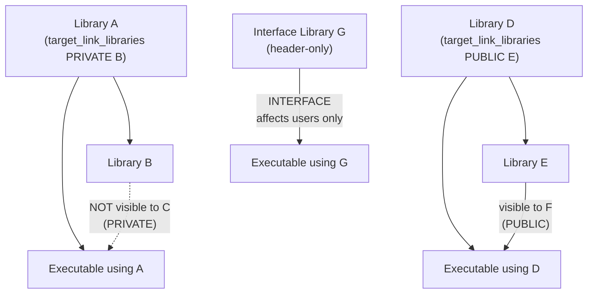

# CMake Core — The 20% That Covers 80%

## Targets Are Everything

Modern CMake has one organizing principle: the **target**. A target is a named build artifact — an executable, a static library, a shared library, or an interface (header-only) library. Every property (include directories, compile flags, linked libraries, compile definitions) belongs to a target, not to a directory.

This matters because targets compose. When target B links to target A, B automatically inherits everything A said it provides via `PUBLIC` or `INTERFACE`. There is no global state to pollute. There are no order-of-directory-traversal surprises. You add a target, you describe what it needs and what it provides, and CMake figures out the rest.

Before target-based CMake (circa 2.8 era), the idiom was directory-level commands:

```cmake
# OLD — DO NOT DO THIS
include_directories(${PROJECT_SOURCE_DIR}/include)
link_libraries(pthread)
add_definitions(-DUSE_FEATURE_X)
```

These commands affect every target defined after them in that directory and all subdirectories. The build mutates global state. Linking one library accidentally drags in its compile flags for your entire project. The modern equivalent:

```cmake
# NEW — do this
add_library(mylib STATIC src/mylib.cpp)
target_include_directories(mylib PUBLIC include/)
target_link_libraries(mylib PUBLIC pthread)
target_compile_definitions(mylib PRIVATE USE_FEATURE_X)
```

Now `include/` and `pthread` propagate to dependents automatically. `USE_FEATURE_X` stays private.

## The Three Visibility Levels

Every `target_*` command takes a visibility keyword. Getting this right is the difference between a modular CMake project and a spaghetti build.



**PRIVATE:** The dependency is an implementation detail. Consumers of this target do not inherit it.
- Use when: a library uses Boost internally but does not expose Boost types in its headers.

**PUBLIC:** The dependency is part of the interface. Consumers automatically inherit it.
- Use when: a library's headers `#include` another library's headers. That other library must be PUBLIC.

**INTERFACE:** Applies only to consumers, not to this target's own compilation. Used for header-only libraries.
- Use when: creating an alias or header-only library that just passes requirements to users.

## Presets Eliminate "Works on My Machine"

`CMakePresets.json` (introduced in CMake 3.19, v3 schema works with CMake 3.22+) is a declarative configuration file committed to the repository. It replaces `cmake -DCMAKE_BUILD_TYPE=Debug -DENABLE_SANITIZER_ADDRESS=ON -B build/asan` with:

```bash
cmake --preset asan
cmake --build --preset asan
ctest --preset asan
```

Every developer, CI server, and container runs identical configure commands. The preset file encodes inheritance (`"inherits": "base"`), so a `debug` preset and an `asan` preset share a common `base` without repeating the generator, binary directory, or export settings.

Key schema fields:
- `"binaryDir"` — where the build tree goes (e.g., `"${sourceDir}/build/${presetName}"`)
- `"generator"` — `"Unix Makefiles"` or `"Ninja"` (prefer Ninja when available)
- `"cacheVariables"` — equivalent to `-D` flags on the command line

## Package Management in 2026

C++ has no single canonical package manager. The landscape in 2026:

| Tool | Model | Best for |
|---|---|---|
| **CPM.cmake** | CMake script, FetchContent-based | Small projects, reproducible builds via SHA pinning |
| **vcpkg** | Microsoft-maintained, port tree | Windows-first teams, Visual Studio integration |
| **Conan 2.0** | Python-based, generator files | Large enterprises, complex dependency graphs |
| **FetchContent** (built-in) | Downloads at configure time | Simple deps, zero external tooling |

For interview purposes: know that the community has not converged, know the tradeoffs, and know how `FetchContent_Declare` + `FetchContent_MakeAvailable` works since it is the CMake-native approach.

## Production Rules

1. Never use directory-level commands (`include_directories`, `link_libraries`, `add_definitions`).
2. Always specify visibility (`PRIVATE`/`PUBLIC`/`INTERFACE`) — no exceptions.
3. Commit `CMakePresets.json`. Never commit `CMakeCache.txt` or the `build/` directory.
4. Use `cmake_minimum_required(VERSION 3.22)` as your floor for preset v3 support.
5. Use `gtest_discover_tests(target DISCOVERY_MODE PRE_TEST)` — sanitized binaries cannot run at configure time.
6. Enable `CMAKE_EXPORT_COMPILE_COMMANDS` in the base preset — tools like clang-tidy need it.
7. Never use `GLOB` for source files — it silently misses new files added after configure.
8. Prefer `target_compile_features(mytarget PRIVATE cxx_std_20)` over hardcoding `-std=c++20`.

## Lab

Open `projects/01-toolchain/` in this workspace. Relevant files:
- `CMakePresets.json` — presets including debug, asan, tsan, ubsan, coverage, pgo-generate, pgo-use, clang-tidy, cross-arm-linux
- `cmake/modules/Sanitizers.cmake` — `target_apply_sanitizers()` function
- `cmake/modules/StandardVersion.cmake` — `require_cpp20()` with INTERFACE detection
- `cmake/modules/StaticAnalyzers.cmake` — clang-tidy integration

Run the full test suite under ASan:
```bash
export PATH="$(python3 -c 'import cmake; print(cmake.CMAKE_BIN_DIR)'):$PATH"
cd projects/01-toolchain
cmake --preset asan
cmake --build --preset asan
ctest --preset asan --output-on-failure
```
